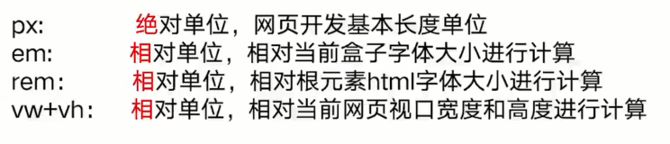

# css 面试题

- 你对盒子模型理解多少？
- 谈谈你对 BFC 的理解?
- 谈谈你对 CSS 选择器的理解？
- 谈谈你对 css 选择器优先级的理解？
- css 实现三栏布局的方式有哪些
- css 中哪些属性是可以继承的 ？
- px,em,rem,vw,vh 的区别？
- css 如何实现左边定宽，右边自适应？
- css 如何实现绝对居中
- 清除浮动有哪些方法, 各有什么优缺点？
- 如何用 css 画一个三角形
- 如果要做页面性能优化，CSS 提高性能的方法有哪些

## 你对盒子模型理解多少？

css 盒模型是 css 的基础同时也是面试中的高频考题, 除了要知道 css 盒模型的定义, 类型,属性设置外更要具备随机应变应对各种盒模型题目的能力。


### 盒模型定义

什么是盒模型?

CSS 基础框盒模型是 CSS 规范的一个模块，它定义了一种长方形的盒子, 包括它们各自的内边距（padding）与外边（margin
），并根据视觉格式化模型来生成元素，对其进行布置、编排、布局（lay out）。常被直译为盒子模型、盒模型或框模型
------如上内容摘自 MDN

### 盒模型的分类

盒模型从标准定义上分为标准盒模型和替代（IE）盒模型,从元素类型上分为块级盒子（Block box） 和 内联盒子（Inline box)

如下代码我们用 Chrome 浏览器打开(注意我们代码中的两个盒子 standard-box 和 ie-box 除 ie-box 设置 box-sizing: border-box 外其余值完全相同)

```html
<!DOCTYPE html>
<html lang="en">
  <head>
    <meta charset="UTF-8" />
    <meta http-equiv="X-UA-Compatible" content="IE=edge" />
    <meta name="viewport" content="width=device-width, initial-scale=1.0" />
    <title>Document</title>
    <style>
      .standard-box {
        width: 200px;
        height: 100px;
        border: 1px solid #ccc;
        padding: 20px;
        margin: 10px;
      }
      .ie-box {
        width: 200px;
        height: 100px;
        border: 1px solid #ccc;
        padding: 20px;
        margin: 10px;
        /* 开启盒子内减模式,触发IE盒模型 */
        box-sizing: border-box;
      }
    </style>
  </head>
  <body>
    <section class="standard-box">标准盒模型</section>
    <section class="ie-box">替代(IE)盒模型</section>
  </body>
</html>
```

可以看到标准盒模型和替代(IE)盒模型在展示上的明显差异,这时我们打开 chrome 的开发者面板分别查看两个盒子的盒模型如下：


- 标准盒模型的宽高计算方式:

  - width = width
  - height = height

- 替代(IE)盒模型的宽高计算方式:

  - width = width + padding + border
  - height = height + padding + border

- 盒模型切换

细心的同学一定不难发现两种盒子模式在给值上的区别主要是标准盒模型没有设置 box-sizing 属性，而替代(IE)盒模型 box-sizing 的值为 border-box;由此可以看出通过 box-sizing 属性的设置可以切换这两种模式。.standard-box 没有设置 box-sizing 属性的原因是 chrome 浏览器下默认开启的标准盒模型也就是说 box-sizing 属性的值为 content-box，这一点尤为重要;

- 块级盒子和内联盒子

在 CSS 中我们广泛地使用两种“盒子” 块级盒子 (block box) 和 内联盒子 (inline box)。这两种盒子会在页面流（page flow）和元素之间的关系方面表现出不同的行为:

**一个被定义成块级的（block）盒子会表现出以下行为:**

1. 盒子可以占据父容器的所有可用空间
2. 每个盒子都会换行
3. width 和 height 属性可以发挥作用
4. 默认情况下 h1-h6, p, div, section 都处于 block 状态。

**一个被定义成内联的（inline）盒子会表现出以下行为:**

1. 盒子不会产生换行。
2. width 和 height 属性将不起作用。
3. 默认情况下用做链接的 a 元素、 span、 em 以及 strong 都处于 inline 状态。

- 特殊的行内块（inline-block）

如果我们不希望一个项切换到新行, 但希望它可以设定宽度和高度,此时我们可以将该元素设置为 inline-block;

- 元素类型切换

  **块级盒子,内联盒子以及行内块盒子主要通过 display 属性来设置对应的值分别为:**

  - 块级盒子: display:block
  - 内联盒子: display:inline
  - 行内块盒子: display:inline-block

### 盒模型属性设置

```jsx
margin: 10px 50px; // 上下10px 左右50px
margin: 10px 50px 20px; // 上: 10px 左右50px 下20px
margin: 10px 50px 20px 0px; // 上10px 右50px 下20px 左0px;
padding属性: padding 简写属性控制元素所有四条边的内边距区域。该属性是以下属性的简写: padding-bottom,padding-left,padding-right,padding-top。padding 简写模式对应的值分别为
padding: 10px 50px; // 上下10px 左右50px
padding: 10px 50px 20px; // 上: 10px 左右50px 下20px
padding: 10px 50px 20px 0px; // 上10px 右50px 下20px 左0px;
border属性: CSS 的 border 属性是一个用于设置各种单独的边界属性的简写属性。border 可以用于设置一个或多个以下属性的值： border-width, border-style, border-color。 例子:
border: solid; // chrome下默认3px实线边框
border: dashed red; // chrome下默认3px红色虚线边框
border: 1px solid; // 1px实线边框
border: 10px double red; // 10px双实线红色边框
```

### 总结

1、什么是盒模型?

CSS 基础框盒模型是 CSS 规范的一个模块, 它定义了一种长方形的盒子。

2、盒模型的分类有？

盒模型从标准定义上分为标准盒模型和替代（IE）盒模型,从元素类型上分为块级盒子和 内联盒子

3、盒模型的切换:

通过 box-sizing 属性进行切换：

- ie 盒模型: box-sizing: border-box;
- 标准盒模型: box-sizing: content-box;

4、盒模型属性设置，margin 和 padding 值的设置:

- 1 个值的情况: 如 10px 4 个方向都为 10px；
- 2 个值的情况: 如 10px 20px 上下 10px 左右 20px
- 3 个值的情况: 如 10px 20px 30px 上 10px 左右 20px 下 30px
- 4 个值的情况: 如 10px 20px 30px 40px 上 10px 右 20px 下 30px 左 40px (顺时针)

border 值: border:1px solid red 三个值分别代表 border-width,border-style, border-color. 可设置一个或多个属性的值

## 谈谈你对 BFC 的理解?


### 什么是 BFC?

BFC 的官方(MDN)定义如下:

块格式化上下文（Block Formatting Context，BFC） 是 Web 页面的可视 CSS 渲染的一部分，是块盒子的布局过程发生的区域，也是浮动元素与其他元素交互的区域。

简单的说 BFC 是一个完全独立的空间, 这个空间里子元素的渲染不会影响到外面的布局

### 如何创建 BFC

下面我们通过一段代码来实际理解一下 BFC 的概念。

```html
<!DOCTYPE html>
<html lang="en">
  <head>
    <meta charset="UTF-8" />
    <meta name="viewport" content="width=device-width, initial-scale=1.0" />
    <title>css-box</title>
    <style>
      section {
        background: red;
        color: black;
        width: 200px;
        line-height: 100px;
        text-align: center;
        margin: 50px;
      }
    </style>
  </head>
  <body>
    <section>box-one</section>
    <section>box-two</section>
  </body>
</html>
```

两个盒子之间的上下 margin 间距为 50px, 发生了 margin 重叠（塌陷), 以最大的为准, 如果第一个 section 的 margin 为 60 的话，两个 P 之间的距离就是 60，以最大的为准。

那问题来了,应该如何避免 margin 重叠呢？

我们可以在 section 外面包裹一层容器，并触发该容器生成一个新 BFC。那么两个 section 便不属于同一个 BFC，就不会发生 margin 重叠了。

```html
<!DOCTYPE html>
<html lang="en">
  <head>
    <meta charset="UTF-8" />
    <meta name="viewport" content="width=device-width, initial-scale=1.0" />
    <title>css-box</title>
    <style>
      section {
        background: red;
        color: black;
        width: 200px;
        line-height: 100px;
        text-align: center;
        margin: 50px;
      }
      .box-container {
        overflow: hidden;
      }
    </style>
  </head>
  <body>
    <section>box-one</section>
    <div class="box-container">
      <section>box-two</section>
    </div>
  </body>
</html>
```

可以看到我们两个盒子之间的距离为两个 50px, 这样我们通过创建一个单独的 BFC 就很好的避免了 margin 重叠的问题。 细心的同学一定不难发现这个过程中我们通过给新增的 div 添加 overflow:
hidden 属性的方式创建了一个新的 BFC。

### 创建 BFC 的方式都有哪些？

- display: table-cell
- display: flex
- display: inline-block
- overflow: hidden
- position: absolute
- position: fixed

只需要记住最常见的几个就可以了。

完整的创建 BFC 的方式有如下这些:

1. 根元素（）
2. 浮动元素（元素的 float 不是 none）
3. 绝对定位元素（元素的 position 为 absolute 或 fixed）
4. 行内块元素（元素的 display 为 inline-block）
5. 表格单元格（元素的 display 为 table-cell，HTML 表格单元格默认为该值）
6. 表格标题（元素的 display 为 table-caption，HTML 表格标题默认为该值）
7. 匿名表格单元格元素（元素的 display 为 table、table-row、 table-row-group、table-header-group、table-footer-group（分别是 HTML table、row、tbody、thead、tfoot 的默认属性）或 inline-table）
8. overflow 计算值(Computed)不为 visible 的块元素
9. display 值为 flow-root 的元素
10. contain 值为 layout、content 或 paint 的元素
11. 弹性元素（display 为 flex 或 inline-flex 元素的直接子元素）
12. 网格元素（display 为 grid 或 inline-grid 元素的直接子元素）
13. 多列容器（元素的 column-count 或 column-width (en-US) 不为 auto，包括 column-count 为 1）
14. column-span 为 all 的元素始终会创建一个新的 BFC，即使该元素没有包裹在一个多列容器中（标准变更，Chrome bug）。

### BFC 解决的什么问题？

这个问题其实通过前面我们创建 BFC 的场景已经知道，首先一个他帮我们解决了垂直方向 margin 重叠的问题。下面我们再来一个使用 Float 脱离文档流，高度塌陷的例子,现有代码如下:

```html
<!DOCTYPE html>
<html lang="en">
  <head>
    <meta charset="UTF-8" />
    <meta http-equiv="X-UA-Compatible" content="IE=edge" />
    <meta name="viewport" content="width=device-width, initial-scale=1.0" />
    <title>高度塌陷</title>
    <style>
      .container {
        background: red;
      }
      .box {
        width: 100px;
        height: 100px;
        margin: 100px;
        background: blue;
        float: left;
      }
    </style>
  </head>
  <body>
    <div class="container">
      <div class="box"></div>
      <div class="box"></div>
    </div>
  </body>
</html>
```

可以看到由于两个 box 盒子都使用了 float:left 属性。脱离正常文档流后造成了父元素高度塌陷。BFC 同样可以解决该问题，代码如下:

```html
<!DOCTYPE html>
<html lang="en">
  <head>
    <meta charset="UTF-8" />
    <meta http-equiv="X-UA-Compatible" content="IE=edge" />
    <meta name="viewport" content="width=device-width, initial-scale=1.0" />
    <title>BFC-demo</title>
    <style>
      .container {
        background: red;
        display: inline-block;
      }
      .box {
        width: 100px;
        height: 100px;
        margin: 100px;
        background: blue;
        float: left;
      }
    </style>
  </head>
  <body>
    <div class="container">
      <div class="box"></div>
      <div class="box"></div>
    </div>
  </body>
</html>
```

可以看到我们用 display: inline-block;创建 BFC 的方式轻松解决了浮动塌陷的问题。

### 总结

1. 什么是 BFC?

BFC 是 Block Formatting Context，块格式化上下文的缩写，简单的说 BFC 是一个完全独立的空间, 这个空间里子元素的渲染不会影响到外面的布局。

2. 如何创建 BFC?(可以触发生成 BFC 的条件有哪些？)

   我们只需记住如下常见的几种就可以:

   - display: table-cell
   - display: flex
   - display: inline-block
   - overflow: hidden
   - position: absolute
   - position: fixed

3. BFC 解决的什么问题？

   1.垂直方向 margin 重叠的问题。 2.使用 Float 脱离文档流，父元素高度塌陷问题

## 谈谈你对 CSS 选择器的理解？

### CSS 选择器是什么 ？

CSS 选择器是 CSS 规则的一部分。它是元素和其他部分组合起来告诉浏览器哪个 HTML 元素应当是被选为应用规则中的 CSS 属性值的方式。选择器所选择的元素，叫做"选择器的对象".

通俗的讲 CSS 选择器 用来对选定的页面元素进行样式修改。

### css 选择器有哪些？

css 选择器从种类上可以分为入下 11 种:


挑其中三个不常见的选择器, 标签属性选择器, 伪元素选择器, 通用兄弟选择器, 介绍下:

**标签属性选择器**

CSS 中，你能用属性选择器来选中带有特定属性的元素,这就是标签属性选择器。

```css
/* 存在title属性的<a> 元素 */
a[title] {
  color: purple;
}
/* 存在href属性并且属性值匹配"https://example.org"的<a> 元素 */
a[href="https://example.org"]
{
  color: green;
}
/* 存在href属性并且属性值包含"example"的<a> 元素 */
a[href*="example"] {
  font-size: 2em;
}
/* 存在href属性并且属性值结尾是".org"的<a> 元素 */
a[href$=".org"] {
  font-style: italic;
}
/* 存在class属性并且属性值包含以空格分隔的"logo"的<a>元素 */
a[class~="logo"] {
  padding: 2px;
}
```

**伪元素选择器**

伪元素是一个附加至选择器末的关键词，允许你对被选择元素的特定部分修改样式

```html
<!DOCTYPE html>
<html lang="en">
  <head>
    <meta charset="UTF-8" />
    <meta http-equiv="X-UA-Compatible" content="IE=edge" />
    <meta name="viewport" content="width=device-width, initial-scale=1.0" />
    <title>Document</title>
    <style>
      p {
        width: 60px;
      }
      /* 每一个 <p> 元素的第一行。 */
      p::first-line {
        color: blue;
        text-transform: uppercase;
      }
    </style>
  </head>
  <body>
    <p>程序员沉默同学呀呀呀</p>
    <p>程序员沉默同学呀呀呀</p>
    <p>程序员沉默同学呀呀呀</p>
    <p>程序员沉默同学呀呀呀</p>
    <p>程序员沉默同学呀呀呀</p>
    <p>程序员沉默同学呀呀呀</p>
  </body>
</html>
```

**通用兄弟选择器**

通用兄弟选择器: 位置无须紧邻，只须同层级，A~B 选择 A 元素之后所有同层级 B 元素。

```html
<!DOCTYPE html>
<html lang="en">
  <head>
    <meta charset="UTF-8" />
    <meta http-equiv="X-UA-Compatible" content="IE=edge" />
    <meta name="viewport" content="width=device-width, initial-scale=1.0" />
    <title>Document</title>
    <style>
      p ~ span {
        color: red;
      }
    </style>
  </head>
  <body>
    <span>This is not red.</span>
    <p>Here is a paragraph.</p>
    <code>Here is some code.</code>
    <span>This is red</span>
    <span>This is red</span>
  </body>
</html>
```

### 总结

1. CSS 选择器是什么？

通俗的讲 CSS 选择器 用来对选定的页面元素进行样式修改。

2. css 选择器有哪些？

css 选择器从种类上可以分为 11 种

## 谈谈你对 css 选择器优先级的理解？

### 优先级的简介

浏览器通过优先级来判断哪些属性值与一个元素最为相关，从而在该元素上应用这些属性值。

简单的说优先级是基于不同种类选择器组成的匹配规则。

### css 选择器的优先级:

css 选择器的优先级(权重如下):

!important> 行内样式 > ID 选择器 > 类、伪类、属性选择器> 标签、伪元素选择器> 通配符、子类选择器、兄弟选择器


## css中哪些属性是可以继承的 ？

- 什么是继承
- 什么是 css 继承
- css 中哪些属性是可以继承的


- font-size
- color

css 中哪些属性是可以继承的:


## px,em,rem,vw,vh的区别？

- px,em,rem,vw,vh 的概念
- px,em,rem 之间的转换
- 面试口诀

px,em,rem,vw,vh 的概念：


口诀：一绝三香（相）



## css如何实现左边定宽，右边自适应？ 

- 非严格意义
    - float + calc
    - inline-block-calc
    - position + padding
- 严格意义
    - flex 布局
    - table 布局
    - grid 布局

## css如何实现绝对居中

- 定宽高
    - 绝对定位 + 负 margin 值
    - 绝对定位 + margin auto
- 不定宽高
    - 绝对定位 + trsform
    - table-cell
    - flex 布局

## 清除浮动有哪些方法, 各有什么优缺点？ 

- 为什么要清楚浮动？
- 清楚浮动有哪些方法？各有什么优缺点
- 主要考察什么
- 面试中遇到该问题我们如何回答？


主要考察：
- 是否实际使用过浮动布局
- 清除浮动布局场景下的知识深度和广度
- 面对问题的专研精神

如何回答：
- 举出清除浮动的具体场景
- 实现方案和优缺点

## 如何用css画一个三角形

- 用 css 画三角形的场景有哪些？
- 如何用 css 画一个三角形
- 主要考察什么
- 面试中遇到该问题我们如何回答？

右箭头：
```html
<style>
.triangle {
    border: 10px solid transparent;
    border-left: 10px solid #f40;
}
</style>
<div class="triangle"></div>
```

主要考察：
- css基本功如何：能否实现 css 画三角形
- 针对 css 性能是否有自己的思考？
    为什么要用 css 画三角形，好处是什么？

如何回答：
- 说出css 画三角形的实现方案
- 扩展至 css 实现圆形，箭头，扇形的场景
- 说出为什么要用 css 画三角形的原因
    （出于页面性能考虑，避免发送过多的 http 请求，节省带宽）

## 如果要做页面性能优化，CSS提高性能的方法有哪些

- css 提高页面性能的方法有哪些
- 面试官主要考察什么
- 面试中遇到该问题我们该如何回答

css 提高页面性能的方法有哪些
1. 属性设置使用简写
2. 用 css 替代图片
3. 删除不必要的零和单位
4. 用 css 精灵图替代单个文件加载

主要考察：
1. css 技术深度广度的了解
2. 在 css 层面对项目性能关注度

如何回答：
1. 属性简写，目标：减少生产包体积
2. 图标替换，目标：减少 http 请求节约带宽
3. 删除零个单位，目标：减少生产包体积
4. 背景图使用精灵图，目标，减少 http 请求节约带宽

## css 实现三栏布局有哪些方法

三栏布局，是 css 面试中的一个高频考题,该题目主要考察我们对页面布局知识的掌握程度。在实际的项目开发中，我们也经常会遇到这个问题。


### 什么是三栏布局 ？

三栏布局是我们网页开发的基本常用布局之一, 即左右固定, 中间自适应布局。

实现三栏布局的 5 中方案

**1. 浮动布局:**

```html
<!DOCTYPE html>
<html lang="en">
  <head>
    <meta charset="UTF-8" />
    <title>CSS实现三栏布局-浮动布局</title>
    <style type="text/css">
      * {
        margin: 0px;
        padding: 0px;
      }
      div {
        height: 100px;
      }
      .box {
        width: 50%;
      }
      .left {
        float: left;
        width: 100px;
        background: red;
      }
      .center {
        background: green;
      }
      .right {
        float: right;
        width: 100px;
        background: blue;
      }
    </style>
  </head>
  <body>
    <div class="box">
      <div class="left">left</div>
      <div class="center">center</div>
      <div class="right">right</div>
    </div>
  </body>
</html>
```

- 优点: 浮动布局兼容性好
- 缺点: 大部分业务场景下无缺点

**2. table 布局 :**

```html
<html lang="en">
  <head>
    <meta charset="UTF-8" />
    <title>CSS实现三栏布局-table布局</title>
    <style type="text/css">
      * {
        margin: 0px;
        padding: 0px;
      }
      .box {
        width: 100%;
        display: table;
        height: 100px;
      }
      div {
        display: table-cell;
      }
      .left {
        width: 100px;
        background: red;
      }
      .center {
        background: green;
      }
      .right {
        width: 100px;
        background: blue;
      }
    </style>
  </head>
  <body>
    <div class="box">
      <div class="left">left</div>
      <div class="center">center</div>
      <div class="right">right</div>
    </div>
  </body>
</html>
```

1. 优点: 兼容性好
2. 缺点: table 布局很落后目前基本被放弃

**3. 定位布局:**

```html
<!DOCTYPE html>
<html lang="en">
  <head>
    <meta charset="UTF-8" />
    <title>CSS实现三栏布局-定位布局</title>
    <style type="text/css">
      * {
        margin: 0px;
        padding: 0px;
      }
      .box {
        position: relative;
      }
      div {
        height: 100px;
        position: absolute;
      }
      .left {
        left: 0px;
        width: 100px;
        background: red;
      }
      .center {
        left: 100px;
        right: 100px;
        background: green;
      }
      .right {
        right: 0px;
        width: 100px;
        background: blue;
      }
    </style>
  </head>
  <body>
    <div class="box">
      <div class="left">left</div>
      <div class="center">center</div>
      <div class="right">right</div>
    </div>
  </body>
</html>
```

- 优点: 使用简单
- 缺点: 大部分业务场景下无缺点。

**4. flex 布局**

```html
<!DOCTYPE html>
<html lang="en">
  <head>
    <meta charset="UTF-8" />
    <title>CSS实现三栏布局-flex布局</title>
    <style type="text/css">
      * {
        margin: 0px;
        padding: 0px;
      }
      .box {
        display: flex;
      }
      div {
        height: 100px;
      }
      .left {
        width: 100px;
        background: red;
      }
      .center {
        flex: 1;
        background: green;
      }
      .right {
        width: 100px;
        background: blue;
      }
    </style>
  </head>
  <body>
    <div class="box">
      <div class="left">left</div>
      <div class="center">center</div>
      <div class="right">right</div>
    </div>
  </body>
</html>
```

- 优点: 上手成本低
- 缺点: PC 端仅支持 IE9 以上浏览器

**5. gird 布局**

```html
<!DOCTYPE html>
<html lang="en">
  <head>
    <meta charset="UTF-8" />
    <title>CSS实现三栏布局-grid布局</title>
    <style type="text/css">
      * {
        margin: 0px;
        padding: 0px;
      }
      .box {
        display: grid;
        grid-template-columns: 100px 1fr 100px;
      }
      div {
        height: 100px;
      }
      .left {
        background: red;
      }
      .center {
        background: green;
      }
      .right {
        background: blue;
      }
    </style>
  </head>
  <body>
    <div class="box">
      <div class="left">left</div>
      <div class="center">center</div>
      <div class="right">right</div>
    </div>
  </body>
</html>
```

- 优点: 简单, 仅两行关键代码。
- 缺点: 兼容性差

### 面试官主要考察什么？

1. css 基础知识的掌握程度: 掌握前 3 种实现方案
2. 对 css 新知识了解: 掌握 flex 布局, grid 布局
3. 深入挖掘问题的能力: 理清楚各种实现方案的优缺点

### 面试中遇到该题目我们该如何回答？

1. 熟记 5 种实现方案。
2. 可以就 flex 和 grid 布局而言谈谈自己的其他使用应验和心得，体现自己在知识熟练度以及深度上的掌握程度。（比如列举 flex 布局/grid 布局的其他属性,以及具体使用场景)。
3. 讲清楚各种实现方案的优缺点。


## 总结


