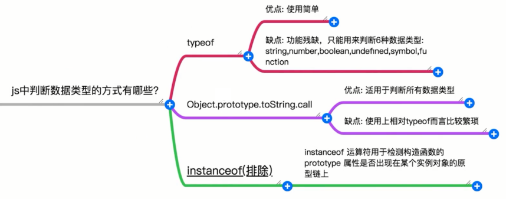

# JavaScript 面试题

- 你对原型和原型链的了解有多少？
- 如何理解作用域和作用域链?
- 你对闭包怎么理解？
- bind,call,apply 的区别
- 如何使用多种方式实现数组去重
- 怎样对给定数组求最大值
- js 中判断数据类型的方式有哪些
- 如何实现一个节流函数
- 如何实现一个防抖函数
- 多种方式实现数组拍平
- 使如下判断成立
- 实现 new 操作符
- 如何实现一个 bind 函数
- 如何实现 call 和 apply 函数
- 实现 instanceof

## 你对原型和原型链的了解有多少？


### 什么是原型和原型链?

什么是原型?

在 javascript 中，函数可以有属性。每个函数都有一个特殊的属性叫作原型（prototype）

```ts
function persion() {}
console.log(persion.prototype);
```


### 什么是原型链？

JavaScript 常被描述为一种基于原型的语言 (prototype-based language)——每个对象拥有一个原型对象，对象以其原型为模板、从原型继承方法和属性。原型对象也可能拥有原型，并从中继承方法和属性，一层一层、以此类推。这种关系常被称为原型链 (prototype chain)，它解释了为何一个对象会拥有定义在其他对象中的属性和方法。 —如上内容摘自 MDN

简单理解:
原型链就是当我们访问对象的某个属性或方法时，如果在当前对象中找不到定义，会继续在当前对象的原型对象中查找，如果原型对象中依然没有找到，会继续在原型对象的原型中查找（原型也是对象，也有它自己的原型）如此继续，直到找到为止，或者查找到最顶层的原型对象中也没有找到，就结束查找，返回undefined。可以看出，这个查找过程是一个链式的查找，每个对象都有一个到它自身原型对象的链接，这些链接组件的整个链条就是原型链。拥有相同原型的多个对象，他们的共同特征正是通
过这种查找模式体现出来的。

这在上面的查找过程，我们提到了最顶层的原型对象, 这个对象就是 Object.prototype，这个对象中保存了最常用的方法，如 toString、valueOf、hasOwnProperty 等，因此我们才能在任何对象中使用这些方
法。

下面我们通过代码来直观的理解下:

```ts
const persion = { name: 'zhangsan', age: 20 };
console.log(persion.toString);
```

这段代码在浏览器中运行之后可以看到如下的输出:

```ts
ƒ toString() { [native code] }
```

这地方我们会有个疑问就是说, 我们的 persion 对象并没有定义 toString 属性, 为什么当我们访问 toString 的时候可以拿到结果呢？我们继续在浏览器中执行如下代码:

```ts
const persion = { name: 'zhangsan', age: 20 };
console.log(persion);
```


通过如上输出我们可以看到我们拿到的 persion.toString, 其实是定义在 persion.proto也就是我们 persion 对象的原型中的。当我们访问 persion.toString 的时候在 persion 对象本身没找到所以就去 persion.proto中找, 最终找到了我们想要的 toString 方法。这就是通过原型链访问对象属性的一个实际例子。

### 原型和原型链存在的意义是什么？

了解了原型和原型链的概念之后, 我们来思考下, 原型和原型链存在的意义是什么? 带着这个问题我们来看下面代码:

```ts
// 初始化构造函数
function Monkey(name, age) {
this.name = name;
this.age = age;
} Monkey.prototype.from =
'
zoo';
// 实例化wukong对象
let WuKong = new Monkey('WuKong', 800);
console.log(WuKong);
```

打印 wukong， 他有自己属性 name = ‘WuKong’, age = 800; 同时通过原型链关系，他有属性 from = ‘zoo’;
我们再创建实例 LiuEr
```ts
// 实例化LiuEr对象
let LiuEr = new Monkey('LiuEr', 600);
console.log(LiuEr);
```

打印 LiuEr， 他有自己属性 name = ‘LiuEr’，age = 600; 同时通过原型链关系，他有属性 from = ‘zoo’;可以看出原型对象存放了 WuKong、LiuEr 共有的属性 from = ‘zoo’. from 属性，而是将这一属性存在他们的
构造函数原型对象上，对于 Monkey 这样的构造函数。相同的属性、方法还有很多很多，比如都喜欢吃香蕉，都需要睡觉，当相同的属性、方法越多，原型、原型链的意义越大。这是就是原型、原型链
的意义所在！实例对象可以共享构造函数原型属性和方法, 节省内存。构造函数原型上的属性和方法越多，节省内存越大。

### 面试官主要考察什么？

- js 基础是否扎实？
- 能否清晰的回答出原型和原型链的概念
- 针对原型和原型链是否有自己的理解？
- 是否思考过，原型和原型链存在的意义是什么。

### 面试中遇到该题目我们该如何回答？

讲清楚如下两个点:

- 什么是原型和原型链?
    - 什么是原型
        - 在 javascript 中，函数可以有属性。每个函数都有一个特殊的属性叫作原型（prototype）
    - 什么是原型链？
        - 原型链就是当我们访问对象的某个属性或方法时，如果在当前对象中找不到定义，会继续在当前对象的原型对象中查找，如果原型对象中依然没有找到，会继续在原型对象的原型中查找（原型也是对象，也有它自己的原型）如此继续，直到找到为止，或者查找到最顶层的原型对象中也没有找到，就结束查找，返回 undefined。可以看出，这个查找过程是一个链式的查找，每个对象都有一个到
    它自身原型对象的链接，这些链接组件的整个链条就是原型链

- 原型和原型链存在的意义是什么？使得实例对象可以共享构造函数原型属性和方法, 节省内存。构造函数原型上的属性和方法越多，节省内存越大.

加分项:谈谈在项目中使用原型和原型链封进行函数封装的实际场景及心得。

## 如何理解作用域和作用域链?


### 什么是作用域？

作用域是在运行时代码中的某些特定部分中变量，函数和对象的可访问性，作用域决定了代码区块中变量和其他资源的可见性。下面我们通过一个例子来理解下作用域这个概念:

```ts
function scope() {
var insideVariable = 'insideVariable';
} scope();
console.log(inVariable); // Uncaught ReferenceError: inVariable is not defined
```

这段代码在浏览器运行之后会抛出引用错误, 原因是因为我们的变量 insideVariable 在全局作用域并没有声明,所以在全局作用域下取值会报错。这里我们引伸出了全局作用域这个概念。在 js 中我们的作用域分为
- 全局作用域
- 局部作用域
- 块级作用域

**a、全局作用域**

什么是全局作用域: 在代码中任何地方都能访问到的对象拥有全局作用域。

js 中一般有以下三种情形拥有全局作用域:

1. 所有 window 对象的属性拥有全局作用域

```ts
console.log(window);
```

所有 window 对象的属性都拥有全局作用域, 标红部分即是我们常用的一些全局作用域的函数。之所以我们可以在一段 js 代码中直接使用 alert 函数,就是因为它被定义在了我们的 window 对象上,而
window 对象的属性都拥有全局作用域

1. 在最外层定义的变量, 函数,及对象。

```ts
var globalVariable = 'globalVariable'; // 最外层变量
function globalFunction() {
// 最外层函数
var currentVariable = 'current_variable'; //函数内变量
function currentFunction() {
// 函数内函数
console.log(currentVariable);
}
console.log(globalVariable);
} console.log(globalVariable); // globalVariable
globalFunction(); // globalVariable
console.log(currentVariable); // currentVariable is not defined
console.log(currentFunction); // currentFunction is not defined
```

如上例子中我们的globalVariable和globalFunction 拥有全局作用域，所以在任何地方都可以访问到，但是内部的currentVariable和currentFunction定义在 globalFunction 函数的局部作用域中所以在全局作用域无法访问。

3. 所有未定义直接赋值的变量自动声明为全局作用域

```ts
function scope() {
globalVariable = 'globalVariable'; // 未定义直接赋值的变量
} scope();
console.log(globalVariable); // globalVariable
```

本例子中globalVariable便是我们的未定义直接赋值的变量, 它同样具有我们全局作用域,而且我们的 globalVariable 会直接挂到 window 对象上, 虽然这种操作代码可以正常运行但却很可能会污染全局作用
域空间。一般不推荐使用。

b、局部作用域

局部作用域指的就是我们的函数作用域, 代指函数内部的空间。函数内部空间声明的变量无法在外部访问,例如:

```ts
function doSomething() {
var currentName = 'xiaohong';
} doSomething();
console.log(currentName); // currentName is not defined
```

c、块级作用域

块级作用域是指被大括号("{}")包裹住的相关联的语句的集合。例如, 你可以在 if 后声明一段函数块形式的代码，表明当条件判断为真时，解释程序应该运行上述函数块里的代码，或者当条件判断为假时跳过执行上述函数块里的代码

```ts
// 1. if 语句中的块级作用域, if语句后面的{}中便是我们的块级作用域
let isPay = false;
if (isPay) {
console.log('payment success');
} 
// 2. 直接使用{} 块级作用域。
let a = 1;
{
let a = 2;
} console.log(a); // 1
```

### 什么是作用域链？

当我们在某个函数的内部作用域中查找某个变量时, 如果没有找到就会到他的父级作用域中查找, 如果父级也没找到就会接着一层一层的向上寻找，直到找到全局作用域还是没找到的话，就宣布放弃。这种一层一层的作用域嵌套关系，就是作用域链,举个例子:

```ts
var a = 100;
function globalFunc() {
var b = 200;
function currentFunc() {
var c = 300;
console.log(a); // 全局作用域的变量
}
currentFunc();
} globalFunc();
```

如上例子中当我们在 currentFunc 中查找 a 变量的时候 当前 currentFunc 作用域不存在所以就到他的父作用域 globalFunc 中查找，同样还是没找到, 在往上就到了我们的全局作用域， 在全局作用域找到了我们需要的变量 a。 可以看到这个查找的过程就是顺着我们的作用域链层层往上的。

### 面试官主要考察什么？

1. 是否理解作用域和作用域的概念 ？
2. 是否思考过作用域存在意义是什么 ？

### 面试中遇到该题目我们该如何回答？

1. 什么是作用域？

    作用域是在运行时代码中的某些特定部分中变量，函数和对象的可访问性，作用域决定了代码区块中变量和其他资源的可见性。

2. 作用域存在的意义是什么？

    作用域存在的最大意义就是变量隔离,即: 不同作用域下同名变量不会有冲突。

3. 什么是作用域链？

    当我们在某个函数的内部作用域中查找某个变量时, 如果没有找到就会到他的父级作用域中查找, 如果父级也没找到就会接着一层一层的向上寻找，直到找到全局作用域还是没找到的话，就宣布放弃。这种一层一层的作用域嵌套关系，就是作用域链。

## 你对闭包怎么理解？


### 什么是闭包？

一个函数和对其周围状态（lexical environment，词法环境）的引用捆绑在一起（或者说函数被引用包围），这样的组合就是闭包（closure）。也就是说，闭包让你可以在一个内层函数中访问到其外层函数的作用域。在 JavaScript 中，每当创建一个函数，闭包就会在函数创建的同时被创建出来。–摘自MDN

大白话简单理解闭包: 能够访问其他函数内部变量的函数，被称为闭包。

下面我们通过代码来直观的理解下:

```ts
function closure() {
// name 是一个被 makeFunc 创建的局部变量
var name = 'Mozilla';
// displayName() 是内部函数，一个闭包
function displayName() {
// 使用了父函数中声明的变量
alert(name);
}
return displayName;
} var myFunc =
closure();
myFunc();
```

如上代码在浏览器中运行之后 displayName() 函数内的 alert() 语句成功显示出了变量 name 的值,原因在于JavaScript中的函数会形成了闭包。 闭包是由函数以及声明该函数的词法环境组合而成的。该环境包含了这个闭包创建
时作用域内的任何局部变量。 在本例子中，myFunc 是执行 closure 时创建的 displayName 函数实例的引用。displayName 的实例维持了一个对它的词法环境（变量 name 存在于其中）的引用。因此，当 myFunc 被
调用时，变量 name 仍然可用，其值 Mozilla 就被传递到 alert 中。

### 闭包的应用场景有哪些 ?

1. 事件函数的封装:

假设我们有如下需求:通过页面元素点击事件修改页面字体大小

```html
<!DOCTYPE html>
<html lang="en">
<head>
<meta charset="UTF-8" />
<meta http-equiv="X-UA-Compatible" content="IE=edge" />
<meta name="viewport" content="width=device-width, initial-scale=1.0" />
<title>Document</title>
<style>
body {
font-size: 12px;
}
h1 {
font-size: 1.5em;
}
h2 {
font-size: 1.2em;
}
</style>
</head>
<body>
<p>这是p元素的文案</p>
<h1>这是h1元素的文案</h1>
<h2>这是h2元素的文案</h2>
<a href="#" id="size12">12</a>
<a href="#" id="size14">14</a>
<a href="#" id="size16">16</a>
<script>
// 获取页面元素
const size12Btn = document.getElementById('size12');
const size14Btn = document.getElementById('size14');
const size16Btn = document.getElementById('size16');
// makeSizer返回事件响应函数
const makeSizer = size => () => {
document.body.style.fontSize = size + 'px';
};
// 页面元素绑定事件
size12Btn.onclick = makeSizer(12);
size14Btn.onclick = makeSizer(14);
size16Btn.onclick = makeSizer(16);
</script>
</body>
</html>
```

在本例子中我们通过 makeSizer 高阶函数(返回值是函数的函数)给我们的页面元素绑定相应的事件响应, makeSizer 的返回值便是我们的件响应函数(在 makeSizer 函数中它便是闭包)。这种方式极大的优化了我们的代码量，提高了整个代码的可读性。

2. 用闭包模拟私有方法

javascript 没有 java 中那种 public private 的访问权限控制，对象中的所用方法和属性均可以访问，这就造成了安全隐患，内部的属性任何开发者都可以随意修改。虽然语言层面不支持私有属性的创
建，但是我们可以用闭包的手段来模拟出私有属性：

```ts
const makeCounter = function() {
let privateCounter = 0;
function changeBy(val) {
privateCounter += val;
}
return {
increment() {
changeBy(1);
},
decrement() {
changeBy(-1);
},
value() {
return privateCounter;
},
};
};
const Counter1 = makeCounter();
const Counter2 = makeCounter();
console.log(Counter1.value()); /* logs 0 */
Counter1.increment();
Counter1.increment();
console.log(Counter1.value()); /* logs 2 */
Counter1.decrement();
console.log(Counter1.value()); /* logs 1 */
console.log(Counter2.value()); /* logs 0 */
Counter2.increment();
Counter2.increment();
console.log(Counter2.value()); /* logs 2 */
console.log(Counter1.value()); /* logs 1 */
```

注意两个计数器 Counter1 和 Counter2 它们都保持各自的独立性。每个闭包都是引用自己作用域内的变量 privateCounter, 每次调用其中一个计数器时，通过改变这个变量的值，会改变这个闭包的词法环境。
然而在一个闭包内对变量的修改，不会影响到另外一个闭包中的变量。

3. 在循环中给页面元素绑定事件响应函数 在循环中给页面元素绑定事件响应函数是我们 js 面试中的非常基础且常见的考题。现有如下场景:

```ts
<!DOCTYPE html>
<html lang="en">
<head>
<meta charset="UTF-8" />
<meta http-equiv="X-UA-Compatible" content="IE=edge" />
<meta name="viewport" content="width=device-width, initial-scale=1.0" />
<title>Document</title>
</head>
<body>
<div>0</div>
<div>1</div>
<div>2</div>
<div>3</div>
<div>4</div>
<script>
var nodes = document.getElementsByTagName('div');
var length = nodes.length;
for (var i = 0; i < length; i++) {
nodes[i].onclick = function() {
alert(i);
};
}
</script>
</body>
</html>
```

这段代码运行之后无论点击哪个 div 最后弹出的结果都是 5, 这是因为 div 节点的 onclick 事件是被异步出发的, 当事件被触发的时候，for 循环早就结束了，这个时候变量 i 的值已经是 5。 解决这个问题的方
法之一我们可以利用闭包,把每次循环的 i 值都封闭起来。:

```ts
<html lang="en">
<head>
<meta charset="UTF-8" />
<meta http-equiv="X-UA-Compatible" content="IE=edge" />
<meta name="viewport" content="width=device-width, initial-scale=1.0" />
<title>Document</title>
</head>
<body>
<div>0</div>
<div>1</div>
<div>2</div>
<div>3</div>
<div>4</div>
<script>
var nodes = document.getElementsByTagName('div');
var length = nodes.length;
for (var i = 0; i < length; i++) {
(function(i) {
nodes[i].onclick = function() {
alert(i);
};
})(i);
}
</script>
</body>
</html>
```

这样当在事件函数中顺着作用域链从内到外查找变量 i 时，会先找到被封闭在闭包环境中的 i。所以最终我们用闭包改造后的代码每次点击按钮的时候会分别弹出 0，1，2，3，4。

### 闭包存在什么问题?

有一种耸人听闻的说法是闭包会造成内存泄漏, 造成内存泄漏的原因其实与闭包毫无关系。闭包跟内存泄漏有关的地方是，使用闭包的同时比较容易循环引用，如果闭包的作用域中保存着一些 DOM 节点，这时候可能会造成内存泄漏，但从本质上来讲这并给闭包的问题，在 IE 浏览器中由于 BOM 的 DOM 中的对象是使用 c++以 COM 对象方式实现的, 而 COM 的垃圾回收机制使用的是引用计数策略，也就是说如果两个对象之间形成的循环引用,那么这两个对象都无法被回收，从本质上来讲这并非闭包的锅。

但是闭包本身会造成常驻内存,来看下面一段代码

```ts
function foo() {
var a = 3;
function result() {
console.log(a);
}
return result;
} var test = foo();
test();
```

上述代码中，理论上来说， foo 函数作用域隔绝了外部环境，所有变量引用都在函数内部完成，foo 运行完成以后，内部的变量就应该被销毁，内存被回收。然而闭包导致了全局作用域始终存在一个 test 的变量在引用着 foo 内部的 result 函数，这就意味着 foo 内部定义的 result 函数引用数始终为 3，垃圾运行机制就无法把它销毁.这就是我们说的闭包本身会造成内部变量常驻内存。

### 面试官主要考察什么 ？

1. 是否知道闭包这个 js 中重要且难懂的概念？
2. 是否在实际场景中使用过闭包？
3. 是否知道闭包本身存在什么问题？

### 面试中遇到该题目我们该如何回答 ？

讲清楚如下三点:

- 什么是闭包？
    - 大白话: 能够访问其他函数内部变量的函数，被称为闭包。
- 闭包有哪些实际的使用场景?
    - a、事件函数的封装
    - b、用闭包模拟私有方法
    - c、在循环中给页面元素绑定事件响应函数
- 闭包存在什么问题?
    - 闭包本身会造成内部变量常驻内存

## bind、call、apply  


### 为什么把 bind、call、apply 放在一起？

- this 指向谁

```ts
// this 谁调用他就指向谁
var name = "freemen"
function sayAuthor(){
    var name = "mkw"
    console.log(`this.name`, this.name);
}
window.sayAuthor();
```

```ts
//  小王去面试

// 小王去招聘会现场参加面试 招聘的企业是腾讯和阿里 
// 腾讯和阿里的面试官分别是 freemen 和 vinko, 阿里的vinko 临时有事请腾讯的freemen来帮忙
// freemen 来到阿里的面试现场谁 你好我是vinko 我的公司是阿里

const Tencent ={
  name: "freemen",
  company: "Tencent",
  time:"2021-11-31",
  address:"BeiJing",
  say(company){
    console.log(`my name is `, this.name);
    console.log(`my company is `, company);
  }
}

const Alibaba = {
  name:"vinko",
  time:"2021-11-31",
  address: "BeiJing",
  say(company){
    console.log(`my name is `, this.name);
    console.log(`my company is `, company);
  }
}

// 
// Tencent.say('Tencent');
// freemen 替 vinko 面试
// Tencent.say.call(Alibaba,'Alibaba');

// Tencent.say.apply(Alibaba, ['Alibaba'])

const say = Tencent.say.bind(Alibaba, 'Alibaba');
say();

// 总结

// call 和 apply 传参方式不同
// bind 返回值是函数  
```

**区别：**


**使用场景：**
- 判断数据类型
- 类数组转数组
- apply  对给定数组求最大值/最小值
- bind React 事件 this 的绑定


```ts
// * 判断数据类型

const array = [1,2,3,4];

const type = Object.prototype.toString.call(array);

console.log(`type`, type)

// * 类数组转数组

const arrayLike = { 
  0: "name",
  1: "age",
  2: "gender",
  length: 3
}

const res =  Array.prototype.slice.call(arrayLike);
console.log(`res`, res)
// ["name","age","gender"]
```

```ts
// apply  对给定数组求最大值/最小值

const array = [1,2,3,4,5];

const max = Math.max.apply(null,array)
const min = Math.min.apply(null,array)
// Math.max(1,2,3,4,5)
console.log(`max`, max)
console.log(`min`, min)
```

```ts
// bind
class App extends React.Component {
  constructor(props) {
    super(props);  
    this.name = 'freemen'
    this.handleClick = this.handleClick.bind(this)
  }
  handleClick(){
    console.log(`this.name`, this.name)
  }
  render(){
    return (
      <button onClick={this.handleClick}>
        点击
      </button>
    )
  }
}
```

**考察什么：**
1. 是否知道 bind、call、apply 函数？
2. 是否知道 bind、call、apply 函数之间的区别？
3. 是否在实际场景中使用过 bind、call、apply ？

**如何回答**
1. 是否知道 bind、call、apply 函数是干啥的？
    - 都是用来改变 this 指向的
2. 是否知道 bind、call、apply 函数之间的区别？
    - call、和 apply 的传参不同
    - bind 和 call、apply 的返回值不同
        - bind 返回函数
        - call、apply 返回函数调用
3. 说一说 bind、call、apply 的实现原理

## 如何使用多种方式实现数组去重

- js 数组去重的场景
- 如何使用多种方式实现数组去重？
- 主要考察什么
- 该如何回答

两种数组：
```ts
[1, 2, 3, 4, 5, 2, 3];
[({ name: "freemen", age: "20" }, { name: "tt", age: "20" })];
```

```ts
// indexOf 查找项的下标  -1

// filter  []
// sort    []
// reduce  []  
// push    length
```

```ts
function handleError(array){
  if(!Array.isArray(array)){
    throw new Error("unique function params is not Array")
  }
}

const array = [1,2,3,4,5,2,3];

function unique(array) {
  handleError(array)
  return array.filter((item,index)=>{
    return array.indexOf(item) === index
  })
}

const res = unique(array);
console.log(`res`, res)


// 2. 相邻元素排序
function unique(array){
  handleError(array);
  array = array.sort()
  let res = [];
  for (let i = 0; i < array.length;i++){
    if(array[i] !==array[i-1]){
      res.push(array[i])
    }
  }
  return res;
}

const res = unique(array);
console.log(`res`, res);


// 3. Set 解构赋值
function unique(array){
  handleError(array);
  return [...new Set(array)]
}

const res = unique(array);
console.log(`res`, res);


//  4.  set Array.from 
function unique(array) {
  handleError(array);
  return Array.from(new Set(array));
};
const res = unique(array);
console.log(`res`, res)
```


```ts
const array = [{name:"freemen",age:"20"},{name:"mukwang",age:"20"}]

// 临时对象缓存数组项key值 

function unique(array,key) {
  handleError(array);
  let result = [];
  let template = {};
  for (let i = 0; i < array.length; i++) {
    var keyName = array[i][key];
    if(template[keyName]){
      continue;
    }
    template[keyName] = true;
    result.push(array[i]);
  }
  return result;
}

const res = unique(array,'age');
console.log(`res`, res);


function unique(array,key) {
  handleError(array);
  var cacheObject = {}
  return array.reduce((prve,current)=>{
     cacheObject[current[key]] ? "" : cacheObject[current[key]] = true && prve.push(current)
     return prve;
  },[])
}

const res = unique(array,'age');
console.log(res);
```


考察什么：
- 是否熟悉数组的常用方法和基本操作
- 能否用多种方式实现数组去重

如何回答：
- 说出js实现去重的多种方式（普通数组、对象数组）
- 方法中涉及到数组的`实例方法`和`原型方法`的情况下
    - 使用方法（返回值）和场景

## 怎样对给定数组求最大值 


方法：

1. Math.max
2. 数组的 reduce 函数
3. 数组的 sort 函数

```ts
const array = [1, 2, 3, 4, 5];

// Math.max
const res = Math.max(...array);
// const res = Math.max.apply(null,array)
console.log(`res`, res);

// reduce 函数
function getMax(array) {
  return array.reduce((prev, current) => {
    return current > prev ? current : prev;
  });
}

// const res = getMax(array);
// console.log(`res`, res);

// sort
function getMax(array) {
  const result = array.sort();
  return result[result.length - 1];
}

const res = getMax(array);
console.log(`res`, res);
```

考察什么：
- 基本的数据处理能力

如何回答：
- 说出对给定数组求最大值的实现方案
- 方法中涉及到数组的`原型方法`的情况介绍下
    - 他们的使用方法（返回值）和场景

## js中判断数据类型的方式有哪些


JS 中有哪些数据类型？

- 基本数据类型
    - `String`
    - `Number`
    - `Boolean`
    - `Symbol`
    - `undefined`
    - `Null`
- 引用数据类型
    - `Object`
    - `Array`
    - `Function`
    - Date
    - FormData
    - Set
    - Map
    - ...




```ts
const array = [];
const object = {};

const number = 1;
const string = 'string';

// typeof 
// const type = typeof array;
// console.log(`type`, type);

// const type = typeof number;
// console.log(`type`, type);

const type = Object.prototype.toString.call(array); // '[object Array]'
// const type = Object.prototype.toString.call(string); // '[object String]'
console.log(`type`, type);
```

如何回答：


## 如何实现一个节流函数


**函数节流：**

规定在一个`单位时间内`，事件响应函数只能被触发一次。如果这个单位时间内触发多次函数，`只有一次生效`

使用场景：
- window.onresize 事件
- mousemove 事件

```ts
// window.onresize 
// 1 单位时间内
// 2 只触发一次

// 1 返回值是一个函数
// 2 开启定时器
// 3 如果定时器存在直接返回 false
// 4 定时器内部清空定时器 并且把 timmer 置为 null 然后执行我们的事件响应函数
function throttle(fn,interval) {
    let timer;
    return (event)=>{
        if(timer){
            return false;
        }
        timer = setTimeout(() => {
            clearTimeout(timer);
            timer = null;
            fn(event)
        }, interval);
    }
}

window.onresize = throttle(function(event){
    console.log(`event`, event)
},1000)
```

考察什么：
- 是否知道函数节流的概念
- 是否知道函数节流的具体使用场景
- 是否对项目本身的性能有所关注

如何回答：
- 说出概念
- 具体使用场景
- 实现方式

## 如何实现一个防抖函数


**函数防抖：**

事件被触发 n 秒后再执行回调，如果在这 n 秒内又被触发，则重新计时。、

```html
<input type="text" id="searchElement">
<script>
  const searchElement = document.getElementById("searchElement");
  // 1.返回值是函数
  // 2.固定间隔执行·事件响应函数
  const debounce = (fn, initial) => {
    let timer = null;
    return () => {
      clearTimeout(timer)
      timer = setTimeout(fn, initial)
    }
  }
  searchElement.oninput = debounce(function (event) {
    const value = searchElement.value;
    console.log(`value`, value);
  }, 1000)
</script>
```

考察什么：
- 是否知道函数防抖的概念
- 是否知道函数防抖的具体使用场景
- 是否对项目本身的性能有所关注

如何回答：
- 说出概念
- 具体使用场景
- 实现方式

## 多种方式实现数组拍平 


**数组拍平：**

数组拍平也叫`数组扁平化`、`数组拉平`、`数组降维`。指的是把多维数组变成一维数组。

使用场景：

- 复杂场景下的数据处理（echarts做大屏数据展示）


```ts
const array = [1, 2, 3, 4, [5, 6, [7, 8]]];
// array  [1,2,3,4,5,6,7,8];

// reduce
function flatten(array) {
  return array.reduce(function (prev, current) {
    return prev.concat(Array.isArray(current) ? flatten(current) : current);
  }, []);
}

const result = flatten(array);
console.log(`result`, result);

// flat
function flatten(array) {
  return array.flat(Infinity);
}

const result = flatten(array);
console.log(`result`, result);

// while
function flatten(array) {
  while (array.some(Array.isArray)) {
    array = [].concat(...array);
  }
  // 1 array
  // 2 已经被拍平
  return array;
}

const result = flatten(array);
console.log(`result`, result);
```

考察什么：
- 手写代码的能力
- 基本的数据处理能力

如何回答：
- 三种实现方案
- 使用场景

## 使如下判断成立

```ts
if (a === 1 && a === 2 && a === 3) {
    console.log(`object`);
}
```


```ts
// a = 1,2,3
let value = 0;
Object.defineProperty(window, "a", {
    get() {
        return (value += 1);
    },
});
if (a === 1 && a === 2 && a === 3) {
    console.log(`object`);
}
```

```ts
var a = {
  i: 1,
  valueOf: function() {
    return this.i++;
  }
}
if(a == 1 && a == 2 && a == 3) {
  console.log(`object`);
}
```

```ts
var a = {
  i: 1,
  toString: function() {
    return this.i++;
  }
}
if(a == 1 && a == 2 && a == 3) {
  console.log(`object`);
}
```

```ts
var a = [1,2, 3];
a.join = a.shift;
if(a == 1 && a == 2 && a == 3) {
  console.log(`object`);
}
// a可以等于多个值，又可以想到数组；a也不可能同时等于多个不同的值，而在进行==比较的时候，数组会由join方法转换成字符串，因此可以改写join方法。
```

考察什么：
- 解决问题的思路
- JS 语言本身的熟悉度

如何回答：
- 遇到该题目或类似不常见题目（说出解决问题的思路）
- 给出完整的实现方案

## 实现 new 操作符

```ts
const TMap = function (options) {
  this.name = options.name;
  this.address = options.address;
};

// const map  = new TMap({
//   name: 'tmap',
//   address:"BJ"
// });

// console.log('map :>> ', map);

// 1. 实例化对象  
// 2. 返回值的问题: 构造函数中如果有值返回 那实例化后的对象就是这个返回值。

const ObjectFactory = (...args) => {
  // 1. 创建空对象
  const obj = {};
  // 2. 获取构造函数
  const Constructor = [].shift.call(args);
  // 3. 对象的 __proto__ 指向 Constructor.prototype
  obj.__proto__ = Constructor.prototype;
  // 4. 用 apply 的方式把构造函数 Constructor 的 this 指向 obj，执行 Constructor
  const ret = Constructor.apply(obj, args);
  // 5. 根据 ret 的执行结果判断返回的构造函数的返回对象还是新创建的空对象
  return typeof ret === "object" ? ret : obj;
};

const map = ObjectFactory(TMap, { name: "MAP", address: "BJ" });

console.log("map :>> ", map);
```

考察什么：
- 实际是否使用过 new 操作符
- 是否可以实现一个 new 操作符（基础知识是否扎实）

如何回答：
- 说出 new 操作符的实际使用场景及实现原理
- 写出完整的实现原理

## 如何实现一个bind函数

```ts
function origin(a, b) {
  console.log(this.name);
  console.log([a, b]);
}

const obj = {
  name: "freemen",
};

// const func = origin.bind(obj,2);
// func(1)

Function.prototype.bindFn = function () {
  // 1 获取源函数
  const fn = this;
  // 2 获取目标对象
  const obj = arguments[0];
  // 3. 获取源函数参数列表
  const args = [].slice.call(arguments, 1);
  // 4. 返回函数
  return function () {
    // 5 获取返回函数的参数列表
    const returnArgs = [].slice.call(arguments);
    // 6 执行源函数
    fn.apply(obj, args.concat(returnArgs));
  };
};
```

如何回答：
- 说出 bind 函数的实现原理（bind 心法4步走）
    1. bind 函数改变 this 指向
    2. bind 函数是 Function.prototype 上的方法
    3. bind 函数的返回值也是函数
    4. bind 函数调用之后返回的函数的参数同样也接收处理


## 如何实现call和apply函数

```ts
const obj = {
  name: "freemen",
};

function testFunc(a, b) {
  console.log("a :>> ", a);
  console.log("b :>> ", b);
  console.log("this.name :>> ", this.name);
}

// testFunc.call(obj,'a','b')
// testFunc.apply(obj,['a','b'])

const core = (context, args, _this) => {
  args = args || [];
  // 1. 给 context 新增一个 Symbol 属性，以免覆盖原有属性
  const key = Symbol();
  context[key] = _this;
  // 2. 通过隐式绑定的方式调用函数
  const result = context[key](...args);
  // 3. 删除添加的属性
  delete context[key];
  // 4. 返回函数调用的返回值
  return result;
};

Function.prototype.callFn = function (context, ...args) {
  return core(context, args, this);
};

Function.prototype.applyFn = function (context, args) {
  return core(context, args, this);
};

testFunc.callFn(obj, "a", "b");
testFunc.applyFn(obj, ["a", "b"]);
```

如何回答：
- 说出 call、apply 函数的实现原理

call：
- 改变 this 指针
- 返回函数调用
- 参数挨个依次传递

apply：
- 改变 this 指针
- 返回函数调用
- 参数用数组方式传递


## 实现 instanceof

定义：instanceof 运算符用于检测构造函数的 prototype 属性是否出现在某个实例对象的原型链上

```ts
function Persion() {
  this.name = "freemen";
}

const obj = new Persion();
// console.log(obj instanceof Persion)

// instanceof 运算符用于检测构造函数的 prototype 属性是否出现在某个实例对象的原型链上
function instance_of(Obj, Constructor) {
  let implicitPrototype = Obj.__proto__; // 1. 获取实例对象的隐式原型
  let displayPrototype = Constructor.prototype; // 2. 获取构造函数的prototype 属性
  // 3. while 循环 -> 在原型链上不断向上查找
  while (true) {
    // 5. 直到 implicitPrototype = null 都没找到, 返回false
    if (implicitPrototype === null) {
      return false;
      // 6. 构造函数的 prototype 属性出现在实例对象的原型链上 返回 true
    } else if (implicitPrototype === displayPrototype) {
      return true;
    }
    // 4. 在原型链上不断查找 构造函数的显式原型
    implicitPrototype = implicitPrototype.__proto__;
  }
}

const has = instance_of(obj, Persion);
console.log(`has`, has);
```

instanceof 实现原理：


## 总结


