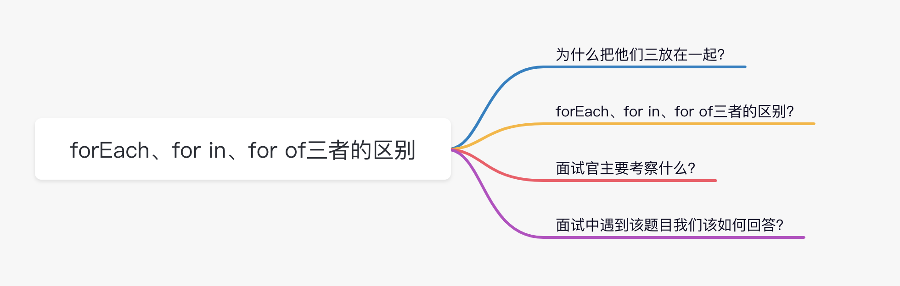

# ES6 面试题

- 你了解 let const 和 var 的区别
- 你了解箭头函数和普通函数的区别吗？
- 你了解 forEach、for in、for of 三者区别 ?
- ES6 中哪个方法可以实现数组去重？
- 你对 ES6 中对象新增的方法有了解吗？
- class 和 function 的区别
- 你对 Promise 了解多少
- 扩展运算符...的实现原理
- 设计一个对象，键名的类型至少包含一个 Symbol 类型马冰清实现遍历所有 key

## 你了解 let const 和 var 的区别

1. 不存在变量提升
2. 块级作用域
3. 暂时性死区
4. 不可重复声明
5. let 和 const声明的变量不会挂在在全局window对象下面

## 你了解箭头函数和普通函数的区别吗？


## 你了解 forEach、for in、for of 三者区别 ?



### 为什么把他们三放在一起?

forEach, for…in, for…of 都是 js 中的常见的循环迭代方式, 且每位同学的个人喜好不同所以在我们的项目中通常会有不同的书写方式。

### forEach, for in , for of 三者的区别？

**forEach 是数组的方法：**

特性:
- 便利的时候更加简洁，效率和 for 循环相同，不用关心集合下标的问题，减少了出错的概率。
- 没有返回值
- 不能使用 break 中断循环，不能使用 return 返回到外层函数

```ts
const array = [1, 3, 4];
let newArray = arr.forEach(i => {
    i += 1;
    console.log(i); //2,4,5
});
console.log(arr); //[1,3,4]
console.log(newArray); //undefined
```

**for…in是用于循环遍历数组或对象属性(大部分用于对象)**

特性:
- 可以遍历数组的键名, 遍历对象简洁方便

```ts
// 遍历对象
let person = { name: 'freemen', age: 28, city: '北京' };
let text = '';
for (let i in person) {
text += person[i];
} // 输出结果为:freemen28北京
// 遍历数组
let arry = [1, 2, 3, 4, 5];
for (let i in arry) {
console.log(arry[i]);
} // 输出结果为1,2,3,4,5
```

**for of：ES6 借鉴 C++、Java、C# 和 Python 语言，引入了 for…of 循环，作为遍历所有数据结构的统一的方法。**

特性：
- 一个数据结构只要部署了 Symbol.iterator 属性，就被视为具有 iterator 接口，就可以用 for…of 循环遍历它的成员,可用 for…of 遍历的成员包括: 数组, Set 和 Map 结构, 类数组对象

```ts
// 数组
const arr = ['mukewang', 'freemen', 'liuxiajiang'];
for (let v of arr) {
console.log(v); // mukewang freemen liuxiajiang
}
// Set
var names = new Set(['mukewang', 'freemen']);
for (var e of names) {
console.log(e);
} // mukewang freemen
// 类数组对象 arguments
function printArgs() {
for (let x of arguments) {
console.log(x);
}
} printArgs('mukewang', '
freemen');
```

### 面试官主要考察什么？

1. 是否熟悉 forEach, for…in, for…of 三者的使用方式
2. 是否明白他们之前的区别?

### 面试中遇到该题目我们该如何回答？

讲清楚如下两点:
1. forEach, for…in, for…of 的使用方式。
2. forEach, for…in, for…of 之间的区别?

forEach 是数组的方法
1. 便利的时候更加简洁，效率和 for 循环相同，不用关心集合下标的问题，减少了出错的概率。
2. 没有返回值
3. 不能使用 break 中断循环，不能使用 return 返回到外层函数
- for…in 用于循环遍历数组或对象属性(大部分用于对象)
- for…of 一个数据结构只要部署了 Symbol.iterator 属性，就被视为具有 iterator 接口，就可以用 for…of 循环遍历它的成员,可用 for…of 遍历的成员包括: 数组, Set 和 Map 结构, 类数组对象

## ES6中哪个方法可以实现数组去重？

es6 中实现数组去重的方法是 Array.from 配合 new Set

```ts
const array = [1, 2, 3, 3, 4, 5, 5, 6];
const result = Array.from(new Set(array));

console.log(`result`, result);
```

## 你对ES6中对象新增的方法有了解吗？


```ts
// 用于判断两个值是否相等
// const obj = {};
// const secondObj = {};
const numOne = 1;
const numTwo = '1';
const result = Object.is(numOne,numTwo);
console.log(`result`, result);

if(NaN === NaN){
  console.log(`getName`);
}
const result = Object.is(NaN,NaN);
console.log(`result`, result);
// 特点： 
// 1 不仅可以对值类型进行正常处理而且对象类型的值也可以进行判断
// 2 对于特殊的值 NaN 也可以进行正常的处理

// 2. Object.assgin 用于合并对象
const obj = {
  name:"freemen"
}
const objTwo = {
  age: 18
}
const result = Object.assign(obj,objTwo);
console.log(`result`, result)

// Object.keys 目标对象的所有可遍历属性的键名
const object = {
  name:"freemen",
  age:18
}
const result = Object.keys(object);
console.log(`result`, result);

// Object.values 目标对象的所有可遍历属性的键值
const object = {
  name:"freemen",
  age:18
}
const result = Object.values(object);
console.log(`result`, result);

// Object.entries() 
const object = {
    name:"freemen",
    age:18
}

const result = Object.entries(object);
console.log(`result`, result);
```

## class和function的区别

class 和 function 的区别
- 相同点： 都可以用作构造函数
- 不同点： class 不可以使用 call apply bind 的方式来改变他的执行上下文   

```ts
// 相同点:
// * 都可以用作构造函数 
// function Persion(){
//   this.fullName = "freemen";
// }
// class Persion{
//   constructor(){
//     this.fullName = "freemen";
//   }
// }
// const object = new Persion
// console.log(`object`, object)
// 不同点:
// * class 不可以使用 call apply bind 的方式来改变他的执行上下文   
// function sayName(){
//   console.log(`this.fullName`, this.fullName)
// }
class Persion {
    constructor(){
    this.fullName = "freemen";
    }
}
const obj = {
    fullName: "freemen"
}

Persion.call(obj)
```

## 你对 Promise 了解多少


**定义：**

Promise 是异步编程的一种解决方案，比传统的解决方案--回调函数和事件，更合理更强大。他由社区最早提出和实现，ES6将其写进了语言标准按，统一了用法，原生提供了 Promise 对象。

如何回答：


```ts
// 3 个状态  pending  fulfilled  rejected
new Promise(function (resolve, reject) {
  let fullName = "freemen";
  if (fullName === "Vinko") {
    resolve(1);
  } else {
    reject(2);
  }
}).then(
  function (value) {
    console.log(`resolve - value`, value);
  },
  function (value) {
    console.log(`reject - value`, value);
  }
);
```

```ts
// Promise.prototype.then
// 1 可以支持链式调用
// 2 then 接受两个参数且都是函数
// 第一个函数是我们promise 状态变成fullfilled 时候的回调函数
// 第二个函数是我们promise 状态变成rejected  时候的回调函数
// 3 返回值也是Promise(新的)
new Promise(function (resolve, reject) {
  let fullName = "freemen";
  if (fullName === "freemen") {
    resolve(1);
  } else {
    reject(2);
  }
})
  .then((value) => {
    console.log(`fulfilled value`, value);
    return Promise.reject(2);
  })
  .then(
    (fulfilledValue) => {
      console.log(`fulfilled value`, fulfilledValue);
    },
    (rejectedValue) => {
      console.log(`rejectedValue`, rejectedValue);
    }
  );
// fulfilled value 1
// fulfilled value 2
```

```ts
// Promise.prototype.catch() 捕获Promise错误
new Promise(function (resolve, reject) {
  let fullName = "freemen";
  if (fullName === "Vinko") {
    resolve(1);
  } else {
    reject("promise error");
  }
})
  .then((value) => {
    console.log(`value`, value);
  })
  .catch((error) => {
    console.log(`error`, error);
  });
```

```ts
// Promise.prototype.finally()
// 用于指定不管 Promise 对象最后状态如何，都会执行的操作
new Promise(function (resolve, reject) {
  console.log(`loading start...`);
  let fullName = "freemen";
  if (fullName === "freemen") {
    resolve(1);
  } else {
    reject("promise error");
  }
})
  .then((value) => {
    console.log(`value`, value);
  })
  .catch((error) => {
    console.log(`error`, error);
  })
  .finally(() => {
    console.log(`loading end...`);
  });
```

```ts
// Promise.all;
// 用于将多个Promise实例包装成一个新的Promise实例 
const promiseArray = [1,2,3,4,5].map((item)=>{
    return new Promise((resolve)=>{
    resolve(item);
    })
})
Promise.all(promiseArray).then(res=>{
    console.log(`res`, res)
});
```

```ts
// Promise.race 方法同样是将多个 Promise 实例，包装成一个新的 Promise 实例
// Promise.race 和 Promise.all 区别 
// Promise.race 继发
// Promise.all  并发
const promiseArray = [1,2,3,4,5].map(item=>{
    return new Promise((resolve)=>{
    resolve(item)
    })
})
Promise.race(promiseArray).then(res=>{
    console.log(`res`, res)
})
```

```ts
// Promise.resolve  将现有对象转化成Promise 对象
// new Promise(function(resolve, reject){
//    console.log(`loading start...`)
//    let fullName = "freemen";
//    if(fullName==="freemen") {
//       resolve(1);
//    }else{
//       reject('promise error')
//    }
// }).then(res=>{
//   console.log(`res`, res)
// })
Promise.resolve(1).then(res=>{
    console.log(`res`, res)
})
```

```ts
// Promise.reject  返回一个Promise实例 -> rejected
// new Promise(function(resolve, reject){
//    console.log(`loading start...`)
//    let fullName = "freemen";
//    if(fullName==="Vinko") {
//       resolve(1);
//    }else{
//       reject('promise error')
//    }
// }).then(res=>{
//   console.log(`res`, res)
// },rejected=>{
//   console.log(`rejected`, rejected)
// })

Promise.reject('promise error').then(null,rejected=>{
    console.log(`rejected`, rejected)
})
```


## 总结


