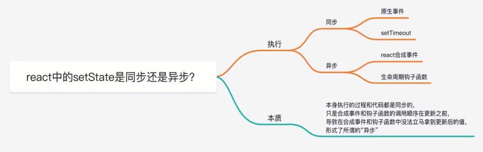
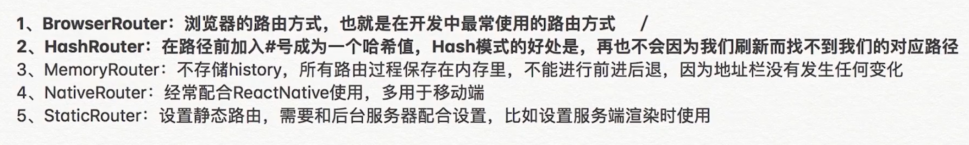
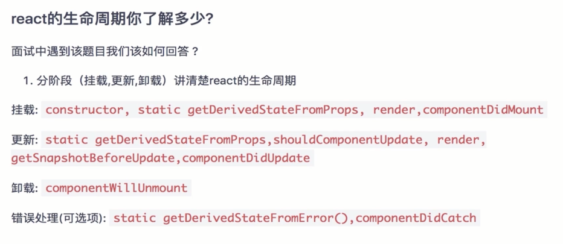
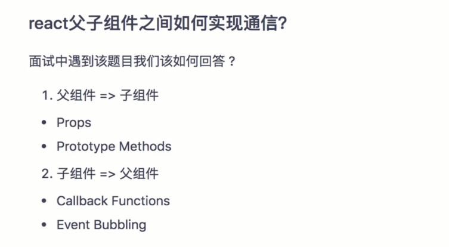
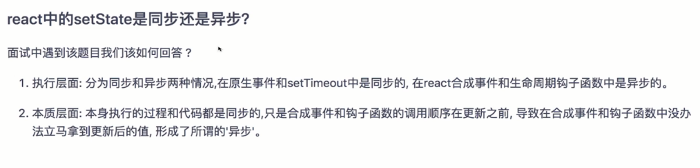
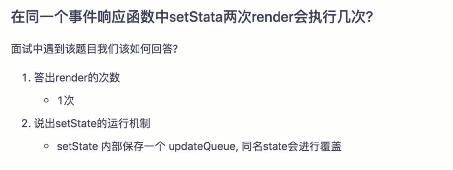
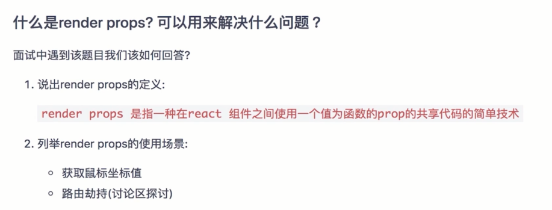
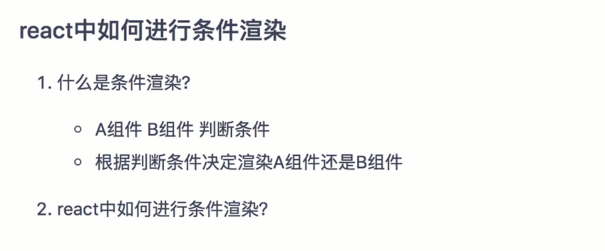
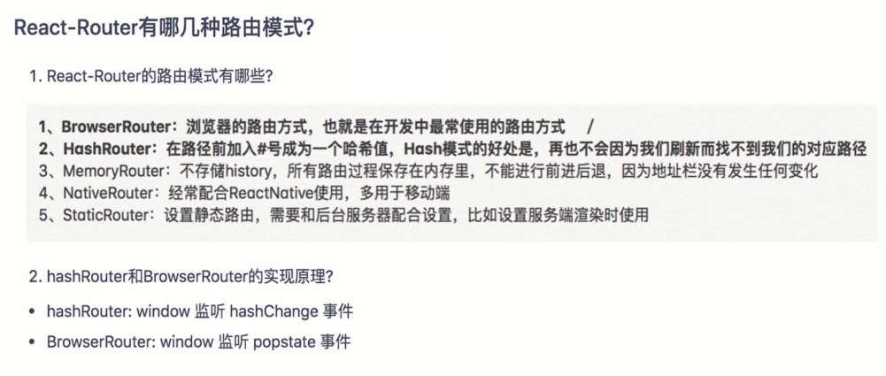
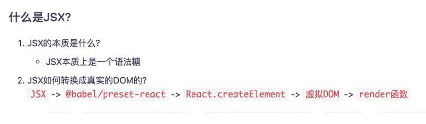

# react 全家桶面试题

- React的生命周期你了解多少
- React父子组件之间如何实现通信？
- React中的setState是同步还是异步的
- 在同一个事件响应函数中setStata两次render会执行几次
- 什么是render props可以用来解决什么问题
- React中如何进行条件渲染？
- Router-React中如何获取URL的参数？
- React-Router有哪几种路由模式
- 什么是jsx？

## React的生命周期你了解多少

```ts
import React, { Component } from 'react'

//1. getDerivedStateFromProps 的返回值会更新当前组件的states
//2. shouldComponentUpdate 返回true或者false来决定是否更新当前组件
//3. getSnapshotBeforeUpdate的返回值会作为componentDidUpdate的第三个参数

export default class LCComponent extends Component {
  constructor(props) {
    super(props);
    this.state = {
      name: "freemen"
    }
    console.log(`constructor`)
  }
  // getDerivedStateFromProps 返回值用来更新当前组件的states
  static getDerivedStateFromProps(props,state){
    console.log(`getDerivedStateFromProps`)
    if(state.name==='freemen'){
      return { name: "vinko" }
    }
    return null;
  }
  componentDidMount(){
    console.log(`componentDidMount`)
  }
  shouldComponentUpdate(nextProps, nextState) {
    console.log(`shouldComponentUpdate`)
    return true;
  }
  getSnapshotBeforeUpdate(){
    console.log(`getSnapshotBeforeUpdate`)
    return { snapshot: "snapshot" }
  }
  componentDidUpdate(prevProps, prevState, snapshot) {
    console.log(`componentDidUpdate`)
  }
  componentWillUnmount(){
    console.log(`componentWillUnmount`)
  }
  handleClick = () => {
    this.setState({
      name:"react生命周期"
    })
  }
  render() {
    console.log(`render`)
    return (
      <div>
        { this.state.name }
        <button onClick={this.handleClick}>update</button>
      </div>
    )
  }
}
```

## React父子组件之间如何实现通信？

- 父组件 -> 子组件
    1. Props
    2. Prototype Methods

- 子组件 -> 父组件
    1. Callback Functions
    2. Event Bubbling


## React中的setState是同步还是异步的




## 在同一个事件响应函数中setStata两次render会执行几次

```ts
import React, { Component } from 'react'

// render 执行一次
export default class EventComponent extends Component {
  state={
    count:0,
  }
  handleClick = ()=>{
    this.setState({count:this.state.count+1});
    this.setState({count:this.state.count+2});
  }
  render() {
    console.log('render :>> ');
    return (
      <div>
        {this.state.count}
        <button onClick={this.handleClick}>add</button>
      </div>
    )
  }
}
// setState 机制  内部会维护一个updaterQueue, 且会对同名的state属性进行一个覆盖。 
```

## 什么是 render props 可以用来解决什么问题

术语"render props"是指一种在 React 组件之间使用一个值为函数的 prop 共享代码的简单技术

```ts
import React, { Component } from 'react'

class Cat extends Component {
  render(){
    const mouse = this.props.mouse
    return (
      
    )
  }
}

class Mouse extends Component {
  state= {
    x:0,
    y:0,
  }
  // 获取鼠标的x轴和y轴的信息
  handleMouseMove = (event)=>{
    const x = event.clientX;
    const y = event.clientY;
    //更新state 坐标值
    this.setState({
      x,
      y
    })
  }
  render(){
    return (
      <div style={{background:'red',height:'100vh'}} onMouseMove={this.handleMouseMove}>
        { this.props.render(this.state) }
      </div>
    )
  }
}

export default class MoseMove extends Component {
  render() {
    return (
      <div>
        <h1>鼠标移动</h1>
        <Mouse render={mouse=>(
          <Cat mouse={mouse}/>
        )}/>
      </div>
    )
  }
}
```

## React中如何进行条件渲染？

...


## Router-React中如何获取URL的参数？

```ts
// react 如何获取url中的参数
import React, { Component } from 'react'
import { withRouter } from 'next/router'
export default withRouter(class RouteComponent extends Component {
  handleClick = ()=>{
    const query = this.props.router.query;
    console.log(`query`, query);
  }
  render() {
    return (
      <button onClick={this.handleClick}>点击我吧</button>
    )
  }
})
```

面试官主要考察什么？
- react框架本身的熟悉程度

面试中遇到该题目我们该如何回答？
- withRouter 包装基础组件
- 基础组件的props中拿到我们路由的信息

## React-Router有哪几种路由模式




## 什么是jsx？

```ts
import React, { Component } from 'react'

export default class JSXComponent extends Component {
  handleClick = ()=> {
    console.log(`click`)
  }
  render()  {
    const jsx = React.createElement('div',{name:'freemen'},'react')
    return (
      <div onClick={this.handleClick}>
        {jsx}
      </div>
    )
  }
}

// jsx 本质是一个语法糖
// @babel/presets-react 
// 生成虚拟DOM
// render
```

## 总结










