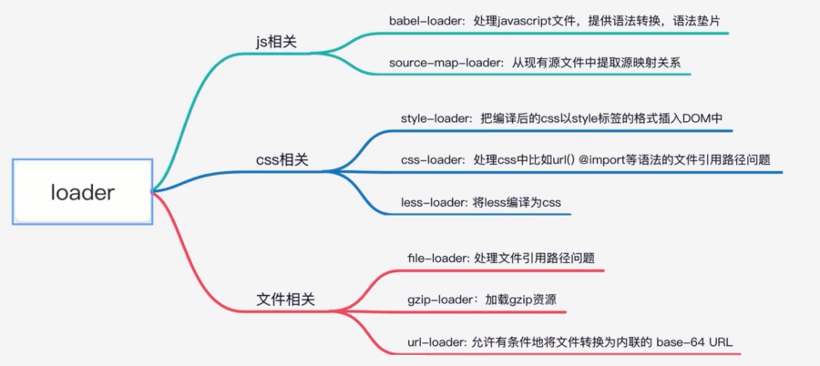

# 打包工具面试题

- 谈一谈对webpack的理解
- 使用过webpack中的哪些loader分别是用来做什么的
- 使用过webpack中的哪些plugin分别是用来做什么的
- 如何实现一个loader
- 如何写一个plugin
- webpack中的loader和plugin有什么区别
- 谈一谈webpack的构建流程

## 谈一谈对webpack的理解

- 是什么
- 解决了什么问题

webpack 是一个用于现代 JavaScript 应用程序的静态模块打包工具

解决了什么问题：
- 模块依赖问题
- 代码编写问题
- 开发效率问题
- 项目优化问题

## 使用过webpack中的哪些loader分别是用来做什么的

- 有哪些loader 分别是用来做什么的
- loader 的执行顺序



从后向前执行

## 使用过webpack中的哪些plugin分别是用来做什么的

- 有哪些 plugin 分别是用来做什么的
- plugin 的执行顺序


按照 hook 执行

## 如何实现一个loader

```ts
// loader 本质上就是一个函数
const UglifyJS = require('uglify-js');

module.exports = (source)=>{
  const result = UglifyJS.minify(source);
  return result.code;
}
```

```ts
const path = require('path');

module.exports ={
  entry:'./index.js',
  mode: "development",
  module:{
    rules: [
      {
        test: /\.js$/,
        use:['uglify-loader']
      }
    ]
  },
  resolveLoader: {
    modules:[path.resolve(__dirname, 'laoders')]
  }
}
```

## 如何写一个plugin

```ts
const  json = require('format-json');
const fs = require('fs');

class LogPlugin{
    constructor(options){
        this.options = options;
        // console.log(options);
    }
    apply(compiler){
        compiler.hooks.done.tapAsync('getStats',(stats)=>{
           const log =  json.plain(stats.toJson());
           const output = this.options.output;
           fs.writeFileSync(output,log);
        })
    }
}

module.exports = LogPlugin;
```

```ts
const path = require('path');
const LogPlugin = require('./plugins/LogPlugin.js');

module.exports = {
    entry:'./index.js',
    mode: 'development',
    plugins:[
        new LogPlugin({
            output: path.resolve(__dirname,'webpack.log.json')
        })
    ]
}
```

## webpack中的loader和plugin有什么区别

```ts
const path = require('path');
const LogPlugin = require('./plugins/LogPlugin.js')

module.exports ={
  entry:'./index.js',
  mode: "development",
  module:{
    rules: [
      {
        test: /\.js$/,
        use:['uglify-loader']
      }
    ]
  },
  resolveLoader: {
    modules: [path.resolve(__dirname, 'laoders')]
  },
  plugins:[
    new LogPlugin({
      output: path.resolve(__dirname,'webpack.log.json')
    })
  ]
}
```

```ts
// 1 功能： loader做的事情 plugin也可以做
// 2. 执行顺序：
//     Plugin 可以在 webpack 编译的整个过程执行，类比 React\Vue 生命周期
//     Loader 只能在固定的阶段执行
// 3. 本质上
//     Loader 本质上是一个翻译官对客户端识别不了的源码进行处理
//     Plugin 执行的是一些副操作
```

## 谈一谈webpack的构建流程


## 总结


