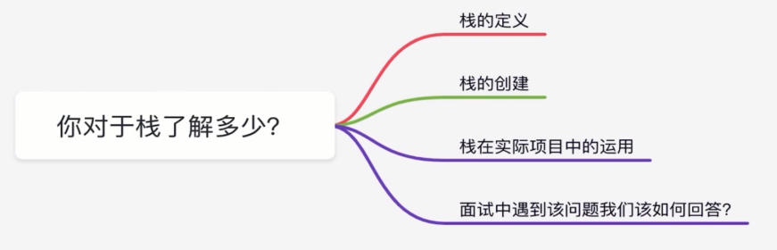

# 数据结构与算法

- JavaScript 的数组方法有哪些
- 如何去除数组中指定的元素
- 你对于栈了解多少
- 你对队列了解多少
- 有效括号
- 如何用两个栈实现队列 ?
- 如何对给定数组实现插入排序 ?
- 如何对给定数组实现归并排序?
- 如何对给定数组实现选择排序?
- 你对冒泡排序了解多少

## JavaScript 的数组方法有哪些


```ts
// concat
const firstArray = [1, 2, 3, 4, 5];
const secondArray = [6, 7, 8, 9];
const result = firstArray.concat(secondArray);
console.log(result);

// every
const array = [
  { name: "freemen", age: 18 },
  { name: "vinko", age: 18 },
];
const result = array.every((item) => {
  return item.name === "freemen";
});
console.log(result);

// filter
const array = [
  { name: "freemen", age: 18 },
  { name: "vinko", age: 18 },
];
const result = array.filter((item) => {
  return item.name === "freemen";
});
console.log(result);

// forEach
const array = [
  { name: "freemen", age: 18 },
  { name: "vinko", age: 18 },
];

array.forEach((item, index) => {
  console.log(item);
  console.log(index);
});

// join
const array = [1, 2, 3, 4, 5];

const result = array.join(";");
console.log(result);

// indexOf
const array = [1, 2, 3, 4];
const result = array.indexOf(9);
console.log(result);

// lastIndexOf
const array = [1, 2, 3, 3, 3, 3, 4, 5];
const result = array.lastIndexOf(5);
console.log(result);

// map
const array = [
  { name: "freemen", age: 18 },
  { name: "vinko", age: 18 },
];
const result = array.map((item) => {
  if (item.name === "freemen") {
    return item;
  }
  return {};
});
console.log(result);

// reverse
const array = [1, 2, 3, 4, 5];
const result = array.reverse();
console.log(result);

// slice
const array = [1, 2, 3, 4, 5];
const result = array.slice(0, 3);
console.log(result);

// some
const array = [1, 2, 3, 4, 5];
const result = array.some((item) => {
  return item === 6;
});
console.log(result);

// sort
const array = [1, 2, 3, 4, 5];
const result = array.sort((a, b) => {
  return a - b;
});
console.log(result);

// toString
const array = [1, 2, 3, 4, 5];
const result = array.toString();
console.log(result);
```

## 如何去除数组中指定的元素

```ts
// js 如何删除数组中指定的元素
const array = [{ name: "freemen", age: 18 }, { name: 'vinko', age: 20 }];

function cutArray(sourceArray, target) {
   sourceArray.forEach((item, index) => {
      if (item.name === target) {
         sourceArray.splice(index, 1);
      }
   })
   return sourceArray;
}

const result = cutArray(array, 'freemen');
console.log(result);
```

## 你对于栈了解多少



栈是一种遵循后进先出（LIFO）原则的有序集合。新添加的或待删除的元素都保存在栈的尾部，称作栈顶，另一端就叫栈底。在栈里，新元素都靠近栈顶，就元素都接近栈底。

```ts
// 栈的实现
function Stack() {
  this.items = [];
}
// 添加元素的方法
Stack.prototype.push = function (element) {
  this.items.push(element);
};
// 移除栈顶的元素
Stack.prototype.pop = function () {
  this.items.pop();
};
// 拿栈顶的元素
Stack.prototype.peek = function () {
  return this.items[this.items.length - 1];
};
// 判断栈是否为空
Stack.prototype.isEmpty = function () {
  return this.items.length === 0;
};
// 清除栈
Stack.prototype.clear = function () {
  this.items = [];
};

const stack = new Stack();

stack.push({ number: 1 });
stack.push({ number: 2 });
stack.push({ number: 3 });
stack.push({ number: 4 });
stack.push({ number: 5 });
stack.push({ number: 6 });
stack.push({ number: 7 });
stack.push({ number: 8 });
stack.push({ number: 9 });
stack.push({ number: 10 });
// console.log(stack);

stack.pop();
// console.log(stack);

const result = stack.peek();
// console.log(result);
stack.clear();
const empty = stack.isEmpty();
console.log(empty);
```

如何回答：
- 说出栈的定义
- 如何实现一个栈
- 栈结构在实际项目中的运用：webpack loader

## 你对队列了解多少


队列是遵循先进先出原则的一组有序的项。队列在尾部添加新元素，并从顶部移除元素。最新添加的元素必须排在队列的尾部。

```ts
// 队列的实现
function Queue() {
  this.items = [];
}
//  添加元素
Queue.prototype.enqueue = function (element) {
  this.items.push(element);
};
//  删除元素
Queue.prototype.dequeue = function () {
  return this.items.shift();
};
// 返回队列中第一个元素
Queue.prototype.front = function () {
  return this.items[0];
};
// 判断队列是否为空
Queue.prototype.isEmpty = function () {
  return this.items.length === 0;
};
// 清空队列
Queue.prototype.clear = function () {
  this.items.length = 0;
};
// 获取队列的长度
Queue.prototype.size = function () {
  return this.items.length;
};
// 打印队列中元素
Queue.prototype.print = function () {
  console.log(this.items.toString());
};

var queue = new Queue();

console.log(queue.isEmpty()); // true

queue.enqueue("freemen");
queue.enqueue("vinko");
queue.enqueue("andy");

queue.print(); // freemen,vinko,andy
console.log(queue.size()); // 3
console.log(queue.isEmpty()); // false
queue.dequeue();
queue.dequeue();
queue.print(); //andy
```

如何回答：
- 说出队列的定义
- 如何实现一个栈
- 栈结构在实际项目中的运用

## 有效括号

给定一个只包括 ‘(’，’)’，’{’，’}’，’[’，’]’ 的字符串 string，判断字符串是否有效。
有效字符串需满足:
1. 左括号必须用相同类型的右括号闭合。
2. 左括号必须以正确的顺序闭合。

输出示例:
```ts
// 示例 1:
// 输入: s = “()”
// 输出：true

// 示例 2:
// 输入：s = “()[]{}”
// 输出：true

// 示例 3:
// 输入：s = “(]”
// 输出：false

// 示例 4:
// 输入: s = “([)]”
// 输出: false

// 示例 5:
// 输入: s = “{[]}”
// 输出: true
```

解题思路:
根据题意，我们可以推断出以下要点:
1. 有效括号字符串的长度，一定是偶数！
2. 右括号前面，必须是相对应的左括号，才能抵消！
3. 右括号前面，不是对应的左括号，那么该字符串，一定不是有效的括号！

解题:

```ts
var isValid = function (string) {
  let stack = [];
  let length = string.length;
  // 有效括号字符串的长度，一定是偶数！
  if (length % 2) return false;
  // 使用map查询速度还有内存消耗比数组低
  let map = new Map([
    ["(", ")"], // 键用左括号表示，对应值为对应的右括号
    ["[", "]"],
    ["{", "}"],
  ]);
  let len = string.length; //性能优化，不必每次循环都计算一次string.length
  //遍历字符串，如果为左括号，则入栈，否则栈顶元素出栈并与该元素比较
  for (let i = 0; i < len; i++) {
    if (map.has(string[i])) {
      //左括号，
      stack.push(string[i]);
    } else {
      //右括号
      if (stack.length === 0) {
        //栈为空时返回false
        return false;
      } else {
        // 判断栈长度不为空
        if (map.get(stack.pop()) !== string[i]) {
          // 弹出栈顶元素，若其不能与该元素配对
          return false;
        }
      }
    }
  }
  // 栈为空时，返回true，否则返回false
  return !stack.length;
};
isValid(`()`); // true
isValid(`()[]{}`); // true
isValid(`(]`); // false
isValid(`([)]`); // false
isValid(`{[]}`); // true
```

## 如何用两个栈实现队列 ?

如何用两个栈实现队列，且队列应当支持一般队列支持的所有操作 (push、pop、peek、isEmpty)

解题思路:
一个作为存储栈，另一个作为辅助栈

```ts
class MyQueue {
  constructor() {
    // 存储栈
    this.stack = [];
    // 辅助栈
    this.helpStack = [];
  }
  // 添加元素
  push(x) {
    while (this.stack.length !== 0) {
      this.helpStack.push(this.stack.pop());
    }
    this.helpStack.push(x);
    while (this.helpStack.length !== 0) {
      this.stack.push(this.helpStack.pop());
    }
  }
  // 删除元素
  pop() {
    return this.stack.pop();
  }
  // 返回队列顶部元素
  peek() {
    return this.stack[0];
  }
  // 判断队列是否为空
  isEmpty() {
    return this.stack.length === 0;
  }
}
```

## 如何对给定数组实现插入排序 ?

解题思路:
插入排序,顾名思义，就是从数组中抽出一个数，在已经排序的数组序列中从后向前扫描，然后插入到相应的位置。

1. 从数组的第一个值开始，第一个数值，也就是下标为0的，可以认为已经被排序了
2. 然后，取出下一个数组值，在已经排序数组序列中，从后向前扫描判断
3. 如果，该数值大于数组中扫描到的新数值，那么将该数值移到下一位置
4. 一直重复步骤 3，直到找到已排序的数值小于或者等于新数组的位置
5. 将新数值插入到该位置后,
6. 重复步骤 2~5

```ts
var array = [5, 6, 3, 1, 8, 7, 2, 4];
function insertSort(array) {
  let tmp;
  let length = array.length;
  for (let i = 1; i < length; i++) {
    tmp = array[i];
    for (let j = i; j >= 0; j--) {
      // 取当前的值，往左比较
      if (array[j - 1] > tmp) {
        array[j] = array[j - 1];
      } else {
        //比当前值小就赋值到当前位置
        array[j] = tmp;
        break;
      }
    }
  }
  return arr;
}
const result = insertSort(array);
console.log(result); // [1,2,3,4,5,6,7,8]
```

## 如何对给定数组实现归并排序?

解题思路:
归并排序: 把数组先剁两半 然后各自排序 不断递归这个过程 最后把两大半数组排序，其复杂度为O(nlogn) logn的意思是以2为底n的对数 说白了就是2的几次方等于n

```ts
var array = [5, 6, 3, 1, 8, 7, 2, 4];
function merge(left, right) {
  let result = [];
  let i = 0,
    j = 0;
  while (i < left.length && j < right.length) {
    if (left[i] <= right[j]) {
      result.push(left[i++]);
    } else {
      result.push(right[j++]);
    }
  }
  if (i < left.length) {
    result.push(...left.slice(i));
  } else {
    result.push(...right.slice(j));
  }
  return result;
}
function mergeSort(array) {
  if (array.length < 2) {
    return array;
  }
  let m = Math.floor(array.length / 2);
  let left = mergeSort(array.slice(0, m));
  let right = mergeSort(array.slice(m));
  return merge(left, right);
}
console.log(mergeSort(array));
```

## 如何对给定数组实现选择排序?

解题思路:
选择排序大致的思路是找到数据结构中的最小值并 将其放置在第一位，接着找到第二小的值并将其放在第二位， 以此类推。

```ts
const array = [1, 2, 3, 4, 5, 9, 8, 7, 6];
const selectionSort = (array) => {
  let length = array.length;
  let minIndex;
  for (let i = 0; i < length; i++) {
    // 更新 minIndex
    minIndex = i;
    for (let j = i; j < length; j++) {
      if (array[minIndex] > array[j]) {
        minIndex = j;
      }
    }
    // 如果该最小值和原最小值不同 则交换其值
    if (i !== minIndex) {
      var aux = array[i];
      array[i] = array[minIndex];
      array[minIndex] = aux;
    }
  }
  return array;
};
const result = selectionSort(array);
console.log(result);
```


## 你对冒泡排序了解多少

```ts
// 冒泡排序   比较任何两个相邻的项, 如果第一个比第二个大,
// 则交换它们。元素项向上移动至 正确的顺序,
// 就好像气泡升至表面一样，冒泡排序因此得名
// [1,2,3,4,5,9,8,7,6]

const array = [1, 2, 3, 4, 5, 9, 8, 7, 6];

const bubbleSort = (array) => {
  const length = array.length;
  for (let i = 0; i < length; i++) {
    for (let j = 0; j < length - 1; j++) {
      if (array[j] > array[j + 1]) {
        var aux = array[j];
        array[j] = array[j + 1];
        array[j + 1] = aux;
      }
    }
  }
  return array;
};

const result = bubbleSort(array);

console.log(result);

// 1 两层for循环 2 交换数组元素位置
```

