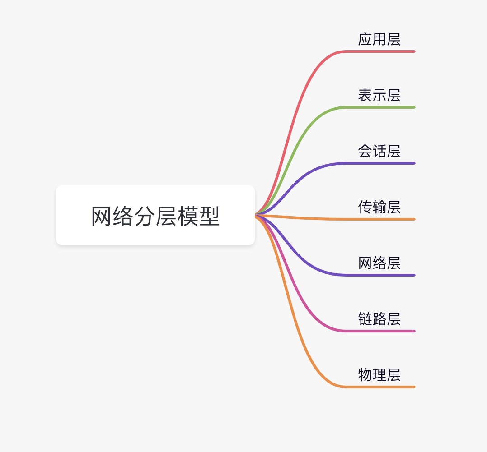
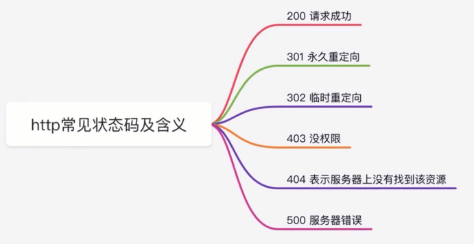
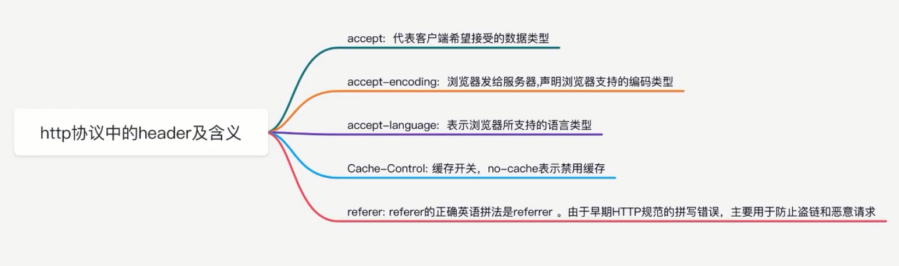

# 网络协议面试题及实操

- 你对网络分层模型怎么理解?
- 你知道 http 常见的状态码及含义吗
- http 有哪些请求方法 GET 和 POST 有什么区别
- http 协议中的 header 及含义你知道吗

## 你对网络分层模型怎么理解?

网络分层模型是前端面试中关于网络分层模型话题的一个高频考点

**物理层：**

最底层或第一层，该层包括物理联网媒介，双绞线、同轴电缆、光纤等。物理层的协议产生并检测电压以便发送和接收携带数据的信号，一般是0 1信号。传输这种信息就要用到物理媒体，双绞线、同轴电缆、光纤等，但具体的物理媒体不在OSI的7层模型内，有人把物理媒体当做第0层。物理层的任务就是为它的上一层提供一个物理连接，以及它们的机械、电气、功能和过程特性。如规定使用电缆和接头的类型、传送信号的电压等。在这一层，数据还没有被组织，仅作为原始的位流或电气电压处理，单位是bit比特。

**数据链路层：**

给电信号分组（以太网帧），并以广播的方式在子网中传播（每一个接收者比较目标MAC地址和自己的MAC地址可知自己是不是对方要找的人）。为了保证传输，从网络层接收到的数据被分割成特定的可被物理层传输的帧。帧是用来移动数据的结构包，它不仅包括原始数据，还包括发送方和接收方的物理地址以及检错和控制信息。其中的地址确定了帧将发送到何处，而纠错和控制信息则确保帧无差错到达。如果在传送数据时，接收点检测到所传送的互数据中有差错，就要通知发送方重发这一帧。数据链路层在不可靠的物理介质上提供可靠的传输。该层的作用包括：物理地址寻址、数据的成帧、流量控制、数据的检错、重发等。交换机工作在这一层。数据链路层协议的代表有：SDLC、HDLC、PPP、STP、帧中继等。

**网络层：**

给主机分配IP地址，判断两个IP是否属于同一子网，是则通过链路层发送，否则交给网关转发，实现了数据从子网A到子网B的传送。其主要功能是将网络地址翻译成对应的物理地址，并决定如何将数据从发送方路由到接收方。网路层通过综合考虑发送优先权、网络拥塞程度、服务质量以及可路由的话费来决定从一个网络中节点A到另一个网络中节点B的最佳路径。由于网络层处理，并智能指导数据传送，路由器连接网络各段，所以路由器工作在网络层。网络层是可选的，它只用于当两个计算机系统处于不用的路由器分割开的网段这种情况，或者当通信引用要求某种网络层或传输层提供给的服务、特性或者能力时。例如，当两台主机处于同一个LAN网段的直接相连这种情况，他们之间的通信只使用LAN的通信机制就可以了（即OSI参考模型的一二层）。

**传输层:**

OSI模型中最重要的一层。传输协议同时进行流量控制或是基于接收方可接收数据的快慢程度规定适当的发送速率。除此之外，传输层按照网络能处理的最大尺寸将较长的数据包进行强制分割。例如，以太网无法接收大于1500字节的数据包。发送方节点的传输层将数据分割成较小的数据片，同时对每一数据片安排一序列号。工作在这一层的协议是TCP(传输控制协议)、UDP(用户数据报协议)。TCP提供面向连接的可靠传输，UDP是面向非连接的非可靠传输（QQ即时通讯）。

**会话层:**

负责在网络中的两节点之间建立、维持和终止通信。会话层的功能包括：建立通信连接，保持会话过程通信连接的畅通，同步两个节点之间的对话，决定通信是否被中断以及通信中断时决定从何处重新发送。

**表示层:**

应用程序和网络之间的翻译官，在表示层，数据按照网络能理解的方案进行格式化；这种格式化也因所使用的网络的类型不同而不同。表示层管理数据的解密与加密，如系统口令的处理。例如：在Internet上查询你银行账户，使用的即是一种安全连接。你的账户数据在发送前被加密，在网络的另一端，表示层将对接收到的数据解密。除此之外，表示层协议还对图片和文件格式信息进行解码和编码。

**应用层：**

应用层也称为应用实体，它由若干个特定应用服务元素（SASE）和一个或多个共用应用服务元素(CASE)组成。例如文件传输访问和管理（FTAM）、电子文电处理（MHS）、虚拟终端协议（VAP）等。应用层负责对软件提供接口以使程序能使用网络服务，应用层提供的服务包括文件传输、文件管理以及电子邮件的信息处理等。代表协议有SMTP、FTP、HTTP等。

## 你知道 http 常见的状态码及含义吗

## http 有哪些请求方法 GET 和 POST 有什么区别

http 有哪些请求方法
- get
- post
- put
- delete

GET 和 POST 有什么区别
- get 用来获取数据，post 用来提交数据
- get 参数有长度限制（受限于 url 长度，具体的数值取决于浏览器和服务器的限制，最长 2048 字节），而 post 无限制
- get 是 url 明文传输，post 是放在请求体中

## http 协议中的 header 及含义你知道吗

