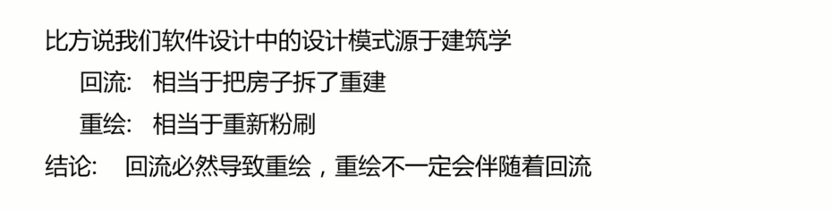

# 浏览器面试题

- 浏览器的事件传输机制原理你了解吗？
- LocalStorage 和 sessionStorage 的区别有哪些
- 你对浏览器的事件循环机制了解多少
- 你对浏览器的回流和重绘了解多少
- 从输入一个 URL 到页面展示整个过程中发生了什么?
- 你对跨域了解多少
- 你知道浏览器的主要组成部分吗

## 浏览器的事件传输机制原理你了解吗？

背景：
- 事件传输机制 **冒泡** 和 **捕获** 分别由 微软和网景公司提出
- 这个两个概念都是为了解决页面中**事件流**（事件发生顺序）的问题

事件触发的三个阶段：
- 捕获阶段
- 目标阶段
- 冒泡阶段

如何回答：
-  浏览器的事件传输机制背景
-  浏览器的事件触发的三个阶段
- 扩展至框架的事件绑定机制（以 React 合成事件为例）

## LocalStorage 和 sessionStorage 的区别有哪些

- 同属于 web 存储的范畴
- 用于存储客户端的本地数据

## 你对浏览器的事件循环机制了解多少

执行宏任务，然后执行该宏任务产生的微任务，若微任务在执行过程中产生了新的微任务，则继续执行微任务，微任务执行完毕后，再回到宏任务任务中进行下一轮循环

## 你对浏览器的回流和重绘了解多少

软件工程和建筑学的渊源：

## 从输入一个 URL 到页面展示整个过程中发生了什么?

从输入一个URL到页面展示整个过程中发生了什么, 该题目是关于浏览器面试中一个非常高频的考点。

**webKit的网页渲染过程**

WebKit是一个跨平台的web浏览器引擎。下面我们来看下webKit也就是我们的浏览器引擎是如何渲染页面的
浏览器的主要作用是将用户输入的“URL”转变为可视化图像 ，其中包含两个过程:
1. 其一是网页加载过程，就是从 URL到构建DOM树
2. 其二就是网页渲染过程，从DOM生成可视化图像

其实这两个过程也会交叉, 我们可以统称为网页的渲染过程 网页渲染有一个特性，通常视图比屏幕可视化面积大。所以在渲染时一般加入滚动条，就用户体验来说，垂直方向的滚动条效果好过水平页面的滚动条效果。

**渲染过程中包含的数据和模块:**

a、数据:
- 网页内容
- DOM
- 内部表示和图像

b、模块则包括:
- HTML 解释器
- css 解释器
- javascript引擎
- 布局和绘图模块

**渲染过程的三个阶段:**

根据数据的流向, 可以把过程分为三个阶段:
- 第一个阶段就是从网页的URL到构建完DOM树
- 第二个阶段是从DOM树到构建完WebKit的绘图上下文
- 第三个阶段是从绘图上下文生成最终的图像

a、第一阶段 从网页的URL到构建完DOM树

具体过程如下:
1. 当用户输入网页URL时，WebKit调用资源加载器加载该URL对应的网页
2. 加载器依赖网络建立连接，发送请求并接受答复。
3. WebKit接受到各种网页或者资源的链接，其中某些资源通过同步或者异步获取
4. 网页被交给 HTML解释器解释为一系列词语
5. 解释器根据词语构建节点（NODE），形成DOM树。
6. 如果节点是JavaScript代码就调用JavaScript引擎解释并执行
7. JavaScript代码可能会修改DOM树的结构
8. 如果节点需要依赖其他资源，例如图片，css ，视频等，调用资源
9. 加载器来加载他们但这个过程异步的，不会阻碍当前dom树的构建，如果是javascript
10. 资源url（没有标记异步，通过async和defer）则需要停止当前DOM树的创建
11. 直到js资源加载并执行完毕之后才会继续DOM树的创建

上述过程中，网页会发出“DOMConent”和DOM onload事件，分别在DOM树构建完之后，以及DOM树建完并且网页所以来的资源都加载完之后发生，因为某些资源的加载并不会阻碍DOM树的创建，所以这两个事件多数时候不是同时发生的。
- DOMConentLoad: DOM树构建完之后
- onload : DOM树建完并且网页所以来的资源都加载完

第二阶段 webkit利用cssTree和DOMTree构建renderTree 直到绘图上下文

这一阶段的具体过程如下:
1. CSS文件被CSS解释器解释成内部表示结构。
2. CSS解释器工作完之后，在DOM树上附加解释后的样式信息，这就是RenderObject树
3. RenderObject节点在创建的同时,WebKit会根据网页的层次信息创建RenderLayer树,同时构建一个虚拟的绘图上下文

RenderObject树的简历并不表示DOM树会被销毁,事实上,上图中的四个内部结构一直存在,直到网页被销毁, 因为它们对于网页的渲染起了非常大的作用。

c、第三个阶段是从绘图上下文到最终的图像(主要依赖2D和3D图形库)

这一阶段的具体过程如下:
1. 绘图上下文是一个与平台无关的抽象类,他将绘图操作侨接到不同的具体实现类。
2. 需要Chromium的合成器来完成多进程和GPU加速机制
3. 图实现类将2D图像库或者3D图像库绘制的结果保存下来,交给浏览器来同浏览器界面一起显示

**面试中遇到该题目我们该如何回答 ?**

首先讲清楚主流程:
1. 其一是网页加载过程，就是从 URL到构建DOM树
2. 其二就是网页渲染过程，从DOM生成可视化图像

其次讲清楚渲染过程中包含的数据和模块
1. 数据: 网页内容,DOM, 内部表示和图像
2. 模块则包括: HTML 解释器,css 解释器,javascript引擎,布局和绘图模块

最后讲清楚页面渲染的三个阶段以及具体的步骤:
1. 第一个阶段就是从网页的URL到构建完DOM树
2. 第二个阶段是从DOM树到构建完WebKit的绘图

## 你对跨域了解多少

当一个请求 url 的协议、域名、端口三者之间任意一个与当前页面的 url 不同即为 **跨域**

## 你知道浏览器的主要组成部分吗

