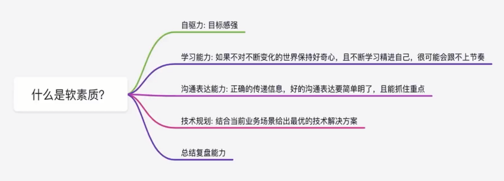
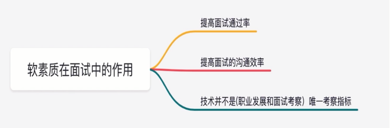
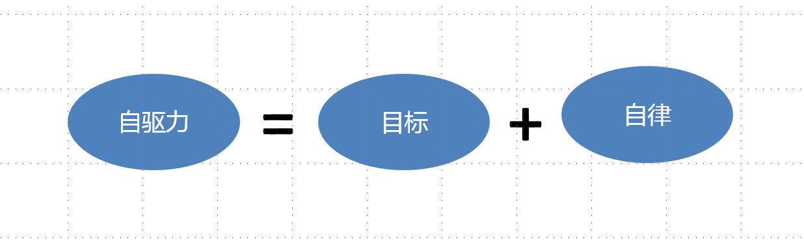

# 软素质

## 你知道软素质在面试中的作用吗

## 如何提升软素质让面试更加分

**一、自驱力**

之前有提到自驱力需要保持一个良好的目标感，其实这里伴随着一个自律，因为光有目标是不够的，我们还需要实现这个目标。所以往往是自律来维持我们实现这个目标。

比如：我们是不是经常做计划？ 那么我们定制的计划完成度如何？没有完成是遇到了什么原因？

我们用具体事例来说明一下。

比如，我们自己定了跑步的计划，一个自驱力强的人首先会给自己设定个有挑战的目标，比如一周跑步4次，每次5公里。同时还会有足够的自律保证目标的实现，如果计划的完成度很低很难说这个人自驱力强。

所以一般看来，自驱力强的人对自己会比较狠，说到这里想必大家对于自驱力都有一定的了解了，可以先给自己定个小目标，比如：每天刷两道面试题。第一阶段完成了，可以来第二阶段，每天刷五道这样，一步步的进阶着来；当然也可以是其他自己感兴趣的事情，慢慢来培养自己的自驱力哦。

**二、学习能力**

首先要有学习的意愿，其次要有行动，最后还有要有结果。

要有学习的意愿，首先要有充足的好奇心，感到好奇，才会有兴趣，才会有学习的动力。

我们IT行业，技术变更迭代是非常迅速的，所以针对我们方向的技术最小版本呀，新特性呀，优点呀，这些我们都是需要了解的。了解这些内容可以向面试官展现知识的广度，侧面展示学习能力。

**三、沟通表达能力，**

沟通的目的是要正确的传递信息，好的沟通表达要简单明了，且能抓住重点。

好的表达方式是采用STAR 原则，所谓STAR 原则，即 Situation（情景）、Task（任务）、Action（行动）和 Result（结果）四个英文单词的首字母组合，它是结构化面试当中非常重要的一个理论。

这是一个长期不断积累的过程。那这个地方给大家推荐一本书，就是这个`《金字塔原理》`，它是帮我们思考，表达和解决问题这个逻辑。通过学习这本书中的这个思想可以帮助我们更高效的表达书。

**四、技术规划能力**

规划是对未来整体性、长期性、基本性问题的思考，并结合这些思考设计全面长远的发展计划和行动方案。和计划相比，规划更加具有前瞻性、全局性、战略性和方向性。是高级工程师的一个硬实力。

**五、总结复盘能力**

对项目进行总结复盘（不管是业务项目还是技术项目）也是一项能力，复盘的目的是从之前的经历（可能是成功的经历，也可能是失败的经历）中总结可供指导后续工作的经验。

总结复盘的方式也多种多样，但万变不离其宗，主要还是围绕下面几个内容：目标回顾、进展评估、原因分析、经验总结。

总结复盘也是我们日常工作中的一个良好的习惯，我们应提早培养，尽早养成哦。

## 常见软技能面试   

一、说一下自己的优点和缺点？

1. 避开岗位的核心技能
2. 把缺点放在场景中描述
3. 对缺点进行合理化解释
4. 优点随便说，主要方向还是在岗位上

二、是否能接受加班？（建议分情况作答）

- 假设公司有重要的项目要赶。示范回答：贵公司现在正处于发展上升期，也在官网上有看到公司的重要项目成果，我觉得有时候因为赶项目进度、工作需要等忙起来是非常正常的，面对这种情况，我是非常愿意配合公司和团队的工作，让工作能够更顺利地完成，此外，我也相信自己一定能在公司安排的工作中获得到锻炼，获得更快地成长。

- 假设自己作为新人，对业务不熟悉。示范回答：我作为公司刚进去的新人，可能刚开始进入公司接触业务时不太熟练，会出现需要加班的情况，但我更愿意提高工作效率，并积极向公司的前辈请教学习，在一定的时间内完成工作而不是拖到下班之后。当然， 如果有紧急的事情，忙起来需要加班也是可以接受的。

三、对薪酬的要求？

- 薪资并不是我求职的唯一标准，我来贵司求职的主要动机是兴趣，这份工作是我喜欢做的，也相信自己可以胜任，更相信公司会给出一个合理的薪酬。
- 我希望薪资可以达到 XX，据我了解，贵司这个岗位薪资范围是A~B ，而结合岗位职责及任职要求，我对自己也进行了相应评估，也愿意接受贵司的下一步考核。

四、为什么你觉得这个岗位适合自己？（为什么要聘用你）

- 描述应聘岗位的胜任条件，强调自己的工作能力跟岗位的匹配度，岗位要求的工作技能是否自己掌握了，掌握的程度是怎样的，最好在面试中说出来。（建议：在面试前最好是要针对应聘岗位，把自己胜任的条件一一列出来，做到知己知彼。）

- 描述自己能为公司做出什么贡献，公司是一个讲究利益的地方，聘用你肯定要你为公司做出贡献。那么你在回答这个问题时，就需要说出你的加入可以为公司带来什么，这非常重要。（一定要明确你的工作目标和职业规划，表明你的立场和专业程度，让HR信任你。）

- 描述出自身的优势。公司为何要聘用你，而不聘用别人，肯定是你有比别人优秀的地方。那么在回答这个问题时，就一定要说出自己与众不同的地方，最好是要举一个例子，来支持你的观点。

（提示：这个问题，主要是想进一步了解你的信息，以及为这次面试做了多少功课。在面试前，最好是要尽可能获取有关公司可行业的资料信息。在回答的时候，结合自己所做的功课，建立个人和公司的联系，说明自己在哪一方面能够匹配公司的要求。）

五、对我们公司有多少了解？

- 如果不了解，就按实际情况回答就好，知道多少就说多少，（很多时候去面试对这个公司的了解都是从网上查到的，不会太深入）；最好是提前做好一些调研和准备工作。

六、缺乏工作经验，如何胜任这份工作？

- 承认工作经验的重要性。
- 突显个人优势。用自己的其他优势特长来补足经验上的不足，比如说记忆力好、动手能力强、语言能力强、学习能力强等。
- 强调自己会不断提高工作能力。切忌用假大空的话。

## 如何回应面试官问的「你有哪些要问我的？」？

## 怎样得体回答面试官的「你还去哪面试了」？

## 如何得体回答「介绍未来3年职业规划」？

