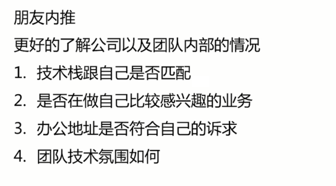
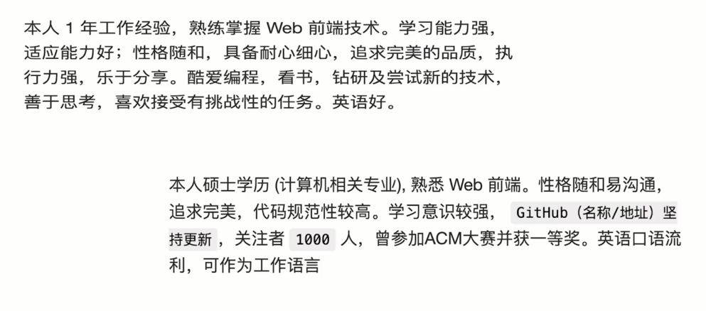
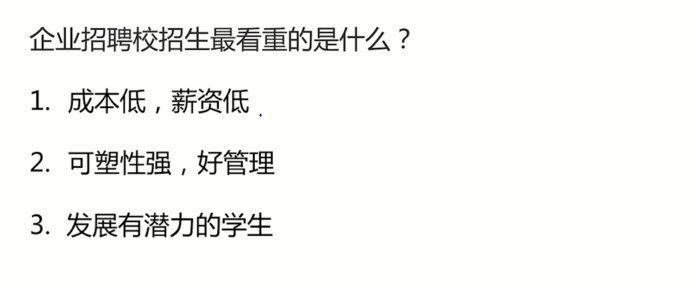
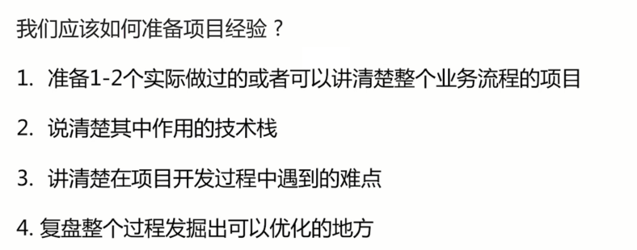
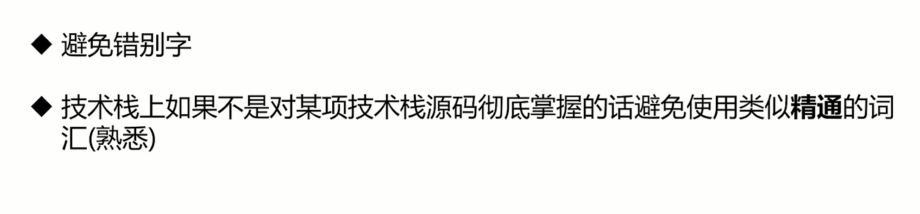
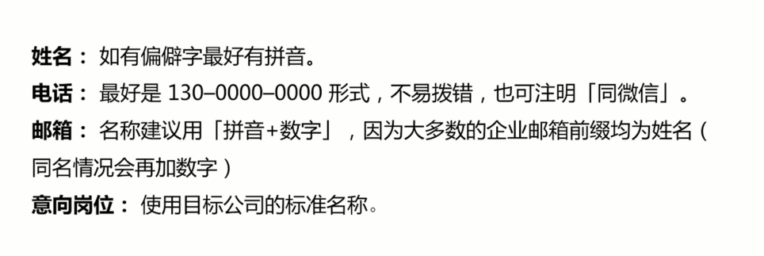
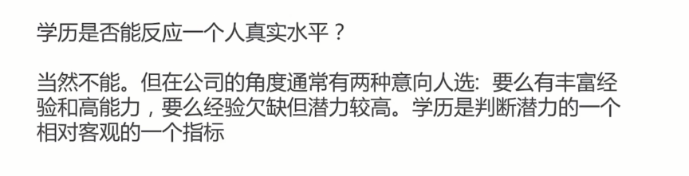

# 简历准备

- 有哪些靠谱的简历投递渠道
- 如何投递简历更容易被优先看到
- 怎么写个人评价可以更好的突出个人的优点
- 无项目经验or项目经验少会被刷掉么
- 简历书写注意事项
- 怎么写学历信息可以扬长避短
- 如何写好一份简历

## 有哪些靠谱的简历投递渠道

- 朋友内推
- 招聘软件：boos 直聘、拉钩
- 关注各公司招聘公众号



## 如何投递简历更容易被优先看到

有很多求职者发现，自己在投递简历之后，简历压根没有被HR查看，或者HR查看了简历后就毫无音讯，如何让企业的HR在众多的求职简历中看到你的简历并对你感兴趣也是很关键的一步。哪怕你的工作能力非常强，但是你的简历不被HR看见的话，你的优点也体现不出来。大多数人在投递简历的时候就是随心所欲，并不考虑自己的简历投递后会不会被压在最底下，会不会被HR看到。

大多数求职者需要面对的非常关键的问题，就是“如何投递简历更容易被优先看到”，因为我们通常会遇到一个情况，就是在投递简历之后，会发现简历压根没有被HR查看；虽说酒香不怕巷子深，但是在深的巷子也得先让“酒香”飘出去，所以不管我们拥有多过硬的技术，我们的第一步，还是需要先让HR能够看得到我们的简历。
在这里分享几个小窍门给大家：

一、简历投递时间

投递简历我们选在每天10点, 下午2点之前这个时间内更容易被优先看到, 因为一般企业的HR,通常会在这两个时间段内查看简历。那么我们在该时间段前半小时投递简历呢，更容易被优先看到。

二、职位发布时间

如果职位发布很久了，很可能已经不再招聘，但是招聘者忘记把招聘信息给撤走，当然也不排除一直在招聘的职位。所以一般建议选择发布时间较近（时间最新）的职务，也可以证明该职位比较紧缺，正是招聘方需要人的时候，选择这种职位去投递，查看率大大增加。

三、渠道选择

1. 内推：除了我们一般的投递外，还有一种内推的现在，学长、学姐帮助你将简历内推到其公司，这种情况下HR是一定可以看到我们的简历的。
2. 公众号：一些博主、公司、技术大牛的公众号也可以留意下，可能会发布招聘信息。
3. 招聘网站
    - 推荐：内推 > 公众号 > 招聘网站


## 怎么写个人评价可以更好的突出个人的优点




## 无项目经验or项目经验少会被刷掉么





## 简历书写注意事项

- 规范性
- 内容本身





## 怎么写学历信息可以扬长避短



本科以上写前面，专科写后面

## 如何写好一份简历

简历绝对不是随便写写，或者把经历往上罗列就好了。 一份好的简历，除了恰如其分地描述学术经历和工作经验，内容安排版式设计也十分重要。

按照惯例，很多朋友都会选择在年后去尝试一份新的工作，趁今天这个机会，我就来跟大家说说如何写一份吸引人的简历吧！

**一、格式&标题**

首先是简历格式，一定要把你的简历素材，不论是WORD或者多张JPG图片，整合到一个PDF文件中。

这样做有三个好处:
- PDF文件是不可编辑的，增加了简历的安全性；
- 避免了类似对方WORD软件版本不兼容导致的打不开或者显示错乱；
- 无需让对方下载多个文件，大大减少了HR的工作量。

之后就是文件命名了，其实很简单，无非就是简洁，让人一目了然。

有的公司会在发布征集信息的时候给好模版，比如求职岗位+名字+毕业年份，我一般命名的方式是：自己的名字+公司应聘职位。

比如"摘星阁助理-汪七月-2018"，如果有给模版，就按模版的写，没有的话就是“自己的名字+公司应聘职位"。

**二、版式风格**

最近几年，简历的模版越来越多，版面也越来越“酷炫”，什么颜色拼接，元素嵌套…都是打着“给人眼前一亮”的旗号，但其实类似这些效果，我是不建议采用的。

投简历，最核心是里面的内容，视觉上的干扰会严重阻碍HR的查阅。要知道，如果十秒之内看不到重点或者还没get到主题，简历很可能就被HR直接扔进垃圾桶里。

对我来说，反而是黑白字、配色温和舒适的简历，更能凸显一个人的专业性。

另外，记得控制好简历的篇幅，挑最重要、最能展示自己特点的部分来写，没有HR喜欢看一个陌生人的长篇大论。

总之，如何让HR一目了然、毫不费力地接收到你的信息，也是要求职者必备的一项技能。

标题是给HR的第一印象，如果写的乱七八糟，HR会觉得你不重视这份工作，很难打动她去查阅你的简历。

要记住，让HR省心，让她留下良好的第一印象，是作为求职者的一项必备能力。

**三、表明意向工作**

写简历前一定要弄清楚两个问题：“我能做什么？” “我喜欢做什么？”

很明显大家都喜欢去做自己喜欢的事情，希望拿到高的薪酬。但更重要的是，你到底有什么能力，到底可以把什么事情做好。

千万不要眼高手低，根据自己的实力进行背景评估，以防去投递简历做出无用功，浪费时间浪费精力。

找到自己意向的公司之后，再对该公司的背景，工作环境和重要人物背景做调查。如果在简历中，你的一些特质跟公司文化贴切，自然而然你就会与众不同。

不过要记住，不要说谎，不要为了迎合公司的特点去改变自己的特质。真实展示出自己，其他的让公司去定夺。

**四、展现真实自我**

对自己做出一番自我评价，也是让HR了解你的一个最便捷的窗口：

- 礼貌性的突出自我，无需过分谦虚，也不妄自菲薄。多写一些自己的专业特长，避免那些模凌两可的话语，比如什么兴趣广泛之类的；
- 如果有证书或者获得过什么奖项可以挑重点罗列；
- 简洁！简洁！简洁！相信我，只说重点，多说无益。

**五、照片**

很多人会有疑问，简历到底放不放照片呢？

这个对于我们IT行业来说不是必要项（毕竟我们是技术型），可以考虑不放。如果你觉得自己的长相是很加分的，也是可以放的，如果加照片的话，建议：不要放自拍照、生活照，后期修图也要适当，干净舒适即可（也可以使用证件照）。

**六、切勿海投简历**

很多朋友为了方便，一份简历投了许多家公司，不过在我看来，这种方式是很不可取的。

说到底，我们最终希望的是给HR留下深刻的印象，如果你海投了简历，除非你的硬件条件足以拉开竞争对手好几个档次，否则HR会觉得你诚意不足，有许多“备胎”。

相反，如果你针对每一家公司制定了与其相关的简历，相信我，一定会大大提高HR对你的印象分，你被留下来的几率也会更大。

**七、做好石沉大海的心理准备**

上面说了这么多，但往往能得到HR回应的简历仍然只是少数。先不要怀疑自己，因为很可能跟你一点关系都没有。

HR每天看简历的时间基本上小于两个小时，但需要查阅的简历却有一堆，甚至大公司每年收到十万份简历，所以很可能你的简历压根没被打开，也可能有太多比你更对口、更合适这个岗位的求职者。

不是能力问题，只关乎运气，还有合不合适

**八、量化你的项目，给出数字**

最后一点，每个项目的描述都需要量化，最好能给出数字。这能够大大提高简历的可信度和专业性，给招聘人员留下深刻印象。

请看下面这些改写的例子，加入了量化，效果好了很多。如下：

```txt
例子一：
    改写前:
    结合使用 OAuth 和 JavaScript，实现了社交网站登录和个人资料的自动填充
    改写后:
    通过使用 OAuth 和 JavaScript，实现了社交网站登录和个人资料自动填充，将网站的转化率提高了20％。

例子二：
    改写前:
    使用 Ajax 技术减少页面加载时间。
    改写后:
    使用 Ajax 技术减少了30％的页面加载时间

例三：
    改写前:
    与同事合作，部署了一些 Web 应用程序，并排查故障。
    改写后:
    与后端工程师团队合作，一起开发、部署、故障排查了7个的 Web 应用程序
```

**九、项目的三要素**

事实上，项目信息的写法有一个公式。

**项目 = 产品 + 技术 + 结果**

据说，谷歌要求应聘者描述经历时，每段经历必须提供下面三个信息

- 做了什么产品
- 用到了什么技术
- 取得了什么结果

比如，“领导了 X 功能的开发，使其集成到 Y 产品，带来额外的 Z 收入”。

除了三个基本信息，项目描述还要注意下面几点。

- （1）主要介绍新项目，你过去3年～4年的经历最关键。不要详细描述较旧的项目。
- （2）突出项目规模，比如用户数量、数据有多少 TB、每天的收入金额或交易量。
- （3）最好都用动词开头，这样让人感到简洁有力。为了避免单调，动词也可以适当变化，“开发”、“实现”、“部署”、"完成"这些词都可以换着用。

**总结**

应聘 IT 行业 难度其实是不高的。因为整个行业非常缺工程师。

企业自己也知道，不太容易招到水平很高的高级工程师。因为大家都在抢人，遇到合适的人选，出手稍慢，可能就被其他公司截走了。所以，只要你的水平能满足企业的最低要求，他们就愿意招你，至少会给面试机会。

