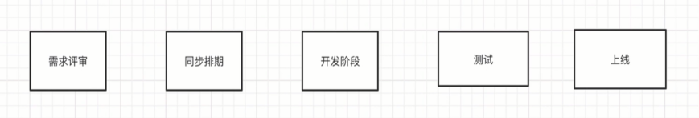
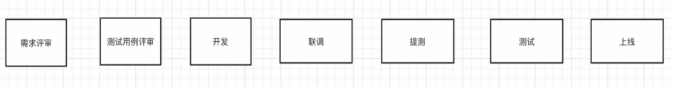
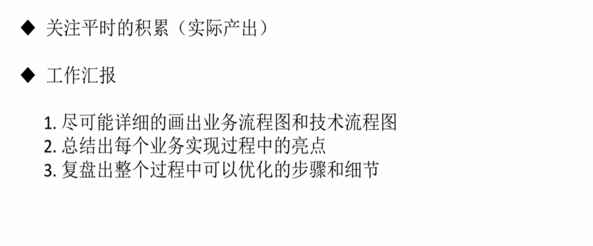

# 总结

## 团队角色及工作流程

**小厂：**
- 前端
- 后端
- 产品经理
- UI 设计师
- 测试工程师

**大厂：**
- 前端
- 后端
- 产品经理
- UI 设计师
- UE 设计师
- 测试工程师

## 晋升攻略

## 劳逸结合打持久战

- 做好长远的职业规划
- 工作生活分离不要把工作带回家

## 面试锦囊

- 面试中灵活运用，不要生搬硬套
- 软能力是个长期积累的过程
- 劳逸结合，快乐工作，健康生活
