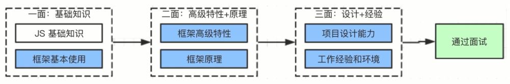

# 前置

可否自己复习面试题？
- 需要有足够的时间
- 需要有自学能力
- 需要有毅力

原理 != 源码

## 前端常见面试流程

框架面试：

Vue：
- Vue 基本使用
- Vue 高级特性
- Vue 原理

React：
- React 基本使用
- React 高级特性
- React 原理

工具面：
- Webpack 配置
- 性能优化
- bable

项目设计：
- 状态设计
- 组件设计
- 组件通讯

