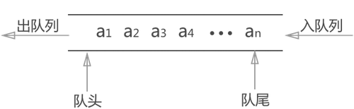
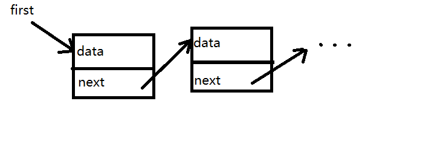

# 数据结构和算法

## 为何要考察

- 辨别优秀工程师（考虑鉴别成本+成功率）
- 前端范围越来越广，要求越来越高

如果在短时间之内快速判断一个工程师是否优秀？考察算法是最合理的方式 —— 这是业界多年的经验积累。

前端面试考算法不是因为内卷。算法一直在后端面试中被考察，现在前端也考查，说明前端能做的工作越来越多了。这是好事。

## 考察的重点

- 算法的时间复杂度和空间复杂度
- 三大算法思维：贪心，二分，动态规划
- 常见数据结构

## 注意事项

- 算法，有难度，要耐心学习
- 一个问题的解决方案有很多，要找出最优解（重要！）
- 不仅关注题目本身，更要关注知识点和解题思路
- 按顺序学习

## 算法复杂度

- 什么是复杂度
- 时间复杂度
- 空间复杂度

### 什么是复杂度

- 程序执行时需要的计算量和内存空间（和代码是否简洁无关）
- 复杂度是**数量级**（方便记忆、推广），不是具体的数字
- 一般针对一个具体的算法，而非一个完整的系统


**时间复杂度**：程序执行时需要的计算量（CPU）

**空间复杂度**：程序执行时需要的内存空间


## O(1)

- 时间：一次就够（数量级）
- 空间：有限的可数的空间（数量级）
- 代码就是平铺直叙的执行，没有任何循环。

## O(n)

- 时间：和传输的数据量一样（数量级）
- 空间：和输入的数据量相同的空间（数量级）
- 普通的循环。

## O(n^2)

- 数据量的平方（数量级）
- 两个普通循环的嵌套，例如常见的冒泡排序。

## O(logn)

- 数据量的对数（数量级）
- 有循环，但其中使用了二分法，例如：二分查找算法
- 二分法是非常重要的算法思维，它可以极大的减少复杂度，而且计算量越大、减少的越明显。可以看看本文上面的图。

## O(n*logn)

- 数据量 * 数据量的对数（数量级）
- 嵌套循环，一层是普通循环，一层有二分算法。例如：快速排序算法。

**前端领域**：`重时间轻空间`

## 程序员必须掌握算法复杂度

- 如果没有复杂度的概念和敏感度，写程序是非常危险的
- 例如：代码功能测试正常，但数据量大了，程序就会奔溃
- 对于前端开发，尤其是时间复杂度
- 达到 O(n^2) 的算法基本是不可用的！！！

## 划重点

- 算法复杂度是学习算法的基础，非常重要，理解不了就背诵
- 复杂度是数量级，用 O(...) 表示，内部是一个函数表达式
- 前端开发：重时间，轻空间


## 常见数据结构

前端开发中常见的数据结构

## 栈 Stack

栈 Stack 是一种“先进后出”的数据结构。


```js
// 数组实现 栈
const stack = []
stack.push(100) // 压栈
stack.pop() // 出栈
stack.length // 长度
```

**逻辑结构 vs 物理结构**
- 栈 vs 数组
- 栈：逻辑结构。理论模型，不管如何实现，不受任何语言的限制
- 数组：物理结构。真实的功能实现，受限于编程语言

## 队列 Queue

队列 Queue 是一种“先进先出”的数据结构。



```js
// 数组实现 队列
const queue = []
queue.push(100) // 入队
queue.shift() // 出队
```

## 链表 Linked list

链表不是连续的数据结构，而是由一系列的节点组成，节点之间通过指针连接。



```ts
// 链表节点的数据结构
interface IListNode {
    data: any
    next: IListNode | null
}
```

## 树 Tree

树，是一种有序的层级结构。每个节点下面可以有若干个子节点。例如常见的 DOM 树。


```ts
// 树节点的数据结构
interface ITreeNode {
    data: any
    children: ITreeNode[] | null
}
```

## 二叉树 Binary Tree

二叉树，首先它是一棵树，其次它的每个节点，最多有两个子节点，分别为 `left` 和 `right`


```ts
// 二叉树节点的数据结构
interface IBinaryTreeNode {
    data: any
    left: IBinaryTreeNode | null
    right: IBinaryTreeNode | null
}
```

