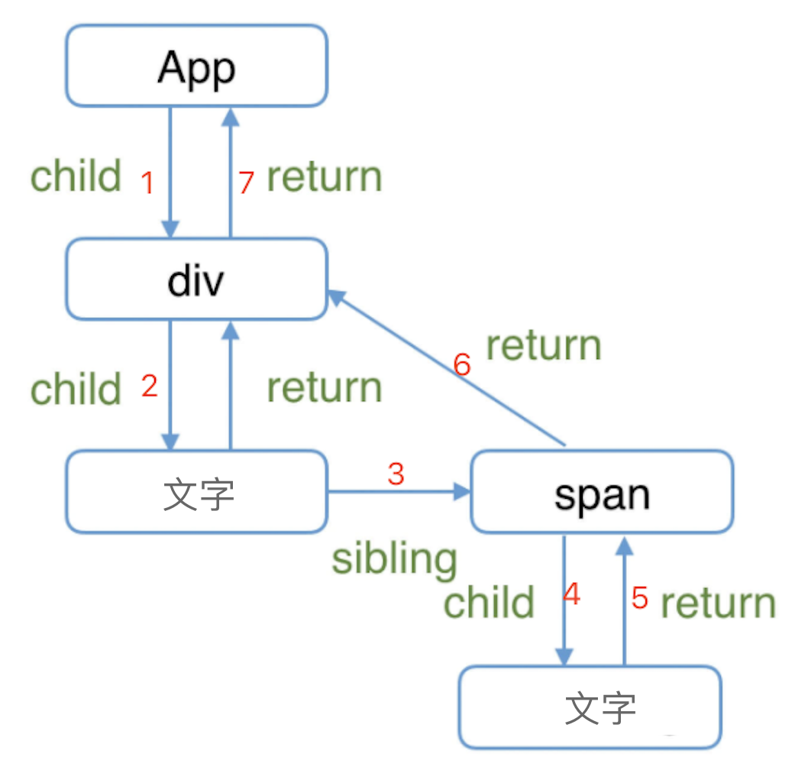

# 反转单向链表

## 题目

定义一个函数，输入一个单向链表的头节点，反转该链表，并输出反转之后的头节点

## 链表

链表是一种物理结构（非逻辑结构），**类似**于数组。<br>
数组需要一段连续的内存空间，而链表不需要。

数据结构
- 单向链表 `{ value, next }`
- 双向链表 `{ value, prev, next }`

链表 VS 数组：
- 都是有序结构
- 链表：查询慢，新增和删除较快
- 数组：查询快，新增和删除较慢

```ts
/**
 * 根据数组创建单向链表
 * @param arr number arr
 */
export function createLinkList(arr: number[]): ILinkListNode {
    const length = arr.length
    if (length === 0) throw new Error('arr is empty')

    let curNode: ILinkListNode = {
        value: arr[length - 1]
    }
    if (length === 1) return curNode

    for (let i = length - 2; i >= 0; i--) {
        curNode = {
            value: arr[i],
            next: curNode
        }
    }

    return curNode
}

const arr = [100, 200, 300, 400, 500]
const list = createLinkList(arr)
console.info('list:', list)
```

## 应用场景

React Fiber 就把 vdom 树转换为一个链表，这样才有可能随时中断、再继续进行。<br>
如果 vdom 是树，那只能递归一次性执行完成，中间无法断开。



## 分析

反转链表，画图很好理解。没有捷径，遍历一边，重新设置 next 指向即可。<br>
但实际写代码，却并不简单，很容易造成 nextNode 丢失。

因此，遍历过程中，至少要存储 3 个指针 `prevNode` `curNode` `nextNode`

时间复杂度 `O(n)`

## 答案

参考 reverse-link-list.ts

## 划重点

- 链表
- 链表和数组的不同
    - 内存占用
    - 查询、新增、删除的效率
- 如何保证 nextNode 不丢失
- 链表的代码逻辑比较繁琐，调试成本高

## 扩展

思考：**`用数组和链表实现队列，哪个性能更好？`**

### 分析

- 数组是连续存储， push 很快，shift 很慢
- 链表是非连续存储，add 和 delete 都很快（但查找很慢）
- 结论：链表实现队列更快

### 链表实现队列

- 向链表，但要同时记录 head 和 tail
- 要从 tail 入队，从 head 出队，否则出队时 tail 不好定位
- length 要实时记录，不可遍历链表获取

代码实现：queue-with-list.ts

### 性能分析

- 空间复杂度都是 O(n)
- add 时间复杂度：链表 O(1) ;  数组 O(1)
- delete 时间复杂度：链表 O(1) ;  数组 O(n)

### 划重点

- 链表是什么？链表 VS 数组
- 数据结构的选择，要比算法优化更重要
- 要有时间复杂度的敏感性，如 length 不能遍历去查找计算
