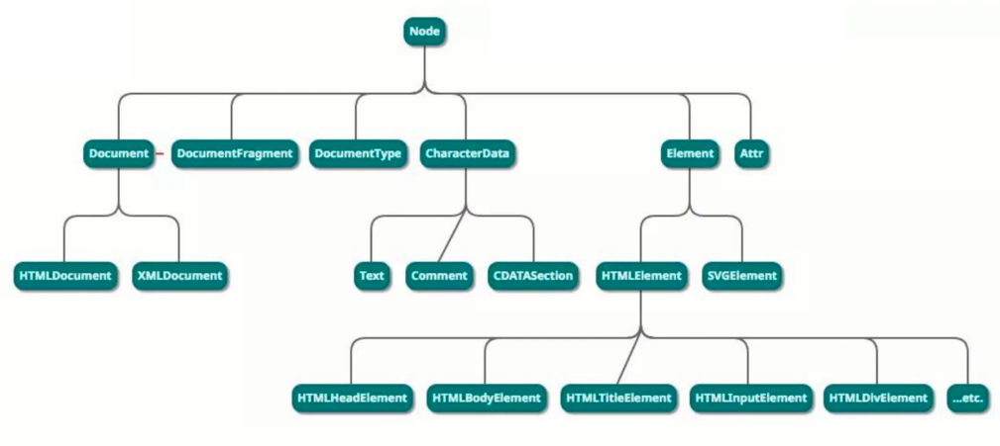

# HTMLCollection 和 NodeList 的区别

## 题目

HTMLCollection 和 NodeList 的区别，Node 和 Element 的区别

## Node 和 Element

DOM 结构是一棵树，树的所有节点都是 `Node` ，包括：document，元素，文本，注释，fragment 等

`Element` 继承于 Node 。它是所有 html 元素的基类，如 `HTMLParagraphElement` `HTMLDivElement`



```js
class Node {}

// document
class Document extends Node {}
class DocumentFragment extends Node {}

// 文本和注释
class CharacterData extends Node {}
class Comment extends CharacterData {}
class Text extends CharacterData {}

// elem
class Element extends Node {}
class HTMLElement extends Element {}
class HTMLParagraphElement extends HTMLElement {}
class HTMLDivElement extends HTMLElement {}
// ... 其他 elem ...
```

## HTMLCollection 和 NodeList

HTMLCollection 是 Element 集合，它由获取 Element 的 API 返回
- `elem.children`
- `document.getElementsByTagName('p')`

NodeList 是 Node 集合，它由获取 Node 的 API 返回
- `document.querySelectorAll('p')`
- `elem.childNodes`

## 答案

- HTMLCollection 是 Element 集合，NodeList 是 Node 集合
- Node 是所有 DOM 节点的基类，Element 是 html 元素的基类

## 划重点

注意 Node 和 Element 在实际 API 中的区别，如 `children` 和 `childNodes` 获取的结果可能是不一样的（如果子节点有 Text 或 Comment）

- 获取 Node 和 Element 的返回结果可能不一样
- 如 `childNodes` 和 `children` 不一样
- 前者会包含  Text 或 Comment 节点，后者不会

## 扩展：类数组

HTMLCollection 和 NodeList 都不是数组，而是“类数组”。转换为数组：

```js
// HTMLCollection 和 NodeList 都不是数组，而是“类数组”
const arr1 = Array.from(list)
const arr2 = Array.prototype.slice.call(list)
const arr3 = [...list]
```
