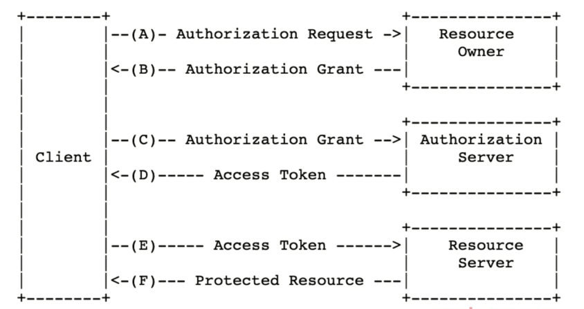

# cookie 和 token 区别

## 题目

cookie 和 token 有何区别

## cookie

http 请求是无状态的，即每次请求之后都会断开链接。 
所以，每次请求时，都可以携带一段信息发送到服务端，以表明客户端的用户身份。服务端也也可以通过 `set-cookie` 向客户端设置 cookie 内容。 
由于每次请求都携带 cookie ，所以 cookie 大小限制 4kb 以内。

- HTTP 无状态，每次请求都要带 cookie，以帮助识别身份
- 服务器也可以向客户端 set-cookie，cookie 大小限制 4kb
- 默认有跨域限制：不可跨域共享、传递 cookie

## cookie 跨域限制

浏览器存储 cookie 是按照域名区分的，在浏览器无法通过 JS `document.cookie` 获取到其他域名的 cookie 。

http 请求传递 cookie 默认有跨域限制。如果想要开启，需要客户端和服务器同时设置允许
- 客户端：使用 fetch 和 XMLHttpRequest 或者 axios 需要配置 `withCredentials`
- 服务端：需要配置 header `Access-Control-Allow-Credentials`

## cookie 作为本地存储

前些年大家还常用 cookie 作为本地存储，这并不完全合适。 
所以后来 html5 增加了 `localStorage` 和 `sessionStorage` 作为本地存储。

## 浏览器禁用第三发 cookie

- 和跨域限制不同。这里是：现代浏览器都开始禁止网页引入的第三方 JS 设置 cookie
- 打击第三方广告，保护用户个人隐私
- 新增属性 SameSite：Strict/Lax/None , 值可供选择

例如一个电商网站 A 引用了淘宝广告的 js
- 你访问 A 时，淘宝 js 设置 cookie ，记录下商品信息
- 你再次访问淘宝时，淘宝即可获取这个 cookie 内容
- 再和你的个人信息（也在 cookie 里）一起发送到服务端，这样就知道了你看了哪个商品

## cookie 和 session

cookie 用途非常广泛，最常见的就是登录。

使用 cookie 做登录校验
- 前端输入用户名密码，传给后端
- 后端验证成功，返回信息时 set-cookie
- 接下来所有接口访问，都自动带上 cookie （浏览器的默认行为， http 协议的规定）

什么是 session ？
- cookie 只存储 userId ，不去暴露用户信息
- 用户信息存储在 session 中 —— session 就是服务端的一个 hash 表

总结：
- cookie 用于登录验证，存储用户标识（如userId）
- session 在服务端，存储用户详细信息，和 cookie 信息一一对应
- cookie + session 是常见登录验证解决方案

## cookie vs token

token 和 cookie 一样，也是一段用于客户端身份验证的字符串，随着 http 请求发送
- cookie 是 http 协议规范的，而 token 是自定义的，可以用任何方式传输（如 header body query-string 等）
- cookie 会默认被浏览器存储，而 token 默认不会在浏览器存储
- token 没有跨域限制

所以，token 很适合做跨域或者第三方的身份验证。

## token 和 JWT

JWT === JSON Web Token

JWT 的过程
- 前端输入用户名密码，传给后端
- 后端验证成功，返回一段 token 字符串 - 将用户信息加密之后得到的
- 前端获取 token 之后，存储下来
- 以后访问接口，都在 header 中带上这段 token

## 答案

- cookie：http 规范；有跨域限制；可存储在本地；可配合 session 实现登录
- token：自定义标准；不在本地存储；无跨域限制；可用于 JWT 登录

## 划重点

- cookie 的知识点很多，对于 HTTP 也很重要
- Session 存在的价值
- token 和 cookie 要对比理解，否则容易混淆

## 连环问：session 和 JWT 比较，你更推荐哪个？

Session 优点：
- 原理简单，易于学习
- 用户信息存储在服务端，可以快速封禁某个登录的用户 —— 有这方强需求的人，一定选择 Session

Session 的缺点：
- 占用服务端内存，有硬件成本
- 多进程、多服务器时，不好同步 —— 一般使用第三方 redis 存储 ，成本高
- 跨域传递 cookie ，需要特殊配置

JWT 的优点：
- 不占用服务器内存
- 多进程、多服务器，不受影响
- 不受跨域限制

JWT 的缺点：
- 用户信息存储在客户端，无法快速封禁登录的用户
- 万一服务端秘钥被泄密，则用户信息全部丢失
- token 体积一般大于 cookie，会增加请求的数据量

总结：
- 如有严格管理用户信息的需求（保密、快速封禁）推荐 Session
- 如没有特殊要求，则使用 JWT（如创业初期的网站）
- 如没有“快速封禁登录用户”的需求，建议使用 JWT 方式

## 连环问：单点登录

### 基于 cookie

简单的，如果业务系统都在同一主域名下，比如 `wenku.baidu.com` `tieba.baidu.com` ，就好办了。
可以直接把 cookie domain 设置为主域名 `baidu.com` ，百度也就是这么干的。

### SSO

复杂一点的，滴滴这么潮的公司，同时拥有 `didichuxing.com` `xiaojukeji.com` `didiglobal.com` 等域名，种 cookie 是完全绕不开的。需要使用 SSO 技术方案

### OAuth2

上述 SSO 是 oauth 的实际案例，其他常见的还有微信登录、github 登录等。即，当涉及到第三方用户登录校验时，都会使用 OAuth2.0 标准。

流程参考 [RFC 6749](https://tools.ietf.org/html/rfc6749)

总结：
- 主域名相同，则可共享 cookie
- 主域名不同，则需要使用 SSO
