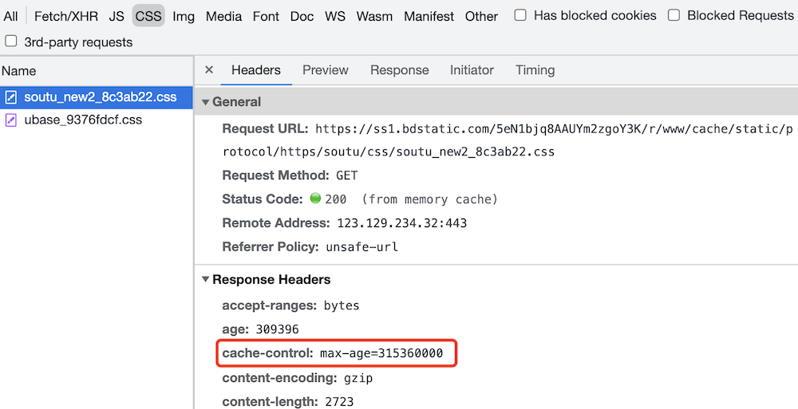

# 输入 url 到页面展示

## 题目

从输入 url 到显示页面的完整过程

## 特别注意

现在浏览器经过多年发展和优化，加载和渲染机制已经非常复杂，我们只能讲解基本的流程。不可较真细节。

## 步骤

- 网络请求
- 解析
- 渲染页面

## 网络请求

- DNS 解析，根据域名获得 IP 地址
- 建立 TCP 连接 “三次握手”
- 发送 http 请求
- 接收请求响应，获得网页 html 代码

继续请求静态资源：
- 解析 HTML 过程中，遇到静态资源还hi继续发起网络请求
- JS CSS 图片 视频 等
- 静态资源可能会有强缓存，此时不必请求，加载会判断。

## 解析：字符串 -> 结构化

> html css 等源代码是字符串形式，需要解析为特定的数据结构，才能被后续使用。

过程
- html 构建 DOM 树
- css 构建 CSSOM（即 style tree）
- 两者结合形成 Render tree （包括尺寸、定位等）

css 包括：
- 内嵌 css `<style>`
- 外链 css `<link>`

解析到 `<script>` 加载，并有可能修改 DOM 树和 render tree 。
- 内嵌 js
- 外链 js
- 还有 `defer` `async` 属性

解析到 `` 等媒体文件，也要并行加载。加载完成后再渲染页面。
- 外链
- 内嵌（base64）

综上，为了避免不必要的情况，要遵守以下规则，优化解析：
- css 尽量放在 `<head>` 中，不要异步加载 css
- js 尽量放在 `<body>` 最后，不要中途加载、执行 js
- `` 等媒体文件尽量限制尺寸 width height，防止渲染时重绘页面

## 渲染：render tree 绘制页面

通过 render tree 绘制页面。
- 计算各个 DOM 的尺寸、定位，最后绘制到页面
- 遇到 JS 可能会执行(参考 `defer` `async`)
- 异步 CSS、图片加载，可能会触发重新渲染

绘制完成之后，还要继续执行异步加载的资源
- 异步的 css ，重新渲染页面
- 异步的 js ，执行（可能重新渲染页面）
- 异步加载的图片等，可能重新渲染页面（根据图片尺寸）

最后页面渲染完成。

## 答案

- 网络请求
    - DNS 解析
    - TCP 连接
    - HTTP 请求和响应
- 解析
    - DOM 树
    - CSSOM 树
    - Render tree
- 渲染页面
    - 计算、绘制
    - 同时执行 JS
    - 可能重绘页面

## 划重点

- 现代浏览器的渲染机制非常复杂，不要纠结细节
- 要深入理解“字符串->结构化数据”这一步
- 能画出上面的流程图

## 连环问：什么是重绘 repaint 和重排 reflow ，有何区别

**动态网页，随时都会重绘、重排**

页面渲染完成之后，随着异步加载和用户的操作，会随时发生 repaint 或者 reflow 。例如
- 各种网页动画
- modal dialog 弹框
- 页面元素的新增、删除和显示、隐藏

结论：重排的影响更大
- 重绘 repaint ：
    - 某些元素的外观被改变（如颜色、背景）
    - 但尺寸和定位不变，不会影响其他元素的位置
- 重排 reflow ：
    - 重新计算尺寸和布局，可能会影响其他元素的位置
    - 如元素高度增加，可能会使相邻元素位置下移

区别：
- 重绘不一定重排，但重排一定会导致重绘。
- 所以，要尽量避免无意义的重排

减少重排的方法：
- 集中修改样式，或直接使用 `class`
- DOM 操作前先使用 `display: none` 脱离文档流
- 使用 BFC ，不影响外部的元素
- 对于频繁触发的操作（`resize` `scroll` 等）使用节流和防抖
- 使用 `createDocumentFragment` 进行批量 DOM 操作
- 优化动画，如使用 `requestAnimationFrame` 或者 CSS3（可启用 GPU 加速）

## 连环问：触发 css BFC 的条件

BFC - Block Formatting Context 块格式化上下文

内部的元素物理如何改变，都不会影响其他元素的位置

触发 BFC 的条件：
- 根节点 html
- 设置 float `left` `right`
- 设置 overflow `auto` `scroll` `hidden`
- 设置 display `inline-block` `table` `table-row` `table-cell`
- 设置 display `flex` `grid` 的直接子元素
- 设置 position `absolute` `fixed`
