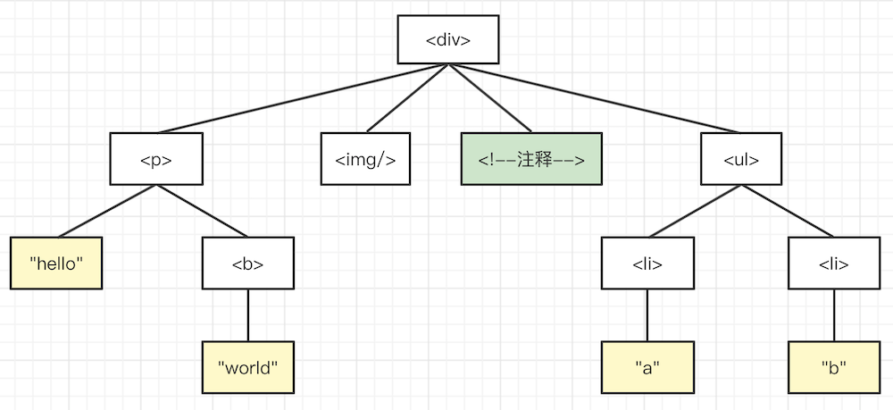

# 遍历 DOM 树

## 题目

写一个函数遍历 DOM 树，分别用深度优先和广度优先

PS：注意回顾 “Node 和 Element 和区别”

## 深度优先 vs 广度优先



深度优先的结果 `<div> <p> "hello" <b> "world"  注释 <ul> <li> "a" <li> "b"`

广度优先的结果 `<div> <p>  注释 <ul> "hello" <b> <li> <li> "world" "a" "b"`

## 深度优先

一般通过递归实现，代码参考 dom-traverse.ts

## 广度优先

一般通过队列实现，代码参考 dom-traverse.ts

```ts
/**
 * 访问节点
 * @param n node
 */
function visitNode(n: Node) {
    if (n instanceof Comment) {
        // 注释
        console.info('Comment node ---', n.textContent)
    }
    if (n instanceof Text) {
        // 文本
        const t = n.textContent?.trim()
        if (t) {
            console.info('Text node ---', t)
        }
    }
    if (n instanceof HTMLElement) {
        // element
        console.info('Element node ---', `<${n.tagName.toLowerCase()}>`)
    }
}

/**
 * 深度优先遍历
 * @param root dom node
 */
function depthFirstTraverse1(root: Node) {
    visitNode(root)

    const childNodes = root.childNodes // .childNodes 和 .children 不一样
    if (childNodes.length) {
        childNodes.forEach(child => {
            depthFirstTraverse1(child) // 递归
        })
    }
}

/**
 * 广度优先遍历
 * @param root dom node
 */
function breadthFirstTraverse(root: Node) {
    const queue: Node[] = [] // 数组 vs 链表

    // 根节点入队列
    queue.unshift(root)

    while (queue.length > 0) {
        const curNode = queue.pop()
        if (curNode == null) break

        visitNode(curNode)

        // 子节点入队
        const childNodes = curNode.childNodes
        if (childNodes.length) {
            childNodes.forEach(child => queue.unshift(child))
        }
    }
}

const box = document.getElementById('box')
if (box == null) throw new Error('box is null')
depthFirstTraverse1(box)
```

## 解答

- 深度优先，递归，贪心
- 广度优先，队列（数组 VS 链表）
- .childNodes 和 .children 不一样

## 连环问：深度优先可以不用递归吗？

深度优先遍历，可以使用栈代替递归，递归本质上就是栈。代码参考 dom-traverse.ts

递归和非递归哪个更好？
- 递归逻辑更加清晰，但容易出现 `stack overflow` 错误（可使用`尾递归`，编译器有优化）
- 非递归效率更高，但使用栈，逻辑稍微复杂一些

```ts
/**
 * 深度优先遍历（使用栈）
 * @param root dom node
 */
function depthFirstTraverse2(root: Node) {
    const stack: Node[] = []

    // 根节点压栈
    stack.push(root)

    while (stack.length > 0) {
        const curNode = stack.pop() // 出栈
        if (curNode == null) break

        visitNode(curNode)

        // 子节点压栈
        const childNodes = curNode.childNodes
        if (childNodes.length > 0) {
            // reverse 反顺序压栈
            Array.from(childNodes).reverse().forEach(child => stack.push(child))
        }
    }
}
```
