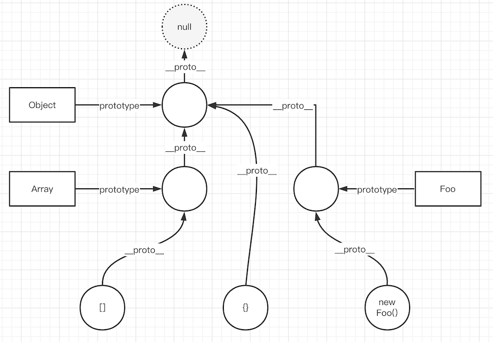

# 手写 instanceof

## 题目

instanceof 的原理是什么，请用代码来表示

## 原型链



## instanceof 原理

例如 `a instanceof b` 就是：顺着 `a` 的 `__proto__` 链向上找，能否找到 `b.prototype`

代码参考 instanceof.ts

```ts
/**
 * 自定义 instanceof
 * @param instance instance
 * @param origin class or function
 */
export function myInstanceof(instance: any, origin: any): boolean {
    if (instance == null) return false // null undefined

    const type = typeof instance
    if (type !== 'object' && type !== 'function') {
        // 值类型
        return false
    }

    let tempInstance = instance // 为了防止修改 instance
    while (tempInstance) {
        if (tempInstance.__proto__ === origin.prototype) {
            return true // 配上了
        }
        // 未匹配
        tempInstance = tempInstance.__proto__ // 顺着原型链，往上找
    }

    return false
}
```

## 总结

- JS 原型和原型链，必须掌握
- 通过 while 循环一直向上查找原型链做判断
