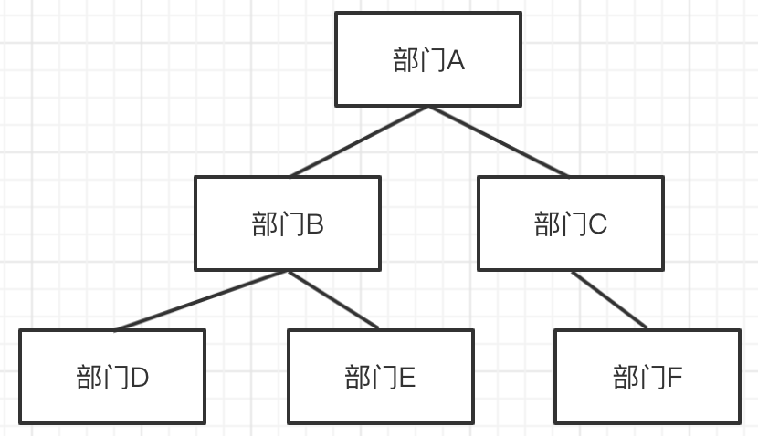

# 树转数组

## 题目

定义一个 `convert` 函数，将以下对象转换为数组

```js
const obj = {
    id: 1,
    name: '部门A',
    children: [
        {
            id: 2,
            name: '部门B',
            children: [
                { id: 4, name: '部门D' },
                { id: 5, name: '部门E' }
            ]
        },
        {
            id: 3,
            name: '部门C',
            children: [{ id: 6, name: '部门F' }]
        }
    ]
}
```



```js
[
    { id: 1, name: '部门A', parentId: 0 }, // 0 代表顶级节点，无父节点
    { id: 2, name: '部门B', parentId: 1 },
    { id: 3, name: '部门C', parentId: 1 },
    { id: 4, name: '部门D', parentId: 2 },
    { id: 5, name: '部门E', parentId: 2 },
    { id: 6, name: '部门F', parentId: 3 },
]
```

## 分析

根据顺组的顺序，需要**广度优先**遍历树

要快速获取 `parentId` 需要存储 `nodeToParent` map 结构。

## 思路

- 遍历树节点（广度优先）
- 将树节点转换为 Array Item，push 到数组
- 根据父子关系，找到 Array Item 的 parentId

如何找到 parentId？
- 遍历树去查找，太慢
- 可用一个 Map 来维护关系，便于查找

## 实现

代码参考 convert-tree-arr.ts

```ts
/**
 * @description tree to arr
 * @author 尘墨
 */

interface IArrayItem {
    id: number
    name: string
    parentId: number
}

interface ITreeNode {
    id: number
    name: string
    children?: ITreeNode[]
}

function convert1(root: ITreeNode): IArrayItem[] {
    // Map
    const nodeToParent: Map<ITreeNode, ITreeNode> = new Map()

    const arr: IArrayItem[] = []

    // 广度优先遍历，queue
    const queue: ITreeNode[] = []
    queue.unshift(root) // 根节点 入队

    while (queue.length > 0) {
        const curNode = queue.pop() // 出队
        if (curNode == null) break

        const { id, name, children = [] } = curNode

        // 创建数组 item 并 push
        const parentNode = nodeToParent.get(curNode)
        const parentId = parentNode?.id || 0
        const item = { id, name, parentId }
        arr.push(item)

        // 子节点入队
        children.forEach(child => {
            // 映射 parent
            nodeToParent.set(child, curNode)
            // 入队
            queue.unshift(child)
        })
    }

    return arr
}

const obj = {
    id: 1,
    name: '部门A',
    children: [
        {
            id: 2,
            name: '部门B',
            children: [
                { id: 4, name: '部门D' },
                { id: 5, name: '部门E' }
            ]
        },
        {
            id: 3,
            name: '部门C',
            children: [
                { id: 6, name: '部门F' }
            ]
        }
    ]
}
const arr1 = convert1(obj)
console.info(arr1)
```
