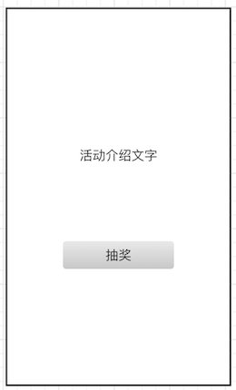
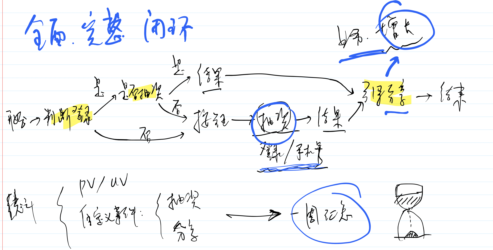

# H5 抽奖页

## 题目

你作为前端负责人，来开发一个 h5 页，某个抽奖功能的运营活动，如上图。假定 PM 和后端 RD 都是实习生，技术和业务都不熟练。

你要从 0 开发这个页面，你会要求 server 端给你哪些接口和能力？

## 多数人的答案

所有人都能想到，需要一个**抽奖接口**。否则，他就不是一个合格的程序员了。

很少一部分人能想到，需要一个**用户信息接口**，否则都不知道奖品给谁，总得登录一下。或者直接输入手机号抽奖也行，但需求没说这里有手机号。

还有，假如刚刚抽了奖，再重新进入界面，是否要禁用抽奖？是否要限制每个人抽奖一次？—— 这些需求没说，但这些很重要，这些可都需要后端支持。

## 答案

我预期的答案当然是比较全面的，但是很遗憾，我曾经面试过这么多人，没有一个人能答全。

- 获取用户信息（同时判断是否登录）
- 如果登录，判断该用户是否已经抽奖，以判断他是否还能继续抽奖
- 抽奖接口
    - 可能还需要调用登录接口
    - 当然也可以直接输入手机号抽奖，需明确需求
- 埋点统计
    - pv
    - 自定义事件
- 微信分享

由此可见，一个看似简单的功能，其背后并不一定简单。

## 划重点

- 让页面动起来，分析业务流程
- 技术人员要去熟悉业务，技术永远是为业务服务的

## 扩展

这个面试题不是考察知识点和技术能力的，完全就是在考察你对一个业务的理解能力。

由此你就可以看出，程序员对于需求和业务理解能力有多么重要！直接会影响到你的 API 接口设计，进而影响到你的开发。

有些时候，PM 和 RD 比较靠谱，他们能考虑清楚整个流程，你也就顺利的完成了，这很幸运。

但大部分情况下，你都会遇到一些不靠谱的人，或者太忙没空理你的人。这个时候就要靠你去承担起来，而你有没有这种能力呢？

在你抱怨别人不靠谱，抱怨需求频繁改动的时候，你有没有从自己的身上找一找原因。

如果你是老板，你如何看待这件事？你是否希望你的员工都深入了解业务？

能联想到的还有很多很多……
