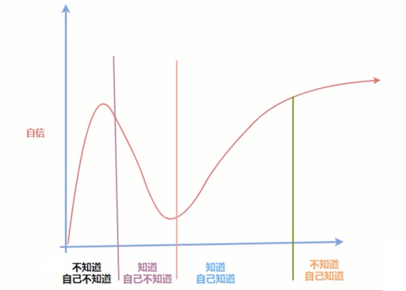

# 介绍

web 前端现状：
- 需求大
- 缺人：高级
- 不缺人：初中级

许多 web 前端的现状：
- 熟练应用项目脚手架 + 框架
- 做业务没有问题，攻克难点却不行
- google 程序员
- 源码看不懂
- 面试没亮点
- 偶尔一回想，感觉自己啥都不会

哪里出现了问题
- 不是哪里出现了问题，而是你处于一个特殊的阶段
- 不知道如何有效的让自己跨过这个阶段
- `邓宁-克鲁格效应`

目标：
- 系统的夯实基础
- 培养一种理性思维方式
- 协助走向下一个阶段：知道自己知道

## 内容

基础晋级：
- 数据类型细节
- 对象认知升级
- 运算符妙用
- 数组高级用法
- 函数
- DOM
- BOM

WEB API：

- 网络请求
- 异步编程
- 事件循环
- 客户端存储
- 计时器和动画
- 异常处理
- ES 高级特性
- 字符编码

综合案例：
- DOM 事件
- 事件中心
- 元编程
- 函数
    - 函数名
    - 特殊函数
- 弱引用
- 数据结构
- 继承
- 内存泄漏
- 其他 ...

## 收获

横向知识面：
- 8 种类型判断方式
- 6 中千分位方式
- 多种窗口通信方式
- 4 种节点赋值方式

纵向知识深：
- 排序属性，隐藏类
- 计算机是怎么进行数字相加的
- 手写 call 的十大知识点
- 80% 前端不知道的 storage 知识点
- ...

JS 技巧：
- 一元运算符的妙用
- 序列生成器，promise 顺序执行完美方案
- 万能方法调用
- 8 行代码事件中心
- ...

多套成熟的问题方案：
- 数组合并
- 通用异步通讯方案
- 资源加载器
- 面向 next 编程的计时器
- 异常捕获方案
- 事件泄漏处理方案
- ...

解决问题的思路：
- 遇事不觉，MDN 和协议优先
- 抓住问题关键
- 循序渐进

最后：
- 有时候，坚持了你最不想干的事情之后，会得到你最想要的东西
