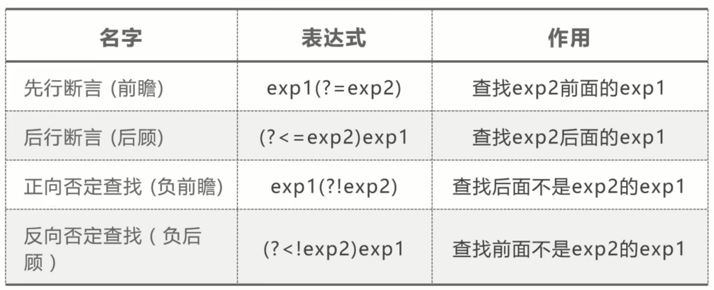

# 数据类型容易忽略的细节

## 数据类型的陷阱，从表象看本质！

### 判断是不是 Object

```ts
function isObject(obj) {
    if (typeof obj === 'object') {
        return true;
    }
    return false;
}
```

- 上面的方式有什么问题
- 为什么 typeof null 返回值是 object ？
- 为什么不修复这个问题？

```js
// 上面的问题是，null也是一个Object，为什么typeof null == Object?这是个历史问题，
// 可以更深入地了解，它可以追溯到JS的第一个版本，单个值是占用32位的存储单元，它分为
// 2个部分，一个是标记位，一个是表示数据，如：
// 000： object
// 001： integer
// 010： double
// 100： string
// 110： boolean
// 而null从1到第32位都是0，那么它就是000，所以被误认为是object，不过现在v8引擎不是这样的，不修复这个问题是因为兼容性问题
```

### 一元运算符+ 转为数字

```ts
function toNumber(val) {
    return +val;
}
```

bigInt、Symbol 时报错

### 位移转为数字

```ts
function toNumber(val) {
    return val >> 0;
}

function toNumber2(val) {
    return val >>> 0;
}

toNumber(Number.MAX_SAFE_INTEGER); // -1
toNumber2(Number.MAX_SAFE_INTEGER); // 4294967295


var val = Number.MAX_SAFE_INTEGER.toString(2);
// 11111111111111111111111111111111111111111111111111111

var val1 = val.substring(0, 32);
// 11111111111111111111111111111111

var num = parseInt(val1, 2)
// 4294967295

```

- 十进制变二进制：原码 => 反码 加一 （补码）
- 二进制变十进制：减一 => 反码 = 原码

`本质`：32 位的有符号位移和无符号位移

### 字符串批量转换为整数

```ts
const arr = ['1', '2', '3']
arr.map(parseInt);

arr.map((val, index) => parseInt(val, index));
// parseInt('1', 0)
// parseInt('2', 1)
// parseInt('3', 2)
```

parseInt 第二个参数的取值范围：2-36

### if 条件判断

```ts
const result = {}
if (obj.name) {
    result.name = obj.name;
}

return result
```

本质转换为 布尔值

问题：那些值转为 布尔值是 false

null undefined '' false +0 -0 NaN

### 宽松比较

```ts
null == 0

'0' == false
```

本质：隐式转换

宽松比较 - 规律：

- NaN
- bigInt、Symbol
- null、undefined
- 布尔类型和其他类型的相等比较
- 数字类型和字符串类型的相等比较
- 对象类型和原始类型的相等比较
- 对象和对象类型的相等比较

### 闲谈

- typeof 性能比 instanceof 性能高 20 倍？百万级别下差2- 3 倍
- null 和 undefined 实现的机制完全不一样？
- 判断是不是数字，NaN

```ts
console.log(Object.getOwnPropertyDescriptor(globalThis, 'null'));
console.log(Object.getOwnPropertyDescriptor(globalThis, 'undefined'));
```

## 综合评定，数据类型8种判断方式

**第一种：typeof**

主要用途：操作的类型，只能识别基础数据类型和引用类型

注意：
- null返回的是object
- Not a Number（NaN)返回的偏偏是一个Number
- document.all 返回的是当前页面上所有的节点，typeof document.all 返回的是 undefined，这是个梗，它不是 web 标准，各大浏览器都支持，IE11 前它自己都返回 object, 11 之后改为返回 undefined。

typeof 之前是很安全的，现在也不安全了，ES6出现了新的概念叫暂时性死区，它的表现看如下代码，只能用于基础数据类型，不能用于引用类型

```ts
function log() {
    // 在let下，声明在typeof之后无法访问到a
    typeof a;
    let a = 10;
}
log()
```


**第二种：constructor**

原理：constructor指向创建实例对象的构造函数，通过toString就可以知道是哪种类型，null和undefined并没有构造函数

注意：constructor可以被改写，所以这个方法可以作为辅助判断方法，因为它可以被改写，所以不安全用于部分基础数据类型和引用类型

```ts
String.prototype.toString = function a() {
    return {}
}
console.log('a', constructor);
```

**第三种方法：instanceof**

原理：原型链上查找，查到即是其实例

注意：
1. 右操作数必须是函数或者class,只有他们才能被 new
2. 多全局对象，例如多window之间,比如跨窗口，那么类型判断就不准确，运行examples/instanceOf.html,这个例子中，页面跳转到instanceOf02，但是数组[]还是window.Array的实例，而不是instance02这个执行上下文的数组实例
3. 只能用于引用类型

**第四种方法：isPrototypeOf**

原理:是否出现在实例对象的原型链上，和instanceof很相似，区别在于instanceof右操作数是不是在左操作数的原型上面，而isPrototype正好相反，都能正常返回值的情况下，他俩基本等同，它比instanceof安全一些，说过instanceof右操作数必须是函数或者class，而isPrototypeOf并没有这要求使用场合：只能用于引用类型，它是调用call,那么nullh和undefined就会出问题


**第五种：Object.prototype.toString**

原理：通过函数的动态this,返回其数据类型，如[object Date]来截取这个字符串来得知某个类型，但是我们自定义的对象和
class的时候，object.toString()返回的是[object Object],如下的例子：
使用所有数据类型，小心内置原型：Boolean.prototype返回的是boolean而不是object,所以对于内置的数据类型是一个坑

```ts
var o = {}
console.log(typeof o, o.toString()) // object, [object Object]
// 思考题： 
// 1）自定义对象如何获得[object MyArray]类型
//  2）Object.prototype.toString.call(Boolean.prototype) 返回值是什么？typeof Boolean.prototype === 'object'
    // 而Boolean.prototype返回的是[object boolean],这是违法常理的地方。
```

**第六种：鸭子类型检测**

原理：检查自身，属性的类型或者执行结果的类型，

例子：kindOf 与 [p-is-promise](https://github.com/then/is-promise)

总结：候选方案

```ts
export default isPromise(value) {
 return value instanceof Promise || 
     (
         isObject(value) && 
         typeof value.then === 'function' &&
         typeof value.catch === 'function
     )
}
// 这个例子中检查value的then和catch是不是function来判断value是不是Promise类型，通常作为候选方案
// 适用于引用类型
```


**第七种：Symbol.toStringTag**

原理： Object.prototype.toString会读取该值，ES6方法，内置的符号，这个字符串用来表示自定义的类型标签，通常只有内置的Object.prototype.toString会读取这个标签并返回回去，他可以回答如何实现：自定义对象如何获得[object MyArray]类型

适用场景:需自定义类型，适用于引用类型

注意事项：兼容性

```ts
class MyArray {
    get [Symbol.toStringTag]() {
        return 'MyArray'
    }
}
var pf = console.log;
var a = new MyArray();
pf(Object.prototype.toString.call(a)) //[object MyArray]
```

**第八种：等比较**

原理：与某个固定值进行比较

使用场景：undefined window document null等

例子：看看underscore.js代码：
```ts
_.isUndefined = function(obj) {
    return obj === void 0;
}
```
void 0，计算结果就是0，但是不会返回任何东西,void 0一定返回undefined这个值，void 100也一样。

为什么现代浏览器undefined不可改写，可以看看：

Object.getOwnPropertyDescriptor(window, 'undefined')可以看到它的configurable和writable
都为false,所以不可以被改写


## 五分钟让你懂得透彻ES6增强的NaN

NaN 和 Number.NaN 特点： 
1. typeof是数字
2. 我不等于我自己
3. 不能被删除，为何不能被删除？是因为Object.getOwnPropertyDescriptor(window, 'NaN')的configurable和writable都为false

isNaN：检查toNumber返回值，如果是NaN,就返回true，反之返回 false

```ts
/**
 * 如果下列任何一项成立，则两个值相同：
 * 两个值都是 undefined
 * 两个值都是 null
 * 两个值都是 true 或者都是 false
 * 两个值是由相同个数的字符按照相同的顺序组成的字符串
 * 两个值指向同一个对象
 * 两个值都是数字并且
 * 都是正零 +0
 * 都是负零 -0
 * 都是 NaN
 * 都是除零和 NaN 外的其它同一个数字
 */

const isNaN = function (val) {
    return Object.is(Number(val), NaN);
}
console.log(isNaN('2'))

/**
 * 但是isNaN并不是一个安全的方法，参数类型为 Symbol 和 BigInt 的时候会异常
 */
isNaN(10n);
```

**Number.isNaN**

ES6新增的方法，判断一个值是否是数字，并且值等于 NaN，语义化代码如下

isNaN 其本意是通过 Number 方法把参数转换成数字类型，若成功则为true，不能用来严格判断等于NaN，它根本没进行转换，它只是判断类型，然后进行值比对

```ts
Number.isNaN = function(val) {
    if (typeof val !== "number") {
        return false;
    }
    return Object.is(val, NaN);
}
console.log(Number.isNaN(NaN))

/**
 * 严格判断 NaN 汇总
 * Number.isNaN:有这个方法最好，否则用第二种
 * Object.is
 * 自身比较
 * typeof+NaN
 */
function isNaNVal(val) {
    return Object.is(val, NaN);
}
function isNaNVal2(val) {
    // 只有NaN自己不等于自己
    return val !== val;
}
function isNaN3(val) {
    // 是数字类型但是却不能转换成数字类型就只能是NaN
    return typeof val === 'number' && isNaN(val);
}
// 综合垫片
if (!'isNaN' in Number) {
    // 如果Number这个对象若有isNaN这个属性的话，就不需要进行这个垫片
    Number.isNaN = function (val) {
        return typeof val === 'number' && isNaN(val);
    }
}


// 通过陷阱看本质:ES5的indexOf不能识别NaN, ES6的includes能识别
// includes内部调用的是 Number::sameValueZero，
// 而 indexOf 内部调用的是 Number::equal方法，看标准:
// Number::equal(x,y):
// 1) if x is NaN, return false
// 2) if y is NaN, return false
// 表示任何一个值是NaN，则返回false
// 我们再看一下Number::sameValueZero:
// 1) if x is NaN and y is NaN, return true
// 说明它是严格的，于是它能找出NaN
var arr = [NaN];
arr.indexOf(NaN); // -1
arr.includes(NaN) // true
```


## 数值千分位6种方法& 性能大比拼！

```ts
/**
 * 第一种思路
 * @param {*} number 
 * @returns 
 */
function format_with_array(number) {
    // 转为字符串，并按照.拆分
    var arr = (number + '').split('.');
    // 整数部分再拆分
    var int = arr[0].split('');
    // 小数部分
    var fraction = arr[1] || '';
    // 返回的变量
    var r = '';
    var len = int.length;
    // 倒叙并遍历
    int.reverse().forEach(function(v, i) {
        console.log('reverse', v)
        // 非第一位并且是位值是3的倍数，添加","
        if (i !== 0 && i % 3 === 0) {
            r = v + ',' + r;
        } else {
            // 正常添加字符
            r = v + r;
        }
    })
    // 整数部分和小数部分拼接
    return r + (!!fraction ? '.' + fraction : '');
}
console.log('千分位', format_with_array(134567.01))

/**
 * 方法二：字符串+substring截取
 * 整体思路：数字转字符串，分为整数和小数部分，整数部分高位往低位遍历，三位分组
 * 1 数字转字符串，并按照.分割
 * 2 整数部分对3求模，获取多余部分
 * 3 按照3截取，并添加','
 * 4 拼接整数部分+小数部分
 */
function format_with_substring(number) {
    // 数字转字符串，并按照.分割
    var arr = (number + '').split('.');
    var int = arr[0] + '';
    var fraction = arr[1] || '';
    // 多余的位数
    var f = int.length % 3;
    // 获取多余的位数，f可能是0，即r可能是空字符串
    var r = int.substring(0, f);
    // 每三位添加","和对应的字符
    for (var i = 0; i < Math.floor(int.length / 3);i++) {
        r += ',' + int.substring(f + i * 3, f + (i + 1) * 3);
    }
    debugger
    // 若整数刚满三位数没有多余的位的话，比如这里的123.00，整数位通过上面
    // 的运算得到,123，所以当刚满三位数的话，就要去除最前面的逗号，所以
    // 进行如下判断删除逗号
    if (f === 0) {
        r = r.substring(1);
    }
    // 整数部分和小数部分拼接
    return r + (!!fraction ? "." + fraction : '');
}
format_with_substring(123.00)

/**
 * 方法三：除法+求模
 * 整体思路：求模获得高位的值拼接并添加符号，求余值（是否大于1），计算是否结束
 *          1）值对1000求模，获得最高三位
 *          2）值除以1000，值是否大于1判定是否结束
 *          3）重复1.2，直到退出
 *          4）拼接整数部分+小数部分
 */
function format_with_mod(number) {
    var n = number;
    var r = '';
    var temp;
    do {
        // 求模的值，用于获取高三位，这里可能有小数，所以在后面需要取整，获取高三位
        mod = n % 1000;
        // 值是不是大于1，若是则进行下一次循环
        n = n / 1000;
        // 取整数，第一步：把运算数转换为32位的二进制整数，按位取反，然后再转换为十进制，算出最高位
        temp = ~~mod;
        r = (n >= 1 ? `${temp}`.padStart(3, "0") : temp) + (!!r ? "," + r : "");
    } while (n >= 1);
    var strNumber = number + "";
    var index = strNumber.indexOf(".");
    // 拼接小数部分
    if (index >= 0) {
        r += strNumber.substring(index);
    }
    return r;
}

/**
 * 方法四：正则先行断言等
 */
function format_with_regex(number) {
    var reg = /\d{1,3}(?=(\d{3})+$)/g;
    return (number + '').replace(reg, '$&,');
}

console.log(format_with_regex(12345678));


function format_with_regex2(number) {
    var reg = /\d{1,3}(?=(\d{3})+$)/g;
    return (number + '').replace(reg, function(match, ...args) {
        return match + ',';
    });
}

console.log(format_with_regex2(12345678));
 

/**
 * 方法五：Intl
 */
function format_with_Intl(number, minimumFractionDigits, maximumFractionDigits) {
    minimumFractionDigits = minimumFractionDigits || 2;
    maximumFractionDigits = maximumFractionDigits || 2;
    maximumFractionDigits = Math.max(
      minimumFractionDigits,
      maximumFractionDigits
    );
    return new Intl.NumberFormat("en-us", {
      minimumFractionDigits: minimumFractionDigits || 2,
      maximumFractionDigits: maximumFractionDigits || 2
    }).format(number);
}

console.log(format_with_Intl(12345678.2));


/**
 * 方法六：Intl
 */
function format_with_toLocaleString(number, minimumFractionDigits, maximumFractionDigits) {
    minimumFractionDigits = minimumFractionDigits || 2;
    maximumFractionDigits = maximumFractionDigits || 2;
    maximumFractionDigits = Math.max(
      minimumFractionDigits,
      maximumFractionDigits
    );
    return number.toLocaleString("en-us", {
      minimumFractionDigits: minimumFractionDigits || 2,
      maximumFractionDigits: maximumFractionDigits || 2
    });
}

console.log(format_with_toLocaleString(12345678.2));
```




### Intl.NumberFormat

基本功能：国际化的数字处理方案，可以用来显示不同国家对数字处理的偏好

语法：new Intl.NumberFormat([locales[, options]])

### toLocaleString

功能：其能把数字转为特定语言环境下的表示字符串

语法：numObj.toLocaleString([locales[, options]])

## [] + [], [] + {}, {} + [], {} + {}

**本质**：二元操作符 + 规则

- 如果操作数是对象，则对象会转换为原始值
- 如果其中一个操作数是字符串的话，另一个操作数也会转换为字符串，进行字符串连接
- 否则，两个操作数都将转换成数字或 NaN，进行加法操作

```ts
10n + 10

Symbol.for('a') + 10
```

对象转为原始数据类型的值：
- Symbol.toPrimitive
- Object.prototype.valueOf
- Object.prototype.toString


**[]的原始值**

- typeof [][Symbol.toPrimitive] // 'undefined'
- [].valueOf() // []
- [].toString() // ''

**{}的原始值**

- typeof {}[Symbol.toPrimitive] // 'undefined'
- ({}).valueOf() // {}
- ({}).toString() // '[object Object]'

```ts
[] + []
[].toString() + [].toString();
''

[] + {}
[].toString() + ({}).toString();
'[object Object]'

{} + []
{}; + []; // 此处第一个转为语句块
+ ''
0

{} + {}
({} + {})
'[object Object][object Object]'


{} + {}
{}; + {}
+ '[object Object]'
NaN
```

