# 对象认知升级

## 通过普通属性，排序属性和隐藏类提升对象属性认知

遍历属性：

```ts
var obj = {};

obj.p1 = "str1";
obj.p6 = "str6";
obj.p2 = "str2";

obj[1] = "num1";
obj[6] = "num6";
obj[2] = "num2";

for (var p in obj) {
    console.log("property:", obj[p]);
}

// property: num1
// property: num2
// property: num6
// property: str1
// property: str6
// property: str2
```

这个例子我们能发现什么
- 两种属性：字符串作为键和数字作为键的属性
- 键被遍历顺序似乎是有规律的

常规属性：
- 键为字符串的属性
- 特定：根据创建时的顺序排序

排序属性：
- 属性键值为数字的属性
- 特定：按照索引值大小升序排序；`排序属性优先于常规属性`

思考：数字字符串属性是排序属性不？

数字字符串依然符合排序属性的规律

```ts
var obj = {};

obj['1'] = "num1";
obj['6'] = "num6";
obj['2'] = "num2";

for (var p in obj) {
    console.log("property:", obj[p]);
}
```

思考：为什么设计常规属性和排序属性
- 提升属性的访问速度
- 两种线性数据结构保存

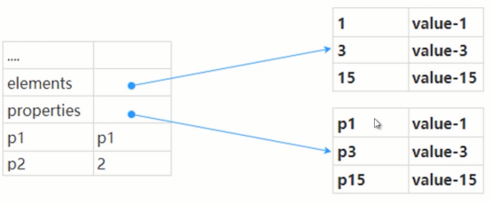

### 对象内属性

解释：被保存到对象自身的`常规属性`

内属性的数量：10 个

如何查看？使用浏览器的 Memory

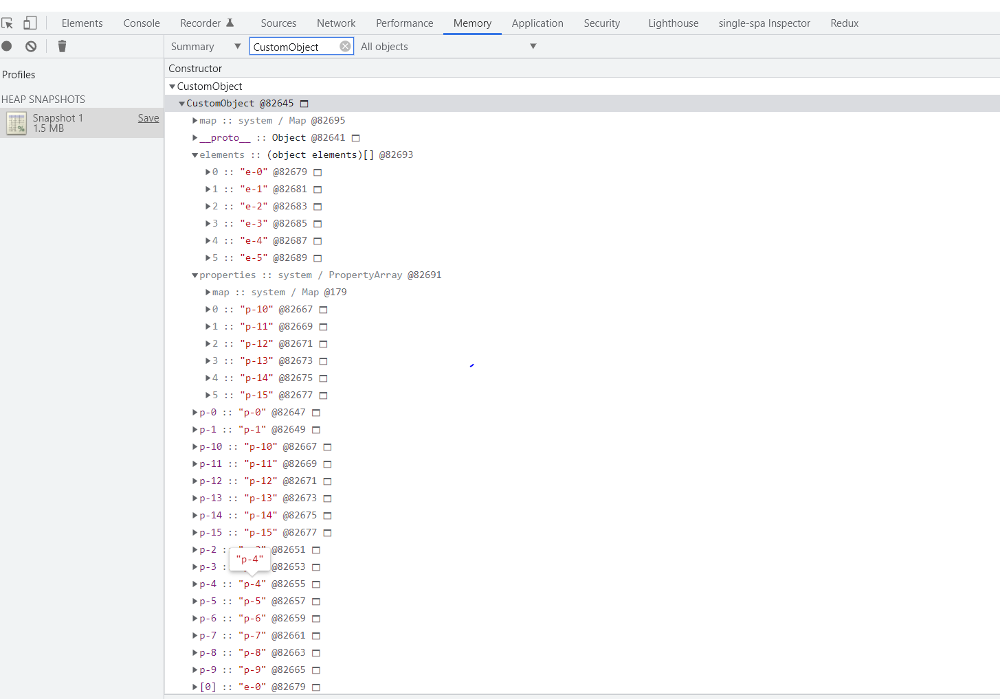

### 隐藏类

什么是隐藏类？描述对象的属性布局

作用：从空间和时间两个维度上提升速度

怎么查看隐藏类

### 守护隐藏类

- 初始化时保持属性顺序一致
- 一次性初始化完毕
- 谨慎使用 delete

### 赋值 VS delete - 排序属性和普通属性

- 10000 个对象，25 个普通属性： delete or 赋值快？
- 10000 个对象，25 个排序属性： delete or 赋值快？

## 必修知识：属性来源，属性访问控制，属性冻结等等

### 属性来源

- 静态属性，如：Object.assign
- 原型属性，如：Object.prototype.toString
- 实例属性，如：function Person (name) { this.name = name }

```ts
const obj = {};
Object.defineProperty(obj, "name", {
    value: "哈士奇"
});

const des = Object.getOwnPropertyDescriptor(obj, "name");
console.log("name：", des);
```

### 属性描述符

- Object.defineProperty
- Object.defineProperties
- Object.getOwnPropertyDescriptor
- Object.getOwnPropertyDescriptors

descriptor
- configurable: 可配置
- enumerable: 是否可枚举
- value: 值
- writable: 是否可被更改
- get: 访问器函数
- set: 设置器函数

分为两种：
- 数据属性：value + writable + configurable + enumerable
- 访问器属性：get + set + configurable + enumerable

注意事项：
- 有趣的默认值
- configurable 的小意外，：writable 的状态可由 true 改为 false

Object.defineProperty 缺点：
- 无法监听数组的变化
- 只能劫持对象的属性，因此我们需要对每个对象的每个属性进行遍历。如果属性也是对象，还得进行递归。

```ts
const obj = {};
Object.defineProperty(obj, "name", {
    value: "哈士奇"
});

const des = Object.getOwnPropertyDescriptor(obj, "name");
console.log("name：", des);
```

### 对象的可扩展性 - Object.preventExtensions

- Object.preventExtensions：对象边的不可扩展，也就是永远不能再添加新的属性
- Object.isExtensible: 判断一个对象是否是可扩展的

### 对象的封闭 - Object.seal

- Object.seal 阻止添加新属性 + `属性标记为不可配置`
- Object.isSeal 检查对象是否被密封

### 对象的冻结

- Object.freeze 不加新属性 + 不可配置 + 不能修改值
- Object.isFrozen 检查一个对象是否被冻结

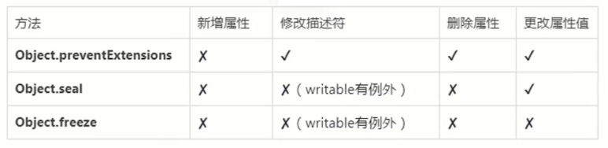

## 8+种姿势访问原型

**prototype**

- prototype 是一个对象
- 原型会形成原型链，原型链上查找属性比较耗时，访问不存在的属性会访问整个原型链

两个问题：
- class 的 ES5 实现？
- toString 的怪异现场

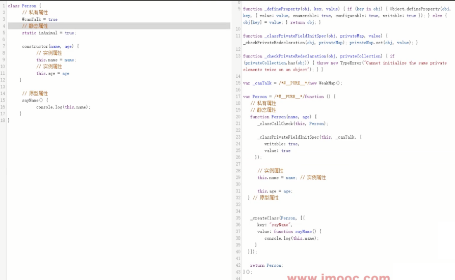

```ts
var proto = Boolean.prototype;
console.log(typeof proto);
console.log(Object.prototype.toString.call(proto)); // [object Boolean]
```

**` __proto__`*

- 构造函数的原型， null 以外的对象均有 `__proto__` 属性
- Function、class 的实例有 prototype 和 `__proto__` 属性
- 普通函数，祖上第三代必为 null

两个思路题：
- `__proto__` 是实例对象的自身属性还是原型上属性（原型上的属性）
- 普通对象祖上第几代 `__proto__` 为 null （2代）

**instanceof**

- 检测构造函数的 prototype 属性是否出现在某个实例对象的原型链上
- 手写 instanceof
- Object instanceof Function， Function instanceof Object

链接：https://juejin.cn/post/7080457287084539940


**getPrototypeOf**

返回对象的原型：
- Object.getPrototypeOf
- Reflect.getPrototypeOf

内部先 toObject 转换，注意 null 和 undefined

**setPrototypeOf**:

指定对象的原型：
- Object.setPrototypeOf
- Reflect.setPrototypeOf

`原型的尽头是 null`

**isPrototypeOf**

一个对象是否存在于另一个对象的原型链上
- Object.isPrototypeOf
- Object.prototype.isPrototypeOf
- Reflect.isPrototypeOf
- Function.isPrototypeOf

**Object.create**

Object.create() 方法创建一个新对象，使用现有的对象来提供新创建的对象的 `__proto__`

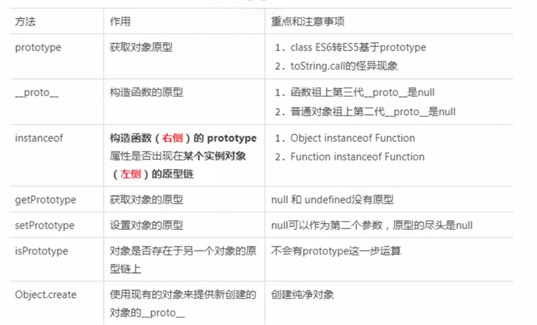

## 对象的属性遍历，你真的会了吗

属性的类型：
- 普通属性
- 不可枚举的属性
- 原型属性
- Symbol 属性
- 静态属性？？

方式：

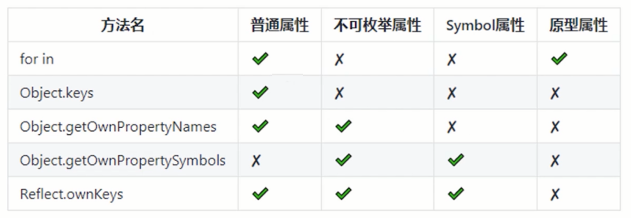


获取对象的全部静态属性：

- 不要被静态属性误导
- Reflect.ownKeys = Object.getOwnPropertyNames + Object.getOwnPropertySymbols

获取原型上的所有属性：

- forin？？ (不可以)
- 递归
- 剔除内置属性

获取所有不可枚举属性：
- 如何知道某个属性不可枚举
- 考不考虑原型上的不可枚举属性？

## 对象的隐式类型转换和注意事项

显示转换：
- 显示转换：主要通过 JS 定义的转换方法进行转换
- String、Object等强转
- parseInt、parseFloat 等
- 显式调用 toString 等

隐式转换：
- 隐式转换：编译器自动完成类型转换的方式
- 总是`期望`返回基本类型值

什么时候会发生隐式类型转换：
- 二元 + 运算符
- 关系运算符 > < >= <= ==
- 逻辑 ! if/while 三目条件
- 属性键遍历，for in 等
- 模板字符串

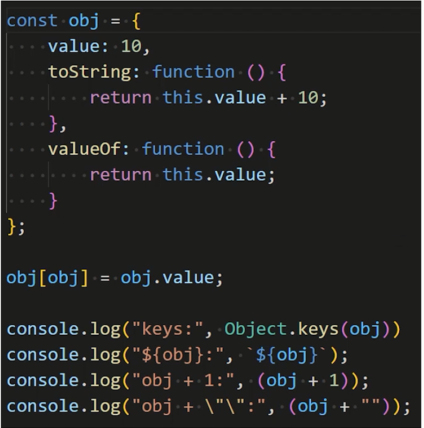

对象隐式转换三大扛把子：
- Symbol.toPrimitive
- Object.prototype.valueOf
- Object.prototype.toString

对象隐式转换规则：
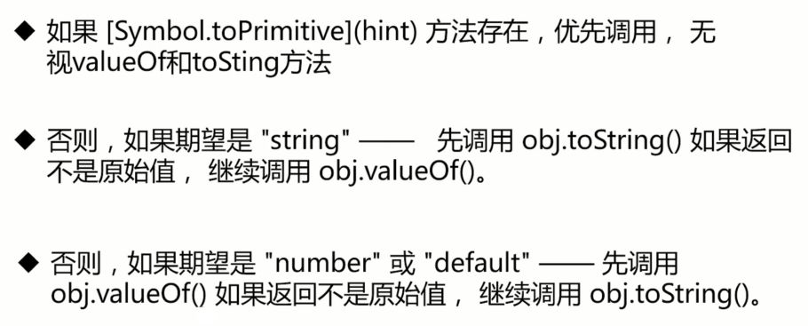

提个问题：
- 如果未定义 Symbol.toPrimitive，期望值是 string，toString 和 valueOf 都没有返回原始值
- 对返回的值再调用一次还是直接抛出异常（答案是抛出异常）

Symbol.toPrimitive(hint):
- hint - 'string'
- hint - 'number'
- hint - 'default'

hint - 'string'
- window.alert(obj)
- 模板字符串 `${obj}`
- test[obj] = 123

hint - 'number'
- 一元+，位移
- - * / 关系运算符
- Math.pow, String.prototype.slice 等很多内部方法

hint - 'default'
- 二元 +
- == !=

误区：
- === !== 是否触发隐式转换(不触发)
- == != 宽松比较是否触发隐式转换（两个对象时等同于严等的）

特殊的 Date：
- hint 是 default 时优先调用 toString，然后调用 valueOf

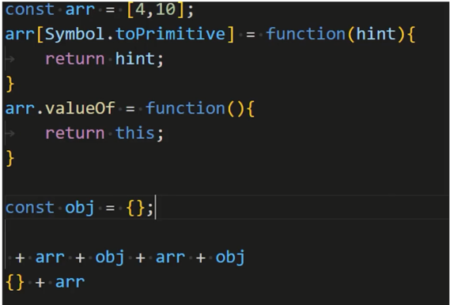

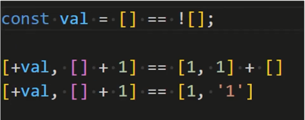

## 吃透JSON 和 toJSON，互相转换不再是问题

**JSON 对象**
- 严格意义上 JSON 对象是不合理的，JSON 是文本协议
- 全局作用域下 JSON，名为 JSON。是 Object 对象

问题：下面这个 obj 是 JSON 对象吗？
```ts
var obj = {
    name:"tom",
    [Symbol.for("sex")]: 1
}

// 答案：不是的，它是一个对象字面量
```

**JSON 格式:**
- 是一种轻量级的、`基于文本的`、与语言无关的语法，用于定义数据交换格式
- 他来源于 ECMAScript编程语言，但是独立于编程语言

**对象字面量:**

- 是创建对象的一种快捷方式，英文名： object Literal
- 对应的还有： 函数字面量、数组字面量等
- 字面量的性能优于使用 new 构建

**JSON 特征：**

- JSON 就是一串字符串，使用特点的符号标注
- {} 双括号表示对象
- [] 中括号表示数组
- "" 双引号是属性键或值

**JSON 键：**
- 只能是字符串
- 必须双引号包裹

**JSON 值：**

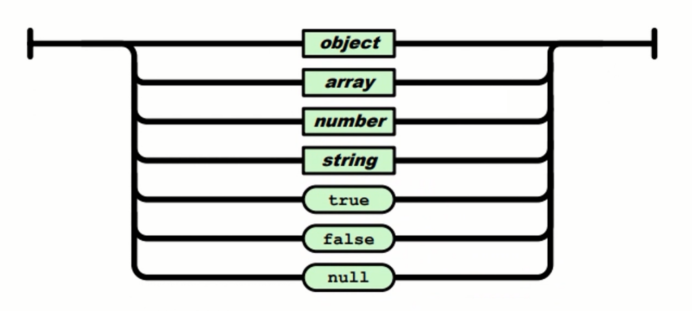


合格的 JSON：
```ts
`["你", "我", "她"]`

`{ "name": "帅哥", "age": 12 }`

`{ "IDS": ["123", "456"] }`

`{ "name": null }`

`{}`   

`[]`
```

不合格的 JSON:
```ts
`
{
    "name":"帅哥",
    [Symbol.for("sex")]: 1 
}`

`
{ 
  name: "帅哥", 
  'age': 32  
} `

`
{
    "name": "帅哥",
    "age": undefined 
}`

`[-10, 0xDDFF]` 
   
`
{ 
  "name": "牙膏",
  "created": new Date(),  
  "price": 18
  "getPrice": function() { 
      return this.price;
  }
}`

`
{
   "name":"帅哥",
   "age": 32, 
}
`
```

**JSON.parse:**

- 第二个参数函数 reviver(k, v)
- 遍历顺序
- this

```ts
const jsonStr = `
	{ 
  	"name": "帅哥", 
  	"age":  18, 
    "isFans": true,
    "IDCard": "xxxxxxxxxxxxxxxxxx"
   }
`
// 保密身份证
var obj = JSON.parse(jsonStr, function (key, value) {
    if (key == "IDCard") {
        return undefined;
    } else {
        return value;
}});

console.log(obj);
```

```ts
var jsonStr = `{
    "name": "牙膏",
    "count": 10, 
    "orderDetail": {
        "createTime": 1632996519781,
        "orderId": 8632996519781,
        "more": {
            "desc": "描述"
        }
    }
}`

JSON.parse(jsonStr, function(k, v){
    console.log("key:", k);
    return v;
});

// key: name
// key: count
// key: createTime
// key: orderId
// key: desc
// key: more
// key: orderDetail
// key: 
```

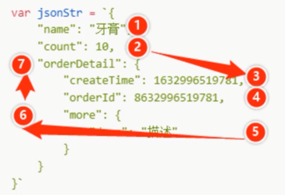

```ts
// this
var jsonStr = `{
    "name": "牙膏",
    "count": 10, 
    "orderDetail": {
        "createTime": 1632996519781,
        "orderId": 8632996519781
    }
}`

JSON.parse(jsonStr, function(k, v){
    console.log("key:", k,  ",this:", this);
    return v;
})
```

**JSON.stringify:**
- JSON.stringify(value, replacer[, space]);
- 第二个参数 replacer：过滤属性或者处理值
- 第三个参数 space，美化输出格式

第二个参数 replacer：

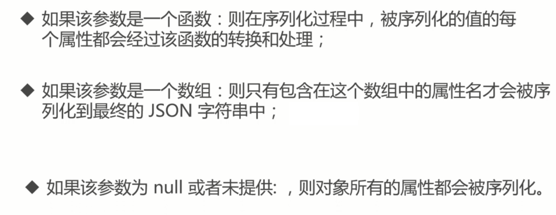

第三个参数 space:

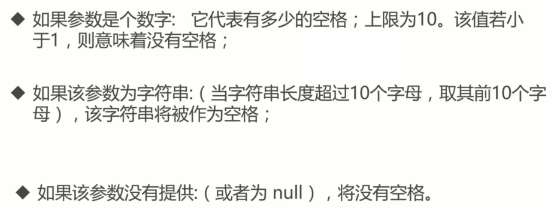

```ts
//replacer 方法
var person = {
  name: "帅哥",
  age: 45,
  birth: '1990-01-01'
};

var jsonString = JSON.stringify(person, function (key, value) {
  if (typeof value === "string") {
    return undefined;
  }
  return value;
});

console.log(jsonString);


var person = {
  name: "帅哥",
  age: 45,
  birth: '1990-01-01'
};

//replacer 数组
console.log(JSON.stringify(person, ['name', 'age']));


//space 美化格式
var person = {
  name: "帅哥",
  age: 45,
  birth: '1990-01-01'
};
const a = JSON.stringify(person);
console.log(a); 


var person = {
  name: "帅哥",
  age: 45,
  birth: '1990-01-01'
};
const c = JSON.stringify(person, null, '\t');
console.log(c);
```

规则 - undefined、任意的函数、Symbol
- 作为对象属性值，自动忽略
- 作为数组，序列化返回 null
- 单独序列化时，返回 undefined

其他规则：
- Date 返回 ISO 字符串
- 循环引用报错
- NaN、Infinity、null 都会作为 null
- BigInt 报错
- Map、Set、WeakMap 等对象，仅序列化可枚举属性

```ts
// 自动忽略
const data = {
    a: "test1",
    b: undefined,
    c: Symbol("test2"),
    fn: function () {
        return true;
    }
};
console.log(JSON.stringify(data));

//数组返回null
const data = ["test1", undefined, function aa() {
    return true
}, Symbol('test2')];
console.log(JSON.stringify(data));

//返回undefined
const a1 = JSON.stringify(function a() { console.log('test1') })
console.log("a1==", a1);
const a2 = JSON.stringify(undefined);
console.log("a2==", a2);
const a3 = JSON.stringify(Symbol('test2'))
console.log("a3==", a3)

//Date
console.log(JSON.stringify({ now: new Date() }));

// NaN 和 Infinity 以及null
console.log(JSON.stringify(NaN));
console.log(JSON.stringify(Infinity));
console.log(JSON.stringify(null));

//转换为对应的原始值。
console.log(JSON.stringify([new Number(2), new String("test"), new Boolean(false)]));

//仅序列化可枚举属性
const a = JSON.stringify(
    Object.create(
        null,
        {
            test1: { value: 'testa', enumerable: false },
            test2: { value: 'testb', enumerable: true }
        }
    )
);
console.log(a);


//循环引用报错
const obj = {
    name: "loopObj"
};
const loopObj = {
    obj
};
// 对象之间形成循环引用，形成闭环
obj.loopObj = loopObj;

// 封装一个深拷贝的函数
function deepClone(obj) {
    return JSON.parse(JSON.stringify(obj));
}
// 执行深拷贝，抛出错误
deepClone(obj)

// BigInt 报错
var c = {
    test: 1n
}
console.log(JSON.stringify(c));
```

**toJson 属性方法：**
- 对象拥有 toJSON 方法，toJson 会覆盖对象默认的序列化行为

```ts
var product = {
    "name": "牙膏",
    "count": 10, 
    "orderDetail": {
        "createTime": 1632996519781,
        "orderId": 8632996519781
    },
    toJSON(){
        return {
           name: "牙膏"
        }
    }
}

console.log(JSON.stringify(product)) // '{"name":"牙膏"}
```

**deepClone:**
```ts
const deepClone = function (obj) {
    return JSON.parse(JSON.stringify(obj))
}
```

## 学习自检, 你能得几分

```ts
const obj = {},
  objA = { propertyA: "A" },
  objB = { propertyB: "B" };

obj[objA] = "objectA";
obj[objB] = "ObjectB";

for (let [p, v] of Object.entries(obj)) {
  console.log("p:", p, ", v:", v);
}
```

```ts
const obj = {},
  objA = {
    propertyA: "A",
    toString() {
      return "objA";
    },
  },
  objB = {
    propertyB: "B",
    valueOf() {
      return "objB";
    },
  };

obj[objA] = "objectA";
obj[objB] = "ObjectB";

for (let [p, v] of Object.entries(obj)) {
  console.log("p:", p, ", v:", v);
}
```

- Object.entries: 迭代器，能获取键值对数组
- 对象键的特征：本质上是字符串，如果是数字，用数字和数字字符串一致
- 隐式转换：对象的隐式转换： Symbol.toPrimitive, valueOf,toString()

```ts
const person = {
    name: '二哈'
}
const person2 = Object.create(person);
delete person2.name

console.log(person2.name);
```

- Object.create 基于原型创建
- delete 不能删除原型上的属性

```ts
const val = (+{} + [])[+[]];
console.log(val);

/*

(+{} + [])[+[]]
// +{}  => NaN
(NaN + [])[+[]]
// [] 隐式转换 ''
(NaN + '')[+[]]
// NaN + '' => 'NaN'
('NaN')[+[]]
// +[] => 0
('NaN')[0]
// 'N'

*/
```

```ts
const proto = {
	name: "原型",
    arr: [1,2]
}
const person = Object.create(proto);
person.name = "实例";
person.arr.push(3);

console.log(person.name);
console.log(proto.name);

console.log(person.arr);
console.log(proto.arr);
```

```ts
const toString = Object.prototype.toString
function getObjectType(obj){
    return toString.call(obj).slice(8,-1)
}
const obj = String.prototype
console.log(typeof obj);
console.log(getObjectType(obj));
```

```ts
let a = {n:1};
a.x = a = {n:2};

// 求a.x
console.log(a.x)
```

```ts
const proto = {
	name: "p_parent",
	type: "p_object",
	[Symbol.for("p_address")]: "地球"
}

const ins = Object.create(proto);
Object.defineProperty(ins, "age", {
	value: 18
});
ins.sex = 1;
ins[Symbol.for("say")] = function () {
	console.log("say");
}

const inKeys = []
for (let p in ins) {
	inKeys.push(p);
}

console.log(inKeys);
console.log(Reflect.ownKeys(ins));
```

## 对象的多种克隆方式以及注意事项

**克隆的意义和常见场景**

- 意义：保证原数据的完整性和独立性
- 场景：复制数据、函数入参、class 构造函数等

前端克隆：
- 浅克隆
- 深度克隆

**浅克隆：**

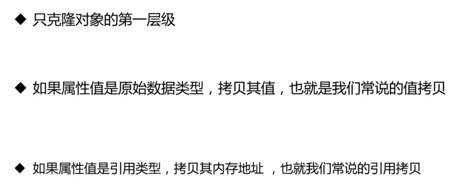

浅克隆的方式：
- ES6 扩展运算符 ...
- Object.assign
- for in 和其他的一层遍历复制

数组的常用的浅克隆：
- ES6 扩展运算符 ...
- slice
- [].concat

```ts
const person = {
  name: "帅哥",
  age: 18,
  getName: function () {
    return this.name;
  },
  address: {
    province: "北京",
  },
};

const person2 = { ...person };

person2.name = "帅哥2";
person2.getName = function () {
  return `person2` + this.name;
};
person2.address.province = "上海";

console.log("person.name:", person.name);
console.log("person.getName:", person.getName.toString());
console.log("person.address.province:", person.address.province);
```

```ts
const person = {
    name: "帅哥",
    age: 18,
    getName: function () {
        return this.name;
    },
    address: {
        province: "北京"
    }
}

const hasOwn = Object.prototype.hasOwnProperty;
function clone(obj) {
    const result = {};
    for (let p in obj) {
        if(hasOwn.call(obj, p)){
            result[p] = obj[p];
        }
    }
    return result;
}
var person2 = clone(person);

person2.name = "帅哥2";
person2.getName = function(){
    return  `person2` +  this.name;
}
person2.address.province = "上海"

console.log("person.name:", person.name);
console.log("person.getName:", person.getName.toString());
console.log("person.address.province:", person.address.province);
```

数组的克隆：

```ts
const arr = [1,2,3];

// 拓展运算符
const arr2 = [...arr];

const arr3 = arr.slice(0);

const arr4 = [].concat(arr);

console.log("arr", arr);
console.log("arr2", arr2, arr2 == arr);
console.log("arr3", arr3, arr3 == arr);
console.log("arr4", arr4, arr4 == arr);
```


**深度克隆：**

- 克隆对象的每个层级
- 如果属性值是原始数据类型，拷贝其值，也就是我们说的只拷贝
- 如果属性值是引用类型，递归克隆

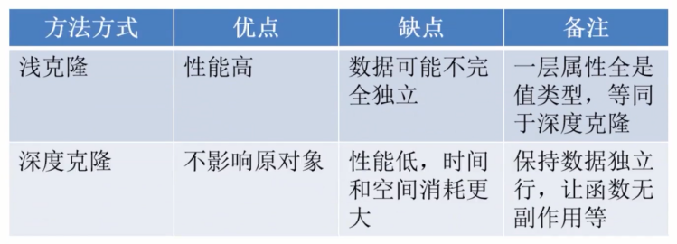

**JSON.stringify + JSON.parse:**

优点：纯天然，无污染

局限性：
- 只能复制普通键的属性，Symbol 类型的无能为力
- 循环引用对象，比如 window 不能复制
- 函数、Date、Rege、Blob 等类型不能复制
- 性能差
- 爆栈的情况

```ts
function clone(obj) {
  return JSON.parse(JSON.stringify(obj));
}

const a = clone({ a: 1, c: { b: 2 } }); // {a:1,c:{b:2}}
console.log("common object:", a);

// 时间：转为字符串
console.log("date:", clone({ date: new Date() })); // {date: '2021-09-26T08:23:40.517Z'}

// 正则： 变为了空对象  异常
console.log("regex", clone({ regex: /[0-9]/ })); // {regex: {…}}
// Blob: 变为空对象， 异常
console.log("blob:", clone({ blob: new Blob(["123"]) })); // {blob: {…}}

// 函数
console.log("function:", clone({ fn() {} })); // {}
// window
console.log(clone(window)); // Uncaught TypeError: Converting circular structure to JSON
```

**消息通讯 - BroadcastChannel 等等**

消息通讯：
- window.postMessage
- Broadcast Channel
- Shared Worker
- Message Channel

```ts
let chId = 0;
function clone(data) {
    chId++;
    var cname =  `__clone__${chId}`
    var ch1 = new BroadcastChannel(cname);
    var ch2 = new BroadcastChannel(cname);
    return new Promise((resolve) => {
        ch2.addEventListener("message", ev => resolve(ev.data),
            { once: true });
        ch1.postMessage(data);
    })
}

// 复制对象： 正确
var obj1 = { a: { b: 1 } };
clone(obj1).then(function (o) {
    console.log("克隆普通对象:");
    console.log(o, o === obj1);
    console.log("")
})

// 复制时间： 正确, 依旧能调用getFullYear方法
var obj2 = {
    a: new Date()
};
clone(obj2)
    .then(function (o) {
        console.log("克隆对象:包含时间");
        console.log(o, o === obj2, o.a.getFullYear())
        console.log("")
    })


// 复制正则, 正确，依旧能调用正则的test方法
var obj3 = {
    a: /[0-9]/
};
clone(obj3)
    .then(function (o) {
        console.log("克隆对象:包含正则")
        console.log(o, o === obj3, o.a.test(1))
        console.log("")
    })


// 复制Blob, 正确，依旧还是Blob类型
var obj4 = {
    a: new Blob(["123"])
};
clone(obj4)
    .then(function (o) {
        console.log("克隆对象:包含Blob")
        console.log(o, o === obj3,  o.a instanceof Blob);
        console.log("")
    })


// 复制 window，异常
var obj5 = {
    a: 1,
    window
};
clone(obj5).then(function (o) {
    console.log(o, o === obj5)
}).catch(err => {
    console.log("克隆window:", err);
})


// 复制自定义函数, 异常
var obj6 = {
    a: 1,
    fn: function fn() { return false; },
};
clone(obj6)
    .then(o => console.log(o, o === obj6))
    .catch(err => {
        console.log("克隆window:", err);
    })
```

基于消息通讯的局限：
- 循环引用对象不能复制，如 windows
- 函数不能复制
- 同步变异步

**简单版本 v1：**

```ts
const { hasOwnProperty } = Object.prototype;

function isObject(obj) {
  return obj !== null && typeof obj == "object";
}

function isArray(obj) {
  return Array.isArray(obj);
}

function hasOwn(obj, key) {
  return hasOwnProperty.call(obj, key);
}

function deepClone(obj) {
  if (!isObject(obj)) return obj;
  let data;

  if (isArray(obj)) {
    data = [];
    for (let i = 0; i < obj.length; i++) {
      data[i] = deepClone(obj[i]);
    }
  } else if (isObject(obj)) {
    data = {};
    for (let key in obj) {
      if (hasOwn(obj, key)) {
        data[key] = deepClone(obj[key]);
      }
    }
  }
  return data;
}

const arr = [1, 2];
arr.ccc = "ccc";

var obj1 = {
  name: "obj1",
  age: 18,
  date: new Date(),
  arr,
};
const a = deepClone(obj1);
console.log(a);
```

一个问题：
- 数组也是对象
- 可以添加非数字属性

还存在问题：
- 循环引用没有处理
- 递归（可能爆栈）
- 特殊类型未处理

**简单深度克隆**

```ts
const { hasOwnProperty } = Object.prototype;

function isObject(obj) {
  return obj !== null && typeof obj == "object";
}

function isArray(obj) {
  return Array.isArray(obj);
}

function hasOwn(obj, key) {
  return hasOwnProperty.call(obj, key);
}

function deepClone(obj) {
  if (!isObject(obj)) return obj;
  const data = isArray(obj) ? [] : {};
  for (let key in obj) {
    const val = obj[key];
    if (hasOwn(obj, key)) {
      data[key] = deepClone(val);
    }
  }
  return data;
}

const arr = [1, 2];
arr.ccc = "ccc";

var obj1 = {
  name: "obj1",
  age: 18,
  date: new Date(),
  arr,
};
const a = deepClone(obj1);
console.log(a);

// // 循环引用
// var obj2 = {
//     name: "obj2"
// };
// obj2[obj2] = obj2;
// deepClone(obj2)
```

**深度复制-循环引用**

- 循环引用问题解决 WeakMap

```ts
const { hasOwnProperty } = Object.prototype;
function isObject(obj) {
  return obj !== null && typeof obj == "object";
}
function isArray(obj) {
  return Array.isArray(obj);
}
function hasOwn(obj, key) {
  return hasOwnProperty.call(obj, key);
}

function deepClone(obj) {
  const wmap = new WeakMap();
  wmap.set(obj, 1);

  function deepCloneInner() {
    if (!isObject(obj)) return obj;
    const data = isArray(obj) ? [] : {};
    for (let key in obj) {
      const val = obj[key];
      if (hasOwn(obj, key)) {
        // 原始数据类型
        if (!isObject(val)) {
          data[key] = val;
          continue;
        }
        if (wmap.has(val)) {
          continue;
        }
        wmap.set(val, 1);
        data[key] = deepCloneInner(val);
      }
    }
    return data;
  }

  return deepCloneInner(obj);
}

// 循环引用
var obj2 = {
  name: "obj2",
};
obj2["obj2"] = obj2;
console.log(deepClone(obj2));
```

**深度复制 -  循环爆栈**

- 循环替代递归

```ts
const { toString, hasOwnProperty } = Object.prototype;
function hasOwnProp(obj, property) {
    return hasOwnProperty.call(obj, property)
}
function getType(obj) {
    return toString.call(obj).slice(8, -1).toLowerCase();
}
function isObject(obj) {
    return getType(obj) === "object";
}
function isArray(arr) {
    return getType(arr) === "array";
}
function isCloneObject(obj) {
    return isObject(obj) || isArray(obj)
}
// 循环
function cloneDeep(x) {
    // 先设置默认值
    let root = x;

    if (isArray(x)) {
        root = [];
    } else if (isObject(x)) {
        root = {};
    }

    // 循环数组
    const loopList = [
        {
            parent: root,
            key: undefined,
            data: x,
        }
    ];

    while (loopList.length) {
        // 深度优先

        // 出栈
        const node = loopList.pop();
        const parent = node.parent;
        const key = node.key;
        const data = node.data;

        // 初始化赋值目标，key为undefined则拷贝到父元素，否则拷贝到子元素
        let res = parent;
        if (typeof key !== 'undefined') {
            res = parent[key] = isArray(data) ? [] : {};
        }

        if (isArray(data)) {
            for (let i = 0; i < data.length; i++) {
                // 避免一层死循环 a.b = a
                if (data[i] === data) {
                    res[i] = res;
                } else if (isCloneObject(data[i])) { // 需要深度复制的属性值
                    // 下一次循环， 入栈
                    loopList.push({
                        parent: res,
                        key: i,
                        data: data[i],
                    });
                } else {
                    res[i] = data[i];
                }
            }
        } else if (isObject(data)) {
            for (let k in data) {
                if (hasOwnProp(data, k)) {
                    // 避免一层死循环 a.b = a
                    if (data[k] === data) {
                        res[k] = res;
                    } else if (isCloneObject(data[k])) { // 需要深度复制的属性值
                        // 下一次循环
                        loopList.push({
                            parent: res,
                            key: k,
                            data: data[k],
                        });
                    } else {
                        res[k] = data[k];
                    }
                }
            }
        }
    }

    return root;
}

// console.log(cloneDeep({ a: 1, b: { fn: function () { } } }));
function createData(deep) {
    var data = {};
    var temp = data;

    for (var i = 0; i < deep; i++) {
        temp = temp['data'] = {};
        temp[i + 1] = i + 1
    }

    return data;
}


const data = createData(10000);
// const f=JSON.parse(JSON.stringify(data));
// console.log(JSON.parse(JSON.stringify(data)));

// clone deep
const f = cloneDeep(data);
console.log("f==", f);
```

**特殊类型处理：**
- Map、Set、Blob 等
- 提示：构造函数识别

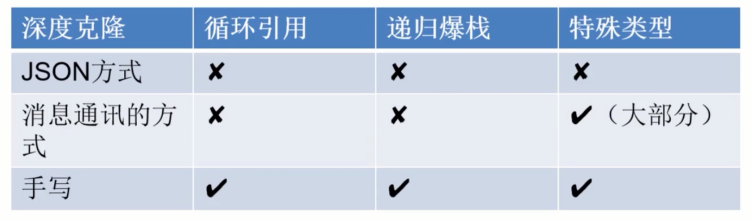

**终结版：**

```ts
const { toString, hasOwnProperty } = Object.prototype;

function hasOwnProp(obj, property) {
  return hasOwnProperty.call(obj, property);
}

function getType(obj) {
  return toString.call(obj).slice(8, -1).toLowerCase();
}

function isObject(obj) {
  return getType(obj) === "object";
}

function isArray(arr) {
  return getType(arr) === "array";
}

function isCloneObject(obj) {
  return isObject(obj) || isArray(obj);
}

function cloneDeep(x) {
  //使用WeakMap
  let uniqueData = new WeakMap();
  let root = x;

  if (isArray(x)) {
    root = [];
  } else if (isObject(x)) {
    root = {};
  }

  // 循环数组
  const loopList = [
    {
      parent: root,
      key: undefined,
      data: x,
    },
  ];

  while (loopList.length) {
    // 深度优先
    const node = loopList.pop();
    const parent = node.parent;
    const key = node.key;
    const source = node.data;

    // 初始化赋值目标，key为undefined则拷贝到父元素，否则拷贝到子元素
    let target = parent;
    if (typeof key !== "undefined") {
      target = parent[key] = isArray(source) ? [] : {};
    }

    // 复杂数据需要缓存操作
    if (isCloneObject(source)) {
      // 命中缓存，直接返回缓存数据
      let uniqueTarget = uniqueData.get(source);
      if (uniqueTarget) {
        parent[key] = uniqueTarget;
        continue; // 中断本次循环
      }

      // 未命中缓存，保存到缓存
      uniqueData.set(source, target);
    }

    if (isArray(source)) {
      for (let i = 0; i < source.length; i++) {
        if (isCloneObject(source[i])) {
          // 下一次循环
          loopList.push({
            parent: target,
            key: i,
            data: source[i],
          });
        } else {
          target[i] = source[i];
        }
      }
    } else if (isObject(source)) {
      for (let k in source) {
        if (hasOwnProp(source, k)) {
          if (isCloneObject(source[k])) {
            // 下一次循环
            loopList.push({
              parent: target,
              key: k,
              data: source[k],
            });
          } else {
            target[k] = source[k];
          }
        }
      }
    }
  }

  uniqueData = null;
  return root;
}

var obj = {
  p1: "p1",
  p2: [
    "p22",
    {
      p23: undefined,
      p24: 666,
    },
  ],
  null: null,
  p4: new RegExp(),
  p3: undefined,
  func: function () {
    console.log("func");
    return 1;
  },
  Symbol: Symbol(2),
  bigint: BigInt(100),
};
obj.loop = obj;

const f = cloneDeep(obj);
console.log("f==", f);
```
