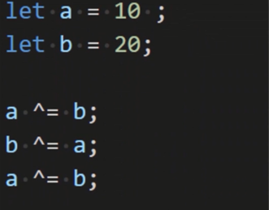
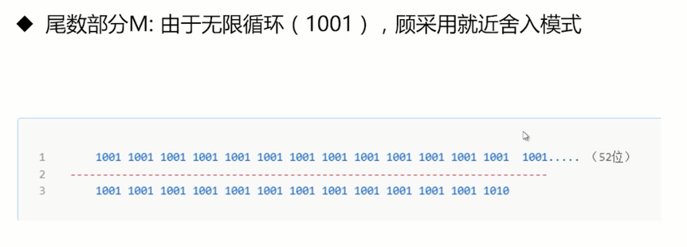

# 运算符的妙用以及部分机理解析

位运算符最高效，一元运算符在很多场景下有奇效.彻底理解为什么不建议使用一元运算符delete，为什么0.1+0.2!=0.3等等知识以及其背后的原理。

## 运算符的诡异现象

**函数基础知识**

- 普通函数调用时， this 指向的是调用函数的对象

```ts
let name = "let的name";
const person = {
  name: "person的Name",
  getName() {
    return this.name;
  },
};

const getName = person.getName;

const print = function (prefix, ...args) {
  console.log(prefix.padEnd(20, " ") + ":", ...args);
};

print("getName", getName());

print("person.getName", person.getName());
print("(person.getName)", (person.getName)());
print("(0, person.getName)", (0, person.getName)());
```

分析：
```ts
// person.getName
// this: person
// 结果：person 的 Name

// getName
// this：全局对象
// 答案： let的name？
// 答案: undefined ! let 和 const 声明的变量不会放到全局对象

// (person.getName)()
// 有没有赋值操作
// 赋值的话给了谁
// 
// 没有产生 GetValue 操作，没有发生赋值操作，也没有赋值行为
// this：person
// 结果：person 的 Name
```

**(person.getName)()**

引用：
- 内部引用类型不是语言数据类型
- 用于解释诸如 delete、typeof 和赋值等操作符的行为
- 例如：赋值的 `左操作符` 应该生成一个引用记录

赋值左操作数
- var Name =10
- 10 = 10

引用的属性：


引用相关的两个重要操作：
- GetValue(V): 即取值操作，返回的是确定的值
- PutValue(V,W): 设置值，对某个引用设置
- PutValue `要求第一个参数是引用(查看协议)`

v=v
- 可以理解为：v = GetValue(v)
- v在作为左手端的时候，它是引用；
- 而作为右手端的时候，它是值

其他赋值操作：


分组运算符()
- 分组运算符里面可以是表达式，也可以是字面量的值
- 此算法不将 GetValue 应用于计算 Expression(表达式)的结果。这样做的主要原因是，诸如 delete 和 typeof 等操作符可以应用于括号表达式

**(0, person.getName)()**

- 分组运算符
- 逗号运算符

逗号运算符
- MDN：逗号操作符，对它的每个操作数`求值`(从左向右), 并返回最后一个操作数的值。

(0, person.getName)()
- 产生了赋值操作，等同 (const getName = person.getName)()
- this: 全局对象
- 答案: underfined

typeof 未声明变量为什么不报错(非严格模式)
- 未发生求值？
- 答案：引用不可达，直接返回 undefined

<!--  -->

思考题：
```ts
var varNum = 10;
function evalCode(){
	eval(`var varNum = 20`)
}

function evalCode2(){
	(0,eval)(`var varNum = 30`)
}
console.log("varNum:", varNum);

evalCode()
console.log("varNum:", varNum);
evalCode2();
console.log("varNum:", varNum);
```

## 窥视 delete 语法的本质


delete 的返回值是什么
- Boolean 类型
- true，不一定删除成功，代表`删除没有发生异常`
- false 一定没有删除成功

```ts
var a = {
    p1: 1,
    p3: 5
}

// 对象的属性
console.log("delete a.p1:", delete a.p1);
// 对象上不存在的属性
console.log("delete a.p2:", delete a.p2);
// 全局对象a 
console.log("delete var a:", delete a);

console.log("");
console.log("var a:", a);
```

delete 不能删除那些属性
- 任何用 var 声明的属性，不能从全局作用域或者函数的作用域删除
- 任何用 let 或者 cosnt 声明的属性，不能从他声明的作用域删除
- 不可配置(configurable)的属性不能被删除

```ts
//var 
function testVar() {
    var a = 1;
    console.log("delete var a:", delete a);
    console.log("var a :", a);
}
testVar();

//let const,
function testLet() {
    let a = 1;
    console.log("delete let a:", delete a);
    console.log("let a :", a);
}
//作用域在testLet 中
testLet();
```

```ts
//不可配置的
var obj = {};
Object.defineProperty(obj, 'name', { configurable: false });
console.log("delete obj.name", delete obj.name);

// undefined
console.log("delete undefined:", delete undefined);
console.log(Object.getOwnPropertyDescriptor(global, "undefined"));

// Infinity
console.log("delete Infinity:", delete Infinity);
console.log(Object.getOwnPropertyDescriptor(global, "Infinity"));

// NaN
console.log("delete NaN:", delete NaN);
console.log(Object.getOwnPropertyDescriptor(global, "NaN"));

// window
// console.log("delete window:", delete window);
// console.log(Object.getOwnPropertyDescriptor(window));

// document
// console.log("delete window.document", delete window.document);
// Object.getOwnPropertyDescriptor(window, "document");
```

delete 删除原型上的属性
- delete 不会遍历原型链，或者说姿势不对
- delete Foo.prototype.bar

```ts
function Foo() {
    this.bar = 10;
}

Foo.prototype.bar = 42;

var foo = new Foo();

// 返回 true，因为删除的是 foo 对象的自身属性
delete foo.bar;

// foo.bar 仍然可用，因为它在原型链上可用。
console.log(foo.bar);   //42

// 从原型上删除属性
delete Foo.prototype.bar; //true

// 由于已删除“ bar”属性，因此不能再从Foo继承它。
console.log(foo.bar);    //undefined
```

delete 删除的到底是什么

```ts
delete 10; //true

var trees = ["redwood","bay","cedar","oak","maple"];
delete trees[3];
console.log("trees:",trees);
// trees：：：  ["redwood", "bay", "cedar", empty, "maple"]
```

协议描述：


delete 语法的本质是什么
- 操作表达式结果
- 值、字面量，不操作，直接返回 true
- 引用类型，删除引用

**严格模式**
- SyntaxError: 变量，函数名，函数参数
- TypeError：configurable 为 false
- ReferenceError: 典型的就是 delete super.property

```ts
"use strict"

// 变量
var name = 'name';
delete name;

// 函数
function fn(){}
delete fn;

function fnArg(name){
    delete name;
}
fnArg();
```

```ts
"use strict"

var person = {
    name: "帅哥"
};

Object.defineProperty(person, "name", {
    configurable: false
});

delete person.name;
```

```ts
"use strict"

class Parent {    
    constructor(name){
        this.name = name;
    }
    getName(){

    }
}

class Child extends Parent {    
    constructor(name, age){
        super(name);
        this.age =  age
    }

    deleteAny(){
        console.log("super", super.getName);
        delete super.getName
    }
}

var child = new Child("child", 18);
delete child.deleteAny();
```

var 非 var

```ts
var nameVar = "nameVar";
nameNotVar = "nameNotVar";

console.log("nameVar", Object.getOwnPropertyDescriptor(window,"nameVar"))

console.log("nameNotVar",  Object.getOwnPropertyDescriptor(window,"nameNotVar"))
```

## 位运算符的妙用：奇偶数，色值换算，换值， 编码等

位运算的基础知识
- 操作数是 32 位整数
- 不是整数，自动转为整数
- 速度 T0，在二进制下进行运算

**按位于 &：**
- 两个为 1，则为 1，否则为 0


判断奇偶数：
- 奇数： num & 1 == 1
- 偶数： num & 1 == 0


**按位或 |**

1 个为 1 则为 1


按位或 | 取整

- x | 0
- 5.23 | 0 => 0


按位或 |

- 自身 | 自身 = 自身，可以比较数值相等


**按位非 ~**

- 按位非运算符，反转操作数的位。表象是对数字求负，然后减 1 （`-x-1`）


按位非 ~ 判断数组中是否包含某个元素

- 不存在，indexOf 返回 -1
- ~-1 = -(-1)-1 = 1-1 = 0

```ts
const array = [2, 3, 4];

//检查数组中是否包含元素
function inArrayCompare(arr, num) {
    if (arr.indexOf(num) > -1) {
        return true;
    }
    return false;
}


function inArray(arr, val) {
    // -1 不存在, ~ -1 == 0, 布尔值为 false
    // 其他情况为真值，表示存在
    if (~arr.indexOf(val)) {
        return true;
    }
    return false;
}


const print = console.log;
print(inArrayCompare(array,2));
print(inArray(array,2));
```

按位非 - 取整

- ~~x
- -(-x-1)-1
- x+1-1 = x

```ts
console.log(~~54.25)
console.log(54.25 >> 0)
console.log(54.25 >>> 0)
console.log(54.25 | 0)

//原理 ~ ， 实质上是对数字求负，然后减 1 (-x-1).
//那么~~就是对数字求负减一后再求负减1 (-（-x-1）)-1 也就可以用于取整
var result = function (num) {
    console.log(-num - 1);
    const result1 = (-num - 1);
    console.log(-result1);
    return -result1 - 1
};

console.log("abc==", ~54)
console.log("abc==", result(54))
```

**按位异或 ^**

- 只有一个数位存放 1 时，返回 1 ，否则为 0


归零律：
- 归零律： a^a=0 ，自己异或自己，位数上的值肯定相同

恒等律：
- 恒等律：a^0=a ，自己异或0，自己是啥结果是啥


自反，结合律
- 自反： a^a^a = 0^a = a
- 结合律: a^b^c == c^b^c ， 与顺序无关

值交换：
- 变量值为数字，完成值得交换(不用增加临时变量)




```ts
let a = 10;
let b = 20;

a ^= b;
b ^= a;
a ^= b;

console.log("a==", a)
console.log("b==", b)
```

比较两数相等：
```ts
console.log("5 ^ 5==",5 ^ 5)
console.log("5 ^ 4==",5 ^ 4)

console.log("25 ^ 4==",25 ^ 4)
console.log("25 ^ 25==",25 ^ 25)

console.log("0 ^ 0==",0 ^ 0)


console.log("0 ^ 1==",0 ^ 1)

console.log("1 ^ 0==",1 ^ 0)
```

RGB 和 16 进制颜色值转换:

必备知识：


```ts
function colorRGBToHex(rgb) {
  // split 的参数可以是正则
  // "rgb(204,0,255)"
  const rgbArr = rgb.split(/[^\d]+/);
  // ['', '204', '0', '255', '']    
  const color = rgbArr[1] << 16 | rgbArr[2] << 8 | rgbArr[3];
  return "#" + color.toString(16);
}

console.log(colorRGBToHex("rgb(204,0,255)"));
```


16 进制转 RGB：

```ts
// "#CC00FF"
function colorHexToRGB(hex){
    // 转为6位的16进制 0xCC00FF
    let newHex = hex.replace("#","0x"),
        r = newHex >> 16,
        g = newHex >> 8 & 0xff,
        b = newHex & 0xff;
    return "rgb("+r+","+g+","+b+")";
}

console.log(colorHexToRGB("#CC00FF"));
```


其他场景：
- base64
- 简单加解密

```ts
const password = 654;
const specialCharacter="`%_";

function encodeStr(str) {
    let result = '';
    str.split('').map(item => {
      result += handleCode(item,1);
    })
    return result;
}


function decodeStr(str) {
  let result = '';
  str.split(specialCharacter).map(item => {
     if(item.length>0 && /\d/.test(item)){
        result += handleCode(item,2);
     }else{
         item.split('').map(charItem => {
            result += handleCode(charItem,2);
         })
     }
 })
  
  return result;
}

function handleCode(str,type) {
    if (/\d/.test(str)) {
        //数字类型
        const r= str ^ password;
        if(type==2) return r;
        return specialCharacter + r +specialCharacter;
    } else {
      //字符类型，直接去code 码
      const code = str.charCodeAt();
      const newCode = code ^ password;
      //再次转换为字符
      return String.fromCharCode(newCode);
    }
}

const testStr = '嗨喽， 张三，hello35';
const result = encodeStr(testStr); 
console.log("encodeStr===",result);        
const decodeResult = decodeStr(result);   
console.log("decodeStr===",decodeResult);  
```


## 计算机是怎样进行数字相加的

- 十进制和二进制是如何相互转换的
- 浮点数是以什么格式存储的
- 计算机是怎么进行加法的

十进制转二进制：
- 整数：除2取余，逆序排列
- 小数：乘2取整，顺序排列

例子：9.375


整数 + 小数 = 1001 + 0.011 = 1001.011

```ts
console.log((9.375).toString(2))
console.log(Number.prototype.toString.call(9.375, 2))
console.log(Number.prototype.toString.call(Number(9.375), 2))
```

二进制转十进制：

- 小数点前：`从右向左`用二进制的每个树乘以2的相应的`次方递增`
- 小数点后：`从左向右`用二进制的每个数乘以2的相应的`负次方递增`

例子：100.011


```ts
console.log((0.30000000000000004).toString(2))
```

**IEEE754二进制浮点数算数标准**


- http://www.binaryconvert.com/result_double.html?decimal=049048051046054050053

**浮点数运算**

- 对阶
- 位数运算
- 规格化
- 舍入处理
- 溢出判断

对阶
- 对阶：保持指数位数字一致
- 小阶对大阶

例子：
- 123.5 + 1425.00456
- 1.235 * 10 ** 2 + 1.42500456 * 10 ** 3
- 0.1235 * 10 ** 3 + 1.42500456 * 10 ** 3

精度丢失问题：
- 小阶对大阶，会右移，容易丢失位数
- 相加 或者 相减，值可能溢出

尾数运算：
- 就是在完成对阶以后进行尾数相加减

结果规格化：
- 1.M 的形式：；例子 17.051 -> 1.7051
- 左移规格化
- 右移规格化(可能丢失精度)

舍入处理：
- 舍入到最近（默认）
- 朝 +oo 方向舍入
- 朝 -oo 方向舍入
- 朝 0 方向舍入

溢出判断：
- 运算结果的阶码 的值判断是否溢出
- 超出最大正数（上溢）：浮点数正数：正上溢，否则：负上溢

 
## why 0.1 + 0.2 !=0.3 揭秘！





溢出检查：
- 指数1021没有溢出


解决方案：

```ts
(0.1 * 100 + 0.2 * 100) / 100
```
