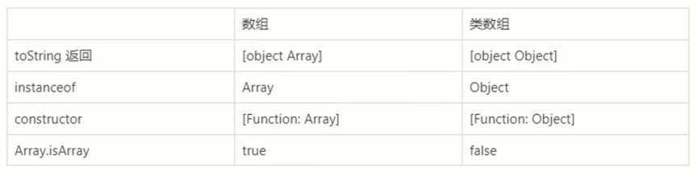
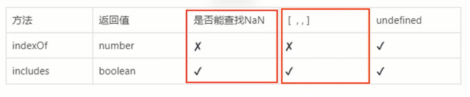
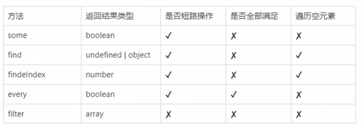
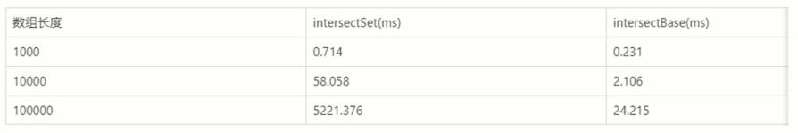
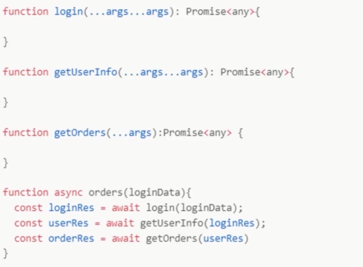
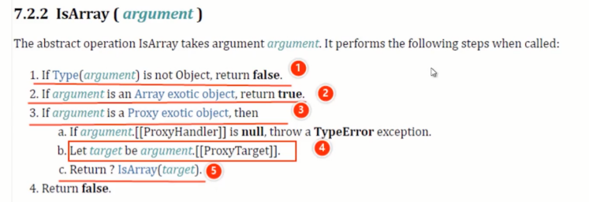
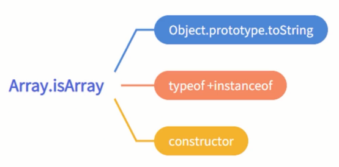
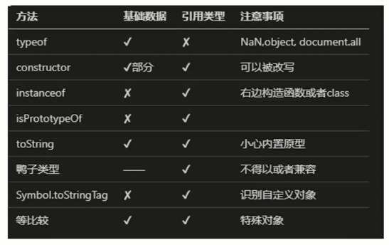
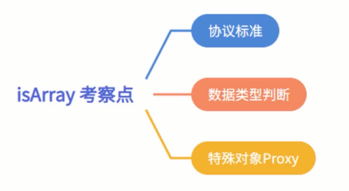
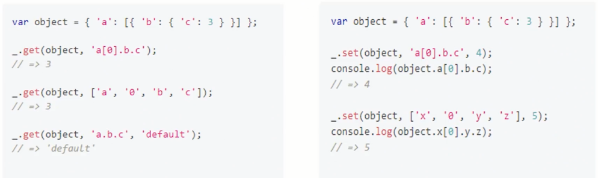

# 玩转数组高级技法

数组和类数组有什么区别，怎么转换，两个数组如何高效的合并，用数组实现range功能，reduce的18般玩法等等

## 几个问题

**批量制造数据**

使用 - for

- 思路：for 循环，push

```ts
function createData() {
    const data = [];
    for (let i = 0; i < 1000; i++) {
        data.push({
            name: `name${i + 1}`
        })
    }
    return data
}

const data = createData();
console.log(data)
```

map
```ts
function createData() {
    return new Array(1000)
        .map((v, i) => ({ name: `name${i + 1}` }))
}

const data = createData();
console.log(data);
```

批量制造数据 - fill + map

- 思路：创建空数组，填充 null，然后 map

```ts
function createData() {
    return new Array(1000).fill(null)
        .map((v, i) => ({ name: `name${i + 1}` }))
}

const data = createData();
console.log(data);
```

使用 Array.from

思路：Array.from 第二个初始化函数返回数据

```ts
function createData() {
    return Array.from({ length: 1000 }, (v, i) => (
        { name: `name${i + 1}` }
    ));
}

const data = createData();
console.log(data)
```

**数组去重**

使用 Set:

```ts
const arr1 = [1, 2, 3];
const arr2 = [3, 4, 5];

console.log(new Set([...arr1, ...arr2]));
```

非 Set：

思路：for 遍历，indexOf 判断是否存在

```ts
const arr1 = [1, 2, 3];
const arr2 = [3, 4, 5];

function mergeArray(arr1, arr2) {
    // 克隆
    var arr = arr1.slice(0);
    var v;
    for (let i = 0; i < arr2.length; i++) {
        v = arr2[i];
        // 这个操作，
        // 详情参见4.2位运算符的妙用：奇偶数，色值换算，换值， 编码等
        if (~arr.indexOf(v)) {
            continue;
        }
        arr.push(v)
    }
    return arr
}

console.log(mergeArray(arr1, arr2))
```

不支持 NaN
```ts
const arr1 = [1, 2, 3, NaN];
const arr2 = [3, 4, 5, NaN];

function mergeArray(arr1, arr2) {
    // 克隆
    var arr = [...arr1];
    var v;
    for (let i = 0; i < arr2.length; i++) {
        v = arr2[i];
        // 这个操作，
        // 详情参见4.2位运算符的妙用：奇偶数，色值换算，换值， 编码等
        if (~arr.indexOf(v)) {
            continue;
        }
        arr.push(v)
    }
    return arr
}

console.log(mergeArray(arr1, arr2))
```

去重对象：

```ts
// 这段代码能去重吗？
const arr1 = [{ id: 1 }, { id: 2 }, { id: 3 }];
const arr2 = [{ id: 3 }, { id: 4 }, { id: 5 }];

console.log(new Set([...arr1, ...arr2]));
```

去重对象引用：
```ts
const obj3 = { id: 3 };
const arr1 = [{ id: 1 }, { id: 2 }, obj3];
const arr2 = [obj3, { id: 4 }, { id: 5 }];

console.log(new Set([...arr1, ...arr2]));
```

对象数据去重 - for

- 思路：for 遍历，find、findIndex 判断是否存在

```ts
const arr1 = [{ id: 1 }, { id: 2 }, { id: 3 }];
const arr2 = [{ id: 3 }, { id: 4 }, { id: 5 }];

function mergeArray(arr1, arr2) {
    // 克隆
    var arr = arr1.slice(0);
    var v;
    for (var i = 0; i < arr2.length; i++) {
        v = arr2[i];
        // 这个操作，
        // 详情参见4.2位运算符的妙用：奇偶数，色值换算，换值， 编码等
        if (~arr.findIndex(el=> el.id === v.id)) {
            continue;
        }
        arr.push(v)
    }
    return arr
}

console.log(mergeArray(arr1, arr2))
```

## 深入浅出类数组

- 什么是类数组
- 类数组的特征是什么
- 常见的类数组有哪些

**创建数组的几种方式：**

- 数组对象字面量
- new Array
- Array.of (ES6)
- Array.from (ES6)
- Array.prototype.slice
- Array.prototype.concat

**什么是类数组**

类数组：是有一个 length 属性和 `从零开始索引的属性`，但是没有 Array 的内置方法，比如 forEach 和 map 等一种特殊的对象。

特征：
- 是一个普通对象
- 必须有 length 属性，可以有非负整数索引
- 本身不具备数据所具被的方法

常见的类数组

- arguments
- DOM 相关：NodeList，HTMLCollection, DOMTokenList 等
- 字符串：具备类数组的所有特性。`但是类数组一般都只对象`

```ts
function person(name, age, sex) {
    console.log("person arguments:", arguments);
    console.log("person type::", Object.prototype.toString.call(arguments));
}

person('name', 'age', 'sex');


//Dom 方法的返回结果
var domList = document.querySelectorAll(".s-center-box");
console.log("querySelectorAll type::", Object.prototype.toString.call(domList));

document.body.children
document.all
document.querySelector(".s-center-box").classList

// 字符串
var str = "abc";
console.log(Array.from(str))
console.log(Object.keys(str))
```

**类数组和数组的区别：**



```ts
function person(name, age, sex) {
    console.log("类数组 type::", Object.prototype.toString.call(arguments));
    console.log("类数组 instanceof object::", arguments instanceof Object);
    console.log("类数组 constructor::", arguments.constructor);
    console.log("类数组 isArray::", Array.isArray(arguments));
}

person('name', 'age', 'sex');


const array=['name','age','sex'];

console.log("数组 type::", Object.prototype.toString.call(array));
console.log("数组 instanceof array::", array instanceof Array);
console.log("数组 constructor::", array.constructor);
console.log("数组 isArray::", Array.isArray(array));
```

**判断类数组：**

```ts
//使用 isFinite() 在检测无穷数：
function isArrayLikeObject(arr) {
    const typeStr = typeof arr;
    // if (typeStr === 'string') {
    //     return true
    // }
    if (arr == null || typeStr !== 'object')
        return false;

    const lengthMaxValue = Math.pow(2, 53) - 1;;
    if (!Object.prototype.hasOwnProperty.call(arr, "length"))
        return false;
    if (typeof arr.length != "number") return false;
    if (!isFinite(arr.length)) return false;
    if (Array === arr.constructor) return false;

    if (arr.length >= 0 && arr.length < lengthMaxValue) {
        return true
    } else {
        return false
    }
}


console.log("arr==", isArrayLikeObject(null));

const arr = { 0: 1, 2: 3, length: 2 };
console.log("arr==", isArrayLikeObject(arr));

const arr1 = { 0: 1, 2: 3, length: "" };
console.log("arr==", isArrayLikeObject(arr1));

const arr2 = { 0: 1, 2: 3 };
console.log("arr==", isArrayLikeObject(arr2));

const arr3 = [1, 2];
console.log("arr==", isArrayLikeObject(arr3));
```

**类数组转数组：**

- slice, concat 等
- Array.from
- Array.apply
- 复制遍历


```ts
const arrayLikeObj = {
    length: 2,
    0: 1,
    1: 2
};
const array1 = Array.prototype.slice.call(arrayLikeObj) 
console.log(array1);

const array2 = Array.prototype.concat.apply([], arrayLikeObj) 
console.log(array2);
```

```ts
const arrayLikeObj = {
    length: 2,
    0: 1,
    1: 2
};
console.log(Array.from(arrayLikeObj))  // [1,2]

const str="abc";
console.log(Array.from(str));
```

```ts
// body.childNodes 浏览器
// [...document.body.childNodes]  // [div, script, script]

// arguments
function argumentsTest(){
    console.log([...arguments], arguments)
}
argumentsTest(1,2,3)
```

```ts
var arr = [];
var arrayLikeObj = {
    length: 2,
    0: 1,
    1: 2
};

for(let i=0; i< arrayLikeObj.length; i++){
    arr[i] = arrayLikeObj[i];
}

console.log(arr); //  [1, 2]
```

```ts
var arrayLike = {
    length:2,
    0:1
}

console.log(Array.apply(null, arrayLike));
```

借用其他数组的 Symbol.iterator:
```ts
var arrayLikeObj = {
  length: 2,
  0: 1,
  1: 2,
  [Symbol.iterator]: [][Symbol.iterator],
};
console.log([...arrayLikeObj]); // [1,2]

// 自己实现一个 Symbol.iterator

var arrayLikeObj = {
  length: 2,
  0: 1,
  1: 2,
  [Symbol.iterator]() {
    const self = this;
    let index = 0;
    return {
      next() {
        if (index < self.length) {
          return {
            value: self[index++],
            done: false,
          };
        }
        return { value: undefined, done: true };
      },
    };
  },
};

console.log([...arrayLikeObj]); // [1, 2]
```

## 数组方法使用注意事项

数组的长度是多少？

```ts
const arr1 = [1,];
const arr2 = [1, ,];
const arr3 = new Array('10');
const arr4 = new Array(10);

console.log("arr1 length: " + arr1.length);
console.log("arr2 length: " + arr2.length);
console.log("arr3 length: " + arr3.length);
console.log("arr4 length: " + arr4.length)
```

数组空元素 empty:

- empty: 数组的空位，指数组的某一位置没有任何值，简单来说，就是数组上没有对应的属性。
- 一般的遍历，自动跳过空位，forEach，reduce 等

```ts
const arr = [1, ,];
console.log("arr:", arr);

// 长度
console.log("arr.length:", arr.length);
// 键
console.log("keys", Object.keys(arr));
// empty 空位的值为undefined
console.log("0:", arr[0], ",1:", arr[1]);

// 怎么判断空位
console.log("hasOwn:0", Object.prototype.hasOwnProperty.call(arr, "1"))
console.log("hasOwn:1", Object.prototype.hasOwnProperty.call(arr, "1"))
```

`基于值进行运算，位置的值为 undefined`
- find、findIndex、includes 等，indexOf 除外
- 作为迭代的时候，参与 Object.entrues, 扩展运算符，for of 等

`join 和 toString，空位怎么处理`
- 视为空字符串
- toString 默认调用内部的 join 方法

```ts
const arr = [1, , 3,];

// 基于键遍历
arr.forEach(function (v, index) {
    console.log("forEach:", v)
})

// 基于值运算
const index = arr.findIndex(v=> v === undefined)
console.log("findIndex:", index)

console.log("join:", arr.toString());
```

稀疏数组：
- 有空元素的数组，就是稀疏数组

如何避免创建稀疏数组
- Array.apply(null, Array(3))
- [...new Array(3)]
- Array.from(Array(3))

数组不会自定添加分号：
- (,[,+,-,/, 作为一行代码的开头，很可能产生意外的情况，所以没事代码最后写个分号，保准没错


```ts
const objA = { a: 1 }
['a']

console.log(objA);

const objB = ['a']
['a']

console.log(objB);
```

```ts
var a = [[1, 2], 2, 3]
console.log(a);
[0, 2, 3].map(v => console.log(v * v))
console.log(a)

// =>
// var a = [[1,2],2,3]
// console.log(a)[0,2,3].map(v=> console.log(v*v))
// console.log(a)
```

indexOf 与 includes：



```ts
const array1 = [NaN];
console.log("array.includes NaN:", array1.includes(NaN));
console.log("array.indexOf NaN:", array1.indexOf(NaN) > -1);

const array2 = [1, ,];
console.log("array.includes ,,:", array2.includes(undefined));
console.log("array.indexOf ,,:", array2.indexOf(undefined) > -1);

const array3 = [undefined];
console.log("array.includes undefined:", array3.includes(undefined));
console.log("array.indexOf undefined:", array3.indexOf(undefined) > -1);
```

数组可变长度问题:

- length 代表数组中元素个数，数组额外附加属性不计算在内
- length 可写，可以通过修改 length 改变数组的长度
- 数组操作不存在越界，找不到下标，返回 undefined

```ts
const array = [1, 2, 3, 4, 5, 6];
array[10] = 10;
console.log("array.length:", array.length);

array["test"] = 11;
console.log("array.length:", array.length);


array.length = 3; 
console.log("array.length:",  array.length);


console.log("array.length:", array.length);
console.log("array value:", array[Number.MAX_VALUE + 1000])
```

数组查找或者过滤：



```ts
const array = [{ name: "张三", age: 15 }, , { name: "李四", age: 25 }, { name: "王五", age: 36 }];

//some
const isExist = array.some((item, index, arr) => {
    console.log("some index:", index);
    return item && item.age > 24;
});
console.log("array some:", isExist);

//find
const item = array.find((item, index, arr) => {
    console.log("find index:", index);
    return item && item.age > 24;
});
console.log("array find:", item);

//findIndex
const index = array.findIndex((item, index, arr) => {
    console.log("findIndex index:", index);
    return item && item.age > 24;
});
console.log("array findIndex:", index);

//every
const isAll = array.every((item, index, arr) => {
    console.log("every index:", index);
    return item && item.age > 15;
});
console.log("array every:", isAll);

const result = array.filter((item, index, arr) => {
    console.log("filter index:", index);
    return item && item && item.age > 24;
});
console.log("array filter:", result);
```

改变自身的方法：
- pop、shift、splice
- unshift、push、sort、reverse
- ES6：copyWithin、fill

```ts
let array=[1,2,3,4,5,6,7];

array.pop();
console.log("array pop:",array);

array.shift();
console.log("array shift:",array);


array.unshift("unshift");
console.log("array unshift:",array);


array.push("push")
console.log("array push:",array);


array.reverse()
console.log("array reverse:",array);

array.sort()
console.log("array sort:",array);

array.splice(2,1)
console.log("array splice:",array);

array.copyWithin(2,0)
console.log("array copyWithin:",array);

array.fill("fill",3)
console.log("array fill:",array);
```

sort 注意事项：

- 默认按照 ASII 码先后顺序排序 (10 排在 2 前面)

```ts
const array=[1,2,3,4,5,6,7,8,9,10];
array.sort();
console.log("array sort:",array);

console.log("10:".charCodeAt());
console.log("1:".charCodeAt());
```

不改变自身的方法:

```ts
const array = [1, 2, 3, 4, 5];
//concat
const concatArray = array.concat(6, [7, 8]);
console.log("array.concat:", concatArray);

//concat 是基于原数组浅复制,这块我们克隆的时候讲过
const array1 = [{ name: "张三" }];
const array2 = array1.concat({ name: "李四" });
array2[0].name = "王五";
console.log("array.concat 修改item:", array1, "==array2==", array2);

//slice  注意，这里也是浅复制
const array3 = [{ name: "张三" }, { name: "李四" }, { name: "王五" }];
const sliceArray = array3.slice(2, 3);
console.log("array.slice:", sliceArray, "==array3=", array3);
sliceArray[0].name = "赵六";
console.log("array.slice 修改item:", sliceArray, "==array3=", array3);
```

数组操作非线性存储问题：

- 数组默认存储为线性存储
- 存储结构改变必然产生不必要代价，我们尽量线性递增

```ts
<script>
    class MyArray extends Array {
        constructor() {
            super(...arguments);
        }
    };

    var myArray = new MyArray();

    myArray[0] = "1";
    myArray[1] = "1";
    myArray[2] = "1";
    myArray[3] = "1";
    myArray[4] = "1";
    myArray[5] = "1";
    myArray[6] = "1";
    myArray[7] = "1";
    myArray[8] = "1";
    myArray[9] = "1";
    myArray[10] = "1";
    myArray[11] = "1";
    console.log(myArray);

    function operation() {
        myArray[10000] = "1";
        console.log("myArray[10000]:", myArray);
    }

</script>

<button onclick="operation()">操作</button>
```

delete 误区：

- delete 删除数组元素，后面元素不会补齐，delete 删除引用

```ts
const array = [1, 2, 3, 4, 5];
delete array[2];
console.log("delete array:", array);
```

push vs concat：

```ts
const count=10000;
const array1=[1,2,4,5,6];

let newArray=[];

console.time("push");
for(let i=0;i<count;i++){
    newArray.push(array1[0],array1[1],array1[2],array1[3],array1[4])
}
console.timeEnd("push");

console.time("concat");
for(let i=0;i<count;i++){
    newArray = newArray.concat(array1[0],array1[1],array1[2],array1[3],array1[4])
}
console.timeEnd("concat");
```

- 快数组：线性存储
- 慢数组：哈希表存储

## 数组高级用法

- 万能数据生成器
- 随机数生成器

```ts
const createValues = (creator, length = 10) => Array.from({ length }, creator)

const createRandomValues = (len) => createValues(Math.random, len)

const values = createRandomValues();

console.log("values:", values.length, values)
```

序列生成器：
```ts
const createValues = (creator, length = 10) => Array.from({ length }, creator);

const createRange = (start, stop, step) =>
  createValues((_, i) => start + i * step, (stop - start) / step + 1);

const values = createRange(1, 100, 3);

console.log(values);
```

数据生成器：

```ts
const createValues = (creator, length = 10) => Array.from({length}, creator)

function createUser(v, index){
    return {
        name: `user-${index}`,
        age: Math.random() * 100 >> 0
    }
}

const users = createValues(createUser, 1000);
console.log("users:", users);
```

清空数组：

- Array.prototype.splice(0)
- Array.prototype.length = 0

```ts
const arr = [1, 2, 3];
arr.splice(0);
console.log("splice:", arr);


const arr1 = [1, 2, 3];
arr1.length = 0;
console.log("length:", arr1); 
```

**数组去重：**
- Array.from(new Set(arr))
    - 问题：对于属性键和属性值都相同的对象没有作用
- 

```ts
const arr = ["apple", "banana", 1,1,3, 3, undefined,undefined,,,NaN,NaN, null,null,"true",true,{a: 1}];

const arr1 = Array.from(new Set(arr)); 
console.log("set:",arr1);
```

```ts
function uniqueArray(arr){
    return Array.from(new Set(arr))
}

const arr = [{a:1}, {a:1}];
console.log("set 不同引用：",uniqueArray(arr)); 

const obj1 = {a:1}
const arr2 = [obj1, obj1];
console.log("set 同一引用：",uniqueArray(arr2)); 
```

- Array.prototype.filter + key 唯一
    - 问题：如何确保 key 唯一

```ts
function uniqueArray(arr = [], key) {
  const keyValues = new Set();
  let val;
  return arr.filter((obj) => {
    val = obj[key];
    if (keyValues.has(val)) {
      return false;
    }
    keyValues.add(val);
    return true;
  });
}

var arr = [{ a: 1 }, { a: 1 }, { a: 2 }];

console.log("filter 去重：", uniqueArray(arr, "a"));
```

**求交集：**

- Array.prototype.filter + includes 判断

问题：
- 1. 引用类型相同的判断
- 2. 性能问题

```ts
const arr1 = [0, 1, 2];
const arr2 = [3, 2, 0];

function intersectSet(arr1, arr2) {
  return [...new Set(arr1)].filter((item) => arr2.includes(item));
}

const values = intersectSet(arr1, arr2);

console.log(values);
```

- 引用类型： Array.prototype.forEach + Map + key 唯一
- 基础数据类型：Array.prototype.forEach + Map + filter

```ts
// 引用类型
function intersect(arr1, arr2, key) {
  const map = new Map();
  arr1.forEach((val) => map.set(val[key]));

  return arr2.filter((val) => {
    return map.has(val[key]);
  });
}

// 原始数据类型
function intersectBase(arr1, arr2) {
  const map = new Map();
  arr1.forEach((val) => map.set(val));

  return arr2.filter((val) => {
    return map.has(val);
  });
}

var arr1 = [{ p: 0 }, { p: 1 }, { p: 2 }];
var arr2 = [{ p: 3 }, { p: 2 }, { p: 1 }];
const result = intersect(arr1, arr2, "p");
console.log("result:", result);

const arr3 = [0, 1, 2];
const arr4 = [3, 2, 0];
const result1 = intersectBase(arr3, arr4);
console.log("result1:", result1);
```

性能对比：


```ts
function intersectSet(arr1, arr2){
    return [...new Set(arr1)].filter(item =>arr2 .includes(item))
}

// 原始数据类型
function intersectMap(arr1, arr2){ 
    const map = new Map();
    arr1.forEach(val=> map.set(val))

    return arr2.filter(val=> {
        return map.has(val);
    });
}

function createData(length){    
    return Array.from({length}, (val, i)=> {
        return ~~(Math.random()* length)
    })
}

console.time("createData")
var data1 = createData(100000);
var data2 = createData(100000);
console.timeEnd("createData")

console.time("intersectSet");
intersectSet(data1, data2);
console.timeEnd("intersectSet");


console.time("intersectBase");
intersectMap(data1, data2);
console.timeEnd("intersectBase");
```

**求差集**

- 与求交集类似

```ts
// 引用类型
function difference(arr1, arr2, key) {
  const map = new Map();
  arr1.forEach((val) => map.set(val[key]));

  return arr2.filter((val) => {
    return !map.has(val[key]);
  });
}

// 原始数据类型
function differenceBase(arr1, arr2) {
  const map = new Map();
  arr1.forEach((val) => map.set(val));

  return arr2.filter((val) => {
    return !map.has(val);
  });
}

var arr1 = [{ p: 0 }, { p: 1 }, { p: 2 }];
var arr2 = [{ p: 3 }, { p: 2 }, { p: 1 }];
const result = difference(arr1, arr2, "p");
console.log("result:", result);

const arr3 = [0, 1, 2];
const arr4 = [3, 2, 0];
const result1 = differenceBase(arr3, arr4);
console.log("result1:", result1);
```

从数组中删除虚值：

-  Array.prototype.filter(Boolean)

```ts
const array = [false, 0, undefined, , "", NaN, 9, true, undefined, null, "test"];
const newArray = array.filter(Boolean);
console.log(newArray); 
```

获取数组中最大值和最小值：

- Math.max.apply(Math, numArray)
- Math.min.apply(Math, numArray)

```ts
const numArray = [1, 3, 8, 666, 22, 9982, 11, 0];
const max = Math.max.apply(Math, numArray);
const min = Math.min.apply(Math, numArray);
console.log("max:", max + ",min:" + min)
```

```ts
const createValues = (creator, length = 10) => Array.from({ length }, creator);

function createUser(v, index) {
  return {
    name: `user-${index}`,
    age: (Math.random() * 100) >> 0,
  };
}

const users = createValues(createUser, 10);
const ages = users.map((u) => u.age);

const max = Math.max.apply(Math, ages);
const min = Math.min.apply(Math, ages);
console.log(ages);
console.log("max:", max + ",min:" + min);
```

什么是 QueryString

- 页面传递参数
- 规律：地址 url 问号 ? 拼接的键值对

现在 WEB API 查询 QueryString

- URLSearchParams
- URL

```ts
const urlSP = new URLSearchParams(location.search);
function getQueryString(key) {
    return urlSP.get(key)
}

console.log("words:", getQueryString("words"));  // vue
console.log("wordss:", getQueryString("wordss"))  // null
```

```ts
const urlObj = new URL(location.href);
function getQueryString(key) {
    return urlObj.searchParams.get(key)
}

console.log("words:", getQueryString("words")); // vue
console.log("wordss:", getQueryString("wordss")); // null
```

手动实现：

QueryString 规律：
- ? 之后
- & 分割得到一组键值对
- = 分割键和值

```ts
      const urtObj = location.search
        .slice(1)
        .split("&")
        .filter(Boolean)
        .reduce(function (obj, cur) {
          var arr = cur.split("=");
          if (arr.length != 2) {
            return obj;
          }
          obj[decodeURIComponent(arr[0])] = decodeURIComponent(arr[1]);
          return obj;
        }, {});

      function getQueryString(key) {
        return urtObj[key];
      }

      console.log("words:", getQueryString("words")); // vue
      console.log("wordss:", getQueryString("wordss")); // null
```

**折上折：**

- 优惠1: 9折
- 优惠2：满200-50

草民版：

```ts
function discount(x) {
    return x * 0.9
}

function reduce(x) {
    return x > 200 ? x - 50 : x
}

const print = console.log
// 享受九折
print(reduce(discount(100)))
// 享受九折 + 满减
print(reduce(discount(250)))
```

黄金版：
```ts
function discount(x) {
    return x * 0.9
}
function reduce(x) {
    return x > 200 ? x - 50 : x
}
function getPriceMethod(discount, reduce) {
    return function _getPrice(x) {
        return reduce(discount(x))
    }
}
const method = getPriceMethod(discount, reduce)

const print = console.log;

print(method(100))
print(method(250))
```

compose 版：
```ts
function compose(...funcs) {
  if (funcs.length === 0) {
    return arg => arg
  }
  return funcs.reduce((a, b) => (...args) => b(a(...args)))
}

function discount(x) {
  console.log('discount')
  return x * 0.9
}
function reduce(x) {
  console.log('reduce')
  return x > 200 ? x - 50 : x
}
function discountPlus(x) {
  console.log('discountPlus')
  return x * 0.95
}
const getPrice = compose(discount, reduce, discountPlus );

const print = console.log;

print(getPrice(200))
print(getPrice(250))
```

看一个场景：
1. 登录
2. 获取用户信息
3. 取用户订单

<!--  -->

```ts
function login(...args...args): Promise<any>{

}
function getUserInfo(...args...args): Promise<any>{
}

function getOrders(...args):Promise<any> {

}

function async orders(loginData){
	const loginRes = await login(loginData);
  const userRes = await getUserInfo(loginRes);
  const orderRes = await getOrders(userRes)
}
```


Promise 执行顺序：

```ts
function runPromises(promiseCreators, initData) {
  return promiseCreators.reduce(function (promise, next) {
    return promise.then((data) => next(data));
  }, Promise.resolve(initData));
}

const initData = { name: "name", pwd: "pwd" };

Promise.resolve(initData)
  .then((data) => login(data))
  .then((data) => getUserInfo(data))
  .then((data) => getOrders(data))
  .then((data) => console.log("orders", data));

function login(data) {
  console.log("login: data", data);
  return new Promise((resolve) => {
    setTimeout(() => {
      return resolve({
        token: "token",
      });
    }, 500);
  });
}

function getUserInfo(data) {
  console.log("getUserInfo: data", data);
  return new Promise((resolve) => {
    setTimeout(() => {
      return resolve({
        name: "user-1",
        id: 988,
      });
    }, 300);
  });
}

function getOrders(data) {
  console.log("getOrders: data", data);
  return new Promise((resolve) => {
    setTimeout(() => {
      return resolve([
        {
          orderId: 1,
          productId: 100,
          price: 100,
        },
      ]);
    }, 100);
  });
}

// runPromises([login, getUserInfo, getOrders],
//     initData)
//     .then(res => {
//         console.log("res", res);
//     })
```

数组分组：

```ts
const hasOwn = Object.prototype.hasOwnProperty;
function group(arr, fn) {
    // 不是数组
    if (!Array.isArray(arr)) {
        return arr;
    }
    // 不是函数
    if (typeof fn !== "function") {
        throw new TypeError("fn必须是一个函数")
    }
    var v;
    return arr.reduce((obj, cur, index) => {
        v = fn(cur, index);
        if (!hasOwn.call(obj, v)) {
            obj[v] = []
        }
        obj[v].push(cur);
        return obj;
    }, {});
}

// 按照长度分组
let result = group(["apple", "pear", "orange", "peach"],
    v => v.length);
console.log(result);


// 按照份数分组
result = group([{
    name: "tom",
    score: 60
}, {
    name: "Jim",
    score: 40
}, {
    name: "Nick",
    score: 88
}], v => v.score >= 60)

console.log(result);
```

## 手写数组的多个方法

**Array.isArray**

Array.isArray 基本使用：

- 作用：确定传递的值是否是一个 Array

```ts
const arr = ["1"];

const log = console.log;
log("isArray:", Array.isArray(arr))
```

Array.isArray 非基本使用：

```ts
const arr = ["1"];

const proxy = new Proxy(arr, {});
const log = console.log;

log("isArray:", Array.isArray(proxy))
// isArray: true
```

Array.isArray - Proxy 的玄机：

- Proxy 是函数，但本身没有 prototype
- Proxy 不改变被代理对象的外在表现

```ts
const arr = ["1"];
const proxy = new Proxy(arr, {});
const log = console.log;


log("__proto__:", proxy.__proto__ === Array.prototype)
log("instanceof:", proxy instanceof Array)  

console.log("-------------------")
log("toString", Object.prototype.toString.call(Proxy))

log("Proxy.prototype:", Proxy.prototype)

log("proxy instanceof Proxy:", proxy instanceof Proxy) 
```




Array.isArray 手写:



其他实现思路：



手写知识点：




```ts
Array.isArray = function (obj) {
    return Object.prototype.toString.call(obj) === '[object Array]';
};

const arr = ["1"];
const proxy = new Proxy(arr, {});

const log = console.log;
log(Array.isArray(arr))
log(Array.isArray(proxy))
```

```ts
Array.isArray = function (obj) {
    if (typeof obj !== 'object' || obj === null) {
        return false;
    }
    return obj instanceof Array;
}


const arr = ["1"];
const proxy = new Proxy(arr, {});

const log = console.log;
log(Array.isArray(arr))
log(Array.isArray(proxy))
```

Array.prototype.entries：

基本使用：

- 作用：返回一个新的 Array Iterator 对象，该对象包含数组中每个索引的键值对

```ts
const arr = [1,undefined, null, {}];

console.log(arr.entries());
// next访问
const iter = arr.entries();
console.log("next:", iter.next());

// for of迭代
for(let [k, v] of arr.entries()){
    console.log(k, v)
}
```

next 返回值：

```ts
const arr = [1, 2, 3];

const iter = arr.entries();

console.log("iter.next():", iter.next());
console.log("iter.next():", iter.next());
console.log("iter.next():", iter.next());
console.log("iter.next():", iter.next());
```

entries iterator next：

考察点：
- 迭代器的本质和实现
- ES6 Symbol 符号
- 逻辑复用

```ts
Array.prototype.entries = function () {
    const O = Object(this);
    let index = 0;
    const length = O.length;
    return {
        next() {
            if (index < length) {
                return { value: [index, O[index++]], done: false }
            }
            return { value: undefined, done: true };
        }
    }
}

const arr = [1, 2, 3];

const iter = arr.entries();
console.log("iter.next().value:", iter.next().value);
console.log("iter.next().value:", iter.next().value);
console.log("iter.next().value:", iter.next().value);

for (let [k, v] of arr.entries()) {
    console.log(`k:${k}`, `v:${v}`)
}
```

entries iterator symbol:

```ts
Array.prototype.entries = function () {
    const O = Object(this);
    let index = 0;
    const length = O.length;

    function next() {
        if (index < length) {
            return { value: [index, O[index++]], done: false }
        }
        return { value: undefined, done: true };
    }
    return {
        next,
        [Symbol.iterator](){
            return {
                next
            }
        }
    }
}

const arr = [1, 2, 3];

const iter = arr.entries();
console.log("iter.next().value:", iter.next().value);
console.log("iter.next().value:", iter.next().value);
console.log("iter.next().value:", iter.next().value);

for (let [k, v] of arr.entries()) {
    console.log(`k:${k}`, `v:${v}`)
}
```

entries iterator proto:

```ts
Array.prototype[Symbol.iterator] = function () {
    const O = Object(this);
    let index = 0;
    const length = O.length;

    function next() {
        if (index < length) {
            return { value: O[index++], done: false }
        }
        return { value: undefined, done: true };
    }

    return {
        next
    }
}

Array.prototype.entries = function () {
    const O = Object(this);
    const length = O.length;
    var entries = [];

    for (var i = 0; i < length; i++) {
        entries.push([i, O[i]]);
    }

    const itr = this[Symbol.iterator].bind(entries)();
    return {
        next: itr.next,
        [Symbol.iterator]() { return itr }
    }
}

Array.prototype.keys = function () {
    const O = Object(this);
    const length = O.length;
    var keys = [];

    for (var i = 0; i < length; i++) {
        keys.push([i]);
    }

    const itr = this[Symbol.iterator].bind(keys)();
    return {
        next: itr.next,
        [Symbol.iterator]() { return itr }
    }
}


const arr = [1, 2, 3];

var iter = arr.entries();
console.log("iter.next().value:", iter.next().value);
console.log("iter.next().value:", iter.next().value);
console.log("iter.next().value:", iter.next().value);

for (let [k, v] of arr.entries()) {
    console.log(`k:${k}`, `v:${v}`)
}

var iter = arr.keys();
console.log("iter.next().value:", iter.next().value);
console.log("iter.next().value:", iter.next().value);
console.log("iter.next().value:", iter.next().value);

for (let k of arr.keys()) {
    console.log(`k:${k}`)
}
```

Array.prototype.includes:

基本使用：

```ts
const arr = [1, 2, 3, { a: 1 }, null, undefined, NaN, ""]

console.log("includes null:", arr.includes(null));
console.log("indexOf null:", arr.indexOf(null));

// 重要差点 NaN
console.log("includes NaN:", arr.includes(NaN));
console.log("indexOf NaN:", arr.indexOf(NaN));
```

```ts
Number.isNaN = function (param) {
  if (typeof param === "number") {
    return isNaN(param);
  }
  return false;
}

Array.prototype.includes = function (item, fromIndex) {
  // call, apply调用，严格模式
  if (this == null) {
    throw new TypeError('无效的this');
  }
  var O = Object(this);

  var len = O.length >> 0;
  if (len <= 0) {
    return false;
  }

  const isNAN = Number.isNaN(item);
  for (let i = 0; i < len; i++) {
    if (O[i] === item) {
      return true;
    } else if (isNAN && Number.isNaN(O[i])) {
      return true;
    }
  }
  return false;
};


const obj = { a: 3 };
const arr = [1, 2, 3, { a: 1 }, null, undefined, NaN, "", 0, obj, obj]

console.log("includes null:", arr.includes(null));
console.log("includes NaN:", arr.includes(NaN));
```

isNaN
```ts
console.log("isNaN {}",isNaN({}));
console.log("isNaN 'Hello'",isNaN('hello'));
console.log("isNaN '123'",isNaN('123'));
console.log("isNaN undefined",isNaN(undefined));
console.log("isNaN 'NaN'",isNaN('NaN'));
console.log("isNaN NaN",isNaN(NaN));
```

Number.isNaN
```ts
console.log("Number. {}",Number.isNaN({}));
console.log("Number.isNaN 'Hello'",Number.isNaN('hello'));
console.log("Number.isNaN '123'",Number.isNaN('123'));
console.log("Number.isNaN undefined",Number.isNaN(undefined));
console.log("Number.isNaN 'NaN'",Number.isNaN('NaN'));
console.log("Number.isNaN NaN",Number.isNaN(NaN));
```

includes 的第二个参数：

1. 转为整数: ToIntegerOrInfinity
2. +Infinity、-Infinity、
3. 可以是负数

```ts
Number.isNaN = function (params) {
    if (typeof params === "number") {
        return isNaN(params);
    }
    return false;
}

function ToIntegerOrInfinity(argument) {
    var num = Number(argument);
    // + 0 和 -0
    if ((Number.isNaN(num)) || num == 0) {
        return 0
    }
    if (num === Infinity || num == -Infinity) {
        return num
    }
    var inter = Math.floor(Math.abs(num));
    if (num < 0) {
        inter = -inter
    }
    return inter;
}

Array.prototype.includes = function (item, fromIndex) {

    // call, apply调用，严格模式
    if (this == null) {
        throw new TypeError('无效的this');
    }
    var O = Object(this);

    var len = O.length >> 0;
    if (len <= 0) {
        return false;
    }

    var n = ToIntegerOrInfinity(fromIndex);
    if (fromIndex === undefined) {
        n = 0;
    }
    if (n === +Infinity) {
        return false;
    }
    if (n === -Infinity) {
        n = 0;
    }

    var k = n >= 0 ? n : len + n;
    if (k < 0) {
        k = 0
    }

    const isNAN = Number.isNaN(item);
    for (let i = k; i < len; i++) {
        if (O[i] === item) {
            return true;
        } else if (isNAN && Number.isNaN(O[i])) {
            return true;
        }
    }
    return false;
};


const arr = ['a', 'b', 'c'];
console.log("arr include -100->0:", arr.includes('c', -100));
console.log("arr include -100->0:", arr.includes('a', -1));
console.log("arr include 1:", arr.includes('a', -Infinity));
console.log("arr include 1:", arr.includes('a', Infinity));
```

includes 的考察点：
- 协议标准
- Infinity 无穷
- 特殊值 NaN


Array.from：

- arrayLink：类数组对象 或者 可遍历对象（Map、Set 等)
- MapFn: 可选参数，在最后生成数组后执行一次 map 方法后返回
- thisArg：可选参数，实际是 Array.from(obj).map(mapFn, thisArg)

特殊值处理如下：

```ts
console.log("Array.from:", Array.from({}));
console.log("Array.from:", Array.from(""));
console.log("Array.from:", Array.from({ a: 1, length: "10" }));
console.log("Array.from:", Array.from({ a: 1, length: "ss" }));
console.log("Array.from:", Array.from([NaN,null,undefined,0]));

// console.log("Array.from:", Array.from({ 0: 1, 1: 2, length: max - 1 }));

// console.log("Array.from:", Array.from({ 0: 1, 1: 2, length: max }));
```

Array.from 数组大小验证
```ts
const max = Math.pow(2, 32);

console.log("Array.from:", Array.from({ 0: 1, 1: 2, length: max - 1 }));

console.log("Array.from:", Array.from({ 0: 1, 1: 2, length: max }));
```

Array.from 实现：
```ts
//类数组的特征
var maxSafeInteger = Math.pow(2, 32) - 1;

var ToIntegerOrInfinity = function (value) {
    var number = Number(value);
    if (isNaN(number)) { return 0; }
    if (number === 0 || !isFinite(number)) { return number; }
    return (number > 0 ? 1 : -1) * Math.floor(Math.abs(number));
};

var ToLength = function (value) {
    var len = ToIntegerOrInfinity(value);
    return Math.min(Math.max(len, 0), maxSafeInteger);
};

var isCallable = function (fn) {
    return typeof fn === 'function' || toStr.call(fn) === '[object Function]';
};

Array.from = function (arrayLike, mapFn, thisArg) {

    var C = this;

    //判断对象是否为空
    if (arrayLike == null) {
        throw new TypeError("Array.from requires an array-like object - not null or undefined");
    }
    //检查mapFn是否是方法
    if ((typeof mapFn !== 'function') && (typeof mapFn !== 'undefined')) {
        throw new TypeError(mapFn + 'is not a function')
    }

    var items = Object(arrayLike);
    //判断 length 为数字，并且在有效范围内。
    var len = ToLength(items.length);
    if (len <= 0) return [];

    var A = isCallable(C) ? Object(new C(len)) : new Array(len);

    for (var i = 0; i < len; i++) {
        var value = items[i];
        if (mapFn) {
            A[i] = typeof thisArg === 'undefined' ? mapFn(value, i) : mapFn.call(thisArg, value, i);
        } else {
            A[i] = value;
        }
    }
    return A;
}

// console.log("Array.from:", Array.from({ a: 1, length: "10" }));
// console.log("Array.from:", Array.from({ a: 1, length: "ss" }));

// console.log("Array.from:", Array.from({ 0: 1, 1: 2, 4: 5, length: 4 }, x => x + x));


function MyArray(length) {
    const len = length * 2
    return new Array(len)
}

function MyObject(length) {
    return {
        length
    }
}

console.log("Array.from:MyArray", Array.from.call(MyArray, { length: 5 }))

console.log("Array.from:MyObject", Array.from.call(MyObject, { length: 5 }))
```

实现注意点：
- 类数组的特征
- length 为字符串的处理
- from 函数本身 this 也可以被改写的

**Array.prototype.flat：**

基础使用：

- 指定的深度递归遍历数组，并将所有元素与遍历到的子数组中的元素合并为一个新数组返回。

```ts
const array = [1, 3, 4, [4, 5], [6, [7, 8]], [, ,], [undefined, null, NaN]];

console.log("flat 1:", array.flat(1));

console.log("flat 2:", array.flat(2));
```

网络版本：
```ts
const array = [1, [1, , ,]];

const flat = arr => {
    return arr.reduce((pre, cur) => {
        // reduce 会跳过 空位
        return pre.concat(Array.isArray(cur) ? flat(cur) : cur);
    }, []);
};

console.log(flat(array))
```

问题：
- 躺平的深度
- 性能如何呢
- 丢数据

完整实现：

```ts
var array = [1, 3,
    [4, 5],
    [6, [7, 8, [9, , 10]]], [, ,],
    [undefined, null, NaN]
];

var has = Object.prototype.hasOwnProperty;

var maxSafeInteger = Math.pow(2, 32) - 1;

var toInteger = function (value) {
    const number = Number(value);
    if (isNaN(number)) { return 0; }
    if (number === 0 || !isFinite(number)) { return number; }
    return (number > 0 ? 1 : -1) * Math.floor(Math.abs(number));
};

var toLength = function (value) {
    var len = toInteger(value);
    return Math.min(Math.max(len, 0), maxSafeInteger);
};

var push = Array.prototype.push;

Array.prototype.flat = function (deep) {
    var O = Object(this);
    var sourceLen = toLength(O.length);
    var depthNum = 1;
    if (deep !== undefined) {
        depthNum = toLength(deep)
    }
    if (depthNum <= 0) {
        return O;
    }
    var arr = [];

    var val;
    for (var i = 0; i < sourceLen; i++) {
        if (has.call(O, i)) {
            val = O[i];
            if (Array.isArray(val)) {
                push.apply(arr, val.flat(depthNum - 1));
            } else {
                arr.push(val);
            }
        } else {
            arr.push(undefined);
        }
    }

    return arr;
}

console.log(array.flat(2))
```


考察点：
- 递归
- 性能
- 空值

思考：
- 基于递归实现，如何进一步优化性能
- 不基于递归如何实现
- 类数组在 flat 的表现


## 数据合并

基础版本：

- 方案：两层 for 循环，通过 key 关联
- 耗时：3.78ms - 6ms

```ts
import * as data from "./data.js";

const { usersInfo, scoresInfo } = data;

console.time("merge data")
for (let i = 0; i < usersInfo.length; i++) {
    var user: any = usersInfo[i];
    for (let j = 0; j < scoresInfo.length; j++) {
        var score = scoresInfo[j];
        if (user.uid == score.uid) {
            user.score = score.score;
            user.comments = score.comments;
            user.stars = score.stars;
        }
    }
}
console.timeEnd("merge data")
console.log(usersInfo);
```

hash 基础版：

- 方案： 数组转换为 map 对象。数组查找变为属性查找
- 耗时：0.1ms-0.7ms

```ts
import * as data from "./data.js";

const { usersInfo, scoresInfo } = data;

console.time("merge data")

const scoreMap = scoresInfo.reduce((obj, cur) => {
    obj[cur.uid] = cur;
    return obj;
}, Object.create(null));

for (let i = 0; i < usersInfo.length; i++) {
    const user: any = usersInfo[i];
    const score = scoreMap[user.uid];

    if (score != null) {
        user.score = score.score;
        user.comments = score.comments;
        user.stars = score.stars;
    }
}
console.timeEnd("merge data")

console.log(usersInfo);
```

hash 跳出版：

```ts
import * as data from "./data.js";

const { usersInfo, scoresInfo } = data;

console.time("merge data")

const scoreMap = scoresInfo.reduce((obj, cur) => {
    obj[cur.uid] = cur;
    return obj;
}, Object.create(null));


// 被合并数据的条数
const len = scoresInfo.length;
// 已合并的条数
let count = 0;
// 已遍历的次数
let walkCount = 0;
for (let i = 0; i < usersInfo.length; i++) {
    const user: any = usersInfo[i];
    const score = scoreMap[user.uid];

    walkCount++;
    if (score != null) {
        count++
        user.score = score.score;
        user.comments = score.comments;
        user.stars = score.stars;

        if (count >= len) {
            break;
        }
    }
}

console.timeEnd("merge data");

console.log(`合并完毕:遍历次数${walkCount}, 实际命中次数${count}, 预期命中次数${len}`)
console.log(usersInfo);
```

hash 跳出-倒叙版：

- 方案：在跳出版的基础上，一个从前向后，一个是从后往前
- 适应场景：分页拉去数据，新数组添加在最后，倒叙更快

```ts
import * as data from "./data.js";

const { usersInfo, scoresInfo } = data;

console.time("merge data")

const scoreMap = scoresInfo.reduce((obj, cur) => {
    obj[cur.uid] = cur;
    return obj;
}, Object.create(null));


const len = scoresInfo.length;
let count = 0;
let walkCount = 0;
for (let i = usersInfo.length - 1; i >= 0; i--) {
    const user:any = usersInfo[i];
    const score = scoreMap[user.uid];

    walkCount++;
    if (score != null) {
        count++
        user.score = score.score;
        user.comments = score.comments;
        user.stars = score.stars;

        if (count >= len) {
            break;
        }
    }
}
console.timeEnd("merge data");

console.log(`合并完毕：遍历次数${walkCount}, 实际命中次数${count}, 预期命中次数${len}`)

console.log(usersInfo);
```

数组合并的各种需求：
- 倒叙遍历
- 顺序遍历
- 合并多级属性

求助开源：
- underscore、lodash
- array-union、array-merge-by-key、deep-merger
- ...


数组合并 - 多级属性合并
- 属性的读取和设置(lodash)



多级属性合并 - 拿来主义
- stringToPath: 路径转换成数组
- getProperty：读属性
- setProperty：设属性

正序和倒序(迭代器)
- 传统方式：if/else + 两个 for，while，数组的 forEach，reduce 等
- 弊端：逻辑判断倒序和逆序，代码可读性变差
- 解决方案：自己实现迭代器：hasNext 和 current

```ts
function getStepIter(min, max, desc) {
    let [start, end, step] = desc ? [max, min, -1] : [min, max, 1];
    const hasNext = () => desc ? start >= end : end >= start;
    return {
        hasNext() {
            return hasNext()
        },
        get current() {
            return start;
        },
        next() {
            return start += step
        }
    }
}


var arr = [11, 22, 33, 44, 55, 66];

const stepIter = getStepIter(0, arr.length - 1, false);
while (stepIter.hasNext()) {
    console.log(stepIter.current, arr[stepIter.current]);
    stepIter.next()
}
```

思考：
- 按照 ES6 标准实现迭代器
- 当前版本还有哪些改进的方案？
- 当前版本还有哪些问题？应该怎么解决

