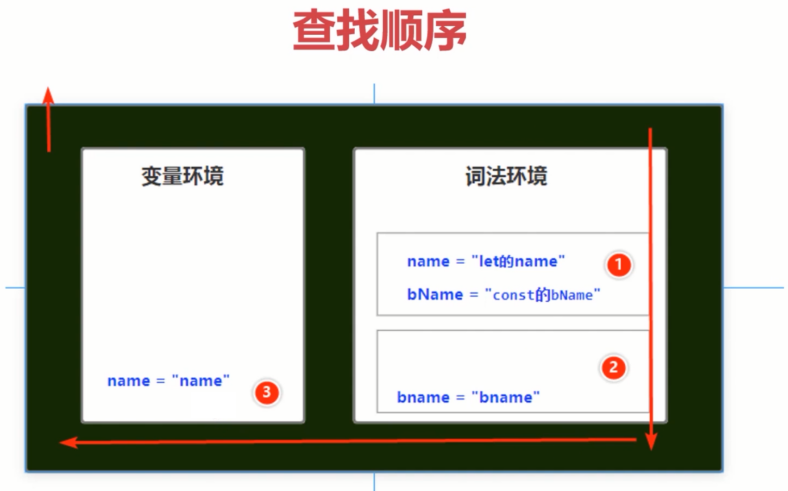
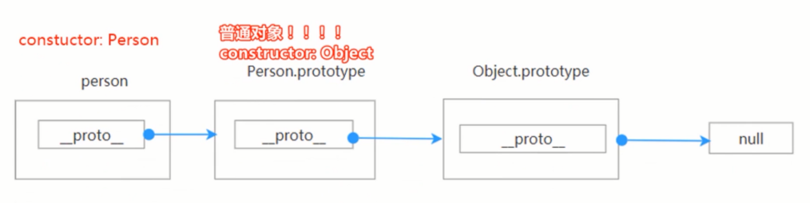
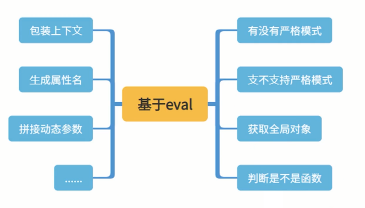

# 从函数到函数式编程之路

函数是一个复杂的东西，还具有函数式编程的概念，其有一些很特点的特性和编程理念，比如动态this，高阶函数，柯里化，反柯里化，尾递归调用，链式调用，动态执行函数等等

## 执行上下文， IIFE, 闭包，作用域，变量提升，暂时性死区重要概念一览

**执行上下文**

- JavaScript 代码被解析和执行时的环境
- 这个是以程序的角度出发的

```ts
var gName = "global的name";

function getName() {
    var name = "name";
    let bName = "bName"
    {
        let name = "let的name"
        const bName = "const的bName"
        console.log("name:", name, ",", "otherName:", bName);
    }
    console.log("name:", name, ",", "otherName:", bName);
    console.log("gName:", gName);
}

getName()
```

上下文有哪些：
- 全局执行上下文
- 函数执行上下文
- eval 函数上下文




**调用栈（执行栈）：**


```ts
function outer(){
    var outerName  = "outerName";
    console.log(outerName);
    inner();
}

function inner(){
    var innerName  = "innerName";
    console.log(innerName);
}

outer()
```

```ts
function sum1(num1) {
    function sum2(num2) {
        debugger
        const r = sum3(num2)
        debugger;
        return r
    }

    function sum3(num3) {
        debugger
        const r = sum4(num3)
        debugger;
        return r
    }

    function sum4(num4) {
        debugger
        const r = sum5(num4)
        debugger;
        return r
    }

    function sum5(num5) {
        debugger
        return num5
    }

    return sum2(num1)
}

sum1(1);
```

```ts
function sum(num) {
    if (num === 1) {
        debugger
        return 1
    }
    return num + sum(num - 1)
}

sum(5)


// 浏览器中执行
sum(10464)

// chrome浏览器中爆栈
// sum(10465)
```

**作用域：**

- 作用域：一个独立的区域，主要的用途就是隔离变量

```ts
var  name = "globalName";
function outer() {
    var outerName = "outerName";
    console.log(outerName);

    function inner() {
        var innerName = "innerName";
        console.log(innerName);
    }

    inner();
}
```


作用域有哪些
- 全局作用域
- 函数作用域
- 块级作用域(ES6)

**作用域链**

作用域链：作用域也可以根据代码层次分层，以便子作用域可以访问父作用域，而不能从副作用域引用自作域中的变量和引用


**执行上下文 VS 作用域：**


**变量提升**

- 变量提升：访问"后"申明的变量

```ts
console.log("num1=", num1);
console.log("num2=", num2);

var num1 = 1;
var num2 = 2;

console.log("num1=", num1);
console.log("num2=", num2);

// ==> 等价于
// var num1;
// var num2;

// console.log("num1=",num1);
// console.log("num2=",num2);
// num1=1;
// num2=2;
```

```ts
console.log("name:", name);

var name = "name";
function name(){
    console.log("name")
}
```

**暂时性死区:**

暂时性死区: let 和 const 变量显式赋值之前不能对变量进行读写，否则就会报错

```ts
var num=1;
{
    num = 2;
    var num;
}
```

**闭包：**

闭包：内部函数访问了上层作用域链中的变量对象。

```ts
var globalScope="全局作用域";

function checkScope() {
    var a=1;
    var b=1;
    console.log("b:",b);
    function returnFun(){
        return a++;
    }
    return returnFun;
}

var test=checkScope();

const a1=test();
console.log("a1:",a1);

const a2=test();
console.log("a2:",a2);

const a3=test();
console.log("a3:",a3);
```

```ts
for (var i = 0; i < 5; ++i) {
    setTimeout(function () {
        console.log(i + ' ');
    }, 100);
}

for (var i = 0; i < 5; ++i) {
    setTimeout(function (i) {
        console.log(i + ' ');
    }, 100, i);
}
```

**IIFE**

IIFE: Immediately-invoked function expression 立即执行函数表达式

```ts
(function(num1,num2){
    console.log(num1+num2);
})(7,9);

(function(num1,num2){
    console.log(num1+num2);
}(7,9));


- function (num1,num2){
    console.log(num1+num2);
}(7,9)
```

```ts
// for(var i=0;i<5;i++){
//     setTimeout(function(){console.log(i)},i*1000);
// }

for (var i = 0; i < 5; i++) {
    setTimeout((function (i) {
        console.log(i)
    }(i)), i * 1000);
}

for (var i = 0; i < 5; i++) {
    setTimeout(console.log, i * 1000,i);
}
```

## name, length，caller等重要却少被关注的属性-

**Function.name**


具名函数：
```ts
function sum(num1,num2) {
    return num1 + num2;
}

console.log("name:",sum.name);
```

匿名函数：

name 值为 空字符串：
```ts
const person = {
    name: "Tom"
};

person.getName = function () {
    return this.name
}

console.log("name:", person.getName.name);
```

name 值为 推断函数名：
```ts
const person = {
    name: "Tom",
    getName: function () {
        return this.name;
    }
};

console.log("name:", person.getName.name);
```

name 值为定义的，不会进行推断：
```ts
const person = {
    name: "tom",
    getName: function getNameMethod() {
        return this.name;
    }
}

console.log("person.getName.name:", person.getName.name);
```

new Function 的 name 值为 anoymous
```ts
const addFn = new Function("num1", "num2", "return num1 + num2");

console.log(addFn(1, 2));

console.log("name:", addFn.name);
```

属性名简写：
- name 为 属性名

```ts
const person = {
    name: "Tom",
    getName() {
        return this.name;
    }
}
console.log("person.getName.name:", person.getName.name);
```

bind 之后的函数名:
- name 值为 'bound' + 函数名

```ts
function sum(num1, num2) {
    console.log("this", this)
    return num1 + num2;
}

const sumBound = sum.bind({a:1}).bind({b:1})
sumBound(1, 2);
console.log("sumBound.name:", sumBound.name);
```

getter 和 setter 函数名
- name 值为 'get' + 函数名 ,'set' + 函数名

```ts
const person = {
    _name: "Tom",
    get name2() {
        return this._name;
    },
    set name2(val) {
        this._name = val;
    }
}

const descriptor = Object.getOwnPropertyDescriptor(person, "name2");
console.log("get.name:", descriptor.get.name);
console.log("set.name:", descriptor.set.name);
```

Symbol 作为函数名:

- 属性值本身有函数名，name 值为函数值本身
- 属性简写，name 值为 [Symbol名]
- 推导函数名，name 值为 [Symbol名]

```ts
const symbolGetName = Symbol("getName");
const symbolGetName2 = Symbol("getName2");
const symbolGetName3 = Symbol("getName3");
const person = {
    name: "Tom",
    [symbolGetName]: function getNameMethod() {
        return this.name;
    },
    [symbolGetName2]() {
        return this.name;
    },
    [symbolGetName3]: function () {
        return this.name;
    },
}

console.log("symbolGetName.name:", person[symbolGetName].name);

console.log("symbolGetName2.name:", person[symbolGetName2].name);

console.log("symbolGetName3.name:", person[symbolGetName3].name);
```

name 的作用：
- 递归
- 调试和跟踪

**Function.length**

Function.length 定义:
- length 是函数对象的一个属性，指该函数有多少个必须要传入的参数，即形参的个数


```ts
function sum(num1, num2) {
    return num1 + num2;
}

console.log("length:", sum.length);
```

不包含剩余参数
```ts
function sum(num1, num2, ...args) {
    console.log("...args:", ...args);
    return num1 + num2;
}

console.log("length:", sum.length);
```

不包含有默认值的参数
```ts
function sum(num1 = 1, num2 = 1) {
    return num1 + num2;
}

console.log("length:", sum.length);
```

仅包含第一个具有默认值之前的参数个数
```ts
function sum(num1, num2 = 1, num3) {
    return num1 + num2 + num3;
}

console.log("length:", sum.length);
```

bind 之后的 length
```ts
function sum(num1, num2, num3) {
    return num1 + num2 + num3;
}

console.log("sum.length", sum.length);

const boundSum0 = sum.bind(null);
console.log("boundSum0.length:", boundSum0.length);

const boundSum1 = sum.bind(null, 1);
console.log("boundSum1.length:", boundSum1.length);

const boundSum2 = sum.bind(null, 1, 2);
console.log("boundSum2.length:", boundSum2.length);

const boundSum3 = sum.bind(null, 1, 2, 3);
console.log("boundSum3.length:", boundSum3.length);

const boundSum4 = sum.bind(null, 1, 2, 3, 4);
console.log("boundSum4.length:", boundSum4.length);
```

与 arguments.length 的区别:
1. arguments.length 是实际参数长度
2. Function.length 是形参的长度

```ts
function sum(num1, num2) {
    console.log("arguments.length:", arguments.length);
    return num1 + num2;
}

console.log("length:", sum.length);

sum(1, 2, 3, 4);
```

```ts
function sum(num1, num2, ...args) {
    console.log("...args:", ...args);
    return num1 + num2;
}

console.log("length:", sum.length);
```

参数有默认值情况
- 全部有默认值，Function.length 为 0
- 非全部包含默认值，Function.length 等于第一个具有默认值之前的参数个数

bind 之后 length
- Function.length = 函数的 length 0 bind 的参数个数
- 最小值为 0 

Function.length 用途：
- 柯里化

**Function caller**

- 该特性为非标准，尽量不要在生产环境使用
- 定义：返回调用指定函数的函数
- 全局作用域内被调用，返回 null
- 函数内部作用域调用，指向调用它的那个函数

严格模式下：
- caller、callee、arguments 属性都不可用

Function caller 用途：
- 调用栈信息收集
- 调用环境检查

```ts
function sum(num1, num2) {
    console.log("caller:", sum.caller);
    return num1 + num2;
}

sum(1, 2);

function doSum() {
    sum(1, 2)
}

doSum();
```

caller node
```ts
function sum(num1, num2) {
    console.log("caller:", sum.caller.toString);
    return num1 + num2;
}

sum(1, 2);

function doSum() {
    sum(1, 2)
}

doSum();
```

严格模式 浏览器执行 caller
```ts
function sum(num1, num2) {
    "use strict";
    console.log("caller:", sum.caller.toString());
    return num1 + num2;
};

sum(1, 2);
```

caller 的用途调用栈
```ts
function getStack(fn) {
    const stacks = [];
    let caller = fn.caller;
    while (caller) {
        stacks.unshift(caller.name);
        caller = caller.caller;
    }
    return stacks;
}

function a() {
    console.log("a")
    const stacks = getStack(a);
    console.log("stacks:", stacks);
}

function b() {
    a();
    console.log("b");
}


function c() {
    b();
    console.log("c")
}

c();
```

caller 检查调用环境
```ts
function getCaller(fun) {
    const caller = fun.caller;
    if (caller == null) {
        console.log("caller is global context");
    } else {
        console.log("caller.name:" + caller);
    }
    return fun.caller
}

function add() {
    getCaller(add)
}

add();
```

arguments.callee
- 包含正在执行的函数
- 严格模式禁止使用

起源：
- 匿名函数递归问题

```ts
function sumTotal(n) {
    if (n == 1) return 1;
    return sumTotal(n - 1) + n;
};

console.log([5, 10, 20].map(sumTotal));

// [5, 10, 20].map(function (n) {
//     if (n == 1) return 1;
//     return /*这里写什么呢？没有方法名*/(n - 1) + n;
// })


const result=[5, 10, 20].map(function (n) {
    if (n == 1) return 1;
    return arguments.callee(n - 1) + n;
});

console.log("arguments.callee:",result);
```

注意：
- 递归调用以后会获取到不同的 this 值

```ts
var global = this;

var test = function (recursed) {
    console.log("this:", this);
    if (!recursed) { return arguments.callee(true); }
    if (this !== global) {
        console.log("This is: " + this);
    } else {
        console.log("This is the global");
    }
}

test();
```

## 函数的this之全解析


**this 是什么**
- 执行上下文 (global、function 或 eval) 的一个属性
- 在非严格模式下，总是指向一个对象
- 在严格模式下，可以是任意值

this 绑定规则：
- 默认绑定
- 隐式绑定
- 显示绑定
- new
- 箭头函数

默认绑定：

非严格模式：
- 浏览器：this 指向 window
- nodejs：this 指向 global 对象

浏览器：
```ts
var name = "哈士奇";
function getName() {
	console.log("this:", this)
	return this.name;
}
console.log("name:", getName());
```

nodejs：
```ts
var name = "哈士奇";
function getName(){
    console.log("this:", this === global,  this)
  	return this.name;
}
console.log("name:",getName());

console.log("this:", this)
```

严格模式：
- 浏览器：undefined
- nodejs：undefined

浏览器；
```ts
"use strict"
var name = "哈士奇";
function getName() {
	console.log("this:", this)
	return this.name;
}
console.log("name:", getName());
```

nodejs:
```ts
"use strict"
var name = "哈士奇";
function getName(){
    console.log("this:", this === global, this)
  	return this.name;
}

console.log("this:", this)
console.log("name:",getName());
```

隐式绑定：

- 作为某个对象的属性被调用的时候

```ts
var name = "哈士奇";
function getName(){
    console.log("this:", this)
  	return this.name;
}

var person = {
	name: "person的name",
  getName
};

console.log("name:", person.getName());
```

```ts
var name = "哈士奇";
function getName(){
    console.log("this:", this)
  	return this.name;
}
var person1 = {
	name: "person1的name",
  getName
};
var person2 = {
	name: "person2的name",
  getName
};

console.log(person1.getName());
console.log(person2.getName())
```

多级的情况：

```ts
var name = "哈士奇";
function getName(){
    console.log("this:", this)
  	return this.name;
}
const person1 = {
	name: "person1的name",
  getName,
  person2: {
  	name: "person2的name",
    getName
  }
}

console.log(person1.getName());
console.log(person1.person2.getName());
```

一些神秘隐式绑定：

- EventTagert、FileReader 等等

```html
<button id="btn" type="button">按钮</button>

<script>
    btn.addEventListener("click", function () {
        console.log("this:btn", this);   // btn
    });


    var request = new XMLHttpRequest();
    request.open("GET", "./");
    request.send();
    request.onloadend = function () {
        console.log("this:XMLHttpRequest", this)  // XMLHttpRequest
    }
</script>
```

显示绑定：

显示表达谁该是 this


call:
```ts
var obj = { name: "张三" };

function logName() {
    console.log(this.name, this)
}
logName.call(obj);
```

apply：
```ts
var obj = { name: "张三" };

function logName() {
    console.log(this.name, this)
}
logName.apply(obj);
```

bind：
```ts
var obj = { name: "张三" };

function logName() {
    console.log(this.name, this)
}
var bindLogName = logName.bind(obj);

bindLogName();
```

多次 bind：
```ts
var person1 = {
	name: "name1"
};
var person2 = {
	name: "name2"
}

function getName(){
	return this.name
}

console.log(getName.bind(person1).bind(person2)());
```

bind + 参数:
```ts
function add(num1, num2, num3, num4){
	return num1 + num2 + num3 +num4
} 

const add2 = add.bind(null, 10,20);

console.log(add2(30,40) ) // 100
```

```ts
var name = "全局的name";
function getName(){
  return this.name
}

const log = console.log;
log(getName.call(null));
log(getName.call(undefined));

log(getName.call({name: "name"}));
```

绑定符：
```ts
function logName() {
    console.log(this.name, this)
}

({name:"123"})::logName();
```

```ts
// 连续使用
function getPerson(){
	return this.person
}

function getName(){
  return this.name
}

var obj = {
	person: {
  	name: "Tom",
  }
}

obj::getPerson()::getName()
```

**new：**

- 实例化一个函数或者 ES6 的class
- 对于 Function, return 会影响返回值

```ts
function Person(name) {
    this.name = name;

    this.getName = function () {
        return this.name;
    }
}

var person = new Person("二哈");
console.log(person.getName())
```

new return:
- return 非对象，实际返回系统内部的对象
- return 对象，实际返回该对象

```ts
function MyObject() {
    this.name = "myObject";
}

function MyObject2() {
    this.name = "myObject";
    return {
        name: 'myObject2'
    }
}

function MyObject3() {
    this.name = "myObject3";
    return undefined;
}


console.log(new MyObject());
console.log(new MyObject2());
console.log(new MyObject3());
```

`new 解密：`
- 创建一个空对象
- 设置空对象的原型
- 执行构造函数方法，把相关的属性和方法添加对象上
- 返回对象。如果构造函数返回的值是对象类型，就直接返回该对象，反之返回第一步创建的对象

```ts
const slice = Array.prototype.slice;
function newObject(constructor) {
    var args = slice.call(arguments, 1);
    var obj = {};  // 1
    obj.__proto__ = constructor.prototype  // 2
    var res = constructor.apply(obj, args);  //3
    return res instanceof Object ? res : obj; //4
}


function Person(name){
    this.name = name;
}

function Person2(name){
    this.name = name;
    return {
        name: "超级帅哥"
    }
}

var person = newObject(Person, "帅哥");
var person2 = newObject(Person2, "帅哥");
console.log(person.name);
console.log(person2.name);
```

**arrow function:**

- 简单
- 没有自己的 this，arguments、super、new.target
- 适合需要匿名函数的地方
- 不能用于构造函数

```ts
var log = console.log

var name = "全局的name";
var getName = () => this.name;
log(getName());

var person = {
    name: "person的name",
    getName: () => this.name
}
log(person.getName());

var person2 = {
    name: "person2的name",
    getPerson() {
        return {
            getName: () => this.name
        }
    }
}
log(person2.getPerson().getName());
```

嵌套：
```ts
class Person {

    constructor(name) {
        this.name = name;
    }

    getName() {
        return {
            getName2: () => ({
                getName3: () => ({
                    getName4: () => this.name
                })
            })
        }
    }
}

var log = console.log;
var p = new Person("person的name");
log(p.getName().getName2().getName3().getName4());
// person的name
```

使用 call 改变：
```ts
var name = "global.name";
var person = {
  name: "person.name",
  getName() {
    return () => this.name;
  }
}

var log = console.log;

log(person.getName()());

log(person.getName.call({ name: "name" })())
```

this 绑定优先级：


练习题：
```ts
var name = "window";
var obj = { name: "张三" };

function logName() {
    console.log(this.name)
}

function logName2() {
    "use strict"
    console.log(this.name)
}

var person = {
    name: "person",
    logName,
    logName2: () => logName()
}

logName();
person.logName();
person.logName2();
logName.bind(obj)();
logName2()
```

练习题2：
```ts
// 浏览器
var name = "window";
var obj = { name: "张三" };

function logName() {
    console.log(this.name)
}

var person = { name: "person", logName };

// 升级版本
(person.logName)();
(1, person.logName)()
(false || person.logName)() 
```

锁定 this 的方式：
- bind
- 箭头函数

思考：
- 被显示绑定后，能不能解除绑定

## 神奇的call.call, call.call.call

```ts
function a() {
    console.log(this, 'a')
};
function b() {
    console.log(this, 'b')
}

a.call(b);
```

小试牛刀：
```ts
function a() {
    console.log(this, 'a')
};
function b() {
    console.log(this, 'b')
}

a.call(b);
a.call.call(b, 'b')
```

升级：
```ts
function a() {
    console.log(this, typeof this, 'a')
};
function b() {
    console.log(this, typeof this,'b')
}
a.call.call(b, 'b')
a.call.call.call(b, 'b')
a.call.call.call.call(b, 'b')
```

三个疑问：
- 为什么被调用的是 b函数
- 为什么 this 是 String {"b"}
- 为什么 2,3,4 个 call 的结果一样

call 和 this 简单回顾：
- call：使用一个指定的 this 值和单独给出的一个或多个参数来调用一个函数
- this：执行上下文的一个变量
- this：另一种不严谨的说法：`this 指向调用者`

call 的一种虚拟语法：
- fun.call(obj, ..args) === ( obj.fun = fun; obj.fun(...args) )

为什么 2,3,4 个 call 的结果一样
- a.call(b): a 被调用
- a.call.call(b): a.call 被调用
- a.call.call.call(b): a.call.call 被调用

```ts
a.call === Function.prototype.call // true
a.call === a.call.call // true
a.call === a.call.call.call // true
```

call 调用者：
```ts
function getName(){
	return this.name;
}

var obj = {
	name: 'name'
}

getName.call(obj);

// 等同于
obj.getName = getName;
obj.getName();
```

call.call.call
```ts
function a() {
    console.log(this, 'a')
};
function b() {
    console.log(this, 'b')
}

var log = console.log;

log(a.call === Function.prototype.call);
log(a.call === a.call.call);
log(a.call === a.call.call.call);
```

为什么调用的是 b 函数？
```ts
function a() {
    console.log(this, 'a')
};
function b() {
    console.log(this, 'b')
}

// (a.call).call(b, 'b')

// 公式：fun.call(obj, ...args)  ===  (  obj.fun = fun; obj.fun(...args) )
// 1. 一个函数进行call调用，等同于在一个对象上执行该函数
// 等于在b对象上调用 a.call函数
// 2. a.call === Function.prototype.call
var call = Function.prototype.call;

// (a.call).call(b, 'b')
// call === a.call === Function.prototype.call;
// 等同于 在b调用call函数
b.fn = call;
b.fn('b');
b.call('b')
```

为什么 this 是 String {"b"}
- this 非严格模式下，Object 包装
- this 严格模式下，任意值。（传啥是啥）

```ts
"use strict"
function a() {
    console.log(this, 'a')
};
function b() {
    console.log(this, 'b')
}

// (a.call).call(b, 'b')

// 公式：fun.call(obj, ...args)  ===  (  obj.fun = fun; obj.fun(...args) )
// 1. 一个函数进行call调用，等同于在一个对象上执行该函数
// 等于在b对象上调用 a.call函数
// 2. a.call === Function.prototype.call
var call = Function.prototype.call;

// (a.call).call(b, 'b')
// call === a.call === Function.prototype.call;
// 等同于 在b调用call函数
b.fn = call;
b.fn('b');
b.call('b')
```

万能的函数调用方法:
```ts
var call = Function.prototype.call.call.bind(Function.prototype.call);

var person = {
    hello() {
        console.log('hello', this.name)
    }
}

call(person.hello, { "name": "tom" })
```

小结：
- call 简单吗
- 复杂的都是简单的集合体

## 纯函数，副作用，高阶函数等函数式编程概念

编程范式：面向过程编程
- 特点：主要采取过程调用或者函数调用的方式来进行流程控制。流程则由包含一系列运算步骤的过程，子程序，方法或者函数来控制。
- 代表：C语言等

编程范式：面向对象编程
- 特点：它将对象作为程序的基本单元，将程序和数据封装其中，以提高软件的重用性、灵活性和扩展性，对象里的程序可以访问及经常修改对象相关连的数据。在面向对象程序编程里，计算机程序会被设计成彼此相关的对象。
- 代表：Python、C++、Java、C#语言等

编程范式：函数式编程
- 特点：函数式编程更加强调程序执行的结果而非执行的过程，倡导利用若干简单的执行单元让计算结果不断渐进，逐层推导复杂的运算，而不是设计一个复杂的执行过程。
- 代表：haskell、Scala等

函数式编程的优点：


**纯函数：**

- 定义：纯函数就是相同的输入，永远得到相同的输出，并且没有任何副作用。
- `同入同出`
- `无副作用`

```ts
// 依赖了 a ，所以不是纯函数
var a = 1;

function sum(num1, num2) {
    return num1 + num2 + a;
}

console.log("a=1:", sum(1, 2));
a = 3;
console.log("a=2:", sum(1, 2));
```

案例：
- 普通的例子
- 数组
- redux 中的 reducer 准则就是要纯函数

数组：
```ts
var arr = [1, 2, 3];

const log = console.log;

// 纯
log(arr.slice(0), arr);
log(arr.slice(0), arr);

// 不纯
log(arr.splice(0), arr);
log(arr.splice(0), arr)
```

```ts
// 副作用：修改了变量
var rate = 1;
function sum(sum1, sum2) {
    rate = 2;
    return sum1 + sum2
}

var log = console.log;
log("rate:", rate);
sum(1, 2);
log("rate:", rate);
```

```ts
// 副作用：修改了入参
function getName(obj) {
    obj.age = 10;
    return obj.name
}

var obj = {
    name: "obj的name",
    age: 20
}

var log = console.log
log("age:", obj.age);
getName(obj)
log("age:", obj.age);
```

纯函数的有点：


函数的副作用：
- 定义：函数调用时，除了返回函数值之外，还对外界产生附加的影响。

副作用包含那些：
- 修改了变量
- 修改了入参
- 输出了日志
- 操作了 DOM
- 发了 HTTP 请求
- 操作了客户端存储
- 与 service worker，iframe 通讯
- 其他不该做的事情

**高阶函数**

- 定义：就是一个接受函数作为参数或者函数作为输出返回的函数
- 特征：函数入参，函数作为返回值，满足任一条件即可

数组中用到的高阶函数
- Array.prototype.filter
- Array.prototype.find
- Array.prototype.map

高阶函数的应用：
- 柯里化
- Function.prototype.bind

高阶函数衍生 - 高阶组件
- 定义：包装了另一个组件的组件

```ts
function PropsHOC(WrappedComponent) {
    return class extends React.Component {
        render() {
            return <WrappedComponent {...this.props} />
        }
    }
}
```

其他函数式编程的概念：
- compose（组合）、pipe （管道）
- 偏函数、柯里化
- chain 链式调用

思考：幂等性和纯函数的相似和区别

## 深入浅出原型链

```ts
function A(){}
A.__proto__.__proto__.__proto__
```

原型是"借"来的
- 原型不是 JavaScript 首创
- 借鉴 Self 语言，基于原型(prototype)的实现继承机制

原型解决了什么问题
- 共享数据，减少空间使用，节省内存
- 实现继承

原型三件套：
- prototype
- constructor
- `__proto__`

prototype
- 无处不在

```ts
var obj = {};

console.log(obj.toString());

// toString 方法是不是来自原型
console.log(obj.toString === Object.prototype.toString);

console.log(obj instanceof Object)
```

constructor:
- 实例的构造函数

```ts
var obj = {};

console.log(obj.constructor === Object);
```

`__proto__`

- `__proto__`: `__proto__` 属性是一个访问器属性(一个getter函数和一个 setter 函数)，暴露了通过它访问的对象的内部`[[Prototype]](一个对象或null)`
- 构造函数的原型 prototype
- 推荐使用：Object.getPrototypeOf 

```ts
var des = Object.getOwnPropertyDescriptor(Object.prototype, "__proto__");

console.log(des);

// __proto__ 构造函数的原型
var obj = {};
console.log(obj.__proto__ === obj.constructor.prototype)

// Object.getPrototypeOf 替代
console.log(Object.getPrototypeOf(obj) === obj.__proto__)
```

谁都有谁

- prototype 属性本质是一个普通对象
- 普通对象有 `__proto__` 属性
- 普通函数或者class既有 prototype 属性，也有 `__proto__` 属性

prototype、constructor、`__proto__` 小结：


原型链：

```ts
function Person(name, age){
	this.name = name;
  this.age = age;
}

Person.prototype.getName = function(){
	return this.name;
}

Person.prototype.getAge = function (){
	return this.age
}

var person = new Person();
console.log(person.toString());
```



原型链的尽头：

- 原型链的尽头都是 null ： Object.prototype.__proto__ === null

```ts
function Person(name, age) {
    this.name = name;
    this.age = age;
}
Person.prototype.getName = function () {
    return this.name;
}
Person.prototype.getAge = function () {
    return this.age
}

var person = new Person();

var log = console.log;
log(person.__proto__ ===  Person.prototype);
log(Person.prototype.__proto__ ===  Object.prototype);
log(Object.prototype.__proto__ ===  null);
```

万能始祖：


总结：


趣味原型链：
- 普通对象的二次 `__proto__` 是 null
- 普通函数的三次 `__proto__` 是 null
- 如果是经历过 n 次显式继承，被实例的普通对象，n + 3 层的  `__proto__` 是 null

```ts
var obj = {};

var log = console.log;

log(obj.__proto__.__proto__)
```

```ts
function a (){}
function A(){}

var log = console.log;

log(a.__proto__.__proto__ .__proto__);
log((new A()).__proto__.__proto__ .__proto__);
```

```ts
function Grandpa(){}

function Parent(){}
Parent.prototype = new Grandpa();

function Child(){}
Child.prototype = new Parent()

var child = new Child()

var log = console.log;
//  2 + 3
log(child.__proto__.__proto__.__proto__.__proto__.__proto__)
```

```ts
class Grandpa {}
class Parent extends Grandpa{}
class Child extends Parent{};
var child = new Child()

var log = console.log;
//  2 + 3
log(child.__proto__.__proto__.__proto__.__proto__.__proto__)
```

纯净对象：

- 就是干干净净的对象，没有原型。
- 怎么创建 Object.create(null)

优点：
- 空间上，少了原型链上的信息，必然节约空间
- 时间上，没有原型链，查找一步到位

```ts
var obj = Object.create(null);
console.log(obj.__proto__); // undefined
console.log(obj.toString); // undefined

for(var p in obj) {
    console.log(p)
}
```

## 组合和继承，谁与争锋

组合（has-a 关系）

- 在一个类/对象内使用其他的类/对象
- has-a： 包含关系，体现的是`整体和部分`的思想
- `黑盒复用`：对象的内部细节不可见，知道怎么使用就可以了

```ts
class Logger {
    log() {
        console.log(...arguments);
    }
    error() {
        console.error(...arguments);
    }
}

class Reporter {
    constructor(logger) {
        this.logger = logger || new Logger();
    }
    report() {
        // TODO:
        this.logger.log("report");
    }
}

var reporter = new Reporter();
reporter.report()
```

组合的优点：


组合的缺点：
- 使用上相比继承，更加复杂一些
- 容易产生过多的类/对象

继承(is-a 关系)

- 继承是 is-a 的关系，比如人事动物
- 白盒复用：你需要了解父类的实现细节，从而决定怎么重写父类的方法

优点：
- 初始化简单，子类自动具备父类的能力
- 无需显式初始化父类

继承的缺点：
- 继承层级多，会导致代码混乱，可读性变差
- 耦合紧
- 扩展性相对比组合较差

```ts
class Logger {
    log() {
        console.log(...arguments);
    }
    error() {
        console.error(...arguments);
    }
}

class Reporter extends Logger {

    report() {
        // TODO:
        this.log("report");
    }
}

var reporter = new Reporter();
reporter.report()
```

组合和继承的最终目的：
- 当前是逻辑复用，代码复用

多态：

- 事物在运行过程中存在不同的状态


```ts
class Animal {
    eat(){
        console.log("Animal is eating")
    }
}

class Person extends Animal {
    eat(){
        console.log("Person is eating")
    }
}

var animal: Animal = new Animal();
animal.eat()

var person: Animal = new Person();
person.eat()
```

何时使用谁：
- 有多态的需求的时候，考虑使用继承
- 如果有多重继承的需求，考虑使用组合
- 既有多态又有
多重继承，考虑使用继承+组合


继承组合继承：

```ts
function Animal(options) {
    this.age = options.age || 0;
    this.sex = options.sex || 1;
    this.testProperties = [1, 2, 3]
}

Animal.prototype.eat = function (something) {
    console.log("eat:", something);
}

function Person(options) {
    // 初始化父类, 独立各自的属性
    Animal.call(this, options);
    this.name = options.name || "";
}

// 设置原型
Person.prototype = Object.create(Animal.prototype);
// 修复构造函数
Person.prototype.constructor = Person;

Person.prototype.eat = function eat(something) {
    console.log(this.name, ":is eating", something)
}
Person.prototype.walk = function walk() {
    console.log(this.name, ":is waking")
}

var person = new Person({ sex: 1, age: 18, name: "小红" });
person.eat("大米");
person.walk();

person.testProperties.push("4")

var person2 = new Person({ sex: 1, age: 18, name: "小红" });
console.log(person2.testProperties)
```

寄生组合继承解决了什么问题
- 各个实例的属性独立，不会发生修改一个实例，影响另外一个实例
- 实例化过程中没有多余的函数调用
- 原型上的 constructor 属性指向正确的构造函数

继承的一种变体：

- mixin：混入
- 把属性拷贝到原型，让其实例也有响应的属性

**mixin:**

```ts
class Logger {
    log() {
        console.log("Logger::", ...arguments);
    }
}

class Animal {
    eat() {
        console.log("Animal:: is eating",);
    }
}

class Person extends Animal {

    walk() {
        console.log("Person:: is walking",);
    }
}

const whiteList = ["constructor"]
function mixin(targetProto, sourceProto) {
    const keys = Object.getOwnPropertyNames(sourceProto);
    keys.forEach(k => {
        if (whiteList.indexOf(k) <= 0) {
            targetProto[k] = sourceProto[k];
        }
    })
}

mixin(Person.prototype, Logger.prototype)

console.log(Person.prototype);
var person = new Person();
person.log("log test")
```

ES6 继承：
- extends 关键字
- super 访问父类

```ts
class Animal {
    constructor(options) {
        this.age = options.age || 0;
        this.sex = options.sex || 1;
    }

    eat(something) {
        console.log("eat:", something);
    }
}

class Person extends Animal {

    // 私有变量
    #friends = [];

    constructor(options) {
        super(options);
        this.name = options.name || name;
    }
    eat(something) {
        console.log(this.name, "eat:", something);
    }
    run() {
        return `${this.name}正在跑步`;
    };

    say = () => {
        console.log("say==", say);
    }
}

var p1 = new Person({name: "张三"});
console.log("name:", p1.name);
p1.eat("鲍鱼")
// console.log("p1.friends:", p1.friends, p1.#friends)
console.log(Object.getOwnPropertyNames(p1.__proto__));
```

```ts
class Animal{
    constructor(){
        this.name = "animal"
    }

    eat(){
        console.log("eat");
    }

    get gname(){
        return  "getter name"
    }
}
Animal.prototype.name = "prototype的name";

class Person extends Animal{
}

var person = new Person();
console.log(person.name);
console.log(person.gname);
console.log(person.__proto__.eat);
console.log(person.__proto__.name);
```

ES6 继承注意点
- 构造函数 this 使用前，必须先调用 super 方法
- 注意箭头函数形式的属性
- class 若是想在原型上添加非函数的属性，还得依赖 prototype


## 柯里化：整体到部分。反柯里化呢？

**柯里化**

- 柯里化: 柯里化是将一个 N 元函数转换为 N 个一元函数，它持续的返回一个新的函数，直到所有的参数用尽为止，然后柯里化链中最后一个函数被返回并且执行时，才会全部执行。
- 元：指的是函数参数的数量
- 一句话：柯里化其实就是一种函数转换，多元函数转换为一元函数

简单的例子：
```ts
function calcSum(num1, num2, num3) {
    return num1 + num2 + num3;
}

function curryCalcSum(num1) {
    return function (num2) {
        return function (num3) {
            return num1 + num2 + num3;
        }
    }
}

console.log("calcSum:", calcSum(3, 4, 5));
console.log("curryCalcSum:", curryCalcSum(3)(4)(5));
```

实现通用柯里化：
- 接受一个需要柯里化的方法
- 存放每次函数调用的参数
- 参数数目不够原函数参数数目，不调用原函数，返回新的函数继续接受下一个参数。返回调用函数

智能版本：

- 缺点：参数有默认值时运行有问题

```ts
var slice = Array.prototype.slice;
var curry = function (fn) {
    var args = slice.call(arguments, 1)
    return _curry.apply(this, [fn, fn.length].concat(args))
};

function _curry(fn, len) {
    var oArgs = slice.call(arguments, 2);
    return function () {
        var args = oArgs.concat(slice.call(arguments));
        if (args.length >= len) {
            return fn.apply(this, args);
        } else {
            return _curry.apply(this, [fn, len].concat(args))
        }
    }
}


//使用
function calcSum(num1, num2 = 2, num3) {
    return num1 + num2 + num3;
}
const calcSumCurry = curry(calcSum, 3);

const log = console.log;
log(calcSumCurry(4, 5));
log(calcSumCurry(4)(5));
```

手动+智能版本：
- 手动制定 参数个数

```ts
var slice = Array.prototype.slice;
var curry = function (fn, length) {
    var args = slice.call(arguments, 2)
    return _curry.apply(this, [fn, length || fn.length].concat(args))
};

function _curry(fn, len) {
    var oArgs = slice.call(arguments, 2);
    return function () {
        var args = oArgs.concat(slice.call(arguments));
        if (args.length >= len) {
            return fn.apply(this, args);
        } else {
            return _curry.apply(this, [fn, len].concat(args))
        }
    }
}

//使用
function calcSum() {
    return [...arguments].reduce((pre, value, index) => { return pre + value }, 0);
}

const calcSumCurry = curry(calcSum, 3, 3);

console.log(calcSumCurry(4,5));
console.log(calcSumCurry(4)(5));
```

占位符版本：


柯里化实现 - 问题：
```ts
var slice = Array.prototype.slice;
var curry = function (fn, length) {
    var args = slice.call(arguments, 2)
    return _curry.apply(this, [fn, length || fn.length].concat(args))
};

function _curry(fn, len) {
    var oArgs = slice.call(arguments, 2);
    return function () {
        var args = slice.call(arguments).concat(oArgs);
        if (args.length >= len) {
            return fn.apply(this, args);
        } else {
            return _curry.apply(this, [fn, len].concat(args))
        }
    }
}

//使用
function calcSum() {
    return [...arguments].reduce((pre, value, index) => { return pre + value }, 0);
}
const calcSumCurry = curry(calcSum, 3, 3);
console.log(calcSumCurry(4,5));
// 参数多传递
console.log(calcSumCurry(4,5)(6));
```

柯里化的变体：
```ts
function curry(fn) {
    const curArgs = [];
    return function () {
        if (arguments.length === 0) {
            return fn.apply(this, curArgs);
        }
        Array.prototype.push.apply(curArgs, [].slice.call(arguments));
        return arguments.callee;
    }
};
function calcSum() {
    return [...arguments].reduce((pre, value, index) => { return pre + value }, 0);
}
const fn = curry(calcSum);
console.log("执行添加:", fn(2, 3)(5)(8)());
// console.log("手动调用:", fn())
```

```ts
var slice = Array.prototype.slice;
var curry = function (fn, length) {
    var args = slice.call(arguments, 2)
    return _curry.apply(this, [fn, length || fn.length].concat(args))
};

function _curry(fn, len) {
    var oArgs = slice.call(arguments, 2);
    return function () {
        var args = oArgs.concat(slice.call(arguments));
        if (arguments.length === 0) {
            if (args.length >= len) {
                return fn.apply(this, args);
            }
            return console.warn("curry:参数长度不足",);
        } else {
            return _curry.apply(this, [fn, len].concat(args))
        }
    }
}

function calcSum() {
    return [...arguments].reduce((pre, value, index) => { return pre + value }, 0);
}

const fn = curry(calcSum, 5);
console.log("执行添加:", fn(2, 3)(5)());
console.log("手动调用:", fn())
```

变体改进：主动调用版本


柯里化的作用：
- 参数复用，逻辑复用
- 延迟计算/执行

```ts
var slice = Array.prototype.slice;
var curry = function (fn, length) {
    var args = slice.call(arguments, 2)
    return _curry.apply(this, [fn, length || fn.length].concat(args))
};

function _curry(fn, len) {
    var oArgs = slice.call(arguments, 2);
    return function () {
        var args = oArgs.concat(slice.call(arguments));
        if (args.length >= len) {
            return fn.apply(this, args);
        } else {
            return _curry.apply(this, [fn, len].concat(args))
        }
    }
}


function log(logLevel, msg) {
    console.log(`${logLevel}:${msg}:::${Date.now()}`)
}

//柯里化log 方法
const curryLog = curry(log);

const debugLog = curryLog("debug");

const errLog = curryLog("error");

//复用参数debug
debugLog("testDebug1");
debugLog("testDebug2");

//复用参数error
errLog("testError1");
errLog("testError2");
```

**偏函数**

- 偏函数就是固定一部分参数，然后产生更小单元的函数
- 简单理解就是：分为两次传递参数

```ts
function calcSum(num1, num2, num3) {
    return num1 + num2 + num3;
}

function curryCalcSum(num1) {
    return function (num2, num3) {
        return num1 + num2 + num3;
    }
}

const pCalcSum = curryCalcSum(10);

console.log(pCalcSum(11, 12));

console.log(pCalcSum(15, 20));

console.log(pCalcSum(22, 30));
```

通用偏函数：
```ts
function partial(fn) {
    const args = [].slice.call(arguments, 1);
    return function () {
        const newArgs = args.concat([].slice.call(arguments));
        return fn.apply(this, newArgs);
    };
};


function calcSum(num1, num2, num3) {
    return num1 + num2 + num3;
}
const pCalcSum = partial(calcSum, 10);

console.log(pCalcSum(11, 12));
```

偏函数与柯里化的区别：
- 柯里化是将一个多参数转换为单参数的函数，将一个 N 元函数转换为 N 个一元函数
- 偏函数是固定一部分参数（一个或者多个参数），将一个 N 元函数转换成一个 N-X 函数

**反柯里化**

- 一句话就是：非我之物，为我所用。是一种拿来主义。
- 反柯里化的作用就是扩大适应性，使原来作为特定对象所拥有的功能的函数可以被任意对象所用。

基础版本：
```ts
function unCurry(fn) {
    return function (context) {
        return fn.apply(context, Array.prototype.slice.call(arguments, 1));
    }
}

// 不使用反柯里化
Object.prototype.toString.call({});

// 反柯里化
const toString = unCurry(Object.prototype.toString);
toString({});
toString(() => { });
toString(1);
```

其他版本：


```ts
// 高级版：
Function.prototype.unCurry = function () {
    var self = this;
    return function () {
        return Function.prototype.call.apply(self, arguments);
    }
}

Function.prototype.unCurry = function () {
    return this.call.bind(this);
};

Function.prototype.unCurry = function () {
    return (...args) => this.call(...args)
};
```

反柯里化使用场景：
- 借用数组方法
- 复制数组
- 发生事件

```ts
Function.prototype.unCurry = function () {
    const self = this
    return function () {
        return Function.prototype.call.apply(self, arguments)
    }
}


const push = Array.prototype.push.unCurry();
const arr = [1, 2, 3];
const obj = {};
push(obj, 4, 5, 6);
console.log(obj);
```

```ts
Function.prototype.unCurry = function () {
    const self = this
    return function () {
        return Function.prototype.call.apply(self, arguments)
    }
}

const clone = Array.prototype.slice.unCurry();

var a = [1, 2, 3];

var b = clone(a);

console.log("a==b:", a === b);
console.log(a, b);
```

```ts
Function.prototype.unCurry = function () {
    const self = this
    return function () {
        return Function.prototype.call.apply(self, arguments)
    }
}

const dispatch = EventTarget.prototype.dispatchEvent.unCurry();

window.addEventListener("event-x", (ev) => {
    console.log("event-x", ev.detail);  // event-x ok
})

dispatch(window, new CustomEvent("event-x", { detail: "ok" }));
```


## 链式调用的本质

熟知的案例：
- 大名鼎鼎的 jQuery
- 太不见低头见的数组
- ES6 异步大杀器 Promise
- EventEmitter

```ts
$(".testNode")
    .css('color','red')
    .show(200)
    .removeClass('class1');
```

```ts
[1,2,3,4]
    .filter(filterFn)
    .map(mapFn)
    .join("")
```

```ts
fetch(url)
    .then(res => res.json())
    .then(result => { })
    .then(result => { })
```

```ts
const EventEmitter = require("events");
const emitter = new EventEmitter();

emitter.on("message", function () {
    console.log("message")
}).on("message1", function () {
    console.log("message1")
})

emitter.emit("message");
emitter.emit("message1");
```

链式调用的本质
- 返回对象本身
- 返回通类型的实例对象

其他的优秀案例
- 2万多star 的 Rxjs
- 5万多star 的 lodash
- 9万多star 的 axios

链式调用的优点：
- 可读性强，语义好理解
- 代码简介
- 易维护

缺点：
- 程序员能力要求高
- 调试起来不方便
- 消耗大

适用场景：
- 需要多次计算或者赋值
- 逻辑上有特定的顺序
- 相似业务的集中处理

手写计算器：

- 第一种写法：返回本身
- 第二种写法：返回通类型对象实例
- 其他方案：compose 或者 pipe

第一种：
```ts
class Calculator {
    constructor(val) {
        this.val = val;
    }

    double() {
        this.val = this.val * 2;
        return this
    }

    add(num) {
        this.val = this.val + num;
        return this
    }

    minus(num) {
        this.val = this.val - num;
        return this
    }

    multi(num) {
        this.val = this.val * num;
        return this
    }

    divide(num) {
        this.val = this.val / num;
        return this
    }

    pow(num) {
        this.val = Math.pow(this.val, num);
        return this
    }

    // ES5 getter, 表现得像个属性，实则是一个方法
    get value() {
        return this.val;
    }
}

const cal = new Calculator(10);

const val = cal.add(10) // 20
    .minus(5) // 15
    .double() // 30
    .multi(10) // 300
    .divide(2) // 150
    .pow(2)   // 22500
    .value;
console.log(val); // 22500
```

第二种：
```ts
class Calculator {
    constructor(val) {
        this.val = val;
    }

    double() {
        const val = this.val * 2;
        return new Calculator(val)
    }

    add(num) {
        const val = this.val + num;
        return new Calculator(val)
    }

    minus(num) {
        const val = this.val - num;
        return new Calculator(val)
    }

    multi(num) {
        const val = this.val * num;
        return new Calculator(val)
    }

    divide(num) {
        const val = this.val / num;
        return new Calculator(val)
    }

    pow(num) {
        const val = Math.pow(this.val, num);
        return new Calculator(val)
    }

    get value() {
        return this.val;
    }
}

const cal = new Calculator(10);

const val = cal.add(10) // 20
    .minus(5) // 15
    .double() // 30
    .multi(10) // 300
    .divide(2) // 150
    .pow(2)   // 22500
    .value;
console.log(val); // 22500
```

pipe 方案：
```ts
function double(val) {
    return val * 2;
}

function add(val, num) {
    return val + num;
}

function minus(val, num) {
    return val - num;
}

function multi(val, num) {
    return val * num;
}

function divide(val, num) {
    return val / num;
}

function pow(val, num) {
    return Math.pow(val, num);
}

function pipe(...funcs) {
    if (funcs.length === 0) {
        return (arg) => arg
    }

    if (funcs.length === 1) {
        return funcs[0]
    }
    return funcs.reduceRight((a, b) => (...args) => a(b(...args)))
}

const cal = pipe(
    val => add(val, 10),
    val => minus(val, 5),
    double,
    val => multi(val, 10),
    val => divide(val, 2),
    val => pow(val, 2));

console.log(cal(10))
```

手写简易 Jq，实现类似功能：
```ts
MyQuery(".myclass")
    .addClass("classA")
    .style({ height: "100px" })
    .attr("title", "哈哈")
```

## 深入了解动态解析和执行函数

动态解析和执行两匹骏马：
- eval
- new Function

**eval**

- 功能：会将传入的字符串当做 JavaScript 代码进行执行
- 语法：eval(string)
- 基本使用：eval('2 + 2')

```ts
console.log(eval('2+2'))
```


```ts
// 计时器, 浏览器中执行
// setTimeout('console.log("setTimeout:", Date.now())', 1000)
// setInterval('console.log("setInterval", Date.now())', 5000)

console.log();
// JSON字符串转对象
var jsonStr = `{a:1, b:1}`;
var obj = eval('(' + jsonStr + ')' );
console.log("eval json:", obj, typeof obj);

// 生成函数
var sumAdd = eval(`(function add(num1, num2){
    return num1 + num2
}
)`)
console.log('sumAdd:', sumAdd(10,20))

// 数字数组相加
var arr = [1,2,3,7,9];
var r = eval(arr.join('+'))
console.log("数组相加:", r);

// 获取全局对象
var globalThis = (function(){ return (void 0,eval)("this")})();

console.log("globalThis:", globalThis)
```


```ts
function test2() {

    const count = 100000;
    const x = 1;
    const y = function () { };
    console.time("sum2")
    const sum2 = eval(`(function sum(a, b) {
        debugger;
        return a + b
    })`)
    for (let i = 0; i < count; i++) {
        sum2(i, i + 1)
    }
    console.timeEnd("sum2")
}
test2();
```

```ts
// 浏览器中执行
var t0 = "t0";
function test(){
    var t1 = "t1";
    return function test2(){
        var t2 = "t2";
        let tt2 = "tt2"
        return function test3(){
              var t3 = "t3";
              eval('console.log(t3);debugger')
        }
    }   
}

test()()()
```

```ts
const count = 1000000;
function test() {
    console.time("sum")
    for (let i = 0; i < count; i++) {
        i + i + 1
    }
    console.timeEnd("sum")
}


function test2() {
    console.time("sum2")
    for (let i = 0; i < count; i++) {
        eval(`i + i + 1`)
    }
    console.timeEnd("sum2")
}

test();
test2();
```

直接调用和间接调用


```ts
var name = "全局的name";
function test() {
    var name = "local的name"
    console.log(eval(`name`));
    console.log(window.eval(`name`))
}

test();
```

直接调用：


```ts
var name = "全局的name"
var log = console.log;

// 直接调用
function test1() {
    var name = "local的name";
    log(eval('name'))
}

// 直接分组
function test2() {
    var name = "local的name";
    log((eval)('name'))
}

// 直接复制，不修改名字
function test3() {
    var name = "local的name";

    var eval = window.eval
    log(eval('name'))
}

// 解构不修改名字
function test4() {
    var name = "local的name";

    // 切记，不能修改名字
    const { eval } = window
    log(eval('name'))
}

// with
function test5() {
    var name = "local的name";
    with ({ eval }) {
        log(eval('name'))
    }
}

test1();
test2();
test3();
test4();
test5();
```

间接调用：

```ts
var name = "全局的name"
var log = console.log;   

// ,分组
function test1() {
    var name = "local的name";
    log((0, eval)('name'))
}

// 直接复制，修改名字
function test2() {
    var name = "local的name";

    var eval = window.eval;
    var eval2 = eval;
    log(eval2('name'))
}

// 解构修改名字
function test3() {
    var name = "local的name";

    // 切记，不能修改名字
    const { eval: eval2 } = window
    log(eval2('name'))
}

test1();
test2();
test3();
```

**new Function**

- 作用：创建一个新的函数 Function
- 语法：new Function([arg1[, arg2[, ...argN]],] functionBody)
- 基本使用：new Function("a", "b", "return a + b")(10, 20)

经典案例：
- webpack 的事件通知系统 tapable
- fast-json-stringify

注意事项：
- new Function 基于全局环境创建
- 方法的 name 属性是 "anonymous"

global:
```ts
const fnStr = `console.log("name:", name)`

global.name = "global的name"

var obj = {
    test() {
        var name = "test的name";
        const fn = new Function(fnStr);
        fn();
    },
    testEval() {
        var name = "testEval的name";
        const fn = eval(`(function() {${fnStr}})`)
        fn();
    }
}

obj.test();
obj.testEval();
```

对象上调用
```ts
global.name = "global的name";
var fn = new Function(`console.log("name:", this.name)`,);

var obj = {
    name: "obj的name",
    fn
}
fn();
obj.fn();
```

经典应用：
- 获取全局 this
- 在线代码运行器
- 模板解析

```ts
var globalObj = new Function('return this')();

console.log(globalObj === global);
```

在线代码编辑器
```html
<body>
    <div> <button type="button" id="btn">运行</button></div>

    <textarea id="code" rows="30" cols="80"></textarea>
    <div id="result"></div>

    <script>

        var scriptStr = `
function sum(num1, num2){
    return num1+ num2
}
return sum(10,20)
        `

        var codeEl = document.getElementById("code");
        var resultEl = document.getElementById("result");
        var btnEl = document.getElementById("btn");

        codeEl.value = scriptStr;

        function createFun(body) {
            return new Function(body)
        }


        btnEl.addEventListener("click", () => {
            const fn = createFun(codeEl.value);
            var result = fn();
            resultEl.innerHTML = result;
        })


    </script>
</body>
```

模板解析：
```html
<body>
    <div id="template">
        <div>名字:${name}</div>
        <div>年龄:${age}</div>
        <div>性别:${sex}</div>
        <div>性别:${c.b}</div>
        <div>商品:${products.join(",")}</div>
    </div>


    <script>
        function parse(source, data) {
            return new Function('data', `
                with(data){
                    return \`${source}\`
                }
            `)(data)
        }

        const result = parse(template.innerHTML, {
            name: "帅哥",
            age: 18,
            sex: "男",
            products: ["杯子","瓜子"],
            c:{
                b: "哈哈"
            }
        })

        template.innerHTML = result;
    </script>
</body>
```

**eval VS new Function**


思考题：
- 创建一个函数，动态执行异步代码


## 手写call居然隐藏十大知识点


手写的思路：

- 某个方法进行 call 调用时，等同于把方法作为 call 的第一个参数某个属性，并进行调用
- fun.call(obj, ...args) => (obj.fun = fun; obj.fun(...args))

网红版本1：
```ts
Function.prototype.call = function(context) {
    context = context || window;
    context["fn"] = this;
    let arg = [...arguments].slice(1); 
    const r = context["fn"](...arg);
    delete context["fn"];
    return r;
}
```

网红版本2：
```ts
Function.prototype.call = function (context) {
  context = (context == null || context == undefined) ? window : new Object(context);
  context.fn = this;
  var arr = [];
  for (var i = 1; i < arguments.length; i++) {
    arr.push('arguments[' + i + ']');
  }
  var r = eval('context.fn(' + arr + ')');
  delete context.fn;
  return r;
}
```


this 可以被调用：
```ts
var obj = Object.create(Function.prototype)

Function.prototype.call = function (context) {
    context = (context == null || context == undefined) ? window : new Object(context);
    context.fn = this;

    console.log("this", typeof this);
    return;
    var arr = [];
    for (var i = 1; i < arguments.length; i++) {
        arr.push('arguments[' + i + ']');
    }
    var r = eval('context.fn(' + arr + ')');
    delete context.fn;
    return r;
}

obj.call({})
```

不可靠的undefined
- 有可能被改写
- void 0

```html
<a href="javascript:void(0)">不要点击我</a>

<script>
    ; void function (msg) {
        console.log(msg)
    }("你好啊");
</script>
```

环境识别：
- 浏览器环境
- nidejs 环境
- 综合判断

getGlobal
```ts
var getGlobal = function () {
    if (typeof self !== 'undefined') { return self; }
    if (typeof window !== 'undefined') { return window; }
    if (typeof global !== 'undefined') { return global; }
    throw new Error('unable to locate global object');
};

console.log("global:", getGlobal());
```

严格模式：
- 是否支持严格模式：全局 this 为 undefined
- 是否处于严格模式

```ts
var hasStrictMode = (function(){ 
 "use strict";
 return this == undefined;
}());

console.log(hasStrictMode);
```

```ts
// "use strict"

var isStrict = (function () {
    return this === undefined;
}());

function test() {
    "use strict"
    console.log("isStrict:", isStrict)
    console.log(arguments.callee);
}

console.log(test.toString())
```

函数副作用：

- 函数调用后，破坏了原对象

```ts
Function.prototype.call = function (context) {
    context = (context == null || context == undefined) ? window : new Object(context);
    context.fn = this;
    var arr = [];
    for (var i = 1; i < arguments.length; i++) {
        arr.push('arguments[' + i + ']');
    }
    var r = eval('context.fn(' + arr + ')');
    delete context.fn;
    return r;
}

var context = {
    fn: "i am fn",
    msg: "i am msg"
}
function log() {
 console.log("msg:", this.msg);
}
log.call(context);
console.log("fn:", context.fn); // fn: undedined
```

**基于 eval 实现**



```ts
var hasStrictMode = (function () {
    "use strict";
    return this == undefined;
}());

var isStrictMode = function () {
    return this === undefined;
};

var getGlobal = function () {
    if (typeof self !== 'undefined') { return self; }
    if (typeof window !== 'undefined') { return window; }
    if (typeof global !== 'undefined') { return global; }
    throw new Error('unable to locate global object');
};

function isFunction(fn) {
    return typeof fn === "function" || Object.prototype.toString.call(fn) === '[object Function]';
}

function getContext(context) {
    // 是否是严格模式
    var isStrict = isStrictMode();
    // 没有严格模式，或者有严格模式但不处于严格模式
    if (!hasStrictMode || (hasStrictMode && !isStrict)) {
        return (context === null || context === void 0) ? getGlobal() : Object(context);
    }

    // 严格模式下, 妥协方案
    return Object(context);
}

Function.prototype.call = function (context) {

    // 不可以被调用
    if (!isFunction(this)) {
        throw new TypeError(this + ' is not a function');
    }

    // 获取上下文
    var ctx = getContext(context);

    // 更为稳妥的是创建唯一ID, 以及检查是否有重名
    var propertyName = "__fn__" + Math.random() + "_" + new Date().getTime();
    var originVal;
    var hasOriginVal = isFunction(ctx.hasOwnProperty) ? ctx.hasOwnProperty(propertyName) : false;
    if (hasOriginVal) {
        originVal = ctx[propertyName]
    }

    ctx[propertyName] = this;

    // 采用string拼接
    var argStr = '';
    var len = arguments.length;
    for (var i = 1; i < len; i++) {
        argStr += (i === len - 1) ? 'arguments[' + i + ']' : 'arguments[' + i + '],'
    }
    var r = eval('ctx["' + propertyName + '"](' + argStr + ')');

    // 还原现场
    if (hasOriginVal) {
        ctx[propertyName] = originVal;
    } else {
        delete ctx[propertyName]
    }

    return r;
}

// 测试
function log(){
    console.log("name:", this.name);
}
log.call({name: "name"});
```

存在的问题：
- 严格模式下的妥协
- 属性名依旧是可能重名的
- eval 可能被禁用

**基于 new Function 的实现**

- 动态参数
- 

```ts
function createFun(argsLength) {
    // return ctx[propertyName](arg1, arg2, arg3,...)
    // 拼接函数
    var code = 'return ctx[propertyName](';
    // 拼接参数, 第二个起是参数
    for (var i = 0; i < argsLength; i++) {
        if (i > 0) {
            code += ',';
        }
        code += 'args[' + i + ']';
    }
    code += ')';
    return new Function('ctx', 'propertyName', 'args', code);
}

console.log(createFun(3).toString())

/*
ƒ anonymous(ctx,propertyName,args
) {
return ctx[propertyName](args[0],args[1],args[2])
}
*/

var obj = {
    log(...args) {
        console.log("msgs:", ...args)
    }
}

function log(...args){
    createFun(args.length)(obj, "log", [...args])
}

log("msg1", "msg2", "msg3");
```

具体实现:
```ts
var hasStrictMode = (function () {
    "use strict";
    return this == undefined;
}());

var isStrictMode = function () {
    return this === undefined;
};

var getGlobal = function () {
    if (typeof self !== 'undefined') { return self; }
    if (typeof window !== 'undefined') { return window; }
    if (typeof global !== 'undefined') { return global; }
    throw new Error('unable to locate global object');
};

function isFunction(fn) {
    return typeof fn === "function" || Object.prototype.toString.call(fn) === '[object Function]';
}

function getContext(context) {
    var isStrict = isStrictMode();

    if (!hasStrictMode || (hasStrictMode && !isStrict)) {
        return (context === null || context === void 0) ? getGlobal() : Object(context);
    }
    // 严格模式下, 妥协方案
    return Object(context);
}


function createFun(argsLength) {

    // return ctx[propertyName](arg1, arg2, arg3,...)
    // 拼接函数
    var code = 'return ctx[propertyName](';

    // 拼接参数, 第二个起是参数
    for (var i = 0; i < argsLength; i++) {
        if (i > 0) {
            code += ',';
        }
        code += 'args[' + i + ']';
    }
    code += ')';

    return new Function('ctx', 'propertyName', 'args', code);
}

Function.prototype.call = function (context) {

    // 不可以被调用
    if (typeof this !== 'function') {
        throw new TypeError(this + ' is not a function');
    }

    // 获取上下文
    var ctx = getContext(context);

    // 更为稳妥的是创建唯一ID, 以及检查是否有重名
    var propertyName = "__fn__" + Math.random() + "_" + new Date().getTime();
    var originVal;
    var hasOriginVal = isFunction(ctx.hasOwnProperty) ? ctx.hasOwnProperty(propertyName) : false;
    if (hasOriginVal) {
        originVal = ctx[propertyName]
    }

    ctx[propertyName] = this;

    var argArr = [];
    var len = arguments.length;
    for (var i = 1; i < len; i++) {
        argArr[i - 1] = arguments[i];
    }

    var r = createFun(len - 1)(ctx, propertyName, argArr);

    // 还原现场
    if (hasOriginVal) {
        ctx[propertyName] = originVal;
    } else {
        delete ctx[propertyName]
    }
    return r;
}

function getName() {
    console.log(this.name, arguments[0], arguments[1]);
}

getName.call({ name: "哈哈" }, 1, 2)
// 哈哈 1 2
```

存在的问题：
- 对象可能被冻结，Object.freeze

课后练习：
- 如何有效的判断被执行的函数是否在严格模式下执行
- 请解决传入的 tjisArg 被冻结的问题
