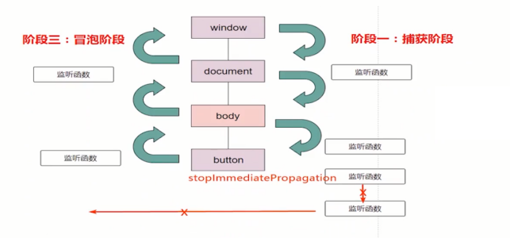
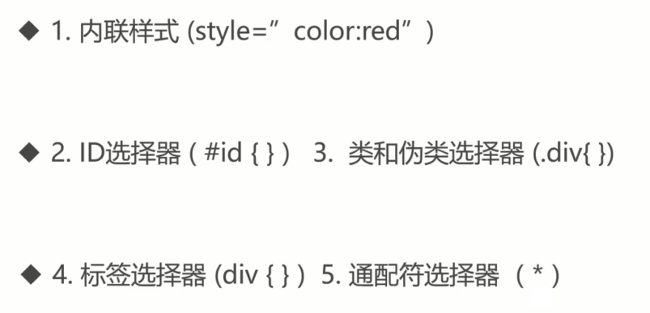

#  如果不用vue，react框架，如何操作DOM？

虚拟DOM大行其道的今天，还能不能用原生代码操作原生DOM呢？DOM1,DOM2, DOM3, DOM4，事件监听函数添加和删除的小秘密，空白节点，图片空白间距，跨文档复制等等这些高级操作

## 玩转Node节点：不应被忽视的 nodeType

```html
<!DOCTYPE html>
<html lang="en">
<body>
    <!--标题-->
    <div>
        JavaScript<span>进阶</span>
    </div>
</body>
</html>
```

对应的对象模型：


手写查看继承关系的方法：
```ts
function getParents(el) {
    if (typeof el !== "object" || el === null) {
        throw new Error("el应该是一个对象")
    }
    var _el = el;
    var result = [];
    while (_el.__proto__ !== null) {
        result.push(_el.__proto__.constructor.name);
        _el = _el.__proto__;
    }
    return result;
}
```
```ts
getParents(document)
// ['HTMLDocument', 'Document', 'Node', 'EventTarget', 'Object']

getParents(document.createElement("span"))
// ['HTMLSpanElement', 'HTMLElement', 'Element', 'Node', 'EventTarget', 'Object']

getParents(new Text('text'))
// ['Text', 'CharacterData', 'Node', 'EventTarget', 'Object']
```


- Node: https://developer.mozilla.org/zh-CN/docs/Web/API/Node
- nodeType: https://developer.mozilla.org/zh-CN/docs/Web/API/Node/nodeType

**Text - 3**

- 神秘空白的文本节点
- 使用 childNodes 访问
- 使用 nodeValue 取值

```html
<!DOCTYPE html>
<html lang="en">

<head>
    <meta charset="UTF-8">
    <meta http-equiv="X-UA-Compatible" content="IE=edge">
    <meta name="viewport" content="width=device-width, initial-scale=1.0">
    <title>Document</title>
</head>

<body>
    <div id="root">
        啊哈
        <span>我们一起学Javascript</span>
    </div>
</body>

</html>
```

```ts
root.childNodes
// NodeList(3) [text, span, text]

root.childNodes[1].childNodes
```

有趣的拆家和合并：
- splitText：拆家
- Element.normalize

```html
<body>

    <div id="div1">
        我们一起学Javascript
    </div>
    <div>
        <button id="btnSplit">拆分</button>
        <button id="btnNormalize">合并</button>
    </div>
    <script>
        const div1El = document.getElementById("div1");
        btnSplit.addEventListener("click", function () {
            div1El.firstChild.splitText(5);
            console.log(div1El.childNodes.length)
        })
        btnNormalize.addEventListener("click", function () {
            div1El.normalize();
            console.log(div1El.childNodes.length)
        })
    </script>

</body>
```

**Comment - 8**

- 注释为 `<!-- 注释内容 -->` 之间的内容
- 使用 nodeValue 获取其内容

```html
<body>
    
    <div id="div1">
        DIV1内容啊
    </div>

    <script>
        var cEl = new Comment("这是注释啊")
        div1.appendChild(cEl);
        console.log("注释内容:", cEl.nodeValue);
    </script>
</body>
```

**Document - 9**

Document 重要的方法和属性
- 节点查找，document.querySelector、document.querySelectorAll 等等
- 节点结合信息，document.all，document.forms，document.scripts，document.images，document.links 等等
- cookie: document.cookie

XMLDocument
```html
<script>
    var parser = new DOMParser();
    var xmlDoc = parser.parseFromString(`
        <xml>
            <persons>
                <person>
                    <name>小明</name>
                    <age>18</age>
                </person>
                <person>
                    <name>小红</name>
                    <age>19</age>
                </person>
            </persons>
        </xml>
    `, "text/xml");

    console.log("xmlDoc:", xmlDoc);
    console.log("constructor:", xmlDoc.__proto__.constructor);
</script>
```

xmlDocument json
```ts
<body>
    <script>
        var parser = new DOMParser();
        var xmlDoc = parser.parseFromString(`
            <xml>
                <persons>
                    <person>
                        <name>小明</name>
                        <age>18</age>
                    </person>
                    <person>
                        <name>小红</name>
                        <age>19</age>
                    </person>
                </persons>
            </xml>
        `, "text/xml");

        console.log("constructor:", xmlDoc.__proto__.constructor);
        const persons = xmlDoc.querySelectorAll("person");

        const personsJSON = Array.from(persons).map(function (node) {
            return {
                name: node.querySelector("name").childNodes[0].nodeValue,
                age: node.querySelector("age").childNodes[0].nodeValue
            }
        });

        console.log("personsJSON:", personsJSON)
    </script>
</body>
```

**DocumentType - 10**

- 访问方式: document.doctype , document.firstChild
- 有用的属性只有一个，就是 name，返回的是 "html"

**DocumentFragment - 11**

- 就像标准的 document 一样，储存由节点（nodes）组成的文档结构
- 所有的节点会被一次插入到文档中，而这个操作仅发生一个重新渲染的操作
- 常用语批量创建大量节点，提高性能

```html
<body>
    <div>
        <button id="btnBatch" >批量创建</button>
        <button id="btnSingle" >单独创建</button>
        <button id="btnClear" >清除</button>
    </div>
    <div id="root" style="height:500px; overflow:auto;">

    </div>

    <script type="text/javascript">
        var items = Array.from({ length: 10000 }, (v, i) => ({
            name: "name" + i,
            age: i,
            sex: i % 2
        }));

        var rootEl = document.getElementById("root");
        function createByS() {
            console.time("createByS");
            items.forEach(function (item) {
                var div = document.createElement("div");
                div.innerHTML = `name:${item.name} - age: ${item.age} - sex: ${item.sex}`
                rootEl.appendChild(div);
            })
            console.timeEnd("createByS");
        }

        function createByB() {
            console.time("createByB");
            var fragment = document.createDocumentFragment();
            items.forEach(function (item) {
                var div = document.createElement("div");
                div.innerHTML = `name:${item.name} - age: ${item.age} - sex: ${item.sex}`
                fragment.appendChild(div);
            })
            rootEl.appendChild(fragment);
            console.timeEnd("createByB");
        }

        btnBatch.addEventListener("click", createByB);
        btnSingle.addEventListener("click", createByS);
        btnClear.addEventListener("click", () => {
            rootEl.innerHTML = "";
        });
    </script>

</body>
```

**Element 系列 - 1**

- 创建：document.createElement
- children(nodeType = 1) 和 childNodes（全部）
- 获取属性 getAttribute，设置属性值 setAttribute

```html
<body>

    <script>

        // 创建 注释节点
        var commentEl = new Comment("标题");
        document.body.appendChild(commentEl);

        // 创建div
        var divEl = document.createElement("div");

        // 属性复制
        divEl.setAttribute("title", "div的title");
        // 设置样式
        divEl.style.backgroundColor = "red";

        // 添加文本
        divEl.appendChild(new Text("JavaScript"));
        // 创建span
        var spanEl = document.createElement("span");
        spanEl.textContent = "进阶";

        divEl.appendChild(spanEl);
        // 添加到body
        document.body.appendChild(divEl);

    </script>

</body>
```

## 玩转Node节点：查询和遍历，5种方式无敌手

Node 和 Element
- Node 是一个接口，我们就称其为节点吧
- Element 是通用性的基类，nodeType 为 1，是 Node 的一类实现，其子类我们统统称为元素。
- Node 还有很多其他实现，比如 文本、注释等

HTMLCollection 和 NodeList
- HTMLCollection： Element 子类的集合
- NodeList：所有 Node 子类的集合
- 我们约定：HTMLCollection 为元素集合， NodeList 为节点集合

getElementById：
- 作用：根据元素的 id 属性值进行节点查询，返回单一元素
- 属于高效的查询
- 语法：document.getElementById("id")

注意事项：


```html
<body>

    <div id="root"></div>
    <div id="root"></div>
    <div id="Root"></div>

    <script>

        var log = console.log;
        // 只获得一个
        log("root:", document.getElementById("root"))
        // 区分大小写
        log("Root.id:", document.getElementById("Root").id)

    </script>

</body>
```

**getElementsByClassName**

- 作用：根据指定的类名查询元素
- 语法：
    - document.getElementById("names")
    - element.getElementById("names")

```html
<body>
    <div class="outer" id="outer">
        <ul class="list list-1">
            <li class="item item2 item3">list-one</li>
            <li class="item">list-two</li>
            <li class="item">list-three</li>
        </ul>
    </div>
    <div class="outer2" id="outer"></div>

    <script>
        var log = console.log;
        // Element可以调用
        const items2 = document.getElementById("outer").getElementsByClassName("item");
        // 多个class
        const items3 = document.getElementsByClassName("item item3")

    </script>
</body>
```

注意事项：


**getElementsByName**

- 作用：根据指定的 name 属性查询元素
- 语法：document.getElementsByName("name")

注意事项：


```html
<body>
    <div class="outer" id="outer">
        <ul class="list list-1">
            <li name="li-item" class="item item2 item3">list-one</li>
            <li class="item">list-two</li>
            <li class="item">list-three</li>
        </ul>
    </div>
    <div class="outer2" id="outer"></div>
    <ccc name="ccc">ccc</ccc>

    <script>
        var log = console.log;
        // Element 上不存在调用
        var getElementsByName = document.getElementById("outer").getElementsByName
        console.log("getElementsByName:", getElementsByName)
        // 查询能被解析的节点
        var items3 = document.getElementsByName("ccc")

    </script>
</body>
```

**getElementsByTagName**

- 作用：通过指定的标签查询元素
- 语法：document.getElementsByTagName("tagName")

注意事项：


```html
<body>
    <div class="outer" id="outer">
        <ul class="list list-1">
            <li name="li-item" class="item item2 item3">list-one</li>
            <li class="item">list-two</li>
            <li class="item">list-three</li>
        </ul>
    </div>
    <div class="outer2" id="outer"></div>
    <ccc name="ccc">ccc</ccc>

    <script>
        var log = console.log;

        var outerEl = document.getElementById("outer");
        // Element也有此方法
        var items2 = outerEl.getElementsByTagName("li");
        // 查询能被解析的节点
        var items3 = document.getElementsByTagName("ccc")

        // 功效等同于 document.all
        console.log(document.getElementsByTagName("*").length === document.all.length)

    </script>
</body>
```

**querySelector**

- 作用：根据 css 选择器进行节点查询，返回匹配的第一个元素 Element。
- 语法：document.querySelector(selector)

注意事项：


```html
<body>
    <div class="outer" id="outer">
        <ul class="list list-1">
            <li name="li-item" class="item item2 item3">list-one</li>
            <li class="item">list-two</li>
            <li class="item">list-three</li>
        </ul>
    </div>
    <div class="outer2" id="outer"></div>
    <div id="foo\bar">ccc</div>

    <script>
        var log = console.log;

        var outerEl = document.getElementById("outer");
        // Element也有此方法
        var items2 = outerEl.querySelector("li");
        // 你必须将它转义两次（一次是为 JavaScript 字符串转义，另一次是为 querySelector 转义）
        var items3 = document.querySelector("#foo\\\\bar")

        // 不满足css选择器，异常
        var items4 = document.querySelector("sdasd:::sdsd")

    </script>
</body>
```

**querySelectorAll**
- 作用：根据 css 选择器进行节点查询，返回节点列表 NodeList
- 语法：document.querySelectorAll("selectors")

注意事项:


```html
<body>
    <div class="outer" id="outer">
        <ul class="list list-1">
            <li name="li-item" class="item item2 item3">list-one</li>
            <li class="item">list-two</li>
            <li class="item">list-three</li>
        </ul>
    </div>
    <div class="outer2" id="outer"></div>
    <div id="foo\bar">ccc</div>

    <script>
        var nodeList = document.querySelectorAll(".item");
        console.log("len:", nodeList.length);  // 3

        // 添加新的元素
        var liEl = document.createElement("li");
        liEl.className = "item";
        liEl.innerHTML = "list-for"
        document.querySelector(".list").appendChild(liEl);

        console.log("len:", nodeList.length); //3 

        console.log("query again:", document.querySelectorAll(".item").length)
    </script>
</body>
```

`:scope`
```html
<body>
  <div class="outer">
    <div class="select">
      <div class="inner">
      </div>
    </div>
  </div>

  <script>
    var select = document.querySelector('.select');
    var inner = select.querySelectorAll('.outer .inner');
    console.log("inner.length:", inner.length); // 1, not 0!

    var select2 = document.querySelector('.select');
    var inner2 = select.querySelectorAll(':scope .outer .inner');
    console.log("inner2.length:", inner2.length); // 0
  </script>
</body>
```

汇总对比：


一些特殊查询属性：


<!-- document.styleSheets 包括所有 css 的link和 style 的标签 -->

怎么查询伪元素？
- 答案：不能
- 但你可以通过 window.getComputedStyle 来获取其样式

```html
<body>
    <style>
        .nihao::before {
            content: '你好，';
        }
    </style>
    <div class="nihao" id="nihao">
        Tom
    </div>

    <script>
        var content = window.getComputedStyle(nihao, "before")["content"];
        console.log(content);
    </script>
</body>
```

元素集合和 NodeList 遍历
- for、while 遍历
- NodeList.prototype.forEach (有兼容性问题)
- 转为数组遍历: Array.from, Array.prototype.slice, 扩展运算符等

某个节点/元素所有子节点/元素遍历
- children 或者 childNodes
- NodeIterator 或者 TreeWalker

NodeIterator VS TreeWalker
- TreeWalker 是 NodeIterator 的一个更高级的版本
- 额外支持一些方法，parentNode，firstChild，lastChild，nextSibling

**NodeIterator**

```html
<body>
    <div class="outer" id="outer">
        <!-- 测试-->
        <ul class="list list-1">
            <li name="li-item" class="item item2 item3">list-one</li>
            <li class="item">list-two</li>
            <li class="item">list-three</li>
        </ul>
    </div>
    <div class="outer2" id="outer"></div>
    <div id="foo\bar">ccc</div>

    <script>
        // NodeIterator 是深度遍历
        const iterator = document.createNodeIterator(
            document.getElementById("outer"),
            NodeFilter.SHOW_ELEMENT,
            {
                acceptNode(node) {
                    return node.tagName === 'LI' ? NodeFilter.FILTER_ACCEPT : NodeFilter.FILTER_REJECT;
                }
            }
        );
        var currentNode;
        while (currentNode = iterator.nextNode()) {
            console.log(currentNode.innerText)
        }

    </script>
</body>
```

总结：


## 玩转Node节点：增加，删除，克隆以及如何避免内存泄漏


节点创建和挂载：

- 创建了节点，未加入文档，是没有任何视觉效果的
- 第一步：创建
- 第二步：挂载

显示创建节点：

1. 对象模型直接 new
```ts
var commentNode = new Comment("注释");
var textNode = new Text("文本");
document.body.append(commentNode);
document.body.append(textNode);
```

2. document.create 系列
```ts
var el = document.createElement("div");
var commentNode = document.createComment("注释");
var textNode = document.createTextNode("文本");
var fragment = document.createDocumentFragment();
fragment.append('fragment创建的节点');

el.appendChild(textNode);

document.body.appendChild(el);
document.body.appendChild(commentNode);
document.body.appendChild(fragment);
```

节点挂载：
1. Node API 的挂载
2. Element API 的挂载

Node 节点挂载：


```html
<body>

    <div style="margin-left: 50px;">
        <button id="btnAppendChild">appendChild</button>
        <button id="btnInsertBefore">insertBefore</button>
        <button id="btnReplaceChild">replaceChild</button>
        <button id="btnTextContent">textContent</button>
    </div>
    <div style="margin:50px">

        <div id="buttons">
            <button id="btnBase">基准按钮</button>
        </div>

        <div id="contents">
            <span id="textContent">基础文本</span>
        </div>
    </div>

    <script>

        btnAppendChild.addEventListener("click", function (e) {
            var btn = document.createElement("button");
            btn.textContent = "appendChild";
            // parentNode.appendChild();
            buttons.appendChild(btn);
        })

        btnInsertBefore.addEventListener("click", function (e) {
            var btn = document.createElement("button");
            btn.textContent = "btnInsertBefore";
            // 语法： var insertedNode = parentNode.insertBefore(newNode, referenceNode);
            buttons.insertBefore(btn, btnBase);
        })

        btnReplaceChild.addEventListener("click", function () {
            var btn = document.createElement("button");
            btn.textContent = "replaceChild";
            // parentNode.replaceChild(newChild, oldChild);
            buttons.replaceChild(btn, btnBase);
        })

        
        btnTextContent.addEventListener("click", function () {
        
            textContent.textContent = "textContent"
        })

    </script>

</body>
```

Element 挂载节点：


```html
<body>

    <div style="margin-left: 50px;">
        <button id="btnAfter">after</button>
        <button id="btnBefore">before</button>
        <button id="btnAppend">append</button>
        <button id="btnPrepend">prepend</button>
    </div>
    <div style="margin:50px">

        <div id="buttons">
            <button id="btnBase">基准按钮</button>
        </div>
    </div>

    <script>

        btnAfter.addEventListener("click", function (e) {
            var btn = document.createElement("button");
            btn.textContent = "after button";
            // Element.after(...nodesOrDOMStrings);
            btnBase.after(btn, "after text")
        })

        btnBefore.addEventListener("click", function (e) {
            var btn = document.createElement("button");
            btn.textContent = "before button";
            // Element.before(...nodesOrDOMStrings);
            btnBase.before(btn, "before text")
        })

        btnAppend.addEventListener("click", function () {
            var btn = document.createElement("button");
            btn.textContent = "append button";
            // Element.append(...nodesOrDOMStrings)
            buttons.append(btn, "append text");
        })

        btnPrepend.addEventListener("click", function () {
            var btn = document.createElement("button");
            btn.textContent = "prepend button";
            // Element.prepend(...nodesOrDOMStrings)
            buttons.prepend(btn, "prepend text");
        })

    </script>

</body>
```

insertAdjacentElement 系列：
- insertAdjacentElement、insertAdjacentHTML、insertAdjacentText
- 参照节点是自身
- 三个方法节点一次要求是：元素、字符串、文本字符串
- 位置分为：afterbegin、afterend、beforebegin、beforeend


```html
<body>

    <div class="parent">
        <div class="child">child</div>
    </div>

    <script>
        function createDiv(content){
            var el = document.createElement("div");
            el.innerHTML = content;
            return el;
        }

        var pEl = document.querySelector(".parent");
        pEl.insertAdjacentElement("afterbegin", createDiv("afterbegin"));
        pEl.insertAdjacentElement("afterend", createDiv("afterend"));
        pEl.insertAdjacentElement("beforebegin", createDiv("beforebegin"));
        pEl.insertAdjacentElement("beforeend", createDiv("beforeend"));
    </script>

</body>
```

replaceChildren 和 replaceWith：
- 全面替换子节点
- 参数是多个节点或者字符串

appendChild VS append：


innerHTML & innerText
- innerHTML：批量创建并生成节点
- innerText：生成文本节点。本质是HTMLElement 上的属性。

删除节点：单个


删除节点：批量
- innerHTML & outerHTML
- replaceChildren 和 replaceWith
- 循环删除

删除节点：循环删除


节点克隆：


- 实际上 textContent 和 innerText 也具备一定的复制能力
- 节点复制不能复制 DOM2 的事件，一定程度上能复制 DOM0 级别事件
- importNode 和 adoptNode 在同文档内操作也生效

importNode 和 adoptNode 
```html
<body>
<div style="display: flex">
    <div style="flex: 0 0 200px">
    <div>
        <button id="btnImportNode">importNode content1</button>
        <button id="btnAdoptNode">adoptNode content2</button>
    </div>
    <div id="container1"></div>
    </div>
    <div>
    <iframe src="./4.0 iframe.html" id="ifr"></iframe>
    </div>
</div>

<script>

    // importNode
    btnImportNode.addEventListener("click", function () {
    var node =  document.importNode(ifr.contentWindow.document.querySelector("#content1"), true);
    container1.append(node);
    });


    // adoptNode
    btnAdoptNode.addEventListener("click", function () {
    var node =  document.adoptNode(ifr.contentWindow.document.querySelector("#content2"));
    container1.append(node);
    });
</script>
</body>
```

importNode 和 adoptNode 同文档：
```html
<body>
<div style="display: flex">
    <div style="flex: 0 0 200px">
    <div>
        <button id="btnImportNode">importNode content1</button>
        <button id="btnAdoptNode">adoptNode content2</button>
    </div>
    <div id="container1"></div>
    </div>
    <div>
    <iframe src="./4.0 iframe.html" id="ifr"></iframe>
    </div>
</div>

<script>

    // importNode
    btnImportNode.addEventListener("click", function () {
    var node =  document.importNode(ifr.contentWindow.document.querySelector("#content1"), true);
    container1.append(node);
    });


    // adoptNode
    btnAdoptNode.addEventListener("click", function () {
    var node =  document.adoptNode(ifr.contentWindow.document.querySelector("#content2"));
    container1.append(node);
    });
</script>
</body>
```

内存泄漏：
- 全局作用域：三思而后行
- console.log： 天降横祸
- 闭包：沾花惹草要小心
- eval 真像个恶魔

```html
<body>
    <div id="root"></div>

    <script>

        // 泄漏
        var root = document.getElementById("root");
        var el = document.createElement("div");
        el.appendChild(new Text("我是文本"));
        root.appendChild(el);

        const wkRef = new WeakRef(el);

        console.log("删除节点");
        root.removeChild(el);
        console.log(el)
        el = null;


        setInterval(() => {
            if (wkRef.deref()) {
                console.log("el未回收")
            } else {
                console.log("el已回收")
            }
        }, 2000);

    </script>

</body>
```

内存泄漏-事件：
```html
<body>
    <div id="root">
        <button id="btnTest">测试的按钮</button>
    </div>
    <div>
        <button type="button" id="btnRemove">删除按钮</button>
    </div>

    <script>

        ; (function () {

            var btnTest = document.getElementById("btnTest");

            function onClick() {
                console.log("被点击了")
            }

            const wkRef = new WeakRef(onClick);

            btnTest.addEventListener("click", onClick);
            btnRemove.addEventListener("click", function () {
                root.innerHTML = "";
            })

            // 哦豁
            console.log("btnTest", btnTest)
            setInterval(() => {
                if (wkRef.deref()) {
                    console.log("onClick未回收")
                } else {
                    console.log("onClick已回收")
                }
            }, 2000);

        })();

    </script>

</body>
```

事件- 回收：
```html
<body>
    <div id="root">
    </div>
    <div>
        <button type="button" id="btnRemove">删除按钮</button>
    </div>

    <script>

        ; (function () {

            function onClick() {
                console.log("被点击了")
            }

            var wkRefDom;
            class TestUtils {
                constructor() {
                    this.root = document.getElementById("root")
                    this.btnRemove = document.getElementById("btnRemove");
                    this.initButton();
                }

                initButton() {
                    const btnTest = document.createElement("button");
                    btnTest.textContent = "测试的按钮"
                    btnTest.addEventListener("click", onClick);

                    wkRefDom = new WeakRef(btnTest);

                    this.btnTest = btnTest;

                    this.root.appendChild(this.btnTest);
                    btnRemove.addEventListener("click", () => {
                        this.removeBtn();
                    })
                }

                removeBtn() {
                    this.btnTest.removeEventListener("click", onClick);
                    this.root.removeChild(this.btnTest);
                    // this.btnTest = null;
                    // 闭包的锅
                    onClick = null;
                }
            }
            var utils = new TestUtils();

            const wkRefEvent = new WeakRef(onClick);

            setInterval(() => {
                console.log(`btnTest ${wkRefDom.deref() ? "未回收" : "回收"}`)

                console.log(`onClick ${wkRefEvent.deref() ? "未回收" : "回收"}`)

            }, 2000);

        })();

    </script>

</body>
```

使用 eval 时不会回收：
```html
<body>
    <div id="root"></div>

    <script>

        ; (function init() {
            // 泄漏
            var root = document.getElementById("root");
            var el = document.createElement("div");
            el.appendChild(new Text("我是文本"));
            root.appendChild(el);

            const wkRef = new WeakRef(el);


            console.log("删除节点");
            root.removeChild(el);

            setInterval(() => {
                if (wkRef.deref()) {
                    console.log("el未回收")
                } else {
                    console.log("el已回收")
                }
            }, 2000);

            setTimeout(function () {
                eval('')
            }, 10000000)

        })()

    </script>

</body>
```

性能测试：
```html
<body>

    <div>
        <button id="btnAdd">单个新增</button>
        <button id="btnBatchAdd">批量新增</button>
        <button id="btnClone">克隆</button>
        <button id="btnInnerHTML">innerHTML</button>
    </div>

    <div style="height:600px; overflow-y: auto;" id="container">
        <div>
            <div>name</div>
            <div>des</div>
        </div>
    </div>

    <script>

        const count = 1000;

        function addSingle() {
            console.time("addSingle");
            for (let i = 0; i < count; i++) {
                var el = document.createElement("div");
                var elName = document.createElement("div");
                var elDes = document.createElement("div")

                elName.textContent = "name" + i;
                elDes.textContent = "des" + i;


                el.append(elName, elDes)
                container.appendChild(el);
            }
            console.timeEnd("addSingle");
        }
        btnAdd.addEventListener("click", addSingle);


        function addBatch() {
            console.time("addBatch");

            var fragment = document.createDocumentFragment();
            for (let i = 0; i < count; i++) {
                var el = document.createElement("div");
                var elName = document.createElement("div");
                var elDes = document.createElement("div")

                elName.textContent = "name" + i;
                elDes.textContent = "des" + i;


                el.append(elName, elDes)
                fragment.appendChild(el);
            }
            container.appendChild(fragment);
            console.timeEnd("addBatch");
        }
        btnBatchAdd.addEventListener("click", addBatch);


        function addClone() {
            console.time("addClone");
            // 不是 firstChild
            const baseEL = container.firstElementChild;

            var fragment = document.createDocumentFragment();
            for (let i = 0; i < count; i++) {
                var el = baseEL.cloneNode(true);

                // 节点访问
                el.children[0].textContent =   "name" +  i;
                el.children[1].textContent  =  "des" + i;
                fragment.appendChild(el)
            }
            container.appendChild(fragment);
            console.timeEnd("addClone");
        }

        btnClone.addEventListener("click", addClone);

        function addInnerHTML() {
            console.time("addInnerHTML");

            // var elStrArr = [];
            // for (let i = 0; i < count; i++) {
            //     elStrArr.push(`
            //         <div>name${i}</div>
            //         <div>des${i}</div>
            //     `)
            // }
            // container.innerHTML =  elStrArr.join("")

            var htmlStr = '';
            for (let i = 0; i < count; i++) {
                htmlStr+= "<div>name"+ i + "</div><div>des"+ i + "</div>"
            }

            container.innerHTML = htmlStr

            console.timeEnd("addInnerHTML");
        }

        btnInnerHTML.addEventListener("click", addInnerHTML)

    </script>

</body>
```

## 慧眼区分几个近亲属性


**HTMLElement.innerText VS Node.textContent**
- HTMLElement.innerText 表示一个节点以及后代被`渲染`的文本内容
- Node.textContent 表示一个节点以及后代的文本内容

HTMLElement.innerText 和 Node.textContent 区别：


总结：
- 最大区别：innerText 可操作已被渲染的内容，而 textContent 不会
- innerText 受样式影响会触发浏览器绘制部分或者全部页面，带来性能问题，尽可能使用 textContent

**Node.nodeValue VS value: nodeValue**
- 对于 text、comment 和 CDATA 节点来说，nodeValue 返回该节点的文本内容
- 对于 attribute 节点来说，返回该属性的属性值

Node.nodeValue


value


Node.nodeValue VS value 的区别
- nodeValue 是文本节点，属性节点，注释节点等类型的节点用来取文本/值得属性
- value 是特点的元素节点用来取值的属性

offsetWidth,clientWidht,scrollWidth 几个概念：
- 内容 content
- 内边距 padding
- 边框 border
- 外边距 margin
- 滚动条


clientWidht：


offsetWidth：


scrollWidth：


offsetWidth,clientWidht,scrollWidth 区别：


```html
<!DOCTYPE html>
<html lang="en">

<head>
    <meta charset="UTF-8">
    <meta http-equiv="X-UA-Compatible" content="IE=edge">
    <meta name="viewport" content="width=device-width, initial-scale=1.0">
    <title>Document</title>
</head>
<style>
    /* .scrollbar::-webkit-scrollbar {
        width: 6px;
    }
    .scrollbar::-webkit-scrollbar-thumb {
      border-radius: 5px;
      background: #82adda;
    }
    .scrollbar::-webkit-scrollbar-track {
      border-radius: 3px;
      background: #0e2e6a;
    } */

    .box {
        box-sizing: content-box;
        position: relative;
        width: 300px;
        height: 300px;
        overflow: auto;
        border: 5px solid blue;
        padding: 10px;
        margin: 0 40px;
        background: yellow;
    }

    .content {
        position: relative;
        width: 1000px;
        height: 150px;
        background: red;
        color: #fff;
        font-size: 30px;
    }
</style>

<body>
    <div id="box" class="box scrollbar">
        <div class="content">
            内容展示-js进阶实战，js进阶实战，js进阶实战，js进阶实战，js进阶实战，js进阶实战，js进阶实战，js进阶实战，js进阶实战，js进阶实战，js进阶实战，js进阶实战</div>
    </div>
    <script>
        const box = document.getElementById("box");
        console.log("clientWidth==", box.clientWidth);
        console.log("offsetWidth==", box.offsetWidth);
        console.log("scrollWidth==", box.scrollWidth);
    </script>
</body>

</html>
```

Node.compareDocumentPosition：节点位置关系
- 定义：比较当前节点与任意文档中的另一个节点的位置关系
- 语法：compareMask = node.compareDocumentPosition(otherNode)
- 返回值是一个具有一下值的位掩码


Node.contains：节点位置关系
- 定义：返回一个布尔值，来表示传入的节点是否为该节点好的后代节点

比较：
- Node.compareDocumentPosition 返回的是数字，带组合意义的数据，不仅仅可以返回包含，还可以返回在之前之后等信息
- Node.contains 返回的是布尔值，仅仅告诉你是否有包含关系

```html
<body>
    <div id="parent">
        <div id="child"></div>
    </div>

    <script>

        const pEl = document.getElementById("parent");
        const cEl = document.getElementById("child");
        // node.compareDocumentPosition(otherNode )
        // 不在同一文档中        1
        // otherNode在node之前  2
        // otherNode在node之后 	4  ✔
        // otherNode包含node    8
        // otherNode被node包含  16 ✔
        console.log("compareDocumentPosition:", pEl.compareDocumentPosition(cEl));  // 20

        console.log("contains:", pEl.contains(cEl));

    </script>
</body>
```

**大小/位置 - getBoundingClientRect**

- 定义：返回元素的大小及其相对于可视化窗口（视口）的位置


```html
<body>

    <style>
        #container {
            top: 100px;
            left: 100px;
            position: relative;
            width: 100px;
            height: 100px;
            background-color: red;
        }
    </style>
    <div id="container">
    </div>
    <div>
        <button id="btnGet">获取</button>
    </div>
    <script>
        btnGet.addEventListener("click", function () {
            const rect = container.getBoundingClientRect();
            console.log(rect)
        })
    </script>
</body>
```

**大小/位置 - Element.getClientRects**
- 定义：返回盒子的边界矩形集合
- 定义：对于行内元素，`元素内部的每一行都会有一个边框`；对于块级元素，如果里面没有其他元素，一整块元素只有一个边框。

```html
<!DOCTYPE html>
<html lang="en">

<head>
    <meta charset="UTF-8">
    <meta http-equiv="X-UA-Compatible" content="IE=edge">
    <meta name="viewport" content="width=device-width, initial-scale=1.0">
    <title>Document</title>

    <style>
        .multi-client-rects {
            display: inline-block;
            width: 100px;
            position: relative;
        }
    </style>
</head>

<body>

    <p class="single-client-rects">
        <span>Paragraph that spans single line</span>
    </p>
    <p class="multi-client-rects">
        <span>Paragraph that spans multiple lines</span>
    </p>

    <div>
        <button id="btnAddByBorder">添加边框(Border)</button>
        <button id="btnAddByRect">添加边框(DOMRect)</button>
    </div>
    <script>

        const $ = (selector) => document.querySelector(selector);

        var elSingle = $(".single-client-rects span");
        var elMulti = $(".multi-client-rects span");

        console.log("elSingle length:", elSingle.getClientRects().length);
        console.log("elMulti length:", elMulti.getClientRects().length);


        console.log("elSingle ClientRects:", elSingle.getClientRects())
        console.log("elMulti ClientRects:", elMulti.getClientRects())

        btnAddByRect.addEventListener("click", function () {
            addBorder(elMulti);
        })

        btnAddByBorder.addEventListener("click", function () {
            elMulti.style.cssText = "border:solid 1px red;";
        })

        function addBorder(el) {
            var rects = el.getClientRects();

            var scrollEl = document.scrollingElement;
            for (var i = 0; i != rects.length; i++) {
                var rect = rects[i];
                var elDiv = document.createElement('div');
                elDiv.style.position = 'absolute';
                elDiv.style.border = '1px solid red';
                var scrollTop = scrollEl.scrollTop;
                var scrollLeft = scrollEl.scrollLeft;
                elDiv.style.margin = elDiv.style.padding = '0';
                elDiv.style.top = (rect.top + scrollTop) + 'px';
                elDiv.style.left = (rect.left + scrollLeft) + 'px';

                // 减掉border的2px
                elDiv.style.width = (rect.width - 2) + 'px';
                elDiv.style.height = (rect.height - 2) + 'px';
                document.body.appendChild(elDiv);
            }
        }


    </script>
</body>

</html>
```

**加载完毕时间监听 - window.onload**

- 定义：在文档装载完成后会触发 load 事件。此时，在文档中的所有对象都在 DOM 中，所有图片，脚本，链接以及子框架都完成了装载

**加载完毕时间监听 - DOMContentLoaded**

- 定义：当初始的 HTML 文档被完全加载和解析完成之后，DOMContentLoaded 事件被触发，而无需等待样式表、图像、子框架(iframe)的完全加载。
- juery 就这么干的


```html
<body> 
    

    <script>
        let contentLoadedTime;
        let onloadTime;
        document.addEventListener('DOMContentLoaded', function () {
            console.log('DOMContentLoaded:');
            contentLoadedTime = performance.now()
        });
        window.onload = function () {
            console.log('onload:');
            onloadTime = performance.now();

            console.log('gap:', onloadTime - contentLoadedTime);
        }
    </script>
    
</body>
```

**节点复制**

- Document.adoptNode: 从外部文档的一个`节点拷贝一份`，然后可以把这个拷贝的节点插入到当前文档中
- Document.importNode: 从其他的 document 文档中获取一个节点，该节点以及它的子树上的所有节点都会从`原文档删除`，并且它的 ownerDocument 属性会变成当前的 document 文档。之后你可以把这个节点插入到当前文档中。
- Document.cloneNode: 生成一个节点的副本，分为深克隆和浅克隆
    - deep：true 则该节点的所有后代节点也都会被克隆
    - deep：false 则只克隆该节点本身
    - 注意点：
        - cloneNode deep 参数在不同版本的浏览器实现中，默认值可能不一样，所以强烈建议写上值
        - cloneNode 会克隆一个元素节点会拷贝它所有的属性以及属性值，当然也就包括了属性上绑定的事件（比如: onclick="alert(1)"），但不会拷贝那些使用 addEventListener() 方法 或者 node.onclick = fn 这种用 JS 动态绑定的事件

总结：
- adoptNode 从外部文档进行拷贝
- importNode 从外部文档进行拷贝，并从外部文档删除
- cloneNode 从本文档进行复制，有浅复制和深复制


**添加节点：append，appendChild**

- Node.appendChild 将一个节点附加到指定父节点的子节点列表的末尾处
- Element.append 在 ParentNode 的最后一个子节点之后插入一组 Node 对象或者 DOMString 对象

区别：


**子节点集合 childNodes、children**
- Node.childNodes 节点的子节点集合，包括元素节点、文本节点、注释节点等
- Element.children 返回的只是节点的元素节点集合，即 nodeType 为 1 的节点

```html
<body>
    <div id="root">
        1
        <span>2</span>
        3
        <!-- <div></div> -->
        <!CDATA[[ 4 ]]>
    </div>

    <script>
        const rootEl = document.getElementById("root");
        console.log(rootEl.children);
        console.log(rootEl.childNodes);
    </script>
</body>
```

思考：
- srollTo、srollBy、srollIntiView 功能以及区别


## 自定义元素：web component, 任性的开始

两个问题：
- vue slot 和 scoped css 借鉴了谁的思想
- scoped css 在 vue 里面的实现原理是什么


web component 使用步骤：
- 编写 web component 组件
- 注册 web component 组件
- 使用

一个简单的例子：


```html
<my-text></my-text>

<div></div>
<!-- 放在后面不行 -->
<my-text></my-text>

<script>
    class MyText extends HTMLElement {
        constructor() {
            super();
            this.append("我的文本");
        }
    }
    window.customElements.define("my-text", MyText);
</script>
```

主要三项技术:


```html
<body>

    <p color="red" is="color-p">
        这是color-p的内容
    </p>
    <script>
        class ColorP extends HTMLParagraphElement {
            constructor() {
                super();
                this.style.color = this.getAttribute("color");
                console.log(this.style.color)
            }

        }
        window.customElements.define("color-p", ColorP, { extends: "p" });
    </script>

</body>
```


极其简单的 connectedCallback
```html
<body>
    <my-text></my-text>

    <script>
        class MyText extends HTMLElement {
            constructor() {
                super();

            }
            connectedCallback() {
                this.append("我的文本");
            }
        }
        window.customElements.define("my-text", MyText);
    </script>
    <div></div>
    <my-text></my-text>
</body>
```

生命周期：


生命周期 attributeChangedCallback
- 配合 observedAttributes 属性一起使用，指定监听的属性
- 使用 setAttribute 方法更新属性

生命周期 connectedCallback
- 对节点的操作应位于此生命周期
- 可能被多次触发。比如删除后又添加到文档，所以 disconnectedCallback 可配置做清理工作

```html
<body>

    <div id="container1">
        <p is="my-text" text="大家好" id="myText"></p>
    </div>
    <div id="container2">
    </div>

    <div>
        <button id="btnUpdateText">更新属性</button><br />
        <button id="btnRemove">删除节点</button>
        <button id="btnRestore">恢复节点</button>
    </div>

    <script>
        class MyText extends HTMLParagraphElement {
            constructor() {
                super();
            }

            connectedCallback() {
                console.log("生命周期:connectedCallback")
                this.append("我说:" + this.getAttribute("text"))
            }

            disconnectedCallback() {
                console.log("生命周期:disconnectedCallback")
                this.innerHTML = ""
            }

            static get observedAttributes() {
                // return [''];
                return ['text'];
            }

            attributeChangedCallback(name, oldValue, newValue) {
                console.log("生命周期:attributeChangedCallback", name, oldValue, newValue);
                // 先触发changed再触发 connectedCallback
                // 所以这里判断是不是一次触发 changed
                // 第一次的话，交给connectedCallback处理
                if (oldValue != null) {
                    this.replaceChildren("我说:" + newValue);
                }
            }

            adoptedCallback() {
                console.log("生命周期:adoptedCallback")
            }
        }

        window.customElements.define("my-text", MyText, { extends: "p" });

        var myTextEl = document.getElementById("myText")
        btnUpdateText.addEventListener("click", function (e) {
            myTextEl.setAttribute("text", "随机的文本" + Math.random());
        })

        btnRemove.addEventListener("click", function (e) {
            myTextEl.remove()
        })

        btnRestore.addEventListener("click", function (e) {
            container1.appendChild(myTextEl)
        });

    </script>

</body>
```

**创建节点的痛点：**

- 使用JS对象模型创建节点过于复杂
- ES 字符串模板，不友好，缺乏提示等
- 复用性差

Shadow DOM:

```html
<body>

    <template id="tpl-test">
        <style type="text/css">
            .title {
                color: red;
            }
        </style>
        <div class="title">标题</div>
        <slot name="slot-des">默认内容</slot>
    </template>


    <test-item>
        <div slot="slot-des">不是默认内容哦</div>
    </test-item>

    <script>
        class TestItem extends HTMLElement {
            constructor() {
                super();
            }

            connectedCallback() {
                const content = document.getElementById("tpl-test").content.cloneNode(true);

                // 结果呢？ 不生效
                // this.append(content);
                // 
                const shadow = this.attachShadow({mode: "open"}); 
                shadow.append(content);

            }
        }
        window.customElements.define("test-item", TestItem);

    </script>

</body>
```

一些概念：


一些概念图示：


shadow DOM 的可访问性
- 影子 DOM ，其内部样式不共享
- 影子 DOM，其内部元素不可以直接被访问到。

一个重要参数 mode

```ts
// open shadow root 元素可以从 js 外部访问根节点
const shadow = this.attachShadow({ mode: "open" });

// 拒绝从 js 外部访问，关闭 shadow root 节点
const shadow = this.attachShadow({ mode: "closed" });
```

引用外部样式

第一种：
```ts
connectedCallback() {
    const content = document.getElementById("tpl-my-item").content.cloneNode(true);

    const shadow = this.attachShadow({ mode: "open" });

    shadow.append(content);

    const linkElem = document.createElement('link');
    linkElem.setAttribute('rel', 'stylesheet');
    linkElem.setAttribute('href', '4.css');
    shadow.appendChild(linkElem);
}
```

第二种：
```html
<template id="tpl-my-item">
    <link rel="stylesheet" href="4.css">
    <div class="container">
        My Item
    </div>
</template>
```

动态创建 Web Component 组件节点例子：

- 获取商品
- 动态创建元素节点
- 点击商品，跳转（事件）

```html
<!DOCTYPE html>
<html lang="en">

<head>
    <meta charset="UTF-8">
    <meta http-equiv="X-UA-Compatible" content="IE=edge">
    <meta name="viewport" content="width=device-width, initial-scale=1.0">
    <title></title>
</head>

<body>
    <div id="product-list" style="display: flex">

    </div>

    <template id="product-item">
        <style>
            .product-item {
                margin-left: 15px;
                cursor: pointer;
            }

            .img {
                width: 100px
            }

            .name {
                text-align: center;
            }

            .price {
                color: #999;
                text-align: center;
            }
        </style>
        <div class="product-item">
            
            <div class="name"></div>
            <div class="price"></div>
        </div>
    </template>

    <script>
        class ProductItemElement extends HTMLElement {
            constructor(props) {
                super(props);
                this.addEventListener("click", ()=> {
                    window.open(`https://item.jd.com/${this.id}.html`)
                });
            }

            connectedCallback() {

                var shadow = this.attachShadow({ mode: 'open' });
                var doc = document;
                var templateElem = doc.getElementById('product-item');
                var content = templateElem.content.cloneNode(true);

                content.querySelector('.img').src = this.img;
                content.querySelector('.name').innerText = this.name;
                content.querySelector('.price').innerText = this.price;

                shadow.appendChild(content);

            }
        }
        window.customElements.define('product-item', ProductItemElement);
    </script>

    <script>
        var products = [{
            name: "关东煮",
            img: "//img10.360buyimg.com/seckillcms/s200x200_jfs/t1/121953/18/20515/175357/61e7dc79Ee0acbf20/4f4f56abd2ea2f75.jpg!cc_200x200.webp",
            id: '10026249568453',
            price: 49.8
        }, {
            name: "土鸡蛋",
            img: "//img11.360buyimg.com/seckillcms/s200x200_jfs/t1/172777/32/27438/130981/61fbd2e0E236000e0/7f5284367e2f5da6.jpg!cc_200x200.webp",
            id: "10024773802639",
            price: 49.8
        }, {
            name: "东北蜜枣粽子",
            img: "//img20.360buyimg.com/seckillcms/s200x200_jfs/t1/129546/31/19459/110768/60b1f4b4Efd47366c/3a5b80c5193bc6ce.jpg!cc_200x200.webp",
            id: "10035808728318",
            price: 15
        }];

        var proList = document.getElementById("product-list");

        function createProductItem(attrs) {
            const el = document.createElement("product-item");
            el.img = attrs.img;
            el.name = attrs.name;
            el.price = attrs.price;
            el.id = attrs.id;
            return el;
        }
        var elList = products.map(createProductItem)
        proList.append.apply(proList, elList)

    </script>

</body>

</html>
```

Web Component 优点：


Web Component 的前景：
- 组件库： fluent UI、fast、lit
- 微前端

思考题：


## DOM事件原理和避坑指南

DOM 树 - 这个很关键


```ts
document.childNodes
// NodeList(2) [<!DOCTYPE html>, html]

document.childNodes[0]
document.childNodes[0].nodeName
document.childNodes[0].name

document.childNodes[1]
// html

document.childNodes[1].children[0] === document.head
```

window 和 document 的关系
- BOM（Browser Object Model）：浏览器对象模型，没有相关标准，一些和网页无关的浏览器功能。如：window、loaction、navigator、screen、history 等对象
- DOM（Dcument Object Model）：文档对象模型，W3C的标准，HTML 和 XML 文档的编程接口
- window 属于 BOM，document 是 DOM 中的核心。但是 window 引用着 document ，仅此而已。

DOM0 级的事件
```html
<div>
    <button id="btn1" onclick="console.log('按钮1被点击了')">按钮1(代码)</button>
</div>
```


DOM0 事件注意事项：
- 事件处理函数中，this 是当前的节点
- 如果调用函数，会在全局作用域查找
- 唯一性，只能定义一个的事件回调函数

DOM2 级的事件：


DOM2 级的事件：事件注册
- 语法
    ```ts
    target.addEventListener(type, listener, useCapture)
    target.addEventListener(type, listener, options)
    ```
- useCapture: true, 捕获阶段传播到目标的时候触发，反之冒泡阶段传到目标的时候触发。默认值 false，即冒泡时

```html
<!DOCTYPE html>
<html lang="en">

<head>
  <meta charset="UTF-8" />
  <meta http-equiv="X-UA-Compatible" content="IE=edge" />
  <meta name="viewport" content="width=device-width, initial-scale=1.0" />
  <title>Document</title>
</head>

<body>
  <button id="btn">按钮</button>

  <script>
     window.addEventListener("click", function () {
      console.log("捕获:window")
    }, true)

    document.addEventListener("click", function () {
      console.log("捕获:document");
    }, true)

    btn.addEventListener(
      "click",
      function (ev) {
        console.log("捕获:btn");
      },
      true
    );

    btn.addEventListener("click", function (ev) {
      console.log("冒泡:btn");
    });

    document.addEventListener("click", function () {
      console.log("冒泡:document");
    })

    window.addEventListener("click", function () {
      console.log("捕获:window")
    })

  </script>
</body>

</html>
```

DOM2 级的事件：强大的 options
- 语法
    ```ts
    target.addEventListener(type, listener, options)
    ```

once：
- 是否只响应一次
- 最典型的应用就是 视频播放，现代浏览器可能需要用户参与后，视频才可以有声播放

```html
<!DOCTYPE html>
<html lang="en">

<head>
    <meta charset="UTF-8">
    <meta http-equiv="X-UA-Compatible" content="IE=edge">
    <meta name="viewport" content="width=device-width, initial-scale=1.0">
    <title>Document</title>
</head>

<body>
    <button id="btn">按钮</button>
    <script>
        btn.addEventListener("click", function () {
            console.log("按钮被点击了")
        }, {
            once: true,
        })
    </script>


    <video id="video" controls width="250" autoplay>

        <source src="https://interactive-examples.mdn.mozilla.net/media/cc0-videos/flower.webm" type="video/webm">

        <source src="https://interactive-examples.mdn.mozilla.net/media/cc0-videos/flower.mp4" type="video/mp4">

        Sorry, your browser doesn't support embedded videos.
    </video>

    <script>

        document.addEventListener("click", ()=>{
            console.log("播放视频喽")
            video.play();

        },{
            once: true,
        })

    </script>
</body>

</html>
```

passive:
- 设置为 true 时，事件处理成不会调用 preventDefault()
- 某些触摸事件（以及其他）的事件监听器在尝试处理滚动时，可能阻止浏览器的主线程，从而导致滚动处理期间性能可能大大降低。

```ts
var elem = document.getElementById('elem');
elem.addEventListener('touchmove', function listener {
    // do something
}, { passive: true });
```

signal:
- AbortSignal, 该 AbortSignal 的 abort 方法被调用时，监听器会被移除
- AbortSignal 也被用于取消 fetch 请求

```html
<body>
    <button id="btn">按钮</button>

    <script>
        var controller = new AbortController();
        var signal = controller.signal;

        btn.addEventListener("click", ev => {
            console.log("按钮被点击了");
            controller.abort();
        }, {
            signal
        });
    </script>
</body>
```

有趣的 useCapture：
- 如果这个参数相同并且事件回调函数相同，事件不会被添加

```ts
function onClick(){
    console.log("按钮被点击了");
}
// capture选项都是false, 只有一个添加成功
btn.addEventListener("click", onClick);
btn.addEventListener("click", onClick);

// capture选项都是true, 只有一个添加成功
btn.addEventListener("click", onClick, {
    capture: true,
});
btn.addEventListener("click", onClick, {
    capture: true,
    once: true,
});
```

event.preventDefault()
- 阻止默认的行为，比如有 href 属性的 a 标签不会跳转， checkbox 的选中不会生效等
- 事件依旧还会继续传播

```html
<body>
    <div>
        <a id="linkMK" target="_blank" href="https://www.imooc.com/">跳转到慕课</a>
    </div>
    <div>
        <input id="ckBox" type="checkbox"><label for="ckBox">我统一</label>
    </div>

    <script>
        linkMK.addEventListener("click", function(ev){
            ev.preventDefault();
        })

        ckBox.addEventListener("click", function(ev){
            ev.preventDefault();
        })
    </script>
</body>
```

stopPropagation()
- 阻止捕获和冒泡阶段中当前事件的进一步传播。


```html
<body>
  <button id="btn">按钮</button>

  <script>
    btn.addEventListener("click", function (ev) {
      console.log("冒泡:btn");
    });

    btn.addEventListener(
      "click",
      function (ev) {
        console.log("捕获:btn");
      },
      true
    );

    document.addEventListener("click", function () {
      console.log("冒泡:document");
    })

    document.addEventListener("click", function (ev) {
      console.log("捕获:document");
      ev.stopPropagation();
    }, true)

  </script>
</body>
```

stopImmediatePropagation:
- 阻止监听同一事件的其他事件监听器被调用



```html
<body>
  <button id="btn">按钮</button>

  <script>
    btn.addEventListener("click", function (ev) {
      console.log("冒泡:btn");
    });

    btn.addEventListener(
      "click",
      function (ev) {
        console.log("捕获:btn 1");
      },
      true
    );

    btn.addEventListener(
      "click",
      function (ev) {
        ev.stopImmediatePropagation();
        // ev.stopPropagation();
        console.log("捕获:btn 2");
      },
      true
    );

    btn.addEventListener(
      "click",
      function (ev) {
        console.log("捕获:btn 3");
      },
      true
    );


    document.addEventListener("click", function () {
      console.log("冒泡:document");
    })

    document.addEventListener("click", function (ev) {
      console.log("捕获:document");
    }, true)

  </script>
</body>
```

target 和 currentTarget：
- target 触发事件的元素。谁触发。
- currentTarget 事件绑定的元素。谁添加的事件监听函数。

```html
<body>
<button id="btn">按钮</button>

<script>
    btn.addEventListener("click", function (ev) {
    });

    document.addEventListener("click", function(ev){
    console.log("ev.target:", ev.target,)
    console.log("ev.currentTarget:", ev.currentTarget)
    })
</script>
</body>
```

事件委托：
- 利用事件传播的机制，利用外层节点处理事件的思路。
- 优点：
    - 减少内存消耗
    - "动态性"更好

```html
<body>
    <ul id="ulList">
        <li>
            <div>白菜</div>
            <a class="btn-buy" data-id="1">购买</a>
        </li>
        <li>
            <div>萝卜</div>
            <a class="btn-buy" data-id="2">购买</a>
        </li>
    </ul>

    <script>
        ulList.addEventListener("click", function (ev) {
            // console.log("ev", ev)
            // 识别节点
            if (ev.target.classList.contains("btn-buy")) {
                console.log("商品id:", ev.target.dataset.id)
            }
        })
    </script>
</body>
```

DOM3 级事件：
- DOM3 Events 在 DOM2 Events 基础上重新定义了事件，并增加了新的事件类型


注意事项和建议：


总结：


## 自定义事件，满足个性化需求，增加代码灵活度

内置的事件类型

- 比如点击保存按钮，这就是点击事件(click)
- 某个文本失去焦点后检查输入的内容是否合法，这是 blur 事件
- 鼠标滚动页，页面滚动的，这是 mousewheel 事件
- 标准事件： https://developer.mozilla.org/zh-CN/docs/Web/Events#%E6%A0%87%E5%87%86%E4%BA%8B%E4%BB%B6

触发内置事件：
- `elment.[evenType]()`
- `new [Event] + dispatchEvent`

文件下载_onclick
```html
<body>

    <div>
        <button type="button" id="btnDownload">下载文件</button>
    </div>

    <script>
        function createBlob(content, type) {
            var blob = new Blob([content],{type});
            return blob;
        }

        function downloadFile(filename,
            content,
            type = "text/plain") {
            var aEl = document.createElement('a');
            // 指定下载文件名
            aEl.download = filename;

            const blob = createBlob(content, type);
            // 生成url地址
            const url = URL.createObjectURL(blob);
            console.log(url);

            aEl.href = url;
            document.body.appendChild(aEl);

            // 触发点击事件
            aEl.click();
            document.body.removeChild(aEl);

            // 释放url
            URL.revokeObjectURL(url);
        }
        const content = "测试的文本";
        btnDownload.addEventListener("click", function () {
            console.log("点击饿了")
            downloadFile("测试.txt", content)
        })
    </script>

</body>
```

文件下载_dispatchEvent
```html
<body>

    <div>
        <button type="button" id="btnDownload">下载文件</button>
    </div>

    <script>
        function createBlob(content, type) {
            var blob = new Blob([content],{type});
            return blob;
        }    

        function downloadFile(filename,
            content,
            type = "text/plain") {
            var aEl = document.createElement('a');
            // 指定下载文件名
            aEl.download = filename;

            const blob = createBlob(content, type);
            // 生成url地址
            const url = URL.createObjectURL(blob);

            aEl.href = url;
            document.body.appendChild(aEl);

            // 触发点击事件
            var event = new MouseEvent("click");
            aEl.dispatchEvent(event);
            document.body.removeChild(aEl);

            // 释放url
            URL.revokeObjectURL(url);
        }

        const content = "测试的文本";
        btnDownload.addEventListener("click", function () {
            console.log("点击饿了")
            downloadFile("测试.txt", content)
        })
    </script>

</body>
```

触发自定义事件：
```html
<body>
    <div id="divWrapper">
        <button type="button" id="btnTrigger">触发事件</button>
    </div>
    <script>
        btnTrigger.addEventListener("myEvent", function () {
            console.log("DOM2: myEvent")
        })

        btnTrigger.onmyEvent = function (event) {
            console.log("DOM0: myEvent")
        }

        var event = new MouseEvent("myEvent");
        btnTrigger.dispatchEvent(event);
    </script>
</body>
```

自定义事件：
- 如何触发自定义（非内置）的事件呢？


document.createEvent:
- var event = document.createEvent(type);


new Event:


```html
<!DOCTYPE html>
<html lang="en">
  <head>
    <meta charset="UTF-8" />
    <meta http-equiv="X-UA-Compatible" content="IE=edge" />
    <meta name="viewport" content="width=device-width, initial-scale=1.0" />
    <title>Document</title>
  </head>

  <body>
    <div class="container">
      <button id="btn">开始吧</button>
    </div>

    <div>
      <div>
        流程1:
        <div id="step1"></div>
      </div>
      <div>
        流程2:
        <div id="step2"></div>
      </div>
    </div>

    <script>
      function dispatchEE(target, type) {
        var event = new Event(type);
        target.dispatchEvent(event);
      }

      btn.addEventListener("click", function () {
        // 做了很多的工作
        setTimeout(() => {
          dispatchEE(step1, "step-1");
        }, 2000);
      });

      // 解耦
      step1.addEventListener("step-1", function () {
        step1.textContent = "流程1进行中......";
        setTimeout(() => {
          dispatchEE(step2, "step-2");
        }, 2000);
      });

      // 解耦
      step2.addEventListener("step-2", function () {
        step2.textContent = "流程2进行中......";
        setTimeout(() => {
          dispatchEE(window, "finished");
        }, 2000);
      });

      window.addEventListener("finished", function () {
        alert("finished successfully");
      });
    </script>
  </body>
</html>
```

new CustomEvent:


```html
<!DOCTYPE html>
<html lang="en">
  <head>
    <meta charset="UTF-8" />
    <meta http-equiv="X-UA-Compatible" content="IE=edge" />
    <meta name="viewport" content="width=device-width, initial-scale=1.0" />
    <title>Document</title>
  </head>

  <body>
    <div class="container">
      <button id="btn">开始吧</button>
    </div>

    <div>
      <div>
        流程1:
        <div id="step1"></div>
      </div>
      <div>
        流程2:
        <div id="step2"></div>
      </div>
    </div>

    <script>
      function dispatchEE(target, type, data) {
        var event = new CustomEvent(type, {
          detail: data,
        });
        target.dispatchEvent(event);
      }

      btn.addEventListener("click", function () {
        // 做了很多的工作
        setTimeout(() => {
          dispatchEE(step1, "step-1", { param: "step1的启动参数" });
        }, 2000);
      });

      // 解耦
      step1.addEventListener("step-1", function (ev) {
        step1.textContent = "流程1进行中......,参数:" + ev.detail.param;
        setTimeout(() => {
          dispatchEE(step2, "step-2", { param: "step2的启动参数" });
        }, 2000);
      });

      // 解耦
      step2.addEventListener("step-2", function (ev) {
        step2.textContent = "流程2进行中......,参数:" + ev.detail.param;
        setTimeout(() => {
          dispatchEE(window, "finished", "我是结果");
        }, 2000);
      });

      window.addEventListener("finished", function (ev) {
        alert("finished successfully,结果:" + ev.detail);
      });
    </script>
  </body>
</html>
```

[CustomEvent 兼容性](https://caniuse.com/?search=CustomEvent)

new Event 和 new CustomEvent 区别：
- 从继承关系来看，CustomEvent 是 Event 的扩展
- 参数支持，Event 适合简单的自定义事件，CustomEvent 支持传递数据的自定义事件

CustomEvent 兼容:
```ts
(function(){    
    if(typeof CustomEvent !== "function"){
     var CustomEvent = function(event, params){
         params = params || { bubbles: false, cancelable: false, detail: undefined };

         var evt = document.createEvent('CustomEvent');

         evt.initCustomEvent(event, params.bubbles, params.cancelable, params.detail);

         return evt;
     };

     CustomEvent.prototype = window.Event.prototype;

     window.CustomEvent = CustomEvent;
 }
})();
```

总结：


## JS操作样式，也可以非常丝滑


**样式来源：**


用户代理样式：


样式优先级：



操作元素节点上的 style 属性
- style 属性名是驼峰语法
- style.cssText 批量赋值
- !important 也是可以生效的

```ts
const el = document.getElementById("test-div");
el.style.backgroundColor = "red";
el.style.fontSize = "30px";
```

```ts
const el = document.getElementById("test-div");
el.style.cssText ="background-color: green !important; font-size: 40px;"
```

操作元素节点 classList & className 属性：


DOMTokenList.toggle
- 定义：从列表中删除一个给定的标记并返回 false。如果标记不存在，则添加并且函数 反水 true
- 语法：tokenList.toggle(token, force)
- force 参数：如果为真，就变成单纯的添加

```html
<body>

    <div>
        <button type="button" id="btnToggleFalse">toggle(false)</button>
        <button type="button" id="btnToggleTrue">toggle(true)</button>
    </div>

    <div id="container">
        <div>文字</div>
    </div>
    <style>
        .test-div {
            color: red
        }
    </style>

    <script>
        const el = container.firstElementChild;
        // toggle false
        btnToggleFalse.addEventListener("click", function () {
            el.classList.toggle("test-div");
        });
        // toggle true
        btnToggleTrue.addEventListener("click", function () {
            el.classList.toggle("test-div", true);
        })
    </script>
</body>
```

操作 style 节点内容
- 本质还是 Node 节点
- 所以可以直接替换节点内容


```html
<!DOCTYPE html>
<html lang="en">
  <head>
    <meta charset="UTF-8" />
    <style id="ss-test">
      .div {
        background-color: red;
        font-size: 30px;
      }
    </style>
  </head>

  <body>
    <div>
      <button id="btnReplace" type="button">替换</button>
    </div>
    <div class="div">文本</div>

    <script>
      const ssEl = document.getElementById("ss-test");
      btnReplace.addEventListener("click", function () {
        ssEl.textContent = ssEl.textContent.replace(
          "background-color: red",
          "background-color: blue"
        );
      });
    </script>
  </body>
</html>
```

操作已有的 style 节点：
- CSSOM：CSS Object Model 是一组允许用 JavaScript 操作 CSS 的 API。它是继 DOM 和 HTML API 之后，又一个操纵 CSS 的接口，从而能够动态地获取和修改 CSS 样式。

部分 CSSOM 关系图：


动态创建 style 节点

```html
<!DOCTYPE html>
<html lang="en">

<head>
    <meta charset="UTF-8">
    <meta http-equiv="X-UA-Compatible" content="IE=edge">
    <meta name="viewport" content="width=device-width, initial-scale=1.0">
    <title></title>
</head>

<body>
    <div>
        <button type="button" id="btnAdd">添加style节点</button>
    </div>
    <div class="div">文本</div>

    <script>

        document.getElementById("btnAdd").addEventListener("click", createStyleNode)

        function createStyleNode() {
            const styleNode = document.createElement("style");
            // 设置textContent
            styleNode.textContent = `
                .div {
                    background-color: red;
                    font-size: 30px;
                }
            `;
            document.head.appendChild(styleNode);

            // append
            // styleNode.append(`
            //      .div {
            //          background-color: red;
            //          font-size: 30px;
            //      }
            // `)
            document.head.appendChild(styleNode);
        }

    </script>

</body>

</html>
```

操作已有style节点
```html
<!DOCTYPE html>
<html lang="en">

<head>
    <meta charset="UTF-8">
    <meta http-equiv="X-UA-Compatible" content="IE=edge">
    <meta name="viewport" content="width=device-width, initial-scale=1.0">
    <title></title>
</head>

<body>
    <div>
        <button type="button" id="btnUpdate">更改style节点</button>
    </div>
    <div class="div">文本</div>

            <style id="ss-test">

                .div {
                    background-color: red;
                    font-size: 30px;
                }

                div {
                    font-size: 26px
                }
            </style>

    <script>

        document.getElementById("btnUpdate").addEventListener("click", updateStyleNode)

        function updateStyleNode() {
            const styleSheets = Array.from(document.styleSheets);
            // ownerNode获得styleSheet对应的节点
            const st = styleSheets.find(s=> s.ownerNode.id === "ss-test");
            // 选过选择器找到对应的rule
            const rule = Array.from(st.rules).find(r=> r.selectorText === ".div");

            // 兼容性 
            const styleMap = rule.styleMap;
            styleMap.set("background-color", "blue");

        }

    </script>

</body>

</html>
```

外部引入的样式也是 CSSStyleSheet


操作外部样式：
```html
<!DOCTYPE html>
<html lang="en">

<head>
    <meta charset="UTF-8">
    <meta http-equiv="X-UA-Compatible" content="IE=edge">
    <meta name="viewport" content="width=device-width, initial-scale=1.0">
    <title></title>
    <link rel="stylesheet" href="./2.3.css">
    <link rel="stylesheet" href="./2.3.1.css">

</head>

<body>
    <div>
        <button type="button" id="btnUpdate">更改style节点</button>
    </div>
    <div class="div">文本</div>

    <style>
        .a {}
    </style>
    <script>

        document.getElementById("btnUpdate").addEventListener("click", updateStyleNode)

        function updateStyleNode() {
            const styleSheets = Array.from(document.styleSheets);
            const st = styleSheets.find(s => s.href.endsWith("2.3.1.css"));
            const rule = Array.from(st.rules).find(r => r.selectorText === ".div");

            // 兼容性 
            const styleMap = rule.styleMap;
            styleMap.set("background-color", "green");

        }

    </script>

</body>

</html>
```

动态创建 link 节点引入样式：


**window.getComputedStyle**

- 返回一个对象，该对象在应用活动样式表并解析这些值可能包含的任意基本计算后报告元素的所有 CSS 属性的值
- 语法
    ```ts
    const style = window.getComputedStyle(elementm, [pseudoElt]);
    ```

注意:
- 计算后的样式不等于 css 文件，style 标签和属性设置的样式的值
- 可以获取伪类样式
- 此方法会引起重排


重排与重绘：


动态创建节点并动画
```html
<body>
    <div>
        <button id="btnAdd">动态创建节点并动画</button>
    </div>
    <div id="container">
    </div>
    <style>
        .ani {
            position: absolute;
            width: 50px;
            height: 50px;
            border-radius: 50%;
            background-color: blue;
            transition: all 3s;
        }
    </style>
    <script>
        btnAdd.addEventListener("click", createAni);
        function createAni() {
            var div = document.createElement('div')
            div.className = "ani";
            container.appendChild(div);

            div.style.left = "0px";
            // 去掉这行代码就不会有动画
            // window.getComputedStyle(div).height
            // window.getComputedStyle(div).accentColor

            setTimeout(()=>{
                div.style.left = "200px"
            },0)
            // div.clientHeight
        }
    </script>
</body>
```

## 3行，6行，8行代码实现订阅发布中心

最基础的订阅发布中心


开源库：eventEmitter3

4 行版本：
```ts
<body>
    <script>
        window._on = window.addEventListener,

        window._off = window.removeEventListener;

        window._emit = (type, data) => window.dispatchEvent(new CustomEvent(type, { detail: data }));;

        window._once = (type, listener) => window.addEventListener(type, listener, { once: true, capture: true });
    </script>
    <script>
        function onEventX(ev) {
            console.log("event-x 收到数据:", ev.detail);
        }

        // 订阅
        window._on("event-x", onEventX);
        window._once("event-once", ev => console.log("event-once 收到数据:", ev.detail));

        // once
        window._emit("event-once", { uid: -100, message: "you love me" });
        window._emit("event-once", { uid: -100, message: "you love me" });
        // 订阅和取消订阅
        window._emit("event-x", { uid: 100, message: "i love you" })
        window._off("event-x", onEventX);
        window._emit("event-x", { uid: 100, message: "i love you" })
    </script>
</body>
```

原理浅析：
- window 的表象，根源是 EventTarget
- document 和元素节点也是继承与 EventTarget
- XMLHttpRequest、WebSocket 也继承于 EventTarget

EventTarget


3 行代码版本：
```html
<body>
    <script>
        (window._on = window.addEventListener, window._off = window.removeEventListener);

        window._emit = (type, data) => window.dispatchEvent(new CustomEvent(type, { detail: data }));;

        window._once = (type, listener) => window.addEventListener(type, listener, { once: true, capture: true });

    </script>
    <script>
        function onEventX(ev) {
            console.log("event-x 收到数据:", ev.detail);
        }

        // 订阅
        window._on("event-x", onEventX);
        window._once("event-once", ev => console.log("event-once 收到数据:", ev.detail));

        // once
        window._emit("event-once", { uid: -100, message: "you love me" });
        window._emit("event-once", { uid: -100, message: "you love me" });
        // 订阅和取消订阅
        window._emit("event-x", { uid: 100, message: "i love you" })
        window._off("event-x", onEventX);
        window._emit("event-x", { uid: 100, message: "i love you" })
    </script>
</body>
```

3 行版本存在的问题


升级到 6 行版本：

```html
<body>
    <script>
        class EventEmitter extends EventTarget {
            on = this.addEventListener;

            off = this.removeEventListener;

            emit = (type, data) => this.dispatchEvent(new CustomEvent(type, { detail: data }));

            once = (type, listener) => this.on(type, listener, { once: true, capture: true });
        }
    </script>
    <script>
        var emitter = new EventEmitter();
        function onEventX(ev) {
            console.log("event-x 收到数据:", ev.detail);
        }

        // 订阅
        emitter.on("event-x", onEventX);
        emitter.once("event-once", ev => console.log("event-once 收到数据:", ev.detail));

        // 发布
        emitter.emit("event-once", { uid: -100, message: "you love me" });
        emitter.emit("event-once", { uid: -100, message: "you love me" });

        emitter.emit("event-x", { uid: 100, message: "i love you" })
        emitter.off("event-x", onEventX);
        emitter.emit("event-x", { uid: 100, message: "i love you" })
    </script>
</body>
```

6 行代码版本存在的问题：
- ev.detail 上获取参数
- 不能传递多个参数

8 行代码版本：


```html
<body>
    <script>
        class EventEmitter extends EventTarget {
            on = (type, listener, options) => this.addEventListener(type, function wrap(e) {
                return (listener.__wrap__ = wrap, listener.apply(this, e.detail || []))
            }, options)

            off = (type, listener) => this.removeEventListener(type, listener.__wrap__);

            emit = (type, ...args) => this.dispatchEvent(new CustomEvent(type, { detail: args }));

            once = (type, listener) => this.on(type, listener, { once: true, capture: true });
        }
    </script>
    <script>
        var emitter = new EventEmitter();
        function onEventX(uid, msg) {
            console.log("event-x 收到数据:", this, uid, msg);
        }

        // 订阅
        emitter.on("event-x", onEventX);
        emitter.once("event-once", (uid, msg) => console.log("event-once 收到数据:", uid, msg));

        // 发布
        emitter.emit("event-once", -100, "you love me");
        emitter.emit("event-once", -100, "you love me");

        emitter.emit("event-x", 100, "i love you");
        emitter.off("event-x", onEventX);
        emitter.emit("event-x", 100, "i love you");
    </script>
</body>
```

核心知识点：


思考题：
- 8 行多参数版本还存在什么问题

