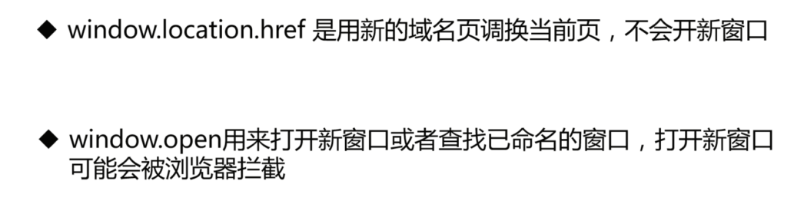
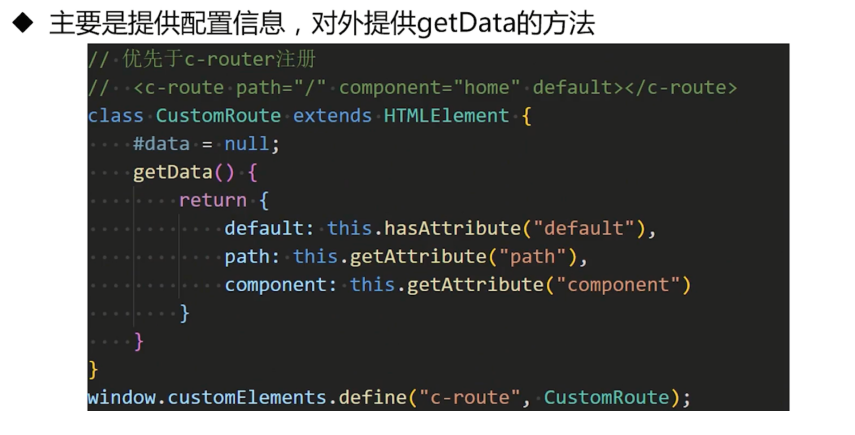

# 被我们忽视的BOM

BOM全称(Browser Object Mode) 浏览器对象模型，是非常重要而又容易被忽视的一个系列


## window ？你还有多少不知道

window 是啥
- 一个包含 DOM 文档的窗口，表示浏览器窗口以及页面可见区域
- 是(global)全局对象，全局变量和函数均都是它的属性。
- 它也是一个全局变量

为什么会有 window.window 这样的设计?
```ts
window === window.window // true
window.window === window.window.window // true
window.window.window === window.window.window.window // true
```
```ts
this === window // true
```

如何输出全局对象上的 aName 属性
```ts
var aName = "global的name";
function a() {
    var aName = "local的name";
    // 想输出全局对象的aName？？？
    console.log();
}
a();
alert("哈哈")
```

为什么会有 window.window 这样的设计?
- `主要是为了方便使用 this`

```ts
this === this.window /*(this即window, 其有window属性) */ === this.window.window
// 去掉this
window === window.window
```

注意是 全局 this 上有 window，不是 window 有 this
```ts
this.window  // Window
window.this  // undefined
```

**Window.isSecureContext**
- 一个布尔值，标识当前上下文是否安全，安全(true) 或不安全(false)
- 这个很重要的一个表现就是网页是不是 https 协议的。
- 浏览器的一些特征是仅仅限于安全上下文执行的
    - https://developer.mozilla.org/en-US/docs/Web/Security/Secure_Contexts/features_restricted_to_secure_contexts
- 不安全的情况：https://w3c.github.io/webappsec-secure-contexts/


例外情况：
- http://127.0.0.1  http://localhost
- http://*.localhost 地址
- file://url

**screenX,screenY**


尺寸：


**iframe 嵌套：window、self、this、parent、top**


三层嵌套的例子：


**open、opener**

window.open
- 定义：可以打开一个新空白窗口或者指定地址的新窗口。
- 语法：
    ```ts
    let windowObjectReference = window.open(strUrl, strWindowName, [strWindowFeatures]);
    ```

window.opener
- 定义：返回当前窗口的那个窗口的引用。
- 注意：如果是同源，可以直接调用其窗口的方法。

**窗体可见性**

- focus + blur

```ts
window.addEventListener("focus", function(){
    console.log("i am focused");
});
window.addEventListener("blur", function(){
    console.log("i am blurred");
})
```

- document.hidden
    - 返回布尔值，表示页面是否隐藏

- document.visibilityState
    - 返回 document 的可见性，由此可以知道当前文档（即为页面）是在背后，或是不可见的隐藏的标签页，或者（正在）预渲染
    - 可用值：visible、hidden、prerender

```ts
console.log(
    "visibilityState:",
    document.visibilityState,
    " hidden:",
    document.hidden,
);
console.log("");
document.addEventListener("visibilitychange", function () {
    console.log(
        "visibilityState:",
        document.visibilityState,
        " hidden:",
        document.hidden
    );
});
```

总结：


**window.devicePixelRatio**


**scrollTo(), scroll(), scrollBy()**


其他滚动方法：
- 设置 scrollTop、scrollLeft 等
- 设置锚点


**window.matchMedia()**

- 可被用于判定 document 是否匹配媒体查询
- 监控一个 document 来判定它匹配了或者停止匹配了此媒体查询

```html
<body>
    <div>
        (min-width: 600px): 
        <span style="color:red" id="mq-value">
        </span>
    </div>
    <script>
        let mql = window.matchMedia('(min-width: 600px)');
        document.querySelector("#mq-value").innerText = mql.matches;

        mql.addEventListener("change", function(){
            mql = window.matchMedia('(min-width: 600px)');
            document.querySelector("#mq-value").innerText = mql.matches;
        })
    </script>
</body>
```

**window.getSelection()**

- 定义：表示用户选择的文本范围或光标的当前位置
- 可以使用 document.activeElement 来返回当前的焦点元素
- 另外一个等价方法 document.getSelection()， 两个方法等价

```html
<body>
    <div>我们都是好孩子，最最善良的孩子。</div>
    <div>好好学习，天天向上。</div>
    <input value="JS高级进阶" />
    <div style="margin-top: 50px"></div>
    选中的内容：
    <div id="selectedContent"></div>
    <script>
        setInterval(function () {
            selectedContent.textContent = window.getSelection().toString();
        }, 3000);
    </script>
</body>
```

**window.frameElement**

- 定义：返回嵌入当前 window 对象的元素(比如 iframe 或者 object)，如果当前 window 对象已经是顶层窗口，则返回 null
- 例子： window.frameElement 获得 iframe 节点，然后这只其 src 属性，实现调整

```ts
setTimeout(function () {
    window.frameElement.src = "./ifr.html"
}, 5000)
```

**网络状态**

- navigator.onLine

```ts
message.innerHTML += `i am ${navigator.onLine ? "online" : "offline"}<br />` ;
window.onoffline = function () {
    message.innerHTML += "i am offline <br />";
}
window.ononline = function () {
    message.innerHTML += "i am online <br />";
}
// window.addEventListener("online", function () {
//     console.log("i am offline");
// })
```

**window.print() 打印**

- 打开打印对话框打印当前文档

```html
<button id="btnPrint">打印</button>
<script>
    btnPrint.addEventListener("click", function () {
        window.print();
    })
</script>
```

window.print 样式设置


```css
@media print {
  .content1 {
    color: green;
    font-size: 18px
  }
}
```

```html
<style media="print">
    .content1 {
        color: green;
        font-size: 18px
    }
    .content2 {
        display: none;
    }
    #btnPrint {
        display: none
    }
</style>
```

```html
<link rel="stylesheet" href="./print.css" media="print">
```

window.print 如何打印局部内容？

- 思路：使用样式隐藏其他内容

思考题：视频可以全屏播放，F11 也可以让我们的文档全屏。我们如果用程序让我们的页面进入全屏呢？

- 全屏 API：https://developer.mozilla.org/zh-CN/docs/Web/API/Fullscreen_API


## 窗口间如何进行亲密接触


**同源策略：**

协议、域名、端口号相同


**WebSocket**

思路：引入第三者进行中转


缺点：需要引入服务端

**定时器 + 客户端存储**

- 思路：本地存储 + 本地轮训


缺点：
- 可能产生副作用：cookie 增加网络负担，FileSystem 数据需求清理
- 不够及时
- 受限于同源策略

**postMessage**

- 思路：用某种手段建立窗口间的联系，通过 postMessage 进行跨窗体通讯
- 优点：不受同源策略的限制
- 缺点：必须拿到对应窗口的引用

```ts
window.addEventListener("message", function (event) {
    // ...    
})

window.parent.postMessage(`message data`);
```

**sessionStorage/localStorage StorageEvent**

- 思路：当前页面使用的 storage 被其他页面修改时触发 StorageEvent 事件

缺点：


```ts
//  A. 发生消息的页面
btnSend.addEventListener('click', function () {
    localStorage.setItem('key', JSON.stringify({
        key: "key",
        data: Math.random()
    }))
})

// B. 监听消息的页面
window.addEventListener("storage", function (ev) {
    console.log("ev:", ev);
    message.textContent = JSON.stringify({
        oldValue: ev.oldValue,
        newValue: ev.newValue
    })
})

// 如果 A 页面也要感知兼容消息，则加以下:

// 拦截，监听事件
const oriSetItem = localStorage.setItem;
Object.defineProperty(localStorage.__proto__, 'setItem', {
    value: function (key, value) {
        var oldValue = localStorage.getItem(key);
        var event = new StorageEvent('storage', {
            key,
            newValue: value,
            oldValue,
            url: document.URL,
            storageArea: localStorage
        });
        window.dispatchEvent(event);
        oriSetItem.apply(this, arguments);
    }
})
```

**BroadcastChannel**

- 允许同源的不同浏览器窗口，Tab页面，frame 或者 iframe 下的不同文档之间相互通信
- 缺点：同源限制

```ts
// A page
var channel = new BroadcastChannel("channel-BroadcastChannel");
channel.postMessage({
    date: new Date().toLocaleString(),
    message,
    from: "page 1"
});

// B page
var channel = new BroadcastChannel("channel-BroadcastChannel");
channel.addEventListener("message", function (ev) {
    console.log(ev.data)
});
```

**MessageChannel**

- Channel Messaging API 的 MessageChannel 接口允许我们创建一个新的消息通道，并通过它的两个 MessagePort 属性发送数据。
- 缺点：需要先建立联系


```ts
// A page
const channel = new MessageChannel();

var ifr = document.querySelector('iframe');
var otherWindow = ifr.contentWindow;

ifr.onload = function () {
    ifr.contentWindow.postMessage('__init__', '*', [channel.port2])
}
// 监听消息
channel.port1.onmessage = onMessage;
function onMessage(e) {
    messages.innerHTML += `
        <div>${event.data}</div>  
    `
}
setInterval(function(){
    channel.port1.postMessage(`message from index.html, ${Date.now()}`)
}, 3000)


// B page
window.addEventListener("message", function (event) {
    if (event.data === "__init__") {
        initChannel( event.ports[0])
    }
})
function initChannel(port) {
    port.onmessage = function (event) {
        messages.innerHTML += `
        <div>${event.data}</div>  
    `;
        port.postMessage(`message from the iframe, ${Date.now()}`);
    }
}
```

**SharedWorker**

- 这是 web Worker 之后出来的共享的 Worker，不同页面可以共享这个 Worker。
- 缺点：兼容性、同源策略

汇总对比：


## location对象几个重要的知识点-


**location对象**


url 拆解：


修改属性值：
```ts
window.location.protocol = 'https';
window.location.host = '127.0.0.1:5500';
window.location.hostname = '127.0.0.1';
window.location.port = '5500';
window.location.pathname = 'test/path';
window.location.search = 'wd=ff';
window.location.hash = '/home';
window.location.href = 'http://127.0.0.1:5500/liveSeverTest.html';
```

注意点：
- location.origin 属性是只读的，存在兼容问题(IE11以下不存在)
- **除 hash ，其他任意属性修改都会以新 URL 重新加载。** 修改这些属性值，会在浏览器的历史记录中生成一条心的历史记录。
- 修改 pathname 的时候可以不用传开头的 / ,修改 search 可以不传 ? , 修改 hash 不用传 #

host vs hostname：
- host 包含端口号
- hostname 只返回域名
- 如果没有端口号的 URL ，两者是相同的

location 四种获取方式:
```ts
console.log(window.location);
console.log(window.document.location);
console.log(document.location);
console.log(location);
```

window.location.reload

- 定义：重新加载当前文档
- 参数：false 或者不传，浏览器可能从缓存中读取页面
- 参数：true，强制从服务器重新下载文档

```ts
location.reload();
```

href vs assign vs replace：


```ts
btnHref.onclick = function () {
    window.location.href = "https://www.imooc.com/";
}
btnAssign.onclick = function () {
    window.location.assign("https://www.imooc.com/");
}
btnReplace.onclick = function () {
    window.location.replace("https://www.imooc.com/");
}
```

location.href vs window.open




hash - 监听方式：

- window.onhashchange = funcRef;
- window.addEventListener("hashchange", funcRef, false); `推荐`
- `<body onhashchange="funcRef" >` (document.body.onhashchange 是可以的， document.body.addEventListener("hashchange", funcRef, false) 是不可以的)

hashChange 应用：HashRouter 实现
- react-router
- vue--router

**URL**


 
**URL.searchParams**


```ts
var urlObj = new URL(window.location.href);
console.log("===", urlObj.searchParams);
console.log(urlObj.searchParams.get("mc_channel"));
```

URL.createObjectURL

```html
<body>
    <textarea id="textareaScript" value="`asdasds`" cols="80" rows="20"></textarea>
    <div>
        <button type="button" id="btnCreateScript">创建脚本</button>
    </div>

    <script>
        textareaScript.value = `;(function(){
            console.log("location.href:", location.href)
        })()`

        btnCreateScript.onclick = function () {
            const scriptContent = textareaScript.value;
            const scriptEL = document.createElement("script");
            const scriptSrc = URL.createObjectURL(new Blob([scriptContent]))
            scriptEL.src = scriptSrc;
            document.body.appendChild(scriptEL);
        }
    </script>
</body>
```

encodeURI & encodeURIComponent 系列：


```ts
const test1 = ";,/?:@&=+$";  // 保留字符
const test2 = "-_.!~*'()";   // 不转义字符
const test3 = "#";           // 数字标志
const test4 = "ABC abc 123"; // 字母数字字符和空格

console.log(encodeURI(test1)); 
console.log(encodeURI(test2)); 
console.log(encodeURI(test3)); 
console.log(encodeURI(test4)); 

console.log("-----------encodeURIComponent------------"); 

console.log(encodeURIComponent(test1)); 
console.log(encodeURIComponent(test2)); 
console.log(encodeURIComponent(test3)); 
console.log(encodeURIComponent(test4)); 
```

使用场景:


```ts
console.log("-----encodeURI使用场景------")

const test1 = "https://www.baidu.com/index.html?wd=慕课网";

console.log("encodeURI:", encodeURI(test1));

console.log("encodeURIComponent:", encodeURIComponent(test1));

console.log("-----encodeURIComponent使用场景------")


// https://www.baidu.com/index.html?go=https://www.imooc.com/
const test2 = "https://www.baidu.com/index.html?go=";

console.log("encodeURIComponent:", test2 + encodeURIComponent("https://www.imooc.com/"));
```


## navigator， 可不止步于设备识别


navigator.userAgent 妙用：

- 获取 userAgent

```ts
console.log(window.navigator.userAgent);

//"Mozilla/5.0 (iPhone; CPU iPhone OS 13_2_3 like Mac OS X) AppleWebKit/605.1.15 (KHTML, like Gecko) Version/13.0.3 Mobile/15E148 Safari/604.1"
```

解析userAgent：[ua-parser-js](https://github.com/faisalman/ua-parser-js)


- 识别是否是微信内置浏览器

```ts
//android
//mozilla/5.0 (linux; u; android 4.1.2; zh-cn; mi-one plus build/jzo54k) applewebkit/534.30 (khtml, like gecko) version/4.0 mobile safari/534.30 micromessenger/5.0.1.352

//ios
//mozilla/5.0 (iphone; cpu iphone os 5_1_1 like mac os x) applewebkit/534.46 (khtml, like gecko) mobile/9b206 micromessenger/5.0

function isWX() {
    var ua = window.navigator.userAgent.toLowerCase();
    return ua.match(/MicroMessenger/i) == "micromessenger";
}

if ("serviceWorker" in navigator) {
    // Supported!
}
```

**navigator.onLine** 在线状态

- 定义：返回浏览器的在线状态，true、false
- 使用：结合 document.ononline 与 document.onoffline 网络变化

```ts
function netChangeStatus(online) {
    const netChangeEl = document.getElementById("net-change");

    if (online) {
        netChangeEl.innerText = `你是在线状态`;
    } else {
        netChangeEl.innerText = `哥们你掉线了`;
    }
}
netChangeStatus(navigator.onLine);

window.addEventListener("online", () => {
    netChangeStatus(true);
});

window.addEventListener("offline", () => {
    netChangeStatus(false);
});
```

**navigator.clipboard 剪切板**

- 定义：返回剪切板对象
- 注意：必须是安全上下文(local,https,wss)
- 注意：window.isSecureContext 检测安全上下文

之前使用 document.execCommand

**navigator.cookieEnabled(cookie)**

- 定义：返回当前页面是否启用了 cookie

**navigator.serviceWorker(service Worker)**

- 定义：返回关联文件的 serviceWorkerContainer 对象，提供对 serviceWorker 的注册，删除，升级和通信访问
- 注意：只能在安全上下文使用

使用场景：
- 后端数据同步
- 集中处理计算成本高的数据更新
- 性能增强，用户预获取用户需要的资源

判断是否支持 serviceWorker
```ts
if ('serviceWorker' in navigator) {
    // 
}
```

**navigator.mediaDevices（媒体设备）**

- 定义：返回一个 mediaDevices 对象，用户获取媒体信息设备
- 应用场景：H5 调用摄像头识别二维码，共享屏幕等

```ts
if (navigator.mediaDevices && navigator.mediaDevices.enumerateDevices) {
    navigator.mediaDevices
    .enumerateDevices()
    .then(function (devices) {
        console.log("devices==",devices)
    })
    .catch(function (err) {
        console.log(err.name + ": " + err.message);
    });
}
```

分享屏幕：
```html
<body>
    <video id="video" style="height: 800px;width: 800px;" autoplay></video>
    <button id="start">开始共享屏幕</button>
    <button id="stop">停止共享屏幕</button>

    <script>
        const mediaOptions = {
            video: {
                cursor: "always"
            },
            audio: false
        };

        let videoElem = document.getElementById("video");

        document.getElementById("start").addEventListener('click', function () {
            startShareScreen();
        });
        
        document.getElementById("stop").addEventListener('click', function () {
            stopShareScreen();
        });

        async function startShareScreen() {
            try {
                videoElem.srcObject = await navigator.mediaDevices.getDisplayMedia(mediaOptions);
            } catch (err) {
                console.error("Error: " + err);
            }
        };

        function stopShareScreen(evt) {
            let tracks = videoElem.srcObject.getTracks();
            tracks.forEach(track => track.stop());
            videoElem.srcObject = null;
        };
    </script>
</body>
```

**navigator.storage （存储）**

- 定义：返回 StorageManager 对象，用于访问浏览器的整体存储能力
- 注意：必须安全上下文
- 应用：获取 storage 的存储大小记忆可分配大小

```ts
navigator.storage.estimate().then(function(estimate) {
    console.log('usage:', estimate.usage)
    console.log('quota:', estimate.quota)
})
```

**navigator.sendBeacon(上报数据)**

- 作用：通过httpPost 将少量的数据异步传到 web 服务器
- 应用：它主要用于将统计数据发送到 web 服务器，同事避免了用传统技术(如：XMLHttpRequest) 发送分析数据的一些问题

```ts
function log() {
    let xhr = new XMLHttpRequest();
    xhr.open('post', 'http://127.0.0.1:3000/report/xhr', true);
    xhr.setRequestHeader('Content-Type', 'application/x-www-form-urlencoded');
    xhr.send('xhr=1');
}

function sendBeacon() {
    const data = new FormData();
    data.append("sendB", 2);
    navigator.sendBeacon(
        'http://127.0.0.1:3000/report/bean',
        data);
}

window.addEventListener('unload', function (event) {
    sendBeacon();
});

window.addEventListener('unload', function (event) {
    log();
});
```

**navigator.connection(网络信息)-实验**

- 定义：返回一个 NetworkInformation 对象，该对象包含网络信息
- 应用：获取当前用户的宽带信息，如网络类型，下载速度等

```ts
navigator.connection
//  {onchange: null, effectiveType: '4g', rtt: 100, downlink: 5.1, saveData: false}
```


**navigator.permissions(权限对象)-实验**

- 定义：返回一个 permissions 对象
- 应用：获取权限信息

```html
<body>
    <button id="btnQuery">查询位置权限</button>
    <button id="btnGetLocation">获取位置信息</button>
    <script>
        btnQuery.onclick = function () {
            navigator.permissions.query({ name: 'geolocation' }).then(function (result) {
                if (result.state === 'granted') {
                    console.log("位置权限 granted");
                } else if (result.state === 'prompt') {
                    console.log("位置权限 prompt");
                }
                console.log("位置权限:", result.state)
            }).catch(err =>{
                console.log("err:", err);
            })
        }
        var options = {
            enableHighAccuracy: true,
            timeout: 1200,
            maximumAge: 0
        };

        btnGetLocation.onclick = function () {
            navigator.geolocation.getCurrentPosition(function (pos) {
                var crd = pos.coords;
                console.log(`Latitude : ${crd.latitude}`);
                console.log(`Longitude: ${crd.longitude}`);
            }, function (err) {
                console.log("error", err)
            }, options)
        }
    </script>
</body>
```

**navigator.mediaSession(共享媒体信息)-实验**

- 返回一个 MediaSession 对象，用来与浏览器共享媒体信息。比如播放状态，标题，封面等
- 应用：通知栏自定义媒体信息


## history，网页端的方向盘


历史记录本质也是一个栈


老四样：


back & forward & length


go：


新四样：


history.pushState
- 语法：history.pushState(state, title[, url]);
- `其会增加历史访问记录(即使 url 为空)，负担不改变页面的内容`
- 新的 URL 跟当前的 URL 必须是 `同源`

history.replaceState
- 语法：history.replaceState(state, title[, url]);
- `是替换浏览记录栈顶部的记录，不会增加栈的深度`
- 新的 URL 跟当前的 URL 必须是 `同源`

window.onpopstate
- 当活动历史记录条目更改时，将触发 popstate 事件
- 调用 history.pushState 或者 history.replaceState 不会触发 window.onpopstate 事件
- window.onpopstate 事件只会在浏览器某些行为下触发，比如点击后退，前进按钮(或者在JS中调用 history.back()、history.forward()、hitory.go()方法)
- a 标签的锚点也会触发该事件

```html
<!DOCTYPE html>
<html lang="en">

<head>
    <meta charset="UTF-8" />
    <meta http-equiv="X-UA-Compatible" content="IE=edge" />
    <meta name="viewport" content="width=device-width, initial-scale=1.0" />
    <title>history新四样</title>
    <style>
        * {
            font-size: 28px;
        }
    </style>
</head>

<body>
    <div>
        state:
        <div id="stateValue"></div>
        <div>历史记录长度:<span id="hlength"></span></div>
    </div>
    <div>
        <br />
        <a href="#index">#index</a><br />
        <button type="button" id="btnPushState">pushState</button><br />
        <button type="button" id="btnReplaceState">replaceState</button><br />
    </div>

    <script>
        let index = 0;
        hlength.textContent = history.length;
        btnPushState.onclick = function (ev) {
            index++;
            history.pushState(
                { data: "pushState" + index },
                "",
                `/pushState${index}.html`
            );
            hlength.textContent = history.length;
        };

        btnReplaceState.onclick = function (ev) {
            history.replaceState(
                { data: "replaceState" },
                "",
                "/replaceState.html"
            );
            hlength.textContent = history.length;
        };

        window.onpopstate = function (ev) {
            console.log("onpopstate:");
            stateValue.textContent = JSON.stringify(ev.state);
            hlength.textContent = history.length;
        };
    </script>
</body>

</html>
```

刷新的问题：
- history.pushState 方案，刷新的时候需要服务端的配合
- 方案：不管你访问的路由是啥，我都返回同一份 index.html

## 实战：从0到1手写一个简易 Router

一个简单的 Router 应该具备那些功能: vue


一个简单的 Router 应该具备那些功能: react


总结：
- 容器组件
- 路由
- 业务组件 & 链接组件

不借助第三方工具库，如何实现路由呢
- 如何实现自定义的标签，比如 vue 的 <route-view>，raect 的 <Router>
- 如何实现业务组件
- 如何动态切换路由 

实现思路：
- 自定义标签： web components


架构图：


CustomLink(c-link):


CustomRoute(c-route):



CustomRouter(c-router):


CustomComponent(c-component):


动态加载组件并解析 loadComponent:


重写 history.pushState:


**完整 router.js**
```ts
const oriPushState = history.pushState;
// 重写pushState
history.pushState = function (state, title, url) {
    // 触发原事件
    oriPushState.apply(history, [state, title, url]);
    // 自定义事件
    var event = new CustomEvent("c-popstate", {
        detail: {
            state,
            title,
            url
        }
    });
    window.dispatchEvent(event);
}

//  <c-link to="/" class="c-link">首页</c-link>
class CustomLink extends HTMLElement {
    connectedCallback() {
        this.addEventListener("click", ev => {
            ev.preventDefault();
            const to = this.getAttribute("to");
            // 更新浏览器历史记录
            history.pushState("", "", to)
        })

    }
}
window.customElements.define("c-link", CustomLink);

// 优先于c-router注册
//  <c-route path="/" component="home" default></c-route>
class CustomRoute extends HTMLElement {
    #data = null;
    getData() {
        return {
            default: this.hasAttribute("default"),
            path: this.getAttribute("path"),
            component: this.getAttribute("component")
        }
    }
}
window.customElements.define("c-route", CustomRoute);

// 容器组件
class CustomComponent extends HTMLElement {
    async connectedCallback() {
        console.log("c-component connected");
        // 获取组件的path，即html的路径
        const strPath = this.getAttribute("path");
        // 加载html
        const cInfos = await loadComponent(strPath);
        const shadow = this.attachShadow({ mode: "closed" });
        // 添加html对应的内容
        this.#addElements(shadow, cInfos);
    }

    #addElements(shadow, info) {
        // 添加模板内容
        if (info.template) {
            shadow.appendChild(info.template.content.cloneNode(true));
        }
        // 添加脚本
        if (info.script) {
            // 防止全局污染，并获得根节点
            var fun = new Function(`${info.script.textContent}`);
            // 绑定脚本的this为当前的影子根节点
            fun.bind(shadow)()
        }
        // 添加样式
        if (info.style) {
            shadow.appendChild(info.style);
        }
    }
}
window.customElements.define("c-component", CustomComponent);

//  <c-router>
class CustomRouter extends HTMLElement {
    // 私有变量
    #routes
    connectedCallback() {
        // const shadow = this.attachShadow({ mode: "open" });
        const routeNodes = this.querySelectorAll("c-route");
        // debugger;
        console.log("routes:", routeNodes)

        // 获取子节点的路由信息
        this.#routes = Array.from(routeNodes).map(node => node.getData());
        // 查找默认的路由
        const defaultRoute = this.#routes.find(r => r.default) || this.#routes[0];
        // 渲染对应的路由
        this.#onRenderRoute(defaultRoute);
        // 监听路由变化
        this.#listenerHistory();
    }

    // 渲染路由对应的内容
    #onRenderRoute(route) {
        var el = document.createElement("c-component");
        el.setAttribute("path", `/${route.component}.html`);
        el.id = "_route_";
        this.append(el);
    }

    // 卸载路由清理工作
    #onUnloadRoute(route) {
        this.removeChild(this.querySelector("#_route_"))
    }

    // 监听路由变化
    #listenerHistory() {
        // 导航的路由切换
        window.addEventListener("popstate", ev => {
            console.log("onpopstate:", ev)
            const url = location.pathname.endsWith(".html") ? "/" : location.pathname;
            const route = this.#getRoute(this.#routes, url);
            this.#onUnloadRoute();
            this.#onRenderRoute(route);
        });
        // pushState或者replaceState
        window.addEventListener("c-popstate", ev => {
            console.log("c-popstate:", ev)
            const detail = ev.detail;
            const route = this.#getRoute(this.#routes, detail.url);
            this.#onUnloadRoute();
            this.#onRenderRoute(route);
        })
    }


    // 路由查找
    #getRoute(routes, url) {
        return routes.find(function (r) {
            const path = r.path;
            const strPaths = path.split("/");
            const strUrlPaths = url.split("/");

            let match = true;
            for (let i = 0; i < strPaths.length; i++) {
                if (strPaths[i].startsWith(":")) {
                    continue;
                }
                match = strPaths[i] === strUrlPaths[i]
                if (!match) {
                    break;
                }
            }
            return match
        })
    }
}
window.customElements.define("c-router", CustomRouter);

// 动态加载组件并解析
async function loadComponent(path, name) {
    this.caches = this.caches || {};
    // 缓存存在，直接返回
    if (!!this.caches[path]) {
        return this.caches[path]
    }
    const res = await fetch(path).then(res => res.text());
    // 利用DOMParser效验
    const parser = new DOMParser();
    const doc = parser.parseFromString(res, "text/html");
    // 解析模板，脚本，样式
    const template = doc.querySelector("template");
    const script = doc.querySelector("script");
    const style = doc.querySelector("style");
    // 缓存内容
    this.caches[path] = {
        template,
        script,
        style
    }
    return this.caches[path]
}
```
