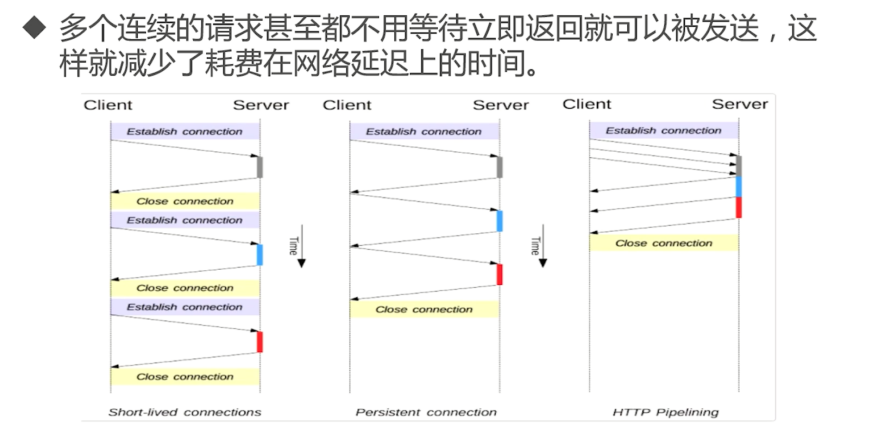
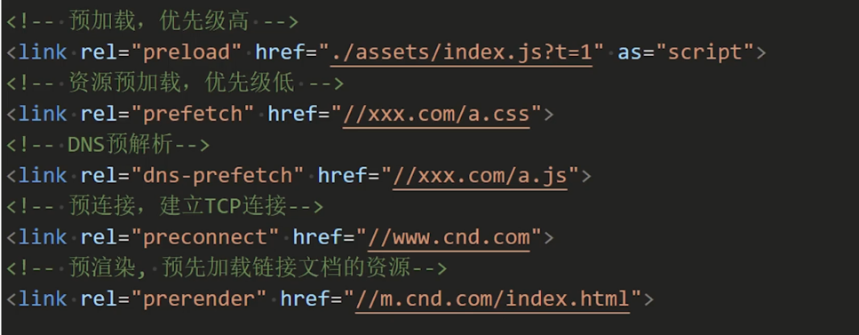
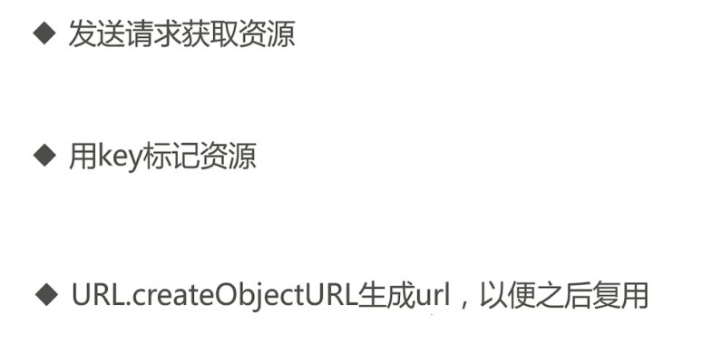

# 深入探索网络请求

深入了解ajax和fetch，了解各自的优缺点。并掌握前端最常见的跨域，大文件上传，网络请求取消等等问题

## HTTP必备知识


**HTTP 简介**


**HTTP 0.9 (1991)**


**HTTP 1.0 (1996)**


**HTTP 1.1 (1997)**

长连接：


管道化技术：


支持响应分块：


新的缓存控制机制：


**HTTP 1.x 报文**

请求报文：


响应报文：


**常用状态码**


**必须知道的 header 头：请求头**


**必须知道的 header 头：响应头**


**application/x-www-form-urlencoded**


```ts
function fetchByUrlencoded() {
    fetch("/urlencoded", {
        method: "POST",
        headers: {
            "Content-Type": "application/x-www-form-urlencoded",
        },
        body: "name=tom&age=18"
    }).then(res => res.json())
        .then(res => {
            console.log("收到结果:", res);
            result.innerHTML = JSON.stringify(res);
        })
}
```

```ts
function fetchByUrlencoded() {
    // 对中文还能自行编码
    const params = new URLSearchParams({
        name: 'tom',
        age: 18
    });
    fetch("/urlencoded", {
        method: "POST",
        headers: {
            "Content-Type": "application/x-www-form-urlencoded",
        },
        body: params.toString()
    }).then(res => res.json())
        .then(res => {
            console.log("收到结果:", res);
            result.innerHTML = JSON.stringify(res);
        })
}
```


**multipart/form-data**


```html
<form action="/multipart" method="post" enctype="multipart/form-data">
    <input type="text" name="name" value="tom">

    <input type="text" name="age" value="18">

    <button type="submit">提交表单</button>
</form>
```

```ts
function fetchByMultipart() {
    const formData = new FormData();
    formData.append('name', "tom");
    formData.append('age', 18)

    fetch("/multipart", {
        method: "POST",
        // 不要设置 content-tyoe
        // headers: {
        //     "Content-Type": "multipart/form-data",
        // },
        body: formData
    }).then(res => res.json())
        .then(res => {
            console.log("收到结果:", res);
            result.innerHTML = JSON.stringify(res);
        })
}
```

**multipart/json**


```ts
function fetchByJSON() {
    fetch("/json", {
        method: "POST",
        headers: {
            "Content-Type": "application/json",
        },
        body: JSON.stringify({ name: "tom", age: 18 })
    }).
        then(res => {
            console.log("返回的content-type:", res.headers.get("Content-Type"));
            return res;
        })
        .then(res => res.json())
        .then(res => {
            console.log("收到结果:", res);
            result.innerHTML = JSON.stringify(res);
        })
}
```

**HTTPS**


**HTTP2**

- 二进制帧
- 多路复用
- 头部压缩
- 服务器推送

**HTTP3**

- 基于 UDP 的传输层协议，那就是快啊

## ajax and fetch，都没你想得那么美

**AJax 发展史**


**Ajax 技术集合**


**XHR（XMLHttpRequest）简史**


**XMLHttpRequest 属性解读**


**XHR 使用**


```ts
function test() {
    //1. 创建实例对象
    var xhrObj = new XMLHttpRequest();
    
    //注册readystatechange回调监听
    xhrObj.onreadystatechange = function () {
        console.log("xhrObj.readyState==",xhrObj.readyState);
        console.log("xhrObj.status==",xhrObj.status);
        //readyState==4 && status=200 代表请求成功
        if (xhrObj.readyState == 4 && xhrObj.status == 200) {
            //局部刷新文本
            document.getElementById("responseDiv").innerHTML = xhrObj.responseText;
        }
    };

    //请求错误回调
    xhrObj.onerror = function () {
        console.log("-------onerror-------:")
    };

    //请求成功完成回调
    xhrObj.onload = function () {
        console.log("-------onload-------:",xhrObj.responseText)
    };

    //请求开始回调
    xhrObj.onloadstart = function () {
        console.log("-------onloadstart-------")
    };

    //请求完成回调，不论请求成功与否
    xhrObj.onloadend = function () {
        console.log("-------onloadend-------")
    };


    //设置请求地址,true 异步请求，false:同步请求，
    xhrObj.open("post", "http://127.0.0.1:3000/xhr", true);
    //设置请求携带header
    xhrObj.setRequestHeader("Content-Type", "application/x-www-form-urlencoded");
    //发送请求数据
    xhrObj.send("xhr=1");
}
```

XHR(传统 Ajax)缺点：


**Fetch 诞生**


**Fetch 设计**


优点：


**优雅使用**


```ts
// get 
fetch("http://127.0.0.1:3000/test1")
    .then((response) => response.text())
    .then((text) => console.log("获取到的数据对象===", text))
    .catch((err) => console.log("Request Failed", err));


//post
fetch("http://127.0.0.1:3000/report",{
    method:"POST",
    headers:{
        "Content-Type": "application/x-www-form-urlencoded;"
    },
    body:"report=2",
    mode: 'cors' //设置跨域
})
.then((response) => response.json())
.then((json) => console.log("post 获取到的数据对象===", json))
.catch((err) => console.log("Request Failed", err));
```

**Fetch VS XHR**

1. 缺少中断请求
    - 使用其他 API 实现(AbortController 和 AbortSignal)
2. 缺少读取请求传输进度的能力，例如 XHR 的 OnProgress 事件
3. 使用 Response.body 给我们返回了一个 ReadableStream 对象
4. 兼容性问题
5. 不支持超时
    - 使用 setTimeout 自己封装
6. 同源携带 cookie，不同源不携带 cookie(XHR与Fetch相同)
7. 错误不会被拒绝(promise reject 400-500)，并不会触发 Promise 的 reject 回调


进度实现：
```ts
let progress = 0;
let contentLength = 0;

fetch("./test.mp4")
    .then((response) => {
        // 通过响应头获取文件大小
        contentLength = response.headers.get("Content-Length");
        const reader = response.body.getReader();

        return reader.read().then(function processResult(result) {
            if (result.done) {
                console.log("请求完毕");
                return;
            }

            progress += result.value.byteLength;
            console.log("total:",contentLength,"=progress:",progress,"==%:",(progress / contentLength) * 100 + "%");

            return reader.read().then(processResult);
        });
    })
    .catch((err) => console.log("Request Failed", err));
```

超时：
```ts
const oldFetch = fetch;
window.fetch = function (input, opts) {
    return new Promise(function (resolve, reject) {
        //开启超时
        const timeoutId = setTimeout(function () {
            reject(new Error("fetch timeout"));
        }, opts.timeout);
        oldFetch(input, opts).then(
            (res) => {
                //清除超时
                clearTimeout(timeoutId);
                resolve(res);
            },
            (err) => {
                //清除超时
                clearTimeout(timeoutId);
                reject(err);
            }
        );
    });
};

function test() {
    // get 
    fetch("http://127.0.0.1:3000/timeout", { timeout: 5 * 1000 })
        .then((response) => response.text())
        .then((text) => console.log("获取到的数据对象===", text))
        .catch((err) => console.error("Request Failed", err));
}
```

**选择 XHR 还是 Fetch**


**Axios 推荐**

- Axios 是一个基于 Promise 的网络请求库，作用于 Nodejs 和浏览器中
- 客户端：XMLHttpRequest 进行二次封装
- 服务端：使用Nodejs Http 模块

**Fetch 和 Axios/Ajax 的关系**


## 同源策略和跨域请求不烦恼

**同源策略**


同源策略下限制：


跨域网络访问：


不同源窗口/文档交流


**网络跨域解决方案**

1. JSONP


jsonp 缺点：
- 只支持 GET 请求，不支持 POST 等其他类型 HTTP 请求
- JSONP 存在明显的安全问题

2. CORS


简单请求：


复杂请求：


CORS 注意事项：


CORS 服务端配置：


```ts

let whitList = ['http://127.0.0.1:5500'] //设置白名单

//设置跨域访问
app.use(function (req: any, res: any, next: any) {
    const origin = req.headers.origin as string;
    if (whitList.includes(origin)) {
        //设置允许跨域的域名，*代表允许任意域名跨域
        res.header("Access-Control-Allow-Origin", "*");
        //允许携带凭证
        res.header("Access-Control-Allow-Credentials", 'true');
        //允许的header类型
        res.header("Access-Control-Allow-Headers", ["X-PINGOTHER", "content-type", "Origin", "Accept"]);
        //允许浏览器获取的请求头
        res.header("Access-Control-Expose-Headers", "test");
        //跨域允许的请求方式 
        res.header("Access-Control-Allow-Methods", "DELETE,PUT,POST,GET,OPTIONS");
        //预检结果保存时间 1小时
        res.header("Access-Control-Max-Age", `${5}`);
        if (req.method.toLowerCase() == 'options') {
            res.send(204);  //让options尝试请求快速结束
            return;
        }
    }
    next();
});
```

CORS 服务端配置：(中间件)

```ts
const cors = require('cors');

let whitList = ['http://127.0.0.1:5500'] //设置白名单

var corsOptions = {
    origin: function (origin, callback) {
        if (whitList.indexOf(origin) !== -1) {
            callback(null, true)
        } else {
            callback(new Error('Not allowed by CORS'))
        }
    },
    credentials: true,
    maxAge: 20,
    allowedHeaders: ["X-PINGOTHER", "content-type", "Origin", "Accept"]
}

app.use(cors(corsOptions));
```

什么情况下需要使用 CORS？


CSS url 跨域：
```css
img {
    float: left;
    /* shape-outside: url(./a.png); */
    shape-outside: url("http://127.0.0.1:8080/a.png");
    shape-image-threshold: .2;
    shape-margin: 20px;
}
```

3. 正向代理


常见正向代理


4. 反向代理


5. WebSocket


**网络跨域解决方案 - 总结**


Access-Control-Allow-Origin 异常"背锅"
- 服务器突然重启
- 服务器宕机
- 服务器报错


## 文件上传 & 后悔药：网络请求的取消

**网络请求的取消**

- XMLHttpRequest

XMLHttpRequest.abort()

```ts
xhrObj = new XMLHttpRequest();
xhrObj.withCredentials = true;
xhrObj.onreadystatechange = function () {
    console.log("onreadystatechange: status=", xhrObj.status, xhrObj.readyState, xhrObj );
    if (xhrObj.readyState == 4 && xhrObj.status == 200) {
    console.log(xhrObj.responseText);
    }
};
xhrObj.open("post", "http://127.0.0.1:3000/xhr", true);
xhrObj.send();

// 取消请求
xhrObj.abort();
```

- fetch

AbortController 对象的 abort()

```ts
const controller = new AbortController();
const signal = controller.signal;

function sendFetch(test) {
fetch("http://127.0.0.1:3000/fetch", { signal })
    .then((response) => {
    return response.text();
    })
    .then((text) => {
    console.log(text);
    });
}

btnSend.onclick = function () {
sendFetch();
};

btnCancel.onclick = function () {
console.log("取消请求");
controller.abort();
};
```

- Axios

AbortController 对象的 abort()

```ts
const controller = new AbortController();

axios.get('/foo/bar', {
   signal: controller.signal
}).then(function(response) {
   //...
});
// cancel the request
controller.abort()
```

```ts
const CancelToken = axios.CancelToken;
const source = CancelToken.source();

axios.get('/user/12345', {
  cancelToken: source.token
}).catch(function (thrown) {
  if (axios.isCancel(thrown)) {
    console.log('Request canceled', thrown.message);
  } else {
    // handle error
  }
});

// cancel the request (the message parameter is optional)
source.cancel('Operation canceled by the user.');
```

```ts
const CancelToken = axios.CancelToken;
let cancel;

axios.get('/user/12345', {
  cancelToken: new CancelToken(function executor(c) {
    // An executor function receives a cancel function as a parameter
    cancel = c;
  })
});

// cancel the request
cancel();
```

**文件上传思路**


File 为特殊 Blob 对象


**单文件上传**

客户端

```html
<input id="uploadFile" type="file" accept="image/*" />
```

- type 属性 file，用户选择文件
- accept 属性，规定选择文件的类型


```html
<!DOCTYPE html>
<html lang="en">
  <head>
    <meta charset="UTF-8" />
    <meta http-equiv="X-UA-Compatible" content="IE=edge" />
    <meta name="viewport" content="width=device-width, initial-scale=1.0" />
    <title>上传单个文件</title>
    <style>
      * {
        font-size: 28px;
      }
    </style>
  </head>

  <body>
    <input id="uploadFile" type="file" accept="image/*" />

    <button type="button" id="uploadBtn" onClick="startUpload()">
      开始上传
    </button>
    <div class="progress">上传进度：<span id="progressValue">0</span></div>

    <div id="uploadResult" class="result"></div>

    <script>
      const uploadFileEle = document.getElementById("uploadFile");
      const progressValueEle = document.getElementById("progressValue");
      const uploadResultEle = document.getElementById("uploadResult");

      try {
        function startUpload() {
          if (!uploadFileEle.files.length) return;
          //获取文件
          const file = uploadFileEle.files[0];
          //创建上传数据
          const formData = new FormData();
          formData.append("file", file);
          //上传文件
          this.upload(formData);
        }

        function upload(data) {
          const xhr = new XMLHttpRequest();
          xhr.onreadystatechange = function () {
            if (xhr.readyState === 4 && xhr.status === 200) {
              const result = JSON.parse(xhr.responseText);
              console.log("result:", result);
              uploadResultEle.innerText = xhr.responseText;
            }
          };

          // onprogress 时，为复杂请求，会有预检请求
          xhr.upload.onprogress = function (event) {
            if (event.lengthComputable) {
              progressValueEle.innerText =
                Math.ceil((event.loaded * 100) / event.total) + "%";
            }
          };

          xhr.open("POST", "http://127.0.0.1:3000/upload", true);
          xhr.send(data);
        }
      } catch (e) {
        console.log("error==", e);
      }
    </script>
  </body>
</html>
```

服务端：

- 客户端使用 form-data 传递，服务端以相同方式接受
- multer 库用来处理 multipart/form-data


```ts
import http from "http";
import bodyParser from "body-parser";
import express from "express";
import path = require("path");
import createError from "http-errors";
const multer = require("multer");

const port = 3000;

const app = express();

// 上传成功后返回URL地址
const resourceUrl = `http://127.0.0.1:${port}/`;

// 存储文件目录
const uploadDIr = path.join(__dirname, "/upload");

// destination 设置资源保存路径，filename 设置资源名称
const storage = multer.diskStorage({
  destination: async function (_req, _file, cb) {
    cb(null, uploadDIr);
  },
  filename: function (_req, file, cb) {
    // 设置文件名
    cb(null, `${file.originalname}`);
  },
});

const multerUpload = multer({ storage });

//设置静态访问目录
app.use(express.static(uploadDIr));

app.use(bodyParser.urlencoded({ extended: true }));
const server = http.createServer(app);

//设置跨域访问
app.use(function (req, res, next) {
  //设置允许跨域的域名，*代表允许任意域名跨域
  //"*"
  res.header("Access-Control-Allow-Origin", req.headers.origin);
  //允许携带cookie
  res.header("Access-Control-Allow-Credentials", "true");
  //允许的header类型
  res.header("Access-Control-Allow-Headers", ["content-type", "Origin"]);
  //跨域允许的请求方式
  res.header("Access-Control-Allow-Methods", "DELETE,PUT,POST,GET,OPTIONS");

  res.header("Access-Control-Max-Age", `${20}`);
  if (req.method.toLowerCase() == "options") res.send(200);
  //让options尝试请求快速结束
  else next();
});

app.post("/upload", multerUpload.any(), function (req, res, _next) {
  // req.file 是 `avatar` 文件的信息

  let urls = [];
  //获取所有已上传的文件
  const files = (req as any).files;

  if (files && files.length > 0) {
    //遍历生成url 集合返回给客户端
    urls = files.map((item, _key) => {
      return resourceUrl + item.originalname;
    });
  }

  return res.json({
    REV: true,
    DATA: {
      url: urls,
    },
    MSG: "成功",
  });
});

server.listen(port, () => {
  console.log("监听端口:", port);
});

app.use(
  (
    _req: express.Request,
    _res: express.Response,
    next: express.NextFunction
  ) => {
    const error = createError(404);
    next(error);
  }
);

process.on(
  "unhandledRejection",
  (reason: {} | null | undefined, p: Promise<any>) => {
    console.error("自定义错误 Unhandled Rejection at:", p, "reason:", reason);
    // application specific logging, throwing an error, or other logic here
  }
);
```

**多文件上传**

- input 属性： multiple 是否允许多个值(相关类型 email, file)

```html
<!DOCTYPE html>
<html lang="en">
  <head>
    <meta charset="UTF-8" />
    <meta http-equiv="X-UA-Compatible" content="IE=edge" />
    <meta name="viewport" content="width=device-width, initial-scale=1.0" />
    <title>上传多个文件</title>
    <style>
      * {
        font-size: 28px;
      }
    </style>
  </head>

  <body>
    <input id="uploadFile" type="file" accept="image/*" multiple />
    <button id="uploadBtn" onClick="startUpload()">开始上传</button>
    <div class="progress">上传进度：<span id="progressValue">0</span></div>

    <div id="uploadResult" class="result"></div>

    <script>
      const uploadFileEle = document.getElementById("uploadFile");
      const progressValueEle = document.getElementById("progressValue");
      const uploadResultEle = document.getElementById("uploadResult");

      try {
        function startUpload() {
          if (!uploadFileEle.files.length) return;
          //获取文件
          const files = uploadFileEle.files;
          const formData = this.getUploadData(files);
          this.upload(formData);
        }

        //添加多个文件
        function getUploadData(files) {
          const formData = new FormData();
          for (let i = 0; i < files.length; i++) {
            const file = files[i];
            formData.append(file.name, file);
          }
          return formData;
        }

        function upload(data) {
          const xhr = new XMLHttpRequest();
          xhr.onreadystatechange = function () {
            if (xhr.readyState === 4 && xhr.status === 200) {
              const result = JSON.parse(xhr.responseText);
              console.log("result:", result);
              uploadResultEle.innerText = xhr.responseText;
            }
          };

          xhr.upload.addEventListener(
            "progress",
            function (event) {
              if (event.lengthComputable) {
                progressValueEle.innerText =
                  Math.ceil((event.loaded * 100) / event.total) + "%";
              }
            },
            false
          );

          xhr.open("POST", "http://127.0.0.1:3000/upload", true);
          xhr.send(data);
        }
      } catch (e) {
        console.log("error==", e);
      }
    </script>
  </body>
</html>
```

**大文件上传**

客户端


文件切片：

```ts
/**
 * 文件分片
 * @param {*} file 文件
 * @param {*} chunkSize 分片大小
 * @returns 
 */
const handleFileChunk = function (file, chunkSize) {
    const fileChunkList = [];
    // 索引值
    let curIndex = 0;
    while (curIndex < file.size) {
        //最后一个切片以实际结束大小为准。
        const endIndex = curIndex + chunkSize < file.size ? curIndex + chunkSize : file.size;
        const curFileChunkFile = file.slice(curIndex, endIndex);
        curIndex += chunkSize;
        fileChunkList.push({ file: curFileChunkFile })
    }
    return fileChunkList;
};
```

大文件 hash：

```ts
/**
 * 
 * 获取全部文件内容hash
 * @param {any} fileList 
 */
async function getFileHash2(file) {

    console.time("filehash")
    const spark = new SparkMD5.ArrayBuffer();
    //获取全部内容
    const content = await getFileContent(file)
    try {
        spark.append(content);
        //生成指纹
        const result =  spark.end();
        console.timeEnd("filehash")
        return result;
    } catch (e) {
        console.log(e);
    }
}


/**
 * 
 * 获取文件内容
 * @param {any} file 
 * @returns 
 */
function getFileContent(file) {
    return new Promise((resolve, reject) => {
        const fileReader = new FileReader();
        //读取文件内容
        fileReader.readAsArrayBuffer(file);
        fileReader.onload = (e) => {
            //返回读取到的文件内容
            resolve(e.target.result);
        };
        fileReader.onerror = (e) => {
            reject(fileReader.error);
            fileReader.abort();
        };
    });
}
```

生成切片信息：

```ts
//给每个切片添加辅助内容信息
const chunksInfo = fileList.map(({ file }, index) => ({
    //整个文件hash
    fileHash: containerHash,
    //当前是第几个切片
    index,
    //文件个数
    fileCount: fileList.length,
    //当前切片的hash
    hash: containerHash + "-" + index,
    //切片内容
    chunk: file,
    //文件总体大小
    totalSize: bigFile.size,
    //单个文件大小
    size: file.size
}));
```

封装单个请求：
```ts
/**
 * 
 * 单个文件上传
 * @param {any} {
 *     url,
 *     method="post",
 *     data,
 *     headers={},
 * } 
 * @returns 
 */
function singleRequest({
    url,
    method = "post",
    data,
    headers = {},
}) {
    return new Promise(resolve => {
        const xhr = new XMLHttpRequest();
        xhr.open(method, url);
        Object.keys(headers).forEach(key =>
            xhr.setRequestHeader(key, headers[key])
        );
        xhr.send(data);
        xhr.onload = e => {
            resolve({
                data: e.target.response
            });
        };
    });
}
```

上传所有切片：

```ts
/**
 * 
 * 上传所有的分片
 * @param {any} chunks 
 * @param {any} fileName 
 */
async function uploadChunks(chunks, fileName) {
    const requestList = chunks
        .map(({ chunk, hash, fileHash, index, fileCount, size, totalSize }) => {
            //生成每个切片上传的信息
            const formData = new FormData();
            formData.append("hash", hash);
            formData.append("index", index);
            formData.append("fileCount", fileCount);
            formData.append("size", size);
            formData.append("splitSize", DefaultChunkSize);
            formData.append("fileName", fileName);
            formData.append("fileHash", fileHash);
            formData.append("chunk", chunk);
            formData.append("totalSize", totalSize);
            return { formData, index };
        })
        .map(async ({ formData, index }) =>
            singleRequest({
                url: "http://127.0.0.1:3000/uploadBigFile",
                data: formData,
            })
        );
    //全部上传
    await Promise.all(requestList);
}
```

服务端：


检查文件 hash：

```ts
const chunkDir = path.resolve(uploadDIr, fileHash);

// 大文件存在直接返回,根据内容hash存储，可以实现后续秒传
if (fse.existsSync(filePath)) {
    return res.json({
        code: 1000,
        data: { url: `${resourceUrl}${saveFileName}` },
        msg: "上传文件已存在"
    });
}
```

保存切片：
```ts
// 切片目录不存在，创建切片目录
if (!fse.existsSync(chunkDir)) {
    await fse.mkdirs(chunkDir);
}

const chunkFile = path.resolve(chunkDir, hash);
if (!fse.existsSync(chunkFile)) {
    await fse.move(chunk.path, path.resolve(chunkDir, hash));
}
```

检查切片是否可以合并:
```ts
/**
 * 
 * 检查切片是否可以合并
 * @export
 * @param {any} pathName 切片存储目录
 * @param {any} totalCount 大文件包含切片个数
 * @param {any} hash 大文件hash
 * @returns 
 */
export function checkFileIsMerge(pathName, totalCount, hash) {
    var dirs = [];
    //同步读取切片存储目录
    const readDir = fse.readdirSync(pathName);
    //判断目录下切片数量 小于 总切片数，不能合并
    if (readDir && readDir.length < totalCount) return false;
    //获取目录下所有真正属于该文件的切片，以大文件hash为准
    (function iterator(i) {
        if (i == readDir.length) {
            return;
        }
        const curFile = fse.statSync(path.join(pathName, readDir[i]));
        //提出目录和文件名不包含大文件hash的文件
        if (curFile.isFile() && readDir[i].includes(hash + "")) {
            dirs.push(readDir[i]);
        }
        iterator(i + 1);
    })(0);
    //数量一致，可以合并
    if (dirs.length === totalCount) {
        return true;
    }
    return false;
}
```

合并：
```ts
/**
 * 
 * 合并所有切片
 * @export
 * @param {any} {
 *     filePath:文件路径包含后缀名
 *     fileHash:文件hash
 *     chunkDir:切片存放的临时目录
 *     splitSize:每个切片的大小
 *     fileCount:文件总个数
 *     totalSize:文件总大小
 * } 
 * @returns 
 */
export async function chunkMerge({
    filePath,
    fileHash,
    chunkDir,
    splitSize,
    fileCount,
    totalSize,
}) {
    const chunkPaths = await fse.readdir(chunkDir);
    //帅选合适的切片
    const filterPath = chunkPaths.filter((item) => {
        return item.includes(fileHash);
    });
    //数量不对，抛出错误
    if (filterPath.length !== fileCount) {
        console.log("合并错误");
        return;
    }
    // 根据切片下标进行排序,方便合并
    filterPath.sort((a, b) => a.split("-")[1] - b.split("-")[1]);
    await Promise.all(
        chunkPaths.map((chunkPath, index) => {
            //并发写入，需要知道开始和结束位置
            let end = (index + 1) * splitSize;
            if (index === fileCount - 1) {
                end = totalSize + 1;
            }
            return pipeStream(
                path.resolve(chunkDir, chunkPath),
                // 指定位置创建可写流
                fse.createWriteStream(filePath, {
                    start: index * splitSize,
                    end: end,
                })
            );
        })
    );
    //删除所有切片
    // fse.rmdirSync(chunkDir); // 合并后删除保存切片的目录
    return filePath;
}
```

大文件上传-思考：
- 大文件如何实现断电续传
- 上传进度如何实现
- 内容 hash 的速度怎么提升


## 资源加载知多少


页面加载流程：


渲染流程：


页面加载时间：
- 开发者工具可以查看页面的加载时间


**Navigation Timing API**


JS的对象模型：PerformanceTiming 等
```ts
performance.timing

// connectEnd: 1655122577563
// connectStart: 1655122577297
// domComplete: 1655122582140
// domContentLoadedEventEnd: 1655122579442
// domContentLoadedEventStart: 1655122579389
// domInteractive: 1655122579389
// domLoading: 1655122577920
// domainLookupEnd: 1655122577278
// domainLookupStart: 1655122577278
// fetchStart: 1655122577278
// loadEventEnd: 1655122582151
// loadEventStart: 1655122582142
// navigationStart: 1655122576970
// redirectEnd: 0
// redirectStart: 0
// requestStart: 1655122577563
// responseEnd: 1655122577906
// responseStart: 1655122577903
// secureConnectionStart: 1655122577325
// unloadEventEnd: 0
// unloadEventStart: 0
// [[Prototype]]: PerformanceTiming
```


**资源加载的时间 - Resource Timing API**


```ts
performance.getEntriesByType('resource')
```

**获取全部加载性能数据**

```ts
performance.getEntries()
```

**用代码统计页面和资源加载性能**

```ts
function getPerformanceEntries() {
    var p = performance.getEntries();
    for (var i = 0; i < p.length; i++) {
    console.log(p[i]);
    printPerformanceEntry(p[i]);
    }
}
function printPerformanceEntry(perfEntry) {
    var properties = ["name", "entryType", "startTime", "duration"];
    if (perfEntry.entryType === "navigation") {
    result.innerHTML += `
        <div>资源:${perfEntry.name}</div>
        <div>加载时间:${perfEntry.responseEnd - perfEntry.startTime}</div><hr>
    `;
    } else if (perfEntry.entryType == "resource") {
    result.innerHTML += `
        <div>资源:${perfEntry.name}</div>
        <div>加载时间:${perfEntry.duration}</div>
        <hr>
    `;
    }
}

getPerformanceEntries();
```

**资源加载优先级**


谷歌文档中的描述：


注意事项：


自定义优先级：


**CSS 不阻塞DOM 的解析，阻塞页面渲染**


**JS 的执行阻塞 DOM 的解析**


**pre系列**


**dns-prefetch**


pre 示例一览：



**图片的加载**


懒加载 - IntersectionObserver：
```html
<!DOCTYPE html>
<html lang="en">
  <head>
    <meta charset="UTF-8" />
    <meta http-equiv="X-UA-Compatible" content="IE=edge" />
    <meta name="viewport" content="width=device-width, initial-scale=1.0" />
    <title>Document</title>
    <style>
      #imgContainers {
        border: 1px solid #333;
        height: 400px;
        width: 500px;
        overflow: auto;
      }

      #imgContainers img {
        border: 1px solid #666;
        width: 400px;
        height: 400px;
        display: block;
      }
    </style>
  </head>

  <body>
    <div id="imgContainers">
      
      
      
      
      
      
      
      
    </div>

    <script>
      window.onload = function () {
        var imagesCol = imgContainers.querySelectorAll("img[data-src]");

        var options = {
          threshold: 0,
          rootMargin: "0px",
          root: null,
        };

        var ioCallBack = function (entries, obs) {
          console.log("entries:", entries);
          entries.forEach((entry) => {
            console.log("entry:", entry);
            if (entry.isIntersecting) {
              // 可见
              entry.target.src = entry.target.dataset.src;
              obs.unobserve(entry.target); // 停止观察
            }
          });
        };
        const observer = new IntersectionObserver(ioCallBack, options);

        imagesCol.forEach(function (item) {
          console.log("observer", item.dataset.src);
          observer.observe(item);
        });
      };
    </script>
  </body>
</html>
```

## 实战： 资源加载器的设计和实现

**什么是资源加载器**

通过程序加载资源(js\css\视频等)，以便之后重复利用。


**资源加载器 PreloadJs**


**资源加载器的基本原理**



**资源加载缺陷**

- 没有显式的版本问题
- 没有缓存
- 资源之间没有依赖关系

**改进资源加载器**


**资源属性设计**


**资源加载器组成**


流程图：


示例：
1. 多个资源加载缓存效果
2. 资源重复利用

工具方法

```ts
// 获取资源
function fetchResource(url) {
  return fetch(url, {
    method: "get",
    responseType: "blob",
  })
    .then((res) => {
      // 小于200， 或者大于300
      if (res.status < 200 || res.status >= 300) {
        throw new Error(res.status + "," + res.statusText);
      }
      return res;
    })
    .then((res) => res.blob());
}

// 版本比较
function compareVersion(v1 = "", v2 = "") {
  if (v1 == v2) {
    return 0;
  }
  const version1 = v1.split(".");
  const version2 = v2.split(".");
  const len = Math.max(version1.length, version2.length);

  while (version1.length < len) {
    version1.push("0");
  }
  while (version2.length < len) {
    version2.push("0");
  }
  for (let i = 0; i < len; i++) {
    const num1 = parseInt(version1[i]) || 0;
    const num2 = parseInt(version2[i]) || 0;
    if (num1 > num2) {
      return 1;
    } else if (num1 < num2) {
      return -1;
    }
  }
  return 0;
}

// 复制对象
function cloneObject(obj) {
  return JSON.parse(JSON.stringify(obj));
}

// 生成blob的地址
function generateBlobUrl(blob) {
  return URL.createObjectURL(blob);
}

// 验证key，空key？ 重复的key?
function validateKey(resources) {
  let failed = false;
  // 空key检查
  const emptyKeys = resources.filter((r) => r.key == undefined || r.key == "");
  if (emptyKeys.length > 0) {
    failed = true;
    console.error("ResourceLoader validateKey: 资源都必须有key");
    return failed;
  }
  // 资源重复检查, 按照key分组
  const results = Object.create(null);
  resources.forEach((r) => {
    (results[r.key] = results[r.key] || []).push(r);
  });

  Object.keys(results).forEach((k) => {
    if (results[k].length > 1) {
      console.error(
        "key " + k + " 重复了," + results[k].map((r) => r.url).join(",")
      );
      failed = true;
    }
  });
  return failed;
}
```

消息通知：典型的订阅发布
```ts
class Emitter {
    constructor() {
        this._events = Object.create(null);
    }
    emit(type, ...args) {
        const events = this._events[type];
        if (!Array.isArray(events) || events.length === 0) {
            return;
        }
        events.forEach(event => event.apply(null, args));
    }

    on(type, fn) {
        const events = this._events[type] || (this._events[type] = []);
        events.push(fn)
    }

    off(type, fn) {
        const events = this._events[type] || (this._events[type] = []);
        const index = events.find(f => f === fn);
        if (index < -1) {
            return;
        }
        events.splice(index, 1);
    }
}
```

缓存管理：同一管理本地缓存
```ts
class CacheManager {
    constructor(storage) {
        this.storage = storage;
        this._cached = Object.create(null);
    }
    load(keys) {
        const cached = this._cached;
        return this.storage.getMany(keys).then(results => {
            results.forEach((value, index) => {
                if (value !== undefined) {
                    cached[keys[index]] = value;
                }
            });
            return cached;
        })
    }
    get data() {
        return this._cached;
    }
    get(key) {
        return this._cached[key]
    }
    isCached(key) {
        return this._cached[key] != undefined;
    }
    set(key, value) {
        return this.storage.set(key, value);
    }
    clear() {
        this._cached = Object.create(null);
        // return this.storage.clear();
    }
    del(key) {
        delete this._cached[key];
    }
}
```

加载器核心 loader 的实现：

- 就是之前整个流程的对应实现

```ts
class ResourceLoader extends Emitter {
    constructor(resourcesInfo, storage = defaultStorage) {
        super();
        this._originResourcesInfo = resourcesInfo;
        this._cacheManager = new CacheManager(storage);
        this.reset();
    }

    reset() {
        const resourcesInfo = this._originResourcesInfo;
        this.resourcesInfo = resourcesInfo.map(r => cloneObject(r));
        this.resourcesInfoObj = resourcesInfo.reduce((obj, cur) => {
            obj[cur.key] = cur;
            return obj;
        }, {});
        // 已缓存， 缓存不等已加载，只有调用URL.createObjectURL之后，才会变为loaded
        this._loaded = Object.create(null);
        this._cacheManager.clear();
    }

    isCompleted() {
        return this.resourcesInfo.every(r => r.status === "loaded" || r.status === "error");
    }

    onResourceLoaded = (info, data, isCached) => {
        console.log(`${info.key} is loaded`);
        const rInfo = this.resourcesInfo.find(r => r.key === info.key);
        rInfo.status = "loaded";

        this._loaded[rInfo.key] = {
            key: rInfo.key,
            url: generateBlobUrl(data)
        };

        this.emit("progress", this.getProgress(), rInfo);
        if (!isCached) {
            const info = {
                data,
                key: rInfo.key,
                url: rInfo.url,
                ver: rInfo.ver || ""
            };
            this._cacheManager.set(info.key, info);
        }
        this.loadNext();
    }

    loadNext() {
        if (!this.isCompleted()) {
            return this.fetchResources()
        }
        this.emit("completed", this._loaded);
        // 全部正常加载，才触发loaded事件
        if (this.resourcesInfo.every(r => r.status === "loaded")) {
            this.emit("loaded", this._loaded);
        }
    }

    getProgress() {
        const total = this.resourcesInfo.length;
        const loaded = Object.keys(this._loaded).length;
        return {
            total,
            loaded,
            percent: total === 0 ? 0 : + ((loaded / total) * 100).toFixed(2)
        }
    }

    get(key) {
        return (this._loaded[key] || this.resourcesInfoObj[key]).url;
    }

    getCacheData(key) {
        return this._cacheManager.get(key)
    }

    fetchResource(rInfo) {
        const verStr = rInfo.ver ? `?ver=${rInfo.ver}` : '';
        return fetchResource(`${rInfo.url}${verStr}`)
            .then(blob => this.onResourceLoaded(rInfo, blob))
            .catch(error => this.onResourceLoadError(error, rInfo));
    }

    onResourceLoadError(err, info) {
        const rInfo = this.resourcesInfo.find(r => r.key === info.key);
        rInfo.status = "error";

        console.error(`${info.key}(${info.url}) load error: ${err.message}`);
        this.emit("error", err, info);

        // 因被依赖，会导致其他依赖他的资源为失败
        this.setFactorErrors(info);
        this.loadNext();
    }

    setFactorErrors(info) {
        // 未开始，pre包含info.key
        const rs = this.resourcesInfo.filter(r => !r.status && r.pre && r.pre.indexOf(info.key) >= 0);
        if (rs.length < 0) {
            return;
        }
        rs.forEach(r => {
            console.warn(`mark ${r.key}(${r.url}) as error because it's pre failed to load`);
            r.status = "error"
        });
    }

    isPreLoaded(pre) {
        const preArray = Array.isArray(pre) ? pre : [pre]
        return preArray.every(p => this._loaded[p] !== undefined);
    }

    findCanLoadResource() {
        const info = this.resourcesInfo.find(r => r.status == undefined && (r.pre == undefined || this.isPreLoaded(r.pre)));
        return info;
    }

    fetchResources() {
        let info = this.findCanLoadResource();
        while (info) {
            const cache = this._cacheManager.get(info.key);

            // 有缓存
            if (cache) {
                const isOlder = compareVersion(cache.ver, info.ver || "") < 0;

                // 缓存过期
                if (isOlder) {
                    console.warn(`${info.key} is cached, but is older version, cache:${cache.ver} request: ${info.ver}`);
                } else {
                    console.log(`${info.key} is cached, load from db, pre`, info.pre);
                    this.onResourceLoaded(info, cache.data, true);
                    info = this.findCanLoadResource();
                    continue;
                }
            }
            console.log(`${info.key} load from network ${info.url}, pre`, info.pre);
            info.status = "loading";
            this.fetchResource(info);
            info = this.findCanLoadResource();
        }
    }

    prepare() {
        const keys = this.resourcesInfo.map(r => r.key);
        return this._cacheManager.load(keys);
    }

    startLoad() {
        const failed = validateKey(this.resourcesInfo);
        if (failed) {
            return;
        }
        if (this.isCompleted()) {
            return this.emit("completed", this._cacheManager.data);
        }
        this.prepare()
            .then(() => this.fetchResources())
            .catch(err => this.emit("error", err));
    }
}
```


