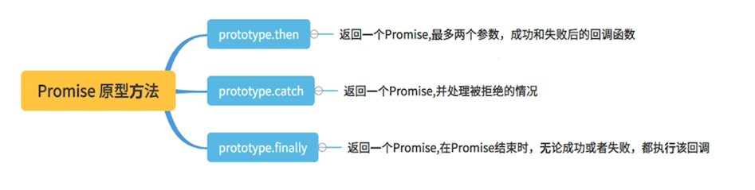
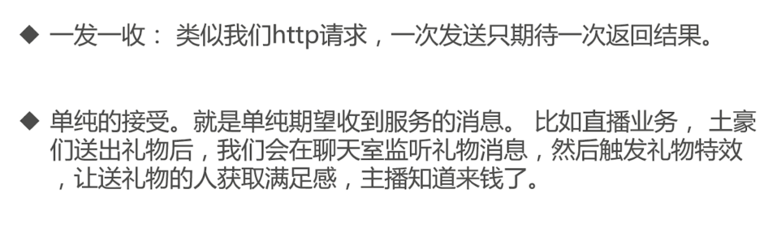
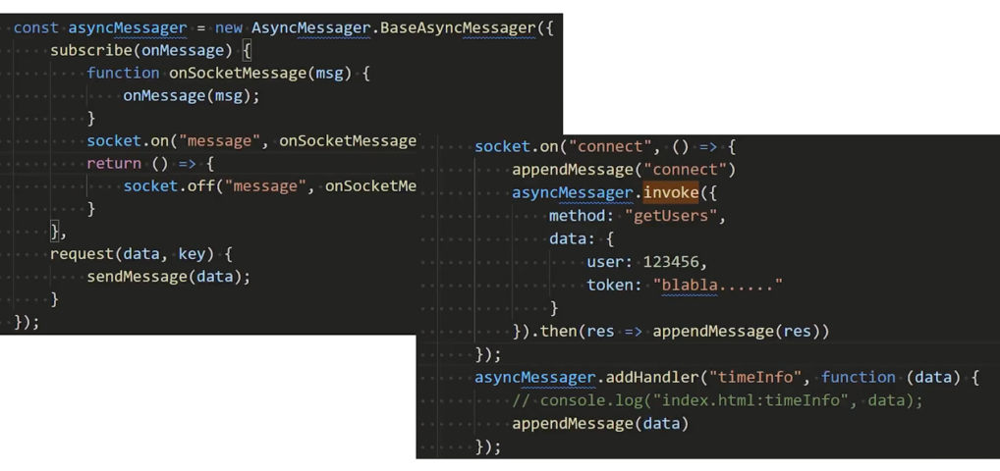

# 爱上异步编程

现在写代码，谁还不写一个await和Promise。一处await，处处await， await解决了所有问题了么？ await的本质是什么？你还在用switch判断页面通讯的消息类型吗？ 

## 异步编程有哪些问题以及方案

**同步和异步**


需求：


**回调函数 - callBack**

```ts
login((token) => {
    getOrderId(token,(orderId) => {
        orderDetails(orderId,(orderInfo) => {
            console.log(orderInfo);
        });
    });
});
```

缺点：


**事件驱动**

- 异步任务的执行，取决于事件的驱动

```ts
const orderDetailsEvent = new CustomEvent("orderDetails-over", {
    detail: "淘宝订单：购买xxx书一本" 
});
```

优缺点：


**发布订阅**

- 也是使用事件驱动，但是有一个消息中心，可以查看消息流转。

```ts
/**
 *
 * 消息中心
 * @class MsgCenter
 */
class MsgCenter {
  constructor() {
    this.listeners = {};
  }

  /**
   *
   *
   * 订阅
   * @memberOf MsgCenter
   */
  subscribe(type, listener) {
    if (this.listeners[type] === undefined) {
      this.listeners[type] = [];
    }
    this.listeners[type].push(listener);
    console.log(`${type}消息订阅数：${this.listeners[type].length}`);
    return listener;
  }

  /**
   *
   *
   * 发送
   * @memberOf MsgCenter
   */
  dispatch(type, args = {}) {
    if (!type) {
      throw new Error("Event object missing 'type' property.");
    }
    if (this.listeners[type] instanceof Array) {
      const listeners = this.listeners[type];
      for (let j = 0; j < listeners.length; j++) {
        listeners[j].call(this, type, args);
      }
    }
  }

  /**
   *
   *
   * 取消订阅
   * @memberOf MsgCenter
   */
  unSubscribe(type, listener) {
    if (this.listeners[type] instanceof Array) {
      const listeners = this.listeners[type];
      for (let i = 0; i < listeners.length; i++) {
        if (listeners[i] === listener) {
          listeners.splice(i, 1);
          break;
        }
      }
      console.log(`${type}消息订阅数：${this.listeners[type].length}`);
    }
  }

  /**
   *
   * 获取某种消息所有订阅
   * @param {any} type
   * @returns
   *
   * @memberOf MsgCenter
   */
  getTypeSubscribe(type) {
    return this.listeners[type] || [];
  }

  /**
   *
   *
   * 销毁
   * @memberOf MsgCenter
   */
  destroy() {
    this.listeners = null;
  }
}

const MyMsgCenter = new MsgCenter();

export default MyMsgCenter;
```

**Promise**

- 拉平回调函数，把回调嵌套变为链式调用

```ts
login().then(getOrderId).then(orderDetails).then((result)=>{
    console.log(result);
});
```

优缺点：


**Generator**

- Generator 最大特点就是可以控制函数执行

```ts
let g = execute();

let { value, done } = g.next();

value.then((token) => {
  console.log("token==", token);
  let { value, done } = g.next(token);
  value.then((orderId) => {
    console.log("orderId==", orderId);
    let { value, done } = g.next(orderId);
    value.then((orderInfo) => {
      console.log("orderInfo==", orderInfo);
    });
  });
});
```

优缺点：


**异步终极方案 asycn await**

- asycn 函数就是 Generator 函数的语法糖

```ts
async function execute() {
    const token = await login();
    const orderId = await getOrderId(token);
    const orderInfo = await orderDetails(orderId);
    console.log(orderInfo);
}

execute();
```

优缺点：


异步方案总结：


## 理解现代异步编程的核心 Promise

**Promise 三种状态**


**ES6 Promise API**





**Promise 高级用法 - 延迟函数**

```ts
/**
 * @param {any} fn 需要延迟的方法
 * @param {any} delay 延迟时间
 * @param {any} context 上下文
 * @returns
 */
function delay(fn, delay, context) {
  let defaultDelay = delay || 5000;
  let ticket;
  return {
    run(...args) {
      ticket = setTimeout(async () => {
        fn.apply(context, args);
      }, defaultDelay);
    },
    cancel: () => {
      clearTimeout(ticket);
    },
  };
}

const { run, cancel } = delay(() => {
  console.log("111");
}, 3000);

run();

setTimeout(() => {
  cancel();
}, 1000);
```

再包装一下：
```ts
function isFunction(fn) {
  return typeof fn === "function" || fn instanceof Function;
}

/**
 *
 *
 * @param {any} fn 需要延迟的方法
 * @param {any} delay 延迟时间
 * @param {any} context 上下文
 * @returns
 */
function delay(fn, delay, context) {
  let defaultDelay = delay || 5000;
  if (!isFunction(fn)) {
    return {
      run: () => Promise.resolve(),
      cancel: noop,
    };
  }
  let ticket;
  let executed = false;
  return {
    run(...args) {
      return new Promise((resolve, reject) => {
        if (executed === true) {
          return;
        }
        executed = true;
        ticket = setTimeout(async () => {
          try {
            const res = await fn.apply(context, args);
            resolve(res);
          } catch (err) {
            reject(err);
          } finally {
            clearTimeout(ticket);
          }
        }, defaultDelay);
      });
    },
    cancel: () => {
      clearTimeout(ticket);
    },
  };
}

//测试

const { run, cancel } = delay(() => {
  return "函数执行结果";
}, 3000);

run().then((result) => {
  console.log("result:", result);
});

run().then(() => {
  console.log("多次调用run result:", result);
});
```

**Promise 高级用法 - 重试多次**

```ts
function isFunction(fn) {
  return typeof fn === "function" || fn instanceof Function;
}

function retry(fun, count, assert = () => false) {
  if (!isFunction(fun)) {
    return Promise.resolve();
  }
  return new Promise(async (resolve, reject) => {
    let error = null; //错误值
    for (let tryCount = 1; tryCount <= count; tryCount++) {
      try {
        const value = await fun(tryCount);
        if (assert(value, tryCount)) {
          return resolve(value);
        }
      } catch (e) {
        error = e;
      }
    }
    reject(new Error("多次尝试失败"));
  });
}

// retry(()=>{
//     throw new Error("错误")
// },3).catch((e)=>{
//     console.log("捕获到错误：",e)
// });

let index = 0;

function createPromise(tryCount) {
  console.log("尝试次数:", tryCount);
  return new Promise((resolve, reject) => {
    index++;
    setTimeout(() => {
      resolve(index);
    }, 1000);
  });
}

retry(createPromise, 10, (res) => {
  return res == 5;
})
  .then((res) => {
    console.log("当前的数据:", res);
  })
  .catch((e) => {
    console.log("捕获到错误：", e);
  });
```

**注意事项 - 异常捕获 - .catch**

```ts
Promise.resolve("success").then((res)=>{
    console.log("res1:",res);
    throw new Error("then error");
    return "fail"
}).then((res)=>{
    console.log("res2:",res);
}).catch((e)=>{
    console.log("捕获到Promise 错误:",e);
});
```

**注意事项 - 异常捕获 - 监听 unhandledrejection**

```ts
window.addEventListener("unhandledrejection", (event) => {
    console.error(`捕获到错误1: ${event.reason}`);
});

window.onunhandledrejection = (event) => {
    console.error(`捕获到错误2: ${event.reason}`);
};

//不能捕获
// window.onerror= (event) => {
//     console.error(`onerror 捕获到错误: ${event.reason}`)
//};

const p1 = new Promise((resolve, reject) => {
    throw new Error("错误");
    resolve(5);
});

// console.log(a.f);
```

不能捕获的情况：

```ts
window.addEventListener('unhandledrejection', (event) => {
    console.error(`捕获到错误1: ${event.reason}`)
});

window.onunhandledrejection = event => {
    console.error(`捕获到错误2: ${event.reason}`);
};

//不能捕获
window.onerror= (event) => {
    console.error(`onerror 捕获到错误: ${event.reason}`)
};

const p1 = new Promise((resolve, reject) => {
    setTimeout(() => {
        throw new Error("错误");
        resolve(5);
    }, 1000);
});
```

**注意事项 - 过早处理 reject 影响链式调用**

```ts
const p1 = new Promise((resolve, reject) => {
    reject(5);
});

p1.then((res) => {
    //不会执行
    console.log("res1", res);
}, (rejectResult) => {
    //执行
    console.log("处理reject result", rejectResult);
    return rejectResult;
}).then((res) => {
    //执行
    console.log("res2", res)
}).catch((e) => {
    //不会执行
    console.log("reject 错误：", e);
});
```

```ts
const p1 = new Promise((resolve, reject) => {
    reject(5);
});

//推荐，最后统一catch处理
p1.then((res)=>{
    //不会执行
    console.log("res1",res);
}).then((res)=>{
    //不会执行
    console.log("res2",res)
}).catch((e)=>{
    console.log("reject 错误：",e);
});
```

**注意事项 - Promise 执行顺序**

```ts
console.log("1");

const p1 = new Promise((resolve) => {
    console.log("2");
    // 请注意
    resolve("resolve");
    //不会终止，会继续执行后面的代码
    console.log("继续执行")
});

// 微任务
p1.then((result) => {
    console.log("p1 result");
});

// 宏任务
setTimeout(() => {
    console.log("3");
});

console.log("4");
```

**注意事项 - Promise resolve 后，再报错无效**

```ts
const p2 = new Promise((resolve, reject) => {
    resolve(5);
    throw new Error("自定义错误")
});


p2.then((res)=>{
    //不会执行
    console.log("res1",res);
    return res + 1;
}).then((res)=>{
    //不会执行
    console.log("res2",res)
}).catch((e)=>{
    console.log("reject 错误：",e);
});
```

**注意事项 -  then传入非函数，发生值穿透**

```ts
const p2 = new Promise((resolve, reject) => {
    resolve(5);
});


p2.then(1).then((res)=>{
    console.log("res2",res)
    return 2;
}).catch((e)=>{
    console.log("reject 错误：",e);
});
```

**注意事项 - all、race 等 reject 以后，其他并没有停止**

race：
```ts
let p1 = new Promise((resolve) => {
    setTimeout(() => {
        console.log('执行p1');
        resolve('https://aaa.flv 开始播放')
    }, 5000)
})
let p2 = new Promise((resolve) => {
    setTimeout(() => {
        console.log('执行p2');
        resolve('https://bbb.flv 开始播放')
    }, 2000)
})
let p3 = new Promise((resolve, reject) => {
    setTimeout(() => {
        console.log('执行p3');
        reject('https://ccc.flv 播放失败')
    }, 1000)
})

Promise.race([p1, p2, p3]).then((res) => {
    console.log("已经获取到合适的结果了===", res);
})
```

```ts
let p1 = new Promise((resolve) => {
  setTimeout(() => {
    console.log("执行p1");
    resolve("P1 fetch 请求成功");
  }, 5000);
});
let p2 = new Promise((resolve, reject) => {
  setTimeout(() => {
    console.log("执行p2");
    reject("P2 fetch 请求失败");
  }, 2000);
});
let p3 = new Promise((resolve) => {
  setTimeout(() => {
    console.log("执行p3");
    resolve("P3 fetch 请求成功");
  }, 1000);
});

Promise.all([p1, p2, p3])
  .then((res) => {
    console.log("已经获取到合适的结果了===", res);
  })
  .catch((e) => {
    console.log("发生异常=", e);
  });
```

**实现 Promise - 构造实现**

```ts
// const p1=new Promise((resolve,reject)=>{});
// console.log(p1);

//定义promise 三种状态
const pending = Symbol("pending");
const fulfilled = Symbol("fulfilled");
const rejected = Symbol("Rejected");

class MyPromise {
  constructor(callback) {
    //初始化状态
    this.PromiseStatus = pending;
    this.PromiseValue = null;
    //绑定函数this指向
    this.initBind();
    //执行回调
    callback(this.resolve, this.reject);
  }

  initBind() {
    this.reject = this.reject.bind(this);
    this.resolve = this.resolve.bind(this);
  }

  /**
   * 失败
   * @memberOf MyPromise
   */
  reject() {}

  /**
   * 成功
   * @memberOf MyPromise
   */
  resolve() {}
}
```

**实现 Promise - reject 、 resolve 实现**


```ts
const pending = Symbol("pending");
const fulfilled = Symbol("fulfilled");
const rejected = Symbol("Rejected");

class MyPromise {
  constructor(callback) {
    //初始化状态
    this.PromiseStatus = pending;
    this.PromiseValue = null;
    //绑定函数this指向
    this.initBind();
    //执行回调
    callback(this.resolve, this.reject);
  }

  initBind() {
    this.reject = this.reject.bind(this);
    this.resolve = this.resolve.bind(this);
  }

  /**
   * 改变Promise状态
   * @param {any} statusType 状态类型
   * @param {any} value   最终结果
   * @returns
   *
   * @memberOf MyPromise
   */
  changePromiseStatus(statusType, value) {
    //状态不可逆，必须从pending 改变
    if (this.PromiseStatus !== pending) return;
    //改变状态
    this.PromiseStatus = statusType;

    this.PromiseValue = value;
  }

  /**
   * 失败
   * @memberOf MyPromise
   */
  reject(value) {
    this.changePromiseStatus(rejected, value);
  }

  /**
   * 成功
   * @memberOf MyPromise
   */
  resolve(value) {
    this.changePromiseStatus(fulfilled, value);
  }
}
```

**实现 Promise - reject 、 resolve 报错异常捕获**


```ts
const pending = Symbol("pending");
const fulfilled = Symbol("fulfilled");
const rejected = Symbol("Rejected");

class MyPromise {
  constructor(callback) {
    //初始化状态
    this.PromiseStatus = pending;
    this.PromiseValue = null;
    //绑定函数this指向
    this._initBind();
    //执行回调
    this._execute(callback);
  }

  _initBind() {
    this.reject = this.reject.bind(this);
    this.resolve = this.resolve.bind(this);
  }

  /**
   * 捕获异常，调用reject
   * @param {any} callback
   *
   * @memberOf MyPromise
   */
  _execute(callback) {
    try {
      callback(this.resolve, this.reject);
    } catch (e) {
      this.reject(e);
    }
  }

  /**
   * 改变Promise状态
   * @param {any} statusType 状态类型
   * @param {any} value   最终结果
   * @returns
   *
   * @memberOf MyPromise
   */
  _changePromiseStatus(statusType, value) {
    //状态不可逆，必须从pending 改变
    if (this.PromiseStatus !== pending) return;
    //改变状态
    this.PromiseStatus = statusType;

    this.PromiseValue = value;
  }

  /**
   * 失败
   * @memberOf MyPromise
   */
  reject(value) {
    this._changePromiseStatus(rejected, value);
  }

  /**
   * 成功
   * @memberOf MyPromise
   */
  resolve(value) {
    this._changePromiseStatus(fulfilled, value);
  }
}

// const p4=new MyPromise((resolve,reject)=>{
//     throw new Error("自定义错误");
// });
// console.log(p4);
```

**实现 Promise - then 回调参数同步和异步执行实现**


```ts
const pending = Symbol("pending");
const fulfilled = Symbol("fulfilled");
const rejected = Symbol("Rejected");

class MyPromise {
  constructor(callback) {
    //初始化状态
    this.PromiseStatus = pending;
    this.PromiseValue = null;
    //初始化集合
    this._initCollection();
    //绑定函数this指向
    this._initBind();
    //执行回调
    this._execute(callback);
  }

  _initCollection() {
    /**
            var p = new MyPromise((resolve, reject) => { setTimeout(resolve)});
            p.then(()=>console.log("..."));
            p.then(()=>console.log("..."))
        */
    //初始化成功回调集合
    this.fulfilledCallbacks = [];
    //初始化失败回调集合
    this.rejectedCallbacks = [];
  }

  _initBind() {
    this.reject = this.reject.bind(this);
    this.resolve = this.resolve.bind(this);
  }

  /**
   * 捕获异常，调用reject
   * @param {any} callback
   *
   * @memberOf MyPromise
   */
  _execute(callback) {
    try {
      callback(this.resolve, this.reject);
    } catch (e) {
      this.reject(e.message);
    }
  }

  /**
   * 触发执行集合
   * @param {any} array
   *
   * @memberOf MyPromise
   */
  _triggerExecuteCollection(array) {
    while (array.length > 0) {
      array.shift()(this.PromiseValue);
    }
  }

  /**
   * 改变Promise状态
   * @param {any} statusType 状态类型
   * @param {any} value   最终结果
   * @returns
   *
   * @memberOf MyPromise
   */
  _changePromiseStatus(statusType, value) {
    //改变状态
    this.PromiseStatus = statusType;

    this.PromiseValue = value;
  }

  /**
   * 失败
   * @memberOf MyPromise
   */
  reject(value) {
    //状态不可逆，必须从pending 改变
    if (this.PromiseStatus !== pending) return;
    this._changePromiseStatus(rejected, value);
    this._triggerExecuteCollection(this.rejectedCallbacks);
  }

  /**
   * 成功
   * @memberOf MyPromise
   */
  resolve(value) {
    //状态不可逆，必须从pending 改变
    if (this.PromiseStatus !== pending) return;
    this._changePromiseStatus(fulfilled, value);
    this._triggerExecuteCollection(this.fulfilledCallbacks);
  }

  then(onFulfilled, onRejected) {
    onFulfilled = typeof onFulfilled === "function" ? onFulfilled : () => {};
    onRejected = typeof onRejected === "function" ? onRejected : () => {};

    //没有结果
    if (this.PromiseStatus === pending) {
      //添加成功回调，真正调用等成功 resolve 函数执行触发
      this.fulfilledCallbacks.push(onFulfilled.bind(this));
      //添加失败回调，真正调用等拒绝 reject 函数执行触发
      this.rejectedCallbacks.push(onRejected.bind(this));
      return;
    }

    //有结果，立即执行
    if (this.PromiseStatus === fulfilled) {
      onFulfilled(this.PromiseValue);
      return;
    }

    if (this.PromiseStatus === rejected) {
      onRejected(this.PromiseValue);
      return;
    }
  }
}

// new MyPromise((resolve,reject)=>{
//     resolve("5")
// }).then((res)=>{
//     console.log("收到结果",res);
// })

// new MyPromise((resolve,reject)=>{
//     reject(new Error("eee"))
// }).then((res)=>{
//     console.log("收到结果",res);
// },(err)=>{
//     console.log(err)
// })

// new MyPromise((resolve,reject)=>{
//     setTimeout(()=>{
//         resolve("异步")
//     },3000)
// }).then((res)=>{
//     console.log("收到结果",res);
// })

const p2 = new MyPromise((resolve, reject) => {
  setTimeout(() => {
    resolve("异步");
  }, 3000);
});

p2.then((a) => {
  console.log("第一次：", a);
});

p2.then((a) => {
  console.log("第二次", a);
});

p2.then((a) => {
  console.log("第三次", a);
});
```

**实现 Promise - 执行顺序实现**


```ts
const pending = Symbol("pending");
const fulfilled = Symbol("fulfilled");
const rejected = Symbol("Rejected");

class MyPromise {
  constructor(callback) {
    //初始化状态
    this.PromiseStatus = pending;
    this.PromiseValue = null;
    //初始化集合
    this._initCollection();
    //绑定函数this指向
    this._initBind();
    //执行回调
    this._execute(callback);
  }

  _initCollection() {
    //初始化成功回调集合
    this.fulfilledCallbacks = [];
    //初始化失败回调集合
    this.rejectedCallbacks = [];
  }

  _initBind() {
    this.reject = this.reject.bind(this);
    this.resolve = this.resolve.bind(this);
  }

  /**
   *
   * 捕获异常，调用reject
   * @param {any} callback
   *
   * @memberOf MyPromise
   */
  _execute(callback) {
    try {
      callback(this.resolve, this.reject);
    } catch (e) {
      this.reject(e.message);
    }
  }

  /**
   * 触发执行集合
   * @param {any} array
   *
   * @memberOf MyPromise
   */
  _triggerExecuteCollection(array) {
    while (array.length > 0) {
      array.shift()(this.PromiseValue);
    }
  }

  /**
   * 改变Promise状态
   * @param {any} statusType 状态类型
   * @param {any} value   最终结果
   * @returns
   *
   * @memberOf MyPromise
   */
  _changePromiseStatus(statusType, value) {
    //改变状态
    this.PromiseStatus = statusType;

    this.PromiseValue = value;
  }

  /**
   * 失败
   * @memberOf MyPromise
   */
  reject(value) {
    //状态不可逆，必须从pending 改变
    if (this.PromiseStatus !== pending) return;
    setTimeout(() => {
      this._changePromiseStatus(rejected, value);
      this._triggerExecuteCollection(this.rejectedCallbacks);
    });
  }

  /**
   * 成功
   * @memberOf MyPromise
   */
  resolve(value) {
    if (this.PromiseStatus !== pending) return;
    setTimeout(() => {
      this._changePromiseStatus(fulfilled, value);
      this._triggerExecuteCollection(this.fulfilledCallbacks);
    });
  }

  then(onFulfilled, onRejected) {
    onFulfilled = typeof onFulfilled === "function" ? onFulfilled : () => {};
    onRejected = typeof onRejected === "function" ? onRejected : () => {};

    //没有结果
    if (this.PromiseStatus === pending) {
      //添加成功回调，真正调用等成功 resolve 函数执行触发
      this.fulfilledCallbacks.push(onFulfilled.bind(this));
      //添加失败回调，真正调用等拒绝 reject 函数执行触发
      this.rejectedCallbacks.push(onRejected.bind(this));
      return;
    }

    //有结果，立即执行
    if (this.PromiseStatus === fulfilled) {
      setTimeout(() => {
        onFulfilled(this.PromiseValue);
      });
      return;
    }

    if (this.PromiseStatus === rejected) {
      setTimeout(() => {
        onRejected(this.PromiseValue);
      });
      return;
    }
  }
}

let p1 = new MyPromise((resolve, reject) => {
  console.log("1");
  resolve("测试");
});

p1.then(
  (result) => {
    console.log("resolve:", result);
  },
  (reason) => {
    console.log("reject:", reason);
  }
).then((_) => {
  console.log("then.then:");
});
```

**实现 Promise - then 链式调用**


```ts
const pending = Symbol("pending");
const fulfilled = Symbol("fulfilled");
const rejected = Symbol("Rejected");

class MyPromise {
  constructor(callback) {
    //初始化状态
    this.PromiseStatus = pending;
    this.PromiseValue = null;
    //初始化集合
    this._initCollection();
    //绑定函数this指向
    this._initBind();
    //执行回调
    this._execute(callback);
  }

  _initCollection() {
    //初始化成功回调集合
    this.fulfilledCallbacks = [];
    //初始化失败回调集合
    this.rejectedCallbacks = [];
  }

  _initBind() {
    this.reject = this.reject.bind(this);
    this.resolve = this.resolve.bind(this);
  }

  /**
   * 捕获异常，调用reject
   * @param {any} callback
   *
   * @memberOf MyPromise
   */
  _execute(callback) {
    try {
      callback(this.resolve, this.reject);
    } catch (e) {
      this.reject(e);
    }
  }

  /**
   * 触发执行集合
   * @param {any} array
   *
   * @memberOf MyPromise
   */
  _triggerExecuteCollection(array) {
    while (array.length > 0) {
      array.shift()(this.PromiseValue);
    }
  }

  /**
   * 改变Promise状态
   * @param {any} statusType 状态类型
   * @param {any} value   最终结果
   * @returns
   *
   * @memberOf MyPromise
   */
  _changePromiseStatus(statusType, value) {
    //改变状态
    this.PromiseStatus = statusType;

    this.PromiseValue = value;
  }

  /**
   * 失败
   * @memberOf MyPromise
   */
  reject(value) {
    //状态不可逆，必须从pending 改变
    if (this.PromiseStatus !== pending) return;
    setTimeout(() => {
      this._changePromiseStatus(rejected, value);
      this._triggerExecuteCollection(this.rejectedCallbacks);
    });
  }

  /**
   * 成功
   * @memberOf MyPromise
   */
  resolve(value) {
    if (this.PromiseStatus !== pending) return;
    setTimeout(() => {
      this._changePromiseStatus(fulfilled, value);
      this._triggerExecuteCollection(this.fulfilledCallbacks);
    });
  }

  then(onFulfilled, onRejected) {
    //不是函数,默认返回当前的值
    onFulfilled =
      typeof onFulfilled === "function" ? onFulfilled : (value) => value;
    onRejected =
      typeof onRejected === "function"
        ? onRejected
        : (err) => {
            throw err;
          };

    const nextPromise = new MyPromise((resolve, reject) => {
      //没有结果
      if (this.PromiseStatus === pending) {
        //添加成功回调，真正调用等成功 resolve 函数执行触发
        this.fulfilledCallbacks.push(() => {
          try {
            /**
                         * new MyPromise((resolve, reject) => {
                            resolve(5);
                        }).then((res) => {
                            return res + 6;  // onFulfilled
                        }).then((res) => {
                            console.log("最终结果：", res)
                        })
                         */

            // 当前Promise执行成功的结果
            let result = onFulfilled(this.PromiseValue);
            // 根据返回结果，来决定当前nextPromise的状态
            handlePromiseResult(result, nextPromise, resolve, reject);
          } catch (e) {
            //抛出一个错误
            reject(e);
          }
        });
        //添加失败回调，真正调用等拒绝 reject 函数执行触发
        this.rejectedCallbacks.push(() => {
          try {
            let result = onRejected(this.PromiseValue);
            handlePromiseResult(result, nextPromise, resolve, reject);
          } catch (e) {
            reject(e);
          }
        });
        return;
      }

      //有结果，立即执行
      if (this.PromiseStatus === fulfilled) {
        setTimeout(() => {
          try {
            let result = onFulfilled(this.PromiseValue);
            handlePromiseResult(result, nextPromise, resolve, reject);
          } catch (e) {
            reject(e);
          }
        });

        return;
      }

      if (this.PromiseStatus === rejected) {
        setTimeout(() => {
          try {
            let result = onRejected(this.PromiseValue);
            handlePromiseResult(result, nextPromise, resolve, reject);
          } catch (e) {
            reject(e);
          }
        });
      }
    });

    return nextPromise;
  }
}

/**
 * 处理运算结果
 * @memberOf MyPromise
 */
const handlePromiseResult = function (
  resultValue,
  thenPromise,
  resolve,
  reject
) {
  //2.3.1 实现
  if (resultValue === thenPromise) {
    //不能将自身传入
    return reject(new TypeError("Chaining cycle detected for promise"));
  }
  //2.3.2 实现 返回类型为MyPromise
  if (resultValue instanceof MyPromise) {
    //2.3.2.1 实现,结果为pending状态
    if (resultValue.PromiseStatus === pending) {
      //FunResult的resolve,reject回调还没有执行，我们添加then等结果即可。
      //这里
      resultValue.then((result) => {
        //获取到resultValue的promise结果以后，再去判断结果是否为Promise.
        handlePromiseResult(result, thenPromise, resolve, reject);
      }, reject);
      return;
    }
    //2.3.2.2 实现，结果为fulfilled状态
    if (resultValue.PromiseStatus === fulfilled) {
      resolve(resultValue.PromiseValue);
      return;
    }
    //2.3.2.3 实现，结果为rejected状态
    if (resultValue.PromiseStatus === rejected) {
      reject(resultValue.PromiseValue);
      return;
    }
    return;
  }
  const resultValueType = typeof resultValue;
  //2.3.3 实现
  if (
    resultValue !== null &&
    (resultValueType === "object" || resultValueType === "function")
  ) {
    let then;
    //2.3.3.2 实现
    try {
      //2.3.3.1 实现
      then = resultValue.then;
    } catch (thenError) {
      return reject(thenError);
    }
    //2.3.3.3 实现
    if (typeof then == "function") {
      //2.3.3.3.4,try catch
      let called = false;
      try {
        then.call(
          resultValue,
          (y) => {
            // 2.3.3.3.3
            if (called) return;
            called = true;
            //2.3.3.1
            handlePromiseResult(y, thenPromise, resolve, reject);
          },
          (r) => {
            // 2.3.3.3.3
            if (called) return;
            called = true;
            //2.3.3.2
            reject(r);
          }
        );
      } catch (callError) {
        //2.3.3.3.4.1 已经调用则略
        if (called) return;
        called = true;
        reject(callError);
      }
      return;
    }

    //2.3.3.4 不是一个方法，一个对象
    resolve(resultValue);
    return;
  }

  //2.3.4 不是object,不是function, 没有返回值。
  return resolve(resultValue);
};

//测试

new MyPromise((resolve, reject) => {
  resolve(5);
})
  .then((res) => {
    return res + 6;
  })
  .then((res) => {
    console.log("最终结果：", res);
  });
```

**实现 Promise - then 运行结果处理**


**实现 Promise A+ 规范**


**实现 Promise - then 处理返回结果**


**测试 MyPromise**


## async的本质和注意事项


**Generator 函数（生成器函数）**

```ts
(function *generator() {}) instanceof Function // true
```

Generator 函数特征：
- 星号： function 关键字与函数名之间有一个星号

```ts
function* generator() {} // 推荐
function *generator() {}
function * generator() {}
function*generator() {}
```


**Generator 对象**


**动态构建 Generator 函数实例**

```ts
// var GeneratorFunction = Object.getPrototypeOf(function* () { }).constructor
var GeneratorFunction = (function* () { }).constructor
var numGenerator = new GeneratorFunction(`
  yield 1;
  yield 2;
  return 3;
`);

var log = console.log;
var gen = numGenerator();
log(gen.next())  // {value: 1, done: false}
log(gen.next())  // {value: 2, done: false}
log(gen.next())  // {value: 3, done: true}
log(gen.next())  // { value: undefined, done: true }
```

**判断是不是 Generator 函数**

```ts
var GeneratorFunction = Object.getPrototypeOf(function* () { }).constructor
function* numGenerator() {
  yield 1;
  yield 2;
  return 3;
}

// 推荐
console.log(numGenerator.constructor === GeneratorFunction)
// 不推荐
console.log(numGenerator instanceof GeneratorFunction.__proto__)
```


**Generator 对象： throw**

- 如果 Generator 不捕获该错误，会导致调用程序异常

捕获异常：
```ts
function* generator() {
    var val = 1;
    while (true) {
        try {
            yield val++;
        } catch (e) {
            console.log("Error caught!");
        }
    }
}

var log = console.log;
var gen = generator();
gen.next(); // { value: 1, done: false }
log(gen.throw(new Error("Something went wrong"))); // "Error caught!"  {value: 2, done: false}
log(gen.next()); // { value: 3, done: false }
```

不捕获：(挂掉，不再执行)
```ts
function* generator() {
    var val = 1;
    while (true) {
        yield val++;
    }
}

var log = console.log;
var gen = generator();
gen.next(); // { value: 1, done: false }
log(gen.throw(new Error("Something went wrong"))); // "Error caught!"  {value: 2, done: false}
log(gen.next()); // { value: 3, done: false }
```

**迭代器协议**


**可迭代协议**


**Generator 对象**

- 符合可迭代协议和迭代器协议


**Generator 函数的传参**


**Generator 的妙用：序列生成器**


```ts
function* sequenceGenerator(start = 0, step = 1, end = Number.MAX_SAFE_INTEGER) {
  let current = start;
  while (current <= end) {
    yield current;
    current = current + step;
  }
}

// const gen = sequenceGenerator(0, 3, 6);
// console.log(gen.next());
// console.log(gen.next());
// console.log(gen.next());
// console.log(gen.next());

const gen2= sequenceGenerator(0, 3, 6);
var numbers = [...gen2];
console.log(numbers);

const gen3= sequenceGenerator(0, 3, 6);
for(let v of gen3){
  console.log("v:", v);
}
```

**Generator 的妙用：状态机**

```ts
//PDCA 循环 .Plan-Do-Check-Action 
function* stateMachineGenerator(states, state) {
  const len = states.length;
  let index =  Math.max(states.findIndex(s => s === state) , 0);
  while (true) {
    yield states[(++index) % len];
  }
}
const startState = "Do";
const stateMachine = stateMachineGenerator(["Plan", "Do", "Check", "Action"], startState );

console.log(startState);                // Do
console.log(stateMachine.next().value); // Check
console.log(stateMachine.next().value); // Action
console.log(stateMachine.next().value); // Plan
console.log(stateMachine.next().value); // Do
console.log(stateMachine.next().value); // Check
console.log(stateMachine.next().value); // Action
console.log(stateMachine.next().value); // Plan
```

**redux-saga**


**async 函数介绍**


**async 函数的本质是个啥**

- 使用 tsc 命令转换为 ES6 的代码


```ts
async function test() {
  const r1 = await 1;
  const r2 = await 2;

  console.log("result:", r1 + r2);
}

test();
```

```ts
"use strict";
var __awaiter = (this && this.__awaiter) || function (thisArg, _arguments, P, generator) {
    function adopt(value) { return value instanceof P ? value : new P(function (resolve) { resolve(value); }); }
    return new (P || (P = Promise))(function (resolve, reject) {
        function fulfilled(value) { try { step(generator.next(value)); } catch (e) { reject(e); } }
        function rejected(value) { try { step(generator["throw"](value)); } catch (e) { reject(e); } }
        function step(result) { result.done ? resolve(result.value) : adopt(result.value).then(fulfilled, rejected); }
        step((generator = generator.apply(thisArg, _arguments || [])).next());
    });
};
function test() {
    return __awaiter(this, void 0, void 0, function* () {
        const r1 = yield 1;
        const r2 = yield 2;
        console.log("result:", r1 + r2);
    });
}
test();
```

详细解读：
```ts
"use strict";
var __awaiter = function (thisArg, _arguments, P, generator) {
    // 如果值是Promise, 直接返回，如果不是包裹成为Promise
    // 例如 await 1 => await Promise.resolve(1)
    function adopt(value) {
        return value instanceof Promise ? value :
            new Promise(function (resolve) { resolve(value); });
        // 可以使用 Promise.resolve(value)代替
        // Promise.resolve(value)
    }

    // 创建Promise
    return new Promise(function (resolve, reject) {
        // 成功执行
        function fulfilled(value) {
            try {
                // 取下一个
                step(generator.next(value));
            }
            catch (e) {
                reject(e);
            }
        }

        // 发生错误
        function rejected(value) {
            try {
                // 抛出异常
                step(generator["throw"](value));
            } catch (e) {
                reject(e);
            }
        }

        // 执行控制器
        function step(result) {
            // 执行完毕，直接调用resolve, 返回结果
            result.done ? resolve(result.value) :
                // 继续执行， 并传递上一次的执行结果
                adopt(result.value)
                    .then(fulfilled, rejected);
        }

        // 产生generator， bind定this
        generator = generator.apply(thisArg, _arguments || []);
        // 开始执行
        step(generator.next());
    });
};

function test() {
    return __awaiter(this, void 0, void 0, function* () {
        const r1 = yield 1;
        const r2 = yield 2;
        console.log("result:", r1 + r2);
    });
}
test();
```


`本质：就是对 generator 的一种封装，一种新的语法糖`


**大名鼎鼎的 co 库**


```ts
function isPromise(obj) {
    return 'function' == typeof obj.then;
}

function toPromise(obj) {
    if (!obj) return obj;
    if (isPromise(obj)) return obj;

    // 简化
    return Promise.resolve(obj);

    // 额外处理了很多其他的数据类型
    // if (isGeneratorFunction(obj) || isGenerator(obj)) return co.call(this, obj);
    // if ('function' == typeof obj) return thunkToPromise.call(this, obj);
    // if (Array.isArray(obj)) return arrayToPromise.call(this, obj);
    // if (isObject(obj)) return objectToPromise.call(this, obj);
    // return obj;
}


function co(gen) {
    var ctx = this;
    var args = Array.prototype.slice.call(arguments, 1)
    // we wrap everything in a promise to avoid promise chaining,
    // which leads to memory leak errors.
    // see https://github.com/tj/co/issues/180
    return new Promise(function (resolve, reject) {
        if (typeof gen === 'function')
            gen = gen.apply(ctx, args);
        if (!gen || typeof gen.next !== 'function') return resolve(gen);

        onFulfilled();
        function onFulfilled(res) {
            var ret;
            try {
                ret = gen.next(res);
            } catch (e) {
                return reject(e);
            }
            next(ret);
        }

        function onRejected(err) {
            var ret;
            try {
                ret = gen.throw(err);
            } catch (e) {
                return reject(e);
            }
            next(ret);
        }
        function next(ret) {
            // 检查是否结束
            if (ret.done)
                return resolve(ret.value);

            // 转为Promise
            var value = toPromise.call(ctx, ret.value);
            // 检查是不是Promise
            if (value && isPromise(value))
                return value.then(onFulfilled, onRejected);
            return onRejected(new TypeError('You may only yield a function, promise, generator, array, or object, '
                + 'but the following object was passed: "' + String(ret.value) + '"'));
        }
    });
}

function getData(duration, data) {
    return new Promise((resolve, reject) => {
        setTimeout(function () {
            resolve(data * 2)
        }, duration)
    })
}


var gen = function* () {
    const start = Date.now();
    var num1 = yield getData(1000, 10);
    var num2 = yield getData(2000, 20);
    console.log("result:", num1 + num2, ", cost:" , Date.now() - start);
};

co(gen)
```

**async 函数的缺点和注意事项**

async 函数里面，不是所有异步代码都需要 await。主要是看业务上是否有依赖关系。不然，有无用的等待。

## 基于 Promise 的通用异步方案

基于事件通讯的场景：

1. 与服务端通讯

- WebSocket、socketIO、mqtt、SSE 等


2. 客户端相互通讯

- webview 与原生， 页面与 iframe， EventEmitter 订阅发布中心等等


**技术角度的两种场景：**




**一发一收均可以使用 Promise**

once 闪亮登场


```ts
import EventEmitter from "events";

const emitter = new EventEmitter();
// 被请求方, 模拟server
emitter.on("message-client-req", ({ type, data }) => {
    console.log("server: message-client-req", type, data);
    emitter.emit("message-client-res", {
        type,
        data: data,
        from: "server"
    })
})

// 请求
function invoke(type: string, data: any = {}) {
    return new Promise((resolve, _reject) => {
        console.log("client:发送请求");
        emitter.once("message-client-res", function (data) {
            resolve(data)
        });
        emitter.emit("message-client-req", { type, data });
    })
}

invoke("ccc", "req1")
    .then(res => console.log("client:req1", res))
```

异步问题：

```ts
import EventEmitter from "events";

const emitter = new EventEmitter();

// 被请求方, 模拟server
emitter.on("message-client-req", ({ type, data }) => {
    console.log("server: message-client-req", type, data);
    setTimeout(() => {
        emitter.emit("message-client-res", {
            type,
            data: data,
            from: "server"
        })
    }, 16)
})

// 请求
function invoke(type: string, data: any = {}) {
    return new Promise((resolve, _reject) => {
        console.log("client:发送请求");
        emitter.once("message-client-res", function (data) {
            resolve(data)
        });
        emitter.emit("message-client-req", { type, data });

    })
}

invoke("ccc", "req1").then(res => console.log("client:req1:res", res))
invoke("ccc", "req2").then(res => console.log("client:req2:res", res))
```

存在的问题：


**`一个请求对应一个响应`**


```ts
import EventEmitter from "events";

const emitter = new EventEmitter();
// 被请求方, 模拟server
emitter.on("message-client-req", ({ type, data }) => {
    console.log("server: message-client-req", { type, data });
    setTimeout(() => {
        emitter.emit("message-client-res", {
            type,
            data: data,
            from: "server"
        })
    }, 16)
})

// 等待响应列表
const queues: any[] = [];
// 请求
function invoke(type: string, data: any = {}) {
    return new Promise((resolve, _reject) => {
        console.log("client:发送请求");
        queues.push({
            type,
            resolve
        })
        emitter.emit("message-client-req", { type, data });
    })
}

// 统一的响应处理
emitter.on("message-client-res", function (data: any) {
    // 去列表里面查找对应的回调
    const index = queues.findIndex(c => c.type === data.type);
    console.log("index:", index);
    if (index >= 0) {
        const qItem = queues[index];
        // 执行回调
        qItem.resolve(data);
        // 删除
        queues.splice(index, 1);
    }
});

invoke("ccc", "req1").then(res => console.log("client:req1:res", res))
invoke("ccc", "req2").then(res => console.log("client:req2:res", res))
```

存在的问题：


**改进： 添加 key**


```ts
import EventEmitter from "events";

const emitter = new EventEmitter();
// 被请求方, 模拟server
emitter.on("message-client-req", ({ type, data, key }) => {
    // console.log("server: message-client-req", { type, data });
    const time = Math.random() * 1000;
    console.log("server: cost", time, data, key)
    setTimeout((resData, reqKey) => {
        emitter.emit("message-client-res", {
            type,
            key: reqKey, // 携带请求的key
            data: resData,
            from: "server"
        })
        // 第三个参数传递数据
        // 第四个参数传递key
    }, time, data, key)
})

// 等待响应的队列
const queues: any[] = [];
// 统一的响应处理
emitter.on("message-client-res", function (data: any) {
    // 去队列里面查找对应的回调
    const index = queues.findIndex(c => {
        // 查询条件增加对key的比较
        return c.type === data.type && c.key === data.key
    });
    if (index >= 0) {
        const qItem = queues[index];
        // 执行回调
        qItem.resolve(data);
        // 删除
        queues.splice(index, 1);
    }
});

// 请求
function invoke(type: string, data: any = {}) {
    return new Promise((resolve, _reject) => {
        console.log("client:发送请求");
        // 如果有key，就使用，不然自己生成一个
        const key = data.key || `${Math.random()}-${Math.random()}`;
        queues.push({
            key,
            type,
            resolve
        })
        emitter.emit("message-client-req", { type, data, key });
    })
}

invoke("ccc", "req1").then(res => console.log("client:req1:res", res))
invoke("ccc", "req2").then(res => console.log("client:req2:res", res))
```

### **通用设计**


额外考虑：
- 超时处理
- 要兼容不是一发一收的情况
- 要兼容服务端不能处理 key 的情况

**核心基础类 - BaseAsyncMessager**


**子类必须实现**

- subscribe：订阅消息
- invoke：实际发送消息的操作

子类可以重写的方法
- getReqCategory： 获取请求的类别
- getReqkey： 获取请求的唯一 key
- getResCategory： 获取响应的类别
- getResKey：获取响应的key。用于和请求的 key 对比，来查找对应的 回调函数，然后让 Promise 继续执行。

完整代码：
```ts
import * as util from "./util";
import PEventMessager, { IPEventMessager } from "./PEventMessager";
import { BaseReqData, BaseResData, GlobalReqOptions, MessageType, ReqInfo, ReqOptions, Unsubscribe } from "./types";
import { isSameScope } from "./util";

const DEFAULT_G_OPTIONS: GlobalReqOptions = {
    timeout: 5000,
    clearTimeoutReq: true,
    // autoSubscribe: false,
    enableLog: true,
    logUnhandledEvent: true,
};

type extensibleMethod = "subscribe" | "getReqkey" | "getReqCategory" | "getResKey" | "getResCategory" | "request" | "getResScope" | "onResponse" | "getHashCode";

export default class BaseAsyncMessager<R = any, S = any> {

    private useOptions: boolean = false;
    /**
     * 请求的次数
     */
    private _reqCount = 0;
    /**
     * 响应的次数
     */
    private _resCount = 0;
    /**
     * 超时的数量
     */
    private _timeOutCount = 0;

    private _options: GlobalReqOptions;

    private cbMap = new Map<MessageType, ReqInfo<R>[]>();

    protected unsubscribe?: Unsubscribe;

    constructor(options: GlobalReqOptions = DEFAULT_G_OPTIONS,
        private passiveEventMessager: IPEventMessager = new PEventMessager()) {
        this._options = { ...DEFAULT_G_OPTIONS, ...options };

        if (util.isFunction(this._options.subscribe)) {
            this.unsubscribe = this._options.subscribe!(this.onMessage)
        }
        this.useOptions = true;
    }

    subscribe(onMessage?: Function): Unsubscribe {
        throw new Error("not implemented")
    }

    protected request(_data: BaseReqData<R>, _key: string): any {
        throw new Error("not implemented")
    }

    protected getReqkey<R>(data: BaseReqData<R>) {
        const method = this.getMethod("getHashCode");
        return method!(data);
    }

    protected getReqCategory(data: BaseReqData<R>): MessageType {
        return data.method || data.type;
    }

    protected getResCategory(data: BaseResData<S>): MessageType {
        return data.method || data.type;
    }

    protected getResKey(data: BaseResData<S>): MessageType {
        return data._key_!;
    }

    protected getResScope(data: BaseResData<S>) {
        return data.scope;
    }

    /**
     * 计算hashCode
     * @param data 
     * @returns 
     */
    protected getHashCode(data: BaseReqData<R>) {
        return util.hashcode(JSON.stringify(data))
    }

    protected onResponse(_category: MessageType, data: BaseResData<S>) {
        return data;
    }

    private getMethod = (name: extensibleMethod) => {
        const optMethod = this._options[name as keyof GlobalReqOptions];
        const classMethod = this[name as keyof this];

        const method = this.useOptions ? optMethod || classMethod : classMethod || optMethod;
        if (!method) {
            console.error(`${method} 查找失败,请确保在Class或者options上已定义`);
        }
        return method as Function;
    }

    protected onMessage = (data: BaseResData<S>) => {
        const category = this.getMethod("getResCategory")(data);
        const key = this.getMethod("getResKey")(data);

        const scope = this.getMethod("getResScope")(data);
        // 提供自定义助力数据的能力
        data = this.getMethod("onResponse")(category, data);

        const isInHandlers = this.passiveEventMessager.has(category);
        // 内置的成功处理
        this.onBuiltInResponse(category, data);

        const callback = this.getCallback(category, scope, key);

        //  AsyncMessager中没有，PEventMessager中也没有, 并且开启相关的日志输出
        if (!callback && !isInHandlers && this._options.logUnhandledEvent) {
            this.onError();
            console.warn(`未找到category为${category},key为${key}的回调信息`);
            return;
        }
        this.onSuccess(category, data);
        if (callback) {
            callback(data);
        }
    }

    private addCallback(category: MessageType, reqInfo: ReqInfo) {
        const cbs = this.cbMap.get(category);
        if (!cbs) {
            this.cbMap.set(category, []);
        }

        this.cbMap.get(category)!.push({
            key: reqInfo.key,
            reqTime: Date.now(),
            cb: reqInfo.cb,
            scope: reqInfo.scope
        });
    }

    private getCallback(category: MessageType, scope: string, key: string) {
        const reqInfo = this.removeReqInfo(category, scope, key);
        if (!reqInfo) {
            return undefined;
        }
        return reqInfo.cb;
    }

    invoke(data: BaseResData, reqOptions?: ReqOptions, ...args: any[]): Promise<BaseResData<S>> {
        this._reqCount++;
        const {
            timeout = 5000,
            defaultRes = {
                message: "请求超时"
            }
        } = reqOptions || {};

        // 获得key值
        if (!util.hasOwnProperty(data, "_key_")) {
            data._key_ = this.getMethod("getReqkey").apply(this, [data]);
        }
        const hashKey = data._key_;
        const tout = timeout || this._options.timeout;
        const category = this.getMethod("getReqCategory")(data);

        return new Promise((resolve, reject) => {
            const { run, cancel } = util.delay(undefined, tout);
            // 超时
            run().then(() => {
                console.log("请求超时:", category, data, hashKey);
                this.onTimeout();
                if (this._options.clearTimeoutReq) {
                    this.removeReqInfo(category, data?.scope as string, hashKey);
                }
                reject({
                    message: "请求超时",
                    ...(defaultRes || {})
                });
            });

            this.addCallback(category, {
                key: hashKey,
                cb: (msg: any) => {
                    // 取消超时回调
                    cancel();
                    resolve(msg);
                },
                scope: data.scope
            });
            // 调用
            this.getMethod("request")(data, hashKey, ...args);
        });
    }

    private removeReqInfo(category: MessageType, scope: string, key: string | undefined) {
        // 先按照分类查询响应信息
        const cbs = this.cbMap.get(category);
        if (!cbs || cbs.length === 0) {
            return undefined;
        }
        // 精确查找, TODO:: 更加精细
        if (typeof scope === "string" || typeof key === "string") {
            const index = cbs.findIndex(c => c.key === key && isSameScope(c?.scope, scope))
            if (index >= 0) {
                const reqInfo = cbs[index];
                cbs.splice(index, 1);
                return reqInfo;
            }
            return undefined;
        }
        //如果没有key,返回第一个
        return cbs.shift();
    }

    private onTimeout = () => {
        this._timeOutCount++;
    }

    private onError = () => { }

    private onSuccess = (category: MessageType, data: BaseResData<S>) => {
        this._resCount++;
    }

    protected onBuiltInResponse(category: MessageType, data: BaseResData<S>) {
        if (this.passiveEventMessager) {
            this.passiveEventMessager.emit(category, data);
        }

        return data;
    }

    public getStatistics() {
        return {
            total: this._reqCount,
            success: this._resCount,
            timeout: this._timeOutCount
        };
    }

    get addHandler() {
        return this.passiveEventMessager.addHandler || util.noop
    }

    get removeHandler() {
        return this.passiveEventMessager.removeHandler || util.noop;
    }

    destroy() {
        if (this.unsubscribe) {
            this.unsubscribe();
            this.cbMap.clear();
        }
    }
}
```

使用：class
```ts
import { BaseAsyncMessager, BaseReqData, GlobalReqOptions } from "../../src/index";
import EventEmitter from "events";


type RequestData  = BaseReqData;
type ResponseData = RequestData;

const emitter = new EventEmitter();
class EmitterAsyncMessager extends BaseAsyncMessager<RequestData, ResponseData> {
    constructor(options: GlobalReqOptions = {}) {
        super(options);
    }
    subscribe() {
        console.log("WebViewBridge: subscribe");
        emitter.on("message", this.onMessage);
        return () => {
            emitter.off("message", this.onMessage);
        }
    }
    protected request(data: RequestData, _key?: string) {
        emitter.emit("message-request", data);
    }
}

const emitterAsyncMessager = new EmitterAsyncMessager();
emitterAsyncMessager.subscribe();

setInterval(() => {
    emitter.emit('message', {
        method: 'continuous-event',
        data: new Date().toLocaleTimeString()
    })
}, 3000)
emitter.on("message-request", (data: RequestData) => {
    setTimeout(() => {
        emitter.emit("message", {
            method: data.method,
            data: `${data.method}--- data`
        })
    }, 3000)
})


emitterAsyncMessager.invoke({
    method: "cccc",
    data: 111
}).then(res => console.log("res:", res))


emitterAsyncMessager.addHandler("continuous-event", function onEvent(data) {
    console.log("continuous-event:", data);
})
```


使用：options
```ts
import { BaseAsyncMessager, BaseReqData, BaseResData,  GlobalReqOptions } from "../../src/index";
import EventEmitter from "events";

const emitter = new EventEmitter();

// 初始化异步Messager
const emitterAsyncMessager = new BaseAsyncMessager<any>({
    // logUnhandledEvent: false,
    subscribe(onMessage) {
        console.log("emitterAsyncMessager: subscribe");
        emitter.on("message", onMessage as any);
        return () => {
            emitter.off("message", onMessage  as any);
        }
    },
    getReqCategory(data: BaseReqData) {
        console.log("emitterAsyncMessager： getReqCategory: method", data.method);
        return data.method!;
    },
    getResCategory(data: BaseResData) {
        return data.method!;
    },
    request(data: BaseReqData, key?: string) {
        emitter.emit("message-request", data);
    }
});

const symbolCccc = Symbol.for("cccc");
// const numberCccc = 44444;

/* 模拟emitter另外一端 */ 

// 传统的事件通知
setInterval(() => {
    emitter.emit('message', {
        method: 'continuous-event',
        data: new Date().toLocaleTimeString()
    })
}, 3000)

// 监听 message-request 事件，然后回发事件
emitter.on("message-request", (data: BaseReqData) => {
    setTimeout(() => {
        emitter.emit("message", {
            method: data.method,
            data: `${data.method!.toString()}--- data`
        })
    }, 3000)
})


/*使用方 */

// 调用
emitterAsyncMessager.invoke({
    method: symbolCccc,   // numberCccc
    data: 111
}).then(res => console.log("res:", res))

emitterAsyncMessager.addHandler(symbolCccc, function onEvent(data) {
    console.log("symbolCccc:", data);
})


// 传统的监听事件
emitterAsyncMessager.addHandler("continuous-event", function onEvent(data) {
    console.log("continuous-event:", data);
})
```

示例演示：

event：


iframe：


scoket：



