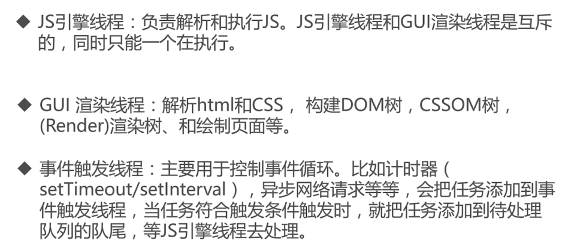
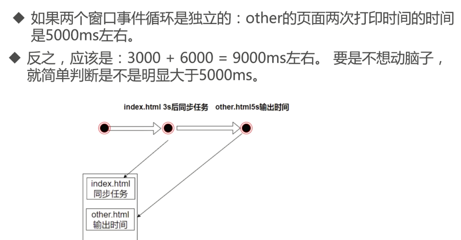
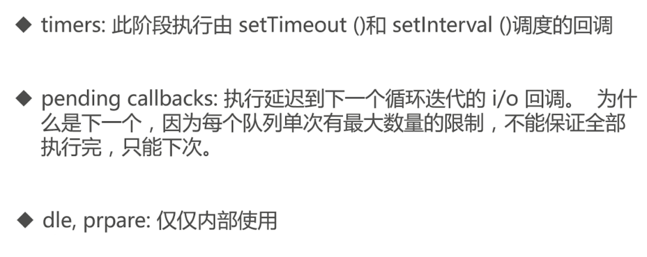
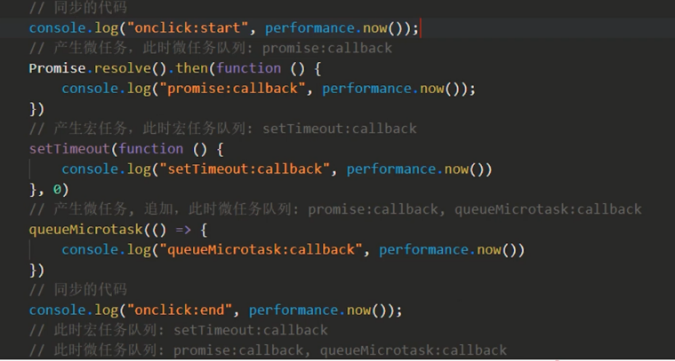
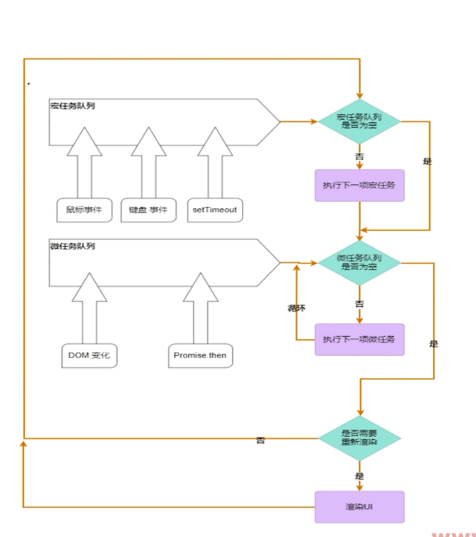

# 永动机”- 事件循环

setTimeout的事件间隔真的最低是4ms吗? Promise不停的then会死循环吗？

## 宏任务，微任务和事件循环

**进程和线程**

- 进程：资源分配的最小单位
- 线程：CPU 调度的最小单位
- 线程依附于进程的，一个进程可由多个线程

**浏览器 - 多进程**

- 打开更多工具 - 任务管理


几个重要的进程：


**浏览器 - 多进程多线程**


渲染进程中的线程：




异步操作：


**宏任务：**


**微任务**

- Promise
- MutationObserver


```html
<!DOCTYPE html>
<html lang="en">
  <head>
    <meta charset="UTF-8" />
    <meta http-equiv="X-UA-Compatible" content="IE=edge" />
    <meta name="viewport" content="width=device-width, initial-scale=1.0" />
    <title>Document</title>
    <style>
      * {
        font-size: 28px;
      }
    </style>
  </head>

  <body>
    <div id="container"></div>

    <div>
      <button type="button" id="btnAdd">添加子节点</button>
    </div>

    <script>
      const containerEl = document.getElementById("container");
      // 观察器的配置（需要观察什么变动）
      const config = { attributes: true, childList: true, subtree: true };

      // 当观察到变动时执行的回调函数
      const callback = function (mutationsList, observer) {
        // Use traditional 'for loops' for IE 11
        for (let mutation of mutationsList) {
          if (mutation.type === "childList") {
            console.log(
              `A child node has been added or removed. ${performance.now()}`
            );
          } else if (mutation.type === "attributes") {
            console.log(
              "The " + mutation.attributeName + " attribute was modified."
            );
          }
        }
      };
      // 创建一个观察器实例并传入回调函数
      const observer = new MutationObserver(callback);
      // 以上述配置开始观察目标节点
      observer.observe(containerEl, config);

      btnAdd.onclick = function () {
        setTimeout(function () {
          console.log("setTimeout callback:", performance.now());
        });
        containerEl.append(`added node: ${performance.now()}`);
      };
    </script>
  </body>
</html>
```

**浏览器事件循环机制**


- 一次循环执行任务队列一个宏任务
- 然后执行所有的微任务

伪代码示例：


同源窗口之间共享事件循环：


一个窗口打开另外一个窗口，共享事件循环：




不共享事件循环：
- a 标签增加 rel="noopener"
```html
<a id="btnOpen" target="_blank" href="./other.html" rel="noopener" >打开新窗口</a>
```

**Nodejs 事件循环**


Nodejs 事件循环阶段：




**queueMicrotask**


示例1：


示例2：



**queueMicrotask folyfill（垫片）**


**无尽微任务**


## 小试牛刀之宏任务和微任务

案例一：async+await
```ts
async function async1() {
  console.log("async1 start");
  await async2();
  // .then()
  console.log("async1 end");
}
async function async2() {
  console.log("async2");
}
// new Promise(function(resolve, reject) {
//     resolve(undefined);
// })

console.log("main start");

setTimeout(function () {
  console.log("setTimeout");
});
async1();
new Promise(function (resolve) {
  console.log("promise 构造");
  resolve();
}).then(function () {
  console.log("promise then");
});

console.log("main end");

// 宏任务：
// 微任务：

/* 输出 */
// main start
// async1 start
// async2
// promise 构造
// main end
// async1 end
// promise then
// setTimeout

// js主线程 "main-start"  "async1 start"   "async2"  "promise 构造"  "main end"
// 宏任务："setTimeout"
// 微任务： "async1 end"  “promise then”
```

案例二：宏任务产生微任务
```ts
console.log("main start");

setTimeout(function setTimeout0() {
    console.log("T1:宏任务");
    Promise.resolve().then(() => {
        console.log("T2:微任务");
    });
});

new Promise(function (resolve, reject) {
    console.log("T3:Promise 构造");
    setTimeout(function setTimeout300() {
        console.log("T4:宏任务");
        resolve("T6");
        Promise.resolve().then(() => {
            console.log("T5:微任务");
        });
    }, 300);
}).then((res) => {
    console.log("T6:微任务");
});


//--------------1--------------------
// js 主线程 ： “main start”
//////  输出：“main start”

//--------------2-------------------
// js 主线程 ：setTimeout
// 宏任务：'T1:宏任务'（新增）

//--------------3-------------------
// js 主线程 ：new promise
// 宏任务：'T1:宏任务'                                  (增加倒计时300ms)

//////  输出：'T3:Promise 构造'

//--------------4-------------------
// js 主线程 ：'T1:宏任务'
// 宏任务：
// 微任务： ‘T2:微任务’（新增）

//////  输出：'T1 宏任务'

//--------------5-------------------
// js 主线程 ：‘T2:微任务’
// 宏任务：
// 微任务：

//////  输出：'T2:微任务'

//--------------5-------------------
//                                                        (倒计时0ms)
// js 主线程 ：
// 宏任务：‘T4:宏任务’
// 微任务：

//--------------6-------------------
//事件循环
// js 主线程 ：‘T4:宏任务’
// 宏任务：
// 微任务： 'T6:微任务'（新增）'T5:微任务'（新增）

////// 输出：'T4:宏任务'

//--------------7-------------------
// js 主线程 ：'T6:微任务'
// 宏任务：
// 微任务：'T5:微任务'

//////  输出：'T6:微任务'

//--------------8------------------
// js 主线程 ：'T5:微任务'
// 宏任务：
// 微任务：

///////  输出：'T5:微任务'
```

案例三：MessageChannel优先级
```html
<body>
    <button id="startMsg">BroadcastChannel 发送广播</button>

    <script>
        startMsg.onclick = function () {
            console.log("main");
            setTimeout(() => {
                console.log("setTimeout 宏任务 1");
            }, 0);

            new Promise((resolve, reject) => {
                console.log("promise 构造");
                resolve(5);
            }).then((data) => {
                console.log("promise 微任务", data);
            });

            const ch = new MessageChannel();
            ch.port1.onmessage = function (ev) {
                console.log("收到MessageChannel消息", ev.data.msg);
            };
            ch.port2.postMessage({ msg: "11" });

            new Promise((resolve, reject) => {
                console.log("promise2 构造");
                resolve(6);
            }).then((data) => {
                console.log("promise2 微任务", data);
            });

            setTimeout(() => {
                console.log("setTimeout 宏任务 2");
            },0);

            console.log("main end");
        };
    </script>
</body
```

案例四: Promise.then
```ts
//第一个promise
Promise.resolve()
    .then(() => {
        console.log(1);
    })
    .then(() => {
        console.log(3);
        return Promise.resolve(7);
    })
    .then((res) => {
        console.log(res);
    });

//第二个promise
Promise.resolve()
    .then(() => {
        console.log(2);
    })
    .then(() => {
        console.log(4);
    })
    .then(() => {
        console.log(5);
    })
    .then(() => {
        console.log(6);
    })
    .then(() => {
        console.log(8);
    });
```

## DOM事件小例子，巩固解事件循环

回顾事件循环：




案例一：DOM 事件在事件循环中的执行顺序


```html
<!DOCTYPE html>
<html lang="en">
    <head>
        <meta charset="UTF-8" />
        <meta http-equiv="X-UA-Compatible" content="IE=edge" />
        <meta name="viewport" content="width=device-width, initial-scale=1.0" />
        <title>Document</title>
        <style>
            .outer-btn{
                position: relative;
                width: 300px;
                height: 100px;
                background: red;
            }

            .inner-btn{
                position: relative;
                width: 200px;
                height: 80px;
                background: yellow;
            }
        </style>
    </head>

    <body>
        <div class="outer-btn">
            外部按钮
            <div class="inner-btn">内部按钮</div>
        </div>
        <script>
            var outerBtn = document.querySelector(".outer-btn");
            var innerBtn = document.querySelector(".inner-btn");

            new MutationObserver(function () {
                console.log("mutate 微任务");
            }).observe(outerBtn, {
                //观察属性变化
                attributes: true,
            });

            //点击方法
            function onClick() {
                console.log("click");
                setTimeout(function () {
                    console.log("timeout 宏任务");
                });
                Promise.resolve().then(function () {
                    console.log("promise 微任务");
                });

                outerBtn.setAttribute("data-number", Math.random());
            }

            outerBtn.addEventListener("click", onClick);
            innerBtn.addEventListener("click", onClick);


            // click时：
            // 宏任务队列：onClick(inner), onClick(outer)


            // 事件循环： 执行第一个onClick(inner)
            // 执行前：
            // 宏任务队列：onClick(inner), onClick(outer)
            // 微任务任务队列：

            //// console.log("click");

            // 执行后：
            // 宏任务队列： onClick(outer), setTimeout
            // 微任务任务队列：promise, mutate

            //// 执行微任务输出： promise 微任务, mutate 微任务


            //事件循环： 执行第二个onClick(outer)
            // 执行前：
            // 宏任务队列：onClick(outer), setTimeout
            // 微任务任务队列：

            //// console.log("click");

            // 执行后：
            // 宏任务队列： setTimeout, setTimeout
            // 微任务任务队列：promise, mutate

            ///// 执行微任务输出： promise 微任务, mutate 微任务


            // 下一个事件循环
            // 执行前 宏任务队列： setTimeout, setTimeout
            //// 输出 timeout 宏任务
            // 执行后 宏任务队列： setTimeout


            // 再下一个事件循环
            // 执行前 宏任务队列： setTimeout
            //// 输出 timeout 宏任务
            // 执行后 宏任务队列：

        </script>
    </body>
</html>
```


案例二：js 点击事件对 DOM 事件影响


使用 click(), dispatch 不会进入宏任务

多次 outerBtn.setAttribute("data-number", Math.random()); 只会使一次

```html
<!DOCTYPE html>
<html lang="en">
    <head>
        <meta charset="UTF-8" />
        <meta http-equiv="X-UA-Compatible" content="IE=edge" />
        <meta name="viewport" content="width=device-width, initial-scale=1.0" />
        <title>Document</title>
        <style>
            .outer-btn{
                position: relative;
                width: 300px;
                height: 100px;
                background: red;
            }

            .inner-btn{
                position: relative;
                width: 200px;
                height: 80px;
                background: yellow;
            }
        </style>
    </head>
    <body>
        <div class="outer-btn">
            外部按钮
            <div class="inner-btn">内部按钮</div>
        </div>
        <script>
            var outerBtn = document.querySelector(".outer-btn");
            var innerBtn = document.querySelector(".inner-btn");

            new MutationObserver(function () {
                console.log("mutate 微任务");
            }).observe(outerBtn, {
                //观察属性变化
                attributes: true,
            });

            //点击方法
            function onClick(ev) {
                console.log("click", ev.currentTarget.className);

                setTimeout(function () {
                    console.log("timeout 宏任务");
                });

                Promise.resolve().then(function () {
                    console.log("promise 微任务");
                });

                outerBtn.setAttribute("data-number", Math.random());
            }

            outerBtn.addEventListener("click", onClick);
            innerBtn.addEventListener("click", onClick);

            // 
            innerBtn.click();

            // 执行第一个onClick(inner)
            // 执行前：
            // 宏任务队列：
            // 微任务任务队列：

            //// console.log("click");

            // 执行后：
            // 宏任务队列： setTimeout
            // 微任务任务队列：promise, mutate


            // 执行第二个onClick(outer)
            // 执行前：
            // 宏任务队列：setTimeout
            // 微任务任务队列：promise, mutate

            //// console.log("click");

            // 执行后：!!!! MutationObserver 不会再添加
            // 宏任务队列： setTimeout, setTimeout
            // 微任务任务队列：promise, mutate, promise,

            ///// 执行微任务输出： promise 微任务, mutate 微任务,promise 微任务,


            // 下一个事件循环
            // 执行前 宏任务队列： setTimeout, setTimeout
            //// 输出 timeout 宏任务
            // 执行后 宏任务队列： setTimeout


            // 再下一个事件循环
            // 执行前 宏任务队列： setTimeout
            //// 输出 timeout 宏任务
            // 执行后 宏任务队列：

        </script>
    </body>
</html>
```

案例三：宏任务和微任务


```html
<!DOCTYPE html>
<html lang="en">

<head>
    <meta charset="UTF-8">
    <meta http-equiv="X-UA-Compatible" content="IE=edge">
    <meta name="viewport" content="width=device-width, initial-scale=1.0">
    <title>Document</title>
    <style>
        .option-btn {
            position: relative;
            width: 200px;
            height: 200px;
            font-size: 20px;
            color: #fff;
            background: red;
        }
    </style>
</head>
<body>
    <div>
        <button id="btnStart">触发按钮</button>
    </div>

    <button class="first-btn">首次点击</button>
    <button class="second-btn"> 二次点击</button>
    <script>

        var firstBtn = document.querySelector(".first-btn");
        var secondBtn = document.querySelector(".second-btn");
        //同步耗时操作
        function asyncSleep(duration) {
            const now = Date.now();
            while (now + duration > Date.now()) {

            }
        }

        firstBtn.onclick = function () {
            console.log("firstBtn onClick", new Date().toLocaleTimeString())
            //2. 假设需要执行3s
            console.time("firstBtn:cost")
            asyncSleep(3000);
            Promise.resolve().then(() => {
                console.log("执行 微任务 promise", new Date().toLocaleTimeString());
                //3. 假设需要执行2s
                console.time("promise:cost");
                asyncSleep(2000);
                console.timeEnd("promise:cost");
            })
            console.timeEnd("firstBtn:cost")
        }

        secondBtn.onclick = function () {
            console.log("secondBtn onClick", new Date().toLocaleTimeString())
            //4. 假设需要执行1s
            console.time("secondBtn:cost")
            asyncSleep(1000);
            console.timeEnd("secondBtn:cost")
        }

        btnStart.onclick = function () {
            //1. 假设需要执行5s
            console.log("main:", new Date().toLocaleTimeString())
            console.time("main:cost")
            asyncSleep(5000);
            console.timeEnd("main:cost")
        }

    </script>
</body>

</html>
```


案例四：同步变异步


同步：（会出现假死）

```html
<!DOCTYPE html>
<html lang="en">

<head>
    <meta charset="UTF-8">
    <meta http-equiv="X-UA-Compatible" content="IE=edge">
    <meta name="viewport" content="width=device-width, initial-scale=1.0">
    <title>Document</title>
    <style>
    </style>
</head>

<body>
    <button id="btnLog" class="btnLog">操作点击事件</button>
    <button class="start">开始添加dom</button>
    <script>

        var startBtn = document.querySelector(".start");
        var array = [];
        for (var i = 1; i <= 300000; i++) {
            array.push(i);   //制造300000条数据
        };
        console.log("数据制造完成");
        //渲染数据
        var renderDomList = function (data) {
            for (var i = 0, l = data.length; i < l; i++) {
                var div = document.createElement('div');
                div.innerHTML = `列表${i}`;
                document.body.appendChild(div);
            }
        };

        startBtn.onclick = function () {
            console.log("startBtn clicked:", new Date().toLocaleTimeString());
            renderDomList(array);
        }

        btnLog.onclick = function () {
            console.log("btnLog clicked:", new Date().toLocaleTimeString());
        }
    </script>
</body>

</html>
```

变异步：

```html
<!DOCTYPE html>
<html lang="en">

<head>
    <meta charset="UTF-8">
    <meta http-equiv="X-UA-Compatible" content="IE=edge">
    <meta name="viewport" content="width=device-width, initial-scale=1.0">
    <title>Document</title>
    <style>
    </style>
</head>

<body>
    <button id="btnLog" class="option-btn">操作点击事件</button>
    <button class="start">开始添加dom</button>
    <script>

        var startBtn = document.querySelector(".start");

        const step = 200;

        var array = [];
        for (var i = 1; i <= 300000; i++) {
            array.push(i);   //制造300000条数据
        };
        console.log("数据制造完成");

        //渲染数据
        var renderDomList = function (data, startIndex, endIndex) {
            if (startIndex < endIndex && endIndex <= data.length) {
                setTimeout(() => {
                    for (let i = startIndex; i < endIndex; i++) {
                        var div = document.createElement('div');
                        div.innerHTML = `列表${i}`;
                        document.body.appendChild(div);
                    }
                    let nextIndex = endIndex + step > data.length ? data.length : endIndex + step;
                    let nextStartIndex = endIndex > data.length ? data.length : endIndex;
                    renderDomList(data, nextStartIndex, nextIndex);
                }, 0)
            }
        };

        startBtn.onclick = function () {
            console.log("startBtn clicked:", new Date().toLocaleTimeString());
            renderDomList(array, 0, 0 + step);
        }

        btnLog.onclick = function () {
            console.log("btnLog clicked:", new Date().toLocaleTimeString());
        }
    </script>
</body>

</html>
```

总结：


