# 玩转客户端存储

cookie, storage，indexedDB等常见的客户端缓存，了解其适用场景，并封装一些适用的工具库。 这当然不够，还有很多进阶知识点，比如你不知道的storage，storage扩容，sessionStorage的盲区等等

## cookie高级使用和注意事项

**客户端写 Cookie**

```ts
const domNode = document.querySelector(".show-cookie");
getCookie.onclick = function () {
    //读
    domNode.innerText = document.cookie;
};
setCookie.onclick = function () {
    //写
    document.cookie = "testUid=test;path=/;";
};

deleteCookie.onclick = function () {
    const expiresTime = new Date(0).toUTCString();
    //修改cookie或者删除cookie,需要保障path和domain两个值不变。
    document.cookie = `testUid=test;path=/;expires=${expiresTime};`;
};
```

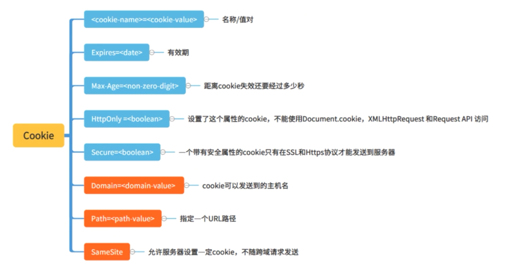

注意点：

- 删除 cookie ，设置 cookie 的过期时间为过去时间即可
- 设置多个 cookie，多次调用 document.cookie
- 修改cookie或者删除cookie,需要保障path和domain两个值不变。


**服务端写 Cookie**

```ts
//设置cookie
res.setHeader('Set-Cookie', ['userToken=1111;Max-Age=86400;']);
// 或者
res.cookie("cid", '555', { maxAge: 86400, httpOnly: true });
```

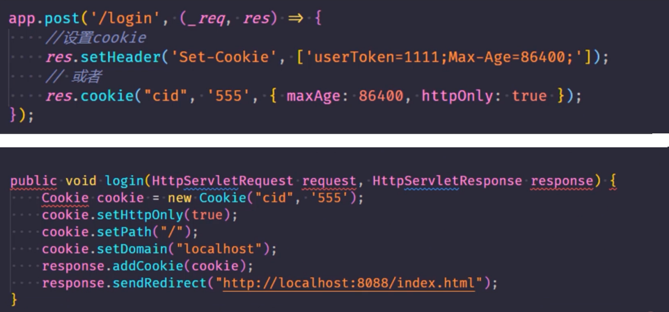

**Cookie 的几个特殊选型**

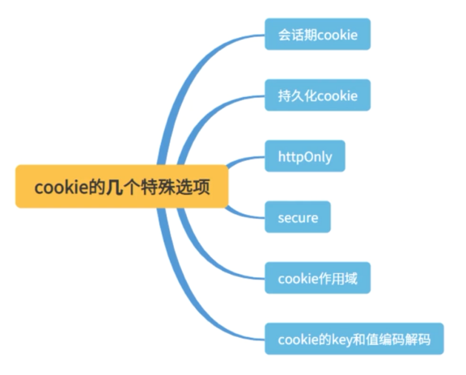

**会话期 cookie**

- 定义：浏览器会话期间的 cookie，浏览器关闭以后自动删除。
- 设置会话期 cookie：不指定过期时间(Expires)和有效期(Max-Age)即可

**持久化 cookie**

- 定义：持久化 cookie 的生命周期取决于过期时间(Expires)和有效期(Max-Age),持久化 cookie 存储在客户端硬盘中。
- Max-Age：正数，cookie 持久化时间，单位秒
- Max-Age：0 ，可以删除 cookie

**httpOnly**

- 定义：设置为 true，可以阻止通过 js 访问cookie。能有效的防止 XSS 攻击
- document.cookie 无法访问

**secure**
- 定义：设置为 true，cookie 只会被https 传输到服务端。

**cookie的作用域**

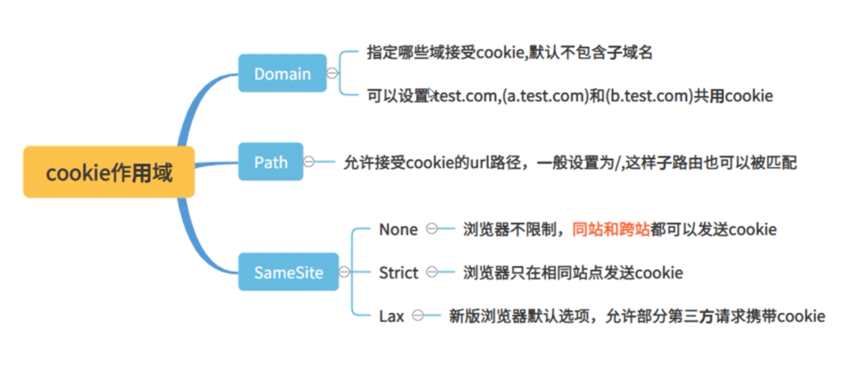

**cookie同源和同站区别**

- 同源：协议 + 端口 + 域名
- 同站：有效顶级域名+二级域名，不考虑端口和协议


同站
```ts
// a.taobao.com b.taobao.com
// 127.0.0.1:8000 127.0.0.1:443
```

跨站：
```ts
// a.github.io b.github.io
// github.io 属于一个有效的顶级域名
```

**SameSite 跨站携带 cookie**

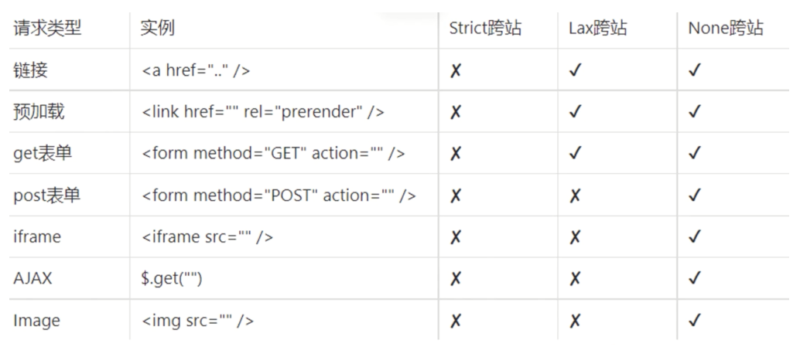

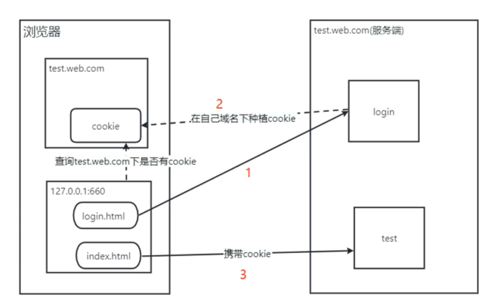

注意事项：
- SameSite 必须和 Secur 同事设置才生效
- 前端站点和后端接口为 https

**key 和 value 编解码**

为什么要编解码？

- key 和 value 中出现了分号，等号等特殊符号，影响我们解析操作

```ts
const key=encodeURIComponent("testUid");
const value=encodeURIComponent("test=1");
document.cookie=`${key}=${value};path=/;`
```

**检查用户是否禁用 cookie**

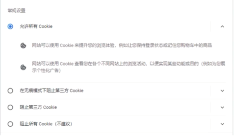

```ts
window.navigator.cookieEnabled
```

**编写 cookie 工具库**

CookieUtils.js
```ts
/**
 *
 * 编码 -方便后续替换编解码方法
 * @param {any} s
 * @returns
 */
function encode(s) {
  return encodeURIComponent(s);
}
/**
 *
 * 解码-方便后续替换编解码方法
 * @param {any} s
 * @returns
 */
function decode(s) {
  return decodeURIComponent(s);
}

/**
 *
 * 获取cookie
 * @param {any} key
 * @returns
 */
function getCookieItem(key) {
  let result = key ? undefined : {},
    cookies = document.cookie ? document.cookie.split("; ") : [],
    i = 0,
    l = cookies.length;
  for (; i < l; i++) {
    let parts = cookies[i].split("="),
      //取第一个等号前面的作为key
      name = decode(parts.shift()),
      cookie = parts.join("=");

    if (key === name) {
      result = decode(cookie);
      break;
    }

    if (!key && cookie !== undefined) {
      //key 未定义，返回全部的key和value对象
      result[name] = decode(cookie);
    }
  }
  return result;
}

/**
 *
 * 设置cookie
 * @param {any} key
 * @param {any} value
 * @param {any} [options={}]
 * @returns
 */
function setCookieItem(key, value, options = {}) {
  if (!key) return false;
  console.log(options);

  let sExpires = "";
  if (options.expires) {
    switch (options.expires.constructor) {
      case Number:
        sExpires =
          options.expires === Infinity
            ? "; expires=Fri, 31 Dec 9999 23:59:59 GMT"
            : "; max-age=" + options.expires;
        break;
      case String:
        sExpires = "; expires=" + options.expires;
        break;
      case Date:
        sExpires = "; expires=" + options.expires.toUTCString();
        break;
    }
  }

  window.document.cookie = [
    encode(key),
    "=",
    encode(value),
    sExpires,
    options.path ? "; path=" + options.path : "",
    options.domain ? "; domain=" + options.domain : "",
    options.secure ? "; secure" : "",
  ].join("");
  return true;
}

/**
 *
 * 移除单个cookie字段
 * @param {any} key
 * @param {any} options
 * @returns
 */
function removeCookieItem(key, options) {
  setCookieItem(key, "", { ...options, expires: -1 });
  return !getCookieItem(key);
}
```

use:
```ts
const cookieOption={
    path:"/",
    domain:"127.0.0.1",
    expires:15
};
const domNode= document.querySelector(".show-cookie");
getCookie.onclick=function(){
    domNode.innerText=document.cookie;
}
setCookie.onclick=function(){
    setCookieItem("testUid","test=222=1",cookieOption)
}

getSingleCookie.onclick=function(){
    domNode.innerText=getCookieItem("testUid");
    console.log(getCookieItem())
}

deleteCookie.onclick=function(){
    removeCookieItem("testUid",cookieOption)
}
```

**新异步操作 CookieAPI - cookieStore**

- set: 设置 cookie，可以是 set(name, value)，也可以是 set({name, value})；
- get: 获取 cookie，可以是 get(name)，或者 get({name});
- getAll: 获取所有的 cookie；
- delete: 删除 cookie；
- onchange: 监听 cookie 的变化；

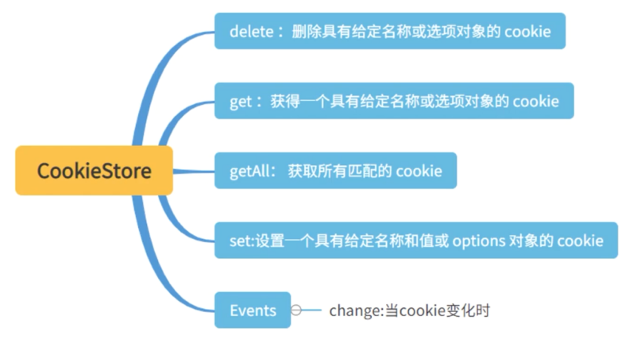

```ts
// 设置
cookieStore
  .set('username', 'meizi')
  .then(() => console.log('设置username成功'))
  .catch(() => console.error('设置username失败'));

cookieStore
  .set({
    name: 'age',
    value: 18,
    expires: new Date().getTime() + 24 * 60 * 60 * 1000,
  })
  .then(() => console.log('设置age成功'))
  .catch(() => console.error('设置age失败'));

// 获取指定
const username = await cookieStore.get('username');

// 获取所有
const all = await cookieStore.getAll();

// 删除
cookieStore
  .delete('age')
  .then(() => console.log('删除age成功'))
  .catch(() => console.error('删除age失败'));

// 监听变化
cookieStore.addEventListener('change', (event) => {
  const type = event.changed.length ? 'change' : 'delete';
  const data = (event.changed.length ? event.changed : event.deleted).map((item) => item.name);

  console.log(`刚才进行了 ${type} 操作，cookie有：${JSON.stringify(data)}`);
});


const isSupportCookieStore = typeof cookieStore === 'object' && location.protocol === 'https:'; // 只有在https协议下才使用cookieStore
```

在 service worker 中使用:

sw.js:
```ts
self.addEventListener("install", async (event) => {
  console.log("service worker is installed");
  const subscriptions = await self.registration.cookies.getSubscriptions();
  await self.registration.cookies.unsubscribe(subscriptions);

  await self.registration.cookies.subscribe([
    {
      name: "cookie-x",
    },
  ]);
});

// 监听变化
self.addEventListener("cookiechange", (ev) => {
  console.log("service worker cookiechange:", ev.changed, ev.deleted);
});

console.log("service worker !!!!");
```

cookieStore 注意事项:
- 安全上下文中使用: 比如 https\localhost 等
- 返回的都是 Promise
- Firefox 和 Safari 暂不支持

## 吃定 Web Storage

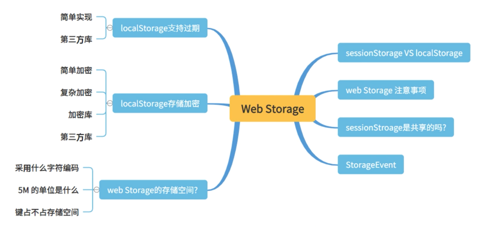

**sessionStorage VS localStorage**

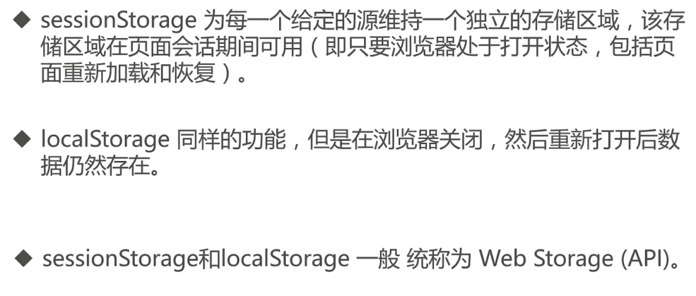
- 都遵循同源策略
- 容量一样


注意事项：

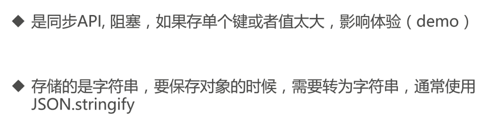

```ts
const arr = Array.from({ length: 5.12 * 1024 * 33 }, (v, index) => ({
    name: "name" + index,
    age: ~~(Math.random() * 100)
}));
btnAdd.onclick = function () {
    console.time(`存`)
    const str = JSON.stringify(arr);
    localStorage.setItem('_', str);
    console.timeEnd(`存`)
}
btnGet.onclick = function () {
    console.time(`取长度${str.length}`)
    localStorage.getItem('_')
    console.timeEnd(`取长度${str.length}`)
}
```

**sessionStroage 是共享的吗**

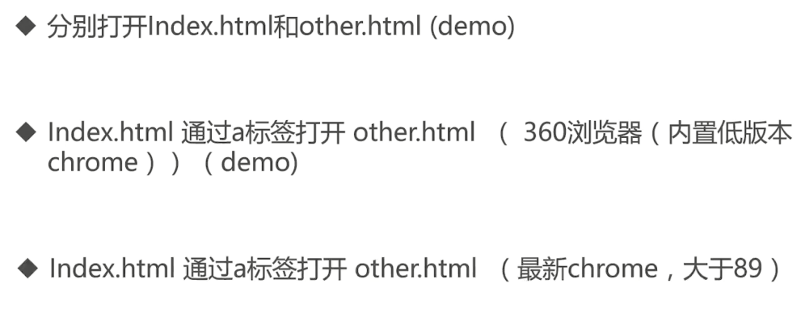

注意 a 标签的 rel="opener"
```html
<a href="./other.html" target="_blank">打开新页面</a>
<a href="./other.html" target="_blank" rel="opener">打开新页面</a>
```

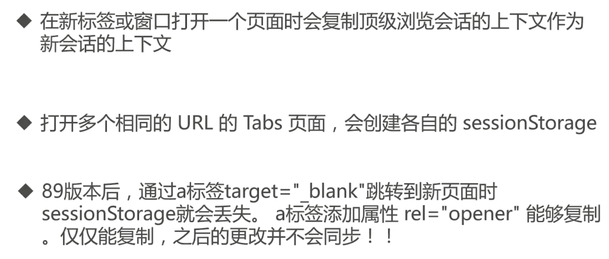


StorageEvent：

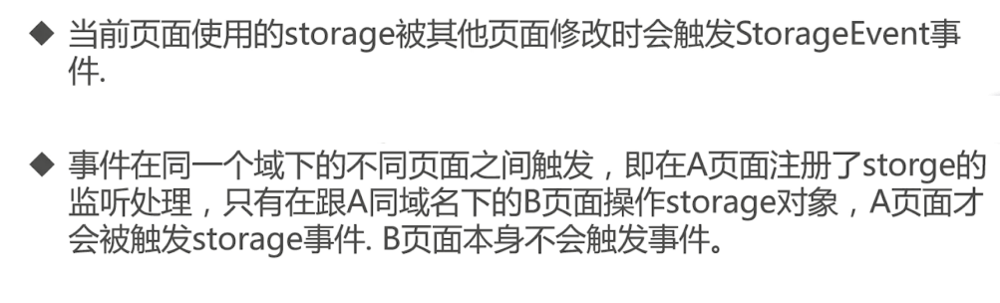

sessionStorage 能触发 StorageEvent 事件吗？

- a 标签打开，不能触发
- iframe 嵌套：能触发
- sessionStorage 和 localStorage 都能触发 StorageEvent，怎么区分是谁触发的

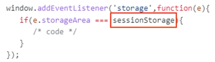


**localStorage 支持过期：简单的实现**

- 添加一个属性，记住过期的时间
- 添加数据的时候，一起保存
- 查询数据，对比时间，过期删除

```html
<body>
    <script>
        const myLocalStore = {
            setItem: (key, value, expire) => {
                const lsValue = JSON.parse(localStorage.getItem(key) || '{}');
                localStorage.setItem(
                    key,
                    JSON.stringify({
                        ...lsValue,
                        value,
                        expire
                    }))
            },
            getItem: (key) => {
                // 在取值之前先判断是否过期
                const lsValue = JSON.parse(
                    localStorage.getItem(key) || "{}"
                )
                if (lsValue.expire && lsValue.expire >= Date.now()) {
                    return lsValue.value
                } else {
                    localStorage.removeItem(key)
                    return null
                }
            }
        }

    </script>

    <script>
        btnSetItem.onclick = function () {
            myLocalStore.setItem('key-x', 'value-1', Date.now() + 10000);
        }
        btnGetItem.onclick = function () {
            console.log("getItem:", myLocalStore.getItem('key-x'));
        }
    </script>
</body>
```

第三方库: web-storage-cache

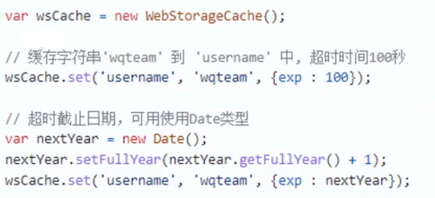

**localStorage 存储加密：简单加密**

- URL 方式：encodeURIComponent + decodeURIComponent
- base64: window.btoa + window.atob

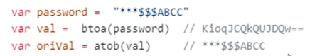


**复杂加密**

- Web Crypto API 的 SubtlrCrypto 接口提供了许多底层加密功能

```ts
<body>
    <div class="flex">
        <div class="side">
            <div>加密前内容</div>
            <div>
                <textarea id="textAreaClearText"></textarea>
            </div>
        </div>
        <div>
            <div>加密后内容</div>
            <div>
                <textarea id="textAreaCipherText"></textarea>
            </div>
        </div>
    </div>

    <div>
        <button type="button" id="btnEncrypt">加密</button>
        <button type="button" id="btnDecrypt">解密</button>
    </div>

    <script>
        let publicKey;
        let privateKey;

        let arrayBuffer;
        (async function init() {
            // 生成私钥(privateKey)和公钥(publicKey)
            // 加密用公钥， 解密用私钥
            const keyPair = await crypto.subtle.generateKey(
                {
                    name: "RSA-OAEP",
                    modulusLength: 2048,
                    publicExponent: new Uint8Array([1, 0, 1]),
                    hash: "SHA-256",
                },
                true,
                ["encrypt", "decrypt"]
            );
            publicKey = keyPair.publicKey;
            privateKey = keyPair.privateKey;
        })();

        /**
         * 返回ArrayBuffer
         */
        function encrypt(text, publicKey) {
            // 字符串转为TypedArray
            const clearText = new TextEncoder().encode(text);
            return window.crypto.subtle.encrypt(
                {
                    name: "RSA-OAEP",
                },
                publicKey,
                // an ArrayBuffer, or a TypedArray
                clearText
            );
        }

        /**
         *  cipherText: ArrayBuffer
         *
         */
        async function decrypt(cipherText, privateKey) {
            // cipherText 是ArrayBuffer
            let decrypted = await window.crypto.subtle.decrypt(
                {
                    name: "RSA-OAEP",
                },
                privateKey,
                cipherText
            );
            const dec = new TextDecoder();
            return dec.decode(decrypted);
        }

        btnEncrypt.onclick = async () => {
            const text = textAreaClearText.value;
            arrayBuffer = await encrypt(text, publicKey);

            // ArrayBuffer转为字符串
            const dec = new TextDecoder();
            textAreaCipherText.value = dec.decode(arrayBuffer);
            console.log("arrayBuffer:", arrayBuffer);
        };

        btnDecrypt.onclick = async () => {
            const text = await decrypt(arrayBuffer, privateKey);
            textAreaClearText.value = text;
        };
    </script>
</body>
```

**使用加密库**

- crypto-js

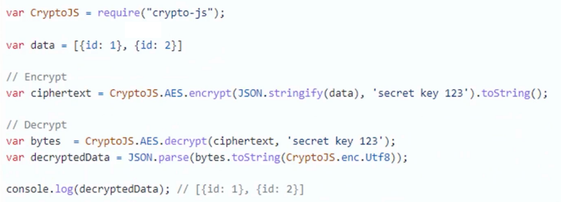

传送门：https://github.com/ShenBao/rsa-aes-utils

- secure-ls

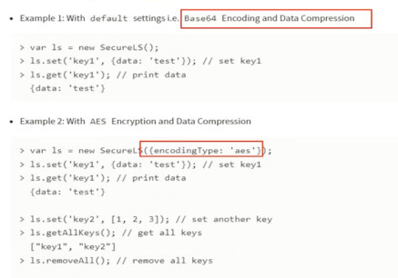

- localstorage-slim

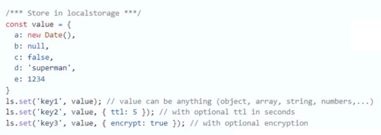

**Web Storage 的存储空间**

localStorage 存储的键值采用什么字符编码？
- 答案：UTF-16
- UTF-16，每个字符使用两个字节，是有前提条件的，就是码点小于 0xFFFF(65535) , 大于这个码点的就是四个字节。

**5M的单位是什么**

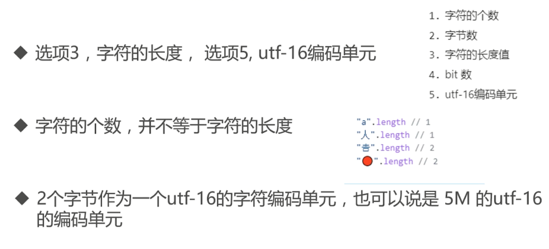

**localStorage 键占不占空间**

- 答案：占

```html
<body>

    <button type="button" id="btnSave">保存</button>
    <script>
        btnSave.onclick = function () {
            const charTxt = "a";
            let count = (2.5 * 1024 * 1024);
            let content = Array.from({ length: count }, _ => charTxt).join("");
            const key = Array.from({ length: count }, _ => charTxt).join("")
            localStorage.clear();
            try {
                console.time("setItem")
                localStorage.setItem(key, content);
                // localStorage.setItem(key, content + '_');
                console.timeEnd("setItem")
            } catch (err) {
                console.log("err code:", err.code);
                console.log("err message:", err.message)
            }
        }
    </script>

</body>
```

## indexedDB 的精华和使用

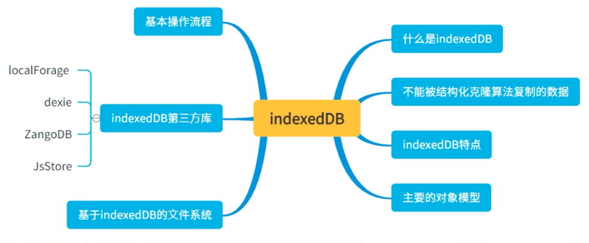

什么是 indexedDB
- 一个`事务型`数据库系统
- 一个基于 JS 的面向对象数据库
- 支持索引
- 可以存储`结构化克隆算法`支持的任何对象

不能被结构化克隆算法复制的数据
- Error 或者 Function 对象
- DOM 节点
- 属性描述符、setters 以及 getters
- 原型链上的属性

MDN： https://developer.mozilla.org/zh-CN/docs/Web/API/Web_Workers_API/Structured_clone_algorithm#%E7%BB%93%E6%9E%84%E5%8C%96%E5%85%8B%E9%9A%86%E6%89%80%E4%B8%8D%E8%83%BD%E5%81%9A%E5%88%B0%E7%9A%84

特点：
- 以键值对方式存储，键可以是二进制对象
- 支持事务
- 异步操作。基于回调函数的异步，不是 Promise
- 遵循同源策略
- 存储空间配额很大
- 支持直接存储二进制内容

**indexedDB 主要对象模型**

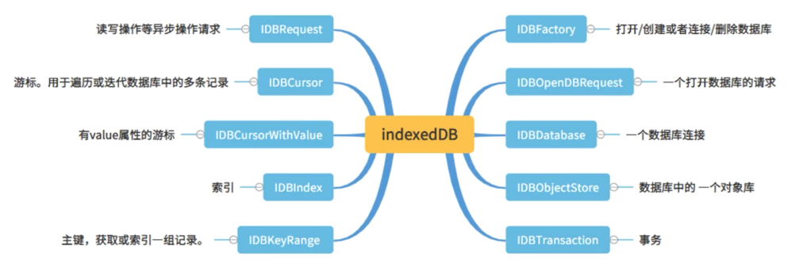

基本操作流程
1. 打开数据库
2. 在数据库中差UN个hi安/对开一个对象仓库
3. 启动一个事务，并发送一个请求来执行一下数据库操作，像增加或提取数据等
4. 通过监听事件以等待操作完成
5. 继续后续的操作

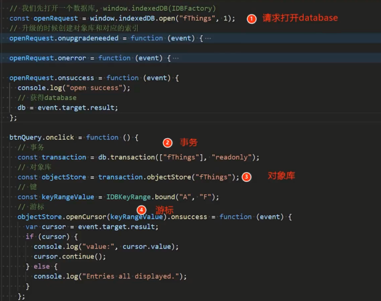

```html
<body>
  <div>
    <button id="btnAdd">添加数据</button>
    <button id="btnQuery">查询数据</button>
  </div>
  <script>
    // https://github.com/mdn/indexeddb-examples/blob/master/idbkeyrange/scripts/main.js
    var db;
    var things = [
      { fThing: "Drum kit", fRating: 10 },
      { fThing: "Family", fRating: 10 },
      { fThing: "Batman", fRating: 9 },
      { fThing: "Brass eye", fRating: 9 },
      { fThing: "The web", fRating: 9 },
      { fThing: "Mozilla", fRating: 9 },
      { fThing: "Firefox OS", fRating: 9 },
      { fThing: "Curry", fRating: 9 },
      { fThing: "Paneer cheese", fRating: 8 },
      { fThing: "Mexican food", fRating: 8 },
      { fThing: "Chocolate", fRating: 7 },
      { fThing: "Heavy metal", fRating: 10 },
      { fThing: "Monty Python", fRating: 8 },
      { fThing: "Aphex Twin", fRating: 8 },
      { fThing: "Gaming", fRating: 7 },
      { fThing: "Frank Zappa", fRating: 9 },
      { fThing: "Open minds", fRating: 10 },
      { fThing: "Hugs", fRating: 9 },
      { fThing: "Ale", fRating: 9 },
      { fThing: "Christmas", fRating: 8 },
    ];

    // 插入数据
    function insertData() {
      // 事务
      var transaction = db.transaction(["fThings"], "readwrite");
      // 对象库
      var objectStore = transaction.objectStore("fThings");
      // 添加数据
      for (i = 0; i < things.length; i++) {
        var request = objectStore.put(things[i]);
      }
      // 成功的回调
      transaction.oncomplete = function () {
        console.log("insert data success");
      };
    }

    // 我们先打开一个数据库, window.indexedDB(IDBFactory)
    const openRequest = window.indexedDB.open("fThings", 1);
    // 升级的时候创建对象库和对应的索引
    openRequest.onupgradeneeded = function (event) {
      var db = event.target.result;
      db.onerror = function (event) {
        console.log("Error loading database");
      };
      var objectStore = db.createObjectStore("fThings", {
        keyPath: "fThing",
      });
      objectStore.createIndex("fRating", "fRating", { unique: false });
    };

    openRequest.onerror = function (event) {
      console.log("open error:", event);
    }

    openRequest.onsuccess = function (event) {
      console.log("open success");
      // 获得database
      db = event.target.result;
    };

    btnQuery.onclick = function () {
      // 事务
      const transaction = db.transaction(["fThings"], "readonly");
      // 对象库
      const objectStore = transaction.objectStore("fThings");
      // 键
      const keyRangeValue = IDBKeyRange.bound("A", "F");
      // 游标
      objectStore.openCursor(keyRangeValue).onsuccess = function (event) {
        var cursor = event.target.result;
        if (cursor) {
          console.log("value:", cursor.value);
          cursor.continue();
        } else {
          console.log("Entries all displayed.");
        }
      };
    };

    btnAdd.onclick = insertData;

  </script>
</body>
```

实用场景：
- 缓存数据，比如游戏数据
- 缓存图片，脚本，json 文件等静态资源
- service worker 的第三方库，就有利用到 indexedDB

第三方库：

- localForage
 
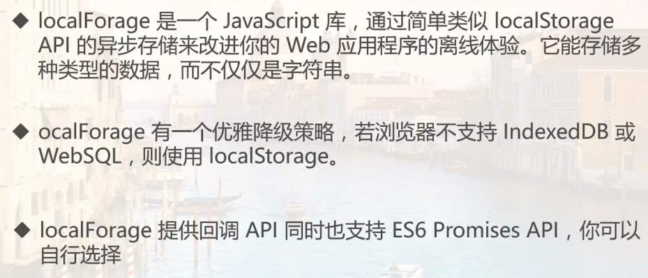

- dexie.js

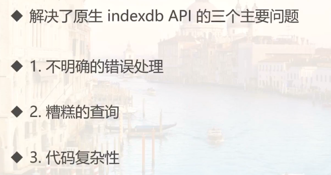

- ZangoDB

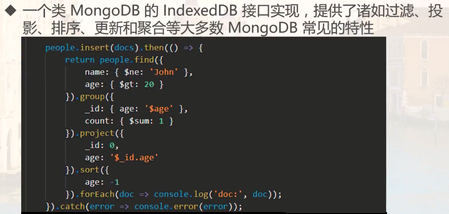

- JsStore

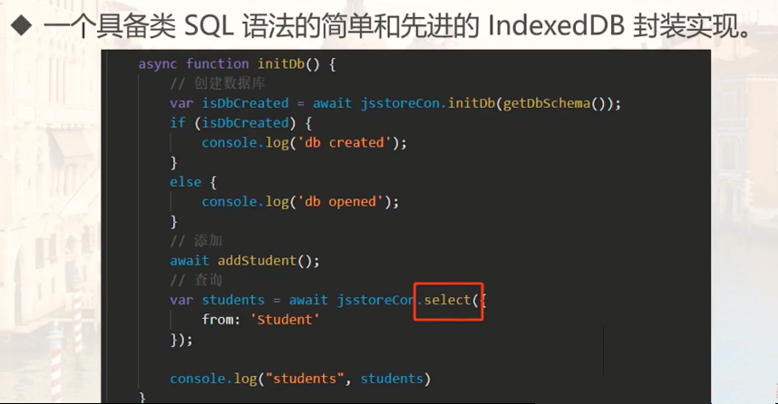


基于 IndexedDB 的文件系统

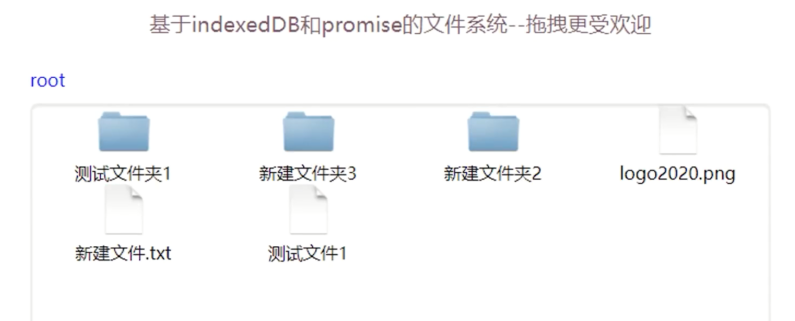


## 客户端存储 大比拼

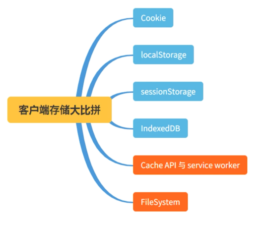

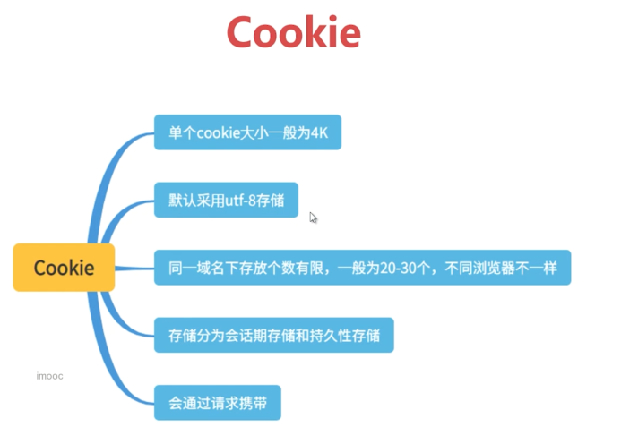

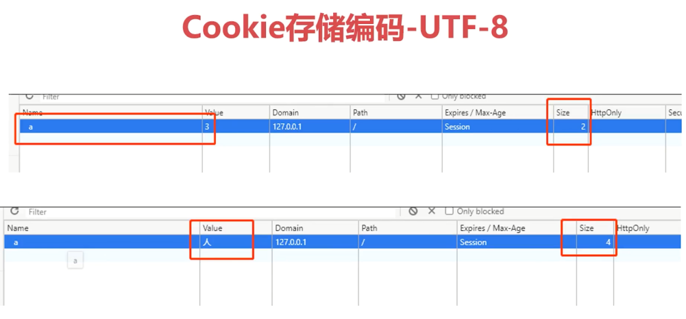

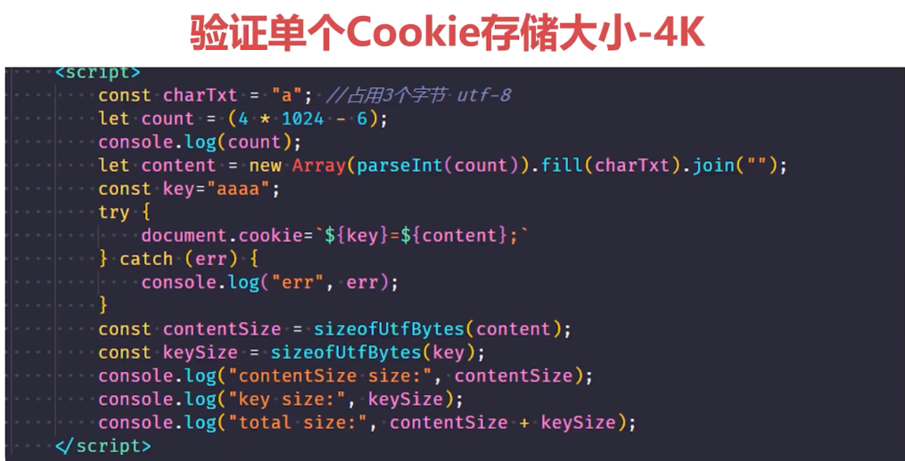

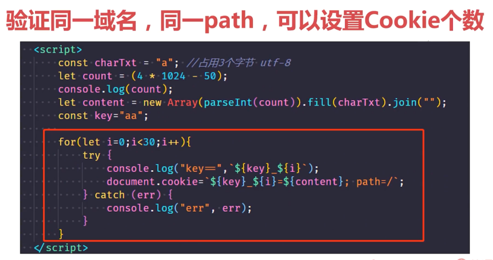

LocalStorage：

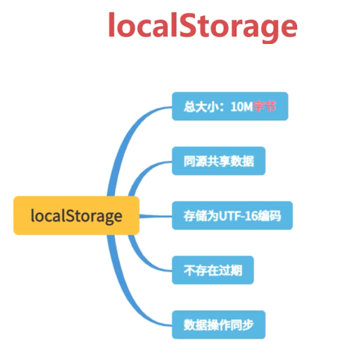

```ts
lBtn.onclick=function(){
    const charTxt = "人";
    let count = (10 * 1024 * 1024) / 2 - 8 / 2;
    let content = new Array(count).fill(charTxt).join("");
    const key = "aa🔴";
    const key1 = "bb🔴";
    localStorage.clear();
    try {
        localStorage.setItem(key, content);
        //测试存储是否与数量有关。
        localStorage.setItem(key1, content);
    } catch (err) {
        console.log("err",err.code ,err, );
    }
    const sizeKey = sizeofUtfBytes(key,"utf16");
    const contentSize = sizeofUtfBytes(content,"utf16");
    console.log("key size:", sizeKey, content.length);
    console.log("content size:", contentSize, content.length);
    console.log("total size:", sizeKey + contentSize, content.length + key.length);
}
```

sessionStorage:

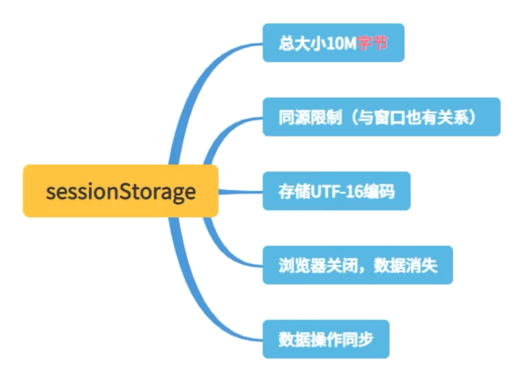

```ts
sBtn.onclick=function(){
    const charTxt = "人";
    let count = (10 * 1024 * 1024) / 2 - 8 / 2;
    let content = new Array(count).fill(charTxt).join("");
    const key = "bb🔴";
    const key1 = "cc🔴";
    sessionStorage.clear();
    try {
        sessionStorage.setItem(key, content);
        sessionStorage.setItem(key1, content);
    } catch (err) {
        console.log("err", err);
    }
    const sizeKey = sizeofUtfBytes(key,"utf16");
    const contentSize = sizeofUtfBytes(content,"utf16");
    console.log("key size:", sizeKey, content.length);
    console.log("content size:", contentSize, content.length);
    console.log("total size:", sizeKey + contentSize, content.length + key.length);
}
```

IndexedDB：

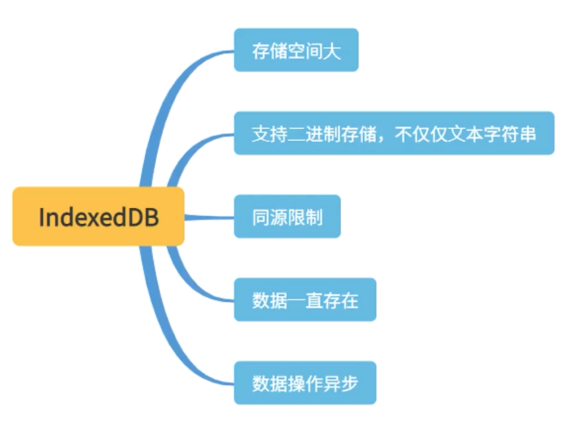

Cache API 与 Service worker：

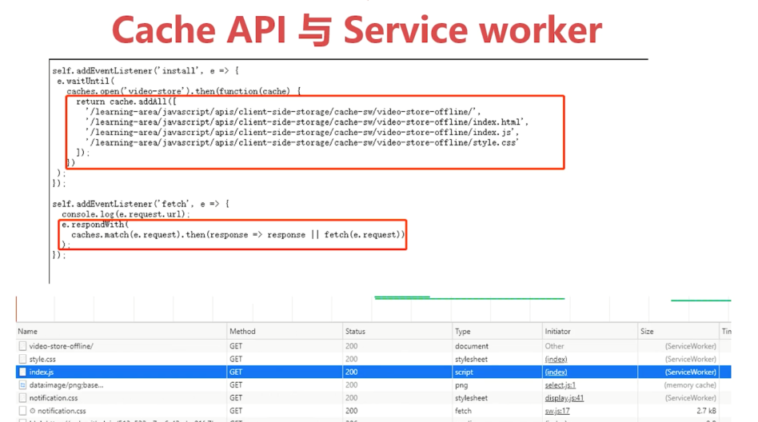

FileSystem(非标准)

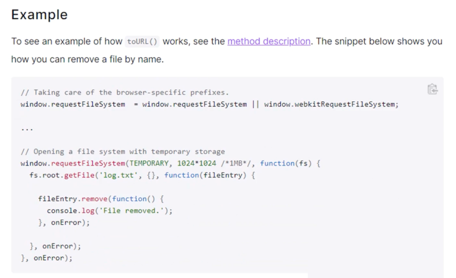

```html
<body>
    <button id="saveFile">存储文件</button>
    <script>
        //1. 获取fileSystem 对象
        window.requestFileSystem = window.requestFilsSystem || window.webkitRequestFileSystem;

        saveFile.onclick = function () {
            //2. 申请空间大小
            window.requestFileSystem(
                Window.TEMPORARY,
                10 * 1024 * 1024,
                (fs) => {
                    //3. 创建文件
                    fs.root.getFile(
                        "test1.txt",
                        { create: true, exclusive: false },
                        (fileEntry) => {
                            //打印创建好的文件访问URL
                            console.log(fileEntry.toURL())
                            //4. 创建一个写入对象
                            fileEntry.createWriter((fileWriter) => {
                                //注册书写成功监听
                                fileWriter.onwriteend = function (e) {
                                    console.log("书写成功");
                                };
                                fileWriter.onerror = function (e) {
                                    console.log("书写失败 " + e.toString());
                                };
                                var blob = new Blob(
                                    [
                                        "测试已下阿大纲的测试已下阿大纲的测试已下阿大纲的测试已下阿大纲的测试已下阿大纲的测试已下阿大纲的测试已下阿大纲的测试已下阿大纲的测试已下阿大纲的测试已下阿大纲的测试已下阿大纲的测试已下阿大纲的测试已下阿大纲的测试已下阿大纲的测试已下阿大纲的测试已下阿大纲的测试已下阿大纲的测试已下阿大纲的测试已下阿大纲的测试已下阿大纲的",
                                    ],
                                    { type: "text/plain" }
                                );
                                //5. 写入内容
                                fileWriter.write(blob);
                            });
                        },
                        (e) => {
                            console.log("eee", e);
                        }
                    );
                },
                (err) => {
                    console.log("file error");
                }
            );
        };
    </script>
</body>
```

总结：

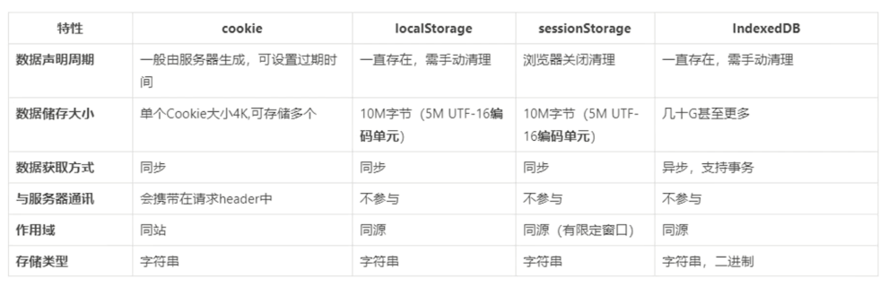
