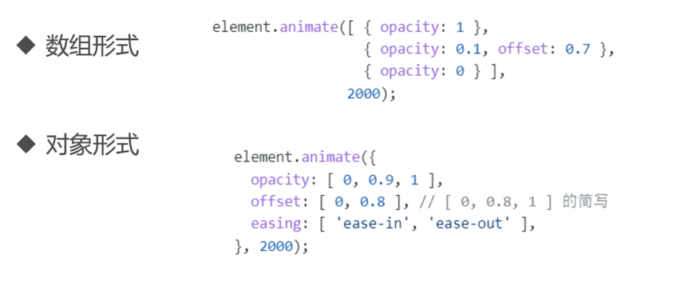
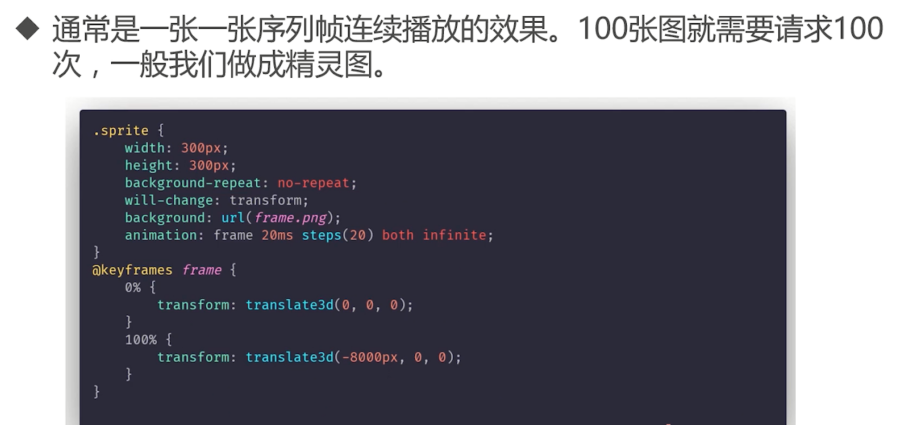
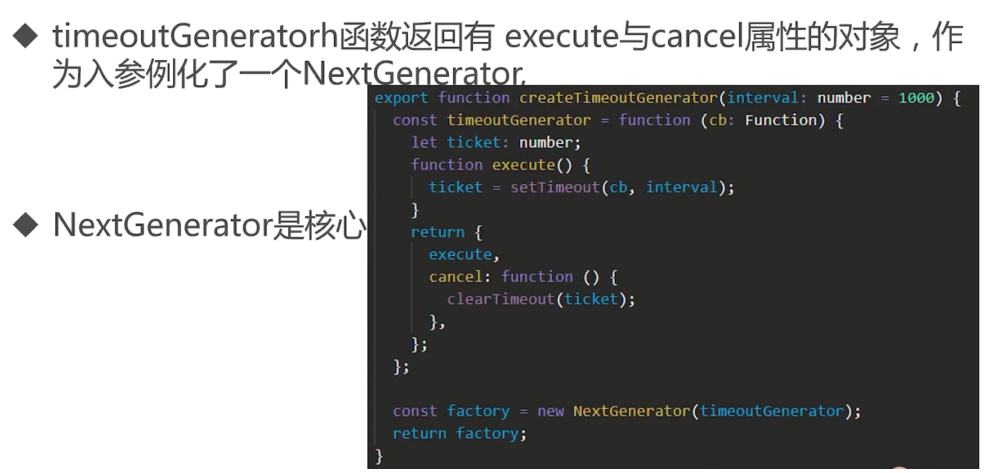

# 动起来：计时器和JS动画

掌握前端动画的基础计时器相关知识，以及CSS 动画相对应的Transition API,Animation API。

## setTimeout与setInterval和新生代的requestAnimation与requestIdleCallback指南


**setInterval**

案例：
- 有一个 setTimeOut 4s 后出触发一次，耗时 9s
- 有一个定时器，setInterval 每 5s 触发一次，每次耗时 4s
- 用户在程序第三秒的时候，触发点击事件，添加 onClick， onClick 耗时 6s

为什么定时器代码间隔会比预期要小？


setInterval - 累计效应
- 定时器代码执行之间的间隔可能比你预期的要小
- 定时器某些间隔被跳过

**setTimeOut**

- setTimeOut 设置一个延时器，该定时器在指定时间到期后执行一个函数或者一段代码。
- 设置的时间是最小延迟时间，真正的执行是在事件循环中执行，所以，真正去执行的时间大于最小延迟时间

默认最低延迟
- 以 chrome 浏览器为例，最低延迟为 1ms，如果延迟大于 2的 31 次方 - 1，那么就设置为 1ms

```ts
//设置最大值
setTimeout(() => {
    console.log("a");
}, 2 ** 31);

//设置最小值
setTimeout(() => {
    console.log("b");
}, 1);

setTimeout(() => {
    console.log("c");
}, 0.5);

//设置0 
setTimeout(() => {
    console.log("d");
}, 0);
```

```ts
let t1 = performance.now();
//打印时间
function printTime(count) {
    const now = performance.now();
    console.log(count,"==时间差：", now - t1);
    t1 = now;
}

setTimeout(() => {
    printTime(1);
    setTimeout(() => {
        printTime(2);
        setTimeout(() => {
            printTime(3);
            setTimeout(() => {
                printTime(4);
                setTimeout(() => {
                    printTime(5);
                    setTimeout(() => {
                        printTime(6);
                    }, 0);
                }, 0);
            }, 0);
        }, 0);
    }, 0);
}, 0);
```

setTimeout 嵌套五层，最小延迟 4ms


setTimeout 与 setInterval 的区别：
- setTimeout 递归循环可以保障每次至少延迟某些特点时间执行。
- setInterval 每次定时触发执行回调，不关心前一个回调函数是否执行。

**requestAnimationFrame**

- requestAnimationFrame 告诉浏览器，你希望执行一个动画，并要在浏览器在下次重绘之前执行指定的回调函数更新动画。
- 回调函数执行次数与浏览器屏幕的刷新次数匹配，一般为每秒 60 次

requestAnimationFrame 在事件循环中的执行时机：


在 update the rendering 中执行时机：


requestAnimationFrame 对比 setTimeout：
- 由系统节点回调函数的执行时机，不需要使用 setTimeout 等计算刷新时间。节省了不必要的浪费，动画看起来更加流程。

setTimeout 实现动画：


requestAnimationFrame 实现动画：


requestAnimationFrame 优点：


**requestIdleCallback**


requestIdleCallback 空闲时间计算：


如何使用：


```html
<body>
    <div id="animateEle" class="animate-ele"></div>
    <button id="start">开始</button>
    <script>
        //同步耗时操作
        function syncSleep(duration) {
            const now = Date.now();
            while (now + duration > Date.now()) { }
        }

        const element = document.getElementById('animateEle');
        let count = 0;

        function step(timestamp) {
            console.log("渲染帧");
            count++;
            if (count < 500) {
                element.style.transform = 'translateX(' + count + 'px)';
                window.requestAnimationFrame(step);
            }
        }

        start.onclick = function () {
            console.log("启动帧");
            window.requestAnimationFrame(step);
            requestIdleCallback((idleDeadline) => {
                // didTimeout表示是否超时正在执行
                const didTimeout = idleDeadline.didTimeout ? '超时正在执行' : '未超时执行'
                // timeRemaining()表示当前帧还剩余多少时间（以毫秒计算）
                const timeRemaining = idleDeadline.timeRemaining();
                console.log("didTimeout==", didTimeout, "==", timeRemaining)

                // { timeout: 50 }
            }, {timeout: 50});//{timeout:50}

            console.log("执行onClick")
            setTimeout(() => {
                console.log("执行timeout")
                syncSleep(1000);
                console.log("执行timeout完成");
                Promise.resolve().then(function () {
                    console.log("promise 微任务");
                });
            }, 30)
            syncSleep(1000);
            console.log("执行onClick完毕")
        };

    </script>
</body>
```

**总结：**


## CSS的动画实现


CSS 动画实现方式：


内置贝塞尔函数运动效果：


```html
<!DOCTYPE html>
<html lang="en">

<head>
    <meta charset="UTF-8">
    <meta name="viewport" content="width=device-width, initial-scale=1.0">
    <meta http-equiv="X-UA-Compatible" content="ie=edge">
    <title>内置贝塞尔的运动</title>
    <style>
        
        *  {
            font-size: 28px;
            color: #FFF;
            font-weight: bold
        }

        .bg-red {
            background-color: red;
        }

        .bg-green {
            background-color: green;
        }

        .bg-blue {
            background-color: blue;
        }


        .bg-sliver {
            background-color: silver;
        }

        .bg-aqua {
            background-color: aqua
        }

        .transition div {
            height: 100px;
            width: 100px;
            position: relative;
            left: 0;
        }

        .transition-s {
            transition-property: left;
            transition-duration: 3000ms;
        }

        .transition-fn-ease {
            transition-timing-function: ease;
        }

        .transition-fn-ease-in {
            transition-timing-function: ease-in;
        }

        .transition-fn-linear {
            transition-timing-function: linear;
        }

        .transition-fn-ease-out {
            transition-timing-function: ease-out;
        }

        .transition-fn-ease-in-out {
            transition-timing-function: ease-in-out;
            
             /* transition-timing-function: cubic-bezier(.95,.05,.59,.75) */
        }

        .transition.ani div{
            left: calc(100% - 100px);
        }
    </style>
</head>

<body>

    <div class="transition">
        <div class="bg-red transition-s transition-fn-ease" data-t="ease">ease</div>
        <div class="bg-green transition-s transition-fn-linear" data-t="linear">linear</div>
        <div class="bg-blue transition-s transition-fn-ease-in" data-t="ease-in">ease-in</div>
        <div class="bg-sliver transition-s transition-fn-ease-out" data-t="ease-out">ease-out</div>
        <div class="bg-aqua transition-s transition-fn-ease-in-out" data-t="ease-in-out">ease-in-out</div>
    </div>
    <div>
    <button id="btnStart" style="color:red">开始</button>
    </div>

    <script>

        var el = document.querySelector(".transition");
        document.getElementById("btnStart").addEventListener("click", function(){
            el.classList.add("ani");
        })

        document.querySelector(".transition-s").addEventListener("transitionend", function(){
            el.classList.remove("ani");
        })
    </script>

</body>

</html>
```

贝塞尔曲线自定义：


自定义贝塞尔曲线要点：
- 曲线越陡峭，速度越快，反之，速度越慢
- 控制点的位置会影响曲线形状

贝塞尔曲线应用场景：
- svg
- canvas、webgl
- css 动画
- animation web api

**animation**


实现：
```css
.progress-in {
    position: relative;
    width: 100%;
    height: 100%;
    background: red;
    animation: 3s linear 0s progress forwards;
    transform: translateY(100%);
    animation-play-state: paused;
}

@keyframes progress {
    from {
        transform: translateY(100%);
    }

    to {
        transform: translateY(0%);
    }
}
```

使用技巧：
- 动画暂停与启动：animationPlayState
- webkit - 动画的事件监听：webkitAnimationEnd、webkitAnimationStart、webkitAnimationIteration

**transition**


transition 事件：


实现：
```css
.progress-in {
    position: relative;
    width: 100%;
    height: 100%;
    background: red;
    opacity: 1;
    transform: translateY(100%);
    transition: transform 3s, opacity 3s;
}
```

注意事项：
- 不是所有的属性都可以用来动效，具体可以参考：[Animatable CSS Properties](https://developer.mozilla.org/en-US/docs/Web/CSS/CSS_animated_properties)
- 不支持动画的属性： bg-imgage、float、display、position、visibility
- 多种属性同时变化，用逗号分割，同时事件的触发次数也会使多次。


动画注意事项：


如何选择：

- 两个状态直接的简单切换，使用 css 动画
- 复杂动画，使用 JS 动画，可控制性更好


## 复杂动画也不用怕，Web Animation API


动画手段：
- RAF、setTimeout、setInterval、属性改变 动画
- CSS3 动画
- Web Animation API，简称 WAAPI

示例：落球

```html
<!DOCTYPE html>
<html lang="en">

<head>
    <meta charset="UTF-8">
    <meta http-equiv="X-UA-Compatible" content="IE=edge">
    <meta name="viewport" content="width=device-width, initial-scale=1.0">
    <title>落球</title>
    <style>
        .ball {
            height: 50px;
            width: 50px;
            border-radius: 50%;
            margin-left: 180px;
            background: radial-gradient(circle at 70% 30%, #0aafe6, #222222);
            cursor: pointer;
        }

        .desk {
            height: 200px;
            width: 200px;
            border-right: 1px solid #000;
            border-top: 1px solid #000;
        }
    </style>
</head>

<body>
    <button type="button" onclick="location.reload();">重置</button>
    <div class="ball"></div>
    <div class="desk"></div>

    <script>
        const ballEl = document.querySelector(".ball");
        ballEl.addEventListener("click", function () {
            let fallAni = ballEl.animate({
                transform: [
                    'translate(0, 0)',
                    'translate(20px, 8px)',
                    'translate(50px, 200px)']
            },
                {
                    easing: "cubic-bezier(.68,.08,.89,-0.05)",
                    duration: 2000,
                    fill: "forwards"
                })
        });

    </script>

</body>

</html>
```

示例：直播的世界消息或者播报

- 滑入：消息先运动到屏幕中间
- 暂停：如果消息过长，消息还需要匀速滚动
- 划出屏幕

```html
<!DOCTYPE html>
<html lang="en">

<head>
    <meta charset="UTF-8">
    <meta http-equiv="X-UA-Compatible" content="IE=edge">
    <meta name="viewport" content="width=device-width, initial-scale=1.0">
    <title>广播</title>
    <style>
        button {
            font-size: 28px
        }

        .stage {
            height: 500px;
            width: 800px;
            background-color: #000;
            position: relative;
        }

        .danmu {
            color: #FFF;
            position: absolute;
            top: 240px;
            font-size: 24px;
            width: 500px;
            overflow: hidden;
            height: 40px;
            /* position: relative; */
        }

        .danmu-content {
            position: absolute;
            /*  不换行 */
            /* width: 100%; */
            white-space: nowrap;
            text-align: center;
            display: inline-block;
            min-width: 500px;
        }
    </style>
</head>

<body>

    <div>
        <button type="button" onclick="broadcast(1)">长消息广播</button>
        <button type="button" onclick="broadcast(0)">短消息广播</button>
    </div>
    <div>
        <div class="stage">

        </div>
    </div>

    <script>

        const DANMU_WIDTH = 500;
        const stageWidth = 800;
        const shortMessage = "短消息";
        const longMessage = "我是长消息我是长消息我是长消息我是长消息我是长消息我是长消息我是长消息我是长消息我是长消息我是长消息";

        const stageEl = document.querySelector('.stage');
        let danmuEl;

        // 创建消息节点并播报
        function broadcast(type) {
            danmuEl = createDanmuEl(type ? longMessage : shortMessage);
            stageEl.appendChild(danmuEl);
            startAnimate();
        }

        // 创建消息节点
        function createDanmuEl(message) {
            const el = document.createElement("div");
            el.className = "danmu";

            const contentWrapper = document.createElement("div");
            contentWrapper.className = "danmu-content-wrapper"

            const contentEl = document.createElement("div");
            contentEl.className = "danmu-content"
            contentEl.textContent = message;

            contentWrapper.appendChild(contentEl)

            el.appendChild(contentWrapper);
            return el;
        }

        async function startAnimate() {
            // 滑入
            const totalWidth = stageWidth + DANMU_WIDTH;
            const centerX = stageWidth * 0.5 - DANMU_WIDTH * 0.5;

            // 计算偏移量
            const kfsIn = {
                transform: [`translateX(${totalWidth}px)`, `translateX(${centerX}px)`]
            }
            await danmuEl.animate(kfsIn, {
                duration: 2000,
                fill: 'forwards',
                easing: 'ease-out'
            }).finished;

            // 暂停部分
            const contentEl = danmuEl.querySelector(".danmu-content");
            // 获取消息元素的长度
            const itemWidth = contentEl.getBoundingClientRect().width;
            // 计算需要滚动的长度
            const gapWidth = Math.max(0, itemWidth - DANMU_WIDTH);
            // 计算需要滚动的时间
            const duration = Math.max(0, Math.floor(gapWidth / 200) * 1000);
            const translateX = duration > 0 ? gapWidth : 0;
            // 偏移量
            const kfsTxt = {
                transform: [`translateX(0px)`, `translateX(-${gapWidth}px)`]
            };
            await contentEl.animate(kfsTxt, {
                duration,
                delay: 2000,
                fill: 'forwards',
                easing: 'linear',
            }).finished;
            // 滑出
            const kfsOut = {
                transform: [`translateX(${centerX}px)`, `translateX(-${DANMU_WIDTH}px)`]
            };
            await danmuEl.animate(kfsOut, {
                duration: 2000,
                fill: "forwards",
                easing: 'ease-in'
            }).finished;

            if (danmuEl) {
                stageEl.removeChild(danmuEl);
            }
            isAnimating = false
        }
    </script>
</body>

</html>
```

**Web Animation API 两个核心的对象**

- KeyframeEffect: 描述动画属性
- Animation： 动画播放控制

KeyframeEffect


```ts
const box1ItemEl = document.querySelector(".box1");
const box2ItemEl = document.querySelector(".box2");

btnPlay.onclick = () => {
    const kyEffect1 = new KeyframeEffect(null, {
        transform: ['translateX(0)', 'translateX(500px)']
    },
        {
            duration: 3000,
            fill: 'forwards'
        }
    )

    const ky1 = new KeyframeEffect(kyEffect1);
    ky1.target = box1ItemEl;
    new Animation(ky1).play();

    const ky2 = new KeyframeEffect(kyEffect1);
    ky2.target = box2ItemEl;
    new Animation(ky2).play();
}
```

```ts
const box1ItemEl = document.querySelector(".box1");
const box2ItemEl = document.querySelector(".box2");


btnPlay.onclick = () => {
    const kyEffect1 = new KeyframeEffect(null, {
        transform: ['translateX(0)', 'translateX(500px)']
    },
        {
            duration: 3000,
            fill: 'forwards'
        }
    )

    const kyEffect2 = new KeyframeEffect(null, {
        transform: ['rotate(0)', 'rotate(720deg)']
    },
        {
            duration: 6000,
            fill: 'forwards'
        }
    )
    kyEffect1.target = box1ItemEl;
    kyEffect2.target = box2ItemEl;
    new Animation(kyEffect1).play();
    new Animation(kyEffect2).play();
}
```

Animation：


事件监听：


便捷的 Element.animate:
- 任何 Element 都具备该方法
- 语法
    ```ts
    animate(keyframes, options)
    ```

Element.animate keyframes:



Element.animate options:


Element.getAnimations:


优势：
- 相对 css 动画更加灵活
- 相对 RAF、settimeout、setInterval 动画，性能更好，代码更简单。
- 天然支持 Promise，爽爽爽!!!

**与CSS动画属性键对照表**


与css 参数设置值上的区别：


兼容性：


查看动画：


## 其他动画方案


动画绘制技术
- Canvas
- SVG
- HTML 元素

Canvas：


Gif 动画：


aPng 动画：


WebP 动画：


帧动画：




SVG 动画：


lottie：


svga：


vap 动效：


- https://github.com/Tencent/vap


video 播放 map4 视频动画：


## 实战：计时器面向next编程

定时器：
- 前端常见的三大定时： setTimeout setInterval requestAnimationFrame
- 多次调用规律：处理完数据后，进入`下一个`周期


一个 setTimeout 的例子，倒计时：
- setTimeout 回调函数更新时间
- clearTimeout 暂停或者结束计时
- 结束时，启动一个新的计时(next)

问题：


next 版本：


requestAnimationFrame： canvas 绘制：


requestAnimationFrame： canvas 绘制 next 版：


**createTimeoutGenerator的背后**




**createRequestAnimationFrameGenerator**


**随心所欲的 next ？**

- 构造有 execute 与 cancel 方法的一个对象
- 传入 NextGenerator ，就拥有了 next 的能力

`答案：是的`


翻倍的计时器


**核心之 NextFnGenerator：**


**核心之 NextFnGenerator：规则**

- cancel 之后，next 不会触发下一次，汇能调用 continue 恢复；
- 执行函数中，多次调用 next 只会生效一次。

**核心之 NextFnGenerator：状态**

- 等待中，已经请求计划
- 执行中
- 取消

**核心之 NextFnGenerator：start**

start 内部调用的是 next 方法

```ts
  start(cb: CallbackFunction, ...args: any[]) {
    if (typeof cb !== "function") {
      throw new SyntaxError("param cb must be a function");
    }
    this.cb = cb;

    if (args.length > 0) {
      this.args = args;
    }

    this.next();
  }
```

**核心之 NextFnGenerator：next**

其最核心的代码就是 next 方法


**核心之 NextFnGenerator：execute**

更改状态，执行时，传入 next 方法


小结：


完整实现：
```ts
interface Unsubscribe {
  (): void;
}

interface CallbackFunction<T = any> {
  (context: T, ...args: any[]): void;
}

interface NextFnInfo<T = any> {
  cancel: Unsubscribe;
  execute: (next: CallbackFunction<T>) => any;
}

interface NextFnGenerator {
  (...args: any[]): NextFnInfo;
}

enum EnumStatus {
  uninitialized = 0,
  initialized,
  waiting,
  working,
  canceled,
  unkown,
}

export default class NextGenerator<T = any> {
  private status: EnumStatus = EnumStatus.uninitialized;
  private nextInfo!: NextFnInfo;

  // 传入的回调函数
  private cb!: CallbackFunction;

  // 下次回调函数的参数
  private args: any[] = [];

  constructor(private generator: NextFnGenerator) {
    this.status = EnumStatus.initialized;
    this.next = this.next.bind(this);
  }

  private next(...args: any[]) {

    // 状态判断
    if (this.status === EnumStatus.canceled) {
      return console.warn(
        "current status is canceled, please call continue method to continue"
      );
    }
    if (this.status === EnumStatus.waiting) {
      return console.warn(
        "current status is waiting, please don't multiple call next method"
      );
    }
    if (args.length > 0) {
      this.args = args;
    }

    // 计时器到期，真正被执行的函数
    const boundFn = this.execute.bind(this, this.cb, ...this.args);
    this.nextInfo = this.generator(boundFn);

    this.status = EnumStatus.waiting;
    this.nextInfo.execute(undefined as any);
  }

  private execute(
    this: NextGenerator<T>,
    cb: Function,
    context: T,
    ...args: any[]
  ) {
    this.status = EnumStatus.working;
    cb.apply(context, [this.next, ...args]);
  }

  cancel() {
    this.status = EnumStatus.canceled;
    if (this.nextInfo && typeof this.nextInfo.cancel === "function") {
      this.nextInfo.cancel();
    }
  }

  start(cb: CallbackFunction, ...args: any[]) {
    if (typeof cb !== "function") {
      throw new SyntaxError("param cb must be a function");
    }
    this.cb = cb;

    if (args.length > 0) {
      this.args = args;
    }

    this.next();
  }

  continue() {
    this.status = EnumStatus.initialized;
    this.next();
  }
}

export function createRequestAnimationFrameGenerator() {
  const requestAnimationFrameGenerator: NextFnGenerator = function (cb: FrameRequestCallback) {
    let ticket: any;
    function execute() {
      ticket = window.requestAnimationFrame(cb);
    }

    return {
      execute,
      cancel: function () {
        cancelAnimationFrame(ticket);
      },
    } as NextFnInfo;
  };

  const factory = new NextGenerator(requestAnimationFrameGenerator);
  return factory;
}

export function createTimeoutGenerator(interval: number = 1000) {
  const timeoutGenerator: NextFnGenerator = function (cb: Function) {
    let ticket: number;
    function execute() {
      ticket = setTimeout(cb, interval);
    }
    return {
      execute,
      cancel: function () {
        clearTimeout(ticket);
      },
    } as NextFnInfo;
  };
  const factory = new NextGenerator(timeoutGenerator);
  return factory;
}

export function createStepUpGenerator(interval: number = 1000) {
  let isFirst = true;
  const stepUpGenerator: NextFnGenerator = function (cb: Function) {
    let ticket: any;
    function execute() {
      interval = isFirst ? interval : interval * 2;
      ticket = setTimeout(cb, interval);
      isFirst = false;
    }

    return {
      execute,
      cancel: function () {
        clearTimeout(ticket);
      },
    } as NextFnInfo;
  };

  const factory = new NextGenerator(stepUpGenerator);
  return factory;
}
```
