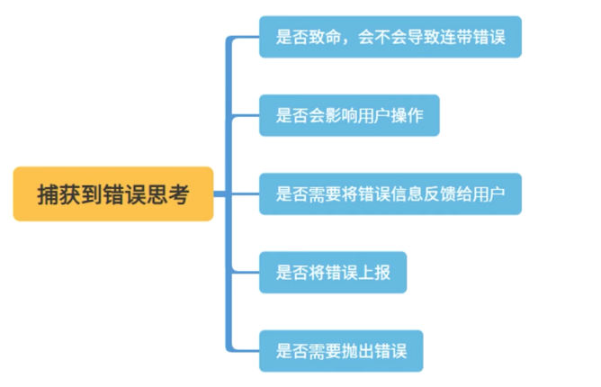
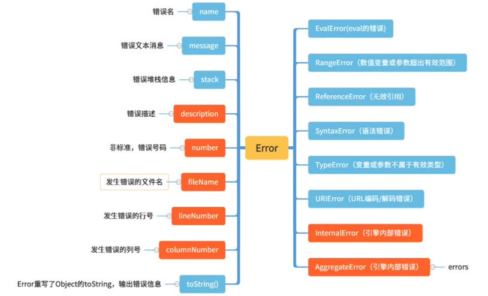

# 亡羊补牢-异常处理

人无完人，代码也是，百密也有一疏，错了不可怕，怎么识别错误，怎么捕获错误，怎么上报错误，请君务必掌握。

## 错误对象，不要只知道Error

错误类型：
- 语法错误：代码中存在拼写错误，将导致程序完全或部分不能运行
- 逻辑错误：代码语法正确，但执行结果不匹配预期

错误对象：


**Error**

- 基础的错误对象，其他错误均继承自他。


```html
<body>
    <button type="button" id="btnEx">执行</button>
    <script>
        function trace() {
            try {
                throw new Error("哦豁，错误哦")
            } catch (err) {
                console.log("err.name", err.name);
                console.log("err.message", err.message);
                console.log("err.stack", err.stack);
                console.log("err.constructor:", err.constructor);
            }
        }
        function b() {
            trace();
        }
        function a() {
            b();
        }
        btnEx.onclick = a;
    </script>
</body>
```

**EvalError**

- 历史遗孤。eval 相关的错误
- 产生：
    1. 不是被直接调用。
    2. 被赋值
- 新的协议：理论上你碰不到这个错误

```html
<body>
    <button type="button" id="btnEx">执行</button>
    <script>
        btnEx.onclick = function () {
            try {
                new eval();
                eval = function () { };
            } catch (err) {
                console.log("err", err);
                console.log("err.constructor:", err.constructor);
                console.log('instanceof EvalError:', err instanceof EvalError);
            }
        }
    </script>
</body>
```

**InternalError**

- 高级编程的红皮书和MDN都有提到这个对象，可惜的是 just firefox 支持
- 产生：过多的 case 语法；正则表达式中括号过多；递归过深等

**InternalError**

- 当一个值不再其所允许的范围或者集合中
- 当传递一个不合法的 length 值作为 Array 构造器的参数创建数组
- 传递错误值到数值计算方法(`Number.toExponential()、Number.toFixed()、Number.toPrecision() 等`)

```html
<body>
    <button type="button" id="btnEx">执行</button>
    <script>
        btnEx.onclick = function () {
            try {
                new Array(Number.MAX_VALUE)
                // Uncaught RangeError: Invalid array length
                12..toFixed(101)
                // Uncaught RangeError: toFixed() digits argument must be between 0 and 100
                'abc'.repeat(-1);
                // Uncaught RangeError: Invalid count value 
            } catch (err) {
                console.log("err", err);
                console.log("err.constructor:", err.constructor);
                console.log('instanceof EvalError:', err instanceof InternalError);
            }
        }
    </script>
</body>
```

**ReferenceError**

- 一个不存在的变量被引用时发送的错误

```ts
btnEx.onclick = function () {
    try {
        var a = xyz;
    } catch (e) {
        console.log('e instanceof ReferenceError:', e instanceof ReferenceError);
        console.log('e.message:', e.message);
        console.log('e.name:', e.name);
        console.log('e.fileName:', e.fileName);
        console.log('e.lineNumber:', e.lineNumber);
        console.log('e.columnNumber:', e.columnNumber);
        console.log('e.stack:', e.stack);
    }
}
```

**SyntaxError**

- 解析语法上不合法的错误
- 不能被用户代码 catch 的 SyntaxError
- 另一类是可以被捕获的

```html
<body>
    <button type="button" id="btnEx">不能捕获的</button>

    <script>
        window.onerror = function (message, source, lineno, colno, error) {
            var string = msg.toLowerCase();
            var substring = "script error";
            if (string.indexOf(substring) > -1) {
                alert('Script Error: See Browser Console for Detail');
            } else {
                var message = [
                    'Message: ' + msg,
                    'URL: ' + url,
                    'Line: ' + lineNo,
                    'Column: ' + columnNo,
                    'Error object: ' + JSON.stringify(error)
                ].join(' - ');

                console.log(message);
            }
        }

        window.addEventListener("error", function(){
            console.log('Script Error: See Browser Console for')
        }, true);

        // 不能被捕获
        btnEx.onclick = function () {
            try {
                var hhhh bbbb;

            } catch (e) {
                console.log('e.message:', e.message);
            }
        }
    </script>
</body>
```

**TypeError**

- 期望的类型非预期类型时发生的错误


```html
<body>

    <button type="button" id="btnEx">可以捕获的</button>

    <script>
        // 可以捕获
        btnEx.onclick = function () {
            try {
                new Function(`var  hhhh bbbb`);
            } catch (e) {
                console.log('e.message:', e.message);
            }
        }
    </script>
</body>
```

**URIError**

- URI 处理函数而产生的错误


不是所有的 encodeURL、encodeURLComponent、decodeURL、decodeURLComponent 方法生成的错误都是 URIError

**AggregateError**

- 包含错误信息的错误

```html
<body>
    <script>
        Promise.any([
            Promise.reject(new Error("error 1")),
            Promise.reject(new Error("error 2")),
        ]).catch(e => {
            console.log("e instanceof AggregateError:", e instanceof AggregateError);
            console.log("e.message:", e.message);
            console.log("e.name", e.name);
            console.log("e.errors", e.errors);
        });
    </script>
</body>
```


## 异常类型判断和自定义异常


catch 的一定是 Error 吗

- 在 JavaScript 中，throw 关键字可以将错误抛出，但是 throw 不仅仅只能抛出错误对象，还可以抛出基本类型数据。

```ts
throw expression;
```

**throw 基本类型和对象 - 不推荐**

```ts
try {
    throw "错误字符串";
} catch (e) {
    console.log(typeof e, "==name==", e.name, "===", e);
}

try {
    throw 22;
} catch (e) {
    console.log(typeof e, "==name==", e.name, "===", e);
}

function UserException(message) {
    this.message = message;
    this.name = "UserException";
}


try {
    throw new UserException("无效异常");
} catch (e) {
    console.log(typeof e,"==name==", e.name, "===", e);
}
```

**throw 内置 Error - 推荐**

```ts
function throwError(a){
    if(a>10){
        throw new RangeError("值超出限制");
    }
}

try{
    throwError(15);
}catch(e){
    console.log(e.name,"==e.message==",e.message);
}
```

不隐藏错误，不做鸵鸟

```ts
try {
   throw 500;
} catch (e) {
   if (e <= 50) {
      console.log("已处理");
   } else {
      // 异常无法处理，重新抛出
      throw e;
   }
}
```

捕获错误的思考：




自定义异常类型并抛出异常：



**ES6 实现**

```ts
class CustomError extends Error {
  constructor(foo = 'bar', ...params) {
    super(...params)

    // 下面的三行是非必须的
    // if (Error.captureStackTrace) {
    //   Error.captureStackTrace(this, CustomError)
    // }

    this.name = 'CustomError'
    this.foo = foo
    this.date = new Date()
  }
}

function trace() {
  try {
    throw new CustomError('baz', 'bazMessage')
  } catch (e) {
    console.log("是否是MyError类型错误:", e instanceof CustomError);
    console.log("e.message:", e.message);
    console.log("e.name", e.name)
    console.log("e.foo", e.foo)
    console.log("e.date", e.date)
    console.log("e.stack:", e.stack);
  }
}

function b() {
  trace();
}

function a() {
  b();
}

a();
```


**ES5 实现**

推荐使用 Error.captureStackTrace(this, MyError)

```ts
function MyError(message) {
  this.name = "MyError";
  this.message = message || "Default Message";
  // this.stack = (new Error()).stack;
  /*
   * Error.captureStackTrace(targetObject[, constructorOpt])
   * 参数 targetObject -> 表示一个对象
   * 参数 constructorOpt -> 表示对象的构造函数
   * 在targetObject上创建一个.stack属性， 调用是返回一个调用 Error.captureStackTrace() 的位置的字符串。
   */
  // Error.captureStackTrace(this, MyError)
}

MyError.prototype = Object.create(Error.prototype);
MyError.prototype.constructor = MyError;

function trace() {
  try {
    throw new MyError("custom message");
  } catch (e) {
    console.log("是否是MyError类型错误:", e instanceof MyError); // true
    console.log("e.message:", e.message); // 'custom message'

    console.log("stack:", e.stack);
  }
}

function b() {
  trace();
}

function a() {
  b();
}

a();
```

**异常类型判断**

- instanceof
- constructor
- Error.prototype.name 


```ts
function testReferenceError() {
    try {
        let a = undefinedVariable;
    } catch (e) {
        console.log("instanceof ReferenceError :", e instanceof ReferenceError); // true
    }
}

testReferenceError();
```

```ts
function testTypeError() {
    // TypeError类型错误
    try {
        new eval();
        eval = function () {};
    } catch (err) {
        console.log("constructor TypeError", err.constructor == TypeError);
    }
}

function testError() {
    //Error
    try {
        throw new Error("哦豁，错误哦");
    } catch (err) {
        console.log("constructor Error", err.constructor == Error);
    }
}

testTypeError();
testError();
```

```ts
function testURIError() {
    try {
        decodeURIComponent('%')
      } catch (e) {
        console.log("ErrorName:",e.name === "URIError")  
     
      }
}

testURIError();
```

注意 AggregateError：

```ts
function print(e) {
  console.log("错误类型：", e.constructor.name);
  console.log("错误信息：", e.message);
  if (e.constructor.name == "AggregateError" && e.errors) {
    for (let i = 0; i < e.errors.length; i++) {
      console.log(`错误信息${i}:`, e.errors[i].message);
    }
  }
  console.log("--------------------------------");
}

function testError() {
  //AggregateError
  Promise.any([
    Promise.reject(new Error("error 1")),
    Promise.reject(new Error("error 2")),
  ]).catch((e) => {
    print(e);
  });
}

testError();
```

## 异常们，跪下来唱征服，然后被我上报


**try catch**

可以区域报错使用


```ts
//编译时错误，还没有执行到try catch
try {
    dd.
} catch (e) {
    console.log("捕捉到错误", e.message);
}

//try catch 执行时
try {
    var a = {};
    a.b();
} catch (e) {
    console.log("捕捉到错误", e.message);
}


//try catch已经执行完毕,无法捕获
try {
    setTimeout(() => {
        var a = {};
        a.b();
    })
} catch (e) {
    console.log("捕捉到错误", e.message);
}
```


```ts
const str = "aaaa";

try {
    JSON.parse(str);
} catch (e) {
    console.log("解析字符串错误");
} finally {
    console.log("finally处理");
}
```

**window.onerror (全局JS异常)**

```html
<script>
    window.onerror = function (message, url, line, column, error) {
        console.log('捕获到错误:', message, "==line:", line, "==column:", column, "==error:", error);
    }

    setTimeout(() => {
        a.b();
    })

    var f = {};
    f.cc.ee;

</script>
```

跨域时的错误默认是拿不到的：

```html
<script>
    window.onerror = function (message, url, line, column, error) {
            console.log('捕获到错误:',message, "==line:", line,"==column:", column, "==error:",error);
    }

</script>
<script src="http://127.0.0.1:8080/test.js"/>
```

解决方案：
1. script 引用 js 文件时增加 crossorigin="anonymous" 的属性。如果是动态加载的 JS，可以写作 script.crossOrigin = true
2. 为 JS 资源文件增加 CORS 响应头(服务)，一般的 CDN 网站都会将 Access-Control-Allow-Origin 配置为自己的白名单域名 或者 * 

```html
<script>
    window.onerror = function (message, url, line, column, error) {
            console.log('捕获到错误:',message, "==line:", line,"==column:", column, "==error:",error);
    }

</script>
<script src="http://127.0.0.1:8080/test.js" crossorigin="anonymous"/>
```

**window.addEventListener("error", fn) - 静态资源**

- window.onerror 与 window.addEventListener("error" 都可以捕获 js 错误。
- window.addEventListener("error" 可以捕获静态资源错误，但必须是捕获阶段。
- 捕获到静态资源加载错误，无法区分 404 或者 500，需结合服务器端日志

```html
<script>
    window.onerror = function (message, url, line, column, error) {
        console.log('window.onerror 捕获到错误:',message, "==line:", line,"==column:", column, "==error:",error);
    }

    window.addEventListener("error", function(e){
        console.log("window.addEventListener:",e,"==e.error:",e.error);

    });

    setTimeout(()=>{
        a.b();
    })

    var f={};
    f.cc.ee;

</script>
```

```html
<body>
    <div>script error 解决</div>

    <script>
        window.onerror = function (message, url, line, column, error) {
            console.log('window.onerror 捕获到错误:', message, "==line:", line, "==column:", column, "==error:", error);
        }

        window.addEventListener("error", function (event) {
            console.log("window.addEventListener:", event, "==e.error:", event.error);
            if (event.target && (event.target.src || event.target.href)) {
                //静态资源
                console.log({
                    type: "error", //resource
                    errorType: "resourceError",
                    filename: event.target.src || event.target.href, //加载失败的资源
                    tagName: event.target.tagName, //标签名
                })
            }
        }, true); ////由于网络请求不会冒泡，必须在捕获阶段处理


    </script>

    
    <script src="http://127.0.0.1:3000/test2.js" />
</body>
```

**unhandledrejection,rejectionhandled**

- unhandledrejection： 当 Promise 被 reject 且没有 reject 处理器的时候，会触发 unhandledrejection 事件
- rejectionhandled: 当 Promise 被 rejected 且有 rejection 处理器时会在全局触发 rejectionhandled 事件


```html
<body>
    <div>promise 错误</div>

    <script>
        window.onerror = function (message, url, line, column, error) {
            console.log("window.onerror 捕获到错误:", message, "==line:", line, "==column:", column, "==error:", error);
        };

        window.addEventListener("error", function (e) {
            console.log("window.addEventListener:", e, "==e.error:", e.error);
        });

        window.addEventListener("unhandledrejection", function (e) {
            //阻断异常继续抛出
            e.preventDefault();
            console.log("unhandledrejection捕获到promise错误的原因是", e.reason);
            console.log("Promise 对象是", e.promise);
            return true;
        });

        new Promise((resolve, reject) => {
            reject("promise error1");
        });

        new Promise((resolve) => {
            resolve();
        }).then(() => {
            throw new Error("promise error2");
        });

        try {
            new Promise((resolve) => {
                resolve();
            }).then(() => {
                throw new Error("promise error3");
            });
        } catch (e) {
            console.log("try catch:", e);
        }
    </script>
</body>
```

```html
<script>
    window.addEventListener("unhandledrejection", function (e) {
        //阻断异常继续抛出
        e.preventDefault();
        console.log("unhandledrejection捕获到promise错误的原因是：", e.reason);
        console.log("unhandledrejection Promise 对象是：", e.promise);
        return true;
    });
    //promise异常被处理了
    window.addEventListener('rejectionhandled', e => {
            // rejected的原因
        console.log('rejectionhandled:', e.reason);
    })

    const p1 = new Promise((resolve, reject) => {
        reject("promise error1");
    });

    setTimeout(() => {
        p1.catch((e) => {
            console.log("catch捕获到promise1 错误:", e);
        })
    }, 1000)

</script>
```

**XMLHttpRequest、fetch、axios - 网络请求**

- XMLHttpRequest 自己有 onerror 事件，可以自己封装一个库
- fetch 自带 catch，不处理就是你自己的问题
- axios 有完整的错误处理机制

**ErrorBoundary - React 异常**

- 子组件的渲染
- 生命周期函数
- 构造函数

**errorHandler - vue 异常**

```ts
Vue.config.errorHandler = (err, vm, info) => {
    // 捕获异常
}
```

## 异常上报

sendBeacon
- 数据发送可靠
- 数据异步传输
- 不影响下一个导航的载入

gif 图片
- 图片 src 属性可以直接跨域访问
- 相比 PNG、JPG，gif 的体积合达到最小。合法的 gif 只需要 43 个字节
- 一般采用 1*1 像素的透明色来上报，不存储色彩空间数据，节约体积

