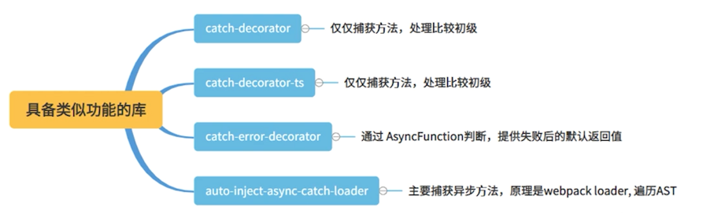
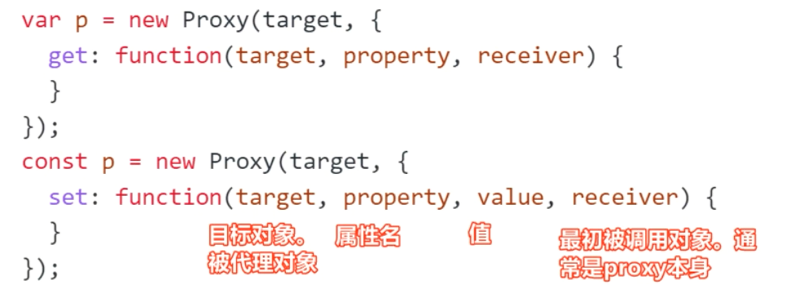

# ES高级特性

ES6+给与了我们很多特性，其中装饰器和Proxy属于元编程的一部分，大大的增强了我们对对象的控制能力

## 能力增强：Decorator 和装饰器模式


装饰器 - Decorator：


- 装饰器，可以认为它是一个包装，对类对象，方法，属性进行包装
- JavaScript 中的装饰器是一种函数，写成 `@+函数名`
- 装饰器对类的行为的改变，是代码编译时发生的，而不是在运行时

babel-plugin-proposal-decorators
- https://babeljs.io/docs/en/babel-plugin-proposal-decorators#options

装饰器的不同版本


**类装饰器**

类装饰器接受一个参数，target 参数指的是类本身


类装饰器 - 传参以及多个执行顺序


```ts
 function addFly(target) {
    console.log("addFly");
    target.prototype.isFly = true;
}


 function addFlyFun(flyHeight) {
    console.log("addFlyFun");
    return function (target) {
        console.log("addFlyFun 执行");
        target.prototype.fly = function () {
            console.log("飞行高度：", flyHeight);
        };
    };
}

 function addTransShape() {
    console.log("addTransShape");
    return function (target) {
        console.log("addTransShape 执行");
        target.prototype.isTransShape = true;
    };
}

@addTransShape()
@addFlyFun(300)
@addFly
class Man {
    name = "";
    hp = 0;
    constructor(name, hp = 3) {
        this.init(name, hp);
    }

    init(name, hp) {
        this.name = name;
        this.hp = hp;
    }
}

const p2 = new Man("钢铁侠1版", 5);
console.log();
console.log("p2 钢铁侠是否可飞:", p2.isFly);
console.log("p2 钢铁侠是否可以变形:",p2.isTransShape);
p2.fly();
```

类装饰器 - 重载构造


```ts
function classDecorator(constructor) {
    return class extends constructor {
        hp = 8;
    }
}

@classDecorator
class Man {
    name = "";
    hp = 0;
    constructor(name, hp = 3) {
        this.init(name, hp);
    }

    init(name, hp) {
        this.name = name;
        this.hp = hp;
    }

    run() {
        console.log("跑步");
    }
}

const p1 = new Man("钢铁侠3版", 5);
console.log(p1)
```

**方法装饰器**


装饰器的本质是利用了 ES5 的 Object.defineProperty 属性，这三个参数其实和 Object.defineProperty 参数是一致的

案例1：
```ts
 function methodReadonly(target, key, descriptor) {
    console.log("target=",target,"==key=",key,"==descriptor==",descriptor)
    // {
    //   value: specifiedFunction,
    //   enumerable: false,
    //   configurable: true,
    //   writable: true
    // };
    descriptor.writable = false;
    return descriptor;
}
```

有参数：

```ts
function methodDecorator(moreHp = 0) {
    return function (target, key, descriptor) {
        //获取原来的方法
        const originalMethod = descriptor.value;
        //重写该方法
        descriptor.value = function (...args) {
            console.log("当前参数=", args[1])
            //增加血量hp
            args[1] = args[1] + moreHp;

            //注意,这里是this
            return originalMethod.apply(this, args);
        }
        return descriptor;
    }
}
```

**访问器装饰器：**

访问器装饰器和方法装饰器的参数一致

```ts
function minHp(minValue) {
    return function (target, propertyKey, descriptor) {
        const oriSet = descriptor.set;
        descriptor.set = function (value) {
            if (value <= minValue) {
                return;
            }
            oriSet.call(this, value);
        }
    };
}

class Man {
    name = "";
    hp = 0;
    constructor(name, hp = 3) {
        this.init(name, hp);
    }

    init(name, hp) {
        this.name = name;
        this.hp = hp;
    }

    @minHp(0)
    set hhp(value) {
        this.hp = value;
    }
}

var p1 = new Man("金刚侠", 5);
p1.hhp = 10;
console.log("hp", p1.hp);
p1.hhp = -10;
console.log("hp", p1.hp);
```

**属性装饰器**

- JavaScript 属性装饰器和方法装饰器的参数一致
- 注意 TypeScript 与 JavaScript 的装饰器实现是不一致的。ts 属性装饰器只有前两个参数

```ts
function propertyReadonly(target, propertyName, direction) {
    console.log(target, "====", propertyName, "===", direction);
    direction.writable = false;
}

class Man {
    @propertyReadonly name = 'default name'

    getName() {
        return this.name;
    }

    setName(name) {
        this.name = name;
    }
}


const p1 = new Man();
console.log(p1.getName());
p1.setName("haha");  //报错： Cannot assign to read only property 'name' of object 
console.log(p1.getName()); 
```

属性装饰器 - 有参数

```ts
function CheckType(type){
    return function (target, name, descriptor){
        console.log("descriptor.initializer:",  descriptor.initializer.toString());
        let value = descriptor.initializer && descriptor.initializer.call(this);

        return {
            enumerable: true,
            configurable: true,
            get: function() {
                return value;
            },
            set: function(c) {
                var cType = typeof c == type;
                if(cType){
                    value = c;
                }
            }
        }
    }
}

class Man {
    @CheckType("string")
    name = '钢铁侠'

    getName() {
        return this.name;
    }

    setName(name){
        this.name=name;
    }
}

const p1 = new Man();
p1.setName(55);
console.log("修改后的名字：",p1.getName());
```

装饰器加载顺序：


装饰器叠加注意问题：


为什么不能直接用于装饰函数
- 装饰器只能用于类和类方法，不能用于普通函数

**装饰器模型（结构型）**


**装饰器 - AOP实现（面向切面编程）**


何时使用装饰器模式：


**装饰器和装饰器模式**


**装饰器应用场景**


## 基于装饰器优雅的捕获异常


基础版：


Const.js
```ts
// 默认 Error 处理配置
const DEFAULT_ERROR_CATCH_OPTIONS = {
    report: true,
    log: true,
    toast: false
};

module.exports = {
    DEFAULT_ERROR_CATCH_OPTIONS
};
```


CatchError.js - 自定义 CatchError
```ts
const { DEFAULT_ERROR_CATCH_OPTIONS } = require("./Const");


class CatchError extends Error {
    __type__ = "__CATCH_ERROR__";
    /**
     * 捕捉到的错误
     * @param message 消息
     * @options 其他参数
     */
    constructor(message, options = DEFAULT_ERROR_CATCH_OPTIONS) {
        super(message);
        if (Error.captureStackTrace) {
            Error.captureStackTrace(this, CatchError)
        }
        this.options = options;
    }
}

module.exports = {
    CatchError
};
```

methodCatch.js
```ts
const { DEFAULT_ERROR_CATCH_OPTIONS } = require("../Const");

const W_TYPES = ["string", "object"];

function methodCatch(options) {
    const type = typeof options;
    let opt;
    if (options == null || !W_TYPES.includes(type)) { // null 或者 不是字符串或者对象
        opt = DEFAULT_ERROR_CATCH_OPTIONS;
    } else if (typeof options === "string") {  // 字符串
        opt = {
            ...DEFAULT_ERROR_CATCH_OPTIONS,
            message: options || DEFAULT_ERROR_CATCH_OPTIONS.message,
        }
    } else { // 有效的对象
        opt = { ...DEFAULT_ERROR_CATCH_OPTIONS, ...options }
    }

    return function (_target, _name, descriptor) {

        // 保存旧的方法
        const oldFn = descriptor.value;
        // 重写旧的方法，
        // 调用自定义的方法，自定义的方法内部再去调用旧的方法
        // descriptor.value = function(){}
        Object.defineProperty(descriptor, "value", {
            get() {
                async function proxy(...args) {
                    try {
                        const res = await oldFn.apply(this, args);
                        return res;
                    } catch (err) {
                        if (err.__type__ == "__CATCH_ERROR__") {
                            console.log(opt, err.options);
                            const mOpt = { ...opt, ...(err.options || {}) };
                            const message = err.message || mOpt.message ;
                            if (mOpt.log) {
                                console.error("asyncMethodCatch:", message, err);
                            }
                            if (mOpt.report) {
                                console.info("report:", message);
                            }

                            if (mOpt.toast) {
                                console.info("toast:", message);
                            }
                        } else {
                            const message = opt.message || err.message;
                            console.error("asyncMethodCatch:", message, err);

                            if (opt.toast) {
                                console.info("toast 输出:", message);
                            }
                        }
                    }
                }
                proxy._bound = true;
                return proxy;
            }
        })
        return descriptor;
    }
}


module.exports = {
    methodCatch
};
```

使用：
```ts
const { methodCatch } = require("./methodCatch.js");
const { CatchError } = require("../CatchError");

class DemoClass {

  @methodCatch({ message: "创建订单失败", toast: true, report: true, log: true })
  async createOrder() {
    // a.b();

    throw new CatchError("创建订单失败了，请联系管理员", {
      toast: true,
      report: true,
      log: false
    });
  }
}

const demo = new DemoClass();
demo.createOrder();
```

基础版的不足：


优化 - 封装 getOptions：

```ts
// options类型白名单
const W_TYPES = ["string", "object"];

function getOptions(options) {
    const type = typeof options;

    let opt;

    if (options == null || !W_TYPES.includes(type)) { // null 或者 不是字符串或者对象
        opt = DEFAULT_ERROR_CATCH_OPTIONS;
    } else if (typeof options === "string") { // 字符串
        opt = {
            ...DEFAULT_ERROR_CATCH_OPTIONS,
            message: options || DEFAULT_ERROR_CATCH_OPTIONS.message,
        };
    } else { // 有效的对象
        opt = { ...DEFAULT_ERROR_CATCH_OPTIONS, ...options };
    }

    return opt;
}
```

优化-定义默认处理函数

```ts
/**
 *
 * @param err 默认的错误处理函数
 * @param options
 */
function defaultErrorHandler(err, options) {
    const message = err.message || options.message;
    console.error("defaultErrorHandler:", message, "==toast==", options.message, "==errInfo=", /*err*/);
}
```

优化 - 区分同步方法和异步方法

```ts
/**
 * 
 * 异步函数处理
 * @export
 * @param {AnyFunction} fn 
 * @param {*} context 
 * @param {ErrorHandler} callback 
 * @returns 
 */
function observerAsyncHandler(fn, context, callback) {
    return async function (...args) {
        try {
            const r = await fn.call(context || this, ...args);
            return r;
        } catch (err) {
            callback(err);
        }
    };
}

/**
 * 同步函数处理
 * @param {AnyFunction} fn 
 * @param {*} context 
 * @param {ErrorHandler} callback 
 * @returns 
 */
function observerSyncHandler(fn, context, callback) {
    return function (...args) {
        try {
            const r = fn.call(context || this, ...args);
            return r;
        } catch (err) {
            callback(err);
        }
    };
}

/**
 * 
 * 自动识别同步还是异步方法
 * @param {any} fn 
 * @param {any} context 
 * @param {any} callback 
 * @returns 
 */
function observerAllHandler(fn, context, callback) {
    //AsyncGeneratorFunction 和  AsyncFunction
    if (fn.constructor.name.startsWith("Async")) {
        return observerAsyncHandler(fn, context, callback);
    }
    return observerSyncHandler(fn, context, callback);
}
```

优化 - 方法异常捕获

```ts
/**
 * class { method(){} }
 * @param {string | CatchOptions} options
 * @param handler
 * @returns
 */
function catchMethod(options = DEFAULT_ERROR_CATCH_OPTIONS, handler = defaultErrorHandler) {
    const opt = getOptions(options);

    return function (_target, _name, descriptor) {
        const oldFn = descriptor.value;

        Object.defineProperty(descriptor, "value", {
            get() {
                const proxy = observerAllHandler(oldFn, undefined, (error) => {
                    handler(error, opt);
                });
                proxy._bound = true;
                return proxy;
            }
        });
        // return descriptor;
    };
}
```

优化 - 具备多级选项定义能力

```ts
function createErrorCatch(handler, baseOptions = DEFAULT_ERROR_CATCH_OPTIONS) {
    return {
        catchMethod(options) {
            return catchMethod({ ...baseOptions, ...getOptions(options) }, handler);
        },
        catchGetter(options) {
            return catchGetter({ ...baseOptions, ...getOptions(options) }, handler);
        },
        catchInitializer(options) {
            return catchInitializer({ ...baseOptions, ...getOptions(options) }, handler);
        }
    };
}
```

增强 - 支持 getter

```ts
/**
 * class {  get method(){} }
 * @param options
 * @param handler
 * @returns
 */
function catchGetter(options = DEFAULT_ERROR_CATCH_OPTIONS, handler = defaultErrorHandler) {
    const opt = getOptions(options);

    return function (_target, _name, descriptor) {
        const { constructor } = _target;
        const { get: oldFn } = descriptor;

        defineProperty(descriptor, "get", {
            value() {
                // Class.prototype.key lookup
                // Someone accesses the property directly on the prototype on which it is
                // actually defined on, i.e. Class.prototype.hasOwnProperty(key)
                if (this === _target) {
                    return oldFn();
                }
                // Class.prototype.key lookup
                // Someone accesses the property directly on a prototype but it was found
                // up the chain, not defined directly on it
                // i.e. Class.prototype.hasOwnProperty(key) == false && key in Class.prototype
                if (
                    this.constructor !== constructor &&
                    getPrototypeOf(this).constructor === constructor
                ) {
                    return oldFn();
                }
                const boundFn = observerAllHandler(oldFn, this, (error) => {
                    handler(error, opt);
                });
                boundFn._bound = true;

                return boundFn();
            }
        });

        return descriptor;
    };
}
```

增强 - 支持属性定义和赋值

```ts
/**
 * // class A{ method = ()=>{} }
 * @param options
 * @param handler
 */
function catchInitializer(options = DEFAULT_ERROR_CATCH_OPTIONS, handler = defaultErrorHandler) {
    const opt = getOptions(options);

    return function (_target, _name, descriptor) {
        const initValue = descriptor.initializer();
        if (typeof initValue !== "function") {
            return descriptor;
        }

        descriptor.initializer = function () {
            initValue.bound = true;
            return observerAllHandler(initValue, this, (error) => {
                handler(error, opt);
            });
        };
        return descriptor;
    };
}
```

一览风采：


后续：


开源库：




## Proxy 和代理模式

**Reflect**

- 反射
- 它囊括了 JavaScript 引擎内部专有的"内部方法"。例如：Object.keys、Object.getOwnPropertyNames、delete 等


**Proxy 对象**

- 创建一个对象的代理，从而实现基本操作的拦截和自定义(如属性查找、赋值、枚举、函数调用等)
- 语法：const p = new Proxy(target, handler)
- target：要使用 Proxy 包装的目标对象(可以是任意类型的对象，包括原生数组、函数，甚至另一个代理)
- handler：一个对象，各属性中的函数分别定义了在执行各种操作时代理 p 的行为。`每个属性，代表这一种可以代办的事项`

**Proxy 捕获器**

handler 的函数属性是 Proxy 的各个捕获器


**get、set 读取和设置捕获器**



```ts
var obj = {};
var proxyObj = new Proxy(obj, {
    get(target, property, receiver) {
        console.log("get:=============== ");
        console.log("target:", target);
        console.log("property:", property);
        console.log("receiver:", receiver);
        console.log("target === obj:", target === obj);
        console.log("receiver === proxyObj:", receiver === proxyObj);
        console.log(" ");
        return Reflect.get(target, property, receiver);
    },
    set(target, property, value, receiver) {
        console.log("set:=============== ");
        console.log("target:", target);
        console.log("property:", property);
        console.log("value:", value);
        console.log("receiver:", receiver);
        console.log("target === obj:", target === obj);
        console.log("receiver === proxyObj:", receiver === proxyObj);
        console.log("");
        return Reflect.set(target, property, value, receiver);
    }
});

// 设置属性
proxyObj.name = "name";
// 读取属性
console.log("proxyObj.name:", proxyObj.name)
console.log("obj.name:", obj.name)
```

`receiver 不是代理对象的情况`


receiver 不是 proxy 对象

```ts
const proto = {
  name: "parent"
};

let testObj;
const proxyProto = new Proxy(proto, {
  set(target, property, value, receiver) {
    console.log("触发set捕获器:");
    console.log("receiver === proxyProto:", receiver === proxyProto);
    console.log("receiver === testObj:", testObj === receiver);

    console.log("target:", target);
    console.log("property:", property);
    console.log("receiver:", receiver);
    return Reflect.set(target, property, value, receiver)
  }
});

function TestObject(message) {
  this.message = message;
}

TestObject.prototype = proxyProto;

testObj = new TestObject("message");
console.log();
console.log("准备设置message属性");
testObj.message = "message 啊";
console.log();
console.log("准备设置name属性");
testObj.name = "parent 啊"
```

情况二：


```ts
const proto = {
    name: 'proto name',
    age: 18,
    get nameValue() {
        return this.name;
    },
};

const proxyObj = new Proxy(proto, {
    get(target, property, receiver) {
        console.log("receiver === proxyObj", receiver === proxyObj);
        console.log("receiver === obj", receiver === obj);
        // 相当于 target[property]
        return Reflect.get(target, property);

        // 相当于 receiver[property]
        // return Reflect.get(target, property, receiver);
    },
});


const obj = {
    name: 'obj name',
    age: 10,
};

// 设置原型
Object.setPrototypeOf(obj, proxyObj);
// proxyObj.nameValue receiver === proxyObj
console.log("proxyObj.nameValue:", proxyObj.nameValue);
console.log("")
// obj.nameValue, obj不存在，访问原型链上的方法，所以触发捕获器
// 期望获取的是对象上的属性，而不是原型上的
// receiver === obj
console.log("obj.nameValue:", obj.nameValue);
console.log("")
// proxyObj.age
console.log("proxyObj.age:", proxyObj.age);
console.log("")
// obj.age
console.log("obj.age:", obj.age);
```

**apply 函数调用捕获器**


 
```ts
function sum(num1, num2) {
  return num1 + num2;
}

const proxySum = new Proxy(sum, {
  apply(target, thisArg, argumentsList) {
    console.log("target:", target);
    console.log("thisArg:", thisArg);
    console.log("argumentsList:", argumentsList);
    return Reflect.apply(target, thisArg, argumentsList);
  }
});

// 正常调用 proxy(...arguments)
console.log("proxySum():", proxySum(0, -1));
console.log();

// call
console.log("proxySum.call:", proxySum.call(null, 1, 2));
console.log();
// apply
console.log("proxySum.apply:", proxySum.apply(undefined, [3, 4]));
console.log();
// Reflect.apply
console.log("Reflect.apply:", Reflect.apply(proxySum, {}, [5, 6]));
console.log();
```

**getPrototypeOf 捕获器**


```ts
var obj = new Object();

var proxyObj = new Proxy(obj, {
  getPrototypeOf(target) {
    console.log("proxyObj getPrototypeOf");
    return Reflect.getPrototypeOf(target);
  }
});

console.log("Object.getPrototypeOf:")
Object.getPrototypeOf(proxyObj);
console.log();


console.log("Reflect.getPrototypeOf:")
Reflect.getPrototypeOf(proxyObj);
console.log();

console.log("__proto__")
proxyObj.__proto__;
console.log();

console.log("Object.prototype.isPrototypeOf")
Object.prototype.isPrototypeOf(proxyObj);
console.log();

console.log("instanceof")
proxyObj instanceof Object
console.log();
```

**setPrototypeOf 捕获器**

```ts
var handlerThrows = {
    setPrototypeOf(target, newProto) {
        throw new Error('custom error');
    }
};

var newProto = {}, target = {};
var p2 = new Proxy(target, handlerThrows);
// Object.setPrototypeOf(p2, newProto); // throws new Error("custom error")
Reflect.setPrototypeOf(p2, newProto); // throws new Error("custom error")
```

**construct 捕获器**


```ts
const handler = {
    // 拦截new 操作符
    // new proxy(...args)
    // Reflect.construct()
    construct(target, argumentsList, newTarget) {
        console.log('construct:', target.name);
        return Reflect.construct(target, argumentsList, newTarget);
    }
};

function Person(name, age) {
    this.name = name;
    this.age = age;
}

Person.prototype.getName = function () {
    return this.name;
}

class PersonClass {
    constructor(name, age) {
        this.name = name;
        this.age = age;
    }

    getName() {
        return this.name;
    }
}

var proxyFun = new Proxy(Person, handler);
var proxyClass = new Proxy(PersonClass, handler);

console.log("ProxyFun:", new proxyFun("小红", 18));
console.log("")
console.log("proxyClass:", new proxyClass("小明", 12));
```

**一个场景覆盖其他捕获器：**


```ts
const handler = {

    // 拦截修改属性描述符信息
    // Object.defineProperty()
    // Reflect.defineProperty()，
    // proxy.property='value'
    defineProperty(target, prop, descriptor) {
        console.log('handler:defineProperty');
        return Reflect.defineProperty(target, prop, descriptor);
    },

    // 拦截delete操作
    // delete proxy[property] 和 delete proxy.property
    // Reflect.deleteProperty()
    deleteProperty(target, prop) {
        console.log('handler:deleteProperty');
        return Reflect.deleteProperty(target, prop);
    },

    // 拦截获取属性描述符
    // Object.getOwnPropertyDescriptor()
    // Reflect.getOwnPropertyDescriptor()
    getOwnPropertyDescriptor(target, prop) {
        console.log('handler:getOwnPropertyDescriptor');
        return Reflect.getOwnPropertyDescriptor(target, prop)
    },

    // 拦截in
    // property in proxy
    // 继承属性查询: foo in Object.create(proxy)
    // with 检查: with(proxy) { (property); }
    // Reflect.has()
    has(target, prop) {
        console.log('handler:has');
        return Reflect.has(target, prop);
    },

    // Object.preventExtensions()
    // Reflect.preventExtensions()
    preventExtensions(target) {
        console.log('handler:preventExtensions');
        return Object.preventExtensions(target);
    },

    // Object.isExtensible()
    // Reflect.isExtensible()
    isExtensible(target) {
        console.log('handler:isExtensible');
        return Reflect.isExtensible(target);
        // return true; 也可以return 1;等表示为true的值
    },

    // Object.getOwnPropertyNames()
    // Object.getOwnPropertySymbols()
    // Object.keys()
    // Reflect.ownKeys()
    ownKeys(target) {
        console.log('handler:ownKeys');
        return Reflect.ownKeys(target);
    },
};

const obj = {
    name: "tom",
    age: 18,
    sex: 1
};
const proxyObj = new Proxy(obj, handler);

// defineProperty ，让name不可配置
Object.defineProperty(proxyObj, "name", {
    configurable: false,
})
console.log('\r\n');
//delete 尝试删除
console.log("delete proxyObj.name:", delete proxyObj.name, '\r\n');

// getOwnPropertyDescriptor
console.log("getOwnPropertyDescriptor", Object.getOwnPropertyDescriptor(proxyObj, "name"), '\r\n');

// has
console.log("name in proxyObj:", "name" in proxyObj, '\r\n');

// preventExtensions
Object.preventExtensions(proxyObj);
console.log();

console.log("proxyObj isExtensible:", Object.isExtensible(proxyObj), '\r\n');

// ownKeys
console.log("ownKeys:", Reflect.ownKeys(proxyObj), '\r\n');
```

**注意事项**

1. 捕获器函数里面的 this 是 new Proxy 的菲尔格参数对象

```ts
var obj = {};

const handler = {
    get(target, property, receiver) {
        console.log("get: this === handler:", this === handler);
        return Reflect.get(target, property, receiver);
    },
    set(target, property, value, receiver) {
        console.log("set: this === handler:",this === handler);
        return Reflect.set(target, property, value, receiver);
    }
}

var proxyObj = new Proxy(obj, handler);

// 设置属性
proxyObj.name = 1;
// 读取属性
console.log("proxyObj.name", proxyObj.name)
```

2. Proxy 的实例，数据类型和被代理数据类型一致

```ts
function sum(num1, num2) {
    return num1 + num2;
}

const proxySum = new Proxy(sum, {
    apply(target, thisArg, argumentsList) {
        return Reflect.apply(target, thisArg, argumentsList);
    }
});

console.log("typeof proxySum:", typeof proxySum);
console.log("toString proxySum:", Object.prototype.toString.call(proxySum))
```

**可取消代理**


```ts
var revocable = Proxy.revocable({
    name: "person"
}, {
    get(target, propertyKey, receiver) {
       return Reflect.get(target, propertyKey, receiver)
    }
});
var proxy = revocable.proxy;
console.log("proxy.name:", proxy.name); // "person"

revocable.revoke();
console.log("typeof proxy", typeof proxy) // "object"，

// TypeError: Cannot perform 'get' on a proxy that has been revoked
console.log("proxy.name:", proxy.name); 
proxy.name = 1           // 还是 TypeError
delete proxy.name;       // 又是 TypeError
```

**`代理模式`**


代理-缓存
```ts
function sum(a, b) {
    return a + b;
}

function cacheProxy(fn) {
    var cache = Object.create(null);
    return function (...args) {
        const key = args.map(arg => JSON.stringify(arg)).join('__');
        if (cache[key] != null) {
            console.log("cached:", cache[key])
            return cache[key];
        }
        const result = fn.apply(null, args);
        cache[key] = result;
        console.log("no cache:", result);
        return result;
    }
}

const proxySum = cacheProxy(sum);
proxySum(3,5)
proxySum(3,5)
```

代理-效验
```ts
function sum(num1, num2) {
    return num1 + num2;
}

const proxySum = new Proxy(sum, {
    apply(target, thisArg, argumentsList) {
        const num1 = argumentsList[0];
        const num2 = argumentsList[1];

        if (typeof num1 !== 'number') {
            throw new TypeError('num1 must be a number')
        }
        if (typeof num2 !== 'number') {
            throw new TypeError('num2 must be a number')
        }
        return Reflect.apply(target, thisArg, argumentsList)
    }
})

console.log("3 + 9:", proxySum(3, 9))
console.log("3 + undefined:",proxySum(3));
```

代理模式 VS 装饰器


## 基于proxy的不可变数据


可变数据：


不可变数据：


不可变数据优点：


**实现不可变数据 - 方法**

```ts
function updateProperty(obj, key, value) {
  const newObj = {
    ...obj,
    [key]: value
  }
  return newObj
}

var person = {
  name: "person",
  age: 18
};

const person1 = updateProperty(person, "name", "person 1");

console.log("person1.name:", person1.name);
console.log("person === person1", person === person1);
```

缺点：
- 调用麻烦
- 没有面向对象编程的"气味"

**实现不可变数据 - 自定义对象**

- 自定新的对象数据，把对数据的操作细节封装在新的对象类型上

```ts
class MyObject {
  constructor(obj = {}) {
    this.obj = { ...obj }
  }

  get(name) {
    return this.obj[name]
  }

  set(name, value) {
    return new MyObject({
      ...this.obj,
      [name]: value
    })
  }
}

var person = new MyObject({
  name: "person",
  age: 18
});

const person1 = person.set("name", "person 1")

console.log("person1.name:", person1.get("name"));
console.log("person === person1", person === person1);
```

**自定义对象 - immutableJS**


**不可变对象 - 函数+复制的思路**


```ts
function produce(obj, recipe) {
  const newObj = { ...obj };
  recipe(newObj);
  return newObj;
}

const person = {
  name: "person",
  age: 21
};

const person1 = produce(person, draft => {
  draft.name = "person 1";
  draft.age = 10;
})

console.log("person:", person);
console.log("person1", person1);
console.log("person1 === person", person1 === person);
```

性能问题


```ts
const arr = Array.from({ length: 10000 }, (v, index) => {
  return {
    name: "name" + index,
    age: ~~(Math.random() * 100),
    sex: ~~(Math.random() * 10) / 2,
    p4: Math.random(),
    p5: Math.random() + '',
    p6: Math.random(),
    p7: Math.random(),
    p8: Math.random(),
    p9: Math.random(),
    p10: Math.random() + '',
  }
})

function deepClone_JSON(obj) {
  return JSON.parse(JSON.stringify(obj));
}

function produce(obj, recipe) {
  console.time("deep clone")
  const newObj = deepClone_JSON(obj);
  console.timeEnd("deep clone")
  recipe(newObj);
  return newObj;
}

console.time("produce")
const arr1 = produce(arr, draft => {
  draft[500] = {};
  draft[500].name = "tom"
})
console.timeEnd("produce")
console.log("arr[500].name", arr[500].name);
console.log("arr1[500].name", arr1[500].name);
```

**不可变对象-新思路**


```ts
const arr = Array.from({ length: 10000 }, (v, index) => {
  return {
    name: "name" + index,
    age: ~~(Math.random() * 100),
    sex: ~~(Math.random() * 10) / 2,
    p4: Math.random(),
    p5: Math.random() + '',
    p6: Math.random(),
    p7: Math.random(),
    p8: Math.random(),
    p9: Math.random(),
    p10: Math.random() + '',
  }
});

function produce(obj, recipe) {
  const state = {
    base: obj,  // 基础对象
    copy: {},   // 被更改后得数据
    draft: {},  // 代理信息
    currentKey: 0 // 当前操作的key
  };

  // 代理数据里面具体得某条数据得读写
  // arr[500].name 
  const handlerItem = {
    get(target, property, receiver) {

      // 优先从copy里面读取
      if (state.copy[state.currentKey]) {
        return state.copy[state.currentKey][property];
      }
      // 从基础对象里面读取
      return state.base[state.currentKey][property];
    },
    set(target, property, value, receiver) {
      console.log("set:", property, value);
      return Reflect.set(state.copy[state.currentKey], property, value);
    }
  }

  // 代理数组得读写
  const handler = {
    get(target, property, receiver) {
      console.log("get:", property);
      state.currentKey = property;

      // arr[500].name = x
      // 如果读取，就进一步代理某个具体的对象
      if (!state.draft[property]) {
        const val = { ...(state.base[property]) };
        const proxy = new Proxy(val, handlerItem);
        state.draft[property] = proxy;
        state.copy[property] = val;
      }
      return state.draft[property];
    },
    set(target, property, value, receiver) {
      console.log("set:", property, value);
      Reflect.set(state.copy, property, value);
      console.log("state.copy[property]", state.copy)
    }
  }
  const proxyObj = new Proxy(obj, handler)
  //传递代理对象出去
  recipe(proxyObj);
  return proxyObj;
}

console.time("produce")
const arr1 = produce(arr, draft => {
   //draft为代理对象
  draft[500] = {};
  draft[500].name = "tom";
})
console.timeEnd("produce")

console.log()
console.log("arr[500].name", arr[500].name);
console.log("arr1[500].name", arr1[500].name);
```

**第三方不可变对象**

- JavaScript 没有开箱即用的不可变结构，但有第三方实现。
- 最受欢迎的是 immer.js 和 immutable.js

```ts
const { Map } = require("immutable");

const map1 = Map({ a: 1, b: 2, c: { cd: 1 } });

//getIn
console.log("map1:", map1.getIn(["c", "cd"]));
//set
const map2 = map1.set("b", 50);
console.log("map2:", map2.toJS());
//setIn
const map3 = map1.setIn(["c", "cd"], 50);
console.log("map3:", map3.toJS());
```

```ts
const immer = require("immer");
const { produce } = immer;

const baseState = [
  {
    title: "Learn TypeScript",
    done: true,
  },
  {
    title: "Try Immer",
    done: false,
  },
];

const nextState = produce(baseState, (draft) => {
  draft[1].done = true;
  draft.push({ title: "Tweet about it" });
});

console.log("nextState:", nextState);
console.log("nextState==baseState:", nextState == baseState);
console.log("nextState[0]==baseState[0]:", nextState[0] == baseState[0]);
```

两者对比：


**React 中 state：**

PureComponent 会在每次更新前做一次浅比较

```ts
import React, { PureComponent } from 'react';
import TestItem from './TestItem';

interface IState {
    listData: any[];
}

class TestDemo extends PureComponent<{}, IState> {
    constructor(props) {
        super(props);
        this.state = {
            listData: [
                { data: 1, id: 1, info: { test: 1 } },
                { data: 2, id: 1, info: { test: 2 } },
            ],
        };
    }

    changeList = () => {
        const { listData } = this.state;
        const newListData = [...listData];
        console.log(newListData);
        newListData[0].info.test = 7;
        this.setState({
            listData: newListData,
        });
    };

    render() {
        const { listData } = this.state;
        console.log('listData：', listData);
        return (
            <div className="page1">
                <button type="button" onClick={this.changeList}>
                    改变数据
                </button>
                {listData.map((item, key) => (
                    <TestItem key={item.data} data={item.info}></TestItem>
                ))}
            </div>
        );
    }
}

export default TestDemo;
```

```ts
import React, { PureComponent } from 'react';

interface IProps {
    data: any;
}

class TestItem extends PureComponent<IProps> {

    render() {
        const { data } = this.props;
        return (
            <div>{data.test}</div>
        );
    }
}

export default TestItem;
```

**immer 的几个应用场景**


