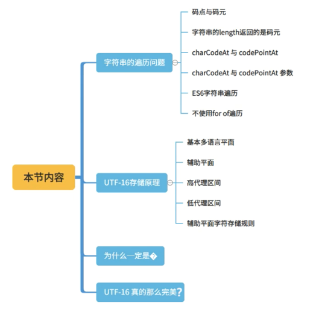
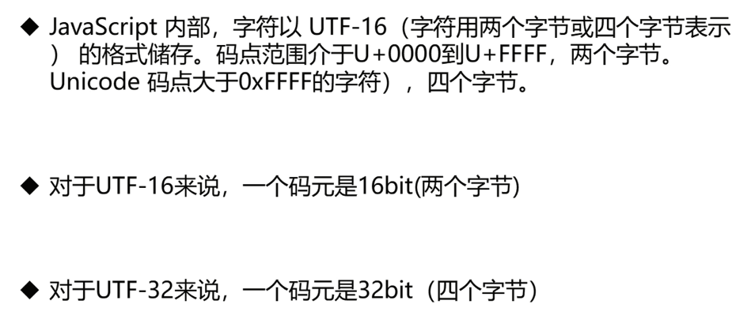
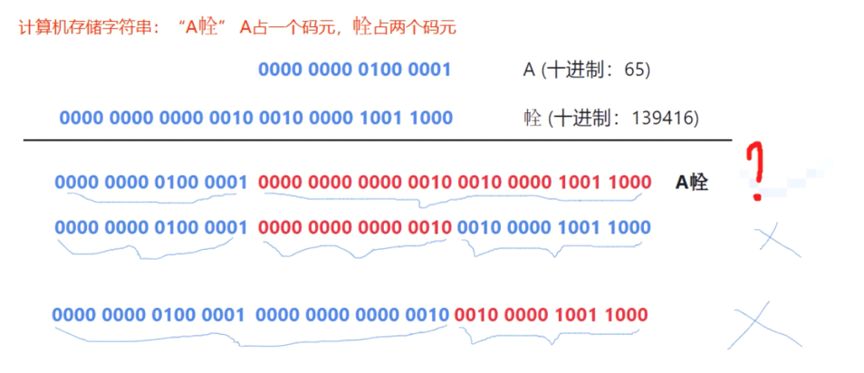
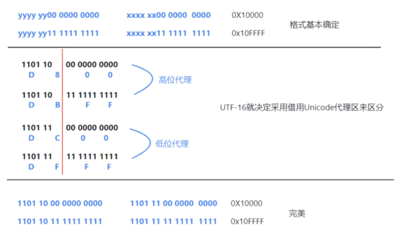
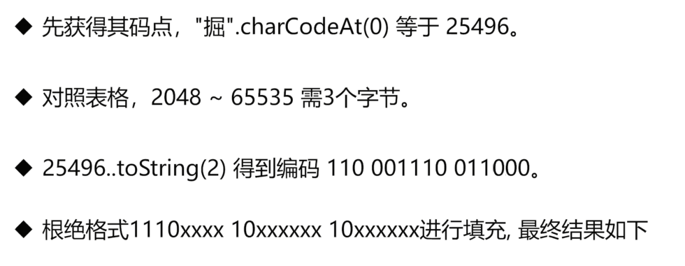
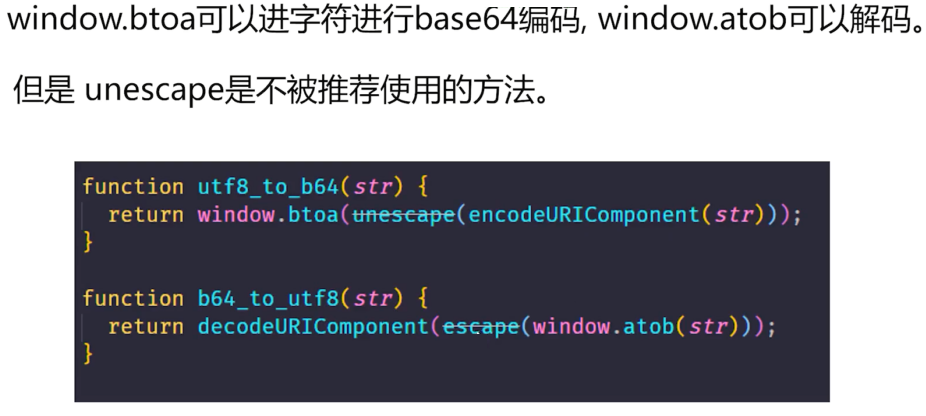
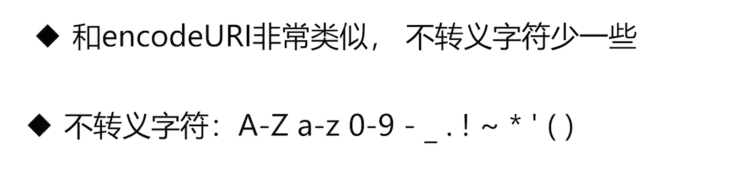

# 绕不过坎，字符编码

## 不同字符表示方式背后编码知识

'\141;', '\x61', '\u0061' 背后的字符编码知识

字符有几种表示方式：
- 至少六种
```ts
console.log(`a`)        // 'a'
console.log('a')        // 'a'
console.log('\a')       // 'a'
console.log('\141')     // 'a'
console.log('\x61')     // 'a'
console.log('\u0061')   // 'a'
console.log('\u{0061}') // 'a'
```


**编码基础知识： ASCII 码**


1. ASCII码 是现今最通用的单字节编码系统，并等同于国际标准ISO/IEC 646 。在这个页面，你可以找到8位的256个字符、ASCII码表和Windows-1252 (code page 1252，它是国际标准ISO 8859-1的一个扩展字符集) 标准保持一致;
2. ASCII码 是 American Standard Code for Information Interchange 的缩写，而不是ASCⅡ(罗马数字2)，有很多人在这个地方产生误解;
3. ASCII码 规范于1967年第一次发布，最后一次更新是在1986年，它包含了33个控制字符（具有某些特殊功能但是无法显示的字符）和95个可显示字符;

ASCII 控制字符 (字符编码: 0-31)
- 在ASCII码表中，前32个字符是不能用于打印控制的编码，而是用于控制像打印机一样的外围设备。

<table class="table table-ascii table-bordered table-border-ascii table-hover table-xs page-break">
    <thead>
    <tr class="table-header">
        <th class="col-plus"></th>
        <th class="col-40px">十进制<br> DEC</th>
        <th class="col-40px">八进制<br> OCT</th>
        <th class="col-80px">十六进制<br> HEX</th>
        <th class="col-80px">二进制<br> BIN</th>
        <th class="col-50px">符号<br> Symbol</th>
        <th class="col-80px"> HTML<br>实体编码</th>
        <th class="col-html">中文解释<br> Description</th>
        <th class="col-description" align="left">英文解释<br> Description</th>
    </tr>
    </thead>
    <tbody>
    <tr><td><a href="javascript:void(0);" class="text-success"><i class="asciim-cn asciim-cn-jiahao"></i></a></td><td>0</td><td>000</td><td>0<span class="bg-warning">0</span></td><td>0000<span class="bg-warning">0000</span></td><td>NUL</td><td>&amp;#000;</td><td>空字符</td><td>Null char</td></tr>
    <tr><td><a href="javascript:void(0);" class="text-success"><i class="asciim-cn asciim-cn-jiahao"></i></a></td><td>1</td><td>001</td><td>0<span class="bg-warning">1</span></td><td>0000<span class="bg-warning">0001</span></td><td>SOH</td><td>&amp;#001;</td><td>标题开始</td><td>Start of Heading</td></tr>
    <tr><td><a href="javascript:void(0);" class="text-success"><i class="asciim-cn asciim-cn-jiahao"></i></a></td><td>2</td><td>002</td><td>0<span class="bg-warning">2</span></td><td>0000<span class="bg-warning">0010</span></td><td>STX</td><td>&amp;#002;</td><td>正文开始</td><td>Start of Text</td></tr>
    <tr><td><a href="javascript:void(0);" class="text-success"><i class="asciim-cn asciim-cn-jiahao"></i></a></td><td>3</td><td>003</td><td>0<span class="bg-warning">3</span></td><td>0000<span class="bg-warning">0011</span></td><td>ETX</td><td>&amp;#003;</td><td>正文结束</td><td>End of Text</td></tr>
    <tr><td><a href="javascript:void(0);" class="text-success"><i class="asciim-cn asciim-cn-jiahao"></i></a></td><td>4</td><td>004</td><td>0<span class="bg-warning">4</span></td><td>0000<span class="bg-warning">0100</span></td><td>EOT</td><td>&amp;#004;</td><td>传输结束</td><td>End of Transmission</td></tr>
    <tr><td><a href="javascript:void(0);" class="text-success"><i class="asciim-cn asciim-cn-jiahao"></i></a></td><td>5</td><td>005</td><td>0<span class="bg-warning">5</span></td><td>0000<span class="bg-warning">0101</span></td><td>ENQ</td><td>&amp;#005;</td><td>询问</td><td>Enquiry</td></tr>
    <tr><td><a href="javascript:void(0);" class="text-success"><i class="asciim-cn asciim-cn-jiahao"></i></a></td><td>6</td><td>006</td><td>0<span class="bg-warning">6</span></td><td>0000<span class="bg-warning">0110</span></td><td>ACK</td><td>&amp;#006;</td><td>收到通知</td><td>Acknowledgment</td></tr>
    <tr><td><a href="javascript:void(0);" class="text-success"><i class="asciim-cn asciim-cn-jiahao"></i></a></td><td>7</td><td>007</td><td>0<span class="bg-warning">7</span></td><td>0000<span class="bg-warning">0111</span></td><td>BEL</td><td>&amp;#007;</td><td>铃</td><td>Bell</td></tr>
    <tr><td><a href="javascript:void(0);" class="text-success"><i class="asciim-cn asciim-cn-jiahao"></i></a></td><td>8</td><td>010</td><td>0<span class="bg-warning">8</span></td><td>0000<span class="bg-warning">1000</span></td><td> BS</td><td>&amp;#008;</td><td>退格</td><td>Back Space</td></tr>
    <tr><td><a href="javascript:void(0);" class="text-success"><i class="asciim-cn asciim-cn-jiahao"></i></a></td><td>9</td><td>011</td><td>0<span class="bg-warning">9</span></td><td>0000<span class="bg-warning">1001</span></td><td> HT</td><td>&amp;#009;</td><td>水平制表符</td><td>Horizontal Tab</td></tr>
    <tr><td><a href="javascript:void(0);" class="text-success"><i class="asciim-cn asciim-cn-jiahao"></i></a></td><td>10</td><td>012</td><td>0<span class="bg-warning">A</span></td><td>0000<span class="bg-warning">1010</span></td><td> LF</td><td>&amp;#010;</td><td>换行键</td><td>Line Feed</td></tr>
    <tr><td><a href="javascript:void(0);" class="text-success"><i class="asciim-cn asciim-cn-jiahao"></i></a></td><td>11</td><td>013</td><td>0<span class="bg-warning">B</span></td><td>0000<span class="bg-warning">1011</span></td><td> VT</td><td>&amp;#011;</td><td>垂直制表符</td><td>Vertical Tab</td></tr>
    <tr><td><a href="javascript:void(0);" class="text-success"><i class="asciim-cn asciim-cn-jiahao"></i></a></td><td>12</td><td>014</td><td>0<span class="bg-warning">C</span></td><td>0000<span class="bg-warning">1100</span></td><td> FF</td><td>&amp;#012;</td><td>换页键</td><td>Form Feed</td></tr>
    <tr><td><a href="javascript:void(0);" class="text-success"><i class="asciim-cn asciim-cn-jiahao"></i></a></td><td>13</td><td>015</td><td>0<span class="bg-warning">D</span></td><td>0000<span class="bg-warning">1101</span></td><td> CR</td><td>&amp;#013;</td><td>回车键</td><td>Carriage Return</td></tr>
    <tr><td><a href="javascript:void(0);" class="text-success"><i class="asciim-cn asciim-cn-jiahao"></i></a></td><td>14</td><td>016</td><td>0<span class="bg-warning">E</span></td><td>0000<span class="bg-warning">1110</span></td><td> SO</td><td>&amp;#014;</td><td>移出</td><td>Shift Out / X-On</td></tr>
    <tr><td><a href="javascript:void(0);" class="text-success"><i class="asciim-cn asciim-cn-jiahao"></i></a></td><td>15</td><td>017</td><td>0<span class="bg-warning">F</span></td><td>0000<span class="bg-warning">1111</span></td><td> SI</td><td>&amp;#015;</td><td>移入</td><td>Shift In / X-Off</td></tr>
    <tr><td><a href="javascript:void(0);" class="text-success"><i class="asciim-cn asciim-cn-jiahao"></i></a></td><td>16</td><td>020</td><td>10</td><td>00010000</td><td>DLE</td><td>&amp;#016;</td><td>数据链路转义</td><td>Data Line Escape</td></tr>
    <tr><td><a href="javascript:void(0);" class="text-success"><i class="asciim-cn asciim-cn-jiahao"></i></a></td><td>17</td><td>021</td><td>11</td><td>00010001</td><td>DC1</td><td>&amp;#017;</td><td>设备控制 1</td><td>Device Control 1 (oft. XON)</td></tr>
    <tr><td><a href="javascript:void(0);" class="text-success"><i class="asciim-cn asciim-cn-jiahao"></i></a></td><td>18</td><td>022</td><td>12</td><td>00010010</td><td>DC2</td><td>&amp;#018;</td><td>设备控制 2</td><td>Device Control 2</td></tr>
    <tr><td><a href="javascript:void(0);" class="text-success"><i class="asciim-cn asciim-cn-jiahao"></i></a></td><td>19</td><td>023</td><td>13</td><td>00010011</td><td>DC3</td><td>&amp;#019;</td><td>设备控制 3</td><td>Device Control 3 (oft. XOFF)</td></tr>
    <tr><td><a href="javascript:void(0);" class="text-success"><i class="asciim-cn asciim-cn-jiahao"></i></a></td><td>20</td><td>024</td><td>14</td><td>00010100</td><td>DC4</td><td>&amp;#020;</td><td>设备控制 4</td><td>Device Control 4</td></tr>
    <tr><td><a href="javascript:void(0);" class="text-success"><i class="asciim-cn asciim-cn-jiahao"></i></a></td><td>21</td><td>025</td><td>15</td><td>00010101</td><td>NAK</td><td>&amp;#021;</td><td>拒绝接收</td><td>Negative Acknowledgement</td></tr>
    <tr><td><a href="javascript:void(0);" class="text-success"><i class="asciim-cn asciim-cn-jiahao"></i></a></td><td>22</td><td>026</td><td>16</td><td>00010110</td><td>SYN</td><td>&amp;#022;</td><td>同步空闲</td><td>Synchronous Idle</td></tr>
    <tr><td><a href="javascript:void(0);" class="text-success"><i class="asciim-cn asciim-cn-jiahao"></i></a></td><td>23</td><td>027</td><td>17</td><td>00010111</td><td>ETB</td><td>&amp;#023;</td><td>传输块结束</td><td>End of Transmit Block</td></tr>
    <tr><td><a href="javascript:void(0);" class="text-success"><i class="asciim-cn asciim-cn-jiahao"></i></a></td><td>24</td><td>030</td><td>18</td><td>00011000</td><td>CAN</td><td>&amp;#024;</td><td>取消</td><td>Cancel</td></tr>
    <tr><td><a href="javascript:void(0);" class="text-success"><i class="asciim-cn asciim-cn-jiahao"></i></a></td><td>25</td><td>031</td><td>19</td><td>00011001</td><td> EM</td><td>&amp;#025;</td><td>介质中断</td><td>End of Medium</td></tr>
    <tr><td><a href="javascript:void(0);" class="text-success"><i class="asciim-cn asciim-cn-jiahao"></i></a></td><td>26</td><td>032</td><td>1A</td><td>00011010</td><td>SUB</td><td>&amp;#026;</td><td>替换</td><td>Substitute</td></tr>
    <tr><td><a href="javascript:void(0);" class="text-success"><i class="asciim-cn asciim-cn-jiahao"></i></a></td><td>27</td><td>033</td><td>1B</td><td>00011011</td><td>ESC</td><td>&amp;#027;</td><td>换码符</td><td>Escape</td></tr>
    <tr><td><a href="javascript:void(0);" class="text-success"><i class="asciim-cn asciim-cn-jiahao"></i></a></td><td>28</td><td>034</td><td>1C</td><td>00011100</td><td> FS</td><td>&amp;#028;</td><td>文件分隔符</td><td>File Separator</td></tr>
    <tr><td><a href="javascript:void(0);" class="text-success"><i class="asciim-cn asciim-cn-jiahao"></i></a></td><td>29</td><td>035</td><td>1D</td><td>00011101</td><td> GS</td><td>&amp;#029;</td><td>组分隔符</td><td>Group Separator</td></tr>
    <tr><td><a href="javascript:void(0);" class="text-success"><i class="asciim-cn asciim-cn-jiahao"></i></a></td><td>30</td><td>036</td><td>1E</td><td>00011110</td><td> RS</td><td>&amp;#030;</td><td>记录分离符</td><td>Record Separator</td></tr>
    <tr><td><a href="javascript:void(0);" class="text-success"><i class="asciim-cn asciim-cn-jiahao"></i></a></td><td>31</td><td>037</td><td>1F</td><td>00011111</td><td> US</td><td>&amp;#031;</td><td>单元分隔符</td><td>Unit Separator</td></tr>
    </tbody>
</table>


ASCII 打印字符 (字符编码: 32-127)
- 32～126(共95个)是字符：32是空格，其中48～57为0到9十个阿拉伯数字，65～90为26个大写英文字母，97～122号为26个小写英文字母，其余为一些标点符号、运算符号等。第127个字符表示的是键盘上的删除命令。

<table class="table table-ascii table-bordered table-border-ascii table-hover table-xs page-break">
    <thead>
    <tr class="table-header">
        <th class="col-plus"></th>
        <th class="col-40px">十进制<br> DEC</th>
        <th class="col-40px">八进制<br> OCT</th>
        <th class="col-80px">十六进制<br> HEX</th>
        <th class="col-80px">二进制<br> BIN</th>
        <th class="col-50px">符号<br> Symbol</th>
        <th class="col-80px"> HTML<br>实体编码</th>
        <th class="col-html">中文解释<br> Description</th>
        <th class="col-description" align="left">英文解释<br> Description</th>
    </tr>
    </thead>
    <tbody>
    <tr><td><a href="javascript:void(0);" class="text-success"><i class="asciim-cn asciim-cn-jiahao"></i></a></td><td>32</td><td>040</td><td>20</td><td>00100000</td><td>&nbsp;</td><td>&amp;#032;</td><td>空格</td><td>Space</td></tr>
    <tr><td><a href="javascript:void(0);" class="text-success"><i class="asciim-cn asciim-cn-jiahao"></i></a></td><td>33</td><td>041</td><td>21</td><td>00100001</td><td>!</td><td>&amp;#033;</td><td>感叹号</td><td>Exclamation mark</td></tr>
    <tr><td><a href="javascript:void(0);" class="text-success"><i class="asciim-cn asciim-cn-jiahao"></i></a></td><td>34</td><td>042</td><td>22</td><td>00100010</td><td>"</td><td>&amp;#034;</td><td>双引号</td><td>Double quotes (or speech marks)</td></tr>
    <tr><td><a href="javascript:void(0);" class="text-success"><i class="asciim-cn asciim-cn-jiahao"></i></a></td><td>35</td><td>043</td><td>23</td><td>00100011</td><td>#</td><td>&amp;#035;</td><td>井号</td><td>Number</td></tr>
    <tr><td><a href="javascript:void(0);" class="text-success"><i class="asciim-cn asciim-cn-jiahao"></i></a></td><td>36</td><td>044</td><td>24</td><td>00100100</td><td>$</td><td>&amp;#036;</td><td>美元符</td><td>Dollar</td></tr>
    <tr><td><a href="javascript:void(0);" class="text-success"><i class="asciim-cn asciim-cn-jiahao"></i></a></td><td>37</td><td>045</td><td>25</td><td>00100101</td><td>%</td><td>&amp;#037;</td><td>百分号</td><td>Per cent sign</td></tr>
    <tr><td><a href="javascript:void(0);" class="text-success"><i class="asciim-cn asciim-cn-jiahao"></i></a></td><td>38</td><td>046</td><td>26</td><td>00100110</td><td>&amp;</td><td>&amp;#038;</td><td>与</td><td>Ampersand</td></tr>
    <tr><td><a href="javascript:void(0);" class="text-success"><i class="asciim-cn asciim-cn-jiahao"></i></a></td><td>39</td><td>047</td><td>27</td><td>00100111</td><td>'</td><td>&amp;#039;</td><td>单引号</td><td>Single quote</td></tr>
    <tr><td><a href="javascript:void(0);" class="text-success"><i class="asciim-cn asciim-cn-jiahao"></i></a></td><td>40</td><td>050</td><td>28</td><td>00101000</td><td>(</td><td>&amp;#040;</td><td>左括号</td><td>Open parenthesis (or open bracket)</td></tr>
    <tr><td><a href="javascript:void(0);" class="text-success"><i class="asciim-cn asciim-cn-jiahao"></i></a></td><td>41</td><td>051</td><td>29</td><td>00101001</td><td>)</td><td>&amp;#041;</td><td>右括号</td><td>Close parenthesis (or close bracket)</td></tr>
    <tr><td><a href="javascript:void(0);" class="text-success"><i class="asciim-cn asciim-cn-jiahao"></i></a></td><td>42</td><td>052</td><td>2A</td><td>00101010</td><td>*</td><td>&amp;#042;</td><td>星号</td><td>Asterisk</td></tr>
    <tr><td><a href="javascript:void(0);" class="text-success"><i class="asciim-cn asciim-cn-jiahao"></i></a></td><td>43</td><td>053</td><td>2B</td><td>00101011</td><td>+</td><td>&amp;#043;</td><td>加号</td><td>Plus</td></tr>
    <tr><td><a href="javascript:void(0);" class="text-success"><i class="asciim-cn asciim-cn-jiahao"></i></a></td><td>44</td><td>054</td><td>2C</td><td>00101100</td><td>,</td><td>&amp;#044;</td><td>逗号</td><td>Comma</td></tr>
    <tr><td><a href="javascript:void(0);" class="text-success"><i class="asciim-cn asciim-cn-jiahao"></i></a></td><td>45</td><td>055</td><td>2D</td><td>00101101</td><td>-</td><td>&amp;#045;</td><td>连字号或减号</td><td>Hyphen</td></tr>
    <tr><td><a href="javascript:void(0);" class="text-success"><i class="asciim-cn asciim-cn-jiahao"></i></a></td><td>46</td><td>056</td><td>2E</td><td>00101110</td><td>.</td><td>&amp;#046;</td><td>句点或小数点</td><td>Period, dot or full stop</td></tr>
    <tr><td><a href="javascript:void(0);" class="text-success"><i class="asciim-cn asciim-cn-jiahao"></i></a></td><td>47</td><td>057</td><td>2F</td><td>00101111</td><td>/</td><td>&amp;#047;</td><td>斜杠</td><td>Slash or divide</td></tr>
    <tr><td><a href="javascript:void(0);" class="text-success"><i class="asciim-cn asciim-cn-jiahao"></i></a></td><td>48</td><td>060</td><td>30</td><td>00110000</td><td>0</td><td>&amp;#048;</td><td>0</td><td>Zero</td></tr>
    <tr class="site-num_1"><td><a href="javascript:void(0);" class="text-success"><i class="asciim-cn asciim-cn-jiahao"></i></a></td><td>49</td><td>061</td><td>31</td><td>00110001</td><td>1</td><td>&amp;#049;</td><td>1</td><td>One</td></tr>
    <tr><td><a href="javascript:void(0);" class="text-success"><i class="asciim-cn asciim-cn-jiahao"></i></a></td><td>50</td><td>062</td><td>32</td><td>00110010</td><td>2</td><td>&amp;#050;</td><td>2</td><td>Two</td></tr>
    <tr><td><a href="javascript:void(0);" class="text-success"><i class="asciim-cn asciim-cn-jiahao"></i></a></td><td>51</td><td>063</td><td>33</td><td>00110011</td><td>3</td><td>&amp;#051;</td><td>3</td><td>Three</td></tr>
    <tr><td><a href="javascript:void(0);" class="text-success"><i class="asciim-cn asciim-cn-jiahao"></i></a></td><td>52</td><td>064</td><td>34</td><td>00110100</td><td>4</td><td>&amp;#052;</td><td>4</td><td>Four</td></tr>
    <tr><td><a href="javascript:void(0);" class="text-success"><i class="asciim-cn asciim-cn-jiahao"></i></a></td><td>53</td><td>065</td><td>35</td><td>00110101</td><td>5</td><td>&amp;#053;</td><td>5</td><td>Five</td></tr>
    <tr><td><a href="javascript:void(0);" class="text-success"><i class="asciim-cn asciim-cn-jiahao"></i></a></td><td>54</td><td>066</td><td>36</td><td>00110110</td><td>6</td><td>&amp;#054;</td><td>6</td><td>Six</td></tr>
    <tr><td><a href="javascript:void(0);" class="text-success"><i class="asciim-cn asciim-cn-jiahao"></i></a></td><td>55</td><td>067</td><td>37</td><td>00110111</td><td>7</td><td>&amp;#055;</td><td>7</td><td>Seven</td></tr>
    <tr><td><a href="javascript:void(0);" class="text-success"><i class="asciim-cn asciim-cn-jiahao"></i></a></td><td>56</td><td>070</td><td>38</td><td>00111000</td><td>8</td><td>&amp;#056;</td><td>8</td><td>Eight</td></tr>
    <tr><td><a href="javascript:void(0);" class="text-success"><i class="asciim-cn asciim-cn-jiahao"></i></a></td><td>57</td><td>071</td><td>39</td><td>00111001</td><td>9</td><td>&amp;#057;</td><td>9</td><td>Nine</td></tr>
    <tr><td><a href="javascript:void(0);" class="text-success"><i class="asciim-cn asciim-cn-jiahao"></i></a></td><td>58</td><td>072</td><td>3A</td><td>00111010</td><td>:</td><td>&amp;#058;</td><td>冒号</td><td>Colon</td></tr>
    <tr><td><a href="javascript:void(0);" class="text-success"><i class="asciim-cn asciim-cn-jiahao"></i></a></td><td>59</td><td>073</td><td>3B</td><td>00111011</td><td>;</td><td>&amp;#059;</td><td>分号</td><td>Semicolon</td></tr>
    <tr><td><a href="javascript:void(0);" class="text-success"><i class="asciim-cn asciim-cn-jiahao"></i></a></td><td>60</td><td>074</td><td>3C</td><td>00111100</td><td>&lt;</td><td>&amp;#060;</td><td>小于</td><td>Less than (or open angled bracket)</td></tr>
    <tr><td><a href="javascript:void(0);" class="text-success"><i class="asciim-cn asciim-cn-jiahao"></i></a></td><td>61</td><td>075</td><td>3D</td><td>00111101</td><td>=</td><td>&amp;#061;</td><td>等号</td><td>Equals</td></tr>
    <tr><td><a href="javascript:void(0);" class="text-success"><i class="asciim-cn asciim-cn-jiahao"></i></a></td><td>62</td><td>076</td><td>3E</td><td>00111110</td><td>&gt;</td><td>&amp;#062;</td><td>大于</td><td>Greater than (or close angled bracket)</td></tr>
    <tr><td><a href="javascript:void(0);" class="text-success"><i class="asciim-cn asciim-cn-jiahao"></i></a></td><td>63</td><td>077</td><td>3F</td><td>00111111</td><td>?</td><td>&amp;#063;</td><td>问号</td><td>Question mark</td></tr>
    <tr><td><a href="javascript:void(0);" class="text-success"><i class="asciim-cn asciim-cn-jiahao"></i></a></td><td>64</td><td>100</td><td>40</td><td>01000000</td><td>@</td><td>&amp;#064;</td><td>电子邮件符号</td><td>At symbol</td></tr>
    <tr class="site-capital_letter_A"><td><a href="javascript:void(0);" class="text-success"><i class="asciim-cn asciim-cn-jiahao"></i></a></td><td>65</td><td>101</td><td>41</td><td>01000001</td><td>A</td><td>&amp;#065;</td><td>大写字母 A</td><td>Uppercase A</td></tr>
    <tr><td><a href="javascript:void(0);" class="text-success"><i class="asciim-cn asciim-cn-jiahao"></i></a></td><td>66</td><td>102</td><td>42</td><td>01000010</td><td>B</td><td>&amp;#066;</td><td>大写字母 B</td><td>Uppercase B</td></tr>
    <tr><td><a href="javascript:void(0);" class="text-success"><i class="asciim-cn asciim-cn-jiahao"></i></a></td><td>67</td><td>103</td><td>43</td><td>01000011</td><td>C</td><td>&amp;#067;</td><td>大写字母 C</td><td>Uppercase C</td></tr>
    <tr><td><a href="javascript:void(0);" class="text-success"><i class="asciim-cn asciim-cn-jiahao"></i></a></td><td>68</td><td>104</td><td>44</td><td>01000100</td><td>D</td><td>&amp;#068;</td><td>大写字母 D</td><td>Uppercase D</td></tr>
    <tr><td><a href="javascript:void(0);" class="text-success"><i class="asciim-cn asciim-cn-jiahao"></i></a></td><td>69</td><td>105</td><td>45</td><td>01000101</td><td>E</td><td>&amp;#069;</td><td>大写字母 E</td><td>Uppercase E</td></tr>
    <tr><td><a href="javascript:void(0);" class="text-success"><i class="asciim-cn asciim-cn-jiahao"></i></a></td><td>70</td><td>106</td><td>46</td><td>01000110</td><td>F</td><td>&amp;#070;</td><td>大写字母 F</td><td>Uppercase F</td></tr>
    <tr><td><a href="javascript:void(0);" class="text-success"><i class="asciim-cn asciim-cn-jiahao"></i></a></td><td>71</td><td>107</td><td>47</td><td>01000111</td><td>G</td><td>&amp;#071;</td><td>大写字母 G</td><td>Uppercase G</td></tr>
    <tr><td><a href="javascript:void(0);" class="text-success"><i class="asciim-cn asciim-cn-jiahao"></i></a></td><td>72</td><td>110</td><td>48</td><td>01001000</td><td>H</td><td>&amp;#072;</td><td>大写字母 H</td><td>Uppercase H</td></tr>
    <tr><td><a href="javascript:void(0);" class="text-success"><i class="asciim-cn asciim-cn-jiahao"></i></a></td><td>73</td><td>111</td><td>49</td><td>01001001</td><td>I</td><td>&amp;#073;</td><td>大写字母 I</td><td>Uppercase I</td></tr>
    <tr><td><a href="javascript:void(0);" class="text-success"><i class="asciim-cn asciim-cn-jiahao"></i></a></td><td>74</td><td>112</td><td>4A</td><td>01001010</td><td>J</td><td>&amp;#074;</td><td>大写字母 J</td><td>Uppercase J</td></tr>
    <tr><td><a href="javascript:void(0);" class="text-success"><i class="asciim-cn asciim-cn-jiahao"></i></a></td><td>75</td><td>113</td><td>4B</td><td>01001011</td><td>K</td><td>&amp;#075;</td><td>大写字母 K</td><td>Uppercase K</td></tr>
    <tr><td><a href="javascript:void(0);" class="text-success"><i class="asciim-cn asciim-cn-jiahao"></i></a></td><td>76</td><td>114</td><td>4C</td><td>01001100</td><td>L</td><td>&amp;#076;</td><td>大写字母 L</td><td>Uppercase L</td></tr>
    <tr><td><a href="javascript:void(0);" class="text-success"><i class="asciim-cn asciim-cn-jiahao"></i></a></td><td>77</td><td>115</td><td>4D</td><td>01001101</td><td>M</td><td>&amp;#077;</td><td>大写字母 M</td><td>Uppercase M</td></tr>
    <tr><td><a href="javascript:void(0);" class="text-success"><i class="asciim-cn asciim-cn-jiahao"></i></a></td><td>78</td><td>116</td><td>4E</td><td>01001110</td><td>N</td><td>&amp;#078;</td><td>大写字母 N</td><td>Uppercase N</td></tr>
    <tr><td><a href="javascript:void(0);" class="text-success"><i class="asciim-cn asciim-cn-jiahao"></i></a></td><td>79</td><td>117</td><td>4F</td><td>01001111</td><td>O</td><td>&amp;#079;</td><td>大写字母 O</td><td>Uppercase O</td></tr>
    <tr><td><a href="javascript:void(0);" class="text-success"><i class="asciim-cn asciim-cn-jiahao"></i></a></td><td>80</td><td>120</td><td>50</td><td>01010000</td><td>P</td><td>&amp;#080;</td><td>大写字母 P</td><td>Uppercase P</td></tr>
    <tr><td><a href="javascript:void(0);" class="text-success"><i class="asciim-cn asciim-cn-jiahao"></i></a></td><td>81</td><td>121</td><td>51</td><td>01010001</td><td>Q</td><td>&amp;#081;</td><td>大写字母 Q</td><td>Uppercase Q</td></tr>
    <tr><td><a href="javascript:void(0);" class="text-success"><i class="asciim-cn asciim-cn-jiahao"></i></a></td><td>82</td><td>122</td><td>52</td><td>01010010</td><td>R</td><td>&amp;#082;</td><td>大写字母 R</td><td>Uppercase R</td></tr>
    <tr><td><a href="javascript:void(0);" class="text-success"><i class="asciim-cn asciim-cn-jiahao"></i></a></td><td>83</td><td>123</td><td>53</td><td>01010011</td><td>S</td><td>&amp;#083;</td><td>大写字母 S</td><td>Uppercase S</td></tr>
    <tr><td><a href="javascript:void(0);" class="text-success"><i class="asciim-cn asciim-cn-jiahao"></i></a></td><td>84</td><td>124</td><td>54</td><td>01010100</td><td>T</td><td>&amp;#084;</td><td>大写字母 T</td><td>Uppercase T</td></tr>
    <tr><td><a href="javascript:void(0);" class="text-success"><i class="asciim-cn asciim-cn-jiahao"></i></a></td><td>85</td><td>125</td><td>55</td><td>01010101</td><td>U</td><td>&amp;#085;</td><td>大写字母 U</td><td>Uppercase U</td></tr>
    <tr><td><a href="javascript:void(0);" class="text-success"><i class="asciim-cn asciim-cn-jiahao"></i></a></td><td>86</td><td>126</td><td>56</td><td>01010110</td><td>V</td><td>&amp;#086;</td><td>大写字母 V</td><td>Uppercase V</td></tr>
    <tr><td><a href="javascript:void(0);" class="text-success"><i class="asciim-cn asciim-cn-jiahao"></i></a></td><td>87</td><td>127</td><td>57</td><td>01010111</td><td>W</td><td>&amp;#087</td><td>大写字母 W</td><td>Uppercase W</td></tr>
    <tr><td><a href="javascript:void(0);" class="text-success"><i class="asciim-cn asciim-cn-jiahao"></i></a></td><td>88</td><td>130</td><td>58</td><td>01011000</td><td>X</td><td>&amp;#088;</td><td>大写字母 X</td><td>Uppercase X</td></tr>
    <tr><td><a href="javascript:void(0);" class="text-success"><i class="asciim-cn asciim-cn-jiahao"></i></a></td><td>89</td><td>131</td><td>59</td><td>01011001</td><td>Y</td><td>&amp;#089;</td><td>大写字母 Y</td><td>Uppercase Y</td></tr>
    <tr><td><a href="javascript:void(0);" class="text-success"><i class="asciim-cn asciim-cn-jiahao"></i></a></td><td>90</td><td>132</td><td>5A</td><td>01011010</td><td>Z</td><td>&amp;#090;</td><td>大写字母 Z</td><td>Uppercase Z</td></tr>
    <tr><td><a href="javascript:void(0);" class="text-success"><i class="asciim-cn asciim-cn-jiahao"></i></a></td><td>91</td><td>133</td><td>5B</td><td>01011011</td><td>[</td><td>&amp;#091;</td><td>左中括号</td><td>Opening bracket</td></tr>
    <tr><td><a href="javascript:void(0);" class="text-success"><i class="asciim-cn asciim-cn-jiahao"></i></a></td><td>92</td><td>134</td><td>5C</td><td>01011100</td><td></td><td>&amp;#092;</td><td>反斜杠</td><td>Backslash</td></tr>
    <tr><td><a href="javascript:void(0);" class="text-success"><i class="asciim-cn asciim-cn-jiahao"></i></a></td><td>93</td><td>135</td><td>5D</td><td>01011101</td><td>]</td><td>&amp;#093;</td><td>右中括号</td><td>Closing bracket</td></tr>
    <tr><td><a href="javascript:void(0);" class="text-success"><i class="asciim-cn asciim-cn-jiahao"></i></a></td><td>94</td><td>136</td><td>5E</td><td>01011110</td><td>^</td><td>&amp;#094;</td><td>音调符号</td><td>Caret - circumflex</td></tr>
    <tr><td><a href="javascript:void(0);" class="text-success"><i class="asciim-cn asciim-cn-jiahao"></i></a></td><td>95</td><td>137</td><td>5F</td><td>01011111</td><td>_</td><td>&amp;#095;</td><td>下划线</td><td>Underscore</td></tr>
    <tr><td><a href="javascript:void(0);" class="text-success"><i class="asciim-cn asciim-cn-jiahao"></i></a></td><td>96</td><td>140</td><td>60</td><td>01100000</td><td>`</td><td>&amp;#096;</td><td>重音符</td><td>Grave accent</td></tr>
    <tr class="site-small_letter_a"><td><a href="javascript:void(0);" class="text-success"><i class="asciim-cn asciim-cn-jiahao"></i></a></td><td>97</td><td>141</td><td>61</td><td>01100001</td><td>a</td><td>&amp;#097;</td><td>小写字母 a</td><td>Lowercase a</td></tr>
    <tr><td><a href="javascript:void(0);" class="text-success"><i class="asciim-cn asciim-cn-jiahao"></i></a></td><td>98</td><td>142</td><td>62</td><td>01100010</td><td>b</td><td>&amp;#098;</td><td>小写字母 b</td><td>Lowercase b</td></tr>
    <tr><td><a href="javascript:void(0);" class="text-success"><i class="asciim-cn asciim-cn-jiahao"></i></a></td><td>99</td><td>143</td><td>63</td><td>01100011</td><td>c</td><td>&amp;#099;</td><td>小写字母 c</td><td>Lowercase c</td></tr>
    <tr><td><a href="javascript:void(0);" class="text-success"><i class="asciim-cn asciim-cn-jiahao"></i></a></td><td>100</td><td>144</td><td>64</td><td>01100100</td><td>d</td><td>&amp;#100;</td><td>小写字母 d</td><td>Lowercase d</td></tr>
    <tr><td><a href="javascript:void(0);" class="text-success"><i class="asciim-cn asciim-cn-jiahao"></i></a></td><td>101</td><td>145</td><td>65</td><td>01100101</td><td>e</td><td>&amp;#101;</td><td>小写字母 e</td><td>Lowercase e</td></tr>
    <tr><td><a href="javascript:void(0);" class="text-success"><i class="asciim-cn asciim-cn-jiahao"></i></a></td><td>102</td><td>146</td><td>66</td><td>01100110</td><td>f</td><td>&amp;#102;</td><td>小写字母 f</td><td>Lowercase f</td></tr>
    <tr><td><a href="javascript:void(0);" class="text-success"><i class="asciim-cn asciim-cn-jiahao"></i></a></td><td>103</td><td>147</td><td>67</td><td>01100111</td><td>g</td><td>&amp;#103;</td><td>小写字母 g</td><td>Lowercase g</td></tr>
    <tr><td><a href="javascript:void(0);" class="text-success"><i class="asciim-cn asciim-cn-jiahao"></i></a></td><td>104</td><td>150</td><td>68</td><td>01101000</td><td>h</td><td>&amp;#104;</td><td>小写字母 h</td><td>Lowercase h</td></tr>
    <tr><td><a href="javascript:void(0);" class="text-success"><i class="asciim-cn asciim-cn-jiahao"></i></a></td><td>105</td><td>151</td><td>69</td><td>01101001</td><td>i</td><td>&amp;#105;</td><td>小写字母 i</td><td>Lowercase i</td></tr>
    <tr><td><a href="javascript:void(0);" class="text-success"><i class="asciim-cn asciim-cn-jiahao"></i></a></td><td>106</td><td>152</td><td>6A</td><td>01101010</td><td>j</td><td>&amp;#106;</td><td>小写字母 j</td><td>Lowercase j</td></tr>
    <tr><td><a href="javascript:void(0);" class="text-success"><i class="asciim-cn asciim-cn-jiahao"></i></a></td><td>107</td><td>153</td><td>6B</td><td>01101011</td><td>k</td><td>&amp;#107;</td><td>小写字母 k</td><td>Lowercase k</td></tr>
    <tr><td><a href="javascript:void(0);" class="text-success"><i class="asciim-cn asciim-cn-jiahao"></i></a></td><td>108</td><td>154</td><td>6C</td><td>01101100</td><td>l</td><td>&amp;#108;</td><td>小写字母 l</td><td>Lowercase l</td></tr>
    <tr><td><a href="javascript:void(0);" class="text-success"><i class="asciim-cn asciim-cn-jiahao"></i></a></td><td>109</td><td>155</td><td>6D</td><td>01101101</td><td>m</td><td>&amp;#109;</td><td>小写字母 m</td><td>Lowercase m</td></tr>
    <tr><td><a href="javascript:void(0);" class="text-success"><i class="asciim-cn asciim-cn-jiahao"></i></a></td><td>110</td><td>156</td><td>6E</td><td>01101110</td><td>n</td><td>&amp;#110;</td><td>小写字母 n</td><td>Lowercase n</td></tr>
    <tr><td><a href="javascript:void(0);" class="text-success"><i class="asciim-cn asciim-cn-jiahao"></i></a></td><td>111</td><td>157</td><td>6F</td><td>01101111</td><td>o</td><td>&amp;#111;</td><td>小写字母 o</td><td>Lowercase o</td></tr>
    <tr><td><a href="javascript:void(0);" class="text-success"><i class="asciim-cn asciim-cn-jiahao"></i></a></td><td>112</td><td>160</td><td>70</td><td>01110000</td><td>p</td><td>&amp;#112;</td><td>小写字母 p</td><td>Lowercase p</td></tr>
    <tr><td><a href="javascript:void(0);" class="text-success"><i class="asciim-cn asciim-cn-jiahao"></i></a></td><td>113</td><td>161</td><td>71</td><td>01110001</td><td>q</td><td>&amp;#113;</td><td>小写字母 q</td><td>Lowercase q</td></tr>
    <tr><td><a href="javascript:void(0);" class="text-success"><i class="asciim-cn asciim-cn-jiahao"></i></a></td><td>114</td><td>162</td><td>72</td><td>01110010</td><td>r</td><td>&amp;#114;</td><td>小写字母 r</td><td>Lowercase r</td></tr>
    <tr><td><a href="javascript:void(0);" class="text-success"><i class="asciim-cn asciim-cn-jiahao"></i></a></td><td>115</td><td>163</td><td>73</td><td>01110011</td><td>s</td><td>&amp;#115;</td><td>小写字母 s</td><td>Lowercase s</td></tr>
    <tr><td><a href="javascript:void(0);" class="text-success"><i class="asciim-cn asciim-cn-jiahao"></i></a></td><td>116</td><td>164</td><td>74</td><td>01110100</td><td>t</td><td>&amp;#116;</td><td>小写字母 t</td><td>Lowercase t</td></tr>
    <tr><td><a href="javascript:void(0);" class="text-success"><i class="asciim-cn asciim-cn-jiahao"></i></a></td><td>117</td><td>165</td><td>75</td><td>01110101</td><td>u</td><td>&amp;#117;</td><td>小写字母 u</td><td>Lowercase u</td></tr>
    <tr><td><a href="javascript:void(0);" class="text-success"><i class="asciim-cn asciim-cn-jiahao"></i></a></td><td>118</td><td>166</td><td>76</td><td>01110110</td><td>v</td><td>&amp;#118;</td><td>小写字母 v</td><td>Lowercase v</td></tr>
    <tr><td><a href="javascript:void(0);" class="text-success"><i class="asciim-cn asciim-cn-jiahao"></i></a></td><td>119</td><td>167</td><td>77</td><td>01110111</td><td>w</td><td>&amp;#119;</td><td>小写字母 w</td><td>Lowercase w</td></tr>
    <tr><td><a href="javascript:void(0);" class="text-success"><i class="asciim-cn asciim-cn-jiahao"></i></a></td><td>120</td><td>170</td><td>78</td><td>01111000</td><td>x</td><td>&amp;#120;</td><td>小写字母 x</td><td>Lowercase x</td></tr>
    <tr><td><a href="javascript:void(0);" class="text-success"><i class="asciim-cn asciim-cn-jiahao"></i></a></td><td>121</td><td>171</td><td>79</td><td>01111001</td><td>y</td><td>&amp;#121;</td><td>小写字母 y</td><td>Lowercase y</td></tr>
    <tr><td><a href="javascript:void(0);" class="text-success"><i class="asciim-cn asciim-cn-jiahao"></i></a></td><td>122</td><td>172</td><td>7A</td><td>01111010</td><td>z</td><td>&amp;#122;</td><td>小写字母 z</td><td>Lowercase z</td></tr>
    <tr><td><a href="javascript:void(0);" class="text-success"><i class="asciim-cn asciim-cn-jiahao"></i></a></td><td>123</td><td>173</td><td>7B</td><td>01111011</td><td>{</td><td>&amp;#123;</td><td>左大括号</td><td>Opening brace</td></tr>
    <tr><td><a href="javascript:void(0);" class="text-success"><i class="asciim-cn asciim-cn-jiahao"></i></a></td><td>124</td><td>174</td><td>7C</td><td>01111100</td><td>|</td><td>&amp;#124;</td><td>垂直线</td><td>Vertical bar</td></tr>
    <tr><td><a href="javascript:void(0);" class="text-success"><i class="asciim-cn asciim-cn-jiahao"></i></a></td><td>125</td><td>175</td><td>7D</td><td>01111101</td><td>}</td><td>&amp;#125;</td><td>右大括号</td><td>Closing brace</td></tr>
    <tr><td><a href="javascript:void(0);" class="text-success"><i class="asciim-cn asciim-cn-jiahao"></i></a></td><td>126</td><td>176</td><td>7E</td><td>01111110</td><td>~</td><td>&amp;#126;</td><td>波浪号</td><td>Equivalency sign - tilde</td></tr>
    <tr><td><a href="javascript:void(0);" class="text-success"><i class="asciim-cn asciim-cn-jiahao"></i></a></td><td>127</td><td>177</td><td>7F</td><td>01111111</td><td></td><td>&amp;#127;</td><td>删除</td><td>Delete</td></tr>
    </tbody>
</table>

**ASCII 额外扩展的版本 EASCII：**

- ASCII 128-255 部分

后128个称为扩展ASCII码。许多基于x86的系统都支持使用扩展（或“高”）ASCII。扩展ASCII码允许将每个字符的第8 位用于确定附加的128 个特殊符号字符、外来语字母和图形符号。

<table class="table table-ascii table-bordered table-border-ascii table-hover table-xs page-break">
    <thead>
    <tr class="table-header">
        <th class="col-plus"></th>
        <th class="col-40px">十进制<br> DEC</th>
        <th class="col-40px">八进制<br> OCT</th>
        <th class="col-80px">十六进制<br> HEX</th>
        <th class="col-80px">二进制<br> BIN</th>
        <th class="col-50px">符号<br> Symbol</th>
<th class="col-80px"> HTML<br>实体编码</th>
        <th class="col-html">中文解释<br> Description</th>
        <th class="col-description" align="left">英文解释<br> Description</th>
    </tr>
    </thead>
    <tbody>
    <tr class="e-rowbg"><td><a href="javascript:void(0);" class="text-success"><i class="asciim-cn asciim-cn-jiahao"></i></a></td><td>128</td><td>200</td><td>80</td><td>10000000</td><td>€</td><td>&amp;#128;</td><td>欧盟符号</td><td>Euro sign</td></tr>
    <tr><td><a href="javascript:void(0);" class="text-success"><i class="asciim-cn asciim-cn-jiahao"></i></a></td><td>129</td><td>201</td><td>81</td><td>10000001</td><td>&nbsp;</td><td></td><td>&nbsp;</td><td>&nbsp;</td></tr>
    <tr class="e-rowbg"><td><a href="javascript:void(0);" class="text-success"><i class="asciim-cn asciim-cn-jiahao"></i></a></td><td>130</td><td>202</td><td>82</td><td>10000010</td><td>‚</td><td>&amp;#130;</td><td>单低 9 引号</td><td>Single low-9 quotation mark</td></tr>
    <tr class="e-rowbg"><td><a href="javascript:void(0);" class="text-success"><i class="asciim-cn asciim-cn-jiahao"></i></a></td><td>131</td><td>203</td><td>83</td><td>10000011</td><td>ƒ</td><td>&amp;#131;</td><td>带钩的<br>拉丁小写字母f</td><td>Latin small letter f with hook</td></tr>
    <tr class="e-rowbg"><td><a href="javascript:void(0);" class="text-success"><i class="asciim-cn asciim-cn-jiahao"></i></a></td><td>132</td><td>204</td><td>84</td><td>10000100</td><td>„</td><td>&amp;#132;</td><td>双低 9 引号</td><td>Double low-9 quotation mark</td></tr>
    <tr class="e-rowbg"><td><a href="javascript:void(0);" class="text-success"><i class="asciim-cn asciim-cn-jiahao"></i></a></td><td>133</td><td>205</td><td>85</td><td>10000101</td><td>…</td><td>&amp;#133;</td><td>水平省略号</td><td>Horizontal ellipsis</td></tr>
    <tr class="e-rowbg"><td><a href="javascript:void(0);" class="text-success"><i class="asciim-cn asciim-cn-jiahao"></i></a></td><td>134</td><td>206</td><td>86</td><td>10000110</td><td>†</td><td>&amp;#134;</td><td>剑号</td><td>Dagger</td></tr>
    <tr class="e-rowbg"><td><a href="javascript:void(0);" class="text-success"><i class="asciim-cn asciim-cn-jiahao"></i></a></td><td>135</td><td>207</td><td>87</td><td>10000111</td><td>‡</td><td>&amp;#135;</td><td>双剑号</td><td>Double dagger</td></tr>
    <tr class="e-rowbg"><td><a href="javascript:void(0);" class="text-success"><i class="asciim-cn asciim-cn-jiahao"></i></a></td><td>136</td><td>210</td><td>88</td><td>10001000</td><td>ˆ</td><td>&amp;#136;</td><td>修正字符<br>抑扬音符号</td><td>Modifier letter circumflex accent</td></tr>
    <tr class="e-rowbg"><td><a href="javascript:void(0);" class="text-success"><i class="asciim-cn asciim-cn-jiahao"></i></a></td><td>137</td><td>211</td><td>89</td><td>10001001</td><td>‰</td><td>&amp;#137;</td><td>千分号</td><td>Per mille sign</td></tr>
    <tr class="e-rowbg"><td><a href="javascript:void(0);" class="text-success"><i class="asciim-cn asciim-cn-jiahao"></i></a></td><td>138</td><td>212</td><td>8A</td><td>10001010</td><td>Š</td><td>&amp;#138;</td><td>带弯音号的<br>拉丁大写字母 S</td><td>Latin capital letter S with caron</td></tr>
    <tr class="e-rowbg"><td><a href="javascript:void(0);" class="text-success"><i class="asciim-cn asciim-cn-jiahao"></i></a></td><td>139</td><td>213</td><td>8B</td><td>10001011</td><td>‹</td><td>&amp;#139;</td><td>左单书名号</td><td>Single left-pointing angle quotation</td></tr>
    <tr class="e-rowbg"><td><a href="javascript:void(0);" class="text-success"><i class="asciim-cn asciim-cn-jiahao"></i></a></td><td>140</td><td>214</td><td>8C</td><td>10001100</td><td>Œ</td><td>&amp;#140;</td><td>拉丁大写组合 OE</td><td>Latin capital ligature OE</td></tr>
    <tr><td><a href="javascript:void(0);" class="text-success"><i class="asciim-cn asciim-cn-jiahao"></i></a></td><td>141</td><td>215</td><td>8D</td><td>10001101</td><td>&nbsp;</td><td></td><td>&nbsp;</td><td>&nbsp;</td></tr>
    <tr class="e-rowbg"><td><a href="javascript:void(0);" class="text-success"><i class="asciim-cn asciim-cn-jiahao"></i></a></td><td>142</td><td>216</td><td>8E</td><td>10001110</td><td>Ž</td><td>&amp;#142;</td><td>带弯音号的<br>拉丁大写字母 z</td><td>Latin capital letter Z with caron</td></tr>
    <tr><td><a href="javascript:void(0);" class="text-success"><i class="asciim-cn asciim-cn-jiahao"></i></a></td><td>143</td><td>217</td><td>8F</td><td>10001111</td><td>&nbsp;</td><td></td><td>&nbsp;</td><td>&nbsp;</td></tr>
    <tr><td><a href="javascript:void(0);" class="text-success"><i class="asciim-cn asciim-cn-jiahao"></i></a></td><td>144</td><td>220</td><td>90</td><td>10010000</td><td>&nbsp;</td><td></td><td>&nbsp;</td><td>&nbsp;</td></tr>
    <tr class="e-rowbg"><td><a href="javascript:void(0);" class="text-success"><i class="asciim-cn asciim-cn-jiahao"></i></a></td><td>145</td><td>221</td><td>91</td><td>10010001</td><td>‘</td><td>&amp;#145;</td><td>左单引号</td><td>Left single quotation mark</td></tr>
    <tr class="e-rowbg"><td><a href="javascript:void(0);" class="text-success"><i class="asciim-cn asciim-cn-jiahao"></i></a></td><td>146</td><td>222</td><td>92</td><td>10010010</td><td>’</td><td>&amp;#146;</td><td>右单引号</td><td>Right single quotation mark</td></tr>
    <tr class="e-rowbg"><td><a href="javascript:void(0);" class="text-success"><i class="asciim-cn asciim-cn-jiahao"></i></a></td><td>147</td><td>223</td><td>93</td><td>10010011</td><td>“</td><td>&amp;#147;</td><td>左双引号</td><td>Left double quotation mark</td></tr>
    <tr class="e-rowbg"><td><a href="javascript:void(0);" class="text-success"><i class="asciim-cn asciim-cn-jiahao"></i></a></td><td>148</td><td>224</td><td>94</td><td>10010100</td><td>”</td><td>&amp;#148;</td><td>右双引号</td><td>Right double quotation mark</td></tr>
    <tr class="e-rowbg"><td><a href="javascript:void(0);" class="text-success"><i class="asciim-cn asciim-cn-jiahao"></i></a></td><td>149</td><td>225</td><td>95</td><td>10010101</td><td>•</td><td>&amp;#149;</td><td>&nbsp;</td><td>Bullet</td></tr>
    <tr class="e-rowbg"><td><a href="javascript:void(0);" class="text-success"><i class="asciim-cn asciim-cn-jiahao"></i></a></td><td>150</td><td>226</td><td>96</td><td>10010110</td><td>–</td><td>&amp;#150;</td><td>半长破折号</td><td>En dash</td></tr>
    <tr class="e-rowbg"><td><a href="javascript:void(0);" class="text-success"><i class="asciim-cn asciim-cn-jiahao"></i></a></td><td>151</td><td>227</td><td>97</td><td>10010111</td><td>—</td><td>&amp;#151;</td><td>全长破折号</td><td>Em dash</td></tr>
    <tr class="e-rowbg"><td><a href="javascript:void(0);" class="text-success"><i class="asciim-cn asciim-cn-jiahao"></i></a></td><td>152</td><td>230</td><td>98</td><td>10011000</td><td>˜</td><td>&amp;#152;</td><td>小波浪线</td><td>Small tilde</td></tr>
    <tr class="e-rowbg"><td><a href="javascript:void(0);" class="text-success"><i class="asciim-cn asciim-cn-jiahao"></i></a></td><td>153</td><td>231</td><td>99</td><td>10011001</td><td>™</td><td>&amp;#153;</td><td>&nbsp;</td><td>Trade mark sign</td></tr>
    <tr class="e-rowbg"><td><a href="javascript:void(0);" class="text-success"><i class="asciim-cn asciim-cn-jiahao"></i></a></td><td>154</td><td>232</td><td>9A</td><td>10011010</td><td>š</td><td>&amp;#154;</td><td>带弯音号的<br>拉丁小写字母 s</td><td>Latin small letter s with caron</td></tr>
    <tr class="e-rowbg"><td><a href="javascript:void(0);" class="text-success"><i class="asciim-cn asciim-cn-jiahao"></i></a></td><td>155</td><td>233</td><td>9B</td><td>10011011</td><td>›</td><td>&amp;#155;</td><td>右单书名号</td><td>Single right-pointing <br>angle quotation mark</td></tr>
    <tr class="e-rowbg"><td><a href="javascript:void(0);" class="text-success"><i class="asciim-cn asciim-cn-jiahao"></i></a></td><td>156</td><td>234</td><td>9C</td><td>10011100</td><td>œ</td><td>&amp;#156;</td><td>拉丁小写组合 oe</td><td>Latin small ligature oe</td></tr>
    <tr><td><a href="javascript:void(0);" class="text-success"><i class="asciim-cn asciim-cn-jiahao"></i></a></td><td>157</td><td>235</td><td>9D</td><td>10011101</td><td>&nbsp;</td><td></td><td>&nbsp;</td><td>&nbsp;</td></tr>
    <tr class="e-rowbg"><td><a href="javascript:void(0);" class="text-success"><i class="asciim-cn asciim-cn-jiahao"></i></a></td><td>158</td><td>236</td><td>9E</td><td>10011110</td><td>ž</td><td>&amp;#158;</td><td>带弯音号的<br>拉丁小写字母 z</td><td>Latin small letter z with caron</td></tr>
    <tr class="e-rowbg"><td><a href="javascript:void(0);" class="text-success"><i class="asciim-cn asciim-cn-jiahao"></i></a></td><td>159</td><td>237</td><td>9F</td><td>10011111</td><td>Ÿ</td><td>&amp;#159;</td><td>带弯音号的<br>拉丁大写字母 Y</td><td>Latin capital letter Y with diaeresis</td></tr>
    <!--tr>其他字符</tr-->
    <tr><td><a href="javascript:void(0);" class="text-success"><i class="asciim-cn asciim-cn-jiahao"></i></a></td><td>160</td><td>240</td><td>A0</td><td>10100000</td><td>&nbsp;</td><td>&amp;#160;</td><td>&nbsp;</td><td>Non-breaking space</td></tr>
    <tr><td><a href="javascript:void(0);" class="text-success"><i class="asciim-cn asciim-cn-jiahao"></i></a></td><td>161</td><td>241</td><td>A1</td><td>10100001</td><td>¡</td><td>&amp;#161;</td><td>反向感叹号</td><td>Inverted exclamation mark</td></tr>
    <tr><td><a href="javascript:void(0);" class="text-success"><i class="asciim-cn asciim-cn-jiahao"></i></a></td><td>162</td><td>242</td><td>A2</td><td>10100010</td><td>¢</td><td>&amp;#162;</td><td>分币符号</td><td>Cent sign</td></tr>
    <tr><td><a href="javascript:void(0);" class="text-success"><i class="asciim-cn asciim-cn-jiahao"></i></a></td><td>163</td><td>243</td><td>A3</td><td>10100011</td><td>£</td><td>&amp;#163;</td><td>英磅符号</td><td>Pound sign</td></tr>
    <tr><td><a href="javascript:void(0);" class="text-success"><i class="asciim-cn asciim-cn-jiahao"></i></a></td><td>164</td><td>244</td><td>A4</td><td>10100100</td><td>¤</td><td>&amp;#164;</td><td>&nbsp;</td><td>Currency sign</td></tr>
    <tr><td><a href="javascript:void(0);" class="text-success"><i class="asciim-cn asciim-cn-jiahao"></i></a></td><td>165</td><td>245</td><td>A5</td><td>10100101</td><td>¥</td><td>&amp;#165;</td><td>人民币符号</td><td>Yen sign</td></tr>
    <tr><td><a href="javascript:void(0);" class="text-success"><i class="asciim-cn asciim-cn-jiahao"></i></a></td><td>166</td><td>246</td><td>A6</td><td>10100110</td><td>¦</td><td>&amp;#166;</td><td>&nbsp;</td><td>Pipe, Broken vertical bar</td></tr>
    <tr><td><a href="javascript:void(0);" class="text-success"><i class="asciim-cn asciim-cn-jiahao"></i></a></td><td>167</td><td>247</td><td>A7</td><td>10100111</td><td>§</td><td>&amp;#167;</td><td>章节符号</td><td>Section sign</td></tr>
    <tr><td><a href="javascript:void(0);" class="text-success"><i class="asciim-cn asciim-cn-jiahao"></i></a></td><td>168</td><td>250</td><td>A8</td><td>10101000</td><td>¨</td><td>&amp;#168;</td><td>通用货币符号</td><td>Spacing diaeresis - umlaut</td></tr>
    <tr><td><a href="javascript:void(0);" class="text-success"><i class="asciim-cn asciim-cn-jiahao"></i></a></td><td>169</td><td>251</td><td>A9</td><td>10101001</td><td>©</td><td>&amp;#169;</td><td>版权符号</td><td>Copyright sign</td></tr>
    <tr><td><a href="javascript:void(0);" class="text-success"><i class="asciim-cn asciim-cn-jiahao"></i></a></td><td>170</td><td>252</td><td>AA</td><td>10101010</td><td>ª</td><td>&amp;#170;</td><td>阴性顺序<br>指示符号</td><td>Feminine ordinal indicator</td></tr>
    <tr><td><a href="javascript:void(0);" class="text-success"><i class="asciim-cn asciim-cn-jiahao"></i></a></td><td>171</td><td>253</td><td>AB</td><td>10101011</td><td>«</td><td>&amp;#171;</td><td>左角引号</td><td>Left double angle quotes</td></tr>
    <tr><td><a href="javascript:void(0);" class="text-success"><i class="asciim-cn asciim-cn-jiahao"></i></a></td><td>172</td><td>254</td><td>AC</td><td>10101100</td><td>¬</td><td>&amp;#172;</td><td>&nbsp;</td><td>Not sign</td></tr>
    <tr><td><a href="javascript:void(0);" class="text-success"><i class="asciim-cn asciim-cn-jiahao"></i></a></td><td>173</td><td>255</td><td>AD</td><td>10101101</td><td>&shy;</td><td>&amp;#173;</td><td>&nbsp;</td><td>Soft hyphen</td></tr>
    <tr><td><a href="javascript:void(0);" class="text-success"><i class="asciim-cn asciim-cn-jiahao"></i></a></td><td>174</td><td>256</td><td>AE</td><td>10101110</td><td>®</td><td>&amp;#174;</td><td>&nbsp;</td><td>Registered trade mark sign</td></tr>
    <tr><td><a href="javascript:void(0);" class="text-success"><i class="asciim-cn asciim-cn-jiahao"></i></a></td><td>175</td><td>257</td><td>AF</td><td>10101111</td><td>¯</td><td>&amp;#175;</td><td>&nbsp;</td><td>Spacing macron - overline</td></tr>
    <tr><td><a href="javascript:void(0);" class="text-success"><i class="asciim-cn asciim-cn-jiahao"></i></a></td><td>176</td><td>260</td><td>B0</td><td>10110000</td><td>°</td><td>&amp;#176;</td><td>温度符号</td><td>Degree sign</td></tr>
    <tr><td><a href="javascript:void(0);" class="text-success"><i class="asciim-cn asciim-cn-jiahao"></i></a></td><td>177</td><td>261</td><td>B1</td><td>10110001</td><td>±</td><td>&amp;#177;</td><td>加/减号</td><td>Plus-or-minus sign</td></tr>
    <tr><td><a href="javascript:void(0);" class="text-success"><i class="asciim-cn asciim-cn-jiahao"></i></a></td><td>178</td><td>262</td><td>B2</td><td>10110010</td><td>²</td><td>&amp;#178;</td><td>上标 2</td><td>Superscript two - squared</td></tr>
    <tr><td><a href="javascript:void(0);" class="text-success"><i class="asciim-cn asciim-cn-jiahao"></i></a></td><td>179</td><td>263</td><td>B3</td><td>10110011</td><td>³</td><td>&amp;#179;</td><td>上标 3</td><td>Superscript three - cubed</td></tr>
    <tr><td><a href="javascript:void(0);" class="text-success"><i class="asciim-cn asciim-cn-jiahao"></i></a></td><td>180</td><td>264</td><td>B4</td><td>10110100</td><td>´</td><td>&amp;#180;</td><td>&nbsp;</td><td>Acute accent - spacing acute</td></tr>
    <tr><td><a href="javascript:void(0);" class="text-success"><i class="asciim-cn asciim-cn-jiahao"></i></a></td><td>181</td><td>265</td><td>B5</td><td>10110101</td><td>µ</td><td>&amp;#181;</td><td>微符号</td><td>Micro sign</td></tr>
    <tr><td><a href="javascript:void(0);" class="text-success"><i class="asciim-cn asciim-cn-jiahao"></i></a></td><td>182</td><td>266</td><td>B6</td><td>10110110</td><td>¶</td><td>&amp;#182;</td><td>段落符号，<br>pilcrow</td><td>Pilcrow sign - paragraph sign</td></tr>
    <tr><td><a href="javascript:void(0);" class="text-success"><i class="asciim-cn asciim-cn-jiahao"></i></a></td><td>183</td><td>267</td><td>B7</td><td>10110111</td><td>·</td><td>&amp;#183;</td><td>中点</td><td>Middle dot - Georgian comma</td></tr>
    <tr><td><a href="javascript:void(0);" class="text-success"><i class="asciim-cn asciim-cn-jiahao"></i></a></td><td>184</td><td>270</td><td>B8</td><td>10111000</td><td>¸</td><td>&amp;#184;</td><td>&nbsp;</td><td>Spacing cedilla</td></tr>
    <tr><td><a href="javascript:void(0);" class="text-success"><i class="asciim-cn asciim-cn-jiahao"></i></a></td><td>185</td><td>271</td><td>B9</td><td>10111001</td><td>¹</td><td>&amp;#185;</td><td>上标 1</td><td>Superscript one</td></tr>
    <tr><td><a href="javascript:void(0);" class="text-success"><i class="asciim-cn asciim-cn-jiahao"></i></a></td><td>186</td><td>272</td><td>BA</td><td>10111010</td><td>º</td><td>&amp;#186;</td><td>阳性顺序<br>指示符</td><td>Masculine ordinal indicator</td></tr>
    <tr><td><a href="javascript:void(0);" class="text-success"><i class="asciim-cn asciim-cn-jiahao"></i></a></td><td>187</td><td>273</td><td>BB</td><td>10111011</td><td>»</td><td>&amp;#187;</td><td>右角引号</td><td>Right double angle quotes</td></tr>
    <tr><td><a href="javascript:void(0);" class="text-success"><i class="asciim-cn asciim-cn-jiahao"></i></a></td><td>188</td><td>274</td><td>BC</td><td>10111100</td><td>¼</td><td>&amp;#188;</td><td>分数四分之一</td><td>Fraction one quarter</td></tr>
    <tr><td><a href="javascript:void(0);" class="text-success"><i class="asciim-cn asciim-cn-jiahao"></i></a></td><td>189</td><td>275</td><td>BD</td><td>10111101</td><td>½</td><td>&amp;#189;</td><td>分数二分之一</td><td>Fraction one half</td></tr>
    <tr><td><a href="javascript:void(0);" class="text-success"><i class="asciim-cn asciim-cn-jiahao"></i></a></td><td>190</td><td>276</td><td>BE</td><td>10111110</td><td>¾</td><td>&amp;#190;</td><td>&nbsp;</td><td>Fraction three quarters</td></tr>
    <tr><td><a href="javascript:void(0);" class="text-success"><i class="asciim-cn asciim-cn-jiahao"></i></a></td><td>191</td><td>277</td><td>BF</td><td>10111111</td><td>¿</td><td>&amp;#191;</td><td>反向问号</td><td>Inverted question mark</td></tr>
    <tr><td><a href="javascript:void(0);" class="text-success"><i class="asciim-cn asciim-cn-jiahao"></i></a></td><td>192</td><td>300</td><td>C0</td><td>11000000</td><td>À</td><td>&amp;#192;</td><td>带重音符<br>的大写字母 A</td><td>Latin capital letter A with grave</td></tr>
    <tr><td><a href="javascript:void(0);" class="text-success"><i class="asciim-cn asciim-cn-jiahao"></i></a></td><td>193</td><td>301</td><td>C1</td><td>11000001</td><td>Á</td><td>&amp;#193;</td><td>带尖锐重音<br>的大写字母 A</td><td>Latin capital letter A with acute</td></tr>
    <tr><td><a href="javascript:void(0);" class="text-success"><i class="asciim-cn asciim-cn-jiahao"></i></a></td><td>194</td><td>302</td><td>C2</td><td>11000010</td><td>Â</td><td>&amp;#194;</td><td>带音调符号<br>的大写字母 A</td><td>Latin capital letter A with circumflex</td></tr>
    <tr><td><a href="javascript:void(0);" class="text-success"><i class="asciim-cn asciim-cn-jiahao"></i></a></td><td>195</td><td>303</td><td>C3</td><td>11000011</td><td>Ã</td><td>&amp;#195;</td><td>带代字号<br>的大写字母 A</td><td>Latin capital letter A with tilde</td></tr>
    <tr><td><a href="javascript:void(0);" class="text-success"><i class="asciim-cn asciim-cn-jiahao"></i></a></td><td>196</td><td>304</td><td>C4</td><td>11000100</td><td>Ä</td><td>&amp;#196;</td><td>带元音变音<br> (分音符号) <br>的大写字母 A</td><td>Latin capital letter A with diaeresis</td></tr>
    <tr><td><a href="javascript:void(0);" class="text-success"><i class="asciim-cn asciim-cn-jiahao"></i></a></td><td>197</td><td>305</td><td>C5</td><td>11000101</td><td>Å</td><td>&amp;#197;</td><td>带铃声<br>的大写字母 A</td><td>Latin capital letter A with ring above</td></tr>
    <tr><td><a href="javascript:void(0);" class="text-success"><i class="asciim-cn asciim-cn-jiahao"></i></a></td><td>198</td><td>306</td><td>C6</td><td>11000110</td><td>Æ</td><td>&amp;#198;</td><td>大写字母 AE<br> 双重元音</td><td>Latin capital letter AE</td></tr>
    <tr><td><a href="javascript:void(0);" class="text-success"><i class="asciim-cn asciim-cn-jiahao"></i></a></td><td>199</td><td>307</td><td>C7</td><td>11000111</td><td>Ç</td><td>&amp;#199;</td><td>带变音符号<br>的大写字母 C</td><td>Latin capital letter C with cedilla</td></tr>
    <tr><td><a href="javascript:void(0);" class="text-success"><i class="asciim-cn asciim-cn-jiahao"></i></a></td><td>200</td><td>310</td><td>C8</td><td>11001000</td><td>È</td><td>&amp;#200;</td><td>带重音符<br>的大写字母 E </td><td>Latin capital letter E with grave</td></tr>
    <tr><td><a href="javascript:void(0);" class="text-success"><i class="asciim-cn asciim-cn-jiahao"></i></a></td><td>201</td><td>311</td><td>C9</td><td>11001001</td><td>É</td><td>&amp;#201;</td><td>带尖锐重音<br>的大写字母 E </td><td>Latin capital letter E with acute</td></tr>
    <tr><td><a href="javascript:void(0);" class="text-success"><i class="asciim-cn asciim-cn-jiahao"></i></a></td><td>202</td><td>312</td><td>CA</td><td>11001010</td><td>Ê</td><td>&amp;#202;</td><td>带音调符号<br>的大写字母 E</td><td>Latin capital letter E with circumflex</td></tr>
    <tr><td><a href="javascript:void(0);" class="text-success"><i class="asciim-cn asciim-cn-jiahao"></i></a></td><td>203</td><td>313</td><td>CB</td><td>11001011</td><td>Ë</td><td>&amp;#203;</td><td>带元音变音<br> (分音符号) <br>的大写字母 E</td><td>Latin capital letter E with diaeresis</td></tr>
    <tr><td><a href="javascript:void(0);" class="text-success"><i class="asciim-cn asciim-cn-jiahao"></i></a></td><td>204</td><td>314</td><td>CC</td><td>11001100</td><td>Ì</td><td>&amp;#204;</td><td>带重音符<br>的大写字母 I </td><td>Latin capital letter I with grave</td></tr>
    <tr><td><a href="javascript:void(0);" class="text-success"><i class="asciim-cn asciim-cn-jiahao"></i></a></td><td>205</td><td>315</td><td>CD</td><td>11001101</td><td>Í</td><td>&amp;#205;</td><td>带尖锐重音<br>的大写字母 I</td><td>Latin capital letter I with acute</td></tr>
    <tr><td><a href="javascript:void(0);" class="text-success"><i class="asciim-cn asciim-cn-jiahao"></i></a></td><td>206</td><td>316</td><td>CE</td><td>11001110</td><td>Î</td><td>&amp;#206;</td><td>带音调符号<br>的大写字母 I </td><td>Latin capital letter I with circumflex</td></tr>
    <tr><td><a href="javascript:void(0);" class="text-success"><i class="asciim-cn asciim-cn-jiahao"></i></a></td><td>207</td><td>317</td><td>CF</td><td>11001111</td><td>Ï</td><td>&amp;#207;</td><td>带元音变音 <br>(分音符号)<br> 的大写字母 I</td><td>Latin capital letter I with diaeresis</td></tr>
    <tr><td><a href="javascript:void(0);" class="text-success"><i class="asciim-cn asciim-cn-jiahao"></i></a></td><td>208</td><td>320</td><td>D0</td><td>11010000</td><td>Ð</td><td>&amp;#208;</td><td>&nbsp;</td><td>Latin capital letter ETH</td></tr>
    <tr><td><a href="javascript:void(0);" class="text-success"><i class="asciim-cn asciim-cn-jiahao"></i></a></td><td>209</td><td>321</td><td>D1</td><td>11010001</td><td>Ñ</td><td>&amp;#209;</td><td>带代字号<br>的大写字母 N </td><td>Latin capital letter N with tilde</td></tr>
    <tr><td><a href="javascript:void(0);" class="text-success"><i class="asciim-cn asciim-cn-jiahao"></i></a></td><td>210</td><td>322</td><td>D2</td><td>11010010</td><td>Ò</td><td>&amp;#210;</td><td>带重音符<br>的大写字母 O</td><td>Latin capital letter O with grave</td></tr>
    <tr><td><a href="javascript:void(0);" class="text-success"><i class="asciim-cn asciim-cn-jiahao"></i></a></td><td>211</td><td>323</td><td>D3</td><td>11010011</td><td>Ó</td><td>&amp;#211;</td><td>带尖锐重音<br>的大写字母 O</td><td>Latin capital letter O with acute</td></tr>
    <tr><td><a href="javascript:void(0);" class="text-success"><i class="asciim-cn asciim-cn-jiahao"></i></a></td><td>212</td><td>324</td><td>D4</td><td>11010100</td><td>Ô</td><td>&amp;#212;</td><td>带音调符号<br>的大写字母 O  </td><td>Latin capital letter O with circumflex</td></tr>
    <tr><td><a href="javascript:void(0);" class="text-success"><i class="asciim-cn asciim-cn-jiahao"></i></a></td><td>213</td><td>325</td><td>D5</td><td>11010101</td><td>Õ</td><td>&amp;#213;</td><td>带代字号<br>的大写字母 O </td><td>Latin capital letter O with tilde</td></tr>
    <tr><td><a href="javascript:void(0);" class="text-success"><i class="asciim-cn asciim-cn-jiahao"></i></a></td><td>214</td><td>326</td><td>D6</td><td>11010110</td><td>Ö</td><td>&amp;#214;</td><td>带元音变音 <br>(分音符号) <br>的大写字母 O</td><td>Latin capital letter O with diaeresis</td></tr>
    <tr><td><a href="javascript:void(0);" class="text-success"><i class="asciim-cn asciim-cn-jiahao"></i></a></td><td>215</td><td>327</td><td>D7</td><td>11010111</td><td>×</td><td>&amp;#215;</td><td>大写字母 <br>OE 连字</td><td>Multiplication sign</td></tr>
    <tr><td><a href="javascript:void(0);" class="text-success"><i class="asciim-cn asciim-cn-jiahao"></i></a></td><td>216</td><td>330</td><td>D8</td><td>11011000</td><td>Ø</td><td>&amp;#216;</td><td>带斜杠<br>的大写字母 O</td><td>Latin capital letter O with slash</td></tr>
    <tr><td><a href="javascript:void(0);" class="text-success"><i class="asciim-cn asciim-cn-jiahao"></i></a></td><td>217</td><td>331</td><td>D9</td><td>11011001</td><td>Ù</td><td>&amp;#217;</td><td>带重音符<br>的大写字母 U</td><td>Latin capital letter U with grave</td></tr>
    <tr><td><a href="javascript:void(0);" class="text-success"><i class="asciim-cn asciim-cn-jiahao"></i></a></td><td>218</td><td>332</td><td>DA</td><td>11011010</td><td>Ú</td><td>&amp;#218;</td><td>带尖锐重音<br>的大写字母 U</td><td>Latin capital letter U with acute</td></tr>
    <tr><td><a href="javascript:void(0);" class="text-success"><i class="asciim-cn asciim-cn-jiahao"></i></a></td><td>219</td><td>333</td><td>DB</td><td>11011011</td><td>Û</td><td>&amp;#219;</td><td>带音调符号<br>的大写字母 U</td><td>Latin capital letter U with circumflex</td></tr>
    <tr><td><a href="javascript:void(0);" class="text-success"><i class="asciim-cn asciim-cn-jiahao"></i></a></td><td>220</td><td>334</td><td>DC</td><td>11011100</td><td>Ü</td><td>&amp;#220;</td><td>带元音变音<br> (分音符号) <br>的大写字母 U</td><td>Latin capital letter U with diaeresis</td></tr>
    <tr><td><a href="javascript:void(0);" class="text-success"><i class="asciim-cn asciim-cn-jiahao"></i></a></td><td>221</td><td>335</td><td>DD</td><td>11011101</td><td>Ý</td><td>&amp;#221;</td><td>带元音变音<br> (分音符号) <br>的大写字母 Y</td><td>Latin capital letter Y with acute</td></tr>
    <tr><td><a href="javascript:void(0);" class="text-success"><i class="asciim-cn asciim-cn-jiahao"></i></a></td><td>222</td><td>336</td><td>DE</td><td>11011110</td><td>Þ</td><td>&amp;#222;</td><td>&nbsp;</td><td>Latin capital letter THORN</td></tr>
    <tr><td><a href="javascript:void(0);" class="text-success"><i class="asciim-cn asciim-cn-jiahao"></i></a></td><td>223</td><td>337</td><td>DF</td><td>11011111</td><td>ß</td><td>&amp;#223;</td><td>德语高调<br>小写字母 s</td><td>Latin small letter sharp s - ess-zed</td></tr>
    <tr><td><a href="javascript:void(0);" class="text-success"><i class="asciim-cn asciim-cn-jiahao"></i></a></td><td>224</td><td>340</td><td>E0</td><td>11100000</td><td>à</td><td>&amp;#224;</td><td>带重音符<br>的小写字母 a</td><td>Latin small letter a with grave</td></tr>
    <tr><td><a href="javascript:void(0);" class="text-success"><i class="asciim-cn asciim-cn-jiahao"></i></a></td><td>225</td><td>341</td><td>E1</td><td>11100001</td><td>á</td><td>&amp;#225;</td><td>带尖锐重音<br>的小写字母 a</td><td>Latin small letter a with acute</td></tr>
    <tr><td><a href="javascript:void(0);" class="text-success"><i class="asciim-cn asciim-cn-jiahao"></i></a></td><td>226</td><td>342</td><td>E2</td><td>11100010</td><td>â</td><td>&amp;#226;</td><td>带音调符号<br>的小写字母 a </td><td>Latin small letter a with circumflex</td></tr>
    <tr><td><a href="javascript:void(0);" class="text-success"><i class="asciim-cn asciim-cn-jiahao"></i></a></td><td>227</td><td>343</td><td>E3</td><td>11100011</td><td>ã</td><td>&amp;#227;</td><td>带代字号<br>的小写字母 a </td><td>Latin small letter a with tilde</td></tr>
    <tr><td><a href="javascript:void(0);" class="text-success"><i class="asciim-cn asciim-cn-jiahao"></i></a></td><td>228</td><td>344</td><td>E4</td><td>11100100</td><td>ä</td><td>&amp;#228;</td><td>带元音变音<br> (分音符号) <br>的小写字母 a</td><td>Latin small letter a with diaeresis</td></tr>
    <tr><td><a href="javascript:void(0);" class="text-success"><i class="asciim-cn asciim-cn-jiahao"></i></a></td><td>229</td><td>345</td><td>E5</td><td>11100101</td><td>å</td><td>&amp;#229;</td><td>带铃声的<br>小写字母 a</td><td>Latin small letter a with ring above</td></tr>
    <tr><td><a href="javascript:void(0);" class="text-success"><i class="asciim-cn asciim-cn-jiahao"></i></a></td><td>230</td><td>346</td><td>E6</td><td>11100110</td><td>æ</td><td>&amp;#230;</td><td>小写字母 ae <br>双重元音</td><td>Latin small letter ae</td></tr>
    <tr><td><a href="javascript:void(0);" class="text-success"><i class="asciim-cn asciim-cn-jiahao"></i></a></td><td>231</td><td>347</td><td>E7</td><td>11100111</td><td>ç</td><td>&amp;#231;</td><td>带变音符号<br>的小写字母 c</td><td>Latin small letter c with cedilla</td></tr>
    <tr><td><a href="javascript:void(0);" class="text-success"><i class="asciim-cn asciim-cn-jiahao"></i></a></td><td>232</td><td>350</td><td>E8</td><td>11101000</td><td>è</td><td>&amp;#232;</td><td>带重音符<br>的小写字母 e </td><td>Latin small letter e with grave</td></tr>
    <tr><td><a href="javascript:void(0);" class="text-success"><i class="asciim-cn asciim-cn-jiahao"></i></a></td><td>233</td><td>351</td><td>E9</td><td>11101001</td><td>é</td><td>&amp;#233;</td><td>带尖锐重音<br>的小写字母 e</td><td>Latin small letter e with acute</td></tr>
    <tr><td><a href="javascript:void(0);" class="text-success"><i class="asciim-cn asciim-cn-jiahao"></i></a></td><td>234</td><td>352</td><td>EA</td><td>11101010</td><td>ê</td><td>&amp;#234;</td><td>带音调符号<br>的小写字母 e </td><td>Latin small letter e with circumflex</td></tr>
    <tr><td><a href="javascript:void(0);" class="text-success"><i class="asciim-cn asciim-cn-jiahao"></i></a></td><td>235</td><td>353</td><td>EB</td><td>11101011</td><td>ë</td><td>&amp;#235;</td><td>带元音变音 <br>(分音符号)<br> 的小写字母 e</td><td>Latin small letter e with diaeresis</td></tr>
    <tr><td><a href="javascript:void(0);" class="text-success"><i class="asciim-cn asciim-cn-jiahao"></i></a></td><td>236</td><td>354</td><td>EC</td><td>11101100</td><td>ì</td><td>&amp;#236;</td><td>带重音符<br>的小写字母 i </td><td>Latin small letter i with grave</td></tr>
    <tr><td><a href="javascript:void(0);" class="text-success"><i class="asciim-cn asciim-cn-jiahao"></i></a></td><td>237</td><td>355</td><td>ED</td><td>11101101</td><td>í</td><td>&amp;#237;</td><td>带尖锐重音<br>的小写字母 i </td><td>Latin small letter i with acute</td></tr>
    <tr><td><a href="javascript:void(0);" class="text-success"><i class="asciim-cn asciim-cn-jiahao"></i></a></td><td>238</td><td>356</td><td>EE</td><td>11101110</td><td>î</td><td>&amp;#238;</td><td>带音调符号<br>的小写字母 i </td><td>Latin small letter i with circumflex</td></tr>
    <tr><td><a href="javascript:void(0);" class="text-success"><i class="asciim-cn asciim-cn-jiahao"></i></a></td><td>239</td><td>357</td><td>EF</td><td>11101111</td><td>ï</td><td>&amp;#239;</td><td>带元音变音 <br>(分音符号) <br>的小写字母 i</td><td>Latin small letter i with diaeresis</td></tr>
    <tr><td><a href="javascript:void(0);" class="text-success"><i class="asciim-cn asciim-cn-jiahao"></i></a></td><td>240</td><td>360</td><td>F0</td><td>11110000</td><td>ð</td><td>&amp;#240;</td><td>&nbsp;</td><td>Latin small letter eth</td></tr>
    <tr><td><a href="javascript:void(0);" class="text-success"><i class="asciim-cn asciim-cn-jiahao"></i></a></td><td>241</td><td>361</td><td>F1</td><td>11110001</td><td>ñ</td><td>&amp;#241;</td><td>带代字号<br>的小写字母 n </td><td>Latin small letter n with tilde</td></tr>
    <tr><td><a href="javascript:void(0);" class="text-success"><i class="asciim-cn asciim-cn-jiahao"></i></a></td><td>242</td><td>362</td><td>F2</td><td>11110010</td><td>ò</td><td>&amp;#242;</td><td>带重音符<br>的小写字母 o </td><td>Latin small letter o with grave</td></tr>
    <tr><td><a href="javascript:void(0);" class="text-success"><i class="asciim-cn asciim-cn-jiahao"></i></a></td><td>243</td><td>363</td><td>F3</td><td>11110011</td><td>ó</td><td>&amp;#243;</td><td>带尖锐重音<br>的小写字母 o</td><td>Latin small letter o with acute</td></tr>
    <tr><td><a href="javascript:void(0);" class="text-success"><i class="asciim-cn asciim-cn-jiahao"></i></a></td><td>244</td><td>364</td><td>F4</td><td>11110100</td><td>ô</td><td>&amp;#244;</td><td>带音调符号<br>的小写字母 o</td><td>Latin small letter o with circumflex</td></tr>
    <tr><td><a href="javascript:void(0);" class="text-success"><i class="asciim-cn asciim-cn-jiahao"></i></a></td><td>245</td><td>365</td><td>F5</td><td>11110101</td><td>õ</td><td>&amp;#245;</td><td>带代字号<br>的小写字母 o </td><td>Latin small letter o with tilde</td></tr>
    <tr><td><a href="javascript:void(0);" class="text-success"><i class="asciim-cn asciim-cn-jiahao"></i></a></td><td>246</td><td>366</td><td>F6</td><td>11110110</td><td>ö</td><td>&amp;#246;</td><td>带元音变音 <br>(分音符号) <br>的小写字母 o</td><td>Latin small letter o with diaeresis</td></tr>
    <tr><td><a href="javascript:void(0);" class="text-success"><i class="asciim-cn asciim-cn-jiahao"></i></a></td><td>247</td><td>367</td><td>F7</td><td>11110111</td><td>÷</td><td>&amp;#247;</td><td>小写字母 oe <br>连字</td><td>Division sign</td></tr>
    <tr><td><a href="javascript:void(0);" class="text-success"><i class="asciim-cn asciim-cn-jiahao"></i></a></td><td>248</td><td>370</td><td>F8</td><td>11111000</td><td>ø</td><td>&amp;#248;</td><td>带斜杠<br>的小写字母 o </td><td>Latin small letter o with slash</td></tr>
    <tr><td><a href="javascript:void(0);" class="text-success"><i class="asciim-cn asciim-cn-jiahao"></i></a></td><td>249</td><td>371</td><td>F9</td><td>11111001</td><td>ù</td><td>&amp;#249;</td><td>带重音符<br>的小写字母 u </td><td>Latin small letter u with grave</td></tr>
    <tr><td><a href="javascript:void(0);" class="text-success"><i class="asciim-cn asciim-cn-jiahao"></i></a></td><td>250</td><td>372</td><td>FA</td><td>11111010</td><td>ú</td><td>&amp;#250;</td><td>带尖锐重音<br>的小写字母 u </td><td>Latin small letter u with acute</td></tr>
    <tr><td><a href="javascript:void(0);" class="text-success"><i class="asciim-cn asciim-cn-jiahao"></i></a></td><td>251</td><td>373</td><td>FB</td><td>11111011</td><td>û</td><td>&amp;#251;</td><td>带音调符号<br>的小写字母 u </td><td>Latin small letter u with circumflex</td></tr>
    <tr><td><a href="javascript:void(0);" class="text-success"><i class="asciim-cn asciim-cn-jiahao"></i></a></td><td>252</td><td>374</td><td>FC</td><td>11111100</td><td>ü</td><td>&amp;#252;</td><td>带元音变音 <br>(分音符号) <br>的小写字母 u</td><td>Latin small letter u with diaeresis</td></tr>
    <tr><td><a href="javascript:void(0);" class="text-success"><i class="asciim-cn asciim-cn-jiahao"></i></a></td><td>253</td><td>375</td><td>FD</td><td>11111101</td><td>ý</td><td>&amp;#253;</td><td>带元音变音 <br>(分音符号) <br>的小写字母 y<span class="vertical-align: super;font-size: smaller;">2</span></td><td>Latin small letter y with acute</td></tr>
    <tr><td><a href="javascript:void(0);" class="text-success"><i class="asciim-cn asciim-cn-jiahao"></i></a></td><td>254</td><td>376</td><td>FE</td><td>11111110</td><td>þ</td><td>&amp;#254;</td><td>&nbsp;</td><td>Latin small letter thorn</td></tr>
    <tr><td><a href="javascript:void(0);" class="text-success"><i class="asciim-cn asciim-cn-jiahao"></i></a></td><td>255</td><td>377</td><td>FF</td><td>11111111</td><td>ÿ</td><td>&amp;#255;</td><td>&nbsp;</td><td>Latin small letter y with diaeresis</td></tr>
    </tbody>
</table>

**Unicode 和 码点**


- https://unicode-table.com/cn/blocks/


```ts
const print = console.log;

print('𠀠'.codePointAt(0))  // 131104 0x20020  正确
// charCodeAt可以正确获取小于0xFFFF(65535)的码点
print('𠀠'.charCodeAt(0))  // 55360  0xd840   错误
print('a'.charCodeAt(0))    // 97     0x0061   正确
```

**UTF-8, UTF-16**


**\字符**

\ 是一种特殊的存在，转义字符，大多数情况下，不产生什么作用。只对一些特殊的字符起作用。

```ts
console.log('\a');
console.log('\r');
```

**\八进制**

- 其能表示的码点范围值为0-255
- 有些码点的字符是不能被正常显示的，比如码点为 31 和 127 的字符

```ts
const print = console.log;

print('\\141:', '\141')  // a

// 我们看一些特殊码点的字符，因为码点为31和127的字符，不能被显示或者表示
// 浏览器和nodejs得输出情况不一样
// 37 = 31..toString(8) 
print('\37') 

// 177 = 127..toString(8) 
print('\177')
print('\x7F')
```

**\x两位十六进制**


```ts
const print = console.log;

// 1f = 31..toString(16)
print('\x1F'); // '\x1F'

// 20 = 32..toString(16)
print('\x20'); // ' '

// 7e = 126..toString(16)
print('\x7e'); // '~'

// 7f = 127..toString(16)
print('\x7f'); // '\x7F'

// 80 = 128..toString(16)
print('\x80'); // '\x80'
```

**\u 四位十六进制**

- 这里固定是 4位，少一位都不行
- 截取前四位，后面的直接追加
- 码点大于 0xFFFF，大于 4为16进制的字符怎么表示？？？（使用\u{十六进制}）

```ts
console.log("\\u0061:", "\u0061") // "a"

// console.log("\u061")  // 报错

// 多余4位直接追加
console.log('\\u00610:', '\u00610')  // 'a0'

// Unicode的代理区 0xD800-0xDFFF， 其不代表任何字符

console.log('\\uD800:', '\uD800' )
console.log('\\uD800:', '\uDFFF' )
```

**\u{十六进制}**

- ES6 新增的能力，这里多了一个 {} 包裹

```ts
console.log("\\u{20020}:", "\u{20020}")  // '𠀠'
console.log("\\u{0061}:", "\u{0061}")   // 'a'
console.log("\\u{061}:", "\u{061}");   // 'a'
console.log("\\u{61}:", "\u{61}");    // 'a'
console.log("\\u{9}:", "\u{9}");     // "\t"
```

总结：


**ES6 的模板字符串**

- 可以使用 \u, \u{}, \x 格式的
- \8 进制，是不被允许的，非得用，那就 ${''} 包裹一下

```ts
// 61 = "a".charCodeAt(0).toString(16)
console.log(`我\u{61}`)  // 我a
console.log(`我\x61`)    // 我a
console.log(`我\u0061`)  // 我a
console.log(`我\a`);      // 我a

// 141 = "a".charCodeAt(0).toString(8)
// `我\141`   // 一场

console.log(`我${'\141'}`)   // '我a'
```

**实际应用：**

- 匹配中文的正则，只能识别常见中文

```ts
var regZH = /[\u4e00-\u9fa5]/g;
console.log(regZH.test("a"));   // false
console.log(regZH.test("人"));  // true
console.log(regZH.test("𠀠"));  // false  尴尬了不
```

- 去掉空白字符
```ts
if (!String.prototype.trim) {
    String.prototype.trim = function () {
        return this.replace(/^[\s\uFEFF\xA0]+|[\s\uFEFF\xA0]+$/g, '');
    };
}

console.log("\t 啊 \n".trim());
```


- css content 属性和 css 字体图标


- css 颜色色值


- 字符个数统计

个数统计是利用了 UTF-16 编码特性。因为 \uD800-\uDBFF 是代理区，具体看下个小节
```ts
const spRegexp = /[\uD800-\uDBFF][\uDC00-\uDFFF]/g;
function chCounts(str) {
    return str.replace(spRegexp, '_').length;
}

chCounts("𠀠")  // 1
"𠀠".length // 2

// ES6 
Array.from("𠀠").length; //1
[..."𠀠"].length  // 1
```

- 其他使用
    - emoji 图标
    - 编码转换，比如 utf-8 转 bse64


## 通过乱码�，理解UTF-16编码哲学




字符串的遍历：

```ts
var text = "abc";
for (var i = 0; i < text.length; i++) {
  console.log(text[i]);
}
// a
// b
// c
```

```ts
var text = "𢂘";
for (var i = 0; i < text.length; i++) {
  console.log(text[i]);
}

// �
// �
```

**码点与源元**



**字符串的 length 属性返回的是码元**

```ts
const str = "A";
const str2 = "𢂘";
console.log(str.length); // 1
console.log(str2.length); // 2
```

- length 属性返回对应几个码元字符
- str 的 Unicode 编码是 \u0041 ,识别为一个码元，str2 Unicode 编码是 \ud848\udc98, 识别为两个码元。

**charCodeAt 与 codePointAt**

- charCodeAt 根据`码元`匹配
- codePointAt 根据`码点`匹配

```ts
let str = "A";
let str2 = "𢂘";
console.log(str.charCodeAt(0)); //65    码点
console.log(str.codePointAt(0)); //65     码点
console.log(str2.charCodeAt(0)); //55368    返回第一个码元的码点
console.log(str2.codePointAt(0)); //139416   返回两个码元合为一体的一个码点

console.log(str2.charCodeAt(0).toString(16)); //d8d8  返回前两个字节，也就是前一个码元的16进制
console.log(str2.charCodeAt(1).toString(16)); //dc98  返回后两个字节，也就是后一个码元的16进制
```

**charCodeAt 与 codePointAt 参数**

```ts
let str = "A";
let str2 = "𢂘A";
console.log(str.charCodeAt(0)); //65

console.log(str2.charCodeAt(0)); //55368
console.log(str2.charCodeAt(1)); //56472  // 注意此行
console.log(str2.charCodeAt(2)); //65

console.log(str2.codePointAt(0)); //139416
console.log(str2.codePointAt(1)); //56472  // 注意此行
console.log(str2.codePointAt(2)); //65
```

charCodeAt(1) 与 codePointAt(1) 两个值相同，为什么，不是 codePointAt 匹配码点，charCodeAt 匹配码元吗？


**ES6 字符串遍历**


 
```ts
//String.prototype[Symbol.iterator];

var text = "𢂘";
for (let v of text) {
  console.log(v);
}
```

**不使用 for of 遍历 - 根据码点范围判断**

- 如果码点大于0xffff的下一个索引值的值，是不可用的。我们直接跳过就好。

```ts
function strForEach(str, callback) {
  var code;
  var skip;
  var index = 0;
  for (var i = 0; i < str.length; i++) {
    if (skip) {
      skip = false;
      continue;
    }
    code = str.codePointAt(i);
    callback(String.fromCodePoint(+`0x${code.toString(16)}`), index, str);
    index++;
    //我们知道如果码点大于0xffff的下一个索引值的值，是不可用的。我们直接跳过就好。
    if (code > 0xffff) {
      skip = true;
    }
  }
}

var text = "𢂘a𠮷人";
// 𢂘，𠮷码点大于65535, 都占两个码元
console.log("text.length:", text.length);
strForEach(text, function (ch, index, str) {
  console.log(ch, index, str);
});

for(i = 0 ; i< text.length; i++){
  console.log(text[i], i);
}
```

能使用 Object.values 来获取字符串的全部值吗？

- 答案 显然不能

```ts
console.log(Object.values("𢂘a𠮷人"));
// [ '�', '�', 'a', '�', '�', '人' ]
// (6) ['\uD848', '\uDC98', 'a', '\uD842', '\uDFB7', '人']
```

**扩展运算符遍历**

能使用扩展运算符获取全部的值吗？

- 当然是可以的，因为字符串实现了 Symbol.iterator

```ts
console.log([..."𢂘a𠮷人"]);
//['𢂘', 'a', '𠮷', '人']
```

**UTF-16 存储原理**


案例







UTF-16 辅助平面存储规则


案例验证：


```ts
var str = "𢂘";

// D848 DC98

console.log(str.codePointAt(0).toString(16));

console.log(str.charCodeAt(0).toString(16));
console.log(str.charCodeAt(1).toString(16));
```

**为什么一定是 �**


思考题：


**UTF-16 真的那么完美？？**


## Base64 编码知识，一文打尽，探索起源，追求真相


**Base64 在前端的应用**

1. Canvas 图片生成


2. 文件获取


3. JWT

- JWT 由 header、payload、signature 三部分组成，前两个解码后，都是可以明文看见的
- https://jwt.io/


4. 移动端网站图标优化


5. 小图片


6. 简单的数据加密


7. SoureMap


8. 混淆加密代码


9. 其他

X.509 公钥证书、github SSH key、mht 文件、邮件附件等等，都有 Base64 的影子

**Base64 的编码起源**


**Base64 编码 64 的含义**


**Base64 优缺点**


**UTF-8 转换 Base64 编码**


**UTF-8**


编码规则：


实战：英文字母 a


- https://onlineutf8tools.com/convert-utf8-to-binary


实战：中文字符（掘）



```ts
11100110 10001110 10011000
```

**抽象把字符串转为 utf-8 格式二进制的字符串方法**


```ts
function to_binary(str) {
  const string = str.replace(/\r\n/g, "\n");
  let result = "";
  let code;
  for (var n = 0; n < string.length; n++) {
    //获取码点
    code = str.charCodeAt(n);
    if (code <= 0x007f) {
      // 1个字节
      // 0000 0000 ~ 0000 007F  0 ~ 127 1个字节

      // (code | 0b100000000).toString(2).slice(1)
      result += code.toString(2).padStart(8, "0");
    } else if (code > 0x0080 && code <= 0x07ff) {
      // 0000 0080 ~ 0000 07FF	128 ~ 2047 2个字节
      // 0x0080 的二进制为 10000000 ，8位，所以大于0x0080的，至少有8位
      // 格式 110xxxxx 10xxxxxx

      // 高位 110xxxxx
      result += ((code >> 6) | 0b11000000).toString(2);
      // 低位 10xxxxxx
      result += ((code & 0b111111) | 0b10000000).toString(2);
    } else if (code > 0x0800 && code <= 0xffff) {
      // 0000 0800 ~ 0000 FFFF	2048 ~ 65535	3个字节
      // 0x0800的二进制为 1000 00000000，12位，所以大于0x0800的，至少有12位
      // 格式 1110xxxx 10xxxxxx 10xxxxxx

      // 最高位 1110xxxx
      result += ((code >> 12) | 0b11100000).toString(2);
      // 第二位 10xxxxxx
      result += (((code >> 6) & 0b111111) | 0b10000000).toString(2);
      // 第三位 10xxxxxx
      result += ((code & 0b111111) | 0b10000000).toString(2);
    } else {
      // 0001 0000 ~ 0010 FFFF   65536 ~ 1114111   4个字节
      // https://www.unicode.org/charts/PDF/Unicode-13.0/U130-2F800.pdf
      throw new TypeError("暂不支持码点大于65535的字符");
    }
  }
  return result;
}

// 01100001
console.log(to_binary('a'))
// 11100110 10001110 10011000
// 11100110 10001110 10011000
console.log(to_binary('掘'))
```

**utf-8 转 base64 编码规则实现**


```ts
function to_binary(str) {
  const string = str.replace(/\r\n/g, "\n");
  let result = "";
  let code;
  for (var n = 0; n < string.length; n++) {
    //获取码点
    code = str.charCodeAt(n);
    if (code < 0x007f) {
      // 1个字节
      // 0000 0000 ~ 0000 007F  0 ~ 127 1个字节

      // (code | 0b100000000).toString(2).slice(1)
      result += code.toString(2).padStart(8, "0");
    } else if (code > 0x0080 && code < 0x07ff) {
      // 0000 0080 ~ 0000 07FF	128 ~ 2047 2个字节
      // 0x0080 的二进制为 10000000 ，8位，所以大于0x0080的，至少有8位
      // 格式 110xxxxx 10xxxxxx

      // 高位 110xxxxx
      result += ((code >> 6) | 0b11000000).toString(2);
      // 低位 10xxxxxx
      result += ((code & 0b111111) | 0b10000000).toString(2);
    } else if (code > 0x0800 && code < 0xffff) {
      // 0000 0800 ~ 0000 FFFF	2048 ~ 65535	3个字节
      // 0x0800的二进制为 1000 00000000，12位，所以大于0x0800的，至少有12位
      // 格式 1110xxxx 10xxxxxx 10xxxxxx

      // 最高位 1110xxxx
      result += ((code >> 12) | 0b11100000).toString(2);
      // 第二位 10xxxxxx
      result += (((code >> 6) & 0b111111) | 0b10000000).toString(2);
      // 第三位 10xxxxxx
      result += ((code & 0b111111) | 0b10000000).toString(2);
    } else {
      // 0001 0000 ~ 0010 FFFF   65536 ~ 1114111   4个字节
      // https://www.unicode.org/charts/PDF/Unicode-13.0/U130-2F800.pdf
      throw new TypeError("暂不支持码点大于65535的字符");
    }
  }
  return result;
}

const BASE64_CHARTS =
  "ABCDEFGHIJKLMNOPQRSTUVWXYZabcdefghijklmnopqrstuvwxyz0123456789+/";
function utf8_to_base64(str) {
  let binaryStr = to_binary(str);
  const len = binaryStr.length;

  // 需要填补的=的数量
  let paddingCharLen = len % 24 !== 0 ? (24 - (len % 24)) / 8 : 0;

  //6个一组
  const groups = [];
  for (let i = 0; i < binaryStr.length; i += 6) {
    let g = binaryStr.slice(i, i + 6);
    if (g.length < 6) {
      g = g.padEnd(6, "0");
    }
    groups.push(g);
  }

  // 求值
  let base64Str = groups.reduce((b64str, cur) => {
    b64str += BASE64_CHARTS[+`0b${cur}`];
    return b64str;
  }, "");

  // 填充=
  if (paddingCharLen > 0) {
    base64Str += paddingCharLen > 1 ? "==" : "=";
  }

  return base64Str;
}

console.log(utf8_to_base64("a")); // YQ==

console.log(utf8_to_base64("Ȃ"));  // yII=

console.log(utf8_to_base64("中国人")); // 5Lit5Zu95Lq6

console.log(utf8_to_base64("Coding Writing 好文召集令｜后端、大前端双赛道投稿，2万元奖池等你挑战！"));
//Q29kaW5nIFdyaXRpbmcg5aW95paH5Y+s6ZuG5Luk772c5ZCO56uv44CB5aSn5YmN56uv5Y+M6LWb6YGT5oqV56i/77yMMuS4h+WFg+WlluaxoOetieS9oOaMkeaImO+8gQ==
```

其他的成熟方案：




额外补充：


## 看破字符 %20 之谜，百分号编码以及其背后


**%20 怎么来的**

```ts
console.log(escape(" "))             // "%20"

console.log(encodeURI(" "))          // "%20"

console.log(encodeURIComponent(" "))   // "%20"
```

```ts
function to16Format(ch){
    return '%' + ch.codePointAt(0).toString(16)
}

console.log(to16Format(" "))  //  "%20"
```

esacpe 是基于 "UTF-16", encodeURI、encodeURIComponent 是基于 "UTF-8"

```ts
console.log(escape(" ") )        //%20
console.log(encodeURI(" "))    //%20

console.log(escape("人"));       // "%u4EBA" 
console.log(encodeURI("人"));    // "%E4%BA%BA"

console.log(escape("𣑕"));       //  %uD84D%uDC55
console.log(encodeURI("𣑕"));    //  "%F0%A3%91%95"
```

**esacpe**


**encodeURI**


**模拟 encodeURI 编码过程**


```ts
// utf-8的编码后的二进制串 转为 %XX的格式
// 类似encodeURI/encodeURIComponent, 但是未处理不需要编码的字符
function myEncodeURI(str) {
    // 获取utf-8编码后的二进制
    const bites = to_binary(str);
    // 计算字节数
    const byteCount = bites.length / 8;

    // 8个分组， 为一个字节
    // ['00111111','11111100' ]
    const groups = Array.from({
        length: byteCount
    }, (val, index) => {
        return bites.substring(index * 8, index * 8 + 8)
    })
    console.log('byte groups:', groups.join(' '))

    // 0b11111111
    // eval(0b11111111) => 十进制
    // eval(0b11111111).toString(16) => 16进制
    const codes = groups.map(v => eval(`0b${v}`).toString(16).toUpperCase());
    return '%' + codes.join('%')
}

const testArr = [' ', '人'];

console.log("str:", testArr[0])
console.log('codes:'.padEnd(10, ' '), myEncodeURI(testArr[0]));
console.log('encodeURI:', encodeURI(testArr[0]))

console.log();
console.log("str:", testArr[1])
console.log('codes:'.padEnd(10, ' '), myEncodeURI(testArr[1]));
console.log('encodeURI:', encodeURI(testArr[1]))
```

**encodeURIComponent**



小结：


**那些字符不会被编码**


```ts
// @ * _ + - . /                                    escape
// - _ . ! ~ * ' ( ) ; , / ? : @ & = + $ #          encodeURI
// - _ . ! ~ * ' ( )                                encodeURIComponent
// A-Z a-z 0-9                                      三者共有
var ch1 = "?";  
const str1=escape(ch1);
console.log("escape编码后:",str1); 
console.log("unescape解码后",unescape(escape(ch1)));

console.log("---------------------------------------");

const str2=encodeURI(ch1);

console.log("encodeURI编码后",str2); 
console.log("decodeURI解码后",decodeURI(str2));

console.log("---------------------------------------");

const str3=encodeURIComponent(ch1);
console.log("encodeURI编码后:",str3); 
console.log("decodeURI解码后:",decodeURIComponent(str3));

console.log(escape("𣑕"));                         //   %uD84D%uDC55
console.log("𣑕".charCodeAt(0).toString(16))       //     d84d
console.log("𣑕".charCodeAt(1).toString(16))       //           dc55
```

**application/x-www-form-urlencoded**


**percent-encoding**


percent-encoding 编码 Unicode 字符


**Content-Disposition：attchment; filename**


**RFC3986, RFC1738,RF5987 （了解即可）**


