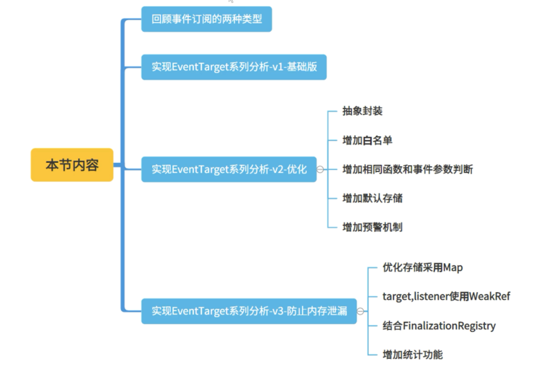
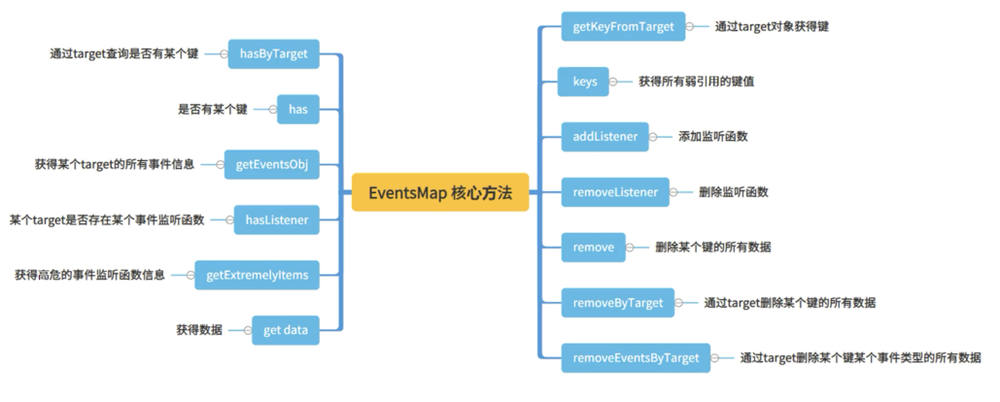
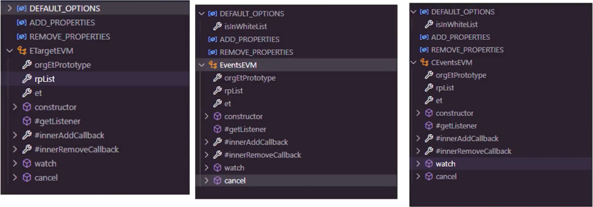
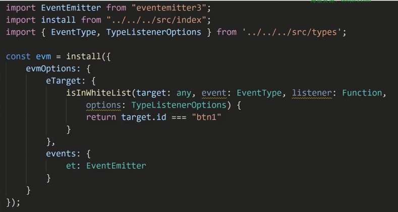

#  综合案例-事件分析库

工作中，我们会对window, DOM节点，WebSoket, 或者单纯的事件中心等注册事件监听函数。主要分析事件监听，并排查因此可能导致的内存泄漏。 

主要讨论和分析几个技术点： 
1. 怎么准确知道某个对象或者函数是否被回收 
2. 常见事件监听函数的本质
3. 拦截方法常见方式 
4. 弱引用回收问题 
5. 如何裁定事件监...

## 事件分析库简介


常见的事件没有移除造成的事件泄漏


SPA 加剧事件泄漏


**自研事件分析库 - 功能**


**预警**


**高危统计**


**事件统计**


**多种事件类型**


## 事件监听函数泄漏分析


如何收集 DOM 事件监听函数

- 第三方库 getEventListeners


- Chrome 控制台 getEventListeners 方法获得单个 Node 的事件


- Chrome 控制台，Elements -> Event Listeners


- Chrome more tools -> Performance monitor 可以得到 JS Event Listeners，也就是事件总数，没有详细信息，只有统计总数。


**如何收集 DOM 事件监听函数**

- 目前没有现成的库或者 API 能够直接满足我们的需求
- 自动动手，丰衣足食

**事件监听的表象**


**事件监听的表象分析结果**


**事件监听分析的本质 - prototype**


**事件回调收集 - 改写原型上订阅和取消订阅**

- 收集事件监听信息
- 保持原有功能

**事件回调收集本质 - 方法拦截**


* 重写原来的方法
* 简单代理
* 继承方式
* 动态代理
* ES标准的的 Proxy
* ES标准的的 defineProperty
* ES标准的的 decotator


需拦截对象

<!--  -->
```ts
class TestObject{

   sum(arr){
        return  arr.reduce((sum , cur)=>{
            return sum  + cur;
        },0)
    }

    unique(key, ...arrs){
       const results = [];
       const keyMap = new Map();

       arrs.forEach(arr=>{
        arr.forEach(v=>{
            if(!keyMap.get(v[key])){
                keyMap.set(v[key], 1);
                results.push(v);
            }    
        });    
       })
       return results;
    }

    random(min, max){
        return   min +  Math.random()*(max - min)
    }
}
```

1. 简单重写原来的方法

```ts
function OProxyTestObject() {
    function _invoke(obj, method, args) {
        const startTime = Date.now();
        const result = Reflect.apply(method, obj, args);
        const endTime = Date.now();
        console.log(`简单代理-cost: ${method.name}`, startTime, endTime, endTime - startTime);
        return result;
    }

    var originSum = TestObject.prototype.sum;

    //重写原型方法
    TestObject.prototype.sum = function () {
        return _invoke(this, originSum, arguments);
    };

    var originRandom = TestObject.prototype.random;
    //重写原型方法
    TestObject.prototype.random = function () {
        return _invoke(this, originRandom, arguments);
    };

    var originUnique = TestObject.prototype.unique;

    //重写原型方法
    TestObject.prototype.unique = function () {
        return _invoke(this, originUnique, arguments);
    };

    return new TestObject(...arguments);
}
```

2. 继承拦截
```ts
class InheritTestObject extends TestObject{

    sum(arr) {
        return this._invoke("sum", arguments);
    }

    unique(key, ...arrs) {
        return this._invoke("unique", arguments);
    }


    random(min, max) {
        return this._invoke("random", arguments);
    }


    _invoke(method, args) {
        const startTime = Date.now();
        const result = super[method].apply(this, args);
        const endTime = Date.now();
        console.log(`继承-cost: ${method}`, startTime, endTime, endTime - startTime);
        return result;
    }
}
```

3. ES6 + 标准代理的 Proxy

```ts
function ProxyTestObject() {

    var proxy = new Proxy(TestObject.prototype, {
        get(target, propKey) {
            const method = target[propKey];

            if (typeof method !== "function") {
                return method;
            }

            // 方式一
            return function () {
                const startTime = Date.now();
                const result = method.apply(this, arguments);
                const endTime = Date.now();
                console.log(`标准代理-cost: ${propKey}`, startTime, endTime, endTime - startTime);
                return result;
            }

            // 方式二
            // return new Proxy(method, {
            //     apply(t, ctx, args){
            //         const startTime = Date.now();
            //         const result = Reflect.apply(...arguments);
            //         const endTime = Date.now();
            //         console.log(`标准代理-cost: ${propKey}`, startTime, endTime, endTime - startTime);
            //         return result;
            //     }
            // })

        }
    })
    return proxy;
}
```

4. ES5 + defineProperty 

```ts
function DefineP(Constructor, keys) {
    keys.forEach(p => {
        const method = Constructor.prototype[p];
        Object.defineProperty(Constructor.prototype, p, {
            value() {
                const startTime = Date.now();
                const result = Reflect.apply(method, this, arguments)
                const endTime = Date.now();
                console.log("defineProperty cost:", p, startTime, endTime, endTime - startTime);
                return result;
            }
        })
    })
}
```

5. ES6 + 标准的 decotator

    

**理想型**


**Proxy**


## 事件监听函数泄漏分析 （下）


**如何准确的知道某个对象或者函数是否被回收**

- 一种直观有效的答案：弱引用 WeakRef + GC（垃圾回收）
- 什么要弱引用？因为我们不能因为我们的分析和统计影响对象的回收？不然分析肯定也不准了。

```ts
let target = {};
let wr = new WeakRef(target);

let obj = wr.deref();
if (obj) { // target 未被垃圾回收机制清除
  // ...
}
```

**弱引用**


未回收：
```ts
let target = {};
let wr = new WeakRef(target);
setTimeout(() => {
    window.gc();
    setTimeout(() => {
    let obj = wr.deref();
    if (!obj) {
        console.log("target 对象已被回收");
    } else {
        console.log("target 对象未被回收");
    }
    }, 3000);
}, 100);
```

回收：
```ts
; (function () {
    let target = {};
    let wr = new WeakRef(target);

    setTimeout(() => {
    window.gc();
    setTimeout(() => {
        let obj = wr.deref();
        if (!obj) {
        console.log("target 对象已被回收");
        } else {
        console.log("target 对象未被回收");
        }
    }, 3000);
    }, 100);
})();
```

**垃圾回收**


**选择什么样的数据结构存储**


**对那些数据弱引用**


**大致存储结构**


存储结构 - 问题


**FinalizationRegistry**

FinalizationRegistry 对象可以让你在对象被垃圾回收时请求一个回调


```ts
var theObject = {
    name: '测试对象',
}
var wfObj = new WeakRef(theObject);
var map = new Map();
map.set(wfObj, {
    someData: "...."
})
const registry = new FinalizationRegistry(({ wfObj }) => {
    console.log("被回收了");
    map.delete(wfObj);
    console.log("map.size:", map.size);
});
registry.register(theObject, { wfObj });
setTimeout(() => {
    window.gc();

    theObject = null;
}, 100);
```

**利用 FinalizationRegistry 删除关联 key**


**如何判断重复添加的事件监听函数 - EventTarget**


- EventTarget 有天然去重的本领
- 裁定是否相同回调函数的标准是：options 中的 capture 的参数值一致。 capture 默认值时 false。
- addEventListener 返回不是布尔值，而是 undefined

**如何判断重复添加的事件监听函数 - 泄漏的根本来源**


**何为相同函数？**

- 引用相同
- 利用toString 来判定（判定内容）


**to string 真的够了吗？**

- 我的函数就是一样的
- 内置函数：打印 `[native code]`
- 被 bind 的函数 `[native code]`

```ts
var obj = {
    getName: function fn() {
        console.log("a");
    }
}

var obj2 = {
    getName: function fn() {
        console.log("a");
    }
}

console.log(obj.getName.toString() === obj2.getName.toString());
```

```ts
const random = Math.random
console.log("name:", random.name, ",content:", random.toString())
console.log("name:", Math.pow.name, ",content:", Math.pow.toString())
// name: random ,content: function random() { [native code] }
```

```ts
function a(){
    console.log("name:", this.name)
}

console.log("name:", a.name, ",content:", a.toString())
var b = a.bind({})
console.log("name:", b.name, ",content:", b.toString())
// name: bound a ,content: function () { [native code] }
```

**检查内置函数和 bind 之后的函数**


重写 bind：
```ts
function log() {
    console.log("name:", this.name);
}

var oriBind = Function.prototype.bind;
var SymbolOriBind = Symbol.for("__oriBind__");
Function.prototype.bind = function () {
    var f = oriBind.apply(this, arguments);
    f[SymbolOriBind] = this;
    return f;
}

const boundLog = log.bind({ name: "哈哈" });
console.log("log:", boundLog[SymbolOriBind].toString());
```

识别 bind 函数：


**总结思路**


## 事件分析库：平民版本



回顾- 事件订阅的两种类型


**V1 版本**


创建可撤销的代理对象：
```ts
/**
 * 
 * 创建可撤销的代理对象
 * @param {any} obj 
 * @param {any} handler 
 * @returns 
 */
function createRevocableProxy(obj, handler) {
    return Proxy.revocable(obj, handler);
}
```

取消代理：
```ts
export function cancelWatch() {
    //撤销添加事件的代理对象
    rvAdd.revoke();
    //撤销移除事件的代理对象
    rvRemove.revoke();
    //还原
    ep.addEventListener = orgEventTargetPro.addEventListener;
    ep.removeEventListener = orgEventTargetPro.removeEventListener;
}
```

代理拦截函数：
```ts
//创建可撤销代理，监听事件添加
rvAdd = createRevocableProxy(ep.addEventListener, createApplyHandler(innerAddCallback));
ep.addEventListener = rvAdd.proxy;

//创建可撤销代理，监听事件移除
rvRemove = createRevocableProxy(ep.removeEventListener, createApplyHandler(innerRemoveCallback));
ep.removeEventListener = rvRemove.proxy;
```
```ts
/**
 * 
 * 创建代理处理函数
 * @param {any} callback 
 * @returns 
 */
function createApplyHandler(callback) {
    return {
        //对函数进行拦截
        apply(target, ctx, args) {
            callback(...[ctx].concat(args));
            return Reflect.apply(...arguments);
        }
    }
}
```

使用：（自己实现存储）
```ts
import { watch, cancelWatch } from "./evm.mjs";

//尝试使用WeakMap,因为WeakMap存储的为弱引用，防止可能因为我们的存储导致的内存泄漏。
const wp = new WeakMap();
watch(function (target, event, fn) {
    //观察到有添加事件,使用WeakMap来存储。
    let t = wp.get(target);
    if (!t) {
        t = Object.create(null)
        wp.set(target, t);
    }
    if (!t[event]) {
        t[event] = []
    }
    //添加同一类型的事件
    t[event].push(fn);
    console.log(wp);


}, function (target, event, fn) {
    let t = wp.get(target);
    if (!t) {
        return
    }
    if (!t[event]) {
        return;
    }
    //移除事件集合中一项
    const index = t[event].findIndex(f => f === fn)
    if (index >= 0) {
        t[event].splice(index, 1);
    }
    //移除事件类型
    if (t[event].length === 0) {
        delete t[event]
    }
    //移除target 所有
    if (Object.keys(t).length === 0) {
        wp.delete(target)
    }
    console.log(wp);
});
```

**V2优化**


优化后的流程：


V2 的问题：


**V3 优化**


V3 存储结构优化


利用 FinalizationRegistry：
```ts
  #listenerRegistry = new FinalizationRegistry(
    ({ weakRefTarget }) => {
      console.log("clean up ------------------");
      if (!weakRefTarget) {
        return;
      }
      this.#eventsMap.remove(weakRefTarget);
      console.log("length", [...this.#eventsMap.data.keys()].length);
    }
  )
```

增加统计：
```ts
  /**
   * 统计功能
   * @returns 
   */
  async statistics() {
    //默认调用垃圾回收
    if (isFunction(window.gc)) {
      window.gc();
    }
    const { run } = delay(undefined, 1000);

    await run();

    const data = this.data;
    const keys = [...data.keys()];
    const d = keys.map(wr => {
      const el = wr.deref();
      if (!el) return null;
      const events = data.get(wr);
      return {
        type: toString.call(el),
        id: el.id,
        class: el.className,
        events: Object.keys(events).reduce((obj, cur) => {
          obj[cur] = events[cur].map(e => {
            const fn = e.listener.deref();
            if (!fn) return null;
            return fn.name;
          }).filter(Boolean)
          return obj
        }, Object.create(null))
      }
    })

    return d;
  }
```


## 事件分析库：高可复用黄金版本


**抽象封装-支持可扩展**


增强 EventEmitter 的支持


增强 Compoent-emitter 类型：


增强 UI 能力 - UIRender：


**核心功能一览**


代码结构：


**EventsMap.ts**



**BaseEvm.ts**


**抽象代理方法（checkAndProxy）**

- 需要被代理的对象
- 代理后需要执行的方法
- 需要代理那些属性

```ts
/**
 * 检查属性，并产生代理
 * @param prototype 
 * @param callback 
 * @param ckProperties 
 * @param proxyProperties 
 * @returns 
 */
export function checkAndProxy(prototype: any, callback: Function, ckProperties: string[], proxyProperties: string[] = ckProperties) {
    let fn;
    const proto = prototype

    // 检查方法
    for (let i = 0; i < ckProperties.length; i++) {
        if (!hasOwnProperty(proto, ckProperties[i])) {
            continue;
        }
        fn = proto[ckProperties[i]];
        if (isFunction(fn)) {
            break;
        }
    }

    if (!isFunction(fn)) {
        return null;
    }

    const rpProxy = createFunProxy(fn, callback);
    if (!rpProxy) {
        return null;
    }

    // 替换方法
    proxyProperties.forEach(pname => {
        if (hasOwnProperty(proto, pname) && isFunction(proto[pname])) {
            proto[pname] = rpProxy.proxy
        }
    })

    return rpProxy;
}
```

**watch and cancel**

```ts
  watch() {
    super.watch();
    let rp;
    // addListener addEventListener on prependListener
    rp = this.checkAndProxy(this.et.prototype, this.#innerAddCallback, ADD_PROPERTIES);
    if (rp !== null) {
      this.rpList.push(rp);
    }
    // removeListener removeEventListener off
    rp = this.checkAndProxy(this.et.prototype, this.#innerRemoveCallback, REMOVE_PROPERTIES);
    if (rp !== null) {
      this.rpList.push(rp);
    }

    return () => this.cancel();
  }

  cancel() {
    super.cancel();
    this.restoreProperties(this.et.prototype, this.orgEtPrototype, ADD_PROPERTIES);
    this.restoreProperties(this.et.prototype, this.orgEtPrototype, REMOVE_PROPERTIES);
    this.rpList.forEach(rp => rp.revoke());
    this.rpList = [];
  }
```

**cancel - restoreProperties 方法**

```ts
/**
 * 还原属性方法
 * @param prototype 
 * @param orPrototype 
 * @param properties 
 */
export function restoreProperties(prototype: any, orPrototype: any, properties: string[]): void {
    const proto = prototype;
    const oriProto = orPrototype;

    properties.forEach(pname => {
        if (hasOwnProperty(proto, pname) && isFunction(proto[pname])) {
            prototype[pname] = oriProto[pname]
        }
    })
}
```

**onBind 工具类**

```ts
let oriBind: any, isOverride = false, oriToString: any;

const symbolKey = `__xyz_symbol_key_zyx__(~!@#$%^&*()_+)__`;

export const SymbolForBind = Symbol.for(`${symbolKey}`);

export function undoBind() {
    if (!isOverride) {
        return;
    }
    delete oriBind[SymbolForBind];
    Function.prototype.bind = oriBind;
    Function.prototype.toString = oriToString;
}

const { hasOwnProperty } = Object.prototype;
export function doBind() {
    oriBind = Function.prototype.bind;
    if (hasOwnProperty.call(oriBind, SymbolForBind) || isOverride) {
        return undoBind;
    }
    oriToString = Function.prototype.toString;

    const overrideBind: (thisArg: any, ...args: any[]) => Function = (
        function (oriBind) {
            return function overrideBind(this: any) {
                if (typeof this !== "function") {
                    throw new Error("必须是一个函数")
                }

                let fun: any;
                fun = oriBind.apply(this as any, arguments as any);
                if (hasOwnProperty.call(this, SymbolForBind)) {
                    fun[SymbolForBind] = this[SymbolForBind];
                } else {
                    fun[SymbolForBind] = this;
                }
                return fun;
            }

        }
    )(oriBind);

    (overrideBind as any)[SymbolForBind] = true;
    Function.prototype.bind = overrideBind;
    Function.prototype.toString = function (this:any) {
        if(hasOwnProperty.call(this, SymbolForBind)){
            return this[SymbolForBind].toString();
        }
        return oriToString.call(this);
    }
    isOverride = true;
    return undoBind;
}
```

**ETargetEVM、Events、CETargetEVM**



基本使用：


EventTarget 系列：




Events 系列：


