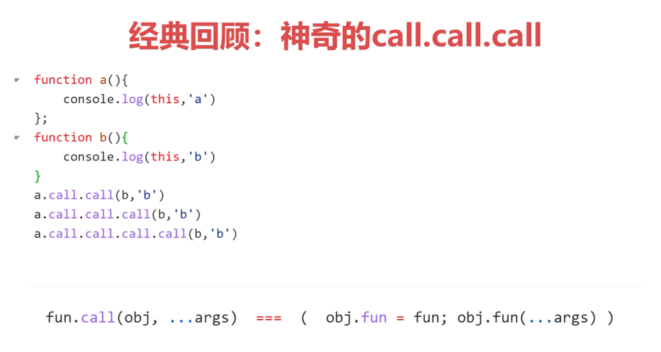
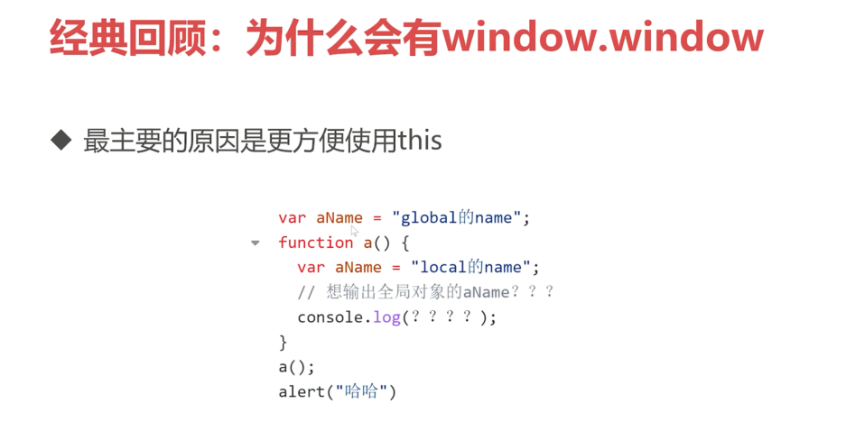
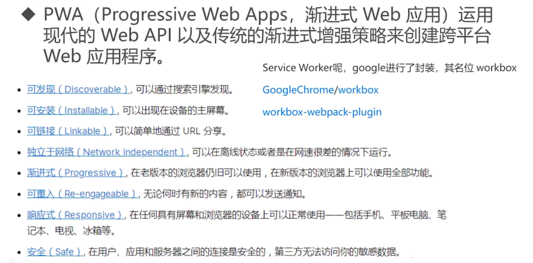
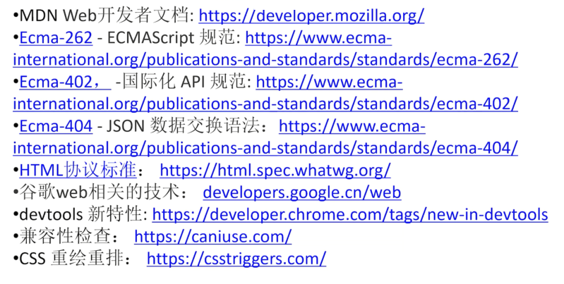

# 总结

经典回顾：

## 学习探讨：远行起航

**不止步 web 前端**

前端知识图谱：
- https://roadmap.sh/frontend

github 明星项目：
- https://risingstars.js.org/2021/zh

流行的趋势：PWA

低代码：

微前端：

小程序：

Web 3D：
- canvas + webgl 让网页3D 蓬勃发展
- 商品展示，活动游戏，大屏数据等
- three.js、oasis-angine 移动优先的高性能 Web 图形引擎等

## 学习建议

- 基础是根本
- 实践是检验真理的唯一标准，多动手
- 空杯心态
- 坚持就是胜利
- "拿来"主义

## 推荐的电子书

## 推荐的网站

## 其他

