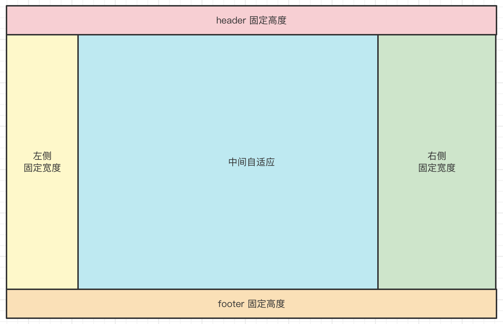
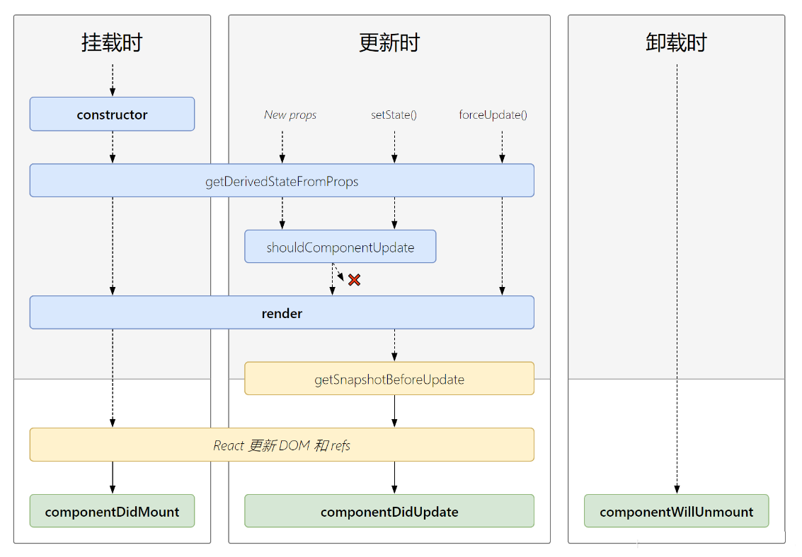

# 一面

很多面试官一上来就手撕算法，但我觉得要筛选候选人要从前端基础和应用开始，这是通关的第一步。

算法不好，前端基础好，能干活。但算法刷的挺好，前端基础不扎实，那没法干活。

## CSS

### HTML 中默认的 block inline inline-block 元素

解答
- block `<div>` `<p>` `<h1>` `<form>` `<hr>` 等
- inline `<a>` `<b>` `<span>` `` 等
- inline-block `<input>` `<button>` 等

注意事项
- 不用说那么全面，能说出常用的几个就可以，表示你知道他们的区别
- `` 是 inline 元素，说出来
- `<table>` 不是 block ，而是 `display: table`

想知道什么：
- CSS HTML 的基础知识
- 对于 CSS 中的 block 和 inline 的理解，这是关键(流式布局)
- 前期基础知识部分将对面试官产生重要的影响和判断

### CSS 选择器优先级

如下代码，三个 `<p>` 分别是什么颜色？

```html
<style>
    #container p { color: blue; }
    div #p1, div #p2 { color: red; }
    #container p.yellow-text { color: yellow; font-weight: bold; }
    div p.green-text { color: green; font-weight: bold; }
    div p { color: gray; }
</style>

<div id="container">
    <p id="p1" class="yellow-text">100</p>
    <p id="p2" class="green-text">200</p>
    <p id="p3">300</p>
</div>
```

解答
- 选择器优先级 id > class > tag
- 组合选择器要看整体的权重
- 越具体的，权重越高

参考 css-selector-priority.html

想知道什么：
- CSS 基础知识是否扎实
- 前面的基础题会影响面试官对候选人的初步印象
- 不是直接问，而是出一个场景题（避免死记硬背）


### CSS 布局 “四合院”

如下图，宽度和高度都撑满浏览器。用 HTML + CSS 实现。



注意
- HTML 语义化 （如有导航时，用 `<nav>`）
- 高度撑满浏览器（纵向 flex + `html { height: 100% }` ）
- 清除 body 默认的 `margin` `padding`

代码参考 css-layout.html

- CSS 布局(常用 flex 布局)
- CSS 基础是否扎实（还可能是定位、选择器优先级、盒子模型等
- CSS 基础扎实会给面试官留下好印象

### CSS 盒子模型

如下代码，`<div>` 的宽度、高度分别是多少？ 

```html
<style>
    #box {
        width: 200px;
        height: 100px;
        margin: 15px 20px;
        padding: 10px 5px;
        border: 5px solid #ccc;
    }
</style>

<div id="box">
    计算当前 div 的尺寸
</div>
```

追问1：如果把宽度限制到 240px ，该如何处理？ —— *答案：`box-sizing: border-box;`*

追问2：
    - 如果设置 `width: 100%` ，浏览器会否出现滚动条？
    - 如何不让浏览器有滚动条，而保持 div 宽度撑满？—— *答案：去掉 `width` 让 div 自适应宽度*

代码参考 css-box-model.html

流式布局的特点

想知道什么：
- CSS 基础知识是否熟练
- 再如：布局、定位、响应式等
- CSS 不会考太多，但基础题很重要

### CSS 水平垂直居中

对于一个尺寸不确定的 div ，进行水平垂直居中，有几种方法？

代码参考 css-center.html

注意事项：
- 注意条件“尺寸不确定”
- 知道几种说几种，不要完全放弃
- CSS居中是常考内容，要提前刻意准备

想知道什么：
- CSS 基础：布局、定位、盒子模型、响应式
- 对于必考题，是否提前准备过面试题？是否重视这次面试？
    - 重视：尊重时间价值

### CSS 定位 - CSS 实现抽屉效果

使用 HTML + CSS 实现一个网页右侧的抽屉。要求

- 网页加载时，抽屉不显示
- 1s 之后显示抽屉，3s 之后隐藏抽屉
- 显示和隐藏最好要有 transition 效果

代码参考 css-drawer.html

想知道什么：
- CSS 基础知识
- 页面功能的设计能力
- 手写代码的熟练程度

### CSS 如何实现黑白主题变化

使用 CSS var

```css
/* 定义变量 */
:root, :host {
    --color: #333;
    --bg-color: #fff;
}

/* 使用变量 */
p {
    color: var(--color);
    background-color: var(--bg-color);
}
```

- 使用 使用变量
- 使用 两个顶级 class 区别

想知道什么：
1. 通过主题考察实际项目经验，大型项目都有主题功能
2. 即便未做过，看是否日常关注常用技术，是否学习新知识
3. CSS 高级语法及应用(再如 calc

## JS

### JS 值类型 vs 引用类型

执行以下代码，分别输出什么？

```js
let a = 100
let b = a
b = 200
console.log('a', a)
```

```js
let obj1 = { x: 1 }
let obj2 = obj1
obj2.y = 2
obj2 = { y: 20 }
console.log('obj1', obj1)
```

答案
- `a 100`
- `obj1 { x: 1, y: 2 }`

- 逻辑思维 - 学会了不容易忘（JS执行，对战内存的变化，值类型引用类型
- 临时记忆的问题（CSS居中）-容易忘记
- 面试题临时记忆，一部分需要临时记忆

注意事项：
- 凡是变量（或属性）赋值的面试题，肯定有坑
- 值类型和引用类型，不仅面试考，工作更是常用

想知道什么：
- JS 基础知识是否扎实？（再如原型、闭包、异步等
- 是否熟悉 JS 引用类型和值类型，这很重要
- 如果考了两道 JS 基础知识，都不熟悉，可能会提前 pass 掉

### JS 你知道哪些数组 API

请说出常见的数组 API
- 功能
- 参数，返回值
- 是否会改变原数组？

必会：
- push
- unshift
- pop
- shift
- join 不改变原数组
- slice 不改变原数组
- splice 改变原数组
- sort 改变原数组
- toString
- indexOf
- lastIndexOf
- concat 不改变原数组
- forEach
- map
- filter

可选：
- reverse 改变原数组
- every
- some
- reduce

想知道什么：
- 对 JS 的熟练程度（数组是最常用的数据类型）
- 是否关注 API 的输入和输出（还是无脑用）
- 是否了解函数式编程、副作用（会否改变当前数组）

### JS 有没有用过 Map Set ？和 Object Array 的区别

- Map 有序结构，key 任意类型；Object 无序结构，key 两种类型（字符串或者 Symbol）
- Map 整体效率要比 Object 快很多，且 Map 是有序的可迭代的
- Set 可自动去重（如 Vue 异步更新时的任务队列 https://juejin.cn/post/7088894106113409032#heading-13 ）


想知道什么：
1. 是否学习和使用 ES6语法和 API，并熟悉新语法的好处
2. 即便没有用过，是否看过（Vue源码中用了 Map 和 Set
3. 有没有考虑性能和效率？

### JS 继承和原型

现有三种菜单：button 类型，select 类型，modal 类型。
- 共同特点
    - title icon 属性
    - isDisabled 方法（可直接返回 false）
    - exec 方法，执行菜单的逻辑
- 不同
    - button 类型，执行 exec 时打印 `'hello'`
    - select 类型，执行 exec 时返回一个数组 `['item1', 'item2', 'item3']`
    - modal 类型，执行 exec 时返回一个 DOM Element `<div>modal</div>`

用 ES6 语法写出这三种菜单的 class 。

源码参考 js-menu.js

想知道什么：
- ES class 和继承，语法是否熟练
- 业务理解能力（功能转化为设计和代码）
- 手写代码的熟练程度

### JS this 读代码题目

执行以下代码，打印出什么结果？

```js
// 普通函数和箭头函数 this
const obj = {
    f1() {
        const fn = () => { console.log('this1', this) }
        fn()
        fn.call(window)
    },
    f2: () => {
        function fn() { console.log('this2', this) }
        fn()
        fn.call(this)
    }
}
obj.f1() // 分别打印： this1 obj 和 this1 obj
obj.f2() // 分别打印： this2 window 和 this2 window
```

执行以下代码，打印出什么结果？

```js
// class 相关的 this
class Foo {
    f1() { console.log('this1', this) }
    f2 = () => { console.log('this2', this) }
    f3 = () => { console.log('this3', this) }
    static f4() { console.log('this4', this) }
}
const f = new Foo()
f.f1() // 打印 this1 f
f.f2() // 打印 this2 f
f.f3.call(this) // 打印 this3 f
Foo.f4() // 打印 this4 Foo
```

想知道什么：
- 通过 this 来评测 JS 基础知识是否熟练
- this 不仅会面试，在实际工作也很常见

### JS 自由变量

执行以下代码，打印出什么？

```js
let n = 10
function f1 () {
    n++
    function f2() {
        function f3() { n++ }
        let n = 20
        f3()
        n++
    }
    f2()
    n++
}
f1()
console.log('n', n)
```

// 12

自由变量 - 作用域

想知道什么：
- JS 基础知识是否扎实
- 还有可能会考 原型链、异步、闭包等
- JS 基础是判断是否通过的重要依据

### JS 闭包

以下代码输入什么？

```js
// 以下代码输出什么？
for (var i = 0; i < 10; i++) {
    setTimeout(() => {
        console.log(i)
    })
}
```

- setTimeout 返回的是什么？

追问：如何改造一下，让它输出 1-9 ？

```js
for (var i = 0; i < 10; i++) {
   (function(i) {
        setTimeout(() => {
            console.log(i)
        })
   })(i)
}
```

```js
for (let i = 0; i < 10; i++) {
    setTimeout(() => {
        console.log(i)
    })
}
```

let 块作用域、var 没有块作用域

学习：
1. 找准体系范围
2. 刻意训练
3. 及时反馈（重要）

浅层学习看输入，深入学习看输出

想知道什么：
1. JS 基础知识(闭包、原型链、异步)是否过关
2. 是否仅仅是"Vue 工程师"？

### JS 异步

说出一下代码的直接结果。

```js
console.log('start')
setTimeout(() => {
    console.log('a')

    Promise.resolve().then(() => {
        console.log('c')
    })
})
Promise.resolve().then(() => {
    console.log('b')

    setTimeout(() => { console.log('d')})
})
console.log('end')
```

答案 `start end b a c d`

追问：并画图（微任务、宏任务的队列）解释执行过程。

- 微任务、宏任务
- Event Loop 过程

Promise 微任务，setTimeout 是宏任务，在浏览器中微任务比宏任务先执行；

想知道什么：
- 继续考察 JS 基础知识
- 对 Event Loop 原理的理解
- 看是否刻意准备面试（异步是面试必考题
    - 希望你可以准备面试，相互尊重时间价值
    - 看候选人对面试的重要程度
    - （刻意去准备，但是面试的时候不能表现的太刻意

### JS 正则表达式

- 判断是否以数字开头 `^\d+`
- 判断合法变量名（只考虑英文，不考虑长度） `^[a-zA-Z\$_][a-zA-Z\$\d_]*$`

### JS 垃圾回收

- JS 内存垃圾回收使用什么算法？（标记清除）
- WeakMap WeakSet 的作用和场景
- “栈溢出”是什么？JS 执行和栈有什么关系？

JS 内存垃圾回收使用什么算法？
- 答案：标记清除
- 了解引用计数：IE67，JS对象和DOM对象，循环引用，清除不了，导致内存泄漏

WeakMap WeakSet 的作用和场景
- 场景：想临时记录数据或关系
- 防止内存泄漏

“栈溢出”是什么？JS 执行和栈有什么关系？
- 例如递归次数太多，导致 stack overflow
- stackoverflow.com 国外最大的程序员问答网站

扩展：尾递归-避免递归栈溢出（爆栈）

想知道什么：
- 对 JS 执行原理的了解程度
- 是否用过 WeakMap WeakSet
- 可以看出候选人的计算机基础知识

### ES6 和 TS 给开发带来的价值

- ES6 更规范的语法，降低开发成本，避免怪异问题
- ES6 执行效率更高：例如 async/await 比 Promise 执行更快
- TS 静态类型，开发大项目会更加稳定

注意事项：
- 知道多少就说多少，不要全部放弃
- 没用过没关系，看过学过也可以说

想知道什么：
- 是否用过 ES 新语法 和 TS
- 是否了解语法和 API 带来的好处
- 看是否积极主动的关注、使用新技术

## HTTP

### HTTP url 组成

url 有哪些组成部分？对应 `location` 的哪些属性？

- href
- origin
- protocol
- host （带端口）
- hostname
- port
- pathname
- search
- hash

追问：实现一个函数 `getParamValue(key)` ，通过传入 key 来获取 value

```js
function getParamValue(key) {
    const params = new URLSearchParams(location.search)
    return params.get(key)
}
```

想知道什么：
- 是否熟悉 HTTP 基础知识，URL 组成
- 是否了解一些高级 API，如 URLSearchParams
- HTTP 基础知识不熟悉，做不了前端

### HTTP 状态码

HTTP 常见状态码有哪些？

追问：如何实现跨域？（如果服务端不配合，你能实现跨域吗？）

追问：什么是图片防盗链？判断 Referer（来源）

描述浏览器的缓存策略：强制缓存、协商缓存

跨域方式有哪些： JSONP、CORS

想知道什么：
- HTTP 基础知识是否扎实
- 是否了解 HTTP 全流程（而非背诵面试题）
- 是否用过跨域？可判断是否做过大型项目

### HTTP 登录的方案

- Session （跨域传递 cookie）
- JWT （如何刷新 token 避免使用期间失效？）

### HTTP 为什么现代浏览器要禁用第三方 cookie ？

先说明 cookie 的作用，再说第三方 cookie ，以及 `same-site` 。
开放性问题，灵活作答。

答案：
- 为了用户的安全(安全和隐私是浏览器永恒的话题)
- 第三方 cookie 会记录用户的行为和数据，方便做广告
- 有些浏览器默认禁止，Chrome 增加了 SameSite（谷歌有广告业务）

## 框架应用

### Vue React 生命周期

写出 Vue React 组件常用生命周期。

解答
- Vue https://v3.cn.vuejs.org/guide/instance.html#%E7%94%9F%E5%91%BD%E5%91%A8%E6%9C%9F%E5%9B%BE%E7%A4%BA
- React 如下图



Vue 追问：Vue3 Composition API 的生命周期表示。

React 追问：
- Hooks 如何模拟组件生命周期？
- Hooks 中 useEffect useLayoutEffect 有什么区别？

继续追问：
- ajax 请求在哪个生命周期？
- 一个搜索页，搜索不同 keyword 后触发 ajax 请求，该如何设计？ 注意：
    - 页面初始化时默认请求
    - 搜索时的请求
    - 页面刷新时，保留之前的搜索结果（ keyword 要在 url 中）

想知道什么：
- Vue 基础知识是否扎实，Vue3生命周期变化
- 是否刻意准备过面试题（简单问题别忘了）
- 是否真正用过这些生命周期，而不仅仅是知道

### JSX 语法：手写 JSX 循环及判断

JSX 如何写循环、判断

追问：循环时注意 `key` 的作用

```jsx
<div>
    {isShow && <ul>
        {arr.map((item => {
            return <li key={item.id}>{item.text}</li>
        })}
    </ul>}
</div>
```

注意事项：
- 自由发挥的题目，随便写，没有限制，符合 JSX 语法即可
- 写循环时注意一定要有 key

想知道什么：
-  React 技术栈，是否熟悉 JSX 基本语法
- 看手写戴梦的熟悉程度，即实践和训练是否够多
- 如果 JSX 语法都不熟悉，那将不会再问 React 其他问题

### 组件通讯方式

React 或 Vue 组件通讯方式，以及场景。

解答：

React 组件通讯方式
- props 传递属性和方法
- context
- 自定义事件
- redux

Vue 组件通讯方式
- props 和 $emit
- 自定义事件
- $attrs
- $parent
- $refs
- provide / inject
- Vuex

### React useEffect

如下代码
- 设置定时器打印 value
- 点击按钮会增加 value 的值

问：按钮点击了 3 次后，定时器会打印什么值？

```jsx
function useEffectDemo() {
    const [value, setValue] = useState(0)

    useEffect(() => {
        setInterval(() => { console.log(value) }, 1000)
        // 答案：一直是 0 ，因为遇到了 Hooks “闭包陷阱”
    }, [])

    function clickHandler() {setValue(value + 1) }

    return <div>
        value: {value} <button onClick={clickHandler}>increase</button>
    </div>
}
```

追问：如何让定时器打印的值等于 value 的值呢？
- useEffect 依赖改为 `[value]`
- useEffect 及时清除定时器

源码参考 UseEffectDemo.js

### Vue3 自定义 v-model

如题，手写代码。

源码参考 VModelTest.vue

想知道什么：
- Vue3 应用的熟练程度
- 看是否刻意准备过面试题（该题很常见）
- 看编写代码的熟练程度

### React input 受控组件

如题，手写代码。

想知道什么：
1. 通过受控组件了解对 React 的基本应用
2. 手写代码，看对 React 代码模式的熟悉程度
3. React 表单开发很重要，也比较难，刻意顺势继续聊下去


### React setState 读代码

以下代码，分别打印出什么？最后显示什么？

```js
function useStateDemo() {
    const [value, setValue] = useState(100)
    function clickHandler() {
        setValue(value + 1)
        setValue(value + 1)
        console.log(1, value) // 100
        setValue(value => value + 1)
        setValue(value => value + 1)
        console.log(2, value) // 100
    }
    return <div>
        <span>{value}</span>
        <button onClick={clickHandler}>increase1</button>
    </div>
}
```

答案：分别打印 `1 100` 和 `2 100` ，DOM 显示 `103` 。

解释：
- setState 传入值，多次执行会合并
- setState 传入函数，多次执行不会合并
- state 异步更新，所以打印的 value 都是 100

继续，以下代码，分别打印什么，最后显示什么？

```js
function useStateDemo() {
    const [value, setValue] = useState(100)
    function clickHandler() {
        setTimeout(() => {
            setValue(value + 1)
            setValue(value + 1)
            console.log(1, value)
            setValue(value + 1)
            setValue(value + 1)
            console.log(2, value)
        })
    }
    return <div>
        <span>{value}</span>
        <button onClick={clickHandler}>increase1</button>
    </div>
}
```

答案：分别打印 `1 100` 和 `2 100` ，DOM 显示 `101`

解释：
- React18 中，setTimeout 中执行 setState 也会合并、异步更新
- React18 以前，setTimeout 中是同步更新、不合并

源码参考 UseStateDemo.js ，**注意 React18 带来的变化**

React setState 的更新机制：

- React18 中，DOM 事件和 setTimeout 中执行 setState 也会合并、异步更新
- React18 以前，DOM 事件和 setTimeout 中是同步更新、不合并

注意事项：
1. React setState 是必考，必须掌握
2. React setState 两大考点： 异步更新+合并
3. React 18 有所变化

### 路由动态参数

Vue-router 或 React-router 如何定义路由的动态参数？如何获取动态参数？

答案
- Vue-router https://router.vuejs.org/zh/guide/essentials/dynamic-matching.html
- React-router https://reactrouter.com/docs/en/v6/hooks/use-params

想知道什么：
- React 基本引用是否足够（Router是常用的工具）
- 是否真正配置过 router 规则（做过总会有印象的）

### Vue slot 应用场景

说明应用场景，并写出代码示例

答案：所有需要传入子组件的地方，例如各个 UI 库的 `<tabs>` `<dialog>` 等组件 https://element-plus.gitee.io/zh-CN/component/dialog.html

追问：React 如何实现 slot ？ —— 使用 `{props.children}` 获取子组件

想知道什么：
- 是否熟悉 Vue 高阶应用
- 是否用过复杂的Vue组件（复杂项目中很常用）
- 是否开发过类似的组件

### 封装一个“心跳”组件

封装一个心跳组件，组件每隔 1s 打印 `'hello'` 。

解答
- 封装组件，尽量使用 setTimeout （ setInterval 会有些坑《Vue.js 设计与实现》提到过 ）
- 组件卸载时，解绑事件

源码参考 HeartBeat.js 和 HeartBeat.vue

想知道什么：
1. 组件对定时器的处理 - 销毁时清除
2. 定时器有限用 setTimeout 实现(setInterval可能会遇到问题)
3. 手写 Raect 组件的熟练程度

### 手写简单的 Hooks 或者 Composition API （单独抽离出来）

在 `onMounted` 时，获取网页标题 `useTitle`
- 只获取，不设置
- 可获取，可设置（通过 input 双向绑定修改 title ）

假定一个全局函数 `getLocation` 可异步获取地理位置
- 成功返回 `{ errno: 0, data: { x: 100, y: 200 } }` 
- 失败返回 `{ errno: 1, msg: '错误信息' }` 

封装 useLocation
- 在 `onMounted` 时获取并显示
- 考虑 loading error 情况

源码参考 TitleTest.vue 和 LocationTest.vue

想知道什么：
- 是否熟悉 Vue3 Composition API
- 是否自己封装过 Vue3 Composition API
- Vue3 编码熟练程度

输入过多，输出过少。零散过多，体系过少，不要过于依赖视频，要依赖文档

### webpack 基本配置

webpack 配置文件中，有哪些配置项，例如 `mode` `entry` ...

答案参考文档 https://webpack.docschina.org/configuration/ ，能写出最重要的几个即可
- mode
- entry
- output
- module （其中有 rules 配置 loader）
- plugins
- devServer
- devtool
- resolve

追问：webpack 常用的 loader 有哪些？

答案：
- style-loader
- css-loader
- sass-loader
- postcss-loader
- babel-loader
- ts-loader
- file-loader
- url-loader
- raw-loader
- vue-loader
- eslint-loader

想知道什么：
- 是否了解 webpack 基本配置
- 是否真正配置过，而不是直接用脚手架
- 很多初学者不知道 webpack 配置，只会用脚手架

### babel 解决了什么问题？

webpack 和 babel 分别解决什么问题？

答案：
- webpack 解决的是模块（JS 和其他资源）和打包的问题
- babel 解决的是 ES 语法编译的问题

想知道什么：
- 不仅要用，还要知道它们的过程
- 是否了解编译的过程
- 能体现个人对计算机基础知识的了解程度