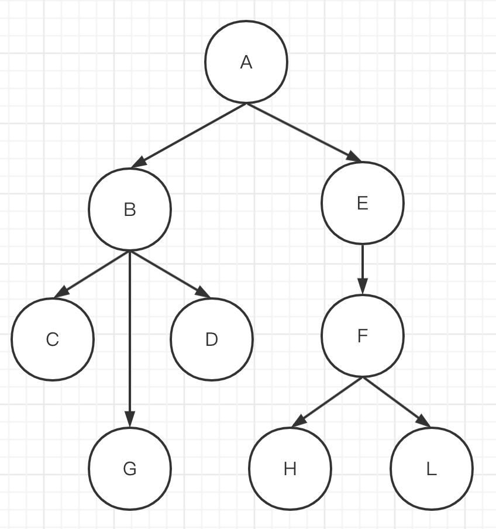
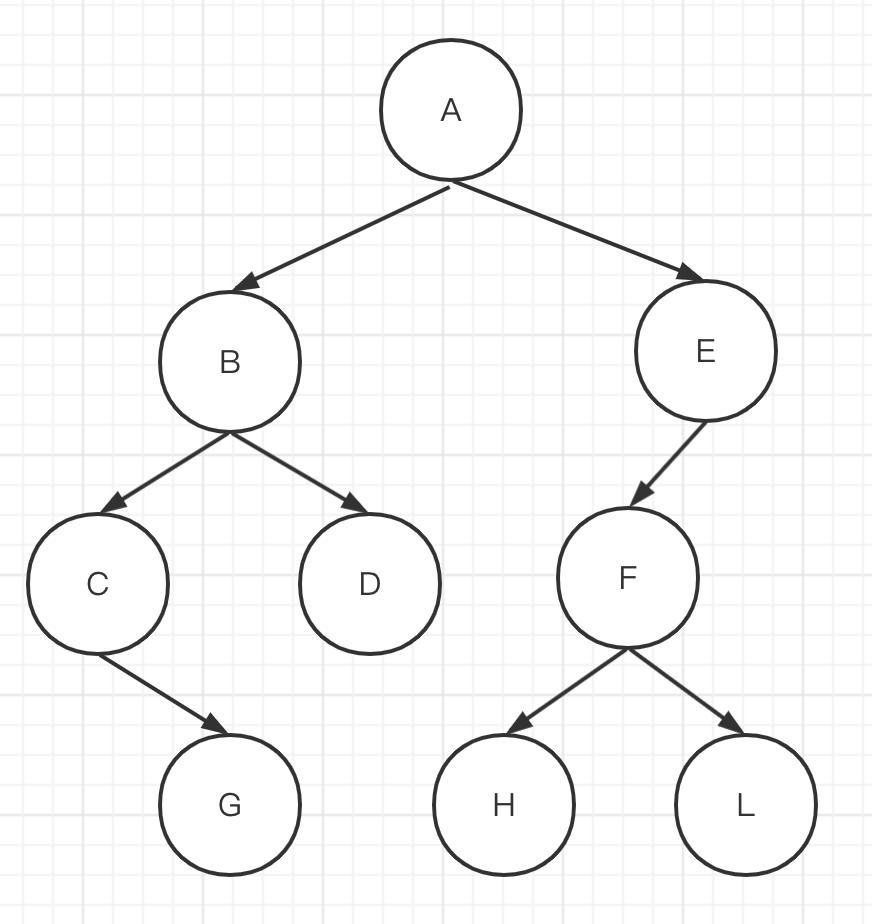
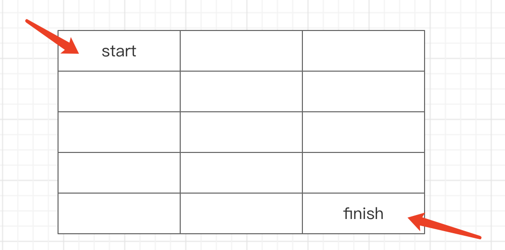
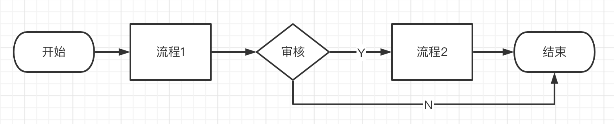

# 二面

## 算法

### 用栈来翻转字符串

输入 `A1B2C3` 返回 `3C2B1A` 。要求：用栈的特性，即只能数组的 `push` 和 `pop` 两个 API 。

解答
- 新建一个 stack
- 遍历字符串，入栈
- 逐个出栈

代码参考 js-reverse-str.html

- 栈：先进后出
- 队列：先进先出

想知道什么：
- 基础数据结构是否熟悉
- 设计一个场景，而不是直接问（避免死记硬背）
- 手写代码，看逻辑思维能力，以及 API 的熟练程度

### 二分查找

手写二分查找，并说明时间复杂度

答案：时间复杂度 `O(logn)` ，代码参考 js-binary-search.html

追问：给一个数组 `[1, 2, 3, 4, 5, 6, 7, 8, 9]` 查找 `2` ，二分会经过哪几个数，最终找到 `2` ？

注意事项：
- 基础算法，面试必考
- 算法不要死记硬背，要理解过程
- 算法要刻意准备，不能临场忘了

想知道什么：
- 基础算法是否熟练（如查找、排序、树的遍历等
- 时间复杂度的概念是否熟练
- 追问，看看是否真正理解了，而不是死记硬背

### 快速排序

手写快速排序，并说明时间复杂度。

答案：时间复杂度 `O(n*logn)` ，代码参考 js-quick-sort.html

追问：给一个数组 `[2, 1, 9, 7, 8, 6, 3, 5]` 写出排序的中间过程变化

注意事项：
1. 基础算法，面试必考
2. 算法不要死记硬背，要理解过程
3. 算法要刻意准备，不能临场忘了

想知道什么：
1. 基础算法是否学过，算法逻辑怎样
2. 时间复杂度是否熟练
3. 追问-是否真正理解算法过程，而非死记硬背


### 树的深度、广度优先遍历

给一个树：深度优先遍历的结果是什么？广度优先遍历的结果是什么？



追问：浏览器在渲染 DOM 树时，是深度优先渲染？还是广度优先渲染？ —— 答案：深度优先，浏览器是从内往外渲染。

追问：用 JS 表达这个树

```js
const treeNode = {
    value: 'A',
    children: [
        {
            value: 'B',
            children: [
                { value: 'C' },
                { value: 'G' },
                { value: 'D' }
            ]
        },
        {
            value: 'E',
            children: [
                {
                    value: 'F',
                    children: [
                        { value: 'H' },
                        { value: 'L' }
                    ]
                }
            ]
        }
    ]
}
```

追问：children 可以用对象表示吗？ —— 答案：不可以，必须是**有序**结构

### 二叉树的前、中、后序遍历结果

给一个二叉树，说明前、中、后序遍历结果。



追问：用 JS 对象表达这个二叉树。

```js
const binaryTreeNode = {
    value: 'A',
    left: {
        value: 'B',
        left: {
            value: 'C',
            right: {
                value: 'G'
            }
        },
        right: {
            value: 'D'
        }
    },
    right: {
        value: 'E',
        left: {
            value: 'F',
            left: { value: 'H' },
            right: { value: 'L' }
        }
    }
}
```

想知道什么：
- 基础数据结构是否熟悉？
- 可以体现计算机基础是否扎实
- 追问：体现是否真实的动手练习（而不是光看光学

### 求 并集 交集

给两个数组，求数组的交集和并集

```js
const arr1 = [1, 3, 4, 6, 7]
const arr2 = [2, 5, 3, 6, 1]

function getIntersection(arr1, arr2) {
    // 交集...
}

function getUnion(arr1, arr2) {
    // 并集...
}
```

解答
- 交集，转换为 Set ，因为 Set `has` 比数组 `includes` 快很多（前者 `O(1)` 后者 `O(n)`）
- 并集，直接 `add` 即可，利用 Set 去重特性

代码参考 js-set.html

想知道什么：
- 集合，是否考虑用 Set？(对 ES 新语法的敏感度)
- 是否考虑算法的时间成本（Set 比数组操作更快）
- 手写代码，看逻辑思维能力，以及 API 熟练程度

### 合并两个递增数组

给两个递增数组，将他们拼接为一个新的递增数组，要考虑时间复杂度。

```js
const arr1 = [1, 3, 5, 7, 9]
const arr2 = [2, 4, 6, 8]

// 得到结果：[1, 2, 3, 4, 5, 6, 7, 8, 9]
```

解答
- 直接用 `concat` 和 `sort` ，时间复杂度高。因为有排序，复杂度至少是 `O(n*logn)`
- 使用双指针，时间复杂度 `O(m + n)`

代码参考 js-concat-arr.html

注意事项：
1. 所有的算法都要考虑时间复杂度，不能只考虑功能
2. 要擅长捕获“递增”等特点，给出来就是让你利用的
3. 没思路时，写写画画或许能出来

想知道什么：
1. 有没有时间复杂度的敏感性
2. 如果不会，给出提示，临时解决问题的能力
3. 整体的逻辑思维能力

### 用 JS 实现一个队列

实现：入队、出队、长度

解答：
- 尽量使用链表做队列，数组会影响性能
- 从 tail 入队， 从 head 出队 （反过来不好操作）
- length 要及时记录，不要计算链表的长度

代码参考 js-queue.html

- 队列：入队出队（先进先出） Array push pop
- 栈：入栈出栈（先进后出） Array unshift pop

时间复杂度：
- arr.push('A') // O(1)
- for 遍历数组 // O(n)
- 两层 for 遍历嵌套的数组 // O(n^2)

数组是一个连续的内存空间
- unshift 的复杂度是 O(n)

使用链表
- 队列 - 链表 O(1)

想知道什么：
- 对于基础数据结构（队列）的理解
- 算法复杂度的理解，是否有这个敏感度
- 手写代码的熟练程度，逻辑思维能力

### 动态规划 - 路径数

如下图。有一个 m * n 格子，一个人从左上角 start 位置，每次只能向右或向下移动一步。要走到右下角 finish 位置，总共有多少条路径？



解答
- 经典的动态规划问题（可借鉴斐波那契数列、青蛙跳台阶）
- 要走到 `i,j` 点，要么从 `i-1,j` 向右，要么从 `i,j-1` 向下
- 所以 `f(i,j) = f(i-1,j) + f(i,j-1)`

源码参考 js-dynamic-paths.html

扩展：
- 青蛙跳台阶

想知道什么：
- 对于`动态规划`的理解（再如斐波那契数列、背包问题等）
- 是否刻意准备过算法面试题（动态规划问题常考）
- 手写代码的熟练程度，逻辑思维能力

## 框架原理

### 如何理解“数据驱动视图”

结合 Vue 或 React ，以及之前 jQuery 方式的区别

解答：
- jQuery 时代要去手动修改 DOM
- Vue React 数据驱动视图，只修改 data 和 state 即可，视图会自动更新
- 解放 DOM 操作，让开发人员更加关注数据和业务，提高开发效率和稳定性

想知道什么：
- 看是否了解框架的设计初衷和价值
- 思考问题方式，是否有独立思考能力

### Vue3 响应式原理

写代码演示，实现一个最简单的 reactive （不仅有响应式，还有 effect 函数）

```js
function reactive(obj) { /* todo... */ }
function effect(fn) { /* todo... */ }

const user = reactive({ name: '张三' })
effect(() => { console.log('name', user.name) })

// 修改属性，自动触发 effect 内部函数执行
user.name = '张三'
setTimeout(() => { user.name = '李四' }, 1000)
```

追问：
- 如果是深层数据，如何监听？
- 相比于 Vue2 有什么优势？（对数组、Map 的支持，初始化的效率）

代码参考 js-vue-reactive.html

想知道什么：
- 是否了解过 Vue3 原理
- 如何实现数据响应式(看技术深度和细节)
- 逻辑思维能力，代码组织的能力

### Vue3 ref 原理

答案：ref 就是把值类型封装为一个对象，然后再调用 reactive

```js
function ref(val) {
    const wrapper = {
        value: val
    }
    
    // 定义一个 ref 的标记。在模板中可直接使用 ref 而不用 value ，就根据这个标记判断 （这跟响应式无关）
    // 【注意】使用 defineProperty 定义属性，只定义一个 value ，其他的（configurable, enumerable, writable）都默认是 false
    Object.defineProperty(wrapper, '__v_isRef', { value: true })
    
    return reactive(wrapper) // 使用 reactive 做响应式
}
```

### 描述 Vue 或 React 组件的更新过程

要点：
- Vue 模板，或 JSX 被提前编译为 render 函数，执行 render 函数生成 `vnode` ，patch 为 DOM
- Vue 响应式，或 React setState 触发组件更新，执行 render 函数，生成新的 `newVnode`
- `diff(newVnode, vnode)` 更新 DOM

### Vue3 比 Vue2 diff 算法带来的变化

要点：
- Vue2 双端比较
- Vue3
    - 双端比较 + 最长递增子序列
    - PatchFlag 静态标记、更新类型的标记
    - 静态变量提升、函数缓存等

核心点：
- Vue2 updateChildren 双端比较
- Vue3 updateChildren 增加了“最长递增子序列”（更快）
- Vue3 还增加了 patchFlag、静态提升、函数缓存等

想知道什么：
- 继续考察 Vue3 原理（Diff 算法很常考）
- 刻意体现对 VDom 概念的了解

### Vue 和 React 函数组件的区别

要点：
- Vue 函数组件没有生命周期和实例，比较简单。Vue 大部分普通组件是 JS Object。源码参考 FunctionalComponent.js
- React 函数组件功能就是完备的，可以通过 Hooks 实现各种功能。React 现在主推函数组件 + Hooks 

追问：Vue Composition API 可以用于函数组件吗？

注意事项：
- 不知道 Vue 可以说一下 React
- 不知道 React 可以说一下 Vue
- 开放性问题，感觉相关的、有价值的，都可以说一下

想知道什么：
- 对 Vue 函数组件的理解
- 对 React 函数组件和 Hooks 的理解
- 可以体现对 Vue 或 React 原理的理解

### 对比 Vue3 Composition API 和 React Hooks

相同点：设计目的一样，都是为了方便抽离公共逻辑，代码写起来比较相似。

不同点：
- Vue Composition API 可以获取组件实例。React Hooks 没有组件实例（纯函数）
- Vue Composition API 只在 setup 中注册一次，然后在组件相应生命周期会自动触发。React Hooks 在每次组件更新时都会执行。
- React Hooks 底层是链表，根据顺序来调用和匹配，所以不能在 for if 中使用 Hooks 。Vue Composition API 不会有这个烦恼。

### React 事件和 DOM 事件有什么区别？

要点：
- React 事件统一挂载到 root 节点上（在 React17 之前，挂载在 document ）
- React 组件中的事件，都是通过“合成事件”机制模拟的（如捕获、冒泡等）
- 这样做的目的就是为了兼容各个平台，而不仅限于 DOM 和浏览器

想知道什么：
1. 是否了解 React 原理？
2. 挖掘候选人的技术深度（评级时的参考标准）
3. 顺便了解候选人的学习习惯和学习方式

### 给一个 Vue 模板或 JSX 写出 render 函数和 VNode

PS：render 函数和 VNode 分开来问，当做两个问题

```html
<div class="container">
    <p @click="onClick" data-name="p1">
        hello <b>{{name}}</b>
    </p>
    
    <my-component :title="title"></my-component>
</div>
```

```jsx
<div className="container">
    <p onClick={onClick} data-name="p1">
        hello <b>{name}</b>
    </p>
    
    <MyComponent title={title}></MyComponent>
</div>
```

答案 - render 函数

```js
function render() {
    return h('div', {
        props: {
            className: 'container'
        },
    }, [
        // <p>
        h('p', {
            dataset: {
                name: 'p1'
            },
            on: {
                click: onClick // 变量
            }
        }, [
            'hello ',
            h('b', {}, [name]) // name 变量
        ])
        
        // 
        h('img', {
            props: {
                src: imgSrc // 变量
            }
        }, [ /* 无子节点*/ ])

        // <MyComponent>
        h(MyComponent, { // MyComponent 变量
            title: title // 变量
        }, [ /* 无子节点*/ ])
    ])
}
```

答案 - VNode

```js
const vnode = {
    tag: 'div',
    props: {
        className: 'container'
    },
    children: [
        // <p>
        {
            tag: 'p',
            props: {
                dataset: {
                    name: 'p1'
                },
                on: {
                    click: onClick // 变量
                }
            },
            children: [
                'hello ',
                {
                    tag: 'b',
                    props: {},
                    children: [name] // name 变量
                }
            ]
        },

        // 
        {
            tag: 'img',
            props: {
                src: imgSrc // 变量
            },
            children: [ /* 无子节点*/ ]
        },

        // <MyComponent>
        {
            tag: MyComponent, // 变量
            props: {
                title: title // 变量
            },
            children: [ /* 无子节点*/ ]
        }
    ]
}
```

注意事项：
1. 写 render 函数没有统一的标准，能表达出来即可
2. 注意 JSX 中常量和变量
3. 注意 JSX 中 HTML tag 和自定义组件

面试官想知道什么：
1. 考察框架原理，因为一个题目是不够的
2. VDOM 是框架原理的核心部分，有没有掌握？
3. 不是直接问，而是通过一个场景来写，避免死记硬背

### Vue React 为啥会用 VDOM

要点
- VDOM 并不比直接**精准**操作 DOM 更快
- 但 Vue React 是数据驱动试图，不好直接找出哪些 DOM 要更新。所以：
    - 1. 全局更新 DOM —— 这显然不可取，特别是组件较大时
    - 2. 通过 VDOM diff 找出要更新的 DOM 再更新 —— 这样可取，因为 VDOM 是 JS 操作，速度很快

## 项目设计

### 设计模式的应用场景

- 观察者模式（DOM事件），发布订阅模式（自定义事件）
- 装饰器模式 (Decorator)
- 代理模式 (Proxy)
- 迭代器模式(for...of Generator)

注意事项：
- 知道多少说多少，不要放弃
- 即便没有用过，学过看过也可以

想知道什么：
- 看对设计模式的了解
- 对 ES 高级语法是否有应用
- 设计模式，可以体现一个人的技术广度

### 劫持网页所有链接

劫持网页所有链接，点击跳转时，如果 href 同域则直接跳转，不是同域，则给出 confirm 提示。

```js
<ul>
    <li><a href="./index.html">首页</a></li>
    <li><a href="https://www.baidu.com/">百度</a></li>
</ul>
```

注意：
- 使用 DOM 事件代理，而不是绑定每个 `<a>`
- 统一转换为 `new URL()` 再比较 `origin`

源码参考 js-hijack-link.html

### 实现一个 input 的撤销重做功能

思路
- 维护一个 list 和一个 index
- change 时 push 到 list 且 index++ （去掉 index 后面的内容，那些是被 redo 抛弃的内容 —— 重要！！！）
- undo 时 index--
- redo 时 index++

源码参考 js-undo-redo.html

想知道什么：
1. 逻辑思维能力
2. 临场解决问题的能力

### 从 0 搭建一个开发环境，你需要考虑哪些方面？

- 代码仓库，发布到哪个 npm 仓库（如有需要）
- 框架 Vue React
- 代码目录规范
- 打包构建 webpack 等，做打包优化
- eslint prettier commit-lint
- pre-commit
- 单元测试
- CI/CD 流程
- 开发环境，预发布环境
- 开发文档

想知道什么：
- 是否有过从 0 开发项目的经验
- 项目考虑的是否全面，看技术视野
- 凭此可以判断候选人是否刻意培养为项目负责人

## 项目经历

### 介绍一个项目

- 项目的业务场景，前后流程（看是否是真实项目？）
- 最有成就感的事儿
- 遇到的难题技术问题有哪些，如何解决的

追问：开发的流程和角色，团队有多少个人？

- 研发流程 - 需求、设计、开发、CR、test 等
- 对接哪些角色？- PM UI QA RD 等
- 多人协作开发的过程，遇到代码冲突如何处理？

追问
- PM 增加需求，你该怎么办
- 如果让你做项目负责人，如何保证进度（站会，日报，风险及时评估和汇报）和质量（代码走查，单元测试等）？

要点：
- 面试必考，一定要提前准备（最好自己写1k字的稿子）
- 项目功能，业务流程
- 最有成就感的事或解决的难题 - 讲一个故事

想知道什么：
- 问前后流程、角色等 - 看是否真实项目
- 看个人表达能力，业务理解能力
- 看项目是否做出过成绩、踩过坑 - 这就是项目经验

个人项目
- 体现动手能力，解决问题能力

### 如果线上出现 bug ，该如何解决？

答案：
- 先回滚（重要！！！）
- 排查解决，测试，重新上线
- 组内复盘

想知道什么：
1. 是否经历过真实的线上项目流程？
2. 处理临时问题的能力
3. 是否有复盘的想法


- 流程、制度、规范、严格的监控
- 单词拼写错误，插件来检查提醒

## 其他

### 了解 WebAssembly 吗

要点
- JS 是解释型语言，不需要编译，直接在虚拟机（如 V8 引擎）中解释执行（虚拟机及时编译）
- C++ C Rust 等是编译型语言，它们能直接编译为机器语言，效率高。
- WebAssembly 就允许 C++ C Rust 等语言的编译结果，直接在浏览器环境运行
- WebAssembly 不是 JS 的代替品，而是 JS 的补充，用于某些大型复杂的场景，如网页 3D 、游戏、地图等场景

想知道什么：
- 计算机基础知识
- 相关语言的了解程度，解释型 vs 编译型
- 是否对前端新技术保持关注

### 自定义 DSL 流程图

自定义一个 XML 来描述邮件，可以自定义标签和属性。

```xml
<!-- 用 XML 描述一封邮件，可以自定义标签和属性 -->
<mail>
    <to>123@qq.com</to>
    <form>789@qq.com</from>
    <title color="red">邮件标题</title>
    <body>邮件标题</body>
</mail>
```

基于上述提示，请自定义 XML 来描述一个流程图：




参考答案

```xml
<chart>
    <start-end id="start">开始</start-end>
    <flow id="flow1">流程1</flow>
    <judge id="judge1">评审</judge>
    <flow id="flow2">流程2</flow>
    <start-end id="end">结束</start-end>
    <arrow from="start" to="flow1"></arrow>
    <arrow from="flow1" to="judge1"></arrow>
    <arrow from="judge1" to="flow2">Y</arrow>
    <arrow from="judge1" to="end">N</arrow>
    <arrow from="flow2" to="end"></arrow>
</chart>
<!-- 另，每个节点还可以加上 x y 的定位信息，尺寸，边框 -->
```

DSL 领域特定语言

想知道什么：
- 新知识的学习能力
- 是否主动沟通、咨询问题
- 逻辑思维能力
