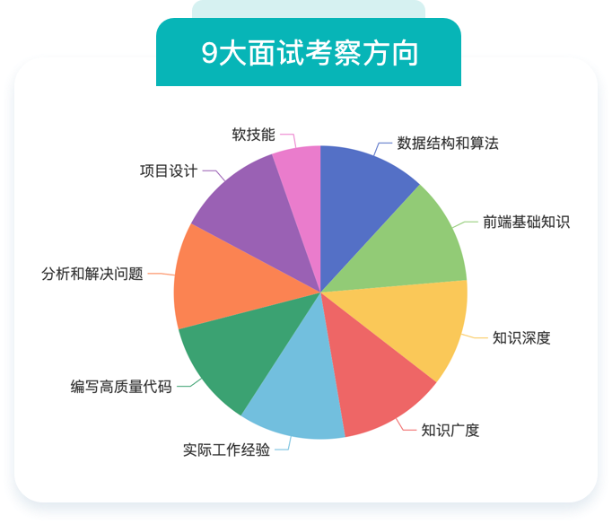

# 前端经验总结复盘

## 强化符合企业需求的个人素质

- 扎实的基础知识
- 写出高质量代码的能力
- 思路清晰地分析、解决问题能力
- 根据时间、空间复杂度优化算法
- 良好的沟通能力、极强的学习能力

## 初级知识点

CSS 基础知识
- 盒模型
- BFC
- float 浮动
- flex 布局
- 定位
- 响应式布局

JS 基础知识
- 值类型和引用类型
- 深拷贝
- 原型和原型链
- 继承
- 作用域
- 闭包
- this

Webpack 打包
- 基本配置
- 常用 loader
- 常用 plugin
- 优化构建速度
- 提取公共代码
- 热更新
- babel 编译

## 中级知识点

Vue2
- 组件生命周期
- 组件通讯方式
- computed 和 watch
- 自定义 v-model
- 响应式原理
- VDOM 和 Diff 算法
- 组件渲染过程

Vue3
- Composition API
- 组件生命周期
- reactive
- ref 和 toRef
- 自定义 Hook
- Proxy 重构响应式
- 模板编译优化

React17、18
- 组件生命周期
- 组件通讯方式
- state 和 setState
- 不可变数据
- 受控组件
- 组件性能优化
- Hooks 知识点

综合考察
- 前端性能优化
- 前端安全和预防
- 抓包和调试
- 项目设计能力
- 沟通表达能力
- 新知识学习能力

## 高级知识点

网络请求
- HTTP 状态码
- 手写 Ajax
- 跨域请求
- Restful API
- 浏览器缓存策略
- HTTPS 加密方式
- WebSocket 协议

JS 高级知识
- Promise 应用
- 手写 Promise
- async/await
- Event Loop
- 微任务宏任务
- Map 和 Set
- JS 内存模型和垃圾回收

数据结构和算法
- 时间复杂度
- 栈和队列
- 树和二叉树
- 数组和链表
- 查找和排序
- 动态规划
- 双指针

## More links

- [GitHub Home](https://github.com/ShenBao)
- [Blog Home](https://shenbao.github.io)
- [About Me](https://shenbao.github.io/about/)
