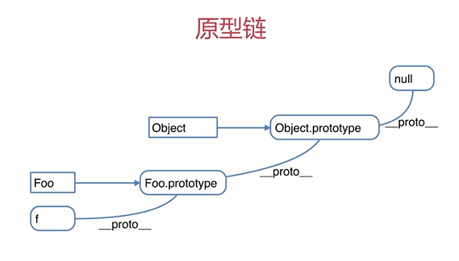

# 基础知识、原型和原型链

## 变量类型

问题

- JS 中使用 typeof 能得到哪些类型
- 何时使用 === 和 ==
- JS 中有哪些内置函数
- JS 变量按照存储方式区分为哪些类型，并描述其特点
- 如何理解 JSON

### 变量类型

内存中存储方式:

- 值类型
- 引用类型：对象、数组、函数

```js
// 值类型
var a = 100;
var b = a;

// 引用类型
var obj = {
  a: 100,
  b: 200,
};
var arr = [0, 10, 20];
```

typeof 运算符:

1. 'undefined'
2. 'boolean'
3. 'string'
4. 'number'
5. 'object'
6. 'function'

```js
typeof undefind     // undefind
typeof 'abc'        // string
typeof 123          // number
typeof true         // boolean

typeof {}           // object
typeof []           // object
typeof null         // object
typeof console.log  // function
```

`注意:`

```js
typeof null         // object
typeof NaN          // number

var obj = {}
var arr = []
var reg = /pop/g
console.log(typeof obj);    // object
console.log(typeof arr);    // object
console.log(typeof reg);    // object

// Safar5, Chrome7 之前的版本对正则对象返回 'function'
```

### 变量计算：强制类型变换

- 字符串拼接
- == 运算符
- if 语句
- 逻辑运算

```js
var a = 100 + 10    // 110
var b = 100 + '10'  // 10010

// 注意
100 == '100'        // true
0 == ''             // true
null == nudefind    // true
null === nudefind   // false
```

`总结： 0、空字符串、null、nudefind 转化为 false`

```js
var a = true;
if (a) { //true
  // ...
}

var b = 100;
if (b) { // true
  // ...
}

if ('') { // false
}

if (0) { // false
}

if (NaN) { // false
}

if (null) { // false
}

if (false) { // false
}

if (nudefind) { // false
}
```

```js
10 && 0         // 0
'' || 'abc'     // 'abc'
!window.abc     // true

// 判断一个变量会被当做 true 还是 false
var a = 100
console.log(!!a)
```

### 问题解答

JS 中使用 typeof 能得到哪些类型

- undefined ：当变量未定义或者是未赋值的 var 声明的变量时。
- boolean ：当值是布尔类型时。
- string ：当值是字符串类型时。
- number ：当值是数字类型时，包括整数和浮点数。
- bigint ：当值是 BigInt 类型时。
- symbol ：当值是 Symbol 类型时。
- function ：当值是函数对象时（这是一种特殊情况）。
- object ：对于对象类型，通常会返回 "object"。但是，如果对象是一个函数，则 typeof 会返回 "function"。对于 null 值，虽然它应该表示一个空或不存在的对象引用，但 typeof 会返回 "object"，这是一个历史遗留的错误。

```ts
console.log(typeof undefined);      // "undefined"
console.log(typeof true);          // "boolean"
console.log(typeof "hello");       // "string"
console.log(typeof 42);             // "number"
console.log(typeof BigInt(123456)); // "bigint"
console.log(typeof Symbol("foo"));  // "symbol"
console.log(typeof function(){});  // "function"
console.log(typeof {});             // "object"
console.log(typeof null);           // "object"（这是一个错误）
```

在使用 typeof 时，需要注意它对 null 的处理以及函数对象的特殊情况。对于更准确的类型检测，可以考虑使用 instanceof 运算符，或者使用第三方库如 Lodash 的 _.typeof 函数。

何时使用 === 和 ==

```js
if (obj.a == null) {
  // 这里相当于 obj.a === null || obj.a === nudefind，的简写形式
  // 这是 jquery 源码推荐的写法
}
```

JS 中的内置函数(数据封装类对象)

```js
Object
Array
Boolean
Number
String
Function
Date
RegExp
Error
```

JS 变量按存储方式:

- 值类型
- 引用类型

```js
var a = 10;
var b = a;
a = 11;
console.log(b); // 10

var obj1 = {
  x: 100,
};
var obj2 = obj1;
obj2.x = 110;
console.log(obj1.x); // 110
```

如何理解 JSON ?

JSON 是 JS 的内置对象，json 也是一种数据格式

```js
JSON.stringify({name: 'name'});
// "{"a":"name"}"

JSON.parse('{"name":"name"}');
// {name: "name"}

var obj = {
  name: 'name',
  age: 18,
};

// 空格个数必须小于 10，大于 10都会自动缩小为 10
JSON.stringify(obj, null, 4);
// "{
//     "name": "name",
//     "age": 18
// }"

JSON.stringify(obj, ['name'], 4);
// "{
//     "name": "name"
// }"

JSON.stringify(obj, null, '--');
// "{
// --"name": "name",
// --"age": 18
// }"

JSON.stringify(obj, function (key, value) {
  // 对 key 是 age 的字符串不进行序列化！
  if (key === 'age') {
    return undefined; // 返回 undefined 表示属性忽略
  }
  // 其它的字段正常序列化
  else {
    return value;
  }
});
// "{"name":"name"}"
```

## 原型和原型链

问题

- 如何准确的判断一个变量是数组类型
- 写一个原型链继承的例子
- 描述 `new` 一个对象的过程
- zepto（或其他框架）中如何使用原型链

知识点

- 构造函数：构造函数的首字母一般必须大写
- 构造函数 - 扩展
- 原型链规则
- 原型链
- instanceof

构造函数

```js
function Foo(name, age) {
  // this 就是一个空对象
  this.name = name;
  this.age = age;
  // return this;     // 默认有这一行
}

// 创建多个对象
var f = new Foo('ShenBao', 18);
var ff = new Foo('ZhangSan', 22);
```

扩展

```js
var a = {}; // 其实是 var a = new Object() 的语法糖
var a = []; // 其实是 var a = new Array() 的语法糖
function Foo() {
  /**...*/
} // 其实是 var Foo = new Function(//...) 的语法糖
```

使用 `instanceof` 判断一个函数是否是一个变量的构造函数

```js
var arr = [1, 2, 3];
arr instanceof Array; // true
```

### 原型链规则

- 所有的引用类型（数组、对象、函数），都具有对象的特征，即可自由扩展属性（`null` 除外）
- 所有的引用类型（数组、对象、函数），都有一个 `__proto__` 属性（隐式原型），属性值是一个普通的对象（`null` 除外）
- 所有的函数，都有一个`prototype`属性（显式原型），属性值是一个普通的对象
- 所有的引用类型（数组、对象、函数），`__proto__` 属性（隐式原型）指向它的构造函数的 `prototype` 属性值
- 当试图得到一个对象的某个属性时，如果对象本身没有这个属性，此时会去找他的 `__proto__`（即他的构造函数的 `prototype`）中寻找

```js
var obj = {};
obj.a = 100;

var arr = [];
arr.a = 100;

function fn() {}
fn.a = 100;

console.log(obj.__proto__);
console.log(arr.__proto__);
console.log(fn.__proto__);

console.log(fn.prototype);

console.log(obj.__proto__ === Object.prototype);
```

原型规则示例

```js
// 构造函数
function Foo(name) {
  this.name = name;
}
Foo.prototype.alertName = function () {
  alert(this.name);
};

// new
var f = new Foo('zhangsan');
f.printName = function () {
  console.log(this.name);
};

// test
f.alertName();
f.printName();
f.toString(); // 要去 f.__proto__.__proto__ 中去查找
```

循环对象自身属性

```js
var obj = {
  name: 'name',
  age: 18,
};

for (item in obj) {
  if (obj.hasOwnProperty(item)) {
    console.log(item);
  }
}

// 高级浏览器已在 for in 中屏蔽来自原型的属性
// 但建议加上，保证程序的健壮性

// obj.hasOwnProperty(prop) 用来判断某个对象是否含有指定的属性的 Boolean
```

重点：原型链的查找方式



instanceof 用于判断引用类型属于哪个构造函数的方法

## 解题

- 如何准确判断一个变量是数组类型

```js
var arr = [];
arr instanceof Array; // true
typeof arr; // "object",  typeof 是无法判断是否是数组的
```

- 写一个原型链继承的例子

```js
// 动物
function Animal() {
  this.eat = function () {
    console.log('animal eat');
  };
}

// 狗
function Dog() {
  this.bark = function () {
    console.log('dog bark');
  };
}

Dog.prototype = new Animal();

// 哈士奇
var hashiqi = new Dog();
```

`描述 new 一个对象的过程`：

1. 创建一个新对象
2. this 指向这个新对象
3. 执行代码，即对 this 赋值
4. 返回 this

```js
function Foo(name, age) {
  this.name = name;
  this.age = age;
  // return this;     // 默认有这一行
}

var f = new Foo('ShenBao', 18);
var ff = new Foo('Zhangsan', 22);
```

zepto（或其他框架)中如何使用原型链：

- 阅读源码是高效提高技能的方式
- 但不能"埋头苦钻"，有技巧在其中
- "zepto 设计和源码分析"

封装一个 DOM 查询

```js
function Elem(id) {
  this.elem = document.getElementById(id);
}

Elem.prototype.html = function (val) {
  var elem = this.elem;
  if (val) {
    elem.innerHTML = val;
    return this; // 链式操作
  } else {
    return elem.innerHTML;
  }
};

Elem.prototype.on = function (type, fn) {
  var elem = this.elem;
  elem.addEventListener(type, fn);
  return this;
};

var div1 = new Elem('div1');
console.log(div1.html());

div1.html('hello js');
div1.on('click', function () {
  console.log('click');
});

div1.html('hello js').on('click', function () {
  console.log('click two');
});
```
