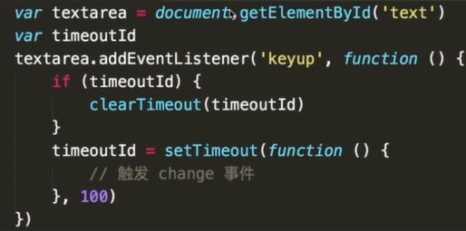

## 运行环境

问题
- 从输入url 到得到 html 的详细过程
- window.onload 和 DOMContentLoaded 的区别

知识点
- 加载资源的形式
- 加载一个资源的过程
- 浏览器渲染页面的过程


加载资源的形式
- 输入 url（或跳转页面） 加载 html
- html 中的资源


加载资源的过程：
- 浏览器根据 DNS 服务器得到域名的 IP 地址
- 向这个IP的机器发送 http(s) 请求
- 服务器收到、处理返回 http(s) 请求响应
- 浏览器得到返回内容


浏览器渲染页面的过程：
- 根据 HTML 结构生成 DOM tree
- 根据 css 生成 CSSOM
- 将 DOM 和 CSSOM 整合成 RenderTree
- 浏览器根据 RenderTree 开始渲染和展示
- 遇到`<script>`时，会执行并阻塞渲染


思考：为何把 css 放在 head 中？

```js
window.addEventListener('load', function(){
    // 页面资源全部加载完成才回去执行，包括图片、视频
});

window.addEventListener('DOMContentLoaded', function(){
    // DOM渲染完成即可执行，此时图片视频还可能没有加载完成
});
```


## 性能优化

原则：
- 多使用内存，缓存，或者其他方法
- 减少 CPU 计算，减少网络


从哪里入手：加载页面、加载静态资源、页面渲染


加载资源优化：
- 静态资源的合并压缩
- 静态资源的缓存
- 使用cdn让资源加载更快
- 使用SSR后端渲染，数据直接输出到html中


渲染优化：
- CSS放在前面，js放在后面
- 懒加载：图片懒加载、下拉和加载更多
- 减少 DOM 操作，对 DOM 做缓存(减少查询)
- 减少 DOM 操作，多个操作尽量在一起执行(合并操作)
- 事件节流(change换为keyup，假如100毫秒没有输入再触发change,使用clearTimeout和setTimeout的妙用)
- 尽早执行操作：DOMContentLoaded


缓存：
- 通过链接名称控制缓存
- 只有内容改变时，链接名称会改变


SSR后端渲染:
- vue、react提出来了这样的概念
- jsp、php、asp都属于后端渲染


懒加载:
```js


var img1 = document.getElementById('img');
img1.src = img.getAttribute('data-realsrc');
```

DOM 查询变量存储

合并 DOM 插入

创建标签时,优化`createDocument` 为 `createDocumentFragment`

事件节流




## 安全性

- XSS 跨站请求攻击
    - 插入一段 script
    - 攻击代码，获取 cookie ，传至自己的服务器

处理：
1. 前端替换关键字，例如替换 `<` 为 `&lt;` `>` 为 `&gt;` 
2. 后端替换

- XSRF 跨站脚本伪造
    - 增加验证流程，指纹、密码、短信验证


## 技巧

- 简介明了，重点突出项目经历和解决方案
- 博客，定时更新
- 开源项目

<!-- 如何看待加班？加班就像借钱，救急不救穷
千万不可挑战面试官，不要反考面试官
学会给面试官惊喜，但不要太多
遇到不会的问题，说出知道的也可以
说说你的缺点 --- 说一下最近在学什么就可以了 -->

## 其他

- Progressive Web Apps: 渐进式网页应用
- Accelerated Mobile Pages：加速的移动页面
- WebAssembly：字节码技术
