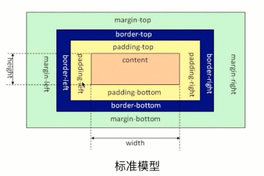
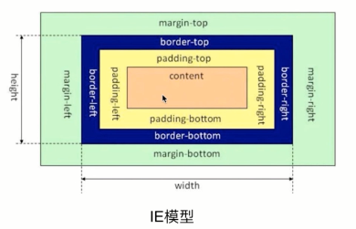

# CSS盒模型

问题
- 说说对css盒模型的认识


技术点：
- 基本概念：标准模型 + IE模型
- 标准模型和IE模型的区别
- css如何设置这两种模型的
- js如何设置获取盒模型对象的宽和高
- 实例题：根据盒模型解释边距重叠
- BFC（边距重叠解决方案）、IFC


标准模型



IE模型




css如何设置这两种模型的
```css
/* 标准模型 */
box-sizing: content-box;  // (默认)

 /*IE模型*/
box-sizing: border-box;
```


js如何设置获取盒模型对象的宽和高
```js
// 这种方式只能取到dom元素内联样式所设置的宽高，也就是说如果该节点的样式是在style标签中或外联的CSS文件中设置的话，通过这种方法是获取不到dom的宽高的。
dom.style.width/height

// 这种方式获取的是在页面渲染完成后的结果，就是说不管是哪种方式设置的样式，都能获取到。(仅IE支持)
dom.currentStyle.width/height  // (仅IE支持)

// 这种方式的原理和2是一样的，这个可以兼容更多的浏览器，通用性好一些。
window.getComputedStyle(dom).width/height  // (chrome\Firefox)

// 这种方式是根据元素在视窗中的绝对位置来获取宽高的
dom.getBoundingClickRect().width/height

// 这个就没什么好说的了，最常用的，也是兼容最好的。
dom.offsetWidth/offsetHeight
```


实例题：根据盒模型解释边距重叠
```html
<style media="screen">
  #sec {
    background: #f00;
    box-sizing: border-box;
  }

  .child {
    height: 100px;
    margin-top: 10px;
    background: yellow
  }
</style>
<section class="box" id="sec">
  <article class="child"></article>
</section>
```
`overflow: hidden;`时高度变为110px


### BFC（边距重叠解决方案）

BFC的基本概念：
BFC全称”Block Formatting Context”, 中文为“块级格式化上下文”。

原理:
1. BFC元素的垂直方向的边距发生重叠
1. BFC区域不会与浮动元素的box重叠
1. BFC在页面上是一个独立的容器
1. 计算BFC的高度，浮动元素也会参与计算


创建BFC的条件：
- float的值不为none。（脱离文档流）
- overflow的值为auto,scroll或hidden。
- display的值为table-cell, table-caption, inline-block，flex,inine-flex中的任何一个。
- position的值不为relative和static，即position为absolute或fixed。
- 根元素


BFC的使用场景：
- 自适应两栏布局
- 清除内部浮动 
- 防止垂直margin重叠


```html
<!-- BFC垂直方向边距重叠 -->

  <section id="margin">
    <style>
      #margin {
        background: pink;
        overflow: hidden;
      }

      #margin>p {
        margin: 5px auto 25px;
        background: red;
      }
    </style>
    <p>1</p>
    <div style="overflow:hidden">
      <p>2</p>
    </div>
    <p>3</p>
  </section>

  <!-- BFC不与float重叠 -->

  <section id="layout">
    <style media="screen">
      #layout {
        background: red;
      }

      #layout .left {
        float: left;
        width: 100px;
        height: 100px;
        background: pink;
      }

      #layout .right {
        height: 110px;
        background: #ccc;
        overflow: auto;
      }
    </style>
    <div class="left"></div>
    <div class="right"></div>
  </section>

  <!-- BFC子元素即使是float也会参与计算 -->

  <section id="float">
    <style media="screen">
      #float {
        background: red;
        overflow: auto;
        /*float: left;*/
      }

      #float .float {
        float: left;
        font-size: 30px;
      }
    </style>
    <div class="float">我是浮动元素</div>
  </section>
```


## 扩展链接：

http://www.zhangxinxu.com/wordpress/2015/02/css-deep-understand-flow-bfc-column-two-auto-layout/

https://www.cnblogs.com/chengzp/p/cssbox.html


