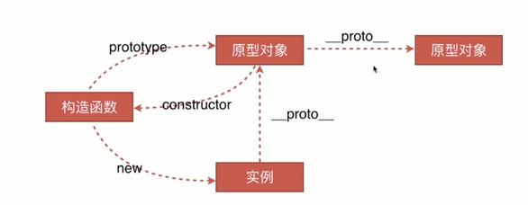
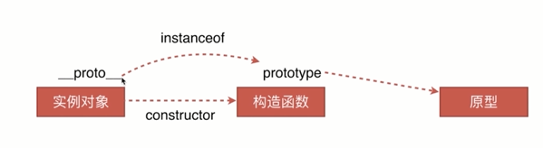
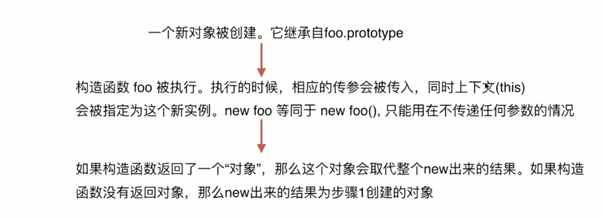

# 原型链

目标

- 创建对象有几种方法
- 原型、构造函数、实例、原型链
- instanceof的原理
- new运算符

## 创建对象的方法

```js
// 第一种方式：字面量
var obj1 = {
    name: 'obj1'
};

var obj2 = new Object({
    name: 'obj2'
});

// 第二种方式：构造函数
var Fn = function() {
    this.name = "fn";
};
var obj3 = new Fn();

// 第三种方式：Object.create
var P = {
    name: 'Object.create'
};
var obj4 = Object.create(P);
obj4.name
obj4.__proto__.name
```


## 原型、构造函数、实例、原型链



```js
var M = function (name) {
    this.name = name;
};
var o3 = new M('o3');

M.prototype.say = function () {
    console.log('say hi');
};
var o5 = new M('o5');

M.prototype.constructor === M;    // true

o3.__proto__ === M.prototype    // true

M.__proto__ === Function.prototype    // true

o3 instanceof M     // true

o3 instanceof Object    // true

M.prototype.__proto__ === Object.prototype  // true

o3.__proto__.constructor === M      // true

o3.__proto__.constructor === Object     // false

```

## instanceof



- instanceof的原理:实例对象的`__proto__`和构造函数的prototype是不是同一个引用
- 只要在原型链上，instanceof的值就返回true
- 当前对象的__proto__.constructor的引用是创建它的水下

## new运算符



```js
var M = function (name) { 
    this.name = name;
};
M.prototype.say = function () {
    console.log('say hi');
};

var new2 = function (func) {
    var o = Object.create(func.prototype);
    var k = func.call(o);
    if (typeof k === 'object') {
        return k;
    } else {
        return o;
    }
};

obj6 = new2(M);

obj6 instanceof M;  // true

obj6 instanceof Object;  // true

obj6.__proto__.constructor === M;   // true
```
