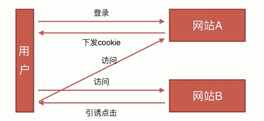

# 安全类

- CSRF
- XSS

CSRF全名是Cross-site request forgery,跨站请求伪造

CSRF攻击原理

CSRF防御:

- 通过 referer、token 或者 验证码 来检测用户提交。
- 尽量不要在页面的链接中暴露用户隐私信息。
- 对于用户修改删除等操作最好都使用post 操作 。
- 避免全站通用的cookie，严格设置cookie的域

XSS，Cross-site scripting:跨站脚本攻击

XSS的原理
- 攻击者对含有漏洞的服务器发起XSS攻击（注入JS代码）。
- 诱使受害者打开受到攻击的服务器URL。
- 受害者在Web浏览器中打开URL，恶意脚本执行。

XSS的攻击方式:

（1）反射型： 发出请求时，XSS代码出现在URL中，作为输入提交到服务器端，服务器端解析后响应，XSS随响应内容一起返回给浏览器，最后浏览器解析执行XSS代码，这个过程就像一次发射，所以叫反射型XSS。

（2）存储型: 存储型XSS和反射型的XSS差别就在于，存储型的XSS提交的代码会存储在服务器端（数据库，内存，文件系统等），下次请求目标页面时不用再提交XSS代码。

XSS的防御措施:

（1）编码：对用户输入的数据进行HTML Entity编码 
这里写图片描述 

（2）过滤：移除用户上传的DOM属性，如onerror等，移除用户上传的style节点，script节点，iframe节点等。

（3）校正：避免直接对HTML Entity编码，使用DOM Prase转换，校正不配对的DOM标签。

