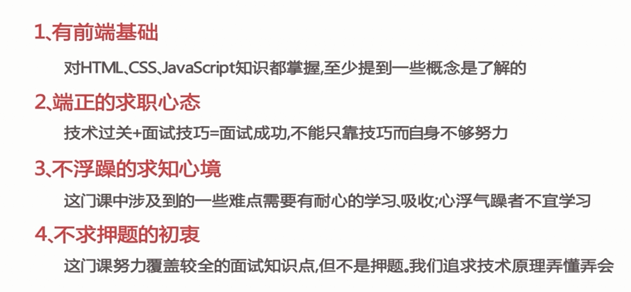
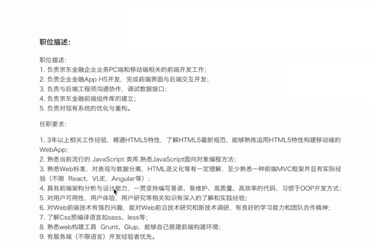
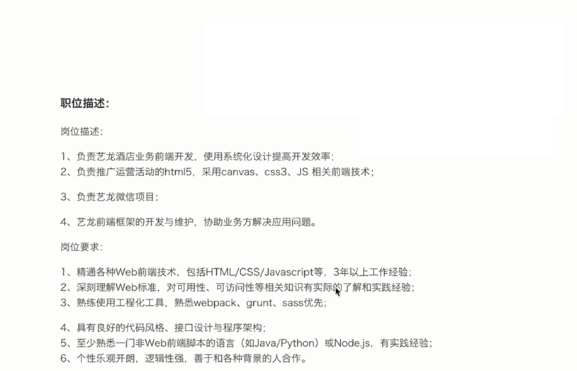
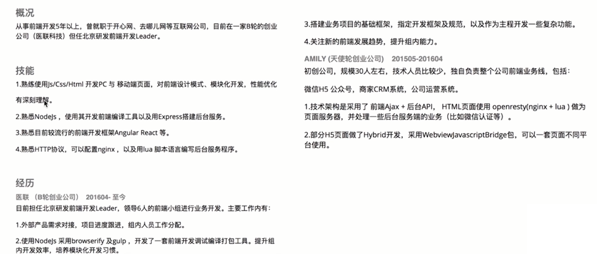

# 前提

- JD 描述怎么看
- 简历怎么写
- 知识怎么复习
- 问题怎么回答
- 项目怎么准备
- 和负责人怎么沟通
- HR 印象怎么留

## 准备

- JD 描述分析
- 业务分析
- 技术栈准备
- 自我介绍

## 第一部分

- 页面布局
- CSS 盒模型
- DOM 事件
- HTTP 协议
- 原型链
- 面向对象
- 通信
- 前端安全
- 前端算法

## 第二部分

- 渲染机制
- js 运行机制
- 页面性能
- 错误监控

## 第三部分

- 技巧
- 业务能力
- 团队协作能力
- 带人能力

## 第四部分

- 技巧
- 职业竞争力
- 职业规划

耐心学习、吸收，不心浮气躁

## 其他

知识、能力、经验

<!--  -->
<!--  -->

<!-- 

 -->
