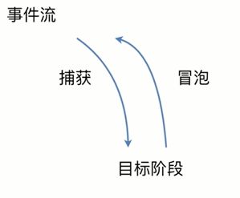
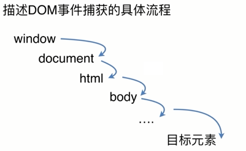

# DOM 事件

技术点：
- 基本概念：DOM 事件的级别
- DOM 事件模型（冒泡和捕获）
- DOM 事件流
- 描述 DOM 事件捕获的具体流程
- Event 对象的常见应用
- 自定义事件


事件级别：DOM 标准定义的级别

- DOM0: `element.onclick = function(){}`
- DOM1：制定标准时没有涉及到事件相关的
- DOM2: `element.addEventListener('click', function(){}, false)`
- DOM3: `element.addEventListener('keyup', function(){}, false)`


事件模型
```
       捕获
        ->
事件流 ----- 目标阶段
        <-
        冒泡
```




描述 DOM 事件捕获的具体流程
```js
window
   |
   v
document
   |
   v
  html
   |
   v
  body
   |
   v
  ...
   |
   v
目标元素
```




Event 对象的常见应用
```js
event.preventDefault()          // 阻止默认行为

event.stopPropagation()         // 阻止冒泡行为

event.stoplmmediatePropagation() // 注册的多事件，阻止往下继续执行；阻止剩余的事件处理函数的执行，并防止当前事件在DOM树上冒泡。

event.currentTarget             // 返回绑定事件的元素

event.target                    // 返回触发事件的元素
```


### 自定义事件（CustomEvent）

```js
event = new CustomEvent(type [, eventInitDict])
```

类似于 Event 事件的构造函数进行工作，除了可选的 eventInitDict 参数现在还允许设置 detail 属性。

```js
const event = new CustomEvent('newMessage', {
    detail: {
        message: 'Hello World',
        time: new Date(),
    },
    bubbles: true,
    cancelable: true,
    }
);

// detail：提供有关事件的自定义信息的子对象。
// bubbles：如果为 true，事件将冒泡到触发事件的元素的祖先。
// cancelable：如果为 true，可以使用事件对象的 stopPropagation() 方法取消事件传播。
```

```js
// 首先创建一个事件
let myEvent = new CustomEvent("userLogin", {
    detail: {
        username: "davidwalsh"
    }
});

// 发起事件
myElement.dispatchEvent(myEvent);
window.dispatchEvent(myEvent);
```

自定义监听事件
```js
var eve = new Event('custome');
element.addEventListener('custome', function() {
    console.log('custome');
});
element.dispatchEvent(eve);
```

在 react 中的应用：最好在 componentDidMount 中调用 addEventListener 监听事件，在 componentWillUnmount 中调用 removeEventListener 移除事件监听器。

代码
```html
<!DOCTYPE html>
<html>

<head>
    <meta charset="utf-8">
    <title>Event</title>
</head>

<body>
    <div id="ev">
        <style media="screen">
            #ev{
            width: 300px;
            height: 100px;
            background: red;
            color: #fff;
            text-align: center;
            line-height: 100px;
          }
        </style>
        目标元素
    </div>
    <script type="text/javascript">
        var ev = document.getElementById('ev');

        ev.addEventListener('click', function (e) {
            console.log('ev captrue');
        }, true);

        window.addEventListener('click', function (e) {
            console.log('window captrue');
        }, true);

        document.addEventListener('click', function (e) {
            console.log('document captrue');
        }, true);

        document.documentElement.addEventListener('click', function (e) {
            console.log('html captrue');
        }, true);

        document.body.addEventListener('click', function (e) {
            console.log('body captrue');
        }, true);


        function testFn() {
            console.log('test dispatch');
        }
        var eve = new Event('test');
        ev.addEventListener('test', testFn);
        setTimeout(function () {
            ev.dispatchEvent(eve);

            //  移除事件
            // ev.removeEventListener('test', testFn);
        }, 1000);

    </script>
</body>

</html>
```

MDN 链接：
https://developer.mozilla.org/en-US/docs/Web/API/CustomEvent