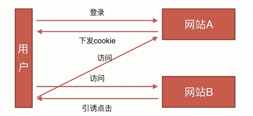

# 安全类

- CSRF
- XSS

## CSRF

CSRF 全名是 Cross-site request forgery ，跨站请求伪造

CSRF 攻击原理：

CSRF 防御：

- 通过 referer、token 或者 验证码 来检测用户提交。
- 尽量不要在页面的链接中暴露用户隐私信息。
- 对于用户修改删除等操作最好都使用 post 操作 。
- 避免全站通用的 cookie，严格设置 cookie 的域

1. 加 Token 验证：
    访问接口的时候，浏览器自动上传 cookie，但是没有手动上传一个 Token，这个 Token 是你注册成功以后，或者没有注册，只要你访问了这个网站，服务器会自动的向你本地存储一个 Token，在你访问各种接口的时候，如果没带 Token，就不能帮你通过验证，如果只是点击了引诱链接，这个链接只会自动携带 cookie，不会自动携带 Token，所以就避免了那个攻击。

2. Referer 验证：
   Referer 指的是页面来源，如果服务器判断页面来的是不是我的这个站点下面的页面，如果是就执行你这个动作，如果不是就拦截。

3. 隐藏令牌：
    和 Token 有点像，做法：隐藏在 http 的 head 头中，不会放在链接上，这样就做的比较隐蔽。本质上没有太大区别。只是使用方式有一点差别。

## XSS（Cross-site scripting：跨站脚本攻击）

XSS 的原理：

- 攻击者对含有漏洞的服务器发起 XSS 攻击（注入 JS 代码）。
- 诱使受害者打开受到攻击的服务器 URL。
- 受害者在 Web 浏览器中打开 URL，恶意脚本执行。

XSS 的攻击方式:

- （1）反射型： 发出请求时，XSS 代码出现在 URL 中，作为输入提交到服务器端，服务器端解析后响应，XSS 随响应内容一起返回给浏览器，最后浏览器解析执行 XSS 代码，这个过程就像一次发射，所以叫反射型 XSS。
- （2）存储型：存储型 XSS 和反射型的 XSS 差别就在于，存储型的 XSS 提交的代码会存储在服务器端（数据库，内存，文件系统等），下次请求目标页面时不用再提交 XSS 代码。

XSS 的防御措施:

- （1）编码：对用户输入的数据进行 HTML Entity 编码
- （2）过滤：移除用户上传的 DOM 属性，如 onerror 等，移除用户上传的 style 节点，script 节点，iframe 节点等。
- （3）校正：避免直接对 HTML Entity 编码，使用 DOM Prase 转换，校正不配对的 DOM 标签。
